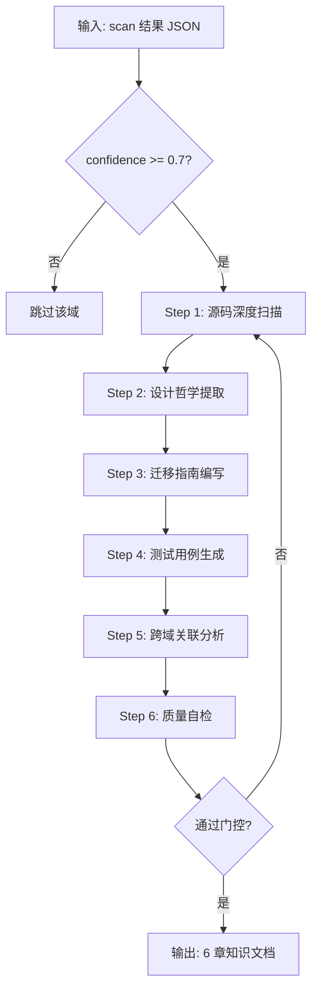

# butcher-doc — 特性知识文档生成引擎

从 butcher-scan 的扫描结果出发，为每个匹配的问题域生成标准化 6 章知识文档。

---

## 产品定位

butcher-scan 负责"切"（扫描 + 匹配），butcher-doc 负责"写"（深度分析 + 文档生成）。
本 skill 是知识库的文档生产线，输出可直接复用的工程组件方案。

## 触发条件

- "生成文档" / "写文档" / "doc" / "整理特性"
- butcher-scan 完成后自动触发（confidence >= 0.7 的域）
- 手动指定：`/butcher-doc PD-XX <repo_path>`

## 输入

两种输入方式：

### 1. 从 scan 结果自动获取

```json
{
  "project": "deer-flow",
  "repo": "https://github.com/bytedance/deer-flow",
  "repo_path": "/tmp/butcher-scan-deer-flow",
  "matches": [
    {
      "domain_id": "PD-02",
      "title": "多 Agent 编排",
      "confidence": 0.95,
      "files": ["src/graph/builder.py", "src/agents/coordinator.py"],
      "signals": ["orchestrator", "DAG", "LangGraph"],
      "source_files_detail": [...]
    }
  ]
}
```

### 2. 手动指定

```
域: PD-XX
仓库路径: /tmp/butcher-scan-<repo>
项目名: <name>
GitHub: <url>
```

## 工作流程



多域并行：每个匹配域启动独立子代理，互不干扰。

---

## 执行流程（每个域）

### Step 1: 源码深度扫描

**目标：** 理解该域在源项目中的真实实现，不是猜测。

1. 从 scan 结果的 `files` 和 `source_files_detail` 定位关键文件
2. 用 Read 逐文件阅读实际代码，记录：
   - 核心类名、函数名、方法签名（含参数类型和返回值）
   - 关键数据结构（Pydantic 模型、TypedDict、dataclass 等）
   - 设计模式（工厂、策略、观察者、管道等）
3. 追踪调用链：从入口函数开始，跟踪 2-3 层调用深度
4. 用 Grep 搜索 scan 结果中的 `signals` 关键词，发现遗漏文件

**最低要求：**
- 至少深入读取 3 个核心实现文件
- 至少记录 5 处 `file:line` 精确引用
- 至少提取 3 条核心设计理念，每条含理由

### Step 2: 设计哲学提取

基于 Step 1 的扫描结果，提取：
- 核心问题：该域要解决什么问题？为什么重要？
- 解法概述：该项目的解决方案（3-5 个要点）
- 设计思想表：

| 设计原则 | 具体实现 | 理由 | 替代方案 |
|----------|----------|------|----------|
| ... | ... | ... | ... |

### Step 3: 迁移指南编写

- 迁移清单：移植到自己项目需要做什么
- 适配代码模板：可直接复用的代码模板（不是伪代码）
- 适用场景矩阵：什么场景适合用这个方案

### Step 4: 测试用例生成

- 基于 Step 1 扫描到的真实函数签名编写测试
- 覆盖正常路径、边界情况、降级行为

### Step 5: 跨域关联分析

- 与其他问题域的关系（依赖、协同、互斥）
- 引用同项目其他已生成的域文档

### Step 6: 质量自检

逐项对照门控清单，不达标的补充后再输出。

---

## 6 章文档模板

文件名：`PD-XX-ProjectName-方案简述.md`
存放位置：`knowledge/solutions/`

```markdown
# PD-XX.NN ProjectName — 方案标题

> 文档编号：PD-XX.NN
> 来源：ProjectName `关键文件`
> GitHub：<repo_url>
> 问题域：PD-XX 域标题 英文标题
> 状态：可复用方案

---

## 第 1 章 问题与动机（≥ 30 行）

### 1.1 核心问题
（该问题域要解决什么问题，为什么重要）

### 1.2 ProjectName 的解法概述
（概述该项目的解决方案，3-5 个要点，每个含 file:line 引用）

### 1.3 设计思想
| 设计原则 | 具体实现 | 理由 | 替代方案 |
|----------|----------|------|----------|
| ... | ... | ... | ... |

---

## 第 2 章 源码实现分析（≥ 60 行，核心章节）

### 2.1 架构概览
（整体架构，关键组件关系，含架构图 ASCII/Mermaid ≥ 1 张）

### 2.2 核心实现
（关键代码分析，≥ 5 处 file:line 引用，包含实际代码片段 ≥ 2 段）

```python
# 示例：不是伪代码，是源项目的真实代码摘录
class ActualClassName:
    def actual_method(self, param: Type) -> ReturnType:
        ...
```

### 2.3 实现细节
（重要的实现细节和技巧，数据流图）

---

## 第 3 章 迁移指南（≥ 40 行）

### 3.1 迁移清单
（迁移到自己项目需要做什么，分阶段）

### 3.2 适配代码模板
（可直接复用的代码模板，≥ 1 段可运行代码）

### 3.3 适用场景
| 场景 | 适用度 | 说明 |
|------|--------|------|
| ... | ⭐⭐⭐ | ... |

---

## 第 4 章 测试用例（≥ 20 行）

（基于真实函数签名的测试代码）

```python
class TestCoreFunctionality:
    def test_normal_path(self): ...
    def test_edge_case(self): ...
    def test_degradation(self): ...
```

---

## 第 5 章 跨域关联

| 关联域 | 关系类型 | 说明 |
|--------|----------|------|
| PD-XX | 依赖/协同/互斥 | ... |

---

## 第 6 章 来源文件索引

| 文件 | 行范围 | 关键实现 |
|------|--------|----------|
| `path/to/file.py` | L45-L120 | 核心类定义 |

---

## 第 7 章 横向对比维度

> **重要：** 本章用于自动填充 Butcher Wiki 的横向对比表。
> 必须严格按以下 JSON 格式输出，放在 `comparison_data` 代码块中。

\```json comparison_data
{
  "project": "ProjectName",
  "dimensions": {
    "维度名1": "该项目在此维度的简短描述（≤30字）",
    "维度名2": "该项目在此维度的简短描述（≤30字）",
    "维度名3": "该项目在此维度的简短描述（≤30字）"
  }
}
\```

**维度选择规则：**

1. **优先复用已有维度** — 如果该问题域已有对比维度（见下方参考表），优先使用相同的维度名，确保跨项目可比
2. **可以新增维度** — 如果该项目有独特的工程特征不在已有维度中，可以自由新增维度。新维度会自动出现在对比表中
3. **维度命名要求** — 2-5 个中文字，名词性短语（如"缓存策略"、"并发模型"），不要用动词开头
4. **每个维度的值** — ≤30 字的简短描述，突出该项目的具体做法，不要泛泛而谈

**已有维度参考（优先复用）：**

| 域 | 已有维度 |
|----|----------|
| PD-01 | 估算方式、压缩策略、触发机制、实现位置、容错设计 |
| PD-02 | 编排模式、并行能力、状态管理、并发限制、工具隔离 |
| PD-03 | 截断/错误检测、重试/恢复策略、超时保护、优雅降级 |
| PD-04 | 工具注册方式、工具分组/权限、MCP 协议支持、热更新/缓存、超时保护 |
| PD-05 | 隔离级别、虚拟路径、生命周期管理、防御性设计、代码修复 |
| PD-06 | 记忆结构、更新机制、事实提取、存储方式、注入方式 |
| PD-07 | 检查方式、评估维度、评估粒度、迭代机制 |
| PD-08 | 搜索架构、去重机制、结果处理、容错策略、成本控制 |
| PD-09 | 暂停机制、澄清类型、状态持久化、实现层级 |
| PD-10 | 中间件基类、钩子点、中间件数量、条件激活、状态管理 |
| PD-11 | 追踪方式、数据粒度、持久化、多提供商 |
| PD-12 | 推理方式、模型策略、成本、适用场景 |

**示例 — 复用已有 + 新增维度：**

\```json comparison_data
{
  "project": "PageIndex",
  "dimensions": {
    "搜索架构": "LLM 推理式树搜索，无向量数据库",
    "去重机制": "树索引一次构建持久化为 JSON，检索时不传原文",
    "结果处理": "LLM 推理输出 thinking + node_list",
    "多模态支持": "Vision RAG：VLM 直接对 PDF 页面图片推理",
    "专家知识集成": "树搜索 prompt 中直接注入领域偏好"
  }
}
\```
上例中"搜索架构""去重机制""结果处理"复用了 PD-08 已有维度，"多模态支持""专家知识集成"是 PageIndex 独有的新维度。

### 域元数据补充

> **重要：** 本节用于自动丰富 Butcher Wiki 的问题域描述。
> 基于你对该项目在此域的深度分析，提供该域的补充元数据。
> 必须严格按以下 JSON 格式输出，放在 `domain_metadata` 代码块中。

\```json domain_metadata
{
  "solution_summary": "该项目在此域的具体实现方案一句话概述（≤80字，必须包含项目名和具体技术手段，不要写通用的域描述）",
  "description": "基于本项目分析，对该问题域的一句话补充描述（≤50字，与已有描述互补，不重复）",
  "sub_problems": [
    "从本项目发现的新子问题1（已有子问题不要重复）",
    "从本项目发现的新子问题2"
  ],
  "best_practices": [
    "从本项目提炼的最佳实践1（已有最佳实践不要重复）",
    "从本项目提炼的最佳实践2"
  ]
}
\```

**规则：**
1. `solution_summary` — **最重要的字段**。用于在 Wiki 卡片上展示该项目的方案摘要。必须包含项目名称和具体技术实现（如"DeerFlow 用双线程池 + 5 态状态机实现 Subagent 超时保护"），绝对不能写通用的域描述（如"Agent 系统需要容错机制"）。不同项目的 solution_summary 必须不同
2. `description` — 补充性描述，与域已有描述互补。如果没有新的补充角度，留空字符串
3. `sub_problems` — 从本项目发现的、域已有子问题列表中没有的新子问题。没有则留空数组
4. `best_practices` — 从本项目提炼的、域已有最佳实践中没有的新实践。没有则留空数组
5. 每条 ≤40 字，具体到该项目的做法，不要泛泛而谈
```

---

## 质量门控（硬性要求）

每份文档生成后必须通过以下 5 项门控，不通过则补充后重新提交：

| # | 检查项 | 最低标准 |
|---|--------|----------|
| 1 | 文档总行数 | ≥ 200 行（不含空行） |
| 2 | 源项目 file:line 引用 | ≥ 5 处（含行数） |
| 3 | 实际代码片段 | ≥ 2 段，代码总行数 ≥ 20 行 |
| 4 | 架构图 | ≥ 1 张（ASCII/Mermaid） |
| 5 | 7 章完整性 | 全部 7 章都有实质内容 |
| 6 | 横向对比 JSON | 第 7 章包含有效的 `comparison_data` JSON 代码块 |

### Good vs Bad 示例

**Bad（不要这样写）：**
```markdown
## 第 2 章 源码实现分析
DeerFlow 使用 LangGraph 构建 DAG 编排，核心文件在 src/graph/ 目录下。
```
→ 问题：只有 1 句话，没有 file:line，没有代码片段，没有架构图。

**Good（应该这样写）：**
```markdown
## 第 2 章 源码实现分析

### 2.1 架构概览
DeerFlow 的编排核心是一个 LangGraph StateGraph，定义在 `src/graph/builder.py:23-89`：

```
┌─────────────┐     ┌──────────────┐     ┌─────────────┐
│ Coordinator │────→│ Researcher×N │────→│   Reporter   │
│  (入口节点)  │     │  (并行执行)   │     │  (汇总输出)  │
└─────────────┘     └──────────────┘     └─────────────┘
        │                                       ↑
        └──── Human Review (可选) ──────────────┘
```

### 2.2 核心实现
StateGraph 构建器 (`src/graph/builder.py:45`):
\```python
def build_graph(config: GraphConfig) -> StateGraph:
    graph = StateGraph(ResearchState)
    graph.add_node("coordinator", coordinator_node)
    graph.add_node("researcher", researcher_node)
    graph.add_conditional_edges(
        "coordinator",
        should_continue,
        {"research": "researcher", "report": "reporter"}
    )
    return graph.compile()
\```
```

---

## 并行执行策略

当 scan 结果有多个匹配域时，使用并行子代理：

```
域 PD-02（无依赖）  ─┐
域 PD-04（无依赖）  ─┼─ 并行启动
域 PD-08（无依赖）  ─┘
                      ↓ 等待完成
域 PD-10（依赖 PD-04）─── 串行启动
```

每个子代理的 prompt：

```
你是 Butcher Wiki 的文档生成子代理。
请为以下问题域生成标准 6 章知识文档。

域: {domain_id} {domain_title}
项目: {project_name}
仓库路径: {repo_path}
GitHub: {repo_url}
匹配信号: {signals}
关键文件: {files}

严格按 Step 1-6 执行，Step 6 质量自检不通过则补充。
输出到: knowledge/solutions/PD-XX-{ProjectName}-{方案简述}.md
```

---

## 命令

| 命令 | 说明 |
|------|------|
| `/butcher-doc` | 从最近的 scan 结果生成所有域文档 |
| `/butcher-doc PD-XX <repo_path>` | 为指定域生成单个文档 |
| `/butcher-doc --check <file>` | 对已有文档执行质量门控检查 |

## 规则

1. 所有分析必须基于实际代码，不要猜测或假设
2. 代码引用必须精确到 file:line（通过 Read 工具验证）
3. 代码片段必须是源项目的真实代码摘录，不是伪代码
4. 生成的文档必须遵循 6 章标准格式
5. 质量门控 5 项全部通过才能输出
6. 每个域的文档独立完整，不依赖其他域文档才能理解
7. 迁移指南中的代码模板必须可运行（不是示意性的）

