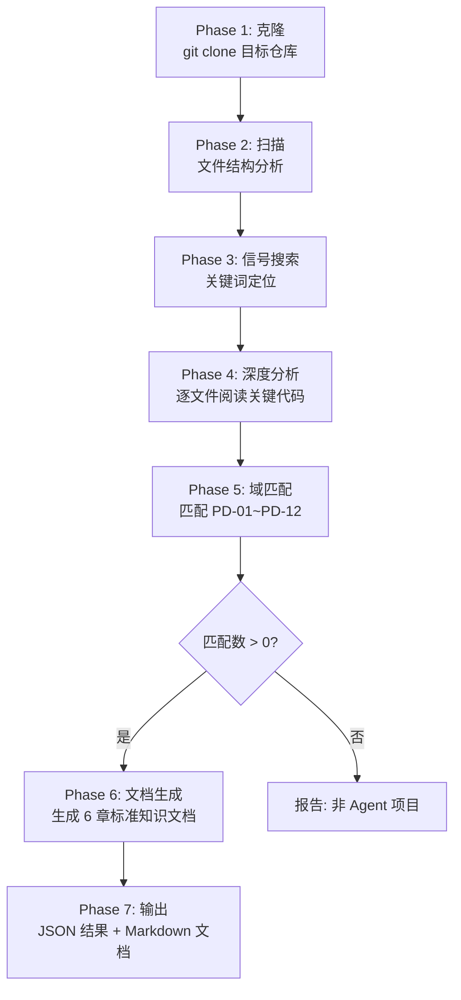

# butcher-scan — 项目切割与特性提取引擎

从 GitHub 开源项目中深度提取 AI Agent 工程组件，匹配到 12 个问题域，生成标准化知识文档。

---

## 产品定位

Butcher Wiki 是一个 Agent 工程组件知识库，把开源项目"大卸八块"，提取可移植的工程组件。本 skill 是核心切割引擎。

## 12 个问题域 (PD-01 ~ PD-12)

| # | 问题域 | 英文 | 关键信号 |
|---|--------|------|---------|
| PD-01 | 上下文管理 | Context Window Management | token estimation, truncation, compression, tiktoken, max_tokens, sliding window, summarization |
| PD-02 | 多 Agent 编排 | Multi-Agent Orchestration | orchestrator, multi-agent, parallel, sub-agent, DAG, dispatcher, coordinator, workflow graph |
| PD-03 | 容错与重试 | Fault Tolerance & Retry | retry, fallback, rollback, resilient, fault recovery, backoff, degradation, circuit breaker |
| PD-04 | 工具系统 | Tool System Design | tool manager, MCP, tool call, register tool, hot reload, permission, function calling |
| PD-05 | 沙箱隔离 | Sandbox Isolation | sandbox, isolation, docker, e2b, subprocess, container, secure execution |
| PD-06 | 记忆持久化 | Memory Persistence | memory, persistence, vector store, embedding store, cross-session, long-term memory |
| PD-07 | 质量检查 | Output Quality Assurance | review, quality check, fact check, critic, evaluation, scoring, consistency |
| PD-08 | 搜索与检索 | Search & Retrieval | search, retrieval, RAG, knowledge gap, multi-source, crawl, scrape, web search |
| PD-09 | Human-in-the-Loop | Human-in-the-Loop | human-in-the-loop, clarification, approval, interrupt, ask user, confirmation |
| PD-10 | 中间件管道 | Middleware Pipeline | middleware, pipeline, hook, lifecycle, interceptor, plugin, chain |
| PD-11 | 可观测性 | Observability | observability, tracing, monitoring, cost tracking, token usage, structured logging |
| PD-12 | 推理增强 | Reasoning Enhancement | thinking, reasoning, extended thinking, chain of thought, MoE, tiered LLM, reflection |

## 触发条件

当用户说以下任何一种表达时触发：
- "切割" / "butcher" / "scan" / "扫描项目"
- "分析 <GitHub URL>"
- "提取特性" / "extract"
- 提供 GitHub 项目 URL

## 工作流程



## Phase 1: 克隆

```bash
git clone --depth=1 <repo_url> /tmp/butcher-scan-<repo_name>
```

克隆后统计：
- 总文件数
- 主要语言
- 项目描述（从 README 提取）

## Phase 2: 扫描

扫描文件结构，建立项目全景：

1. 用 Glob 列出所有源代码文件（排除 node_modules, .git, dist, build, __pycache__）
2. 识别项目类型（Python/TypeScript/Go 等）
3. 识别核心目录结构（src/, lib/, agents/, tools/ 等）
4. 读取 README.md、pyproject.toml/package.json 了解项目概况

## Phase 3: 信号搜索

对每个问题域的关键信号词执行 Grep 搜索：

```
对 PD-01: grep "token|tiktoken|truncat|compress|max_tokens|sliding_window|summariz"
对 PD-02: grep "orchestrat|multi.agent|parallel|subagent|dag|dispatch|coordinator"
...（12 个域全部搜索）
```

记录每个域的命中文件和命中次数，作为 Phase 4 的分析优先级。

## Phase 4: 深度分析

对 Phase 3 中命中次数 >= 2 的域，深入阅读相关文件：

1. Read 命中的关键文件
2. 追踪核心类/函数的实现
3. 理解设计模式和架构决策
4. 记录关键代码位置（file:line）

分析维度：
- **机制**：具体怎么实现的？用了什么库/框架？
- **设计哲学**：为什么这样设计？有什么权衡？
- **可移植性**：这个方案能否独立提取？依赖什么？
- **优劣势**：相比其他方案的优缺点

## Phase 5: 域匹配

综合 Phase 3-4 的分析，为每个匹配的域评分：

| 评分 | 含义 |
|------|------|
| 0.9+ | 核心实现：该域是项目的核心功能之一 |
| 0.8-0.9 | 明确使用：有完整的实现，但不是核心 |
| 0.6-0.8 | 部分涉及：有相关代码，但不完整 |
| < 0.6 | 不匹配：跳过 |

## Phase 6: 文档生成

对每个匹配的域（confidence >= 0.7），生成标准 6 章知识文档。

### 文档格式

文件名：`PD-XX-ProjectName-方案简述.md`
存放位置：`knowledge/solutions/`

```markdown
# PD-XX.NN ProjectName — 方案标题

> 文档编号：PD-XX.NN
> 来源：ProjectName `关键文件`
> GitHub：<repo_url>
> 问题域：PD-XX 域标题 英文标题
> 状态：可复用方案

---

## 第 1 章 问题与动机

### 1.1 核心问题
（该问题域要解决什么问题，为什么重要）

### 1.2 ProjectName 的解法概述
（概述该项目的解决方案，3-5 个要点）

### 1.3 设计思想
（表格形式列出设计原则）

---

## 第 2 章 源码实现分析

### 2.1 架构概览
（整体架构，关键组件关系）

### 2.2 核心实现
（关键代码分析，引用 file:line，包含代码片段）

### 2.3 实现细节
（重要的实现细节和技巧）

---

## 第 3 章 迁移指南

### 3.1 迁移清单
（迁移到自己项目需要做什么）

### 3.2 适配代码模板
（可直接复用的代码模板）

### 3.3 适用场景
（什么场景适合用这个方案）

---

## 第 4 章 测试用例

（关键功能的测试代码）

---

## 第 5 章 跨域关联

（与其他问题域的关系）

---

## 第 6 章 来源文件索引

（源项目中相关文件的完整列表）
```

### 文档质量要求

- 每个文档至少 200 行
- 至少 5 个 `file:line` 代码引用
- 第 2 章必须包含实际代码片段
- 第 3 章必须包含可运行的代码模板

## Phase 7: 输出

最终输出两部分：

### 1. JSON 结果（打印到 stdout）

```json
{
  "project": "项目名",
  "repo": "仓库URL",
  "matches": [
    {
      "domain_id": "PD-XX",
      "title": "域标题",
      "description": "具体发现（150-300字，引用文件名和代码模式）",
      "files": ["文件路径列表"],
      "confidence": 0.85,
      "signals": ["匹配到的信号词"],
      "source_files_detail": [
        { "file": "文件路径", "lines": "行范围", "description": "关键实现" }
      ],
      "knowledge_doc": "生成的知识文档文件名（如有）"
    }
  ]
}
```

### 2. Markdown 知识文档

对 confidence >= 0.7 的匹配，生成知识文档到 `knowledge/solutions/` 目录。

## 命令

| 命令 | 说明 |
|------|------|
| `/butcher-scan <url>` | 完整切割流程（Phase 1-7） |
| `/butcher-scan --quick <url>` | 快速扫描（Phase 1-5，不生成文档） |
| `/butcher-scan --doc-only <url>` | 只生成文档（假设已有扫描结果） |

## 规则

1. 所有分析必须基于实际代码，不要猜测或假设
2. 代码引用必须精确到 file:line
3. 如果项目不是 Agent 相关的，直接报告并退出
4. 生成的知识文档必须遵循 6 章标准格式
5. 最终 JSON 输出不包含任何非 JSON 文字
