<div align="center">


# Butcher Wiki

**Your AI-Powered Agent Engineering Knowledge Base**

**AI 驱动的 Agent 项目经验库 — 驱动你的 Agent 能力进化的大模型应用实践经验库**

[](https://nextjs.org/)
[](https://react.dev/)
[](https://www.typescriptlang.org/)
[](https://tailwindcss.com/)
[](LICENSE)

[中文](#中文) | [English](#english)

</div>

---

## 中文

### 为什么需要它？

每个 Agent 开发者都经历过这样的场景：上下文窗口爆了，去翻 LangChain 源码；重试逻辑写崩了，去看 AutoGPT 怎么做的；多 Agent 调度卡住了，又去研究 CrewAI 的编排方式。**每次都要从零开始读一个陌生项目的源码，效率极低。**

Butcher Wiki 解决的就是这个问题 — 它把优秀开源项目的工程经验**预先切割、分类、对比**，让你在遇到任何 Agent 工程难题时，都能直接查到多个项目的解法和 trade-off，而不是自己去翻源码。

**一句话：Agent 工程领域的 Stack Overflow，但答案来自真实项目的源码分析，而不是人写的帖子。**

### 使用场景

| 场景 | 怎么用 |
|------|--------|
| **面试准备** | 面试官问「你怎么处理 Agent 上下文超限？」— 打开 PD-01，5 个项目的解法和 trade-off 一目了然，比背八股文有说服力 |
| **架构设计** | 要设计多 Agent 编排方案？PD-02 里有 DAG 编排、Master-Worker、单中心调度等多种模式的源码级对比，直接选型 |
| **快速接入** | 项目需要加容错重试？PD-03 的知识文档里有现成的代码片段、架构图和迁移建议，拿来就用 |
| **特性调研** | 要给 Agent 加新能力？先搜一下有没有成熟的开源实现 — 找到经过验证的模式，再动手不迟 |
| **Agent 自动进化** | 通过 MCP Server 接入你的 Agent — Agent 遇到工程问题时自动查询知识库，获取解决方案，实现经验驱动的自我进化 |

### 它做什么？

Butcher Wiki 是一个**跨项目工程知识库**。它扫描开源项目的源码，提取可移植的工程组件（设计模式、实现机制、解决方案），按**问题域**重新组织，让开发者能**横向对比**不同项目对同一工程难题的解法。

```
项目 A ──┐                      ┌── 上下文管理 ── [A的解法, B的解法, C的解法]
项目 B ──┤   Butcher Wiki 切割   ├── 多Agent编排 ── [A的解法, D的解法]
项目 C ──┤  ──────────────→     ├── 容错重试   ── [B的解法, C的解法, E的解法]
项目 D ──┤                      ├── ...
项目 E ──┘                      └── 推理增强   ── [C的解法, D的解法]
```

### 核心流程

1. **扫描** — `butcher-scan` 对任意 GitHub 项目做深度源码分析，把它的工程能力拆解匹配到问题域（PD-01 上下文管理、PD-02 多 Agent 编排、PD-04 工具系统...）
2. **发现** — 如果项目有不属于已有域的独立工程能力，自动创建新域（比如 OpenClaw 扫出了 PD-34 消息网关、PD-37 安全审计等 14 个新域）
3. **文档** — `butcher-doc` 为每个匹配的域生成标准化知识文档，包含源码分析、设计哲学、迁移指南、测试用例
4. **横向对比** — 同一个域下多个项目的方案自动汇入对比表（第 7 章的 `comparison_data`），比如 PD-02 多 Agent 编排下有 DeerFlow 的 LangGraph DAG、OpenManus 的 PlanningFlow、OpenClaw 的 Subagent Registry 三种方案并列

扫描的项目越多，每个域下的方案就越丰富，横向对比也越有价值。

### 核心设计思想

**三层知识结构**

```
问题域（Problem Domain）
  ├── 解决方案（Solution）  ← 来自具体项目
  │     ├── 设计思想
  │     ├── 核心代码片段 + file:line 引用
  │     ├── 架构图（Mermaid）
  │     └── 优劣势分析
  ├── 解决方案（另一个项目的解法）
  │     └── ...
  └── 横向对比（Comparison）
        ├── 维度对比表
        ├── 适用场景分析
        └── 最佳实践建议
```

**核心价值**

> 当你在构建 Agent 时遇到上下文超限问题，不需要翻遍 10 个开源项目的源码。
> Butcher Wiki 直接告诉你：MiroThinker 用 tiktoken 估算 + 分级裁剪，DeerFlow 用 SummarizationMiddleware 三触发压缩，GPT-Researcher 用 Embedding 相似度压缩，以及它们各自的 trade-off。

**与 DeepWiki 的区别**

| | DeepWiki | Butcher Wiki |
|---|---------|-------------|
| 视角 | 纵向，以项目为轴 | 横向，以问题为轴 |
| 输出 | 项目 A → [架构, 模块, API, 数据流] | 问题域 X → [A的解法, B的解法, 对比] |
| 价值 | 理解单个项目 | 跨项目学习工程模式 |

### 截图预览

| 首页 — 问题域总览 | 问题域详情 — 解决方案列表 |
|:---:|:---:|
| 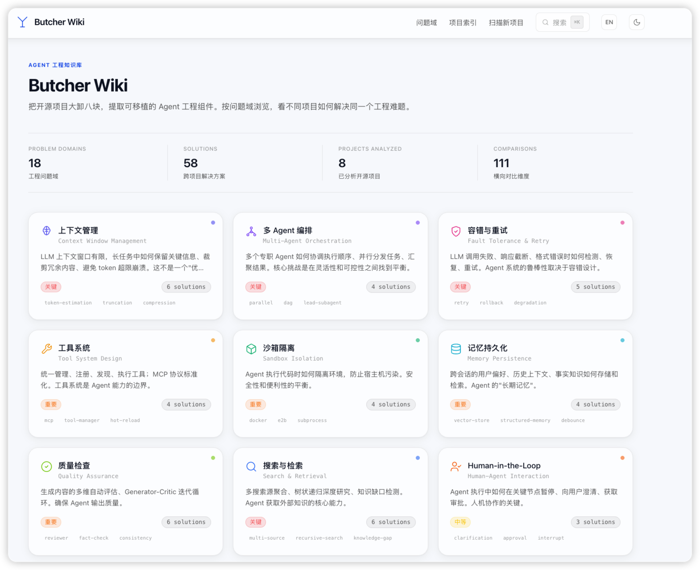 | 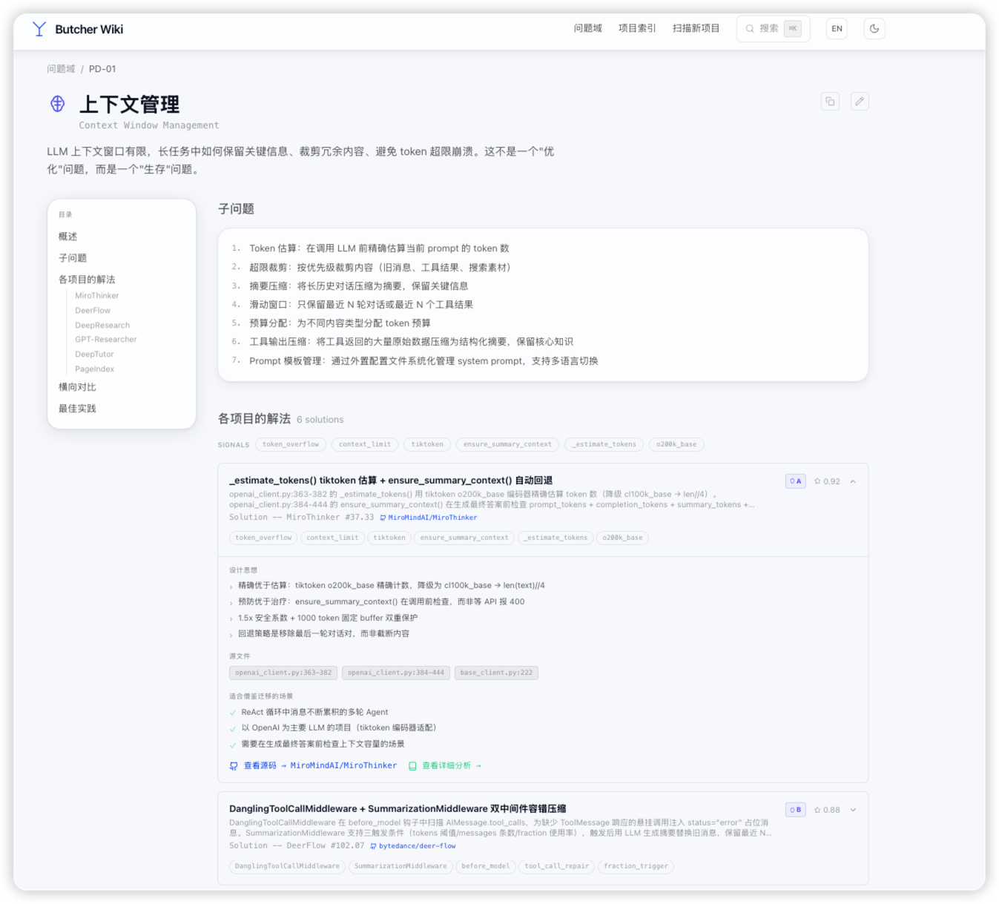 |

| 横向对比表 | 项目扫描 |
|:---:|:---:|
| 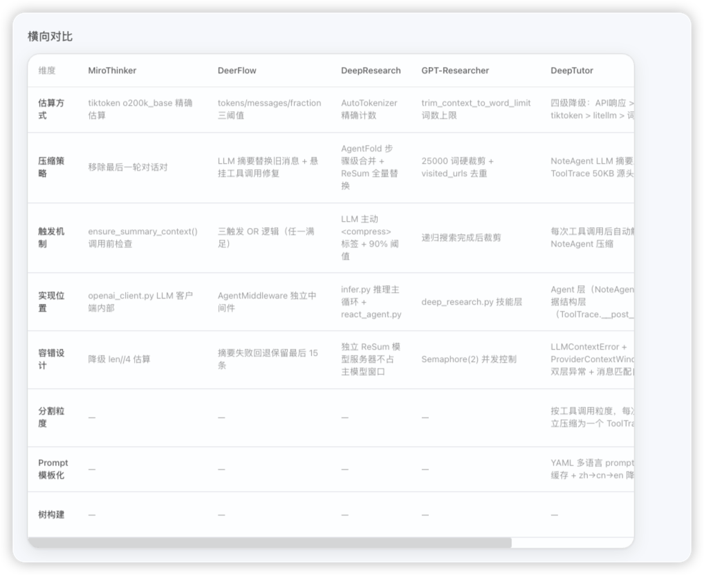 | 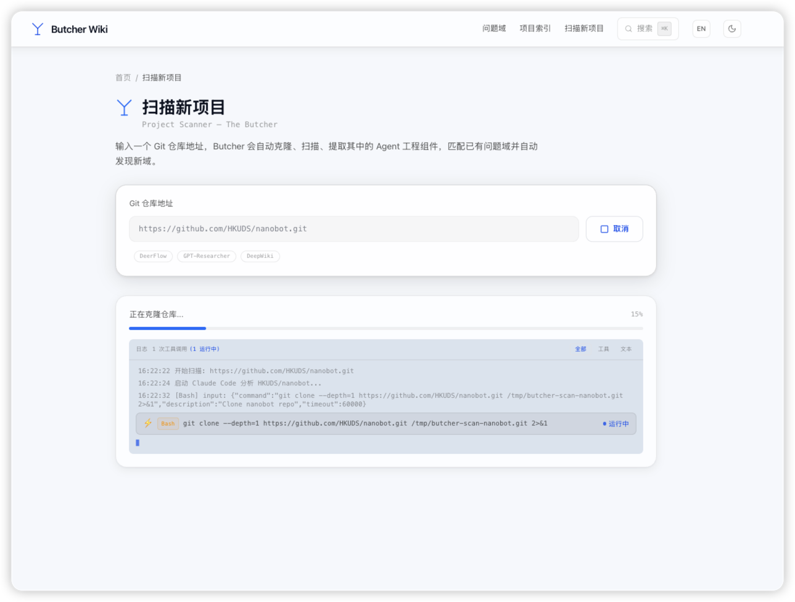 |

| 知识文档 | 智能搜索 |
|:---:|:---:|
| 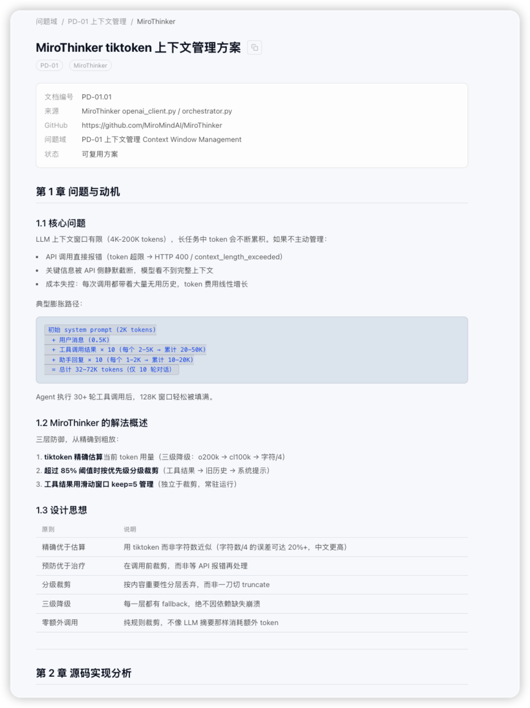 | 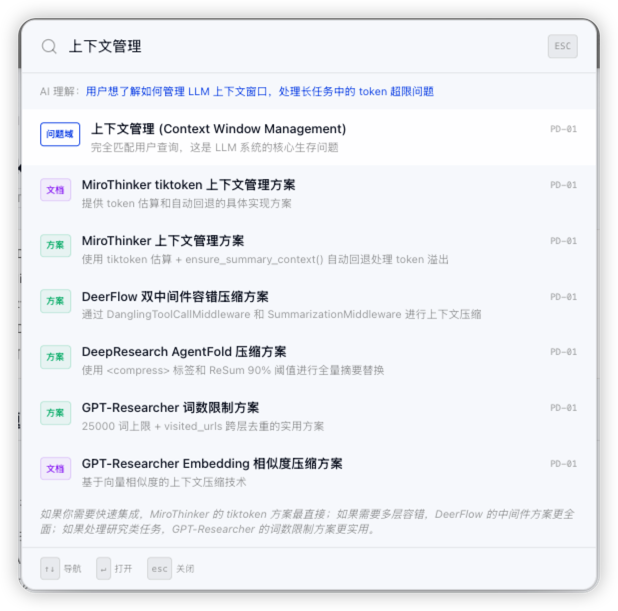 |

### 已收录项目

知识库已收录 10 个开源项目，覆盖 47+ 个问题域，共 91 篇源码级解决方案：

| 项目 | 解决方案数 | 说明 |
|------|-----------|------|
| [OpenClaw](https://github.com/openclaw/openclaw) | 23 篇 | 多渠道消息网关、安全审计、技能管理等 |
| [OpenManus](https://github.com/FoundationAgents/OpenManus) | 14 篇 | 工具系统、计划编排、A2A 协议等 |
| [DeepTutor](https://github.com/baoyu0/DeepTutor) | 13 篇 | 学术场景全栈 Agent 能力 |
| [DeerFlow](https://github.com/bytedance/deer-flow) | 9 篇 | LangGraph DAG 编排、检查点持久化 |
| [GPT-Researcher](https://github.com/assafelovic/gpt-researcher) | 8 篇 | Master-Worker 并行、搜索源降级 |
| [MiroThinker](https://github.com/baoyu0/MiroThinker) | 6 篇 | tiktoken 上下文管理、Docker 沙箱 |
| [PageIndex](https://github.com/baoyu0/page-index) | 6 篇 | Token 预算分割、树状递归搜索 |
| [SystemPrompts](https://github.com/x1xhlol/system-prompts-and-models-of-ai-tools) | 4 篇 | IDE Agent Prompt 工程模式 |
| [Nanobot](https://github.com/ArcadeAI/nanobot) | 4 篇 | Spawn 子 Agent 异步编排 |
| [DeepResearch](https://github.com/baoyu0/DeepResearch) | 3 篇 | 路径白名单沙箱、深度搜索 |

*持续扫描中 — 输入任意 Git 仓库地址即可添加新项目。*

### 核心功能

- **问题域浏览** — 47+ 个工程问题域，每个域聚合多个项目的解决方案
- **项目扫描** — 输入 Git 仓库地址，自动克隆、7 阶段深度分析、提取工程组件（特性数量根据项目规模动态调整 5~30 个）
- **GitHub Trending 自动扫描** — 定时抓取 GitHub Trending 项目，自动扫描入库
- **横向对比** — 同一问题域下不同项目的实现方案对比表
- **知识文档** — 每个解决方案附带详细的源码分析文档（含代码片段、Mermaid 架构图）
- **动态域发现** — 扫描时自动发现新的工程模式，创建扩展域（PD-13+）
- **MCP Server** — 其他项目的 Claude Code 可通过 MCP 协议查询知识库
- **中英双语** — 支持中英文切换，域内容通过 LLM 按需翻译
- **智能搜索** — 基于 LLM 的语义搜索（Cmd+K 快捷键）
- **域管理** — 支持通过 UI 添加、编辑问题域，LLM 自动生成完整定义
- **主题切换** — 深色/浅色主题，visionOS 玻璃态风格

### 问题域

<details>
<summary>47+ 个工程问题域（持续动态新增）</summary>

| # | 问题域 | 核心问题 |
|---|--------|---------|
| PD-01 | 上下文管理 | Token 估算、超限裁剪、摘要压缩、滑动窗口 |
| PD-02 | 多 Agent 编排 | 并行/串行调度、DAG 编排、状态同步 |
| PD-03 | 容错与重试 | 指数退避、回滚保护、降级策略 |
| PD-04 | 工具系统 | 统一注册、MCP 协议、权限分组、热插拔 |
| PD-05 | 沙箱隔离 | 代码执行隔离、容器沙箱、虚拟路径映射 |
| PD-06 | 记忆持久化 | 跨会话记忆、向量存储、结构化记忆 |
| PD-07 | 质量检查 | Generator-Critic 循环、事实核查、一致性检查 |
| PD-08 | 搜索与检索 | 多源聚合、树状递归、知识缺口检测 |
| PD-09 | Human-in-the-Loop | 澄清机制、计划审批、中断恢复 |
| PD-10 | 中间件管道 | 生命周期钩子、横切关注点解耦 |
| PD-11 | 可观测性 | Token 追踪、调用链路、成本分析 |
| PD-12 | 推理增强 | Extended Thinking、分层 LLM 策略 |
| PD-13 | RAG 管道 | 检索增强生成、向量索引、混合检索 |
| PD-14 | Prompt 管理 | 模板引擎、版本控制、动态组装 |
| PD-15 | LLM 抽象层 | 多模型适配、统一接口、流式输出 |
| PD-16 | 安全与权限 | 输入过滤、输出审查、访问控制 |
| PD-17 | 状态管理 | 会话状态、检查点、持久化恢复 |
| PD-18 | 部署与扩展 | 水平扩展、负载均衡、边缘部署 |

</details>

### 扫描架构

项目扫描使用 Claude Code CLI 进行 7 阶段深度分析：

```
输入 Git URL
  → 1. git clone --depth=1
  → 2. 统计文件数，确定目标特性数 N（5~30）
  → 3. Glob 扫描文件结构
  → 4. Grep 批量关键词信号检测
  → 5. 匹配已有问题域（置信度 ≥ 0.5）
  → 6. 发现新工程模式，创建扩展域
  → 7. 生成结构化 JSON 结果 + 知识文档
```

扫描过程通过 SSE 实时推送进度，前端展示结构化日志（工具调用、输入输出、耗时）。

### butcher-doc Skill

扫描的第 7 阶段（知识文档生成）由内置的 Claude Code Skill `.claude/skills/butcher-doc` 驱动。对每个置信度 ≥ 0.6 的匹配域，自动启动独立子代理执行 6 步深度分析：

1. **源码深度扫描** — 逐文件阅读实现代码，追踪 2-3 层调用链
2. **设计哲学提取** — 提炼核心设计原则、替代方案对比
3. **迁移指南编写** — 生成可直接复用的代码模板和适用场景矩阵
4. **测试用例生成** — 基于真实函数签名编写测试
5. **跨域关联分析** — 标注与其他问题域的依赖/协同关系
6. **质量自检** — 5 项门控（≥200 行、≥5 处 file:line 引用、≥2 段代码、≥1 张架构图、7 章完整）

输出标准化 7 章知识文档到 `knowledge/solutions/`，同时自动补充域的横向对比维度和元数据。多域并行生成，互不干扰。

### MCP 集成

Butcher Wiki 提供 MCP Server，让其他项目的 Claude Code 能直接查询知识库：

```json
// 在其他项目的 .claude/settings.json 中添加：
{
  "mcpServers": {
    "butcher-wiki": {
      "command": "npx",
      "args": ["tsx", "src/mcp-server.ts"],
      "cwd": "/path/to/butcher-wiki"
    }
  }
}
```

提供 4 个工具：`search_wiki`（语义搜索）、`get_domain_context`（获取域上下文）、`get_wiki_overview`（总览）、`read_knowledge_doc`（读取知识文档）。

### 技术栈

| 层 | 技术 |
|----|------|
| 框架 | Next.js 15 (App Router) + React 19 + TypeScript |
| 样式 | Tailwind CSS 3（visionOS 玻璃态风格） |
| 国际化 | i18next + react-i18next（客户端切换） |
| 翻译 | Claude Haiku（按需翻译域内容到英文） |
| 扫描 | Claude Code（项目深度分析 + 特性提取） |
| 数据 | YAML/JSON 知识文件 + Markdown 文档 |

### 快速开始

```bash
# 1. 克隆项目
git clone https://github.com/lailoo/butcher-wiki.git
cd butcher-wiki

# 2. 安装依赖
pnpm install

# 3. 配置环境变量
cp .env.local.example .env.local
# 编辑 .env.local，填入 ANTHROPIC_API_KEY

# 4. 启动
pnpm dev
```

访问 http://localhost:3000

### 环境变量

| 变量 | 必填 | 说明 |
|------|------|------|
| `ANTHROPIC_API_KEY` | 是 | Anthropic API 密钥，用于智能搜索、项目扫描和自动翻译 |
| `ANTHROPIC_BASE_URL` | 否 | Anthropic API 地址，默认 `https://api.anthropic.com`，可配置为代理地址 |
| `GITHUB_TOKEN` | 否 | GitHub Token，提升 API 速率限制（60 → 5000 req/hr） |

> **注意：** 项目扫描功能依赖 [Claude Code CLI](https://docs.anthropic.com/en/docs/claude-code)，需要在本地安装并完成认证。扫描过程中会自动调用内置的 `.claude/skills/butcher-doc` Skill 生成知识文档，该 Skill 已包含在项目中，无需额外配置。

### 部署

<details>
<summary>Vercel（推荐）</summary>

```bash
npm i -g vercel
vercel
vercel env add ANTHROPIC_API_KEY
```

</details>

<details>
<summary>Docker</summary>

```dockerfile
FROM node:20-alpine AS builder
WORKDIR /app
COPY package.json pnpm-lock.yaml ./
RUN corepack enable && pnpm install --frozen-lockfile
COPY . .
RUN pnpm build

FROM node:20-alpine AS runner
WORKDIR /app
COPY --from=builder /app/.next/standalone ./
COPY --from=builder /app/.next/static ./.next/static
COPY --from=builder /app/knowledge ./knowledge
COPY --from=builder /app/public ./public
ENV NODE_ENV=production
EXPOSE 3000
CMD ["node", "server.js"]
```

```bash
docker build -t butcher-wiki .
docker run -p 3000:3000 -e ANTHROPIC_API_KEY=your-key butcher-wiki
```

</details>

<details>
<summary>自托管</summary>

```bash
pnpm build
pnpm start  # 默认端口 3000
```

</details>

### 项目结构

<details>
<summary>目录结构（点击展开）</summary>

```
butcher-wiki/
├── src/
│   ├── app/                  # Next.js App Router
│   │   ├── page.tsx          # 首页（问题域总览）
│   │   ├── domain/[slug]/    # 问题域详情页
│   │   ├── knowledge/[slug]/ # 知识文档页
│   │   ├── projects/         # 项目索引页
│   │   ├── scan/             # 扫描新项目页
│   │   └── api/              # API 路由（翻译、扫描、搜索）
│   ├── components/           # UI 组件（玻璃态风格）
│   ├── i18n/                 # 国际化（i18next 初始化 + Provider）
│   ├── lib/                  # 工具库（扫描引擎、翻译存储）
│   └── data/                 # 数据加载层
├── knowledge/                # 知识库数据
│   ├── domains/              # 问题域定义（JSON）
│   ├── domains-en/           # 英文翻译缓存
│   ├── solutions/            # 解决方案文档（Markdown）
│   └── registry.yaml         # 全局索引
├── e2e/                      # E2E 测试（Playwright）
└── public/                   # 静态资源
```

</details>

### FAQ

<details>
<summary>扫描一个项目需要什么？</summary>

只需要一个 Git 仓库地址。Butcher Wiki 会自动克隆、分析源码、提取工程组件，并将结果归类到对应的问题域中。扫描使用 Claude Code 进行深度分析，特性数量根据项目代码量动态调整（小项目 ~5 个，大项目最多 30 个）。

</details>

<details>
<summary>英文翻译是怎么工作的？</summary>

UI 字符串使用 i18next 静态翻译文件。域内容（标题、描述、子问题、解决方案等）通过 Claude Haiku 按需翻译，翻译结果缓存到 `knowledge/domains-en/` 目录。当域内容更新时，翻译缓存自动失效并重新生成。

</details>

<details>
<summary>可以添加自定义问题域吗？</summary>

可以。通过 UI 的「添加域」功能创建新的问题域，或者直接在 `knowledge/domains/` 目录下添加 JSON 文件。扫描过程中如果发现不属于现有域的工程模式，也会自动创建扩展域（PD-13 到 PD-18 就是这样产生的）。

</details>

### License

MIT

---

## English

### Why Do You Need This?

Every Agent developer has been there: context window overflows, so you dig into LangChain's source; retry logic breaks, so you study how AutoGPT handles it; multi-agent scheduling stalls, so you reverse-engineer CrewAI's orchestration. **Every time, you're reading an unfamiliar codebase from scratch. It's painfully slow.**

Butcher Wiki solves this — it **pre-dissects, categorizes, and compares** engineering practices from top open-source projects, so when you hit any Agent engineering challenge, you can instantly find multiple solutions and their trade-offs instead of spelunking through source code yourself.

**In one line: Stack Overflow for Agent engineering, but the answers come from real source code analysis, not human-written posts.**

### Use Cases

| Scenario | How |
|----------|-----|
| **Interview Prep** | Interviewer asks "How do you handle Agent context overflow?" — Open PD-01, see 5 projects' solutions and trade-offs at a glance. Way more convincing than memorized answers |
| **Architecture Design** | Need a multi-agent orchestration strategy? PD-02 has source-level comparisons of DAG orchestration, Master-Worker, single-center scheduling — pick the right pattern |
| **Quick Integration** | Project needs fault tolerance? PD-03's knowledge docs have ready-made code snippets, architecture diagrams, and migration guides |
| **Feature Discovery** | Adding a new capability to your Agent? Search for mature open-source implementations first — find proven patterns before building from scratch |
| **Agent Self-Evolution** | Connect via MCP Server — your Agent queries the knowledge base when it hits engineering problems, retrieves solutions, and evolves through accumulated experience |

### What Does It Do?

Butcher Wiki is a **cross-project engineering knowledge base**. It scans open-source project source code, extracts portable engineering components (design patterns, implementation mechanisms, solutions), and reorganizes them by **problem domain** — enabling developers to **compare** how different projects solve the same engineering challenge.

```
Project A ──┐                      ┌── PD-01 Context Management ── [A's approach, B's, C's]
Project B ──┤  Butcher Wiki slices  ├── PD-02 Multi-Agent Orch.  ── [A's approach, D's]
Project C ──┤  ────────────────→   ├── PD-03 Fault Tolerance    ── [B's approach, C's, E's]
Project D ──┤                      ├── ...
Project E ──┘                      └── PD-12 Reasoning          ── [C's approach, D's]
```

### Core Workflow

1. **Scan** — `butcher-scan` performs deep source code analysis on any GitHub project, decomposing its engineering capabilities and matching them to problem domains (PD-01 Context Management, PD-02 Multi-Agent Orchestration, PD-04 Tool System...)
2. **Discover** — If a project has engineering capabilities that don't belong to any existing domain, new domains are automatically created (e.g., OpenClaw's scan discovered 14 new domains including PD-34 Message Gateway, PD-37 Security Audit)
3. **Document** — `butcher-doc` generates standardized knowledge documents for each matched domain, including source code analysis, design philosophy, migration guides, and test cases
4. **Compare** — Solutions from multiple projects under the same domain are automatically aggregated into comparison tables (Chapter 7's `comparison_data`), e.g., PD-02 Multi-Agent Orchestration shows DeerFlow's LangGraph DAG, OpenManus's PlanningFlow, and OpenClaw's Subagent Registry side by side

The more projects you scan, the richer each domain's solutions become, and the more valuable the cross-project comparisons.

### Core Design

**Three-Layer Knowledge Structure**

```
Problem Domain
  ├── Solution (from a specific project)
  │     ├── Design philosophy
  │     ├── Core code snippets + file:line references
  │     ├── Architecture diagram (Mermaid)
  │     └── Pros/cons analysis
  ├── Solution (from another project)
  │     └── ...
  └── Comparison (cross-project)
        ├── Dimension comparison table
        ├── Applicable scenario analysis
        └── Best practice recommendations
```

**Core Value**

> When you hit a context window overflow while building an Agent, you don't need to dig through 10 open-source projects.
> Butcher Wiki tells you directly: MiroThinker uses tiktoken estimation + tiered truncation, DeerFlow uses SummarizationMiddleware with triple-trigger compression, GPT-Researcher uses embedding similarity compression — along with their respective trade-offs.

### How It Differs from DeepWiki

| | DeepWiki | Butcher Wiki |
|---|---------|-------------|
| Perspective | Vertical, project-centric | Horizontal, problem-centric |
| Output | Project A → [architecture, modules, APIs] | Problem X → [A's solution, B's solution, comparison] |
| Value | Understand a single project | Learn engineering patterns across projects |

### Key Features

- **Problem Domain Browsing** — 47+ engineering problem domains, each aggregating solutions from multiple projects
- **Project Scanning** — Enter a Git repo URL, auto-clone, 7-phase deep analysis, extract engineering components (feature count dynamically adjusted 5~30 based on project size)
- **GitHub Trending Auto-Scan** — Periodically fetches GitHub Trending projects and auto-scans them into the knowledge base
- **Cross-Project Comparison** — Side-by-side comparison tables for solutions within the same domain
- **Knowledge Docs** — Each solution includes detailed source code analysis (with code snippets, Mermaid diagrams)
- **Dynamic Domain Discovery** — Auto-discovers new engineering patterns during scanning, creates extension domains (PD-13+)
- **MCP Server** — Other projects' Claude Code can query the knowledge base via MCP protocol
- **Bilingual (zh/en)** — Full Chinese/English support with LLM-powered auto-translation
- **Semantic Search** — LLM-based intelligent search (Cmd+K shortcut)
- **Domain Management** — Add/edit problem domains via UI, LLM auto-generates complete definitions
- **Theme Switching** — Dark/light themes with visionOS glassmorphism style

### Screenshots

| Home — Problem Domain Overview | Domain Detail — Solution List |
|:---:|:---:|
| 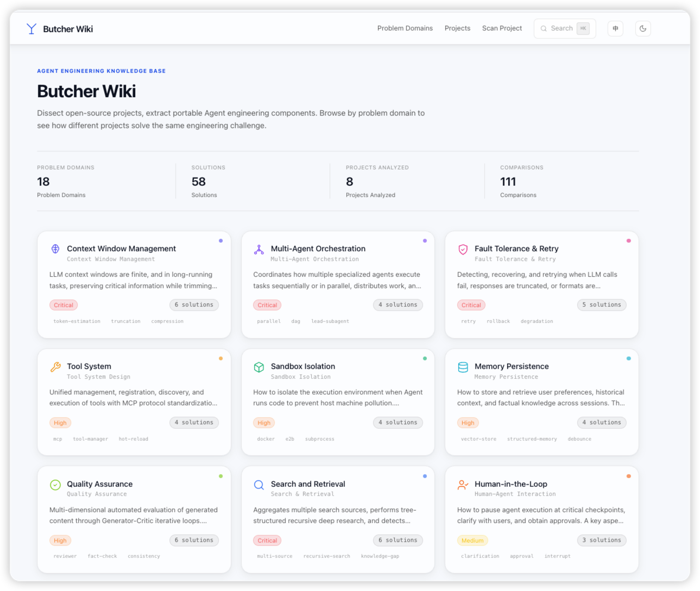 | 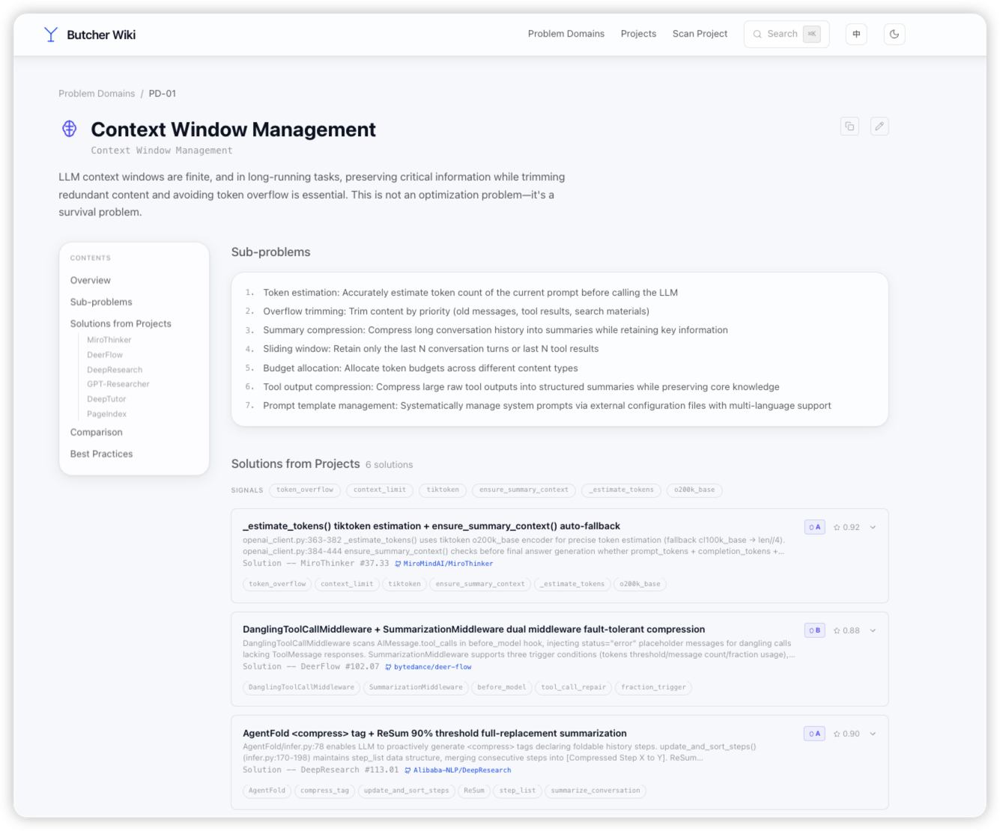 |

| Comparison Table | Project Scanning |
|:---:|:---:|
| 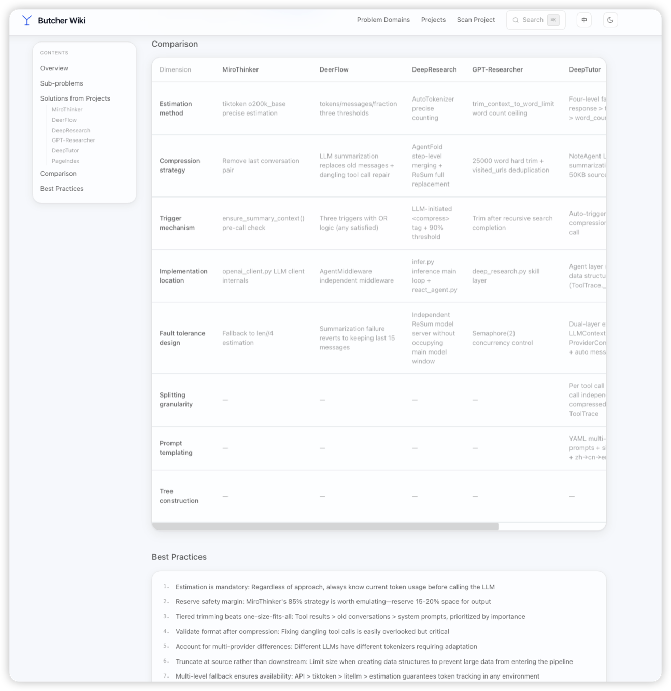 | 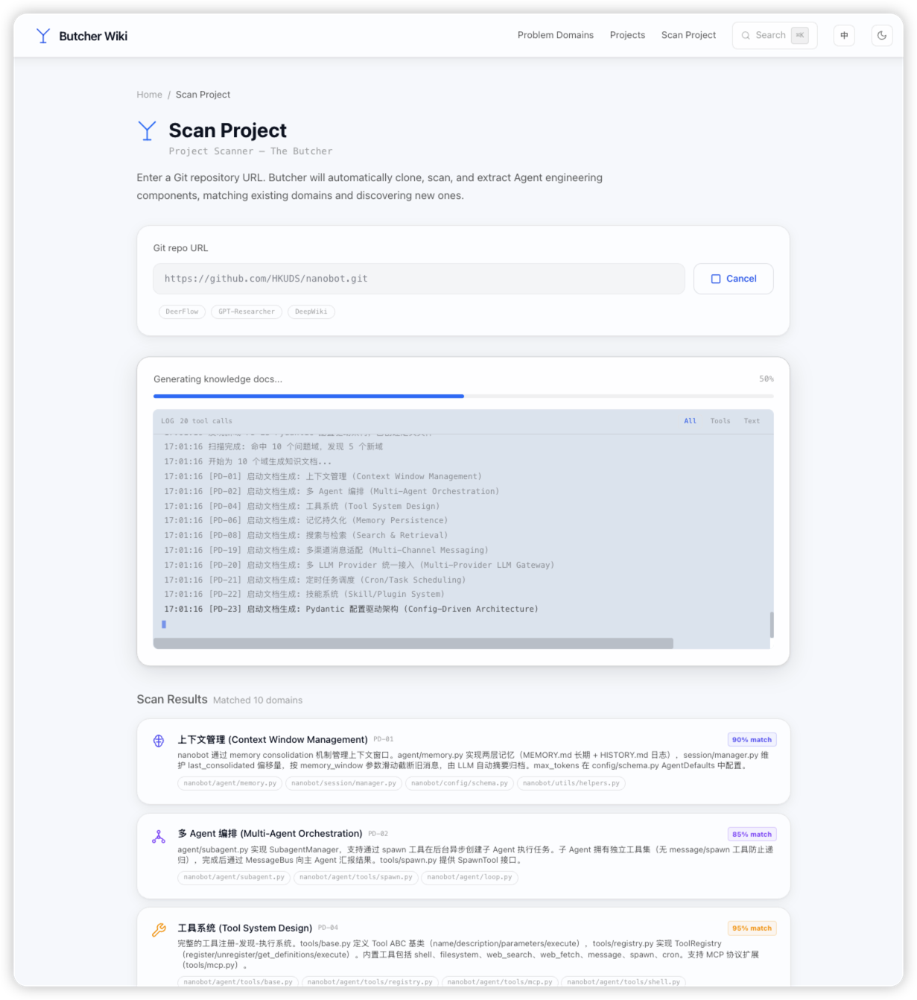 |

| Knowledge Doc | Semantic Search |
|:---:|:---:|
| 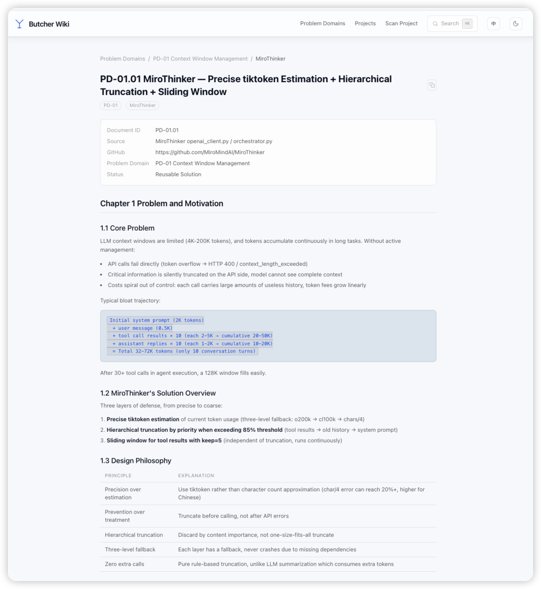 | 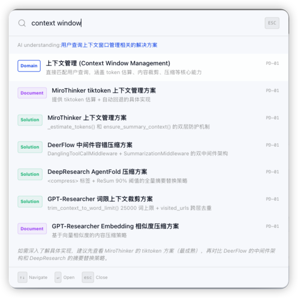 |

### Projects Indexed

The knowledge base currently indexes 10 open-source projects across 47+ problem domains with 91 source-level solution docs:

| Project | Solutions | Highlights |
|---------|-----------|------------|
| [OpenClaw](https://github.com/openclaw/openclaw) | 23 | Message gateway, security audit, skill management |
| [OpenManus](https://github.com/FoundationAgents/OpenManus) | 14 | Tool system, planning orchestration, A2A protocol |
| [DeepTutor](https://github.com/baoyu0/DeepTutor) | 13 | Full-stack academic Agent capabilities |
| [DeerFlow](https://github.com/bytedance/deer-flow) | 9 | LangGraph DAG orchestration, checkpoint persistence |
| [GPT-Researcher](https://github.com/assafelovic/gpt-researcher) | 8 | Master-Worker parallel, search source fallback |
| [MiroThinker](https://github.com/baoyu0/MiroThinker) | 6 | tiktoken context management, Docker sandbox |
| [PageIndex](https://github.com/baoyu0/page-index) | 6 | Token budget splitting, tree-recursive search |
| [SystemPrompts](https://github.com/x1xhlol/system-prompts-and-models-of-ai-tools) | 4 | IDE Agent prompt engineering patterns |
| [Nanobot](https://github.com/ArcadeAI/nanobot) | 4 | Spawn sub-agent async orchestration |
| [DeepResearch](https://github.com/baoyu0/DeepResearch) | 3 | Path whitelist sandbox, deep search |

*Continuously growing — enter any Git repo URL to add new projects.*

### Scanning Architecture

Project scanning uses Claude Code CLI for 7-phase deep analysis:

```
Input Git URL
  → 1. git clone --depth=1
  → 2. Count files, determine target feature count N (5~30)
  → 3. Glob scan file structure
  → 4. Grep batch keyword signal detection
  → 5. Match existing problem domains (confidence ≥ 0.5)
  → 6. Discover new engineering patterns, create extension domains
  → 7. Generate structured JSON results + knowledge docs
```

Scanning progress is streamed in real-time via SSE, with structured logs displayed in the frontend (tool calls, I/O, duration).

### butcher-doc Skill

Phase 7 (knowledge doc generation) is powered by the built-in Claude Code Skill `.claude/skills/butcher-doc`. For each matched domain with confidence ≥ 0.6, an independent sub-agent runs a 6-step deep analysis:

1. **Source Code Deep Scan** — reads implementation files line by line, traces 2-3 levels of call chains
2. **Design Philosophy Extraction** — distills core design principles and alternative approaches
3. **Migration Guide** — generates reusable code templates and applicability matrices
4. **Test Case Generation** — writes tests based on real function signatures
5. **Cross-Domain Correlation** — maps dependencies and synergies with other problem domains
6. **Quality Gate** — 5 checks (≥200 lines, ≥5 file:line refs, ≥2 code snippets, ≥1 architecture diagram, all 7 chapters complete)

Outputs standardized 7-chapter knowledge docs to `knowledge/solutions/`, while auto-enriching domain comparison dimensions and metadata. Multiple domains are generated in parallel.

### MCP Integration

Butcher Wiki provides an MCP Server, allowing other projects' Claude Code to query the knowledge base directly:

```json
// Add to .claude/settings.json in other projects:
{
  "mcpServers": {
    "butcher-wiki": {
      "command": "npx",
      "args": ["tsx", "src/mcp-server.ts"],
      "cwd": "/path/to/butcher-wiki"
    }
  }
}
```

4 tools available: `search_wiki` (semantic search), `get_domain_context` (get domain context), `get_wiki_overview` (overview), `read_knowledge_doc` (read knowledge doc).

### Tech Stack

| Layer | Technology |
|-------|-----------|
| Framework | Next.js 15 (App Router) + React 19 + TypeScript |
| Styling | Tailwind CSS 3 (visionOS glassmorphism) |
| i18n | i18next + react-i18next (client-side switching) |
| Translation | Claude Haiku (on-demand domain content translation) |
| Scanning | Claude Code (deep project analysis + feature extraction) |
| Data | YAML/JSON knowledge files + Markdown docs |

### Quick Start

```bash
# 1. Clone
git clone https://github.com/lailoo/butcher-wiki.git
cd butcher-wiki

# 2. Install dependencies
pnpm install

# 3. Configure environment
cp .env.local.example .env.local
# Edit .env.local, set ANTHROPIC_API_KEY

# 4. Start
pnpm dev
```

Visit http://localhost:3000

### Environment Variables

| Variable | Required | Description |
|----------|----------|-------------|
| `ANTHROPIC_API_KEY` | Yes | Anthropic API key for search, scanning, and auto-translation |
| `ANTHROPIC_BASE_URL` | No | Anthropic API endpoint, defaults to `https://api.anthropic.com`, can be set to a proxy |
| `GITHUB_TOKEN` | No | GitHub token to increase API rate limit (60 → 5000 req/hr) |

> **Note:** Project scanning requires [Claude Code CLI](https://docs.anthropic.com/en/docs/claude-code) installed and authenticated locally. The scanning process automatically invokes the built-in `.claude/skills/butcher-doc` Skill to generate knowledge docs — it's included in the repo, no extra setup needed.

### Deployment

<details>
<summary>Vercel (Recommended)</summary>

```bash
npm i -g vercel
vercel
vercel env add ANTHROPIC_API_KEY
```

</details>

<details>
<summary>Docker</summary>

```bash
docker build -t butcher-wiki .
docker run -p 3000:3000 -e ANTHROPIC_API_KEY=your-key butcher-wiki
```

</details>

<details>
<summary>Self-hosted</summary>

```bash
pnpm build
pnpm start  # Default port 3000
```

</details>

### FAQ

<details>
<summary>What do I need to scan a project?</summary>

Just a Git repo URL. Butcher Wiki auto-clones, analyzes the source code, extracts engineering components, and categorizes them into problem domains. Scanning uses Claude Code for deep analysis, with feature count dynamically adjusted based on project size (small projects ~5, large projects up to 30).

</details>

<details>
<summary>How does English translation work?</summary>

UI strings use static i18next translation files. Domain content (titles, descriptions, sub-problems, solutions, etc.) is translated on-demand via Claude Haiku, with results cached in `knowledge/domains-en/`. When domain content is updated, the translation cache is automatically invalidated and regenerated.

</details>

<details>
<summary>Can I add custom problem domains?</summary>

Yes. Use the "Add Domain" feature in the UI, or add JSON files directly to `knowledge/domains/`. The scanning process also auto-creates extension domains when it discovers engineering patterns that don't fit existing domains (PD-13 through PD-18 were created this way).

</details>

### License

MIT
