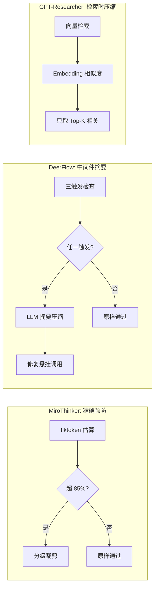

# 上下文管理：跨项目解决方案对比

## 维度对比表

| 维度 | MiroThinker | DeerFlow | GPT-Researcher | DeepResearch |
|------|-------------|----------|----------------|--------------|
| **估算方式** | tiktoken 精确估算 | 配置阈值 | 无显式估算 | Token 预算管理 |
| **压缩策略** | 规则裁剪（分级丢弃） | LLM 摘要 | Embedding 相似度 | AgentFold 压缩 |
| **触发机制** | 调用前检查 | 三触发（token/消息数/比例） | 按需（检索时） | 预算耗尽时 |
| **实现位置** | LLM 客户端内部 | 独立中间件 | 检索管道 | Agent 循环内 |
| **保留策略** | 滑动窗口 keep=5 | 保留首尾 + 摘要中间 | 向量相似度排序 | 折叠历史步骤 |
| **降级方案** | tiktoken → 字符/4 | 无 | 无 | 无 |
| **副作用处理** | 无 | 悬挂工具调用修复 | 无 | 无 |

## 设计思想对比

## 适用场景矩阵

| 场景 | 推荐方案 | 原因 |
|------|---------|------|
| OpenAI 为主，需要精确控制 | MiroThinker | tiktoken 与计费一致 |
| 中间件架构，多轮对话 | DeerFlow | 可插拔，语义保留好 |
| RAG 场景，检索为主 | GPT-Researcher | 天然适合向量过滤 |
| 预算敏感，需要成本控制 | DeepResearch | 预算分配机制 |
| 混合场景 | MiroThinker 估算 + DeerFlow 压缩 | 精确估算 + 智能压缩 |

## 最佳实践建议

1. **必须有估算**：不管用什么方案，调用前必须知道当前 token 用量。MiroThinker 的 tiktoken 方案是最精确的起点。

2. **预留安全边际**：MiroThinker 的 85% 策略值得借鉴。为输出预留 15-20% 空间。

3. **分层裁剪优于一刀切**：工具结果 > 旧对话 > 系统提示，按重要性分级。

4. **压缩后要验证格式**：DeerFlow 的悬挂工具调用修复是容易被忽略但很关键的细节。

5. **考虑多提供商差异**：不同 LLM 的 tokenizer 不同，tiktoken 对 Claude 有偏差，需要适配。

## 对其他问题域的启发

- **→ PD-03 容错重试**：上下文超限本质上是一种可预防的失败，应纳入容错体系
- **→ PD-11 可观测性**：token 用量追踪是上下文管理的数据基础
- **→ PD-10 中间件**：DeerFlow 证明了上下文管理适合实现为中间件
