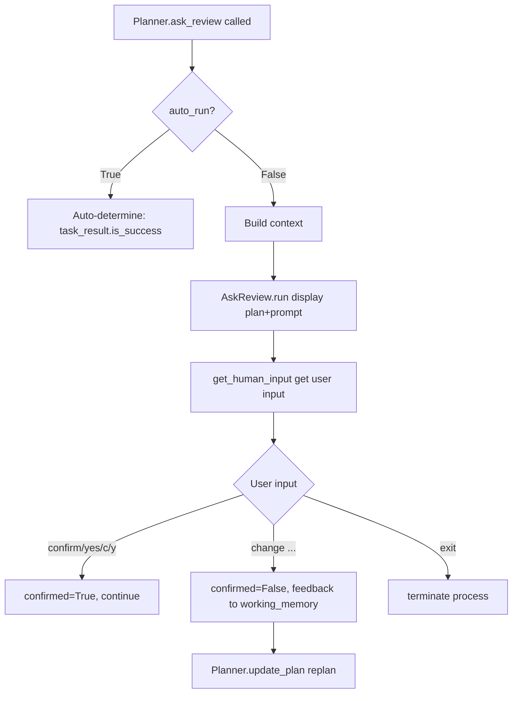
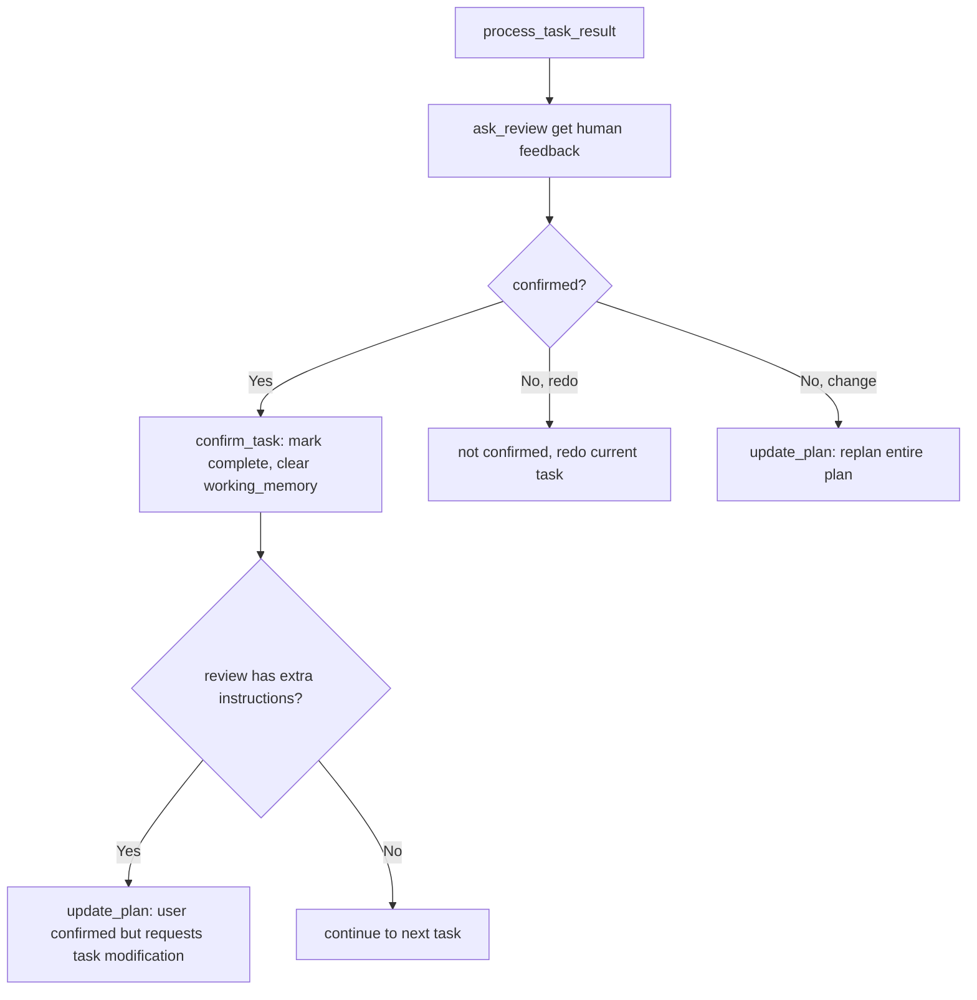
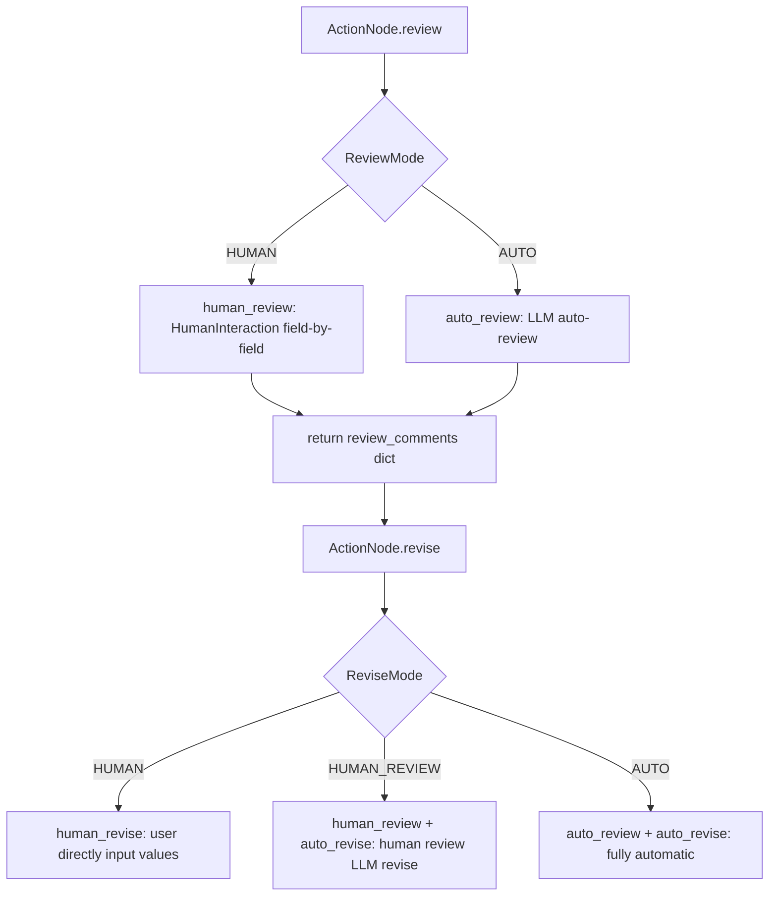

# PD-09.08 MetaGPT — Three-Layer Human-in-the-Loop Review System

> Document ID: PD-09.08
> Source: MetaGPT `metagpt/strategy/planner.py` `metagpt/actions/action_node.py` `metagpt/provider/human_provider.py`
> GitHub: https://github.com/FoundationAgents/MetaGPT.git
> Problem Domain: PD-09 Human-in-the-Loop
> Status: Reusable Solution

---

## Chapter 1 Problem and Motivation (≥ 30 lines)

### 1.1 Core Problem

In multi-Agent collaborative software engineering frameworks, results from autonomous Agent execution often require human confirmation before proceeding. MetaGPT faces three levels of human-in-the-loop interaction needs:

1. **Plan-level review**: Is the task plan generated by the Agent reasonable? Users may need to modify, add, or delete tasks
2. **Task-level review**: After each task completes, does the result meet expectations? Users may request redo or modification of subsequent plans
3. **Node-level review**: Is the structured content produced by ActionNode (e.g., design documents, code review comments) accurate? Users may need to modify individual fields

Traditional approaches hardcode `input()` calls at every point requiring human intervention, but this causes:
- Coupling of interaction logic with business logic
- Inability to switch input sources across different environments (CLI/Web/API)
- Inflexibility in switching between automatic and manual modes
- Lack of type validation for manual modifications of structured data

### 1.2 MetaGPT's Solution Overview

MetaGPT designed a three-layer human-in-the-loop system, with each layer addressing review needs at different granularities:

1. **Planner.ask_review** — Plan/task-level review: In `plan_and_act` mode, pause after generating a plan or completing a task to await human confirmation, supporting four response types: confirm/change/redo/exit (`metagpt/strategy/planner.py:119-141`)
2. **ActionNode ReviewMode/ReviseMode** — Node-level review: Control each ActionNode's review and revision strategy through enumeration modes (HUMAN/AUTO/HUMAN_REVIEW), supporting field-by-field interactive modification (`metagpt/actions/action_node.py:32-40`)
3. **HumanProvider** — LLM replacement layer: Wrap humans as an implementation of the BaseLLM interface, allowing seamless replacement of LLM with human input anywhere LLM is used (`metagpt/provider/human_provider.py:14-57`)
4. **Pluggable input source** — `set_human_input_func` allows runtime replacement of how human input is obtained, defaulting to `input()`, replaceable with WebSocket/API callbacks (`metagpt/logs.py:110-112, 148`)
5. **auto_run switch** — Global control over whether to skip human review; when `auto_run=True`, automatically determines success based on code execution (`metagpt/strategy/planner.py:63, 131-141`)

### 1.3 Design Philosophy

| Design Principle | Implementation | Rationale | Alternative |
|------------------|-----------------|-----------|-------------|
| Layered review | Planner(plan-level) + ActionNode(node-level) + HumanProvider(LLM-level) | Different granularities require different mechanisms, avoiding one-size-fits-all | Unified review middleware (but lacks flexibility) |
| Mode enumeration | ReviewMode.HUMAN/AUTO, ReviseMode.HUMAN/HUMAN_REVIEW/AUTO | Compile-time strategy determination, avoiding runtime string checks | Configuration-driven (but lacks type safety) |
| Unified LLM interface | HumanProvider implements BaseLLM's ask/aask interface | Humans and LLMs are interchangeable; Role.is_human=True switches modes | Independent HumanAgent class (but requires modifying all callers) |
| Pluggable input source | set_human_input_func globally replaces _get_human_input | Single modification point, all interaction points automatically updated | Dependency injection to each component (but too invasive) |
| Dual auto/manual mode | auto_run boolean switch controls whether to skip human review | Automatic during development, human review in production | Environment variable control (but less flexible) |

---

## Chapter 2 Source Code Implementation Analysis (≥ 60 lines, core chapter)

### 2.1 Architecture Overview

MetaGPT's human-in-the-loop system is distributed across three layers, from top to bottom: plan orchestration layer, action node layer, and LLM provider layer:

```
┌─────────────────────────────────────────────────────────┐
│                    Role._plan_and_act()                  │
│  ┌──────────────┐    ┌──────────────┐    ┌───────────┐  │
│  │ update_plan  │───→│ _act_on_task │───→│ process_  │  │
│  │ (gen plan)   │    │ (exec task)  │    │task_result│  │
│  └──────┬───────┘    └──────────────┘    └─────┬─────┘  │
│         │                                       │        │
│         ▼                                       ▼        │
│  ┌──────────────────────────────────────────────────┐   │
│  │           Planner.ask_review()                    │   │
│  │  auto_run=False → AskReview Action → human input │   │
│  │  auto_run=True  → auto-determine is_success      │   │
│  └──────────────────────────────────────────────────┘   │
├─────────────────────────────────────────────────────────┤
│                    ActionNode Layer                      │
│  ┌────────────┐  ┌──────────────┐  ┌────────────────┐  │
│  │ ReviewMode │  │  ReviseMode  │  │ HumanInteract  │  │
│  │ HUMAN/AUTO │  │ HUMAN/H_REV/ │  │ ion field-by- │  │
│  │            │  │ AUTO         │  │ field interact │  │
│  └────────────┘  └──────────────┘  └────────────────┘  │
├─────────────────────────────────────────────────────────┤
│                   LLM Provider Layer                     │
│  ┌──────────────────────────────────────────────────┐   │
│  │  HumanProvider(BaseLLM)                           │   │
│  │  Role.is_human=True → self.llm = HumanProvider    │   │
│  └──────────────────────────────────────────────────┘   │
├─────────────────────────────────────────────────────────┤
│                   Input Source Abstraction               │
│  ┌──────────────────────────────────────────────────┐   │
│  │  logs._get_human_input = input  (default)         │   │
│  │  set_human_input_func(custom_func) → replace     │   │
│  └──────────────────────────────────────────────────┘   │
└─────────────────────────────────────────────────────────┘
```

### 2.2 Core Implementation

#### 2.2.1 Planner.ask_review — Plan/Task-Level Review



Corresponding source code `metagpt/strategy/planner.py:119-141`:
```python
async def ask_review(
    self,
    task_result: TaskResult = None,
    auto_run: bool = None,
    trigger: str = ReviewConst.TASK_REVIEW_TRIGGER,
    review_context_len: int = 5,
):
    auto_run = auto_run if auto_run is not None else self.auto_run
    if not auto_run:
        context = self.get_useful_memories()
        review, confirmed = await AskReview().run(
            context=context[-review_context_len:], plan=self.plan, trigger=trigger
        )
        if not confirmed:
            self.working_memory.add(Message(content=review, role="user", cause_by=AskReview))
        return review, confirmed
    confirmed = task_result.is_success if task_result else True
    return "", confirmed
```

Key design points:
- `review_context_len=5` limits context passed to humans, avoiding information overload (`planner.py:124`)
- Unconfirmed feedback is stored in `working_memory`, serving as LLM input during the next `update_plan`, implementing a "human feedback → LLM replan" feedback loop (`planner.py:138`)
- `trigger` parameter distinguishes between task review and code review scenarios, displaying different prompt text (`ask_review.py:41-45`)

#### 2.2.2 process_task_result — Three-Way Branch Handling



Corresponding source code `metagpt/strategy/planner.py:102-117`:
```python
async def process_task_result(self, task_result: TaskResult):
    review, task_result_confirmed = await self.ask_review(task_result)

    if task_result_confirmed:
        await self.confirm_task(self.current_task, task_result, review)
    elif "redo" in review:
        pass  # simply pass, not confirming the result
    else:
        await self.update_plan()
```

There's an elegant design in `confirm_task` (`planner.py:148-153`): if the user inputs "confirm, but change task 3 to ...", the system simultaneously confirms the current task and triggers plan update, implementing a "confirm+modify" compound operation.

#### 2.2.3 ActionNode Dual-Mode Review/Revision



Corresponding source code `metagpt/actions/action_node.py:665-670, 752-758`:
```python
async def human_review(self) -> dict[str, str]:
    review_comments = HumanInteraction().interact_with_instruct_content(
        instruct_content=self.instruct_content, interact_type="review"
    )
    return review_comments

async def human_revise(self) -> dict[str, str]:
    review_contents = HumanInteraction().interact_with_instruct_content(
        instruct_content=self.instruct_content,
        mapping=self.get_mapping(mode="auto"),
        interact_type="revise"
    )
    self.update_instruct_content(review_contents)
    return review_contents
```

`ReviseMode.HUMAN_REVIEW` is a hybrid mode (`action_node.py:775-776`): humans provide review comments, and LLM automatically modifies content based on comments. This is more efficient than pure manual modification while more controllable than pure automatic revision.

### 2.3 Implementation Details

#### HumanInteraction Type Validation Mechanism

`HumanInteraction.check_input_type` (`metagpt/utils/human_interaction.py:29-47`) dynamically creates Pydantic models for type validation when users input modification values:

```python
def check_input_type(self, input_str: str, req_type: Type) -> Tuple[bool, Any]:
    check_ret = True
    if req_type == str:
        return check_ret, input_str
    try:
        data = json.loads(input_str.strip())
    except Exception:
        return False, None
    actionnode_class = import_class("ActionNode", "metagpt.actions.action_node")
    tmp_cls = actionnode_class.create_model_class(
        class_name="TMP", mapping={"tmp": (req_type, ...)}
    )
    try:
        _ = tmp_cls(**{"tmp": data})
    except Exception:
        check_ret = False
    return check_ret, data
```

This ensures that human-modified values must conform to the field types defined in ActionNode, preventing type mismatches from causing downstream errors.

#### Pluggable Input Source

`metagpt/logs.py:148` defines the default input source:
```python
_get_human_input = input  # get human input from console by default
```

`set_human_input_func` (`logs.py:110-112`) allows runtime replacement:
```python
def set_human_input_func(func):
    global _get_human_input
    _get_human_input = func
```

`get_human_input` (`logs.py:86-91`) supports both synchronous and asynchronous functions:
```python
async def get_human_input(prompt: str = ""):
    if inspect.iscoroutinefunction(_get_human_input):
        return await _get_human_input(prompt)
    else:
        return _get_human_input(prompt)
```

#### HumanProvider — Humans as LLM

`metagpt/provider/human_provider.py:14-28` wraps humans as an LLM interface:
```python
class HumanProvider(BaseLLM):
    """Humans provide themselves as a 'model', which actually takes in
    human input as its response."""

    def ask(self, msg: str, timeout=USE_CONFIG_TIMEOUT) -> str:
        rsp = input(msg)
        if rsp in ["exit", "quit"]:
            exit()
        return rsp

    async def aask(self, msg: str, ...) -> str:
        return self.ask(msg, timeout=self.get_timeout(timeout))
```

Through `Role.is_human = True` (`metagpt/roles/role.py:135, 169-170`), any Role can switch to human-driven mode:
```python
if self.is_human:
    self.llm = HumanProvider(None)
```

---

## Chapter 3 Migration Guide (≥ 40 lines)

### 3.1 Migration Checklist

**Phase 1: Basic Review Mechanism (Minimum Viable)**
- [ ] Define `ReviewConst` constants class, unify confirm/change/exit keywords
- [ ] Implement `AskReview` Action, support task/code review triggers
- [ ] Integrate `ask_review` in Planner, support `auto_run` switch
- [ ] Implement `process_task_result` three-way branch (confirm/redo/change)

**Phase 2: Node-Level Review (Structured Interaction)**
- [ ] Define `ReviewMode` and `ReviseMode` enumerations
- [ ] Implement `HumanInteraction` class, support field-by-field interaction and type validation
- [ ] Integrate `human_review` / `human_revise` methods in ActionNode
- [ ] Support `HUMAN_REVIEW` hybrid mode (human review + LLM modification)

**Phase 3: LLM Replacement Layer (Advanced)**
- [ ] Implement `HumanProvider(BaseLLM)`, wrap human input as LLM interface
- [ ] Support `is_human` property in Role base class for switching
- [ ] Implement `set_human_input_func` pluggable input source

### 3.2 Adaptation Code Templates

#### Minimal Viable Plan-Level Review System

```python
from enum import Enum
from typing import Tuple, Callable, Optional
import asyncio

# --- Constant Definition ---
class ReviewConst:
    CONTINUE_WORDS = ["confirm", "continue", "c", "yes", "y"]
    CHANGE_WORDS = ["change"]
    EXIT_WORDS = ["exit"]

# --- Pluggable Input Source ---
_human_input_func: Callable = input

def set_human_input_func(func: Callable):
    global _human_input_func
    _human_input_func = func

async def get_human_input(prompt: str = "") -> str:
    import inspect
    if inspect.iscoroutinefunction(_human_input_func):
        return await _human_input_func(prompt)
    return _human_input_func(prompt)

# --- Review Action ---
async def ask_review(
    context: str,
    trigger: str = "task",
    auto_run: bool = False,
) -> Tuple[str, bool]:
    """Request human review, return (review_text, confirmed)"""
    if auto_run:
        return "", True

    prompt = (
        f"[{trigger} review]\n"
        f"Context: {context[:500]}...\n"
        f"Type '{ReviewConst.CONTINUE_WORDS[0]}' to confirm, "
        f"'{ReviewConst.CHANGE_WORDS[0]} ...' to modify, "
        f"'{ReviewConst.EXIT_WORDS[0]}' to quit:\n"
    )
    rsp = await get_human_input(prompt)

    if rsp.lower() in ReviewConst.EXIT_WORDS:
        raise SystemExit("User requested exit")

    confirmed = (
        rsp.lower() in ReviewConst.CONTINUE_WORDS
        or ReviewConst.CONTINUE_WORDS[0] in rsp.lower()
    )
    return rsp, confirmed

# --- Task Result Processing ---
async def process_task_result(
    task_result: dict,
    on_confirm: Callable,
    on_replan: Callable,
) -> None:
    """Three-way branch task result processing"""
    review, confirmed = await ask_review(
        context=str(task_result),
        trigger="task",
    )
    if confirmed:
        await on_confirm(task_result, review)
    elif "redo" in review:
        pass  # not confirmed, redo current task
    else:
        await on_replan(review)
```

#### Node-Level Structured Review Template

```python
from pydantic import BaseModel
from typing import Any, Type, Tuple
import json

class ReviewMode(Enum):
    HUMAN = "human"
    AUTO = "auto"

class ReviseMode(Enum):
    HUMAN = "human"
    HUMAN_REVIEW = "human_review"
    AUTO = "auto"

class StructuredReviewer:
    """Field-by-field structured reviewer, ported from MetaGPT HumanInteraction"""

    def review_fields(self, content: BaseModel) -> dict[str, str]:
        """Collect review comments field-by-field"""
        fields = content.model_dump()
        comments = {}
        for i, (key, value) in enumerate(fields.items()):
            print(f"[{i}] {key}: {value}")
        print("Enter field number to review, 'q' to finish:")

        while True:
            choice = input("> ").strip()
            if choice in ("q", "quit", "exit"):
                break
            try:
                idx = int(choice)
                key = list(fields.keys())[idx]
                comment = input(f"Review comment for '{key}': ")
                comments[key] = comment
            except (ValueError, IndexError):
                print("Invalid input, try again")
        return comments

    def revise_fields(
        self, content: BaseModel, field_types: dict[str, Type]
    ) -> dict[str, Any]:
        """Collect revision values field-by-field, with type validation"""
        fields = content.model_dump()
        revisions = {}
        for i, (key, value) in enumerate(fields.items()):
            print(f"[{i}] {key}: {value}")
        print("Enter field number to revise, 'q' to finish:")

        while True:
            choice = input("> ").strip()
            if choice in ("q", "quit", "exit"):
                break
            try:
                idx = int(choice)
                key = list(fields.keys())[idx]
                req_type = field_types.get(key, str)
                value = self._input_with_validation(key, req_type)
                revisions[key] = value
            except (ValueError, IndexError):
                print("Invalid input, try again")
        return revisions

    def _input_with_validation(self, field: str, req_type: Type) -> Any:
        while True:
            raw = input(f"New value for '{field}' ({req_type.__name__}): ")
            if req_type == str:
                return raw
            try:
                return json.loads(raw)
            except json.JSONDecodeError:
                print(f"Invalid {req_type.__name__}, try again")
```

### 3.3 Applicable Scenarios

| Scenario | Applicability | Explanation |
|----------|---------------|-------------|
| Data Analysis Agent (plan_and_act mode) | ⭐⭐⭐ | Core scenario for MetaGPT DataInterpreter, human confirms after each code execution |
| Multi-role Software Engineering Collaboration | ⭐⭐⭐ | Design documents from ProductManager/Architect roles require human review |
| Education/Tutoring Agent | ⭐⭐ | Can use HumanProvider to let students participate as a role |
| High-frequency Automation Pipeline | ⭐ | auto_run=True can skip human review, but loses HITL value |
| Web/API Integration Environment | ⭐⭐ | Requires adapting input source via set_human_input_func, some adaptation cost |

---

## Chapter 4 Test Cases (≥ 20 lines)

```python
import pytest
from unittest.mock import AsyncMock, patch, MagicMock
from enum import Enum

# Mock MetaGPT core types
class ReviewConst:
    CONTINUE_WORDS = ["confirm", "continue", "c", "yes", "y"]
    CHANGE_WORDS = ["change"]
    EXIT_WORDS = ["exit"]

class ReviewMode(Enum):
    HUMAN = "human"
    AUTO = "auto"

class ReviseMode(Enum):
    HUMAN = "human"
    HUMAN_REVIEW = "human_review"
    AUTO = "auto"


class TestAskReview:
    """Test Planner.ask_review review logic"""

    @pytest.mark.asyncio
    async def test_auto_run_skips_human(self):
        """auto_run=True skips human review, auto-determines based on is_success"""
        task_result = MagicMock(is_success=True)
        # Mock ask_review auto_run branch
        auto_run = True
        confirmed = task_result.is_success if task_result else True
        assert confirmed is True

    @pytest.mark.asyncio
    async def test_auto_run_failure_not_confirmed(self):
        """auto_run=True but task fails, confirmed=False"""
        task_result = MagicMock(is_success=False)
        auto_run = True
        confirmed = task_result.is_success if task_result else True
        assert confirmed is False

    @pytest.mark.asyncio
    async def test_confirm_keywords(self):
        """Test various confirmation keywords"""
        for word in ReviewConst.CONTINUE_WORDS:
            confirmed = (
                word.lower() in ReviewConst.CONTINUE_WORDS
                or ReviewConst.CONTINUE_WORDS[0] in word.lower()
            )
            assert confirmed is True

    @pytest.mark.asyncio
    async def test_change_not_confirmed(self):
        """Input starting with 'change' should not be confirmed"""
        review = "change task 2 to add error handling"
        confirmed = (
            review.lower() in ReviewConst.CONTINUE_WORDS
            or ReviewConst.CONTINUE_WORDS[0] in review.lower()
        )
        assert confirmed is False

    @pytest.mark.asyncio
    async def test_confirm_with_extra_instructions(self):
        """'confirm, but change task 3' should be confirmed (contains confirm keyword)"""
        review = "confirm, but change task 3 to use async"
        confirmed = (
            review.lower() in ReviewConst.CONTINUE_WORDS
            or ReviewConst.CONTINUE_WORDS[0] in review.lower()
        )
        assert confirmed is True
        # Also check for extra instructions
        has_extra = (
            ReviewConst.CONTINUE_WORDS[0] in review.lower()
            and review.lower() not in ReviewConst.CONTINUE_WORDS[0]
        )
        assert has_extra is True


class TestProcessTaskResult:
    """Test three-way branch processing"""

    @pytest.mark.asyncio
    async def test_confirmed_path(self):
        """Confirmed path: mark task complete"""
        confirmed = True
        review = "confirm"
        task_confirmed = False
        plan_updated = False

        if confirmed:
            task_confirmed = True
        assert task_confirmed is True
        assert plan_updated is False

    @pytest.mark.asyncio
    async def test_redo_path(self):
        """Redo path: not confirmed, redo current task"""
        confirmed = False
        review = "redo this task with better error handling"
        should_redo = "redo" in review
        assert should_redo is True

    @pytest.mark.asyncio
    async def test_change_path(self):
        """Change path: trigger replan"""
        confirmed = False
        review = "change the approach to use streaming"
        should_redo = "redo" in review
        should_replan = not confirmed and not should_redo
        assert should_replan is True


class TestReviewReviseMode:
    """Test ActionNode review/revision modes"""

    def test_review_mode_enum(self):
        assert ReviewMode.HUMAN.value == "human"
        assert ReviewMode.AUTO.value == "auto"

    def test_revise_mode_enum(self):
        assert ReviseMode.HUMAN.value == "human"
        assert ReviseMode.HUMAN_REVIEW.value == "human_review"
        assert ReviseMode.AUTO.value == "auto"

    def test_revise_mode_human_review_is_hybrid(self):
        """HUMAN_REVIEW is hybrid mode: human review + LLM modification"""
        mode = ReviseMode.HUMAN_REVIEW
        is_human_involved = mode in (ReviseMode.HUMAN, ReviseMode.HUMAN_REVIEW)
        is_auto_revise = mode != ReviseMode.HUMAN
        assert is_human_involved is True
        assert is_auto_revise is True


class TestHumanInputPluggable:
    """Test pluggable input source"""

    def test_default_input_is_builtin(self):
        """Default input source is Python built-in input"""
        # Mock logs.py default behavior
        _get_human_input = input
        assert _get_human_input is input

    def test_set_custom_input_func(self):
        """Replace with custom input function"""
        custom_func = lambda prompt: "auto_response"
        _get_human_input = custom_func
        assert _get_human_input("test") == "auto_response"

    @pytest.mark.asyncio
    async def test_async_input_func(self):
        """Support async input function"""
        import inspect
        async def async_input(prompt):
            return "async_response"

        assert inspect.iscoroutinefunction(async_input)
        result = await async_input("test")
        assert result == "async_response"
```

---

## Chapter 5 Cross-Domain Associations

| Associated Domain | Relationship Type | Explanation |
|-------------------|-------------------|-------------|
| PD-01 Context Management | Synergistic | `Planner.get_useful_memories` uses `review_context_len` to limit context passed to humans, avoiding information overload; `working_memory` is cleared after task confirmation, controlling context growth |
| PD-02 Multi-Agent Orchestration | Synergistic | `Role._plan_and_act` is MetaGPT's core orchestration mode, HITL review embedded in plan→act→review loop; `is_human=True` allows any Role to be fully human-driven |
| PD-03 Fault Tolerance and Retry | Synergistic | `process_task_result`'s redo branch is essentially human-triggered retry; `update_plan`'s `max_retries=3` auto-retries on plan validation failure |
| PD-04 Tool System | Dependency | `AskReview` itself is an Action (MetaGPT's tool abstraction), following Action's `run()` interface specification |
| PD-07 Quality Assurance | Synergistic | ActionNode's `review()` + `revise()` loop is the human version of quality assurance, sharing the same interface with `auto_review()` |
| PD-11 Observability | Synergistic | All human-in-the-loop interactions are logged via `logger.info`, `get_human_input` calls can be traced |

---

## Chapter 6 Source File Index

| File | Line Range | Key Implementation |
|------|------------|-------------------|
| `metagpt/strategy/planner.py` | L58-193 | Planner class: ask_review, process_task_result, update_plan, confirm_task |
| `metagpt/actions/di/ask_review.py` | L1-63 | AskReview Action + ReviewConst constants |
| `metagpt/actions/action_node.py` | L32-40 | ReviewMode / ReviseMode enumeration definition |
| `metagpt/actions/action_node.py` | L665-670 | ActionNode.human_review field-by-field review |
| `metagpt/actions/action_node.py` | L718-750 | ActionNode.review / simple_review strategy dispatch |
| `metagpt/actions/action_node.py` | L752-830 | ActionNode.human_revise / auto_revise / simple_revise / revise |
| `metagpt/utils/human_interaction.py` | L14-107 | HumanInteraction class: multi-line input, type validation, field-by-field interaction |
| `metagpt/provider/human_provider.py` | L14-57 | HumanProvider(BaseLLM): humans as LLM |
| `metagpt/logs.py` | L86-91, 110-112, 148 | get_human_input / set_human_input_func / default input source |
| `metagpt/roles/role.py` | L135, 169-170, 250-255 | Role.is_human property + HumanProvider switching |
| `metagpt/roles/role.py` | L261-282 | _set_react_mode: plan_and_act mode Planner initialization |
| `metagpt/roles/role.py` | L472-496 | _plan_and_act: plan→execute→review loop |
| `metag