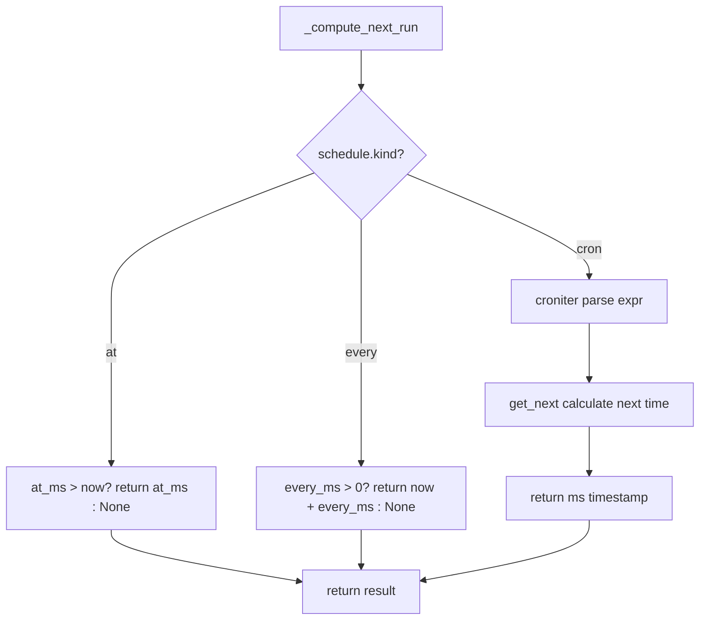
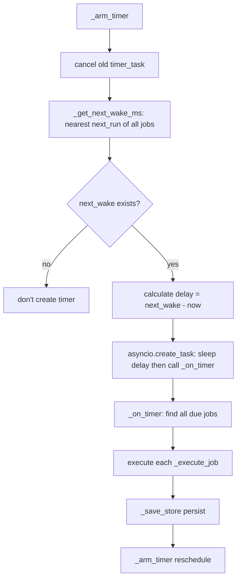

# PD-99.01 DeepCode — CronService Three-Mode Task Scheduling

> Document Number: PD-99.01
> Source: DeepCode `nanobot/nanobot/cron/service.py`
> GitHub: https://github.com/HKUDS/DeepCode.git
> Problem Domain: PD-99 Task Scheduling
> Status: Reusable Solution

---

## Chapter 1 Problem and Motivation

### 1.1 Core Problem

Agent systems need to execute periodic tasks unattended—checking GitHub stars on schedule, sending daily digest reports, reminding users at specified times. Traditional cron systems (like Linux crontab, APScheduler) are designed for operations staff; Agents cannot autonomously create and manage scheduled tasks. The core challenges are:

1. **Agent Autonomy**: Agents need to dynamically create scheduled tasks during conversations, not rely on manual configuration
2. **Multi-Mode Scheduling**: Three scenarios must be covered—one-time reminders (at), fixed intervals (every), complex time expressions (cron)
3. **Task Persistence**: Registered tasks must not be lost after process restart
4. **Execution Closure**: After scheduled trigger, tasks must re-enter the Agent loop for execution, not just send messages

### 1.2 DeepCode Solution Overview

DeepCode's nanobot implements a lightweight yet complete CronService scheduling system:

1. **Three-Mode Scheduling Engine**: `CronSchedule` dataclass supports `at` (one-time timestamp), `every` (millisecond interval), `cron` (standard cron expression) three kinds, unified in `_compute_next_run()` to calculate next execution time (`service.py:19-40`)
2. **asyncio Single-Timer Architecture**: Instead of creating independent timers for each job, maintains a global nearest wake-up time using a single `asyncio.Task` implementing sleep-then-tick loop (`service.py:186-203`)
3. **JSON File Persistence**: All jobs serialized to JSON stored on disk, loaded at startup, saved on changes (`service.py:57-148`)
4. **Tool Exposure to Agent**: `CronTool` inherits `Tool` base class, exposes `add/list/remove` three actions to LLM, Agent can autonomously schedule during conversations (`cron.py:10-108`)
5. **Agent Callback Execution**: After scheduled trigger, calls `agent.process_direct()` via `on_job` callback, allowing Agent to fully execute tasks rather than simply forward messages (`commands.py:369-387`)

### 1.3 Design Philosophy

| Design Principle | Implementation | Rationale | Alternative |
|----------|----------|------|----------|
| Single-Timer Polling | `_arm_timer()` creates only one asyncio.Task, sleeps until nearest job's next_run time | Avoids resource waste of N jobs creating N timers | APScheduler's per-job trigger |
| Dataclass-Driven | `CronSchedule`/`CronJob`/`CronPayload` defined with dataclass, JSON serializable | Lightweight, no ORM dependency, easy persistence | SQLite / Redis |
| Tool as Interface | `CronTool` inherits `Tool` ABC, exposes JSON Schema parameters | Agent autonomously operates via function calling | REST API / CLI commands |
| Callback-Based Execution | `on_job: Callable[[CronJob], Coroutine]` injects Agent processing logic | Decouples scheduling from execution, CronService independent of AgentLoop | Direct agent import in service |
| One-Shot Task Auto-Cleanup | `at` type auto-disables or deletes after execution (`delete_after_run` flag) | Prevents expired task accumulation | Manual cleanup |

---

## Chapter 2 Source Code Implementation Analysis

### 2.1 Architecture Overview

DeepCode's task scheduling system consists of three layers: type definition layer, service layer, tool layer, integrated with Agent loop via callbacks.

```
┌─────────────────────────────────────────────────────────┐
│                    CLI / Gateway                         │
│  commands.py: gateway() creates CronService + injects   │
│              callback                                    │
└──────────────┬──────────────────────────────┬───────────┘
               │ on_job callback              │ register
               ▼                              ▼
┌──────────────────────┐    ┌──────────────────────────────┐
│     CronService      │    │        AgentLoop             │
│  service.py          │    │  loop.py                     │
│                      │    │                              │
│  _arm_timer()        │    │  _register_default_tools()   │
│  _on_timer()         │◄───│    → CronTool(cron_service)  │
│  _execute_job()      │    │                              │
│  add_job()           │    │  _process_message()          │
│  remove_job()        │    │    → cron_tool.set_context()  │
│  list_jobs()         │    │                              │
└──────┬───────────────┘    └──────────────────────────────┘
       │ load/save                    ▲
       ▼                              │ execute()
┌──────────────────┐    ┌─────────────────────────┐
│  jobs.json       │    │      CronTool           │
│  (disk persist)  │    │  cron.py                │
│                  │    │  action: add/list/remove │
└──────────────────┘    └─────────────────────────┘
```

### 2.2 Core Implementation

#### 2.2.1 Three-Mode Scheduling Calculation



Corresponding source code `nanobot/nanobot/cron/service.py:19-40`:

```python
def _compute_next_run(schedule: CronSchedule, now_ms: int) -> int | None:
    """Compute next run time in ms."""
    if schedule.kind == "at":
        return schedule.at_ms if schedule.at_ms and schedule.at_ms > now_ms else None

    if schedule.kind == "every":
        if not schedule.every_ms or schedule.every_ms <= 0:
            return None
        # Next interval from now
        return now_ms + schedule.every_ms

    if schedule.kind == "cron" and schedule.expr:
        try:
            from croniter import croniter
            cron = croniter(schedule.expr, time.time())
            next_time = cron.get_next()
            return int(next_time * 1000)
        except Exception:
            return None

    return None
```

Key design points:
- Unified return of millisecond timestamp, three modes have no difference at call site
- `croniter` lazy import, dependency only needed when using cron expressions
- `at` mode returns `None` after expiration, caller decides whether to disable or delete

#### 2.2.2 Single-Timer Sleep-Tick Loop



Corresponding source code `nanobot/nanobot/cron/service.py:186-221`:

```python
def _arm_timer(self) -> None:
    """Schedule the next timer tick."""
    if self._timer_task:
        self._timer_task.cancel()

    next_wake = self._get_next_wake_ms()
    if not next_wake or not self._running:
        return

    delay_ms = max(0, next_wake - _now_ms())
    delay_s = delay_ms / 1000

    async def tick():
        await asyncio.sleep(delay_s)
        if self._running:
            await self._on_timer()

    self._timer_task = asyncio.create_task(tick())

async def _on_timer(self) -> None:
    """Handle timer tick - run due jobs."""
    if not self._store:
        return
    now = _now_ms()
    due_jobs = [
        j for j in self._store.jobs
        if j.enabled and j.state.next_run_at_ms and now >= j.state.next_run_at_ms
    ]
    for job in due_jobs:
        await self._execute_job(job)
    self._save_store()
    self._arm_timer()
```

This is the most elegant part of the entire scheduling system: instead of polling, it precisely sleeps until the next job's execution time. After each tick, it recalculates the next wake-up, forming a self-driving loop.

#### 2.2.3 Job Execution and Lifecycle Management

Corresponding source code `nanobot/nanobot/cron/service.py:223-253`:

```python
async def _execute_job(self, job: CronJob) -> None:
    """Execute a single job."""
    start_ms = _now_ms()
    try:
        if self.on_job:
            await self.on_job(job)
        job.state.last_status = "ok"
        job.state.last_error = None
    except Exception as e:
        job.state.last_status = "error"
        job.state.last_error = str(e)

    job.state.last_run_at_ms = start_ms
    job.updated_at_ms = _now_ms()

    # Handle one-shot jobs
    if job.schedule.kind == "at":
        if job.delete_after_run:
            self._store.jobs = [j for j in self._store.jobs if j.id != job.id]
        else:
            job.enabled = False
            job.state.next_run_at_ms = None
    else:
        job.state.next_run_at_ms = _compute_next_run(job.schedule, _now_ms())
```

### 2.3 Implementation Details

#### Data Model Layer (types.py)

`nanobot/nanobot/cron/types.py:7-64` defines 5 dataclasses:

- `CronSchedule`: Schedule definition, `kind` field distinguishes three modes, mode parameters mutually exclusive (at_ms / every_ms / expr)
- `CronPayload`: Execution payload, `kind` distinguishes `system_event` and `agent_turn`, latter triggers complete Agent loop
- `CronJobState`: Runtime state, records next/last execution times and status (ok/error/skipped)
- `CronJob`: Complete job definition, includes schedule + payload + state + metadata
- `CronStore`: Persistence container, includes version number

#### Agent Callback Closure (commands.py:369-387)

Gateway injects callback at startup, converting cron trigger to Agent conversation:

```python
async def on_cron_job(job: CronJob) -> str | None:
    response = await agent.process_direct(
        job.payload.message,
        session_key=f"cron:{job.id}",
        channel=job.payload.channel or "cli",
        chat_id=job.payload.to or "direct",
    )
    if job.payload.deliver and job.payload.to:
        await bus.publish_outbound(OutboundMessage(
            channel=job.payload.channel or "cli",
            chat_id=job.payload.to,
            content=response or "",
        ))
    return response
```

Each cron job has independent `session_key` (`cron:{job.id}`), ensuring conversation history isolation for scheduled tasks.

---

## Chapter 3 Migration Guide

### 3.1 Migration Checklist

**Phase 1: Core Scheduling Engine (Minimum Viable)**

- [ ] Create `cron/types.py`: Define five dataclasses `CronSchedule`, `CronJob`, `CronJobState`, `CronPayload`, `CronStore`
- [ ] Create `cron/service.py`: Implement `CronService` class with core methods `_compute_next_run()`, `_arm_timer()`, `_on_timer()`, `_execute_job()`
- [ ] Implement JSON file persistence: `_load_store()` / `_save_store()`
- [ ] Install `croniter` dependency (only needed when using cron expressions)

**Phase 2: Agent Tool Integration**

- [ ] Create `tools/cron.py`: Inherit your Tool base class, implement `add/list/remove` three actions
- [ ] Register CronTool during Agent initialization, inject CronService instance
- [ ] Call `cron_tool.set_context(channel, chat_id)` in message processing loop to set delivery context

**Phase 3: Execution Callback and Delivery**

- [ ] Create CronService at application startup, set `on_job` callback pointing to Agent's `process_direct()` method
- [ ] Implement message delivery logic: push results to corresponding channels based on `payload.deliver` and `payload.channel`

### 3.2 Adaptation Code Template

Below is a minimal scheduling engine implementation that can be directly reused:

```python
"""Minimal cron service - directly reusable scheduling engine template."""

import asyncio
import json
import time
import uuid
from dataclasses import dataclass, field
from pathlib import Path
from typing import Any, Callable, Coroutine, Literal


@dataclass
class Schedule:
    kind: Literal["at", "every", "cron"]
    at_ms: int | None = None
    every_ms: int | None = None
    expr: str | None = None


@dataclass
class JobState:
    next_run_at_ms: int | None = None
    last_run_at_ms: int | None = None
    last_status: str | None = None


@dataclass
class Job:
    id: str
    name: str
    schedule: Schedule
    message: str
    enabled: bool = True
    state: JobState = field(default_factory=JobState)
    delete_after_run: bool = False


def compute_next_run(schedule: Schedule, now_ms: int) -> int | None:
    if schedule.kind == "at":
        return schedule.at_ms if schedule.at_ms and schedule.at_ms > now_ms else None
    if schedule.kind == "every" and schedule.every_ms and schedule.every_ms > 0:
        return now_ms + schedule.every_ms
    if schedule.kind == "cron" and schedule.expr:
        from croniter import croniter
        return int(croniter(schedule.expr, time.time()).get_next() * 1000)
    return None


class MiniCronService:
    def __init__(
        self,
        store_path: Path,
        on_job: Callable[[Job], Coroutine[Any, Any, None]] | None = None,
    ):
        self.store_path = store_path
        self.on_job = on_job
        self._jobs: list[Job] = []
        self._timer: asyncio.Task | None = None
        self._running = False

    async def start(self) -> None:
        self._running = True
        self._load()
        self._recompute()
        self._save()
        self._arm()

    def stop(self) -> None:
        self._running = False
        if self._timer:
            self._timer.cancel()

    def add_job(self, name: str, schedule: Schedule, message: str) -> Job:
        now = int(time.time() * 1000)
        job = Job(
            id=str(uuid.uuid4())[:8],
            name=name,
            schedule=schedule,
            message=message,
            state=JobState(next_run_at_ms=compute_next_run(schedule, now)),
        )
        self._jobs.append(job)
        self._save()
        self._arm()
        return job

    def remove_job(self, job_id: str) -> bool:
        before = len(self._jobs)
        self._jobs = [j for j in self._jobs if j.id != job_id]
        if len(self._jobs) < before:
            self._save()
            self._arm()
            return True
        return False

    def list_jobs(self) -> list[Job]:
        return [j for j in self._jobs if j.enabled]

    # --- Internal methods ---

    def _arm(self) -> None:
        if self._timer:
            self._timer.cancel()
        times = [j.state.next_run_at_ms for j in self._jobs
                 if j.enabled and j.state.next_run_at_ms]
        if not times or not self._running:
            return
        delay = max(0, min(times) - int(time.time() * 1000)) / 1000

        async def tick():
            await asyncio.sleep(delay)
            if self._running:
                await self._tick()

        self._timer = asyncio.create_task(tick())

    async def _tick(self) -> None:
        now = int(time.time() * 1000)
        for job in [j for j in self._jobs
                    if j.enabled and j.state.next_run_at_ms
                    and now >= j.state.next_run_at_ms]:
            try:
                if self.on_job:
                    await self.on_job(job)
                job.state.last_status = "ok"
            except Exception:
                job.state.last_status = "error"
            job.state.last_run_at_ms = now
            if job.schedule.kind == "at":
                job.enabled = False
            else:
                job.state.next_run_at_ms = compute_next_run(job.schedule, now)
        self._save()
        self._arm()

    def _recompute(self) -> None:
        now = int(time.time() * 1000)
        for j in self._jobs:
            if j.enabled:
                j.state.next_run_at_ms = compute_next_run(j.schedule, now)

    def _load(self) -> None:
        if self.store_path.exists():
            data = json.loads(self.store_path.read_text())
            self._jobs = [
                Job(id=j["id"], name=j["name"],
                    schedule=Schedule(**j["schedule"]),
                    message=j["message"], enabled=j.get("enabled", True),
                    state=JobState(**j.get("state", {})))
                for j in data.get("jobs", [])
            ]

    def _save(self) -> None:
        self.store_path.parent.mkdir(parents=True, exist_ok=True)
        data = {"jobs": [
            {"id": j.id, "name": j.name, "message": j.message,
             "enabled": j.enabled,
             "schedule": {"kind": j.schedule.kind, "at_ms": j.schedule.at_ms,
                          "every_ms": j.schedule.every_ms, "expr": j.schedule.expr},
             "state": {"next_run_at_ms": j.state.next_run_at_ms,
                       "last_run_at_ms": j.state.last_run_at_ms,
                       "last_status": j.state.last_status}}
            for j in self._jobs
        ]}
        self.store_path.write_text(json.dumps(data, indent=2))
```

### 3.3 Applicable Scenarios

| Scenario | Suitability | Explanation |
|------|--------|----------|
| Agent autonomously creates timed reminders | ⭐⭐⭐ | Core scenario, CronTool directly exposed to LLM |
| Periodic data collection/monitoring | ⭐⭐⭐ | every mode + Agent callback execution for collection logic |
| Complex time expression scheduling | ⭐⭐⭐ | Cron expressions cover weekdays, specific times, etc. |
| High-precision scheduling (<1s) | ⭐ | asyncio.sleep precision limited, unsuitable for sub-second |
| Large-scale tasks (>1000 jobs) | ⭐ | Single JSON file + full in-memory loading, unsuitable for scale |
| Distributed multi-node scheduling | ⭐ | Single-process single-file design, no distributed locking |

---

## Chapter 4 Test Cases

```python
"""Tests for CronService - based on DeepCode real function signatures."""

import asyncio
import json
import time
from pathlib import Path
from unittest.mock import AsyncMock

import pytest


# --- Reuse types definitions ---
from dataclasses import dataclass, field
from typing import Literal


@dataclass
class CronSchedule:
    kind: Literal["at", "every", "cron"]
    at_ms: int | None = None
    every_ms: int | None = None
    expr: str | None = None
    tz: str | None = None


@dataclass
class CronJobState:
    next_run_at_ms: int | None = None
    last_run_at_ms: int | None = None
    last_status: str | None = None
    last_error: str | None = None


@dataclass
class CronPayload:
    kind: Literal["system_event", "agent_turn"] = "agent_turn"
    message: str = ""
    deliver: bool = False
    channel: str | None = None
    to: str | None = None


@dataclass
class CronJob:
    id: str
    name: str
    enabled: bool = True
    schedule: CronSchedule = field(default_factory=lambda: CronSchedule(kind="every"))
    payload: CronPayload = field(default_factory=CronPayload)
    state: CronJobState = field(default_factory=CronJobState)
    created_at_ms: int = 0
    updated_at_ms: int = 0
    delete_after_run: bool = False


class TestComputeNextRun:
    """Test _compute_next_run three-mode calculation."""

    def _now_ms(self):
        return int(time.time() * 1000)

    def test_at_future(self):
        """at mode: future timestamp should return that timestamp."""
        now = self._now_ms()
        schedule = CronSchedule(kind="at", at_ms=now + 60000)
        # Simulate _compute_next_run logic
        result = schedule.at_ms if schedule.at_ms and schedule.at_ms > now else None
        assert result == now + 60000

    def test_at_past(self):
        """at mode: past timestamp should return None."""
        now = self._now_ms()
        schedule = CronSchedule(kind="at", at_ms=now - 1000)
        result = schedule.at_ms if schedule.at_ms and schedule.at_ms > now else None
        assert result is None

    def test_every_positive(self):
        """every mode: positive interval should return now + interval."""
        now = self._now_ms()
        schedule = CronSchedule(kind="every", every_ms=5000)
        result = now + schedule.every_ms if schedule.every_ms and schedule.every_ms > 0 else None
        assert result == now + 5000

    def test_every_zero(self):
        """every mode: zero interval should return None."""
        schedule = CronSchedule(kind="every", every_ms=0)
        result = None if not schedule.every_ms or schedule.every_ms <= 0 else 1
        assert result is None


class TestCronServicePersistence:
    """Test JSON persistence."""

    def test_save_and_load(self, tmp_path: Path):
        """After saving, reloading should restore all jobs."""
        store_path = tmp_path / "cron" / "jobs.json"
        store_path.parent.mkdir(parents=True)

        # Write test data
        data = {
            "version": 1,
            "jobs": [{
                "id": "test-001",
                "name": "Test Job",
                "enabled": True,
                "schedule": {"kind": "every", "everyMs": 5000},
                "payload": {"kind": "agent_turn", "message": "hello"},
                "state": {"nextRunAtMs": None},
                "createdAtMs": 1000,
                "updatedAtMs": 1000,
                "deleteAfterRun": False,
            }]
        }
        store_path.write_text(json.dumps(data))

        # Verify file is readable
        loaded = json.loads(store_path.read_text())
        assert len(loaded["jobs"]) == 1
        assert loaded["jobs"][0]["id"] == "test-001"
        assert loaded["jobs"][0]["schedule"]["kind"] == "every"

    def test_empty_store(self, tmp_path: Path):
        """Non-existent store file should initialize as empty."""
        store_path = tmp_path / "nonexistent" / "jobs.json"
        assert not store_path.exists()


class TestCronToolActions:
    """Test CronTool add/list/remove operations."""

    def test_add_requires_message(self):
        """add operation missing message should return error."""
        # Simulate CronTool._add_job logic
        message = ""
        result = "Error: message is required for add" if not message else "ok"
        assert "Error" in result

    def test_add_requires_schedule(self):
        """add operation missing every_seconds and cron_expr should return error."""
        every_seconds = None
        cron_expr = None
        if not every_seconds and not cron_expr:
            result = "Error: either every_seconds or cron_expr is required"
        else:
            result = "ok"
        assert "Error" in result

    def test_remove_requires_job_id(self):
        """remove operation missing job_id should return error."""
        job_id = None
        result = "Error: job_id is required for remove" if not job_id else "ok"
        assert "Error" in result


class TestJobLifecycle:
    """Test job lifecycle management."""

    def test_at_job_disables_after_run(self):
        """at type job should be disabled after execution."""
        job = CronJob(
            id="once-001", name="One-shot",
            schedule=CronSchedule(kind="at", at_ms=int(time.time() * 1000)),
        )
        # Simulate at handling logic in _execute_job
        if job.schedule.kind == "at":
            if job.delete_after_run:
                pass  # would be removed from list
            else:
                job.enabled = False
                job.state.next_run_at_ms = None

        assert job.enabled is False
        assert job.state.next_run_at_ms is None

    def test_at_job_deletes_when_flagged(self):
        """at job with delete_after_run=True should be removed from list after execution."""
        jobs = [
            CronJob(id="del-001", name="Delete me",
                    schedule=CronSchedule(kind="at"),
                    delete_after_run=True),
            CronJob(id="keep-001", name="Keep me",
                    schedule=CronSchedule(kind="every", every_ms=5000)),
        ]
        # Simulate deletion logic
        target = jobs[0]
        if target.schedule.kind == "at" and target.delete_after_run:
            jobs = [j for j in jobs if j.id != target.id]

        assert len(jobs) == 1
        assert jobs[0].id == "keep-001"
```

---

## Chapter 5 Cross-Domain Associations

| Associated Domain | Relationship Type | Explanation |
|--------|----------|----------|
| PD-04 Tool System | Dependency | CronTool inherits Tool ABC, registered via ToolRegistry, depends on tool system's JSON Schema parameter definition and execute interface |
| PD-06 Memory Persistence | Collaboration | CronService's JSON file persistence similar to memory system's persistence strategy, both disk JSON + load-on-startup model |
| PD-02 Multi-Agent Orchestration | Collaboration | After cron job trigger, enters Agent loop via `process_direct()`, may trigger sub-agent orchestration |
| PD-03 Fault Tolerance and Retry | Collaboration | `_execute_job` captures exceptions and records `last_error`, but doesn't implement retry; can combine with PD-03's retry strategy |
| PD-09 Human-in-the-Loop | Complementary | Cron is automated scheduling (unattended), forms complement to HITL's manual approval—some scheduled tasks may require human confirmation before execution |
| PD-11 Observability | Collaboration | CronService uses loguru to log job execution, can integrate with PD-11's tracing system for scheduling observability |

---

## Chapter 6 Source File Index

| File | Line Range | Key Implementation |
|------|--------|----------|
| `nanobot/nanobot/cron/types.py` | L1-L65 | 5 dataclass definitions: CronSchedule, CronPayload, CronJobState, CronJob, CronStore |
| `nanobot/nanobot/cron/service.py` | L15-L18 | `_now_ms()` millisecond timestamp utility function |
| `nanobot/nanobot/cron/service.py` | L19-L40 | `_compute_next_run()` three-mode scheduling calculation core |
| `nanobot/nanobot/cron/service.py` | L43-L104 | `CronService.__init__` + `_load_store()` initialization and persistence loading |
| `nanobot/nanobot/cron/service.py` | L106-L148 | `_save_store()` JSON serialization and disk write |
| `nanobot/nanobot/cron/service.py` | L150-L159 | `start()` / `stop()` service lifecycle |
| `nanobot/nanobot/cron/service.py` | L168-L203 | `_recompute_next_runs()` + `_arm_timer()` single-timer scheduling core |
| `nanobot/nanobot/cron/service.py` | L205-L253 | `_on_timer()` + `_execute_job()` task execution and lifecycle management |
| `nanobot/nanobot/cron/service.py` | L257-L300 | `list_jobs()` / `add_job()` public API |
| `nanobot/nanobot/cron/service.py` | L302-L352 | `remove_job()` / `enable_job()` / `run_job()` / `status()` |
| `nanobot/nanobot/agent/tools/cron.py` | L10-L108 | CronTool complete implementation: Tool inheritance, parameter Schema, add/list/remove three actions |
| `nanobot/nanobot/agent/tools/base.py` | L7-L104 | Tool ABC base class: name/description/parameters/execute abstract interface + validate_params |
| `nanobot/nanobot/agent/loop.py` | L115-L117 | CronTool registration in AgentLoop |
| `nanobot/nanobot/agent/loop.py` | L191-L193 | Set CronTool's channel/chat_id context during message processing |
| `nanobot/nanobot/cli/commands.py` | L350-L352 | Gateway creates CronService, store_path points to data_dir/cron/jobs.json |
| `nanobot/nanobot/cli/commands.py` | L369-L389 | on_cron_job callback: converts cron trigger to Agent process_