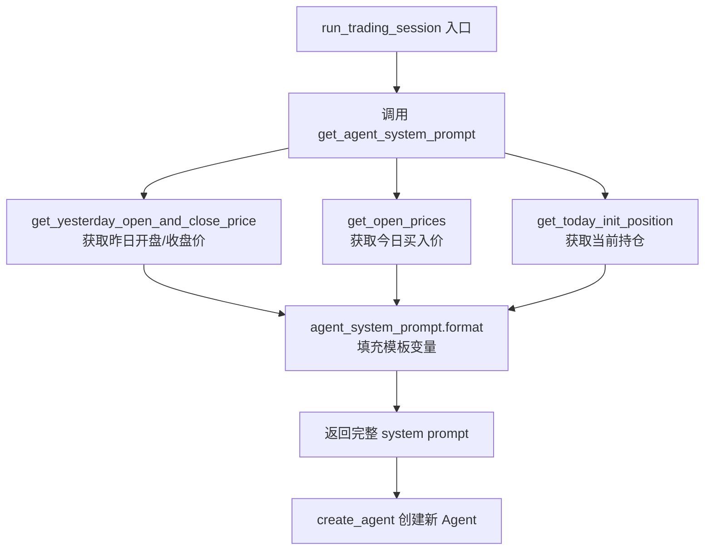
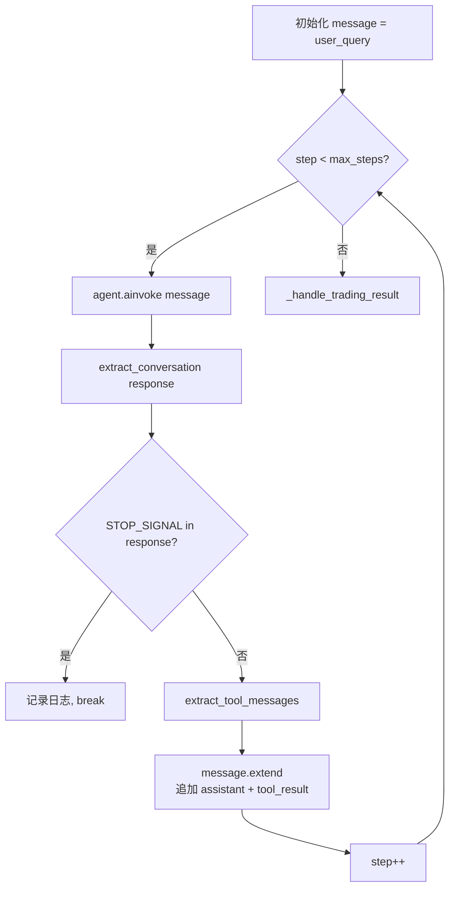

# PD-01.31 AI-Trader — 每日动态 Prompt 注入与步数限制上下文管理

> 文档编号：PD-01.31
> 来源：AI-Trader `prompts/agent_prompt.py` `agent/base_agent/base_agent.py`
> GitHub：https://github.com/HKUDS/AI-Trader.git
> 问题域：PD-01 上下文管理 Context Window Management
> 状态：可复用方案

---

## 第 1 章 问题与动机

### 1.1 核心问题

金融交易 Agent 面临一个独特的上下文管理挑战：**每个交易日的决策上下文完全不同**。持仓数据、实时价格、昨日收益等信息每天都在变化，必须在每次 LLM 调用前动态注入到 system prompt 中。同时，交易推理过程中工具调用结果（价格查询、搜索结果、交易执行反馈）会持续追加到消息列表，如果不加控制，消息列表会无限增长直到超出上下文窗口。

AI-Trader 的核心问题可以分解为三个子问题：

1. **动态数据注入**：如何在每个交易日开始时，将当日的持仓、价格、收益等实时数据注入 system prompt？
2. **推理步数控制**：如何防止 Agent 在工具调用循环中无限推理，消耗过多 token？
3. **多市场 Prompt 适配**：美股、A 股、加密货币三个市场需要不同的 prompt 模板，如何管理？

### 1.2 AI-Trader 的解法概述

AI-Trader 采用了一种**"每日重建 + 步数硬限 + 信号终止"**的三层上下文管理策略：

1. **每日 Prompt 重建**：每个交易日调用 `get_agent_system_prompt()` 重新构建 system prompt，注入当日实时数据（`prompts/agent_prompt.py:62-88`）
2. **max_steps 步数硬限**：通过 `while current_step < self.max_steps` 循环控制最大推理步数，默认 30 步（`agent/base_agent/base_agent.py:478`）
3. **STOP_SIGNAL 主动终止**：Agent 输出 `<FINISH_SIGNAL>` 时立即终止会话，避免无意义的后续推理（`prompts/agent_prompt.py:23`）
4. **消息列表线性追加**：每步工具调用结果以 `message.extend()` 追加到消息列表，无压缩无裁剪（`agent/base_agent/base_agent.py:507`）
5. **多市场模板分离**：US/CN/Crypto 三套独立的 prompt 模板文件，通过市场参数路由（`prompts/agent_prompt.py`, `prompts/agent_prompt_astock.py`, `prompts/agent_prompt_crypto.py`）

### 1.3 设计思想

| 设计原则 | 具体实现 | 理由 | 替代方案 |
|----------|----------|------|----------|
| 每日上下文隔离 | 每个交易日重建 Agent 实例和 system prompt | 交易决策不应受前一天残留上下文影响 | 跨日累积上下文 + 摘要压缩 |
| 步数硬限优于 token 估算 | `max_steps=30` 控制循环次数 | 金融场景下推理步数可预测，比 token 计数更简单可靠 | tiktoken 估算 + 动态裁剪 |
| Agent 自主终止 | `<FINISH_SIGNAL>` 信号机制 | 让 LLM 自己判断任务是否完成，比固定步数更灵活 | 仅依赖 max_steps 超时 |
| 模板分离而非参数化 | 三个独立 prompt 文件 | A 股有特殊规则（T+1、涨跌停、一手=100股），无法用简单参数覆盖 | 单模板 + 条件分支 |
| 无压缩策略 | 消息列表只追加不裁剪 | 交易场景步数有限（≤30），总 token 量可控 | 滑动窗口 / 摘要压缩 |

---

## 第 2 章 源码实现分析

### 2.1 架构概览

AI-Trader 的上下文管理架构围绕"每日交易会话"展开，核心组件关系如下：

```
┌─────────────────────────────────────────────────────────┐
│                    main.py / Config JSON                 │
│  ┌─────────────┐  ┌──────────────┐  ┌────────────────┐  │
│  │ max_steps=30│  │ market="us"  │  │ date_range     │  │
│  └──────┬──────┘  └──────┬───────┘  └───────┬────────┘  │
└─────────┼────────────────┼──────────────────┼───────────┘
          │                │                  │
          ▼                ▼                  ▼
┌─────────────────────────────────────────────────────────┐
│              BaseAgent.__init__()                         │
│  self.max_steps ← config                                │
│  self.market ← config                                   │
└─────────────────────┬───────────────────────────────────┘
                      │ for each trading_date
                      ▼
┌─────────────────────────────────────────────────────────┐
│           run_trading_session(today_date)                 │
│                                                          │
│  1. get_agent_system_prompt(today_date, signature)       │
│     → 注入: date, positions, prices, STOP_SIGNAL        │
│                                                          │
│  2. create_agent(model, tools, system_prompt)            │
│     → 每日重建 Agent 实例                                │
│                                                          │
│  3. while step < max_steps:                              │
│       response = agent.ainvoke(message)                  │
│       if STOP_SIGNAL in response: break                  │
│       message.extend([assistant_msg, tool_result])       │
└─────────────────────────────────────────────────────────┘
```

### 2.2 核心实现

#### 2.2.1 每日动态 Prompt 构建



对应源码 `prompts/agent_prompt.py:62-88`：

```python
def get_agent_system_prompt(
    today_date: str, signature: str, market: str = "us",
    stock_symbols: Optional[List[str]] = None
) -> str:
    # Auto-select stock symbols based on market if not provided
    if stock_symbols is None:
        stock_symbols = all_sse_50_symbols if market == "cn" else all_nasdaq_100_symbols

    # Get yesterday's buy and sell prices
    yesterday_buy_prices, yesterday_sell_prices = get_yesterday_open_and_close_price(
        today_date, stock_symbols, market=market
    )
    today_buy_price = get_open_prices(today_date, stock_symbols, market=market)
    today_init_position = get_today_init_position(today_date, signature)

    return agent_system_prompt.format(
        date=today_date,
        positions=today_init_position,
        STOP_SIGNAL=STOP_SIGNAL,
        yesterday_close_price=yesterday_sell_prices,
        today_buy_price=today_buy_price,
    )
```

关键设计点：
- **数据实时查询**：每次调用都从 `data/merged.jsonl` 读取最新价格数据，不缓存
- **持仓从 JSONL 读取**：`get_today_init_position` 从 `position.jsonl` 读取最新持仓记录
- **模板变量注入**：使用 Python `str.format()` 将 5 个动态变量注入 prompt 模板

#### 2.2.2 交易循环与步数控制



对应源码 `agent/base_agent/base_agent.py:437-519`：

```python
async def run_trading_session(self, today_date: str) -> None:
    # 每日重建 Agent（关键！不复用前一天的 Agent）
    self.agent = create_agent(
        self.model,
        tools=self.tools,
        system_prompt=get_agent_system_prompt(
            today_date, self.signature, self.market, self.stock_symbols
        ),
    )

    # 初始用户消息
    user_query = [{"role": "user",
                   "content": f"Please analyze and update today's ({today_date}) positions."}]
    message = user_query.copy()

    # 交易循环 — max_steps 硬限
    current_step = 0
    while current_step < self.max_steps:
        current_step += 1
        response = await self._ainvoke_with_retry(message)
        agent_response = extract_conversation(response, "final")

        # STOP_SIGNAL 主动终止
        if STOP_SIGNAL in agent_response:
            break

        # 工具结果追加到消息列表（无压缩）
        tool_msgs = extract_tool_messages(response)
        tool_response = "\n".join([msg.content for msg in tool_msgs])
        new_messages = [
            {"role": "assistant", "content": agent_response},
            {"role": "user", "content": f"Tool results: {tool_response}"},
        ]
        message.extend(new_messages)
```

### 2.3 实现细节

#### 多市场 Prompt 模板差异

三套 prompt 模板的核心差异在于**市场规则注入**：

| 市场 | 模板文件 | 特殊规则 | 额外数据 |
|------|----------|----------|----------|
| US | `agent_prompt.py:25-59` | 无特殊限制 | 基础 4 变量 |
| CN | `agent_prompt_astock.py:30-96` | T+1 结算、一手=100 股、涨跌停限制 | +收益数据 +中文股票名 |
| Crypto | `agent_prompt_crypto.py:24-62` | 24/7 交易、UTC 00:00 基准 | 基础 4 变量 |

A 股模板（`agent_prompt_astock.py:59-76`）包含了大量交易规则指令，这些规则本身就占用了显著的 token 预算：

```python
# A股模板额外注入的规则（约 300 tokens）
"""
🇨🇳 重要 - A股交易规则（适用于所有 .SH 和 .SZ 股票代码）：
1. **股票代码格式**: symbol 参数必须包含 .SH 或 .SZ 后缀
2. **一手交易要求**: 所有买卖订单必须是100股的整数倍
3. **T+1结算规则**: 当天买入的股票不能当天卖出
4. **涨跌停限制**: 普通股票±10%, ST±5%, 科创板/创业板±20%
"""
```

#### 配置驱动的步数控制

`max_steps` 通过 JSON 配置文件注入，不同场景有不同默认值：

| 配置文件 | max_steps | 场景 |
|----------|-----------|------|
| `default_config.json` | 30 | 美股日线 |
| `default_day_config.json` | 30 | 美股日线 |
| `default_hour_config.json` | 30 | 美股小时线 |
| `astock_config.json` | 30 | A 股日线 |
| `astock_hour_config.json` | 30 | A 股小时线 |
| `default_astock_config.json` | 2 | A 股快速测试 |
| `default_crypto_config.json` | 10 | 加密货币 |

配置加载路径 `main.py:175`：
```python
max_steps = agent_config.get("max_steps", 10)
```

#### 消息提取与日志持久化

`extract_conversation()` 函数（`tools/general_tools.py:72-131`）从 LangChain 的响应对象中提取最终回复，支持两种模式：
- `"final"` — 返回最后一条 `finish_reason == "stop"` 的 AI 消息
- `"all"` — 返回完整消息列表

每步的消息都通过 `_log_message()` 写入 JSONL 日志文件（`agent/base_agent/base_agent.py:413-421`），路径格式为 `data/agent_data/{signature}/log/{date}/log.jsonl`。


---

## 第 3 章 迁移指南

### 3.1 迁移清单

**阶段 1：Prompt 模板化（1 个文件）**
- [ ] 定义 system prompt 模板字符串，预留 `{date}`, `{positions}`, `{STOP_SIGNAL}` 等占位符
- [ ] 实现 `get_system_prompt()` 函数，从数据源查询实时数据并填充模板
- [ ] 定义 `STOP_SIGNAL` 常量（如 `<FINISH_SIGNAL>`）

**阶段 2：交易循环控制（1 个文件）**
- [ ] 实现 `max_steps` 参数化的 while 循环
- [ ] 在循环内检测 `STOP_SIGNAL` 并 break
- [ ] 实现 `message.extend()` 追加工具结果

**阶段 3：多场景模板（可选）**
- [ ] 为不同业务场景创建独立的 prompt 模板文件
- [ ] 通过配置参数路由到对应模板

### 3.2 适配代码模板

以下是一个可直接复用的通用版本，抽象了 AI-Trader 的核心模式：

```python
from typing import Any, Dict, List, Optional
from dataclasses import dataclass

STOP_SIGNAL = "<FINISH_SIGNAL>"

# --- Prompt 模板 ---
SYSTEM_PROMPT_TEMPLATE = """
You are a {role} assistant.

{role_specific_rules}

Current context:
{dynamic_context}

When your task is complete, output {STOP_SIGNAL}
"""

@dataclass
class SessionContext:
    """每次会话的动态上下文数据"""
    date: str
    dynamic_data: Dict[str, Any]
    role_rules: str = ""

def build_system_prompt(ctx: SessionContext, role: str = "general") -> str:
    """每次会话重建 system prompt（AI-Trader 模式）"""
    context_lines = [f"- {k}: {v}" for k, v in ctx.dynamic_data.items()]
    return SYSTEM_PROMPT_TEMPLATE.format(
        role=role,
        role_specific_rules=ctx.role_rules,
        dynamic_context="\n".join(context_lines),
        STOP_SIGNAL=STOP_SIGNAL,
    )

# --- 步数限制交易循环 ---
async def run_session(
    agent_factory,  # callable(system_prompt) -> agent
    context: SessionContext,
    max_steps: int = 30,
    initial_query: str = "Please analyze the current situation.",
) -> List[Dict[str, str]]:
    """
    AI-Trader 风格的步数限制会话循环。

    Returns:
        完整的消息历史
    """
    system_prompt = build_system_prompt(context)
    agent = agent_factory(system_prompt)

    messages = [{"role": "user", "content": initial_query}]

    for step in range(1, max_steps + 1):
        response = await agent.ainvoke({"messages": messages})
        assistant_content = extract_final_response(response)

        if STOP_SIGNAL in assistant_content:
            messages.append({"role": "assistant", "content": assistant_content})
            break

        tool_results = extract_tool_results(response)
        messages.extend([
            {"role": "assistant", "content": assistant_content},
            {"role": "user", "content": f"Tool results: {tool_results}"},
        ])

    return messages
```

### 3.3 适用场景

| 场景 | 适用度 | 说明 |
|------|--------|------|
| 每日/周期性决策 Agent | ⭐⭐⭐ | 每个周期上下文完全独立，天然适合每日重建模式 |
| 工具调用步数可预测的任务 | ⭐⭐⭐ | max_steps 硬限简单有效 |
| 多市场/多角色 Agent | ⭐⭐⭐ | 模板分离模式直接可用 |
| 长对话/多轮交互 Agent | ⭐ | 无压缩策略，消息列表会无限增长 |
| 需要跨会话记忆的场景 | ⭐ | 每日重建会丢失前一天的推理过程 |
| token 预算敏感的场景 | ⭐⭐ | 无 token 估算，依赖步数间接控制 |

---

## 第 4 章 测试用例

```python
import pytest
from unittest.mock import AsyncMock, MagicMock, patch
from typing import Dict, List, Optional

# 模拟 AI-Trader 的核心函数签名
STOP_SIGNAL = "<FINISH_SIGNAL>"

class TestDynamicPromptInjection:
    """测试每日动态 Prompt 注入"""

    def test_prompt_contains_date(self):
        """system prompt 必须包含当日日期"""
        prompt_template = """Current time:\n{date}\nPositions:\n{positions}"""
        result = prompt_template.format(
            date="2025-10-15",
            positions={"AAPL": 100, "CASH": 5000}
        )
        assert "2025-10-15" in result

    def test_prompt_contains_stop_signal(self):
        """system prompt 必须包含 STOP_SIGNAL"""
        prompt_template = """When done, output {STOP_SIGNAL}"""
        result = prompt_template.format(STOP_SIGNAL=STOP_SIGNAL)
        assert "<FINISH_SIGNAL>" in result

    def test_prompt_contains_positions(self):
        """system prompt 必须包含持仓数据"""
        positions = {"NVDA": 50, "MSFT": 30, "CASH": 8000.0}
        prompt_template = """Positions:\n{positions}"""
        result = prompt_template.format(positions=positions)
        assert "NVDA" in result
        assert "CASH" in result

    def test_different_markets_different_prompts(self):
        """不同市场应生成不同的 prompt"""
        us_template = "You are a stock trading assistant."
        cn_template = "你是一位A股基本面分析交易助手。"
        crypto_template = "You are a cryptocurrency trading assistant."
        assert us_template != cn_template != crypto_template


class TestStepLimitControl:
    """测试步数限制控制"""

    @pytest.mark.asyncio
    async def test_max_steps_terminates_loop(self):
        """达到 max_steps 时循环必须终止"""
        max_steps = 3
        steps_executed = 0
        messages = [{"role": "user", "content": "start"}]

        for step in range(1, max_steps + 1):
            steps_executed += 1
            # 模拟 Agent 不输出 STOP_SIGNAL
            messages.extend([
                {"role": "assistant", "content": "thinking..."},
                {"role": "user", "content": "Tool results: ..."},
            ])

        assert steps_executed == max_steps
        # 初始 1 条 + 每步 2 条
        assert len(messages) == 1 + max_steps * 2

    @pytest.mark.asyncio
    async def test_stop_signal_early_termination(self):
        """STOP_SIGNAL 应在 max_steps 之前终止循环"""
        max_steps = 30
        responses = ["thinking...", "analyzing...", f"Done. {STOP_SIGNAL}"]
        steps_executed = 0

        for step in range(1, max_steps + 1):
            steps_executed += 1
            response = responses[min(step - 1, len(responses) - 1)]
            if STOP_SIGNAL in response:
                break

        assert steps_executed == 3
        assert steps_executed < max_steps

    def test_message_list_grows_linearly(self):
        """消息列表应线性增长（每步 +2 条）"""
        messages = [{"role": "user", "content": "start"}]
        for step in range(5):
            messages.extend([
                {"role": "assistant", "content": f"step {step}"},
                {"role": "user", "content": f"Tool results: result_{step}"},
            ])
        assert len(messages) == 1 + 5 * 2  # 11 条


class TestExtractConversation:
    """测试消息提取逻辑"""

    def test_extract_final_with_stop_reason(self):
        """应优先返回 finish_reason=stop 的消息"""
        messages = [
            {"content": "tool call", "response_metadata": {"finish_reason": "tool_calls"}},
            {"content": "final answer", "response_metadata": {"finish_reason": "stop"}},
        ]
        # 模拟 extract_conversation 的 "final" 逻辑
        for msg in reversed(messages):
            if msg.get("response_metadata", {}).get("finish_reason") == "stop":
                result = msg["content"]
                break
        assert result == "final answer"
```


---

## 第 5 章 跨域关联

| 关联域 | 关系类型 | 说明 |
|--------|----------|------|
| PD-03 容错与重试 | 协同 | `_ainvoke_with_retry` 在每步调用中实现指数退避重试（`base_agent.py:423-435`），max_retries=3 |
| PD-04 工具系统 | 依赖 | 上下文中的工具结果来自 MCP 工具调用，工具数量影响 system prompt 的 token 占用 |
| PD-06 记忆持久化 | 协同 | 每步消息写入 JSONL 日志（`base_agent.py:413-421`），持仓写入 `position.jsonl`，但不用于跨日上下文恢复 |
| PD-11 可观测性 | 协同 | JSONL 日志记录每步的 assistant 和 tool 消息，支持事后分析交易决策过程 |
| PD-09 Human-in-the-Loop | 互斥 | AI-Trader 明确在 prompt 中声明"不需要请求用户许可，可以直接执行"，无人工审批环节 |

---

## 第 6 章 来源文件索引

| 文件 | 行范围 | 关键实现 |
|------|--------|----------|
| `prompts/agent_prompt.py` | L23 | STOP_SIGNAL 常量定义 `<FINISH_SIGNAL>` |
| `prompts/agent_prompt.py` | L25-59 | US 市场 system prompt 模板（5 个动态变量） |
| `prompts/agent_prompt.py` | L62-88 | `get_agent_system_prompt()` 动态数据查询与模板填充 |
| `prompts/agent_prompt_astock.py` | L30-96 | A 股 system prompt 模板（含 T+1、涨跌停等规则） |
| `prompts/agent_prompt_astock.py` | L99-148 | `get_agent_system_prompt_astock()` A 股数据注入 |
| `prompts/agent_prompt_crypto.py` | L24-62 | 加密货币 system prompt 模板 |
| `agent/base_agent/base_agent.py` | L223-276 | BaseAgent.__init__() max_steps 等参数初始化 |
| `agent/base_agent/base_agent.py` | L437-519 | `run_trading_session()` 交易循环主逻辑 |
| `agent/base_agent/base_agent.py` | L423-435 | `_ainvoke_with_retry()` 指数退避重试 |
| `agent/base_agent/base_agent.py` | L450-454 | 每日重建 Agent 实例（create_agent） |
| `agent/base_agent/base_agent_hour.py` | L42-128 | 小时级交易会话（同模式，增强错误处理） |
| `tools/general_tools.py` | L72-131 | `extract_conversation()` 消息提取（final/all 模式） |
| `tools/general_tools.py` | L134-166 | `extract_tool_messages()` 工具消息过滤 |
| `configs/default_config.json` | L43 | max_steps=30 默认配置 |
| `configs/default_crypto_config.json` | L41 | max_steps=10 加密货币配置 |
| `configs/default_astock_config.json` | L43 | max_steps=2 A 股快速测试配置 |

---

## 第 7 章 横向对比维度

> **重要：** 本章用于自动填充 Butcher Wiki 的横向对比表。

```json comparison_data
{
  "project": "AI-Trader",
  "dimensions": {
    "估算方式": "无 token 估算，依赖 max_steps 步数间接控制上下文增长",
    "压缩策略": "无压缩，消息列表只追加不裁剪",
    "触发机制": "每个交易日重建 Agent，STOP_SIGNAL 主动终止",
    "实现位置": "prompts/ 模板层 + BaseAgent 循环层双层实现",
    "容错设计": "指数退避重试 max_retries=3，无上下文溢出处理",
    "Prompt模板化": "三市场独立模板文件，str.format() 动态变量注入",
    "多维停止决策": "STOP_SIGNAL + max_steps 双重终止条件",
    "保留策略": "全量保留，每步 assistant+tool 消息线性追加",
    "供应商适配": "DeepSeekChatOpenAI 子类修复 tool_calls.args 格式差异",
    "实时数据注入": "每日从 JSONL 查询价格/持仓/收益注入 system prompt"
  }
}
```

### 域元数据补充

```json domain_metadata
{
  "solution_summary": "AI-Trader 每个交易日重建 Agent 实例，通过 str.format() 将持仓/价格/收益等实时数据注入 system prompt，max_steps + STOP_SIGNAL 双重机制控制推理步数",
  "description": "周期性任务场景下通过会话隔离替代上下文压缩的轻量级管理策略",
  "sub_problems": [
    "实时数据注入：每次会话前从外部数据源查询最新状态并填充 prompt 模板变量",
    "多市场规则差异化注入：不同业务场景需要在 prompt 中注入不同的领域规则（如 A 股 T+1）",
    "步数与信号双重终止：max_steps 硬限 + Agent 自主 STOP_SIGNAL 的协同终止策略"
  ],
  "best_practices": [
    "周期性任务优先考虑会话隔离：每个周期重建 Agent 比跨周期压缩更简单可靠",
    "步数限制应配置化：不同场景（日线 30 步 vs 加密货币 10 步）需要不同的 max_steps",
    "领域规则直接写入 prompt 模板：A 股 T+1 等硬性规则比工具返回更可靠"
  ]
}
```
