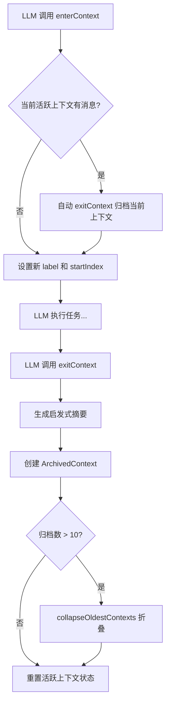
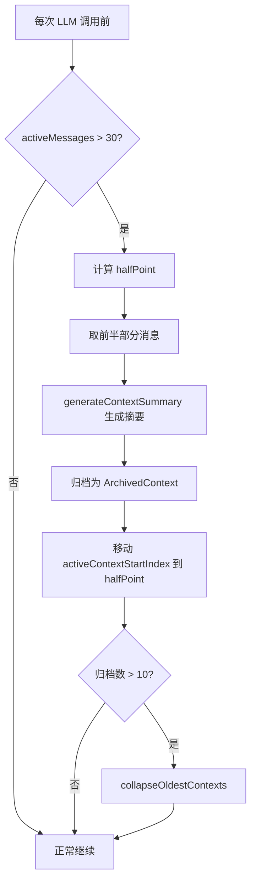

# PD-01.09 AIRI — 双层上下文边界与启发式摘要归档

> 文档编号：PD-01.09
> 来源：AIRI `services/minecraft/src/cognitive/conscious/brain.ts`, `context-summary.ts`, `services/satori-bot/src/core/loop/scheduler.ts`
> GitHub：https://github.com/moeru-ai/airi.git
> 问题域：PD-01 上下文管理 Context Window Management
> 状态：可复用方案

---

## 第 1 章 问题与动机

### 1.1 核心问题

AIRI 是一个多平台 AI 角色系统，同时运行 Minecraft 游戏 Bot 和 Satori 聊天 Bot。两个子系统面临不同粒度的上下文管理挑战：

- **Minecraft Brain**：长时间运行的游戏会话中，Bot 需要持续感知环境（位置、血量、附近玩家）、接收玩家指令、执行多步任务（挖矿、建造、跟随）。单次会话可能产生数百轮对话，直接全量送入 LLM 会超出 context window。
- **Satori Bot**：多频道聊天场景，每个频道独立维护对话历史。消息量大但单次交互较短，需要简单高效的裁剪策略。

核心矛盾：**任务连续性 vs 上下文有限性**。Bot 需要记住"我正在帮玩家建房子，已经完成了地基"这类任务状态，但不能把所有历史消息都塞进 prompt。

### 1.2 AIRI 的解法概述

AIRI 采用**双层架构**，两个子系统各自实现适合自身场景的上下文管理：

1. **Minecraft Brain — 上下文边界系统**：通过 `enterContext(label)` / `exitContext(summary)` 将对话切分为任务块，退出时生成启发式摘要并归档。活跃上下文超 30 条自动裁剪一半，归档摘要超 10 条自动折叠合并。LLM 只看到当前活跃消息 + 归档摘要前缀。(`brain.ts:521-633`)
2. **Satori Bot — 简单滑动窗口**：消息超 20 条时保留最近 5 条，动作超 50 条时保留最近 20 条，裁剪时注入系统提示告知 LLM 历史已丢失。(`scheduler.ts:48-71`, `constants.ts:12-21`)
3. **对话历史硬上限**：Minecraft Brain 维护 200 条消息的内存安全网，防止极端场景下内存无限增长。(`brain.ts:2059-2064`)
4. **历史查询运行时**：通过 `history` REPL 对象，LLM 可以主动搜索归档上下文和活跃历史，无需全量加载。(`history-query.ts:30-207`)
5. **感知快照差分**：只在环境状态变化时注入 `[PERCEPTION]` 块，避免重复信息占用 token。(`brain.ts:2240-2243`)

### 1.3 设计思想

| 设计原则 | 具体实现 | 理由 | 替代方案 |
|----------|----------|------|----------|
| LLM 自主管理上下文边界 | `enterContext`/`exitContext` 暴露给 REPL，由 LLM 决定何时切换任务 | 游戏任务边界不可预测，硬编码规则无法覆盖所有场景 | 固定轮数自动切割 |
| 启发式摘要替代 LLM 摘要 | `generateContextSummary` 从 llmLog 提取动作序列，无 LLM 调用 | 避免摘要本身消耗 token 和延迟，游戏场景对实时性要求高 | 用小模型生成摘要 |
| 双层裁剪互不干扰 | 活跃上下文 30 条自动裁剪 + 总历史 200 条硬上限 | 活跃裁剪保证 LLM 输入可控，硬上限保证内存安全 | 单一阈值裁剪 |
| 归档折叠防止前缀膨胀 | 超过 10 条归档时合并最旧的为一条 meta-summary | 归档摘要本身也占 token，需要二级压缩 | 直接丢弃最旧归档 |
| 裁剪时通知 LLM | Satori Bot 注入 "reducing... memory..." 系统消息 | 让 LLM 知道历史已丢失，避免引用不存在的上下文 | 静默裁剪 |

---

## 第 2 章 源码实现分析

### 2.1 架构概览

AIRI 的上下文管理分布在两个独立服务中，各自有不同的复杂度：

```
┌─────────────────────────────────────────────────────────────┐
│                    AIRI Context Management                   │
├──────────────────────────┬──────────────────────────────────┤
│   Minecraft Brain        │   Satori Bot                     │
│   (高级边界系统)          │   (简单滑动窗口)                  │
│                          │                                  │
│  ┌──────────────────┐    │  ┌────────────────────┐          │
│  │ enterContext()   │    │  │ MAX_MESSAGES = 20  │          │
│  │ exitContext()    │    │  │ KEEP_ON_TRIM = 5   │          │
│  │ autoTrim(30)     │    │  │ slice(-5) + notify │          │
│  └────────┬─────────┘    │  └────────────────────┘          │
│           ↓              │                                  │
│  ┌──────────────────┐    │                                  │
│  │ ArchivedContext[] │    │                                  │
│  │ (摘要归档池)      │    │                                  │
│  │ max=10, 超限折叠  │    │                                  │
│  └────────┬─────────┘    │                                  │
│           ↓              │                                  │
│  ┌──────────────────┐    │                                  │
│  │ [CONTEXT_HISTORY]│    │                                  │
│  │ 前缀注入 LLM     │    │                                  │
│  └──────────────────┘    │                                  │
│           +              │                                  │
│  ┌──────────────────┐    │                                  │
│  │ history runtime  │    │                                  │
│  │ (REPL 查询接口)   │    │                                  │
│  └──────────────────┘    │                                  │
├──────────────────────────┴──────────────────────────────────┤
│  共同安全网：conversationHistory 200 条硬上限                  │
└─────────────────────────────────────────────────────────────┘
```

### 2.2 核心实现

#### 2.2.1 上下文边界：enterContext / exitContext



对应源码 `services/minecraft/src/cognitive/conscious/brain.ts:521-633`：

```typescript
public enterContext(label: string): { ok: true, label: string, turnId: number } {
    const normalizedLabel = (typeof label === 'string' && label.trim()) ? label.trim() : 'unnamed'

    // If the current active context has messages, auto-exit it first
    const activeMessageCount = this.conversationHistory.length - this.activeContextStartIndex
    if (activeMessageCount > 0) {
      this.exitCurrentContext(undefined, 'auto_exit_on_enter')
    }

    this.activeContextState = {
      label: normalizedLabel,
      startTurnId: this.turnCounter,
      startedAt: Date.now(),
    }
    this.activeContextStartIndex = this.conversationHistory.length
    return { ok: true, label: normalizedLabel, turnId: this.turnCounter }
  }

  private exitCurrentContext(
    providedSummary: string | undefined,
    reason: 'explicit' | 'auto_exit_on_enter' | 'auto_trim',
  ): { ok: true, summarized: string, messagesArchived: number } {
    const activeMessages = this.conversationHistory.slice(this.activeContextStartIndex)
    const label = this.activeContextState.label || 'unnamed'

    // Generate summary: prefer LLM-provided, fall back to heuristic
    const summaryText = providedSummary || generateContextSummary({
      messages: activeMessages,
      label,
      llmLogEntries: this.llmLogEntries,
      startTurnId: this.activeContextState.startTurnId,
      endTurnId: this.turnCounter,
    })

    const archived: ArchivedContext = {
      label,
      summary: summaryText,
      startTurnId: this.activeContextState.startTurnId,
      endTurnId: this.turnCounter,
      messageCount: activeMessages.length,
      archivedAt: Date.now(),
    }
    this.archivedContexts.push(archived)

    // Collapse oldest contexts if prefix is too large
    if (this.archivedContexts.length > MAX_CONTEXT_SUMMARIES_IN_PREFIX) {
      const collapseCount = this.archivedContexts.length - MAX_CONTEXT_SUMMARIES_IN_PREFIX + 1
      this.archivedContexts = collapseOldestContexts(this.archivedContexts, collapseCount)
    }

    this.activeContextStartIndex = this.conversationHistory.length
    return { ok: true, summarized: summaryText, messagesArchived: activeMessages.length }
  }
```

#### 2.2.2 活跃上下文自动裁剪



对应源码 `services/minecraft/src/cognitive/conscious/brain.ts:652-705`：

```typescript
private autoTrimActiveContext(): void {
    const activeMessageCount = this.conversationHistory.length - this.activeContextStartIndex
    if (activeMessageCount <= MAX_ACTIVE_CONTEXT_MESSAGES)
      return

    // Split: archive the oldest half, keep the newest half as active
    const halfPoint = this.activeContextStartIndex + Math.floor(activeMessageCount / 2)
    const oldMessages = this.conversationHistory.slice(this.activeContextStartIndex, halfPoint)

    const summaryText = generateContextSummary({
      messages: oldMessages,
      label: this.activeContextState.label
        ? `${this.activeContextState.label} (partial)` : '(auto-trimmed)',
      llmLogEntries: this.llmLogEntries,
      startTurnId: this.activeContextState.startTurnId,
      endTurnId: this.turnCounter,
    })

    const archived: ArchivedContext = {
      label: this.activeContextState.label
        ? `${this.activeContextState.label} (partial)` : '(auto-trimmed)',
      summary: summaryText,
      startTurnId: this.activeContextState.startTurnId,
      endTurnId: this.turnCounter,
      messageCount: oldMessages.length,
      archivedAt: Date.now(),
    }
    this.archivedContexts.push(archived)
    this.activeContextStartIndex = halfPoint
    this.cachedContextHistoryMessage = null
  }
```

### 2.3 实现细节

#### 启发式摘要生成（零 LLM 调用）

`context-summary.ts:49-78` 实现了一个纯确定性的摘要生成器，从 llmLog 中提取动作序列和玩家指令：

```typescript
export function generateContextSummary(input: ContextSummaryInput): string {
  const { messages, label, llmLogEntries, startTurnId, endTurnId } = input
  const parts: string[] = []
  if (label) parts.push(`Task: ${label}`)
  const playerInstruction = findPlayerInstruction(messages)
  if (playerInstruction) parts.push(`Trigger: ${truncate(playerInstruction, 120)}`)
  const actions = extractActionSummaries(llmLogEntries, startTurnId, endTurnId)
  if (actions.length > 0) {
    const actionLines = actions.slice(0, MAX_SUMMARY_ACTIONS).map(a => `  ${a}`)
    parts.push(`Actions:\n${actionLines.join('\n')}`)
  }
  const turnCount = endTurnId - startTurnId + 1
  parts.push(`Turns: ${turnCount} (${startTurnId}–${endTurnId})`)
  return truncate(parts.join('\n'), MAX_SUMMARY_LENGTH)
}
```

摘要结构固定为：Task → Trigger → Actions → Turns，最大 600 字符。

#### 归档折叠（二级压缩）

`context-summary.ts:100-127` 将多条旧归档合并为一条 meta-summary：

```typescript
export function collapseOldestContexts(
  archives: ArchivedContext[], collapseCount: number,
): ArchivedContext[] {
  const toCollapse = archives.slice(0, collapseCount)
  const remaining = archives.slice(collapseCount)
  const labels = toCollapse.map(ctx => ctx.label || 'unnamed').join(', ')
  const totalMessages = toCollapse.reduce((sum, ctx) => sum + ctx.messageCount, 0)
  const collapsed: ArchivedContext = {
    label: `(collapsed: ${labels})`,
    summary: `Collapsed ${toCollapse.length} earlier contexts ...`,
    startTurnId: toCollapse[0].startTurnId,
    endTurnId: toCollapse[toCollapse.length - 1].endTurnId,
    messageCount: totalMessages,
    archivedAt: Date.now(),
  }
  return [collapsed, ...remaining]
}
```

#### Satori Bot 简单裁剪

`services/satori-bot/src/core/loop/scheduler.ts:48-71` 和 `constants.ts:12-21`：

```typescript
// constants.ts
export const MAX_MESSAGES_IN_CONTEXT = 20
export const MESSAGES_KEEP_ON_TRIM = 5
export const MAX_ACTIONS_IN_CONTEXT = 50
export const ACTIONS_KEEP_ON_TRIM = 20

// scheduler.ts — 裁剪逻辑
if (chatCtx.messages.length > MAX_MESSAGES_IN_CONTEXT) {
  const length = chatCtx.messages.length
  chatCtx.messages = chatCtx.messages.slice(-MESSAGES_KEEP_ON_TRIM)
  chatCtx.messages.push({
    role: 'user',
    content: `AIRI System: Approaching to system context limit, reducing... memory..., reduced from ${length} to ${chatCtx.messages.length}, history may be lost.`,
  })
}
```

#### LLM 消息组装流程

`brain.ts:1860-1871` 展示了最终送入 LLM 的消息结构：

```typescript
// system + [CONTEXT_HISTORY prefix] + active context messages + new user message
const contextHistoryMsg = this.getContextHistoryMessage()
const activeMessages = this.conversationHistory.slice(this.activeContextStartIndex)
const messages: Message[] = [
  { role: 'system', content: systemPrompt },
  ...(contextHistoryMsg ? [{ role: 'user' as const, content: contextHistoryMsg }] : []),
  ...activeMessages,
  { role: 'user', content: userMessage },
]
```

#### 感知差分注入

`brain.ts:2240-2243` 只在环境状态变化时注入感知信息：

```typescript
if (contextView !== this.lastContextView) {
  parts.push(contextView)
}
```


---

## 第 3 章 迁移指南

### 3.1 迁移清单

**阶段 1：基础滑动窗口（1 天可完成）**

- [ ] 定义常量：`MAX_MESSAGES_IN_CONTEXT`、`MESSAGES_KEEP_ON_TRIM`
- [ ] 在 LLM 调用前检查消息数量，超限时 `slice(-KEEP_ON_TRIM)`
- [ ] 裁剪后注入系统消息通知 LLM 历史已丢失

**阶段 2：上下文边界系统（需要 REPL/工具调用支持）**

- [ ] 定义 `ArchivedContext` 接口和 `ActiveContextState` 状态
- [ ] 实现 `enterContext(label)` / `exitContext(summary)` 方法
- [ ] 实现 `generateContextSummary` 启发式摘要（从动作日志提取）
- [ ] 实现 `autoTrimActiveContext` 自动裁剪（超限时归档前半部分）
- [ ] 实现 `collapseOldestContexts` 归档折叠（二级压缩）
- [ ] 将 `enterContext`/`exitContext` 暴露给 LLM 工具/REPL

**阶段 3：历史查询运行时（可选增强）**

- [ ] 实现 `history.search(query)` 跨归档+活跃历史搜索
- [ ] 实现 `history.recent(n)` / `history.turns(n)` 快速回溯
- [ ] 将 history 对象注入 LLM 可调用的工具集

### 3.2 适配代码模板

以下是一个可直接复用的 TypeScript 上下文边界管理器：

```typescript
interface ArchivedContext {
  label: string
  summary: string
  messageCount: number
  archivedAt: number
}

interface Message {
  role: 'system' | 'user' | 'assistant'
  content: string
}

class ContextBoundaryManager {
  private conversationHistory: Message[] = []
  private archivedContexts: ArchivedContext[] = []
  private activeContextStartIndex = 0
  private activeLabel: string | null = null

  private readonly MAX_ACTIVE_MESSAGES = 30
  private readonly MAX_ARCHIVED = 10
  private readonly MAX_TOTAL_HISTORY = 200

  enterContext(label: string): void {
    const activeCount = this.conversationHistory.length - this.activeContextStartIndex
    if (activeCount > 0) {
      this.archiveCurrentContext('auto_exit_on_enter')
    }
    this.activeLabel = label
    this.activeContextStartIndex = this.conversationHistory.length
  }

  exitContext(summary?: string): string {
    return this.archiveCurrentContext('explicit', summary)
  }

  addMessage(msg: Message): void {
    this.conversationHistory.push(msg)
    if (this.conversationHistory.length > this.MAX_TOTAL_HISTORY) {
      const trimCount = this.conversationHistory.length - this.MAX_TOTAL_HISTORY
      this.conversationHistory = this.conversationHistory.slice(trimCount)
      this.activeContextStartIndex = Math.max(0, this.activeContextStartIndex - trimCount)
    }
  }

  getMessagesForLLM(systemPrompt: string, userMessage: string): Message[] {
    this.autoTrimIfNeeded()
    const contextPrefix = this.buildContextHistoryPrefix()
    const activeMessages = this.conversationHistory.slice(this.activeContextStartIndex)
    return [
      { role: 'system', content: systemPrompt },
      ...(contextPrefix ? [{ role: 'user' as const, content: contextPrefix }] : []),
      ...activeMessages,
      { role: 'user', content: userMessage },
    ]
  }

  private archiveCurrentContext(reason: string, summary?: string): string {
    const messages = this.conversationHistory.slice(this.activeContextStartIndex)
    const summaryText = summary || `Context "${this.activeLabel || 'unnamed'}": ${messages.length} messages`
    this.archivedContexts.push({
      label: this.activeLabel || 'unnamed',
      summary: summaryText,
      messageCount: messages.length,
      archivedAt: Date.now(),
    })
    if (this.archivedContexts.length > this.MAX_ARCHIVED) {
      this.collapseOldest(this.archivedContexts.length - this.MAX_ARCHIVED + 1)
    }
    this.activeContextStartIndex = this.conversationHistory.length
    this.activeLabel = null
    return summaryText
  }

  private autoTrimIfNeeded(): void {
    const activeCount = this.conversationHistory.length - this.activeContextStartIndex
    if (activeCount <= this.MAX_ACTIVE_MESSAGES) return
    const halfPoint = this.activeContextStartIndex + Math.floor(activeCount / 2)
    const oldMessages = this.conversationHistory.slice(this.activeContextStartIndex, halfPoint)
    this.archivedContexts.push({
      label: `${this.activeLabel || 'unnamed'} (partial)`,
      summary: `Auto-trimmed ${oldMessages.length} messages`,
      messageCount: oldMessages.length,
      archivedAt: Date.now(),
    })
    this.activeContextStartIndex = halfPoint
  }

  private collapseOldest(count: number): void {
    const toCollapse = this.archivedContexts.slice(0, count)
    const remaining = this.archivedContexts.slice(count)
    const labels = toCollapse.map(c => c.label).join(', ')
    const totalMsgs = toCollapse.reduce((s, c) => s + c.messageCount, 0)
    this.archivedContexts = [{
      label: `(collapsed: ${labels})`,
      summary: `Collapsed ${toCollapse.length} contexts (${totalMsgs} messages)`,
      messageCount: totalMsgs,
      archivedAt: Date.now(),
    }, ...remaining]
  }

  private buildContextHistoryPrefix(): string | null {
    if (this.archivedContexts.length === 0) return null
    const sections = this.archivedContexts.map((ctx, i) =>
      `[${i + 1}] ${ctx.label}\n${ctx.summary}`
    )
    return `[CONTEXT_HISTORY] Completed task summaries (${this.archivedContexts.length}):\n\n${sections.join('\n\n')}`
  }
}
```

### 3.3 适用场景

| 场景 | 适用度 | 说明 |
|------|--------|------|
| 游戏 AI / 长时间运行 Agent | ⭐⭐⭐ | 完美匹配：任务边界明确，需要跨任务记忆 |
| 多轮对话聊天机器人 | ⭐⭐⭐ | Satori Bot 的简单裁剪模式直接可用 |
| 代码编辑 Agent | ⭐⭐ | 可用，但代码任务的摘要需要更精确（文件级而非动作级） |
| 单次问答系统 | ⭐ | 过度设计，简单截断即可 |
| 多 Agent 编排系统 | ⭐⭐ | 每个子 Agent 可独立使用边界系统，但缺少跨 Agent 上下文共享 |

---

## 第 4 章 测试用例

```typescript
import { describe, it, expect, beforeEach } from 'vitest'
import {
  generateContextSummary,
  buildContextHistoryMessage,
  collapseOldestContexts,
  type ArchivedContext,
} from './context-summary'

describe('generateContextSummary', () => {
  it('should include label and turn count', () => {
    const summary = generateContextSummary({
      messages: [{ role: 'user', content: '[EVENT] player1: build a house' }],
      label: 'build_house',
      llmLogEntries: [],
      startTurnId: 1,
      endTurnId: 3,
    })
    expect(summary).toContain('Task: build_house')
    expect(summary).toContain('Turns: 3')
  })

  it('should extract player instruction from chat event', () => {
    const summary = generateContextSummary({
      messages: [{ role: 'user', content: '[EVENT] player1: dig a tunnel north' }],
      label: null,
      llmLogEntries: [],
      startTurnId: 1,
      endTurnId: 1,
    })
    expect(summary).toContain('Trigger: dig a tunnel north')
  })

  it('should truncate summary to MAX_SUMMARY_LENGTH', () => {
    const summary = generateContextSummary({
      messages: Array.from({ length: 50 }, (_, i) => ({
        role: 'user' as const,
        content: `[EVENT] player1: message ${i} with some extra padding text`,
      })),
      label: 'very_long_task',
      llmLogEntries: [],
      startTurnId: 1,
      endTurnId: 50,
    })
    expect(summary.length).toBeLessThanOrEqual(600)
  })
})

describe('collapseOldestContexts', () => {
  const makeArchive = (label: string, msgs: number): ArchivedContext => ({
    label,
    summary: `Summary of ${label}`,
    startTurnId: 0,
    endTurnId: 5,
    messageCount: msgs,
    archivedAt: Date.now(),
  })

  it('should collapse N oldest into one meta-summary', () => {
    const archives = [
      makeArchive('task1', 10),
      makeArchive('task2', 15),
      makeArchive('task3', 8),
      makeArchive('task4', 12),
    ]
    const result = collapseOldestContexts(archives, 2)
    expect(result).toHaveLength(3) // 1 collapsed + 2 remaining
    expect(result[0].label).toContain('collapsed')
    expect(result[0].messageCount).toBe(25) // 10 + 15
  })

  it('should return unchanged if collapseCount <= 0', () => {
    const archives = [makeArchive('task1', 10)]
    expect(collapseOldestContexts(archives, 0)).toEqual(archives)
  })
})

describe('buildContextHistoryMessage', () => {
  it('should return null for empty archives', () => {
    expect(buildContextHistoryMessage([])).toBeNull()
  })

  it('should format archives as numbered sections', () => {
    const archives: ArchivedContext[] = [{
      label: 'mining',
      summary: 'Mined 20 iron ore',
      startTurnId: 1,
      endTurnId: 5,
      messageCount: 8,
      archivedAt: Date.now(),
    }]
    const result = buildContextHistoryMessage(archives)
    expect(result).toContain('[CONTEXT_HISTORY]')
    expect(result).toContain('[1] mining')
    expect(result).toContain('Mined 20 iron ore')
  })
})

describe('Brain context trimming', () => {
  it('should trim conversation history at MAX_CONVERSATION_HISTORY_MESSAGES', () => {
    // Simulates brain.ts:2059-2064
    const MAX = 200
    let history = Array.from({ length: 210 }, (_, i) => ({
      role: 'user' as const,
      content: `msg ${i}`,
    }))
    let startIndex = 100

    if (history.length > MAX) {
      const trimCount = history.length - MAX
      history = history.slice(trimCount)
      startIndex = Math.max(0, startIndex - trimCount)
    }

    expect(history.length).toBe(200)
    expect(startIndex).toBe(90) // 100 - 10
  })
})
```


---

## 第 5 章 跨域关联

| 关联域 | 关系类型 | 说明 |
|--------|----------|------|
| PD-02 多 Agent 编排 | 协同 | Minecraft Brain 的事件队列 + 优先级调度（`coalesceQueue`）本质上是单 Agent 内的事件编排，玩家聊天优先于系统反馈 |
| PD-04 工具系统 | 依赖 | `enterContext`/`exitContext` 作为 REPL 工具暴露给 LLM，上下文管理依赖工具系统的注入机制 |
| PD-06 记忆持久化 | 协同 | 归档上下文（`ArchivedContext`）是一种短期记忆形式；`history.search()` 提供跨归档检索能力，但当前仅内存存储，无持久化 |
| PD-09 Human-in-the-Loop | 协同 | 玩家聊天事件触发 `resetNoActionFollowupBudget`，玩家输入自动恢复 `giveUp` 状态，上下文管理与人类交互紧密耦合 |
| PD-11 可观测性 | 依赖 | `llmLogEntries` 和 `llmTraceEntries` 记录每轮 LLM 调用的 token 估算（`estimatedTokens`），`emitConversationUpdate` 实时推送上下文状态到调试面板 |

---

## 第 6 章 来源文件索引

| 文件 | 行范围 | 关键实现 |
|------|--------|----------|
| `services/minecraft/src/cognitive/conscious/brain.ts` | L230-232 | 核心常量定义：MAX_CONVERSATION_HISTORY_MESSAGES=200, MAX_ACTIVE_CONTEXT_MESSAGES=30, MAX_CONTEXT_SUMMARIES_IN_PREFIX=10 |
| `services/minecraft/src/cognitive/conscious/brain.ts` | L254-316 | Brain 类定义、状态字段（conversationHistory, archivedContexts, activeContextState） |
| `services/minecraft/src/cognitive/conscious/brain.ts` | L521-548 | enterContext() — 进入新任务上下文边界 |
| `services/minecraft/src/cognitive/conscious/brain.ts` | L554-633 | exitContext() / exitCurrentContext() — 退出并归档上下文 |
| `services/minecraft/src/cognitive/conscious/brain.ts` | L639-646 | getContextHistoryMessage() — 构建归档前缀（带缓存） |
| `services/minecraft/src/cognitive/conscious/brain.ts` | L652-705 | autoTrimActiveContext() — 活跃上下文超 30 条自动裁剪 |
| `services/minecraft/src/cognitive/conscious/brain.ts` | L1860-1871 | LLM 消息组装：system + contextHistory + activeMessages + userMessage |
| `services/minecraft/src/cognitive/conscious/brain.ts` | L1925-1928 | token 粗估：字符数 / 4 |
| `services/minecraft/src/cognitive/conscious/brain.ts` | L2059-2064 | 200 条硬上限裁剪 + activeContextStartIndex 调整 |
| `services/minecraft/src/cognitive/conscious/brain.ts` | L2240-2243 | 感知差分注入 |
| `services/minecraft/src/cognitive/conscious/brain.ts` | L2284-2293 | [CONTEXT] 状态行注入，提醒 LLM 使用 enterContext |
| `services/minecraft/src/cognitive/conscious/context-summary.ts` | L10-26 | ArchivedContext / ActiveContextState 接口定义 |
| `services/minecraft/src/cognitive/conscious/context-summary.ts` | L49-78 | generateContextSummary() — 启发式摘要生成 |
| `services/minecraft/src/cognitive/conscious/context-summary.ts` | L84-94 | buildContextHistoryMessage() — [CONTEXT_HISTORY] 前缀构建 |
| `services/minecraft/src/cognitive/conscious/context-summary.ts` | L100-127 | collapseOldestContexts() — 归档折叠 |
| `services/minecraft/src/cognitive/conscious/context-view.ts` | L8-27 | buildConsciousContextView() — 感知快照构建 |
| `services/minecraft/src/cognitive/conscious/history-query.ts` | L30-207 | createHistoryRuntime() — REPL 历史查询接口（recent/search/turns/contexts） |
| `services/satori-bot/src/core/constants.ts` | L12-21 | Satori Bot 常量：MAX_MESSAGES_IN_CONTEXT=20, MESSAGES_KEEP_ON_TRIM=5 |
| `services/satori-bot/src/core/loop/scheduler.ts` | L48-71 | Satori Bot 消息/动作裁剪逻辑 |

---

## 第 7 章 横向对比维度

```json comparison_data
{
  "project": "AIRI",
  "dimensions": {
    "估算方式": "字符数/4 粗估 token（brain.ts:1925），无精确 tokenizer",
    "压缩策略": "启发式摘要（动作序列+玩家指令提取），零 LLM 调用",
    "触发机制": "活跃上下文>30条自动裁剪 + LLM主动调用enterContext/exitContext",
    "实现位置": "Brain类内聚管理，context-summary.ts纯函数辅助",
    "容错设计": "exitContext自动触发（enterContext时auto_exit），200条硬上限兜底",
    "保留策略": "Minecraft保留最新半数活跃消息；Satori保留最近5条",
    "滑动窗口回收": "Satori Bot slice(-5)激进裁剪 + 系统消息通知LLM历史丢失",
    "摘要提取": "从llmLog提取动作序列+从消息提取玩家指令，固定格式≤600字符",
    "子Agent隔离": "双服务独立上下文：Minecraft Brain vs Satori Bot各自管理",
    "实时数据注入": "感知差分注入：仅环境状态变化时注入[PERCEPTION]块",
    "摘要模型选择": "不使用LLM摘要，纯确定性启发式生成",
    "归档折叠": "超10条归档时合并最旧N条为meta-summary（二级压缩）",
    "上下文边界自主管理": "LLM通过REPL调用enterContext/exitContext自主划分任务块",
    "历史查询接口": "history runtime提供search/recent/turns/contexts等REPL查询方法"
  }
}
```

### 域元数据补充

```json domain_metadata
{
  "solution_summary": "AIRI 用 enterContext/exitContext 任务边界 + 启发式摘要归档（零 LLM 调用）+ 30 条自动裁剪 + 归档折叠二级压缩，双服务独立管理上下文",
  "description": "游戏 AI 场景下 LLM 自主管理任务边界的上下文分段与归档策略",
  "sub_problems": [
    "上下文边界自主管理：LLM 通过工具调用自主决定任务块的开始和结束，而非系统自动切割",
    "归档摘要二级折叠：归档池本身超限时需要将多条归档合并为 meta-summary 防止前缀膨胀",
    "感知差分注入：只在环境状态变化时注入感知信息，避免每轮重复相同的环境描述占用 token",
    "历史查询按需加载：LLM 通过 REPL 查询接口按需搜索归档历史，无需全量加载到 prompt",
    "裁剪通知机制：裁剪后注入系统消息告知 LLM 历史已丢失，防止 LLM 引用不存在的上下文"
  ],
  "best_practices": [
    "启发式摘要优于 LLM 摘要：游戏等实时场景中，从动作日志提取摘要比调用 LLM 更快且零成本",
    "双层裁剪互为兜底：活跃上下文裁剪保证 LLM 输入可控，总历史硬上限保证内存安全",
    "归档前缀需要缓存：buildContextHistoryMessage 结果缓存到 exitContext 时才失效，避免每轮重建"
  ]
}
```
