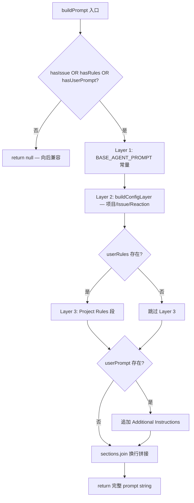
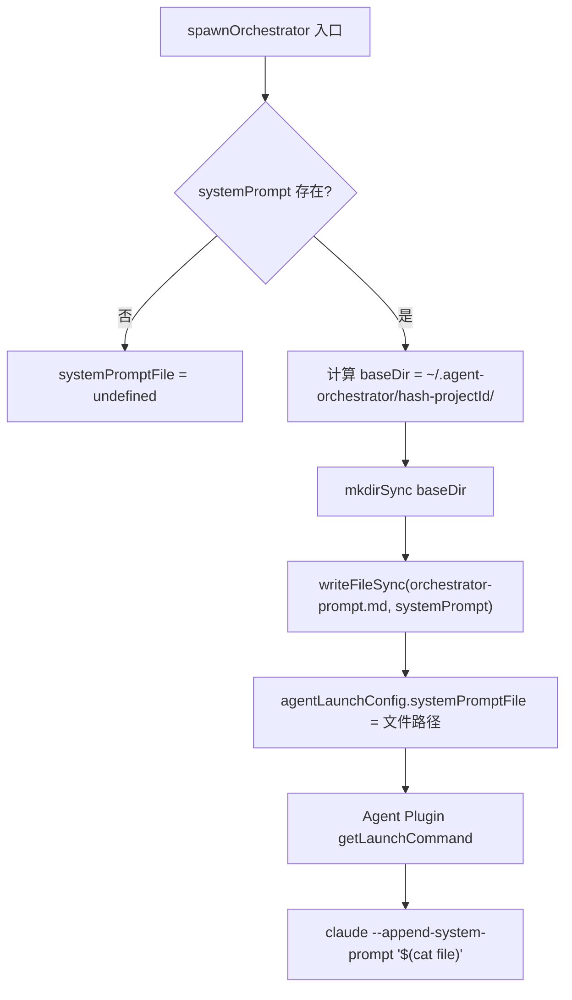

# PD-01.07 AgentOrchestrator — 三层 Prompt 组合与文件化长 Prompt 注入

> 文档编号：PD-01.07
> 来源：AgentOrchestrator `packages/core/src/prompt-builder.ts`, `packages/core/src/orchestrator-prompt.ts`
> GitHub：https://github.com/ComposioHQ/agent-orchestrator.git
> 问题域：PD-01 上下文管理 Context Window Management
> 状态：可复用方案

---

## 第 1 章 问题与动机

### 1.1 核心问题

在多 Agent 编排系统中，每个 Agent 会话需要注入大量上下文：基础行为规范、项目配置信息、Issue 详情、用户自定义规则、编排器命令参考等。这些上下文面临两个核心挑战：

1. **Prompt 膨胀**：编排器 prompt 动态生成后通常超过 2000 字符，通过 shell 命令行内联传递时会被 tmux `send-keys` 或 `paste-buffer` 截断，导致 Agent 收到残缺指令。
2. **层次混乱**：不同来源的上下文（系统指令、项目配置、用户规则）如果不分层管理，会导致优先级不明确、维护困难、不同 Agent 插件难以统一处理。

### 1.2 AgentOrchestrator 的解法概述

AgentOrchestrator 采用**三层 Prompt 组合 + 文件化注入**的方案：

1. **三层分离**（`prompt-builder.ts:22-178`）：Layer 1 常量基础指令 → Layer 2 配置派生上下文 → Layer 3 用户自定义规则，通过 `buildPrompt()` 按序拼接
2. **编排器独立 Prompt 生成器**（`orchestrator-prompt.ts:21-211`）：为编排 Agent 生成包含完整命令参考、会话管理流程、自动化反应规则的专用 prompt
3. **文件化长 Prompt 注入**（`session-manager.ts:597-606`）：将超长 prompt 写入磁盘文件（`orchestrator-prompt.md`），通过 `$(cat file)` shell 替换注入，避免 tmux 截断
4. **多 Agent 插件适配**（`agent-claude-code/src/index.ts:599-606`）：每个 Agent 插件统一处理 `systemPromptFile` 优先于 `systemPrompt` 的降级逻辑
5. **空值安全**（`prompt-builder.ts:148-156`）：无 Issue、无规则、无用户 prompt 时返回 `null`，保持裸启动的向后兼容

### 1.3 设计思想

| 设计原则 | 具体实现 | 理由 | 替代方案 |
|----------|----------|------|----------|
| 关注点分离 | 三层 Prompt 各司其职，Layer 1 不变、Layer 2 动态、Layer 3 用户可控 | 不同生命周期的内容混在一起会导致维护噩梦 | 单一模板字符串拼接（难以维护） |
| 文件化避截断 | 长 prompt 写入 `.md` 文件，用 `$(cat file)` 注入 | tmux send-keys 对 2000+ 字符不可靠 | Base64 编码传递（增加复杂度） |
| 插件无关性 | `AgentLaunchConfig` 统一接口，各插件自行决定如何使用 prompt | 支持 Claude Code / Codex / Aider 等多种 Agent | 硬编码单一 Agent 的 CLI 参数 |
| 优雅降级 | `agentRulesFile` 读取失败静默跳过，不崩溃 spawn 流程 | 用户配置文件可能不存在，不应阻塞核心流程 | 严格校验（启动前报错） |
| 向后兼容 | `buildPrompt()` 无内容时返回 `null` | 裸启动（无 Issue）不应注入空 prompt | 总是返回空字符串（改变行为） |

---

## 第 2 章 源码实现分析

### 2.1 架构概览

AgentOrchestrator 的上下文管理分为两条路径：Worker Agent 走 `buildPrompt()` 三层组合，Orchestrator Agent 走 `generateOrchestratorPrompt()` 专用生成器。两者最终都通过 `AgentLaunchConfig` 传递给 Agent 插件。

```
┌─────────────────────────────────────────────────────────────┐
│                    ao start / ao spawn                       │
├──────────────────────┬──────────────────────────────────────┤
│  Orchestrator Path   │         Worker Path                  │
│                      │                                      │
│  generateOrchestrator│  buildPrompt()                       │
│  Prompt()            │  ┌─────────────────────┐             │
│  ┌────────────────┐  │  │ Layer 1: BASE_AGENT │             │
│  │ Project Info   │  │  │ Layer 2: Config Ctx │             │
│  │ Commands Ref   │  │  │ Layer 3: User Rules │             │
│  │ Session Mgmt   │  │  └─────────┬───────────┘             │
│  │ Reactions      │  │            │                          │
│  │ Workflows      │  │            ▼                          │
│  └───────┬────────┘  │  composedPrompt (string | null)      │
│          │           │            │                          │
│          ▼           │            ▼                          │
│  Write to file       │  AgentLaunchConfig.prompt             │
│  orchestrator-       │            │                          │
│  prompt.md           │            │                          │
│          │           │            │                          │
│          ▼           │            ▼                          │
│  AgentLaunchConfig   │  Agent Plugin                         │
│  .systemPromptFile   │  .getLaunchCommand()                  │
│          │           │  → claude -p "..."                    │
│          ▼           │                                      │
│  Agent Plugin        │                                      │
│  .getLaunchCommand()  │                                      │
│  → claude             │                                      │
│    --append-system-   │                                      │
│    prompt "$(cat f)"  │                                      │
└──────────────────────┴──────────────────────────────────────┘
```

### 2.2 核心实现

#### 2.2.1 三层 Prompt 组合器



对应源码 `packages/core/src/prompt-builder.ts:148-178`：

```typescript
export function buildPrompt(config: PromptBuildConfig): string | null {
  const hasIssue = Boolean(config.issueId);
  const userRules = readUserRules(config.project);
  const hasRules = Boolean(userRules);
  const hasUserPrompt = Boolean(config.userPrompt);

  // Nothing to compose — return null for backward compatibility
  if (!hasIssue && !hasRules && !hasUserPrompt) {
    return null;
  }

  const sections: string[] = [];

  // Layer 1: Base prompt (always included when we have something to compose)
  sections.push(BASE_AGENT_PROMPT);

  // Layer 2: Config-derived context
  sections.push(buildConfigLayer(config));

  // Layer 3: User rules
  if (userRules) {
    sections.push(`## Project Rules\n${userRules}`);
  }

  // Explicit user prompt (appended last, highest priority)
  if (config.userPrompt) {
    sections.push(`## Additional Instructions\n${config.userPrompt}`);
  }

  return sections.join("\n\n");
}
```

#### 2.2.2 文件化长 Prompt 注入



对应源码 `packages/core/src/session-manager.ts:597-617`：

```typescript
// Write system prompt to a file to avoid shell/tmux truncation.
// Long prompts (2000+ chars) get mangled when inlined in shell commands
// via tmux send-keys or paste-buffer. File-based approach is reliable.
let systemPromptFile: string | undefined;
if (orchestratorConfig.systemPrompt) {
  const baseDir = getProjectBaseDir(config.configPath, project.path);
  mkdirSync(baseDir, { recursive: true });
  systemPromptFile = join(baseDir, "orchestrator-prompt.md");
  writeFileSync(systemPromptFile, orchestratorConfig.systemPrompt, "utf-8");
}

// Get agent launch config — uses systemPromptFile, no issue/tracker interaction
const agentLaunchConfig = {
  sessionId,
  projectConfig: project,
  permissions: project.agentConfig?.permissions,
  model: project.agentConfig?.model,
  systemPromptFile,
};
```

### 2.3 实现细节

**用户规则读取的容错设计**（`prompt-builder.ts:115-135`）：

`readUserRules()` 同时支持内联 `agentRules` 和文件 `agentRulesFile` 两种来源，用 `\n\n` 拼接。文件读取失败时 `catch` 块为空——这是有意为之，因为 `agentRulesFile` 是可选配置，文件不存在不应阻塞 Agent 启动。

**多 Agent 插件的 systemPromptFile 处理**：

三个 Agent 插件（Claude Code、Codex、Aider）都实现了相同的降级模式：

| 插件 | systemPromptFile 处理 | systemPrompt 降级 |
|------|----------------------|-------------------|
| Claude Code | `--append-system-prompt "$(cat file)"` | `--append-system-prompt "inline"` |
| Codex | `-c model_instructions_file=file` | `-c developer_instructions="inline"` |
| Aider | `--system-prompt "$(cat file)"` | `--system-prompt "inline"` |

**Worker Agent 的 prompt 注入路径**（`session-manager.ts:451-467`）：

Worker Agent 不使用 `systemPromptFile`，而是将 `buildPrompt()` 的结果作为 `prompt` 字段传递，最终变成 `claude -p "..."` 的 `-p` 参数。这是因为 Worker prompt 通常较短（Issue 上下文 + 基础规则），不会触发 tmux 截断。

---

## 第 3 章 迁移指南

### 3.1 迁移清单

**阶段 1：三层 Prompt 组合器（核心，1 个文件）**

- [ ] 创建 `prompt-builder.ts`，定义 `BASE_AGENT_PROMPT` 常量（Layer 1）
- [ ] 实现 `buildConfigLayer()` 函数，从项目配置生成 Layer 2
- [ ] 实现 `readUserRules()` 函数，支持内联规则 + 文件规则
- [ ] 实现 `buildPrompt()` 入口函数，三层拼接 + null 安全

**阶段 2：文件化长 Prompt 注入（防截断）**

- [ ] 在 spawn 流程中检测 prompt 长度，超过阈值时写入文件
- [ ] Agent 启动命令使用 `$(cat file)` 替换内联 prompt
- [ ] 确保文件目录存在（`mkdirSync recursive`）

**阶段 3：多 Agent 插件适配（可选）**

- [ ] 在 `AgentLaunchConfig` 接口中添加 `systemPromptFile` 字段
- [ ] 各 Agent 插件实现 `systemPromptFile` 优先于 `systemPrompt` 的降级逻辑

### 3.2 适配代码模板

以下是可直接复用的三层 Prompt 组合器实现：

```typescript
// prompt-builder.ts — 三层 Prompt 组合器
import { readFileSync } from "node:fs";
import { resolve } from "node:path";

// Layer 1: 不变的基础指令
const BASE_PROMPT = `You are an AI agent managed by the orchestrator.
## Lifecycle
- Focus on the assigned task.
- Create a PR when done.
- Fix CI failures when notified.
- Address review comments when forwarded.`;

interface ProjectConfig {
  name: string;
  repo: string;
  defaultBranch: string;
  path: string;
  agentRules?: string;
  agentRulesFile?: string;
}

interface PromptBuildConfig {
  project: ProjectConfig;
  projectId: string;
  issueId?: string;
  issueContext?: string;
  userPrompt?: string;
}

// Layer 2: 配置派生上下文
function buildConfigLayer(config: PromptBuildConfig): string {
  const { project, issueId, issueContext } = config;
  const lines = [
    `## Project Context`,
    `- Project: ${project.name}`,
    `- Repository: ${project.repo}`,
    `- Default branch: ${project.defaultBranch}`,
  ];
  if (issueId) {
    lines.push(`\n## Task`, `Work on issue: ${issueId}`);
  }
  if (issueContext) {
    lines.push(`\n## Issue Details`, issueContext);
  }
  return lines.join("\n");
}

// Layer 3: 用户自定义规则
function readUserRules(project: ProjectConfig): string | null {
  const parts: string[] = [];
  if (project.agentRules) parts.push(project.agentRules);
  if (project.agentRulesFile) {
    try {
      const content = readFileSync(
        resolve(project.path, project.agentRulesFile), "utf-8"
      ).trim();
      if (content) parts.push(content);
    } catch { /* 文件不存在时静默跳过 */ }
  }
  return parts.length > 0 ? parts.join("\n\n") : null;
}

// 入口：三层拼接
export function buildPrompt(config: PromptBuildConfig): string | null {
  const hasIssue = Boolean(config.issueId);
  const userRules = readUserRules(config.project);
  const hasUserPrompt = Boolean(config.userPrompt);

  if (!hasIssue && !userRules && !hasUserPrompt) return null;

  const sections = [BASE_PROMPT, buildConfigLayer(config)];
  if (userRules) sections.push(`## Project Rules\n${userRules}`);
  if (config.userPrompt) sections.push(`## Instructions\n${config.userPrompt}`);
  return sections.join("\n\n");
}
```

文件化注入的适配模板：

```typescript
// file-prompt-injector.ts — 长 Prompt 文件化注入
import { mkdirSync, writeFileSync } from "node:fs";
import { join } from "node:path";

const TRUNCATION_THRESHOLD = 2000; // 字符数

interface LaunchConfig {
  systemPrompt?: string;
  systemPromptFile?: string;
}

export function preparePromptForLaunch(
  prompt: string,
  baseDir: string,
  filename = "system-prompt.md"
): LaunchConfig {
  if (prompt.length <= TRUNCATION_THRESHOLD) {
    return { systemPrompt: prompt };
  }
  mkdirSync(baseDir, { recursive: true });
  const filePath = join(baseDir, filename);
  writeFileSync(filePath, prompt, "utf-8");
  return { systemPromptFile: filePath };
}

// Agent 插件中使用
function getLaunchCommand(config: LaunchConfig): string {
  const parts = ["claude"];
  if (config.systemPromptFile) {
    // 文件化注入：避免 shell 截断
    parts.push("--append-system-prompt", `"$(cat '${config.systemPromptFile}')"`);
  } else if (config.systemPrompt) {
    parts.push("--append-system-prompt", `'${config.systemPrompt}'`);
  }
  return parts.join(" ");
}
```

### 3.3 适用场景

| 场景 | 适用度 | 说明 |
|------|--------|------|
| 多 Agent 编排系统 | ⭐⭐⭐ | 核心场景：不同角色的 Agent 需要不同层次的上下文 |
| 单 Agent + 多项目 | ⭐⭐⭐ | Layer 2 的项目配置注入非常适合多项目切换 |
| tmux/screen 管理的 Agent | ⭐⭐⭐ | 文件化注入是解决终端截断的最佳方案 |
| 短 prompt 场景 | ⭐⭐ | 三层分离仍有价值，但文件化注入不必要 |
| 无 shell 的 API 调用场景 | ⭐ | 不存在截断问题，文件化注入无意义 |

---

## 第 4 章 测试用例

```typescript
import { describe, it, expect, vi, beforeEach, afterEach } from "vitest";
import { buildPrompt, BASE_AGENT_PROMPT } from "./prompt-builder";
import * as fs from "node:fs";

describe("buildPrompt — 三层 Prompt 组合", () => {
  const baseProject = {
    name: "TestProject",
    repo: "org/test",
    defaultBranch: "main",
    path: "/tmp/test",
    sessionPrefix: "tp",
  };

  it("无 Issue、无规则、无 userPrompt 时返回 null", () => {
    const result = buildPrompt({
      project: baseProject,
      projectId: "test",
    });
    expect(result).toBeNull();
  });

  it("有 Issue 时包含三层内容", () => {
    const result = buildPrompt({
      project: baseProject,
      projectId: "test",
      issueId: "INT-42",
    });
    expect(result).not.toBeNull();
    // Layer 1
    expect(result).toContain("AI coding agent");
    // Layer 2
    expect(result).toContain("TestProject");
    expect(result).toContain("INT-42");
  });

  it("agentRules 注入到 Layer 3", () => {
    const result = buildPrompt({
      project: { ...baseProject, agentRules: "Always use TypeScript" },
      projectId: "test",
      issueId: "INT-1",
    });
    expect(result).toContain("Project Rules");
    expect(result).toContain("Always use TypeScript");
  });

  it("agentRulesFile 读取失败时静默降级", () => {
    const result = buildPrompt({
      project: { ...baseProject, agentRulesFile: "nonexistent.md" },
      projectId: "test",
      issueId: "INT-1",
    });
    // 不应崩溃，仍返回有效 prompt
    expect(result).not.toBeNull();
    expect(result).not.toContain("Project Rules");
  });

  it("userPrompt 追加在最后（最高优先级）", () => {
    const result = buildPrompt({
      project: baseProject,
      projectId: "test",
      issueId: "INT-1",
      userPrompt: "Focus on performance",
    });
    const lines = result!.split("\n");
    const rulesIdx = lines.findIndex((l) => l.includes("Additional Instructions"));
    const configIdx = lines.findIndex((l) => l.includes("Project Context"));
    expect(rulesIdx).toBeGreaterThan(configIdx);
  });

  it("agentRules + agentRulesFile 合并", () => {
    vi.spyOn(fs, "readFileSync").mockReturnValue("No console.log in production");
    const result = buildPrompt({
      project: {
        ...baseProject,
        agentRules: "Use ESLint",
        agentRulesFile: "rules.md",
      },
      projectId: "test",
      issueId: "INT-1",
    });
    expect(result).toContain("Use ESLint");
    expect(result).toContain("No console.log in production");
    vi.restoreAllMocks();
  });
});

describe("文件化 Prompt 注入", () => {
  it("长 prompt 写入文件而非内联", () => {
    const longPrompt = "x".repeat(3000);
    // 模拟 session-manager 的逻辑
    const THRESHOLD = 2000;
    const shouldUseFile = longPrompt.length > THRESHOLD;
    expect(shouldUseFile).toBe(true);
  });

  it("systemPromptFile 优先于 systemPrompt", () => {
    // 模拟 Claude Code 插件的 getLaunchCommand 逻辑
    const config = {
      systemPromptFile: "/tmp/prompt.md",
      systemPrompt: "inline prompt",
    };
    const parts = ["claude"];
    if (config.systemPromptFile) {
      parts.push("--append-system-prompt", `"$(cat '${config.systemPromptFile}')"`);
    } else if (config.systemPrompt) {
      parts.push("--append-system-prompt", config.systemPrompt);
    }
    expect(parts.join(" ")).toContain("$(cat");
    expect(parts.join(" ")).not.toContain("inline prompt");
  });
});
```

---

## 第 5 章 跨域关联

| 关联域 | 关系类型 | 说明 |
|--------|----------|------|
| PD-02 多 Agent 编排 | 依赖 | 三层 Prompt 的 Layer 2 为编排器注入命令参考（`ao spawn`、`ao status` 等），是编排能力的上下文基础 |
| PD-04 工具系统 | 协同 | `agentRulesFile` 的文件读取机制与工具系统的配置加载模式一致；Agent 插件的 `getLaunchCommand()` 是工具系统的一部分 |
| PD-05 沙箱隔离 | 协同 | 每个 Worker Agent 在独立 worktree 中运行，`buildPrompt()` 为其注入隔离的项目上下文，不会交叉污染 |
| PD-09 Human-in-the-Loop | 协同 | 编排器 prompt 中包含 Reactions 配置（CI 失败自动转发、Review 评论自动转发），是人机交互的上下文载体 |
| PD-11 可观测性 | 协同 | Claude Code 插件通过 JSONL 尾部解析提取 cost/token 信息（`extractCost()`），实现上下文消耗的可观测性 |

---

## 第 6 章 来源文件索引

| 文件 | 行范围 | 关键实现 |
|------|--------|----------|
| `packages/core/src/prompt-builder.ts` | L1-L179 | 三层 Prompt 组合器：BASE_AGENT_PROMPT + buildConfigLayer + readUserRules + buildPrompt |
| `packages/core/src/orchestrator-prompt.ts` | L21-L211 | 编排器专用 Prompt 生成器：generateOrchestratorPrompt，含命令参考、会话管理、Reactions |
| `packages/core/src/session-manager.ts` | L451-L467 | Worker Agent spawn 流程：buildPrompt → composedPrompt → agentLaunchConfig.prompt |
| `packages/core/src/session-manager.ts` | L597-L617 | 文件化长 Prompt 注入：writeFileSync → orchestrator-prompt.md → systemPromptFile |
| `packages/core/src/types.ts` | L318-L346 | AgentLaunchConfig 接口：systemPrompt / systemPromptFile 双通道定义 |
| `packages/core/src/types.ts` | L837-L888 | ProjectConfig 接口：agentRules / agentRulesFile / orchestratorRules 字段 |
| `packages/plugins/agent-claude-code/src/index.ts` | L586-L613 | Claude Code 插件 getLaunchCommand：systemPromptFile → `$(cat file)` 注入 |
| `packages/core/src/paths.ts` | L84-L87 | getProjectBaseDir：hash-based 目录结构，prompt 文件存放位置 |
| `packages/cli/src/commands/start.ts` | L191-L193 | 编排器启动入口：generateOrchestratorPrompt → spawnOrchestrator |

---

## 第 7 章 横向对比维度

```json comparison_data
{
  "project": "AgentOrchestrator",
  "dimensions": {
    "估算方式": "无显式 token 估算，依赖 Agent 插件自身的上下文管理",
    "压缩策略": "无压缩，通过三层分离控制各层内容量",
    "触发机制": "spawn/start 时一次性组合，运行时不动态调整",
    "实现位置": "独立 prompt-builder.ts + orchestrator-prompt.ts 双模块",
    "容错设计": "agentRulesFile 读取失败静默跳过，buildPrompt 无内容返回 null",
    "Prompt模板化": "三层分离：常量基础指令 + 配置派生 + 用户规则，Markdown 段落拼接",
    "子Agent隔离": "Worker 走 buildPrompt 三层组合，Orchestrator 走独立生成器，互不干扰",
    "保留策略": "全量保留，不裁剪——通过文件化注入绕过 shell 截断而非压缩内容",
    "运行时热更新": "不支持——prompt 在 spawn 时一次性生成，运行中不可变",
    "文件化注入": "长 prompt 写入 .md 文件，通过 $(cat file) shell 替换注入避免 tmux 截断"
  }
}
```

### 域元数据补充

```json domain_metadata
{
  "solution_summary": "AgentOrchestrator 用三层 Prompt 分离（常量基础指令 + 配置派生上下文 + 用户规则）+ 文件化 $(cat) 注入解决 tmux 长 prompt 截断问题",
  "description": "通过 shell 文件替换绕过终端中间层的上下文传递限制",
  "sub_problems": [
    "终端中间层截断：tmux/screen 等终端复用器对 send-keys 的字符数限制导致 prompt 被截断",
    "多角色 Prompt 分层：编排器与 Worker Agent 需要不同结构的上下文，需要独立的生成路径",
    "用户规则双源合并：内联配置与外部文件两种规则来源的合并与容错处理"
  ],
  "best_practices": [
    "长 prompt 写文件再用 $(cat) 注入，比内联传递更可靠",
    "buildPrompt 无内容时返回 null 而非空字符串，保持向后兼容",
    "用户规则文件读取失败应静默跳过，不阻塞 Agent 启动流程"
  ]
}
```
