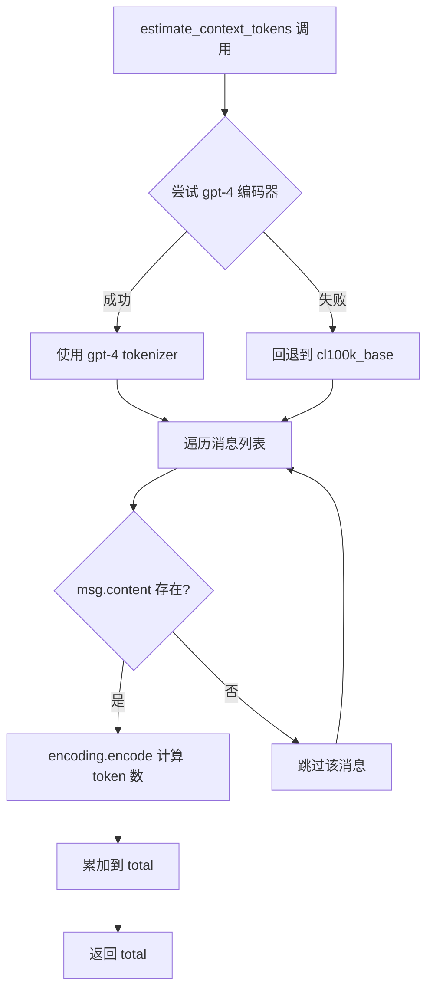
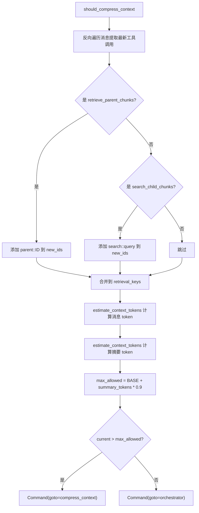

# PD-01.09 AgenticRAGForDummies — tiktoken 阈值压缩与 retrieval_keys 去重

> 文档编号：PD-01.09
> 来源：agentic-rag-for-dummies `project/rag_agent/nodes.py`, `project/utils.py`, `project/config.py`
> GitHub：https://github.com/GiovanniPasq/agentic-rag-for-dummies.git
> 问题域：PD-01 上下文管理 Context Window Management
> 状态：可复用方案

---

## 第 1 章 问题与动机

### 1.1 核心问题

Agentic RAG 系统在多轮检索-推理循环中，每次工具调用（search_child_chunks / retrieve_parent_chunks）都会向消息列表追加大量 ToolMessage。当 Agent 执行 5-8 轮检索后，上下文窗口迅速膨胀，导致：

1. **token 超限**：小模型（如 qwen3:4b）的上下文窗口有限，未压缩的消息列表很快超出模型容量
2. **重复检索浪费**：压缩后 Agent 丢失了"已经搜过什么"的记忆，导致重复执行相同的 search query 或 retrieve 相同的 parent ID
3. **信噪比下降**：大量原始检索结果中混杂无关内容，LLM 难以从噪声中提取关键信息

该项目的核心洞察是：**压缩不仅要缩减 token，还要保留"已做过什么"的元数据**，通过 `retrieval_keys` 集合追踪已执行操作，在压缩摘要末尾注入去重清单，从根本上防止重复检索。

### 1.2 agentic-rag-for-dummies 的解法概述

1. **tiktoken 精确估算**：用 `cl100k_base` 编码器逐消息计算 token 数（`project/utils.py:27-37`）
2. **动态阈值公式**：`max_allowed = BASE_TOKEN_THRESHOLD + int(summary_tokens * TOKEN_GROWTH_FACTOR)`，摘要越长允许的总 token 越多（`project/rag_agent/nodes.py:122`）
3. **LLM 驱动结构化压缩**：调用 LLM 将全部消息压缩为 Markdown 结构化摘要（Focus / Structured Findings / Gaps），限制 400-600 词（`project/rag_agent/nodes.py:127-164`）
4. **retrieval_keys 去重注入**：压缩后在摘要末尾追加"Already executed"清单，列出已检索的 parent ID 和已执行的 search query（`project/rag_agent/nodes.py:152-162`）
5. **RemoveMessage 批量清除**：压缩完成后用 LangGraph 的 `RemoveMessage` 机制删除除首条外的所有原始消息（`project/rag_agent/nodes.py:164`）

### 1.3 设计思想

| 设计原则 | 具体实现 | 理由 | 替代方案 |
|----------|----------|------|----------|
| 精确优于粗估 | tiktoken cl100k_base 编码 | 字符数/4 的粗估在含代码/JSON 时误差大 | 字符长度除以 4 |
| 动态阈值优于固定阈值 | BASE + summary * GROWTH_FACTOR | 摘要本身占 token，固定阈值会导致摘要越长越容易触发二次压缩 | 固定 token 上限 |
| 结构化摘要优于自由文本 | Markdown 模板：Focus/Findings/Gaps | 结构化输出便于 Agent 快速定位信息，减少理解成本 | 自由格式摘要 |
| 去重元数据与摘要共存 | retrieval_keys 注入摘要尾部 | Agent 压缩后仍能知道"做过什么"，避免重复检索 | 仅依赖 LLM 记忆 |
| 全量清除 + 摘要替代 | RemoveMessage 删除所有旧消息 | 彻底释放 token 空间，摘要已保留核心信息 | 滑动窗口保留最近 N 条 |

---

## 第 2 章 源码实现分析

### 2.1 架构概览

agentic-rag-for-dummies 采用双层 LangGraph 图架构：外层 `State` 图处理会话级摘要和查询改写，内层 `AgentState` 子图执行检索-压缩循环。上下文管理分布在两个层级：

```
┌─────────────────────────────────────────────────────────────┐
│  外层图 (State)                                              │
│  ┌──────────────┐   ┌──────────────┐   ┌────────────────┐   │
│  │summarize_    │──→│rewrite_query │──→│  agent (子图)   │   │
│  │history       │   │              │   │                │   │
│  │(会话级摘要)   │   │(查询改写)     │   │(检索-压缩循环) │   │
│  └──────────────┘   └──────────────┘   └────────┬───────┘   │
│                                                  ↓           │
│                                        ┌────────────────┐   │
│                                        │aggregate_      │   │
│                                        │answers         │   │
│                                        └────────────────┘   │
└─────────────────────────────────────────────────────────────┘

┌─────────────────────────────────────────────────────────────┐
│  内层子图 (AgentState) — 上下文管理核心                       │
│                                                              │
│  orchestrator ──→ tools ──→ should_compress_context          │
│       ↑                          │                           │
│       │                    ┌─────┴─────┐                     │
│       │                    ↓           ↓                     │
│       ├──── compress_context    orchestrator (继续)           │
│       │     (LLM 压缩 +                                     │
│       │      retrieval_keys                                  │
│       │      注入 + RemoveMessage)                           │
│       │                                                      │
│  fallback_response ──→ collect_answer ──→ END                │
└─────────────────────────────────────────────────────────────┘
```

### 2.2 核心实现

#### 2.2.1 Token 估算函数



对应源码 `project/utils.py:27-37`：

```python
def estimate_context_tokens(messages: list) -> int:
    try:
        encoding = tiktoken.encoding_for_model("gpt-4")
    except:
        encoding = tiktoken.get_encoding("cl100k_base")
    
    total = 0
    for msg in messages:
        if hasattr(msg, 'content') and msg.content:
            total += len(encoding.encode(str(msg.content)))
    return total
```

注意：该函数只计算 `content` 字段的 token，不计算 `tool_calls` 的 JSON 序列化开销。对于工具调用密集的场景，实际 token 消耗会高于估算值。

#### 2.2.2 动态阈值判定与 retrieval_keys 追踪



对应源码 `project/rag_agent/nodes.py:96-125`：

```python
def should_compress_context(state: AgentState) -> Command[Literal["compress_context", "orchestrator"]]:
    messages = state["messages"]

    new_ids: Set[str] = set()
    for msg in reversed(messages):
        if isinstance(msg, AIMessage) and getattr(msg, "tool_calls", None):
            for tc in msg.tool_calls:
                if tc["name"] == "retrieve_parent_chunks":
                    raw = tc["args"].get("parent_id") or tc["args"].get("id") or tc["args"].get("ids") or []
                    if isinstance(raw, str):
                        new_ids.add(f"parent::{raw}")
                    else:
                        new_ids.update(f"parent::{r}" for r in raw)
                elif tc["name"] == "search_child_chunks":
                    query = tc["args"].get("query", "")
                    if query:
                        new_ids.add(f"search::{query}")
            break  # 只处理最近一轮的工具调用

    updated_ids = state.get("retrieval_keys", set()) | new_ids

    current_token_messages = estimate_context_tokens(messages)
    current_token_summary = estimate_context_tokens([HumanMessage(content=state.get("context_summary", ""))])
    current_tokens = current_token_messages + current_token_summary

    max_allowed = BASE_TOKEN_THRESHOLD + int(current_token_summary * TOKEN_GROWTH_FACTOR)

    goto = "compress_context" if current_tokens > max_allowed else "orchestrator"
    return Command(update={"retrieval_keys": updated_ids}, goto=goto)
```

关键设计点：
- `retrieval_keys` 使用 `Set[str]` + `set_union` reducer（`graph_state.py:10-11`），确保跨压缩周期累积
- 动态阈值公式让摘要增长时自动放宽上限，避免"摘要越长越频繁压缩"的恶性循环
- `break` 语句确保只提取最近一轮的工具调用 ID，避免重复计算

### 2.3 实现细节

#### 压缩节点的增量摘要与去重注入

`compress_context` 节点（`nodes.py:127-164`）执行三个关键操作：

1. **构建压缩输入**：将 existing_summary（如有）作为 `[PRIOR COMPRESSED CONTEXT]` 前缀，后接所有 AI/Tool 消息的文本化表示
2. **LLM 结构化压缩**：使用专用 prompt（`prompts.py:118-150`）要求 LLM 输出 Focus/Structured Findings/Gaps 三段式摘要
3. **去重清单注入**：从 `retrieval_keys` 中分离 `parent::` 和 `search::` 前缀，格式化为 "Already executed" 块追加到摘要末尾

数据流：

```
原始消息列表 (N 条)
    ↓ 文本化
conversation_text (含 prior summary + AI/Tool 消息)
    ↓ LLM 压缩
new_summary (400-600 词结构化摘要)
    ↓ 注入 retrieval_keys
new_summary + "Already executed" 清单
    ↓ RemoveMessage
清除 messages[1:], 保留 context_summary
```

#### 会话级摘要（外层图）

`summarize_history`（`nodes.py:10-28`）在外层图中运行，负责跨轮次的会话摘要：
- 仅在消息数 ≥ 4 时触发
- 只取最近 6 条 Human/AI 消息（排除含 tool_calls 的 AI 消息）
- 摘要后通过 `agent_answers: [{"__reset__": True}]` 重置答案累积器
- 摘要结果存入 `conversation_summary`，供 `rewrite_query` 节点使用

#### orchestrator 的压缩上下文注入

`orchestrator` 节点（`nodes.py:50-65`）在每次调用时检查 `context_summary`，若非空则作为 `[COMPRESSED CONTEXT FROM PRIOR RESEARCH]` 注入到消息序列中，配合 prompt 中的 "Compressed Memory" 规则指导 Agent 利用已有信息并避免重复检索。

---

## 第 3 章 迁移指南

### 3.1 迁移清单

**阶段 1：Token 估算基础设施**
- [ ] 安装 `tiktoken`（`pip install tiktoken`）
- [ ] 实现 `estimate_context_tokens` 函数，适配你的消息格式
- [ ] 在 config 中定义 `BASE_TOKEN_THRESHOLD` 和 `TOKEN_GROWTH_FACTOR`

**阶段 2：压缩节点**
- [ ] 实现 `compress_context` 节点，包含 LLM 调用和结构化 prompt
- [ ] 实现 `should_compress_context` 判定节点，含动态阈值公式
- [ ] 在 graph state 中添加 `context_summary: str` 和 `retrieval_keys: Set[str]` 字段

**阶段 3：去重机制**
- [ ] 定义 retrieval_keys 的前缀协议（`parent::`, `search::` 等）
- [ ] 在压缩节点中注入 "Already executed" 清单
- [ ] 在 orchestrator prompt 中添加 "Compressed Memory" 规则

**阶段 4：图集成**
- [ ] 在 tools 节点后插入 `should_compress_context` 判定节点
- [ ] 添加 `compress_context → orchestrator` 回边
- [ ] 测试多轮检索场景下的压缩触发和去重效果

### 3.2 适配代码模板

以下是可直接复用的压缩判定 + 执行模板，适配任意 LangGraph Agent：

```python
from typing import Literal, Set
from langchain_core.messages import SystemMessage, HumanMessage, RemoveMessage, AIMessage, ToolMessage
from langgraph.types import Command
import tiktoken

# --- 配置 ---
BASE_TOKEN_THRESHOLD = 2000  # 基础 token 上限
TOKEN_GROWTH_FACTOR = 0.9    # 摘要 token 的增长因子

# --- Token 估算 ---
def estimate_context_tokens(messages: list) -> int:
    try:
        encoding = tiktoken.encoding_for_model("gpt-4")
    except Exception:
        encoding = tiktoken.get_encoding("cl100k_base")
    total = 0
    for msg in messages:
        if hasattr(msg, 'content') and msg.content:
            total += len(encoding.encode(str(msg.content)))
    return total

# --- 压缩判定节点 ---
def should_compress(state: dict, tool_name_to_key_fn=None) -> Command:
    """
    tool_name_to_key_fn: 自定义函数，从 tool_call 提取去重 key
    默认提取 search::query 和 retrieve::id 格式
    """
    messages = state["messages"]
    
    # 提取最近一轮工具调用的去重 key
    new_keys: Set[str] = set()
    if tool_name_to_key_fn:
        for msg in reversed(messages):
            if isinstance(msg, AIMessage) and getattr(msg, "tool_calls", None):
                for tc in msg.tool_calls:
                    keys = tool_name_to_key_fn(tc)
                    new_keys.update(keys)
                break
    
    updated_keys = state.get("retrieval_keys", set()) | new_keys
    
    # 动态阈值计算
    msg_tokens = estimate_context_tokens(messages)
    summary_tokens = estimate_context_tokens(
        [HumanMessage(content=state.get("context_summary", ""))]
    )
    total = msg_tokens + summary_tokens
    max_allowed = BASE_TOKEN_THRESHOLD + int(summary_tokens * TOKEN_GROWTH_FACTOR)
    
    goto = "compress_context" if total > max_allowed else "orchestrator"
    return Command(update={"retrieval_keys": updated_keys}, goto=goto)

# --- 压缩执行节点 ---
COMPRESSION_PROMPT = """You are a research context compressor.
Compress the conversation into a structured summary (400-600 words).
Required structure: # Research Context Summary / ## Focus / ## Structured Findings / ## Gaps
Keep exact figures, names, technical terms. Remove duplicates and noise."""

def compress_context(state: dict, llm) -> dict:
    messages = state["messages"]
    existing = state.get("context_summary", "").strip()
    
    text = f"USER QUESTION:\n{state.get('question')}\n\n"
    if existing:
        text += f"[PRIOR COMPRESSED CONTEXT]\n{existing}\n\n"
    
    for msg in messages[1:]:
        if isinstance(msg, AIMessage):
            calls = ""
            if getattr(msg, "tool_calls", None):
                calls = " | Tools: " + ", ".join(tc["name"] for tc in msg.tool_calls)
            text += f"[ASSISTANT{calls}]\n{msg.content or '(tool call)'}\n\n"
        elif isinstance(msg, ToolMessage):
            text += f"[TOOL — {getattr(msg, 'name', 'tool')}]\n{msg.content}\n\n"
    
    summary = llm.invoke([
        SystemMessage(content=COMPRESSION_PROMPT),
        HumanMessage(content=text)
    ]).content
    
    # 注入去重清单
    keys = state.get("retrieval_keys", set())
    if keys:
        block = "\n\n---\n**Already executed (do NOT repeat):**\n"
        parents = sorted(k for k in keys if k.startswith("parent::"))
        searches = sorted(k.replace("search::", "") for k in keys if k.startswith("search::"))
        if parents:
            block += "Retrieved IDs:\n" + "\n".join(f"- {p.replace('parent::', '')}" for p in parents) + "\n"
        if searches:
            block += "Queries run:\n" + "\n".join(f"- {q}" for q in searches) + "\n"
        summary += block
    
    return {
        "context_summary": summary,
        "messages": [RemoveMessage(id=m.id) for m in messages[1:]]
    }
```

### 3.3 适用场景

| 场景 | 适用度 | 说明 |
|------|--------|------|
| 多轮 RAG 检索 Agent | ⭐⭐⭐ | 核心场景，每轮检索产生大量 ToolMessage |
| 小模型（≤8B）Agent | ⭐⭐⭐ | 上下文窗口有限，压缩收益最大 |
| 单轮问答 | ⭐ | 无需压缩，增加不必要的 LLM 调用开销 |
| 多 Agent 编排 | ⭐⭐ | 可在子 Agent 内部独立使用，但需注意跨 Agent 的 key 隔离 |
| 流式对话（长会话） | ⭐⭐ | 外层 summarize_history 可借鉴，但需适配流式场景 |

---

## 第 4 章 测试用例

```python
import pytest
from unittest.mock import MagicMock, patch
from typing import Set
from langchain_core.messages import HumanMessage, AIMessage, ToolMessage, SystemMessage, RemoveMessage

# --- 测试 estimate_context_tokens ---

class TestEstimateContextTokens:
    def test_empty_messages(self):
        from utils import estimate_context_tokens
        assert estimate_context_tokens([]) == 0

    def test_single_message(self):
        from utils import estimate_context_tokens
        msg = HumanMessage(content="Hello world")
        result = estimate_context_tokens([msg])
        assert result > 0
        assert result < 10  # "Hello world" ≈ 2-3 tokens

    def test_skips_empty_content(self):
        from utils import estimate_context_tokens
        msg = AIMessage(content="")
        assert estimate_context_tokens([msg]) == 0

    def test_multiple_messages_accumulate(self):
        from utils import estimate_context_tokens
        msgs = [HumanMessage(content="Hello"), AIMessage(content="World")]
        single_h = estimate_context_tokens([msgs[0]])
        single_a = estimate_context_tokens([msgs[1]])
        total = estimate_context_tokens(msgs)
        assert total == single_h + single_a

# --- 测试 should_compress_context ---

class TestShouldCompressContext:
    def _make_state(self, messages, context_summary="", retrieval_keys=None):
        return {
            "messages": messages,
            "context_summary": context_summary,
            "retrieval_keys": retrieval_keys or set(),
            "question": "test question",
            "question_index": 0,
            "final_answer": "",
            "agent_answers": [],
            "tool_call_count": 0,
            "iteration_count": 0,
        }

    def test_below_threshold_goes_to_orchestrator(self):
        from rag_agent.nodes import should_compress_context
        state = self._make_state([HumanMessage(content="short")])
        result = should_compress_context(state)
        assert result.goto == "orchestrator"

    def test_above_threshold_goes_to_compress(self):
        from rag_agent.nodes import should_compress_context
        long_content = "x " * 2000  # 远超 BASE_TOKEN_THRESHOLD
        msgs = [HumanMessage(content="q"), AIMessage(content=long_content)]
        state = self._make_state(msgs)
        result = should_compress_context(state)
        assert result.goto == "compress_context"

    def test_extracts_search_keys(self):
        from rag_agent.nodes import should_compress_context
        ai_msg = AIMessage(content="", tool_calls=[
            {"name": "search_child_chunks", "args": {"query": "test query"}, "id": "1"}
        ])
        state = self._make_state([HumanMessage(content="q"), ai_msg])
        result = should_compress_context(state)
        assert "search::test query" in result.update["retrieval_keys"]

    def test_extracts_parent_keys(self):
        from rag_agent.nodes import should_compress_context
        ai_msg = AIMessage(content="", tool_calls=[
            {"name": "retrieve_parent_chunks", "args": {"parent_id": "abc123"}, "id": "1"}
        ])
        state = self._make_state([HumanMessage(content="q"), ai_msg])
        result = should_compress_context(state)
        assert "parent::abc123" in result.update["retrieval_keys"]

    def test_keys_accumulate_across_calls(self):
        from rag_agent.nodes import should_compress_context
        existing = {"search::old query"}
        ai_msg = AIMessage(content="", tool_calls=[
            {"name": "search_child_chunks", "args": {"query": "new query"}, "id": "1"}
        ])
        state = self._make_state([HumanMessage(content="q"), ai_msg], retrieval_keys=existing)
        result = should_compress_context(state)
        keys = result.update["retrieval_keys"]
        assert "search::old query" in keys
        assert "search::new query" in keys

# --- 测试 compress_context ---

class TestCompressContext:
    def test_injects_retrieval_keys_block(self):
        from rag_agent.nodes import compress_context
        mock_llm = MagicMock()
        mock_llm.invoke.return_value = MagicMock(content="Summary text")
        
        state = {
            "messages": [HumanMessage(content="q"), AIMessage(content="response")],
            "context_summary": "",
            "retrieval_keys": {"parent::id1", "search::query1"},
            "question": "test",
        }
        result = compress_context(state, mock_llm)
        assert "Already executed" in result["context_summary"]
        assert "id1" in result["context_summary"]
        assert "query1" in result["context_summary"]

    def test_returns_remove_messages(self):
        from rag_agent.nodes import compress_context
        mock_llm = MagicMock()
        mock_llm.invoke.return_value = MagicMock(content="Summary")
        
        msgs = [HumanMessage(content="q", id="1"), AIMessage(content="a", id="2")]
        state = {"messages": msgs, "context_summary": "", "retrieval_keys": set(), "question": "test"}
        result = compress_context(state, mock_llm)
        remove_ids = {m.id for m in result["messages"]}
        assert "2" in remove_ids  # 删除 messages[1:]
        assert "1" not in remove_ids  # 保留 messages[0]

    def test_includes_prior_summary(self):
        from rag_agent.nodes import compress_context
        mock_llm = MagicMock()
        mock_llm.invoke.return_value = MagicMock(content="New summary")
        
        state = {
            "messages": [HumanMessage(content="q"), AIMessage(content="a")],
            "context_summary": "Prior findings about X",
            "retrieval_keys": set(),
            "question": "test",
        }
        compress_context(state, mock_llm)
        call_args = mock_llm.invoke.call_args[0][0]
        input_text = call_args[1].content
        assert "PRIOR COMPRESSED CONTEXT" in input_text
        assert "Prior findings about X" in input_text
```

---

## 第 5 章 跨域关联

| 关联域 | 关系类型 | 说明 |
|--------|----------|------|
| PD-02 多 Agent 编排 | 协同 | 外层图通过 `Send` 并行派发多个子 Agent（`edges.py:10-12`），每个子 Agent 独立维护 `context_summary` 和 `retrieval_keys`，天然实现子 Agent 上下文隔离 |
| PD-03 容错与重试 | 协同 | `fallback_response` 节点（`nodes.py:67-94`）在迭代/工具调用超限时触发，利用 `context_summary` 中的压缩上下文生成兜底答案，是压缩机制的直接消费者 |
| PD-04 工具系统 | 依赖 | `retrieval_keys` 的提取逻辑硬编码了 `search_child_chunks` 和 `retrieve_parent_chunks` 两个工具名（`nodes.py:103-113`），工具系统变更需同步更新 |
| PD-08 搜索与检索 | 协同 | 压缩摘要中的 "Already executed" 清单直接指导 orchestrator 的检索策略，避免重复搜索；`ToolFactory`（`tools.py:5-80`）定义的工具输出格式决定了压缩输入的结构 |
| PD-09 Human-in-the-Loop | 协同 | 外层图在 `request_clarification` 前设置 `interrupt_before`（`graph.py:48`），中断时会话摘要已通过 `summarize_history` 保存，恢复后不丢失上下文 |
| PD-12 推理增强 | 互补 | `rewrite_query` 节点（`nodes.py:30-44`）利用 `conversation_summary` 改写查询，是上下文压缩在推理增强方向的应用 |

---

## 第 6 章 来源文件索引

| 文件 | 行范围 | 关键实现 |
|------|--------|----------|
| `project/utils.py` | L27-L37 | `estimate_context_tokens` — tiktoken 精确估算 |
| `project/config.py` | L21-L24 | `BASE_TOKEN_THRESHOLD`, `TOKEN_GROWTH_FACTOR`, `MAX_TOOL_CALLS`, `MAX_ITERATIONS` |
| `project/rag_agent/nodes.py` | L10-L28 | `summarize_history` — 外层会话级摘要 |
| `project/rag_agent/nodes.py` | L50-L65 | `orchestrator` — 压缩上下文注入 |
| `project/rag_agent/nodes.py` | L96-L125 | `should_compress_context` — 动态阈值判定 + retrieval_keys 提取 |
| `project/rag_agent/nodes.py` | L127-L164 | `compress_context` — LLM 压缩 + 去重清单注入 + RemoveMessage |
| `project/rag_agent/nodes.py` | L67-L94 | `fallback_response` — 超限兜底，消费压缩上下文 |
| `project/rag_agent/graph_state.py` | L10-L11 | `set_union` reducer — retrieval_keys 跨压缩累积 |
| `project/rag_agent/graph_state.py` | L21-L30 | `AgentState` — context_summary, retrieval_keys 字段定义 |
| `project/rag_agent/prompts.py` | L58-L81 | `get_orchestrator_prompt` — Compressed Memory 规则 |
| `project/rag_agent/prompts.py` | L118-L150 | `get_context_compression_prompt` — 结构化压缩模板 |
| `project/rag_agent/graph.py` | L10-L51 | `create_agent_graph` — 双层图构建，压缩节点接入 |
| `project/rag_agent/edges.py` | L15-L27 | `route_after_orchestrator_call` — 迭代/工具超限判定 |

---

## 第 7 章 横向对比维度

> **重要：** 本章用于自动填充 Butcher Wiki 的横向对比表。
> 必须严格按以下 JSON 格式输出，放在 `comparison_data` 代码块中。

```json comparison_data
{
  "project": "AgenticRAGForDummies",
  "dimensions": {
    "估算方式": "tiktoken cl100k_base 逐消息 encode，仅计算 content 字段",
    "压缩策略": "LLM 驱动结构化摘要（Focus/Findings/Gaps），400-600 词上限",
    "触发机制": "动态阈值：BASE + summary_tokens * 0.9，每轮工具调用后判定",
    "实现位置": "LangGraph 独立节点 should_compress_context + compress_context",
    "容错设计": "fallback_response 节点在超限时消费压缩上下文生成兜底答案",
    "保留策略": "全量清除 messages[1:] + 摘要替代，retrieval_keys 跨周期累积",
    "增量摘要与全量摘要切换": "支持增量：existing_summary 作为 PRIOR COMPRESSED CONTEXT 前缀传入",
    "AI/Tool消息对保护": "未显式保护，RemoveMessage 删除 messages[1:] 含所有 AI/Tool 对",
    "子Agent隔离": "每个子 Agent 独立 AgentState，context_summary 和 retrieval_keys 天然隔离",
    "摘要模型选择": "复用主模型（ChatOllama qwen3:4b），未使用独立压缩模型",
    "检索去重追踪": "retrieval_keys Set 用 parent::/search:: 前缀区分，注入摘要尾部指导 Agent"
  }
}
```

### 域元数据补充

```json domain_metadata
{
  "solution_summary": "AgenticRAGForDummies 用 tiktoken 精确估算 + 动态阈值公式（BASE + summary*0.9）触发 LLM 结构化压缩，retrieval_keys 集合追踪已检索 ID 和已执行查询注入摘要尾部防止重复检索",
  "description": "检索型 Agent 的上下文管理需同时解决 token 膨胀和重复检索两个耦合问题",
  "sub_problems": [
    "检索去重元数据持久化：压缩后保留已执行的搜索查询和已获取的文档 ID，防止 Agent 重复检索相同内容",
    "动态压缩阈值自适应：摘要本身占用 token，固定阈值会导致摘要越长越频繁触发压缩的恶性循环",
    "双层图上下文分治：外层会话摘要与内层检索压缩各自独立，避免不同粒度的上下文管理互相干扰"
  ],
  "best_practices": [
    "压缩摘要应附带操作元数据（已检索 ID、已执行查询），而非仅保留语义内容",
    "动态阈值公式应考虑摘要自身的 token 占用，避免压缩-膨胀循环"
  ]
}
```
