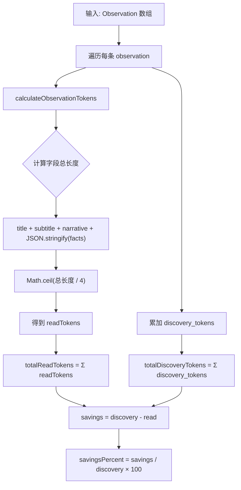
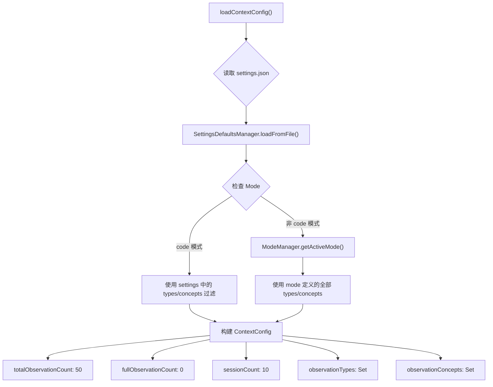

# PD-01.12 ClaudeMem — Observation 经济学与渐进式上下文注入

> 文档编号：PD-01.12
> 来源：ClaudeMem `src/services/context/`
> GitHub：https://github.com/thedotmack/claude-mem.git
> 问题域：PD-01 上下文管理 Context Window Management
> 状态：可复用方案

---

## 第 1 章 问题与动机

### 1.1 核心问题

LLM Agent 在长会话中积累大量 observation（代码变更、决策、调研结论等），直接注入全部原始内容会迅速耗尽上下文窗口。核心矛盾是：Agent 需要"记住"过去做了什么，但上下文窗口有限，必须在信息完整性和 token 成本之间取得平衡。

claude-mem 的独特视角是将这个问题建模为**经济学问题**：每条 observation 有"发现成本"（discovery_tokens，产生该知识时消耗的 token）和"读取成本"（read_tokens，将压缩后的 observation 注入上下文的 token），两者之差就是"节省量"。这种经济学视角让用户和 Agent 都能量化上下文管理的 ROI。

### 1.2 ClaudeMem 的解法概述

1. **Observation 结构化存储**：将 Agent 的每次观察拆解为 type/title/subtitle/narrative/facts/concepts 多字段，存入 SQLite，而非保留原始对话（`src/services/sqlite/observations/store.ts:51-98`）
2. **Token 经济学计算**：用 `CHARS_PER_TOKEN_ESTIMATE = 4` 的字符/token 比率估算每条 observation 的读取成本，与原始发现成本对比计算压缩收益（`src/services/context/TokenCalculator.ts:14-48`）
3. **配置驱动的渐进式披露**：通过 `totalObservationCount`、`fullObservationCount`、`observationTypes`、`observationConcepts` 等 12+ 个配置项控制注入哪些、注入多少、以什么粒度注入（`src/services/context/ContextConfigLoader.ts:17-57`）
4. **Mode-based 类型过滤**：不同工作模式（code/email-investigation 等）自动切换 observation 类型和概念过滤器，避免无关信息污染上下文（`src/services/domain/ModeManager.ts:133-198`）
5. **Timeline 渲染管线**：将 observations 和 session summaries 合并为时间线，按日分组、按文件聚合，最近的展开显示、较旧的压缩为表格行（`src/services/context/sections/TimelineRenderer.ts:55-150`）

### 1.3 设计思想

| 设计原则 | 具体实现 | 理由 | 替代方案 |
|----------|----------|------|----------|
| 经济学建模 | discovery_tokens vs read_tokens 对比 | 让压缩收益可量化，用户能看到"省了多少" | 仅显示当前 token 数，无对比基线 |
| 结构化优于原文 | observation 拆为 6 字段存储 | 结构化数据可按字段过滤、按类型聚合 | 保留原始对话文本做摘要 |
| 配置驱动 | 12+ 个 settings 控制注入行为 | 不同项目/场景需要不同的上下文策略 | 硬编码固定策略 |
| 渐进式披露 | 最近 N 条展开，其余压缩为表格 | 最近的信息最重要，旧信息只需索引 | 全部展开或全部压缩 |
| Mode 继承 | `code--ko` 继承 code 并覆盖 | 支持语言/场景变体而不重复定义 | 每个变体独立完整定义 |

---

## 第 2 章 源码实现分析

### 2.1 架构概览

claude-mem 的上下文管理系统采用管线架构，从数据库查询到最终渲染分为 5 个阶段：

```
┌──────────────┐     ┌──────────────────┐     ┌─────────────────┐
│ ConfigLoader │────→│ ObservationQuery │────→│ TokenEconomics  │
│ (配置加载)    │     │ (数据库查询+过滤) │     │ (成本计算)       │
└──────────────┘     └──────────────────┘     └─────────────────┘
                                                       │
                     ┌──────────────────┐              │
                     │ TimelineBuilder  │←─────────────┘
                     │ (时间线构建)      │
                     └──────────────────┘
                              │
              ┌───────────────┼───────────────┐
              ▼               ▼               ▼
     ┌──────────────┐ ┌──────────────┐ ┌──────────────┐
     │ HeaderRender │ │TimelineRender│ │ FooterRender │
     │ (头部+图例)   │ │(日/文件分组)  │ │(节省量统计)   │
     └──────────────┘ └──────────────┘ └──────────────┘
              │               │               │
              └───────────────┼───────────────┘
                              ▼
                    ┌──────────────────┐
                    │  Markdown/Color  │
                    │  Formatter       │
                    └──────────────────┘
```

核心入口是 `generateContext()` 函数（`ContextBuilder.ts:126-170`），它编排整个管线。

### 2.2 核心实现

#### 2.2.1 Token 经济学计算



对应源码 `src/services/context/TokenCalculator.ts:14-48`：

```typescript
export function calculateObservationTokens(obs: Observation): number {
  const obsSize = (obs.title?.length || 0) +
                  (obs.subtitle?.length || 0) +
                  (obs.narrative?.length || 0) +
                  JSON.stringify(obs.facts || []).length;
  return Math.ceil(obsSize / CHARS_PER_TOKEN_ESTIMATE);
}

export function calculateTokenEconomics(observations: Observation[]): TokenEconomics {
  const totalObservations = observations.length;
  const totalReadTokens = observations.reduce((sum, obs) => {
    return sum + calculateObservationTokens(obs);
  }, 0);
  const totalDiscoveryTokens = observations.reduce((sum, obs) => {
    return sum + (obs.discovery_tokens || 0);
  }, 0);
  const savings = totalDiscoveryTokens - totalReadTokens;
  const savingsPercent = totalDiscoveryTokens > 0
    ? Math.round((savings / totalDiscoveryTokens) * 100)
    : 0;
  return { totalObservations, totalReadTokens, totalDiscoveryTokens, savings, savingsPercent };
}
```

关键设计：`CHARS_PER_TOKEN_ESTIMATE = 4` 是一个粗粒度但高效的估算常量，避免了引入 tiktoken 等重量级 tokenizer 的依赖。

#### 2.2.2 配置驱动的上下文注入



对应源码 `src/services/context/ContextConfigLoader.ts:17-57`：

```typescript
export function loadContextConfig(): ContextConfig {
  const settingsPath = path.join(homedir(), '.claude-mem', 'settings.json');
  const settings = SettingsDefaultsManager.loadFromFile(settingsPath);
  const modeId = settings.CLAUDE_MEM_MODE;
  const isCodeMode = modeId === 'code' || modeId.startsWith('code--');

  let observationTypes: Set<string>;
  let observationConcepts: Set<string>;

  if (isCodeMode) {
    observationTypes = new Set(
      settings.CLAUDE_MEM_CONTEXT_OBSERVATION_TYPES.split(',').map((t: string) => t.trim()).filter(Boolean)
    );
    observationConcepts = new Set(
      settings.CLAUDE_MEM_CONTEXT_OBSERVATION_CONCEPTS.split(',').map((c: string) => c.trim()).filter(Boolean)
    );
  } else {
    const mode = ModeManager.getInstance().getActiveMode();
    observationTypes = new Set(mode.observation_types.map(t => t.id));
    observationConcepts = new Set(mode.observation_concepts.map(c => c.id));
  }

  return {
    totalObservationCount: parseInt(settings.CLAUDE_MEM_CONTEXT_OBSERVATIONS, 10),
    fullObservationCount: parseInt(settings.CLAUDE_MEM_CONTEXT_FULL_COUNT, 10),
    sessionCount: parseInt(settings.CLAUDE_MEM_CONTEXT_SESSION_COUNT, 10),
    showReadTokens: settings.CLAUDE_MEM_CONTEXT_SHOW_READ_TOKENS === 'true',
    showWorkTokens: settings.CLAUDE_MEM_CONTEXT_SHOW_WORK_TOKENS === 'true',
    showSavingsAmount: settings.CLAUDE_MEM_CONTEXT_SHOW_SAVINGS_AMOUNT === 'true',
    showSavingsPercent: settings.CLAUDE_MEM_CONTEXT_SHOW_SAVINGS_PERCENT === 'true',
    observationTypes,
    observationConcepts,
    fullObservationField: settings.CLAUDE_MEM_CONTEXT_FULL_FIELD as 'narrative' | 'facts',
    showLastSummary: settings.CLAUDE_MEM_CONTEXT_SHOW_LAST_SUMMARY === 'true',
    showLastMessage: settings.CLAUDE_MEM_CONTEXT_SHOW_LAST_MESSAGE === 'true',
  };
}
```

配置优先级链：环境变量 > `~/.claude-mem/settings.json` > 默认值（`SettingsDefaultsManager.ts:190-243`）。

### 2.3 实现细节

#### Observation 存储与去重

每条 observation 存储时计算 SHA256 内容哈希（基于 session_id + title + narrative），30 秒内相同哈希的 observation 被跳过（`observations/store.ts:19-28`）：

```typescript
export function computeObservationContentHash(
  memorySessionId: string, title: string | null, narrative: string | null
): string {
  return createHash('sha256')
    .update((memorySessionId || '') + (title || '') + (narrative || ''))
    .digest('hex').slice(0, 16);
}
```

#### 渐进式披露的数据流

1. 从 SQLite 查询最近 N 条 observations，按 type 和 concept 过滤（`ObservationCompiler.ts:25-50`）
2. 查询最近 M 条 session summaries（`ObservationCompiler.ts:55-67`）
3. 合并为统一时间线，按时间排序（`ObservationCompiler.ts:234-251`）
4. 按日分组（`TimelineRenderer.ts:20-40`），每日内按文件聚合
5. 最近 `fullObservationCount` 条展开显示 narrative/facts，其余压缩为表格行

#### Worktree 多项目支持

当在 git worktree 中工作时，`queryObservationsMulti()` 同时查询父仓库和 worktree 的 observations，用 SQL `IN` 子句合并结果（`ObservationCompiler.ts:75-103`）。

#### 先前会话上下文恢复

`extractPriorMessages()` 从 Claude 的 JSONL transcript 文件中反向搜索最后一条 assistant 消息，剥离 `<system-reminder>` 标签后注入上下文，实现跨会话连续性（`ObservationCompiler.ts:138-184`）。


---

## 第 3 章 迁移指南

### 3.1 迁移清单

**阶段 1：Observation 结构化存储**
- [ ] 定义 Observation 数据模型（type/title/subtitle/narrative/facts/concepts）
- [ ] 实现 SQLite 存储层，含 content_hash 去重
- [ ] 记录每条 observation 的 discovery_tokens（产生该知识时的 token 消耗）

**阶段 2：Token 经济学**
- [ ] 实现 `calculateObservationTokens()` 估算函数
- [ ] 实现 `calculateTokenEconomics()` 汇总函数
- [ ] 在上下文输出中展示 savings 百分比

**阶段 3：配置驱动注入**
- [ ] 定义 ContextConfig 接口（observation 数量、类型过滤、显示选项）
- [ ] 实现 3 级配置优先级：env > file > defaults
- [ ] 支持 Mode 切换（不同场景使用不同过滤策略）

**阶段 4：渐进式披露渲染**
- [ ] 实现 Timeline 构建（observations + summaries 合并排序）
- [ ] 实现按日分组、按文件聚合
- [ ] 实现 full/compact 双模式渲染

### 3.2 适配代码模板

以下是一个可直接复用的 Python 版 Token 经济学计算器：

```python
from dataclasses import dataclass
from typing import Optional

CHARS_PER_TOKEN = 4  # claude-mem 的估算常量

@dataclass
class Observation:
    title: Optional[str] = None
    subtitle: Optional[str] = None
    narrative: Optional[str] = None
    facts: list[str] | None = None
    discovery_tokens: int = 0

@dataclass
class TokenEconomics:
    total_observations: int
    total_read_tokens: int
    total_discovery_tokens: int
    savings: int
    savings_percent: int

def estimate_observation_tokens(obs: Observation) -> int:
    """估算单条 observation 的读取 token 成本"""
    import json
    size = (len(obs.title or '') +
            len(obs.subtitle or '') +
            len(obs.narrative or '') +
            len(json.dumps(obs.facts or [])))
    return -(-size // CHARS_PER_TOKEN)  # ceil division

def calculate_economics(observations: list[Observation]) -> TokenEconomics:
    """计算 observation 集合的 token 经济学"""
    total_read = sum(estimate_observation_tokens(o) for o in observations)
    total_discovery = sum(o.discovery_tokens for o in observations)
    savings = total_discovery - total_read
    pct = round(savings / total_discovery * 100) if total_discovery > 0 else 0
    return TokenEconomics(
        total_observations=len(observations),
        total_read_tokens=total_read,
        total_discovery_tokens=total_discovery,
        savings=savings,
        savings_percent=pct,
    )
```

以下是配置驱动的上下文注入框架：

```python
from dataclasses import dataclass, field
import json, os
from pathlib import Path

@dataclass
class ContextConfig:
    total_observation_count: int = 50
    full_observation_count: int = 0
    session_count: int = 10
    observation_types: set[str] = field(default_factory=lambda: {"decision", "learning", "bug"})
    observation_concepts: set[str] = field(default_factory=lambda: {"architecture", "testing"})
    show_savings_percent: bool = True

    @classmethod
    def load(cls, settings_path: str = "~/.agent-mem/settings.json") -> "ContextConfig":
        """3 级优先级：env > file > defaults"""
        config = cls()
        path = Path(settings_path).expanduser()
        if path.exists():
            with open(path) as f:
                file_settings = json.load(f)
            if "total_observation_count" in file_settings:
                config.total_observation_count = file_settings["total_observation_count"]
            if "observation_types" in file_settings:
                config.observation_types = set(file_settings["observation_types"])
        # 环境变量覆盖
        if env_count := os.environ.get("AGENT_MEM_OBSERVATIONS"):
            config.total_observation_count = int(env_count)
        return config
```

### 3.3 适用场景

| 场景 | 适用度 | 说明 |
|------|--------|------|
| Claude Code 插件/扩展 | ⭐⭐⭐ | claude-mem 本身就是 Claude Code 插件，架构直接可用 |
| 长会话 Agent（100+ 轮） | ⭐⭐⭐ | observation 压缩 + 渐进式披露专为此设计 |
| 多项目/Worktree 开发 | ⭐⭐⭐ | 内置 multi-project 查询支持 |
| 短会话 Agent（< 10 轮） | ⭐ | 过度设计，直接保留原始对话即可 |
| 非文本模态（图片/音频） | ⭐ | 当前仅支持文本 observation |

---

## 第 4 章 测试用例

```python
import pytest
import json
from unittest.mock import MagicMock

# 复用第 3 章的 Observation 和 TokenEconomics 定义

class TestTokenEconomics:
    """测试 Token 经济学计算"""

    def test_empty_observation_tokens(self):
        """空 observation 的 token 数为最小值"""
        obs = Observation()
        tokens = estimate_observation_tokens(obs)
        # 空字段 + json.dumps([]) = "[]" = 2 chars → ceil(2/4) = 1
        assert tokens == 1

    def test_observation_tokens_calculation(self):
        """验证 token 估算公式"""
        obs = Observation(
            title="Fix auth bug",          # 12 chars
            subtitle="JWT expiry",          # 10 chars
            narrative="Updated the token refresh logic to handle edge cases",  # 52 chars
            facts=["fixed JWT", "added retry"],  # json: ~30 chars
        )
        tokens = estimate_observation_tokens(obs)
        total_chars = 12 + 10 + 52 + len(json.dumps(["fixed JWT", "added retry"]))
        expected = -(-total_chars // 4)
        assert tokens == expected

    def test_economics_savings_calculation(self):
        """验证压缩节省量计算"""
        observations = [
            Observation(title="A" * 40, discovery_tokens=500),
            Observation(title="B" * 40, discovery_tokens=300),
        ]
        economics = calculate_economics(observations)
        assert economics.total_observations == 2
        assert economics.total_discovery_tokens == 800
        assert economics.savings == economics.total_discovery_tokens - economics.total_read_tokens
        assert 0 <= economics.savings_percent <= 100

    def test_economics_zero_discovery(self):
        """discovery_tokens 为 0 时 savings_percent 为 0"""
        observations = [Observation(title="test")]
        economics = calculate_economics(observations)
        assert economics.savings_percent == 0

    def test_economics_high_compression(self):
        """高压缩比场景：discovery >> read"""
        obs = Observation(title="x" * 20, discovery_tokens=10000)
        economics = calculate_economics([obs])
        assert economics.savings_percent > 90  # 压缩比应 > 90%


class TestContextConfig:
    """测试配置加载"""

    def test_default_values(self):
        """默认配置值"""
        config = ContextConfig()
        assert config.total_observation_count == 50
        assert config.full_observation_count == 0
        assert config.session_count == 10

    def test_env_override(self, monkeypatch):
        """环境变量覆盖文件配置"""
        monkeypatch.setenv("AGENT_MEM_OBSERVATIONS", "100")
        config = ContextConfig.load("/nonexistent/path")
        assert config.total_observation_count == 100


class TestObservationDedup:
    """测试 Observation 去重"""

    def test_content_hash_deterministic(self):
        """相同输入产生相同哈希"""
        import hashlib
        def compute_hash(session_id, title, narrative):
            return hashlib.sha256(
                (session_id + (title or '') + (narrative or '')).encode()
            ).hexdigest()[:16]

        h1 = compute_hash("sess1", "Fix bug", "Updated logic")
        h2 = compute_hash("sess1", "Fix bug", "Updated logic")
        assert h1 == h2

    def test_different_content_different_hash(self):
        """不同内容产生不同哈希"""
        import hashlib
        def compute_hash(session_id, title, narrative):
            return hashlib.sha256(
                (session_id + (title or '') + (narrative or '')).encode()
            ).hexdigest()[:16]

        h1 = compute_hash("sess1", "Fix bug", "v1")
        h2 = compute_hash("sess1", "Fix bug", "v2")
        assert h1 != h2
```


---

## 第 5 章 跨域关联

| 关联域 | 关系类型 | 说明 |
|--------|----------|------|
| PD-04 工具系统 | 依赖 | claude-mem 作为 MCP 工具提供 `get_observations` 等接口，上下文注入依赖工具系统的 hook 机制触发 |
| PD-06 记忆持久化 | 协同 | Observation 存储在 SQLite 中实现持久化，session_summaries 提供跨会话记忆 |
| PD-11 可观测性 | 协同 | Token 经济学（savings/savingsPercent）本身就是可观测性指标，Footer 渲染展示成本追踪 |
| PD-10 中间件管道 | 协同 | 上下文生成管线（Config → Query → Economics → Render）本质是中间件管道模式 |
| PD-09 Human-in-the-Loop | 协同 | `showLastMessage` 配置将先前会话的 assistant 消息注入上下文，支持人机交互连续性 |

---

## 第 6 章 来源文件索引

| 文件 | 行范围 | 关键实现 |
|------|--------|----------|
| `src/services/context/TokenCalculator.ts` | L14-L48 | Token 估算与经济学计算 |
| `src/services/context/ContextBuilder.ts` | L76-L170 | 上下文生成主编排器 |
| `src/services/context/ContextConfigLoader.ts` | L17-L57 | 配置加载与 Mode 过滤 |
| `src/services/context/ObservationCompiler.ts` | L25-L262 | 数据库查询、时间线构建、transcript 解析 |
| `src/services/context/types.ts` | L1-L137 | 核心类型定义（ContextConfig, Observation, TokenEconomics） |
| `src/services/context/sections/TimelineRenderer.ts` | L20-L170 | 按日分组渐进式渲染 |
| `src/services/context/sections/HeaderRenderer.ts` | L15-L61 | 头部渲染（图例、列键、经济学） |
| `src/services/context/sections/SummaryRenderer.ts` | L15-L65 | Session summary 条件渲染 |
| `src/services/context/sections/FooterRenderer.ts` | L15-L42 | Token 节省量页脚 |
| `src/services/context/formatters/MarkdownFormatter.ts` | L1-L241 | Markdown 格式化输出 |
| `src/services/context/formatters/ColorFormatter.ts` | L1-L238 | ANSI 终端彩色输出 |
| `src/shared/SettingsDefaultsManager.ts` | L77-L243 | 3 级配置优先级管理 |
| `src/services/domain/ModeManager.ts` | L133-L198 | Mode 继承与加载 |
| `src/services/sqlite/observations/store.ts` | L19-L104 | Observation 存储与 SHA256 去重 |
| `src/services/sqlite/SessionStore.ts` | L64-L135 | 数据库 Schema 定义 |

---

## 第 7 章 横向对比维度

```json comparison_data
{
  "project": "ClaudeMem",
  "dimensions": {
    "估算方式": "字符数/4 常量估算，无 tokenizer 依赖",
    "压缩策略": "结构化 observation 替代原始对话，6 字段拆解存储",
    "触发机制": "Hook 事件驱动（startup/resume/clear/compact）",
    "实现位置": "独立 MCP 插件，通过 system prompt 注入上下文",
    "容错设计": "数据库初始化失败返回空字符串，transcript 解析跳过畸形行",
    "保留策略": "配置驱动：最近 N 条 observation + M 条 session summary",
    "Prompt模板化": "ModeConfig 定义完整 prompt 模板，支持继承覆盖",
    "知识库外置": "SQLite WAL 模式持久化，跨会话可用",
    "读取拦截优化": "Context Index 语义索引替代原文，按需 get_observations 获取详情",
    "分割粒度": "observation 级（每条独立记录），非消息级或对话级",
    "运行时热更新": "3 级配置优先级（env > file > defaults），env 变量即时生效"
  }
}
```

### 域元数据补充

```json domain_metadata
{
  "solution_summary": "ClaudeMem 用 observation 结构化存储 + 字符/4 token 估算 + 12 项配置驱动渐进式披露，实现 discovery vs read 经济学量化压缩",
  "description": "将上下文管理建模为经济学问题，量化压缩 ROI",
  "sub_problems": [
    "Observation 经济学量化：对比发现成本与读取成本，计算压缩 ROI 并展示给用户",
    "Mode 继承与类型过滤：不同工作模式自动切换 observation 类型/概念过滤器",
    "跨会话 transcript 恢复：从 JSONL transcript 反向提取先前 assistant 消息注入上下文",
    "Observation 内容去重：基于 SHA256 哈希的 30 秒滑动窗口去重防止重复存储"
  ],
  "best_practices": [
    "经济学可视化：展示 savings 百分比让用户理解压缩价值，而非仅静默压缩",
    "结构化存储优于原文保留：拆解为 type/title/facts 等字段后可按维度过滤聚合",
    "渐进式披露分层：最近 N 条展开 + 其余压缩为表格行，兼顾信息密度和 token 效率",
    "配置优先级链：env > file > defaults 三级覆盖，支持运行时动态调整无需重启"
  ]
}
```
