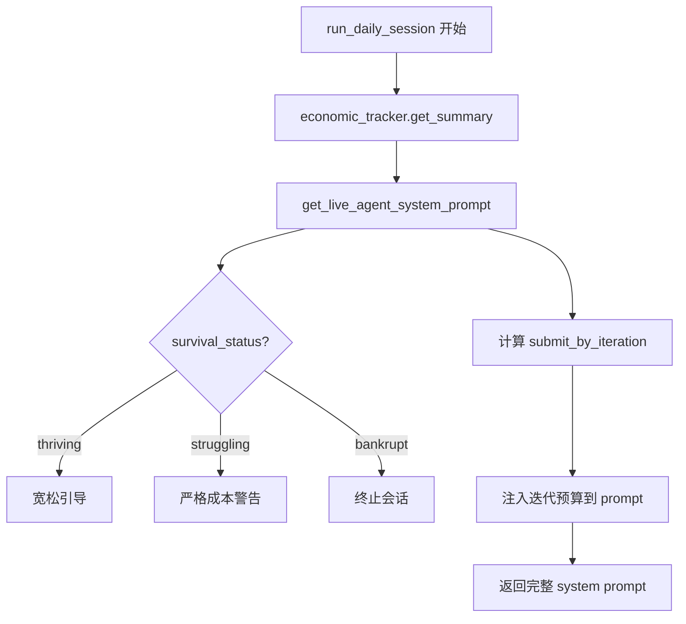
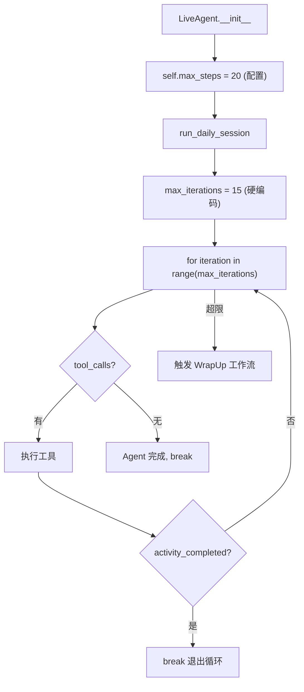

# PD-01.XX ClawWork — 经济驱动上下文管理与 WrapUp 摘要回收

> 文档编号：PD-01.XX
> 来源：ClawWork `livebench/agent/live_agent.py`, `livebench/prompts/live_agent_prompt.py`, `livebench/agent/wrapup_workflow.py`
> GitHub：https://github.com/HKUDS/ClawWork.git
> 问题域：PD-01 上下文管理 Context Window Management
> 状态：可复用方案

---

## 第 1 章 问题与动机

### 1.1 核心问题

在 Agent 经济生存模拟中，每次 LLM 调用都有真实的 token 成本（从余额中扣除），上下文管理不仅是技术问题，更是**经济生存问题**。ClawWork 的 LiveBench 框架让 Agent 在有限初始余额（$1000）下通过工作赚钱、通过 API 调用花钱，如果余额归零则"破产"。这意味着：

- 上下文越长，每次调用成本越高，Agent 存活时间越短
- 无效的工具调用和冗余输出直接消耗生存资源
- 必须在"完成任务质量"和"控制 token 消耗"之间找到平衡

### 1.2 ClawWork 的解法概述

ClawWork 采用**四层上下文管理策略**，从 prompt 设计到运行时兜底形成完整链路：

1. **经济状态实时注入**：system prompt 中嵌入余额、成本、生存状态等实时经济数据，让 Agent 自主感知成本压力（`livebench/prompts/live_agent_prompt.py:34-41`）
2. **迭代次数硬限制**：`max_steps` 参数限制单任务最大工具调用轮次（默认 20），`max_iterations=15` 作为推理循环硬上限（`livebench/agent/live_agent.py:60,656`）
3. **提前提交引导**：prompt 中计算 `submit_by_iteration = max(max_steps - 3, int(max_steps * 0.7))` 引导 Agent 在超限前提交（`livebench/prompts/live_agent_prompt.py:108`）
4. **WrapUp 摘要回收**：迭代超限后启动 LangGraph 工作流，截取最近 10 条消息做摘要，由 LLM 选择并提交产物（`livebench/agent/wrapup_workflow.py:350-390`）

### 1.3 设计思想

| 设计原则 | 具体实现 | 理由 | 替代方案 |
|----------|----------|------|----------|
| 经济意识驱动自律 | system prompt 注入余额/成本/状态 | Agent 自主控制输出长度比硬截断更灵活 | 外部 token 计数器强制截断 |
| 双层迭代限制 | max_steps(prompt 告知) + max_iterations(代码硬限) | prompt 层引导 + 代码层兜底，防止 Agent 忽略提示 | 仅靠 token 阈值触发压缩 |
| 渐进式提交压力 | submit_by_iteration 计算提前提交点 | 避免 Agent 在最后一轮才提交导致超时 | 固定在第 N 轮强制提交 |
| 优雅降级回收 | WrapUp LangGraph 工作流 | 超限后仍尝试回收已有产物，不浪费已消耗的 token | 直接丢弃未完成任务 |
| 滑动窗口摘要 | 截取最近 10 条消息给 WrapUp LLM | 控制 WrapUp 自身的上下文成本 | 传递全部历史消息 |

---

## 第 2 章 源码实现分析

### 2.1 架构概览

ClawWork 的上下文管理分布在三个核心文件中，形成"注入 → 限制 → 回收"的完整链路：

```
┌─────────────────────────────────────────────────────────────┐
│                    LiveAgent 主循环                          │
│  livebench/agent/live_agent.py                              │
│                                                             │
│  ┌──────────────┐    ┌──────────────┐    ┌──────────────┐  │
│  │ System Prompt │───→│ Tool Loop    │───→│ WrapUp       │  │
│  │ 经济状态注入  │    │ max_iterations│    │ 摘要回收     │  │
│  │ (prompt.py)  │    │ = 15 硬限制   │    │ (wrapup.py)  │  │
│  └──────────────┘    └──────────────┘    └──────────────┘  │
│        ↓                    ↓                    ↓          │
│  EconomicTracker     messages[] 累积        最近10条摘要    │
│  实时余额扣减         上下文线性增长        LLM 选择产物    │
└─────────────────────────────────────────────────────────────┘
```

### 2.2 核心实现

#### 2.2.1 经济状态实时注入 System Prompt



对应源码 `livebench/prompts/live_agent_prompt.py:12-41`：

```python
def get_live_agent_system_prompt(
    date: str,
    signature: str,
    economic_state: Dict,
    work_task: Optional[Dict] = None,
    max_steps: int = 15
) -> str:
    # Extract economic data
    balance = economic_state.get('balance', 0)
    net_worth = economic_state.get('net_worth', balance)
    total_token_cost = economic_state.get('total_token_cost', 0)
    session_cost = economic_state.get('session_cost', 0)
    daily_cost = economic_state.get('daily_cost', 0)
    survival_status = economic_state.get('survival_status', 'unknown')
```

prompt 模板中直接嵌入经济数据（`livebench/prompts/live_agent_prompt.py:152-170`）：

```python
    prompt = f"""You are an AI agent in LiveBench - an economic survival simulation.
...
   💰 Balance: ${balance:.2f}
   📈 Net Worth: ${net_worth:.2f}
   💸 Total Token Cost: ${total_token_cost:.2f}
   Session Cost So Far: ${session_cost:.4f}
   Daily Cost So Far: ${daily_cost:.4f}
...
⚠️ EVERY API CALL COSTS YOU MONEY ⚠️
💡 EFFICIENCY TIPS:
- Keep responses concise and focused
- Don't repeat information unnecessarily
- Make strategic tool calls (quality over quantity)
- Think before you act - planning is cheaper than trial-and-error
"""
```

#### 2.2.2 双层迭代限制与提前提交引导



对应源码 `livebench/agent/live_agent.py:634-660`：

```python
        # Create agent with today's system prompt
        economic_state = self.economic_tracker.get_summary()
        system_prompt = get_live_agent_system_prompt(
            date=date,
            signature=self.signature,
            economic_state=economic_state,
            work_task=self.current_task,
            max_steps=self.max_steps  # 传入配置值(20)给 prompt
        )
        ...
        # Agent reasoning loop with tool calling
        max_iterations = 15  # 硬编码循环上限
        activity_completed = False

        for iteration in range(max_iterations):
```

提前提交点计算（`livebench/prompts/live_agent_prompt.py:108-118`）：

```python
        submit_by_iteration = max(max_steps - 3, int(max_steps * 0.7))
        # max_steps=20 → submit_by_iteration=17
        # max_steps=15 → submit_by_iteration=12

        work_section = f"""
   ⚠️ ITERATION BUDGET: {max_steps} iterations maximum
   💡 Submit artifacts by iteration {submit_by_iteration} to avoid timeout!
"""
```

### 2.3 实现细节

#### Token 成本实时追踪与余额扣减

EconomicTracker 在每次 LLM 调用后立即扣减余额（`livebench/agent/economic_tracker.py:158-201`）：

```python
    def track_tokens(self, input_tokens: int, output_tokens: int,
                     api_name: str = "agent", cost: Optional[float] = None) -> float:
        if cost is None:
            cost = (
                (input_tokens / 1_000_000.0) * self.input_token_price +
                (output_tokens / 1_000_000.0) * self.output_token_price
            )
        self.session_cost += cost
        self.daily_cost += cost
        self.total_token_cost += cost
        self.current_balance -= cost  # 实时扣减余额
        return cost
```

#### WrapUp 工作流的滑动窗口摘要

当迭代超限时，WrapUp 工作流只截取最近 10 条消息做摘要，避免传递全部历史（`livebench/agent/wrapup_workflow.py:350-390`）：

```python
    def _summarize_conversation(self, messages: List[Dict]) -> str:
        if not messages:
            return "No conversation history available."
        # Look at last 10 messages for recent context
        recent_messages = messages[-10:] if len(messages) > 10 else messages
        summary_parts = []
        for msg in recent_messages:
            role = msg.get("role", "")
            content = str(msg.get("content", ""))
            if role == "assistant":
                if any(keyword in content.lower()
                       for keyword in ["creat", "generat", "writ", "sav", "artifact", "file"]):
                    truncated = content[:300] + "..." if len(content) > 300 else content
                    summary_parts.append(f"- Agent: {truncated}")
        return "\n".join(summary_parts[:5])  # Limit to 5 most relevant items
```

#### 生存状态分级引导

根据余额状态动态调整 prompt 中的成本引导强度（`livebench/prompts/live_agent_prompt.py:128-149`）：

- `thriving`（≥$500）：宽松，允许冒险
- `stable`（$100-$500）：提醒注意成本
- `struggling`（<$100）：严格警告，要求极致效率
- `bankrupt`（≤$0）：终止会话


---

## 第 3 章 迁移指南

### 3.1 迁移清单

**阶段 1：经济意识 Prompt 注入（1 天）**
- [ ] 创建 `EconomicState` 数据类，包含 balance、session_cost、daily_cost、survival_status
- [ ] 在 system prompt 模板中添加经济状态占位符
- [ ] 实现 `get_survival_guidance(status)` 分级引导函数
- [ ] 在每次 LLM 调用前刷新经济状态到 prompt

**阶段 2：迭代限制与提前提交（0.5 天）**
- [ ] 添加 `max_steps` 配置参数（建议默认 15-20）
- [ ] 在 Agent 主循环中实现 `max_iterations` 硬限制
- [ ] 计算 `submit_by_iteration` 并注入 prompt
- [ ] 在循环中检测 `activity_completed` 标志

**阶段 3：WrapUp 回收工作流（1 天）**
- [ ] 实现 `_summarize_conversation()` 滑动窗口摘要（最近 N 条）
- [ ] 创建 WrapUp 工作流：列出产物 → LLM 选择 → 下载 → 提交
- [ ] 在主循环超限后触发 WrapUp
- [ ] 添加 WrapUp 自身的 token 追踪

**阶段 4：Token 成本追踪（0.5 天）**
- [ ] 实现 `track_tokens()` 实时余额扣减
- [ ] 支持多渠道成本分离（LLM、搜索 API、OCR 等）
- [ ] 实现 `track_response_tokens()` 从 LLM 响应中提取 usage

### 3.2 适配代码模板

#### 经济意识 Prompt 注入模板

```python
from dataclasses import dataclass
from typing import Dict

@dataclass
class EconomicState:
    balance: float
    session_cost: float
    daily_cost: float
    total_token_cost: float
    survival_status: str  # "thriving" | "stable" | "struggling" | "bankrupt"

def get_survival_guidance(status: str) -> str:
    """根据生存状态返回差异化引导"""
    guidance_map = {
        "thriving": "Balance is healthy. You can take calculated risks.",
        "stable": "Be mindful of token costs. Aim to increase net worth.",
        "struggling": "⚠️ Balance critically low! Be extremely efficient.",
        "bankrupt": "🚨 BANKRUPT! Cannot continue."
    }
    return guidance_map.get(status, "")

def inject_economic_context(base_prompt: str, state: EconomicState) -> str:
    """将经济状态注入 system prompt"""
    economic_block = f"""
━━━ ECONOMIC STATUS ━━━
Balance: ${state.balance:.2f}
Session Cost: ${state.session_cost:.4f}
Daily Cost: ${state.daily_cost:.4f}
Status: {state.survival_status.upper()}

{get_survival_guidance(state.survival_status)}

⚠️ EVERY API CALL COSTS MONEY
- Keep responses concise
- Quality over quantity in tool calls
━━━━━━━━━━━━━━━━━━━━━━
"""
    return base_prompt + "\n" + economic_block
```

#### 迭代限制与 WrapUp 触发模板

```python
import asyncio
from typing import List, Dict, Optional

async def agent_loop_with_wrapup(
    agent,
    messages: List[Dict],
    max_iterations: int = 15,
    max_steps_for_prompt: int = 20
) -> bool:
    """带迭代限制和 WrapUp 回收的 Agent 主循环"""
    activity_completed = False
    submit_by = max(max_steps_for_prompt - 3, int(max_steps_for_prompt * 0.7))

    for iteration in range(max_iterations):
        response = await agent.ainvoke(messages)

        if hasattr(response, 'tool_calls') and response.tool_calls:
            messages.append({"role": "assistant", "content": response.content})
            for tool_call in response.tool_calls:
                result = await execute_tool(tool_call)
                messages.append({"role": "user", "content": f"Tool result: {result}"})
                if is_submission(tool_call):
                    activity_completed = True
            if activity_completed:
                break
        else:
            break  # No more tool calls

    # WrapUp: 超限后回收产物
    if not activity_completed:
        recent = messages[-10:] if len(messages) > 10 else messages
        summary = summarize_for_wrapup(recent)
        activity_completed = await wrapup_workflow(summary)

    return activity_completed
```

### 3.3 适用场景

| 场景 | 适用度 | 说明 |
|------|--------|------|
| Agent 经济模拟/竞技 | ⭐⭐⭐ | 完美匹配，成本即生存 |
| 按 token 计费的 SaaS Agent | ⭐⭐⭐ | 用户付费场景下控制成本 |
| 长任务多轮工具调用 | ⭐⭐⭐ | 迭代限制 + WrapUp 防止无限循环 |
| 批量任务处理 | ⭐⭐ | 累计预算追踪有价值，但 WrapUp 开销需权衡 |
| 单轮问答 Agent | ⭐ | 过度设计，简单 token 限制即可 |

---

## 第 4 章 测试用例

```python
import pytest
from unittest.mock import MagicMock, AsyncMock, patch
from typing import Dict, List

# ===== EconomicTracker 测试 =====

class TestEconomicTracker:
    """测试经济追踪器的 token 成本计算与余额扣减"""

    def setup_method(self):
        """每个测试前初始化 tracker"""
        from livebench.agent.economic_tracker import EconomicTracker
        self.tracker = EconomicTracker(
            signature="test-agent",
            initial_balance=1000.0,
            input_token_price=2.5,   # per 1M
            output_token_price=10.0,  # per 1M
            data_path="/tmp/test_economic"
        )

    def test_track_tokens_deducts_balance(self):
        """验证 token 追踪正确扣减余额"""
        cost = self.tracker.track_tokens(
            input_tokens=1000,
            output_tokens=500
        )
        # 1000/1M * 2.5 + 500/1M * 10.0 = 0.0025 + 0.005 = 0.0075
        assert abs(cost - 0.0075) < 1e-6
        assert abs(self.tracker.current_balance - (1000.0 - 0.0075)) < 1e-6

    def test_track_tokens_with_precomputed_cost(self):
        """验证 OpenRouter 预计算成本直接使用"""
        cost = self.tracker.track_tokens(
            input_tokens=1000,
            output_tokens=500,
            cost=0.05  # OpenRouter 报告的成本
        )
        assert cost == 0.05
        assert abs(self.tracker.current_balance - 999.95) < 1e-6

    def test_survival_status_transitions(self):
        """验证生存状态随余额变化正确转换"""
        assert self.tracker.get_survival_status() == "thriving"  # 1000
        self.tracker.current_balance = 300
        assert self.tracker.get_survival_status() == "stable"
        self.tracker.current_balance = 50
        assert self.tracker.get_survival_status() == "struggling"
        self.tracker.current_balance = 0
        assert self.tracker.get_survival_status() == "bankrupt"
        assert self.tracker.is_bankrupt() is True

    def test_session_cost_accumulation(self):
        """验证会话成本累积"""
        self.tracker.track_tokens(1000, 500)
        self.tracker.track_tokens(2000, 1000)
        assert self.tracker.session_cost > 0
        assert self.tracker.daily_cost == self.tracker.session_cost


# ===== Prompt 生成测试 =====

class TestPromptGeneration:
    """测试 system prompt 中经济状态注入"""

    def test_economic_state_injected(self):
        """验证 prompt 包含余额和成本信息"""
        from livebench.prompts.live_agent_prompt import get_live_agent_system_prompt
        prompt = get_live_agent_system_prompt(
            date="2025-01-20",
            signature="test-agent",
            economic_state={
                "balance": 500.0,
                "net_worth": 500.0,
                "total_token_cost": 10.0,
                "session_cost": 0.5,
                "daily_cost": 1.0,
                "survival_status": "stable"
            },
            max_steps=20
        )
        assert "$500.00" in prompt
        assert "STABLE" in prompt
        assert "ITERATION BUDGET: 20" in prompt

    def test_submit_by_iteration_calculation(self):
        """验证提前提交点计算"""
        from livebench.prompts.live_agent_prompt import get_live_agent_system_prompt
        prompt = get_live_agent_system_prompt(
            date="2025-01-20",
            signature="test",
            economic_state={"balance": 1000, "net_worth": 1000,
                           "total_token_cost": 0, "session_cost": 0,
                           "daily_cost": 0, "survival_status": "thriving"},
            max_steps=20
        )
        # max(20-3, int(20*0.7)) = max(17, 14) = 17
        assert "iteration 17" in prompt

    def test_struggling_agent_gets_warning(self):
        """验证低余额 Agent 收到严格警告"""
        from livebench.prompts.live_agent_prompt import get_live_agent_system_prompt
        prompt = get_live_agent_system_prompt(
            date="2025-01-20",
            signature="test",
            economic_state={"balance": 50, "net_worth": 50,
                           "total_token_cost": 950, "session_cost": 0,
                           "daily_cost": 0, "survival_status": "struggling"},
            max_steps=15
        )
        assert "WARNING" in prompt
        assert "critically low" in prompt


# ===== WrapUp 摘要测试 =====

class TestWrapUpSummarization:
    """测试 WrapUp 工作流的对话摘要"""

    def test_summarize_extracts_file_creation(self):
        """验证摘要提取文件创建相关内容"""
        from livebench.agent.wrapup_workflow import WrapUpWorkflow
        wrapup = WrapUpWorkflow(llm=MagicMock())
        messages = [
            {"role": "user", "content": "Create a report"},
            {"role": "assistant", "content": "I'll create an Excel file with the data..."},
            {"role": "user", "content": "Tool result: file saved"},
            {"role": "assistant", "content": "Now let me analyze the results"},
        ]
        summary = wrapup._summarize_conversation(messages)
        assert "creat" in summary.lower() or "Excel" in summary

    def test_summarize_limits_to_10_messages(self):
        """验证摘要只取最近 10 条消息"""
        from livebench.agent.wrapup_workflow import WrapUpWorkflow
        wrapup = WrapUpWorkflow(llm=MagicMock())
        messages = [{"role": "user", "content": f"msg {i}"} for i in range(20)]
        # 内部 recent_messages = messages[-10:]
        summary = wrapup._summarize_conversation(messages)
        # 不应崩溃，且结果有限
        assert isinstance(summary, str)

    def test_empty_conversation_handled(self):
        """验证空对话历史不崩溃"""
        from livebench.agent.wrapup_workflow import WrapUpWorkflow
        wrapup = WrapUpWorkflow(llm=MagicMock())
        summary = wrapup._summarize_conversation([])
        assert "No conversation history" in summary
```


---

## 第 5 章 跨域关联

| 关联域 | 关系类型 | 说明 |
|--------|----------|------|
| PD-02 多 Agent 编排 | 协同 | WrapUp 工作流本身是一个独立的 LangGraph 子编排，与主 Agent 循环解耦 |
| PD-03 容错与重试 | 依赖 | `_ainvoke_with_retry` 提供指数退避重试，WrapUp 是迭代超限的容错降级 |
| PD-04 工具系统 | 协同 | 工具调用结果通过 `format_tool_result_message` 格式化后追加到 messages，直接影响上下文增长 |
| PD-06 记忆持久化 | 协同 | EconomicTracker 将 token 成本持久化到 JSONL，支持跨会话恢复余额状态 |
| PD-07 质量检查 | 依赖 | 评估分数 ≥ 0.6 才发放报酬，质量门控直接影响经济状态进而影响上下文管理策略 |
| PD-11 可观测性 | 协同 | `track_response_tokens` 记录每次调用的 input/output tokens，`task_costs` 按渠道分离成本 |

---

## 第 6 章 来源文件索引

| 文件 | 行范围 | 关键实现 |
|------|--------|----------|
| `livebench/prompts/live_agent_prompt.py` | L12-L41 | `get_live_agent_system_prompt` 函数签名与经济状态提取 |
| `livebench/prompts/live_agent_prompt.py` | L108-L118 | `submit_by_iteration` 计算与迭代预算注入 |
| `livebench/prompts/live_agent_prompt.py` | L128-L149 | 生存状态分级引导（thriving/stable/struggling/bankrupt） |
| `livebench/prompts/live_agent_prompt.py` | L152-L397 | 完整 system prompt 模板（含经济数据、工具列表、工作流指引） |
| `livebench/agent/live_agent.py` | L50-L112 | LiveAgent 初始化，`max_steps` 参数定义 |
| `livebench/agent/live_agent.py` | L634-L660 | 主循环：system prompt 生成 + `max_iterations=15` 硬限制 |
| `livebench/agent/live_agent.py` | L790-L834 | WrapUp 工作流触发逻辑 |
| `livebench/agent/wrapup_workflow.py` | L26-L38 | `WrapUpState` TypedDict 定义 |
| `livebench/agent/wrapup_workflow.py` | L64-L93 | LangGraph 工作流构建（4 节点 + 条件边） |
| `livebench/agent/wrapup_workflow.py` | L181-L272 | `_decide_submission_node`：LLM 选择提交产物 |
| `livebench/agent/wrapup_workflow.py` | L350-L390 | `_summarize_conversation`：最近 10 条消息滑动窗口摘要 |
| `livebench/agent/economic_tracker.py` | L158-L201 | `track_tokens` 实时余额扣减 |
| `livebench/agent/economic_tracker.py` | L524-L538 | `get_survival_status` 四级状态判定 |
| `livebench/agent/economic_tracker.py` | L842-L877 | `track_response_tokens` 从 LLM 响应提取 usage |
| `livebench/agent/message_formatter.py` | L35-L50 | `format_tool_result_message` 多模态消息格式化 |
| `livebench/configs/default_config.json` | L23-L28 | `agent_params.max_steps=20` 默认配置 |

---

## 第 7 章 横向对比维度

> **重要：** 本章用于自动填充 Butcher Wiki 的横向对比表。

```json comparison_data
{
  "project": "ClawWork",
  "dimensions": {
    "估算方式": "无预估算，依赖 LLM 响应后的 usage_metadata 实时扣减",
    "压缩策略": "WrapUp 滑动窗口取最近10条+关键词过滤，截断至5条摘要",
    "触发机制": "max_iterations=15 硬编码循环上限触发 WrapUp",
    "实现位置": "prompt 层经济引导 + 代码层迭代限制 + LangGraph WrapUp 工作流",
    "容错设计": "WrapUp 回收已有产物，不浪费已消耗 token",
    "Prompt模板化": "f-string 模板注入6项经济指标+分级生存引导",
    "累计预算": "EconomicTracker 跨调用累计 total_token_cost 并实时扣减 balance",
    "多维停止决策": "迭代上限(15) + 活动完成标志 + 破产检测 三重停止条件",
    "供应商适配": "OpenRouter 直接用 reported cost，其他用本地 price/1M 公式",
    "保留策略": "全量消息累积无压缩，仅在 WrapUp 时取最近10条"
  }
}
```

### 域元数据补充

```json domain_metadata
{
  "solution_summary": "ClawWork 通过 system prompt 注入实时经济状态（余额/成本/生存等级）驱动 Agent 自律控制输出长度，max_iterations=15 硬限制迭代次数，超限后 LangGraph WrapUp 工作流截取最近10条消息做摘要回收产物",
  "description": "经济生存压力作为上下文管理的隐式约束，成本即生存",
  "sub_problems": [
    "经济意识注入：将 token 成本转化为 Agent 可感知的生存压力，引导自主控制输出长度",
    "迭代预算提前提交：计算安全提交点并注入 prompt，避免 Agent 在最后一轮才提交导致超时",
    "超限产物回收：迭代超限后通过独立工作流回收已生成但未提交的产物，避免浪费已消耗 token"
  ],
  "best_practices": [
    "双层限制互补：prompt 告知预算（软限制）+ 代码硬编码上限（硬限制），防止 Agent 忽略提示",
    "WrapUp 自身也要追踪 token：回收工作流的 LLM 调用同样扣减余额，避免回收成本超过回收价值"
  ]
}
```

