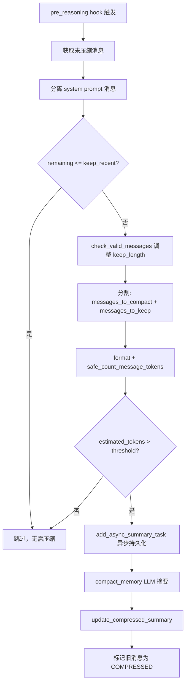
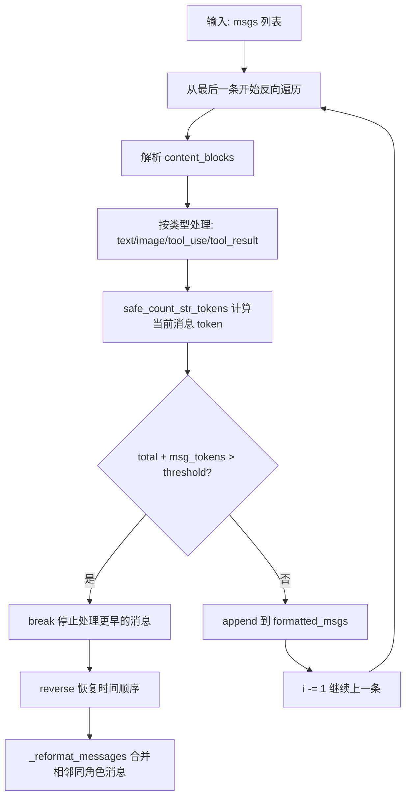
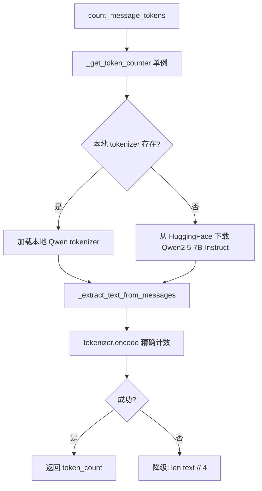

# PD-01.15 CoPaw — Hook 驱动双重上下文压缩与 Qwen 精确计数

> 文档编号：PD-01.15
> 来源：CoPaw `src/copaw/agents/hooks/memory_compaction.py`
> GitHub：https://github.com/agentscope-ai/CoPaw.git
> 问题域：PD-01 上下文管理 Context Window Management
> 状态：可复用方案

---

## 第 1 章 问题与动机（≥ 30 行）

### 1.1 核心问题

长对话场景下，Agent 的上下文窗口会被历史消息、工具调用结果、多模态内容逐步填满。一旦超出模型的 `max_input_length`（CoPaw 默认 128K tokens），API 调用直接报错。更隐蔽的问题是：即使没超限，过长的上下文也会导致注意力衰减（Lost-in-the-middle），降低推理质量。

CoPaw 面临的特殊挑战：
1. **DashScope/Qwen 生态绑定** — 使用阿里云 DashScope API + Qwen 系列模型，tokenizer 与 OpenAI tiktoken 完全不同
2. **工具结果膨胀** — 浏览器截图、文件读取、Shell 输出等工具返回大量文本，单条 tool_result 可达数万字符
3. **多模态内容** — 图片/音频/视频的 token 估算与文本不同，需要固定值近似
4. **会话持久化** — 支持 `/compact` 手动压缩和会话恢复，压缩摘要需要跨会话保留

### 1.2 CoPaw 的解法概述

CoPaw 实现了**双重上下文管理**机制，两层防线协同工作：

1. **第一层：MemoryCompactionHook（pre_reasoning 阶段）** — 在每次 LLM 推理前自动检查 token 用量，超阈值时用 LLM 摘要压缩旧消息，保留最近 N 条（`memory_compaction.py:65-204`）
2. **第二层：TimestampedDashScopeChatFormatter（格式化阶段）** — 反向遍历消息列表，逐条累加 token 计数，超阈值时直接截断旧消息不发送给 API（`memory_manager.py:191-429`）
3. **精确计数基础：Qwen tokenizer** — 使用 HuggingFace 的 Qwen2.5 tokenizer 做精确 token 计数，失败时降级为 `len // 4` 字符估算（`token_counting.py:15-55`）
4. **工具结果截断** — 对 tool_result 文本做 head+tail 截断（保留首尾各半），防止单条消息占满上下文（`tool_message_utils.py:359-389`）
5. **消息完整性保护** — 压缩时通过 `check_valid_messages` 确保 tool_use/tool_result 配对不被拆散（`tool_message_utils.py:35-53`）

### 1.3 设计思想

| 设计原则 | 具体实现 | 理由 | 替代方案 |
|----------|----------|------|----------|
| Hook 驱动而非侵入式 | `register_instance_hook("pre_reasoning")` 注册压缩钩子 | Agent 核心逻辑无需感知压缩存在，解耦彻底 | 在 Agent.reply() 中硬编码压缩逻辑 |
| 双重防线 | Hook 层做 LLM 摘要压缩 + Formatter 层做硬截断 | 摘要压缩保留语义但有延迟，硬截断保证绝不超限 | 只用一层（要么丢信息要么可能超限） |
| 精确计数优先 | Qwen tokenizer 精确编码，异常时降级 `len//4` | DashScope 按 token 计费，精确计数避免浪费和超限 | 统一用字符估算（不精确） |
| 增量摘要 | `previous_summary` 参数传入历史摘要，新摘要在此基础上增量生成 | 避免每次全量重新摘要，节省 LLM 调用成本 | 每次丢弃旧摘要重新生成 |
| 异步摘要双写 | `add_async_summary_task` 在压缩同时异步写入 ReMeFs 长期记忆 | 压缩摘要不仅用于当前会话，还持久化到语义记忆库 | 只保留在内存中 |

---

## 第 2 章 源码实现分析（≥ 60 行，核心章节）

### 2.1 架构概览

CoPaw 的上下文管理涉及 5 个核心组件，形成从检测到压缩到截断的完整链路：

```
┌─────────────────────────────────────────────────────────────────┐
│                     CoPawAgent.reply()                          │
│                                                                 │
│  ┌──────────────┐    ┌──────────────────┐    ┌───────────────┐  │
│  │ pre_reasoning │───→│ MemoryCompaction │───→│ _reasoning()  │  │
│  │    hooks      │    │     Hook         │    │               │  │
│  └──────────────┘    └────────┬─────────┘    └───────┬───────┘  │
│                               │                      │          │
│                    ┌──────────▼──────────┐   ┌───────▼───────┐  │
│                    │   MemoryManager     │   │  Formatter    │  │
│                    │  .compact_memory()  │   │  ._format()   │  │
│                    │  (LLM 摘要压缩)     │   │ (反向遍历截断) │  │
│                    └──────────┬──────────┘   └───────────────┘  │
│                               │                                 │
│                    ┌──────────▼──────────┐                      │
│                    │  token_counting.py  │                      │
│                    │  (Qwen tokenizer)   │                      │
│                    └────────────────────┘                       │
└─────────────────────────────────────────────────────────────────┘
```

数据流：
1. Agent 每轮推理前触发 `pre_reasoning` hook
2. Hook 从内存获取未压缩消息，分离 system prompt / compactable / recent 三段
3. 对 compactable 段做 token 计数，超阈值则调用 MemoryManager.compact_memory()
4. compact_memory() 用 ReMeFs 生成摘要 prompt，再用 ReActAgent 执行 LLM 摘要
5. 摘要结果写回 memory 的 `_compressed_summary`，旧消息标记为 COMPRESSED
6. 即使 Hook 未触发（或摘要还没完成），Formatter 层的反向遍历截断作为最后防线

### 2.2 核心实现

#### 2.2.1 MemoryCompactionHook — 三段式消息分割与阈值触发



对应源码 `src/copaw/agents/hooks/memory_compaction.py:102-204`：

```python
async def __call__(
    self,
    agent,
    kwargs: dict[str, Any],
) -> dict[str, Any] | None:
    try:
        messages = await agent.memory.get_memory(
            exclude_mark=_MemoryMark.COMPRESSED,
            prepend_summary=False,
        )

        # 1. 分离 system prompt
        system_prompt_messages = []
        for msg in messages:
            if msg.role == "system":
                system_prompt_messages.append(msg)
            else:
                break

        remaining_messages = messages[len(system_prompt_messages):]

        if len(remaining_messages) <= self.keep_recent:
            return None

        # 2. 动态调整 keep_length 确保 tool_use/tool_result 配对完整
        keep_length = self.keep_recent
        while keep_length > 0 and not check_valid_messages(
            remaining_messages[-keep_length:],
        ):
            keep_length -= 1

        # 3. 分割消息
        if keep_length > 0:
            messages_to_compact = remaining_messages[:-keep_length]
            messages_to_keep = remaining_messages[-keep_length:]
        else:
            messages_to_compact = remaining_messages
            messages_to_keep = []

        # 4. 精确计数
        prompt = await agent.formatter.format(msgs=messages_to_compact)
        estimated_tokens = await safe_count_message_tokens(prompt)

        if estimated_tokens > self.memory_compact_threshold:
            # 5. 异步持久化 + 同步摘要
            self.memory_manager.add_async_summary_task(
                messages=messages_to_compact,
            )
            compact_content = await self.memory_manager.compact_memory(
                messages_to_summarize=messages_to_compact,
                previous_summary=agent.memory.get_compressed_summary(),
            )
            await agent.memory.update_compressed_summary(compact_content)
            updated_count = await agent.memory.update_messages_mark(
                new_mark=_MemoryMark.COMPRESSED,
                msg_ids=[msg.id for msg in messages_to_compact],
            )
    except Exception as e:
        logger.error("Failed to compact memory: %s", e, exc_info=True)
    return None
```

关键设计点：
- **三段分割**：`[system_prompt] + [compactable] + [recent]`，system prompt 永远保留，recent 消息保留最近 N 条（默认 3，`constant.py:50-51`）
- **配对保护**：`check_valid_messages` 验证 tool_use 和 tool_result 的 ID 匹配，如果 keep_recent 边界恰好切断了配对，自动缩小 keep_length
- **异步双写**：`add_async_summary_task` 在压缩的同时异步调用 `summary_memory` 写入 ReMeFs 长期记忆库

#### 2.2.2 TimestampedDashScopeChatFormatter — 反向遍历硬截断



对应源码 `src/copaw/agents/memory/memory_manager.py:191-429`：

```python
async def _format(self, msgs: list[Msg]) -> list[dict[str, Any]]:
    formatted_msgs: list[dict] = []
    total_token_count = 0

    # 反向遍历：从最新消息开始
    i = len(msgs) - 1
    while i >= 0:
        msg = msgs[i]
        content_blocks: list[dict[str, Any]] = []
        tool_calls = []
        msg_token_count = 0

        for block in msg.get_content_blocks():
            typ = block.get("type")
            if typ == "text":
                text_content = _truncate_text(block.get("text", ""))
                content_blocks.append({"text": text_content})
                msg_token_count += safe_count_str_tokens(text_content)
            elif typ in ["image", "audio", "video"]:
                content_blocks.append(
                    _format_dashscope_media_block(block),
                )
                msg_token_count += 100  # 多模态固定估算
            elif typ == "tool_use":
                arguments_str = json.dumps(block.get("input", {}), ensure_ascii=False)
                tool_calls.append({...})
                msg_token_count += safe_count_str_tokens(arguments_str)
            elif typ == "tool_result":
                textual_output = _truncate_text(textual_output)
                msg_token_count += safe_count_str_tokens(textual_output)
                formatted_msgs.append({"role": "tool", ...})

        total_token_count += msg_token_count
        # 硬截断：超阈值立即停止
        if self._memory_compact_threshold < total_token_count + msg_token_count:
            break

        formatted_msgs.append(msg_dashscope)
        i -= 1

    formatted_msgs.reverse()  # 恢复时间顺序
    return _reformat_messages(formatted_msgs)
```

关键设计点：
- **反向遍历保留最新**：从最后一条消息开始处理，确保最新的对话优先保留
- **逐条精确计数**：每条消息的每个 block 都用 tokenizer 精确计数，多模态用固定 100 token 估算
- **文本截断**：每个 text block 和 tool_result 都经过 `_truncate_text` 截断（默认 10000 字符），保留首尾各半

#### 2.2.3 Token 计数 — Qwen tokenizer + 字符降级



对应源码 `src/copaw/agents/utils/token_counting.py:15-55`：

```python
def _get_token_counter():
    global _token_counter
    if _token_counter is None:
        from agentscope.token import HuggingFaceTokenCounter

        local_tokenizer_path = Path(__file__).parent.parent.parent / "tokenizer"
        if local_tokenizer_path.exists() and (local_tokenizer_path / "tokenizer.json").exists():
            tokenizer_path = str(local_tokenizer_path)
        else:
            tokenizer_path = "Qwen/Qwen2.5-7B-Instruct"

        _token_counter = HuggingFaceTokenCounter(
            pretrained_model_name_or_path=tokenizer_path,
            use_mirror=True,   # 中国用户使用 HF 镜像
            use_fast=True,
            trust_remote_code=True,
        )
    return _token_counter
```

### 2.3 实现细节

**阈值计算公式**（`constant.py:54-55` + `memory_manager.py:467-471`）：

```
memory_compact_threshold = max_input_length × MEMORY_COMPACT_RATIO × 0.9
                         = 131072 × 0.7 × 0.9
                         = 82,575 tokens
```

其中：
- `max_input_length = 128K = 131072`（`react_agent.py:67`）
- `MEMORY_COMPACT_RATIO = 0.7`（环境变量 `COPAW_MEMORY_COMPACT_RATIO`，`constant.py:54`）
- `0.9` 是 MemoryManager 额外的安全系数（`memory_manager.py:470`）
- CoPawAgent 层不乘 0.9（`react_agent.py:88-89`），两层阈值略有差异

**摘要注入方式**（`copaw_memory.py:59-75`）：

压缩摘要以 `<previous-summary>` XML 标签包裹，作为 user 角色消息注入到 system prompt 之后、正常对话之前：

```python
previous_summary = f"""
<previous-summary>
{self._compressed_summary}
</previous-summary>
The above is a summary of our previous conversation.
Use it as context to maintain continuity.
""".strip()
return [Msg("user", previous_summary, "user"), *filtered_messages]
```

**工具消息修复链**（`tool_message_utils.py:322-356`）：

压缩前对消息做 4 步清洗：
1. `_repair_empty_tool_inputs` — 修复 AgentScope 流式解析 bug（空 input 但有 raw_input）
2. `_remove_invalid_tool_blocks` — 移除无效 tool block（空 id/name）
3. `_dedup_tool_blocks` — 去重同 ID 的 tool_use
4. `_reorder_tool_results` — 重排 tool_result 到对应 tool_use 之后


---

## 第 3 章 迁移指南（≥ 40 行）

### 3.1 迁移清单

**阶段 1：Token 计数基础设施**
- [ ] 选择与目标模型匹配的 tokenizer（Qwen 用 HuggingFace，OpenAI 用 tiktoken）
- [ ] 实现 `safe_count_message_tokens` 带降级的计数函数
- [ ] 支持多模态内容的固定 token 估算

**阶段 2：消息分割与压缩**
- [ ] 实现三段式消息分割：system prompt / compactable / recent
- [ ] 实现 tool_use/tool_result 配对验证（`check_valid_messages`）
- [ ] 集成 LLM 摘要压缩（可用任意 LLM，不必是主模型）
- [ ] 实现增量摘要（传入 previous_summary）

**阶段 3：Hook 注册与双重防线**
- [ ] 在 Agent 框架中注册 pre_reasoning hook
- [ ] 在 Formatter 层实现反向遍历硬截断
- [ ] 配置阈值：建议 `max_input_length × 0.6~0.7`

**阶段 4：工具结果截断**
- [ ] 实现 head+tail 截断函数（保留首尾各半）
- [ ] 对 tool_result 文本设置最大长度（建议 4000-10000 字符）

### 3.2 适配代码模板

以下是一个框架无关的压缩 Hook 模板，可直接复用：

```python
"""Portable memory compaction hook template."""
from typing import Any, Protocol

class TokenCounter(Protocol):
    def count(self, text: str) -> int: ...

class MemoryCompactionHook:
    """Pre-reasoning hook for automatic context compaction."""

    def __init__(
        self,
        token_counter: TokenCounter,
        compact_threshold: int,
        keep_recent: int = 3,
        summarizer=None,  # LLM summarizer callable
    ):
        self.token_counter = token_counter
        self.compact_threshold = compact_threshold
        self.keep_recent = keep_recent
        self.summarizer = summarizer

    def _split_messages(self, messages: list[dict]) -> tuple[list, list, list]:
        """Split into [system] + [compactable] + [recent]."""
        system_msgs = []
        for msg in messages:
            if msg.get("role") == "system":
                system_msgs.append(msg)
            else:
                break
        remaining = messages[len(system_msgs):]
        if len(remaining) <= self.keep_recent:
            return system_msgs, [], remaining
        return (
            system_msgs,
            remaining[:-self.keep_recent],
            remaining[-self.keep_recent:],
        )

    def _count_tokens(self, messages: list[dict]) -> int:
        """Count tokens with fallback."""
        try:
            text = "\n".join(
                msg.get("content", "") for msg in messages
                if isinstance(msg.get("content"), str)
            )
            return self.token_counter.count(text)
        except Exception:
            text = "\n".join(str(msg.get("content", "")) for msg in messages)
            return len(text) // 4

    async def __call__(self, messages: list[dict]) -> tuple[list[dict], str]:
        """Check and compact if needed. Returns (kept_messages, summary)."""
        system, compactable, recent = self._split_messages(messages)
        if not compactable:
            return messages, ""

        token_count = self._count_tokens(compactable)
        if token_count <= self.compact_threshold:
            return messages, ""

        # Summarize old messages
        summary = await self.summarizer(compactable)
        return system + recent, summary
```

### 3.3 适用场景

| 场景 | 适用度 | 说明 |
|------|--------|------|
| 长对话 Agent（>50 轮） | ⭐⭐⭐ | 核心场景，Hook 自动压缩无需人工干预 |
| 工具密集型 Agent | ⭐⭐⭐ | tool_result 截断 + 配对保护解决工具输出膨胀 |
| 多模态对话 | ⭐⭐ | 固定 100 token 估算较粗糙，但作为防线足够 |
| 短对话（<10 轮） | ⭐ | 不会触发压缩，Hook 只增加微量检查开销 |
| 多 Agent 编排 | ⭐⭐ | 每个 Agent 独立 Hook，但子 Agent 上下文隔离需额外设计 |

---

## 第 4 章 测试用例（≥ 20 行）

```python
import pytest
from unittest.mock import AsyncMock, MagicMock, patch


class TestTokenCounting:
    """Tests for token_counting.py functions."""

    def test_extract_text_simple_content(self):
        """Test text extraction from simple string content."""
        messages = [
            {"role": "user", "content": "hello"},
            {"role": "assistant", "content": "world"},
        ]
        from copaw.agents.utils.token_counting import _extract_text_from_messages
        result = _extract_text_from_messages(messages)
        assert "hello" in result
        assert "world" in result

    def test_extract_text_list_content(self):
        """Test text extraction from list content blocks."""
        messages = [
            {"role": "user", "content": [
                {"type": "text", "text": "block1"},
                {"type": "text", "text": "block2"},
            ]},
        ]
        from copaw.agents.utils.token_counting import _extract_text_from_messages
        result = _extract_text_from_messages(messages)
        assert "block1" in result
        assert "block2" in result

    @pytest.mark.asyncio
    async def test_safe_count_fallback(self):
        """Test fallback to len//4 when tokenizer fails."""
        from copaw.agents.utils.token_counting import safe_count_message_tokens
        with patch(
            "copaw.agents.utils.token_counting._get_token_counter",
            side_effect=RuntimeError("no tokenizer"),
        ):
            messages = [{"role": "user", "content": "a" * 400}]
            count = await safe_count_message_tokens(messages)
            assert count == 100  # 400 // 4


class TestMemoryCompactionHook:
    """Tests for MemoryCompactionHook."""

    @pytest.mark.asyncio
    async def test_skip_when_few_messages(self):
        """Should skip compaction when messages <= keep_recent."""
        hook = _make_hook(keep_recent=10, threshold=1000)
        agent = _make_agent(message_count=5)
        result = await hook(agent, {})
        assert result is None  # No compaction needed

    @pytest.mark.asyncio
    async def test_trigger_compaction(self):
        """Should trigger compaction when tokens exceed threshold."""
        hook = _make_hook(keep_recent=2, threshold=100)
        agent = _make_agent(message_count=20, tokens_per_msg=50)
        await hook(agent, {})
        agent.memory.update_compressed_summary.assert_called_once()

    @pytest.mark.asyncio
    async def test_tool_pair_protection(self):
        """Should adjust keep_length to preserve tool_use/tool_result pairs."""
        hook = _make_hook(keep_recent=3, threshold=100)
        # Last 3 messages: [tool_use, text, tool_result] — invalid split
        agent = _make_agent_with_tool_pair_at_boundary()
        await hook(agent, {})
        # keep_length should shrink to avoid splitting the pair


class TestTruncateText:
    """Tests for _truncate_text."""

    def test_short_text_unchanged(self):
        from copaw.agents.utils.tool_message_utils import _truncate_text
        assert _truncate_text("short", 100) == "short"

    def test_long_text_truncated(self):
        from copaw.agents.utils.tool_message_utils import _truncate_text
        text = "x" * 200
        result = _truncate_text(text, 100)
        assert "[...truncated" in result
        assert len(result) < 200


class TestCheckValidMessages:
    """Tests for tool_use/tool_result pairing validation."""

    def test_valid_pair(self):
        from copaw.agents.utils.tool_message_utils import check_valid_messages
        msgs = [
            MagicMock(content=[{"type": "tool_use", "id": "t1"}]),
            MagicMock(content=[{"type": "tool_result", "id": "t1"}]),
        ]
        assert check_valid_messages(msgs) is True

    def test_orphan_tool_use(self):
        from copaw.agents.utils.tool_message_utils import check_valid_messages
        msgs = [
            MagicMock(content=[{"type": "tool_use", "id": "t1"}]),
        ]
        assert check_valid_messages(msgs) is False


# --- Test helpers ---
def _make_hook(keep_recent=3, threshold=1000):
    mm = MagicMock()
    mm.compact_memory = AsyncMock(return_value="summary")
    return MemoryCompactionHook(
        memory_manager=mm,
        memory_compact_threshold=threshold,
        keep_recent=keep_recent,
    )

def _make_agent(message_count=10, tokens_per_msg=10):
    agent = MagicMock()
    msgs = [MagicMock(role="user" if i % 2 == 0 else "assistant", id=str(i))
            for i in range(message_count)]
    agent.memory.get_memory = AsyncMock(return_value=msgs)
    agent.memory.get_compressed_summary = MagicMock(return_value="")
    agent.memory.update_compressed_summary = AsyncMock()
    agent.memory.update_messages_mark = AsyncMock(return_value=message_count)
    agent.formatter.format = AsyncMock(return_value=[{"role": "user", "content": "x" * tokens_per_msg}])
    return agent
```


---

## 第 5 章 跨域关联

| 关联域 | 关系类型 | 说明 |
|--------|----------|------|
| PD-03 容错与重试 | 协同 | `safe_count_message_tokens` 的 try/except 降级是容错模式；`_sanitize_tool_messages` 的 4 步修复链保证消息格式正确性 |
| PD-04 工具系统 | 依赖 | 工具结果截断（`_truncate_text`）和 tool_use/tool_result 配对保护直接服务于工具系统的输出管理 |
| PD-06 记忆持久化 | 协同 | `add_async_summary_task` 将压缩摘要异步写入 ReMeFs 长期记忆库，实现跨会话记忆持久化 |
| PD-10 中间件管道 | 依赖 | MemoryCompactionHook 本身就是 AgentScope 的 `register_instance_hook` 中间件机制的实例 |
| PD-11 可观测性 | 协同 | 压缩触发时记录详细日志（estimated tokens、threshold、各段消息数），支持运行时监控 |

---

## 第 6 章 来源文件索引

| 文件 | 行范围 | 关键实现 |
|------|--------|----------|
| `src/copaw/agents/hooks/memory_compaction.py` | L65-L204 | MemoryCompactionHook 核心类，三段分割 + 阈值触发 + 异步双写 |
| `src/copaw/agents/utils/token_counting.py` | L15-L178 | Qwen tokenizer 单例 + 精确计数 + 字符降级 |
| `src/copaw/agents/memory/memory_manager.py` | L74-L429 | TimestampedDashScopeChatFormatter 反向遍历截断 + MemoryManager 摘要生成 |
| `src/copaw/agents/memory/copaw_memory.py` | L12-L116 | CoPawInMemoryMemory 摘要注入 + 状态序列化 |
| `src/copaw/agents/utils/tool_message_utils.py` | L35-L389 | check_valid_messages 配对验证 + _sanitize_tool_messages 4 步修复 + _truncate_text |
| `src/copaw/agents/react_agent.py` | L60-L244 | CoPawAgent 初始化 + Hook 注册 + 阈值计算 |
| `src/copaw/constant.py` | L50-L56 | MEMORY_COMPACT_KEEP_RECENT=3, MEMORY_COMPACT_RATIO=0.7 |

---

## 第 7 章 横向对比维度

> **重要：** 本章用于自动填充 Butcher Wiki 的横向对比表。
> 必须严格按以下 JSON 格式输出，放在 `comparison_data` 代码块中。

```json comparison_data
{
  "project": "CoPaw",
  "dimensions": {
    "估算方式": "Qwen2.5 HuggingFace tokenizer 精确编码，异常降级 len//4",
    "压缩策略": "LLM 增量摘要（ReMeFs compact），previous_summary 累积",
    "触发机制": "pre_reasoning Hook 阈值触发（max_input × 0.7 × 0.9）",
    "实现位置": "AgentScope register_instance_hook + Formatter 双层",
    "容错设计": "tokenizer 降级 + 4 步 tool 消息修复链 + 全局 try/except",
    "保留策略": "保留 system prompt + 最近 N 条（默认 3），配对感知动态调整",
    "AI/Tool消息对保护": "check_valid_messages 验证 ID 匹配，动态缩小 keep_length",
    "工具输出压缩": "head+tail 截断（默认 10000 字符），保留首尾各半",
    "增量摘要与全量摘要切换": "始终增量：传入 previous_summary 在历史摘要基础上追加",
    "二次截断兜底": "Formatter 反向遍历逐条计数，超阈值直接 break 丢弃旧消息",
    "供应商适配": "DashScope 专用 Formatter，多模态固定 100 token 估算",
    "摘要模型选择": "复用主模型（通过 MemoryManager.chat_model 共享）"
  }
}
```

### 域元数据补充

```json domain_metadata
{
  "solution_summary": "CoPaw 通过 AgentScope pre_reasoning Hook 在推理前自动三段分割消息并用 ReMeFs 增量摘要压缩，配合 Formatter 反向遍历硬截断实现双重上下文防线",
  "description": "Hook 驱动的非侵入式压缩与 Formatter 层硬截断的双重防线协同",
  "sub_problems": [
    "工具消息修复链：压缩前需修复空 input、无效 ID、重复 block、乱序配对等 4 类 tool 消息缺陷",
    "反向遍历截断：从最新消息开始逐条累加 token，超阈值时丢弃更早消息保证最新上下文完整",
    "异步摘要双写：压缩摘要同时异步写入长期记忆库，实现会话内压缩与跨会话持久化的并行"
  ],
  "best_practices": [
    "双重防线互补：Hook 层做语义摘要保留信息，Formatter 层做硬截断保证绝不超限",
    "配对感知分割：压缩边界必须检查 tool_use/tool_result 配对完整性，动态调整保留数量",
    "本地 tokenizer 优先：优先加载本地 tokenizer 避免网络依赖，失败时降级为字符估算"
  ]
}
```
