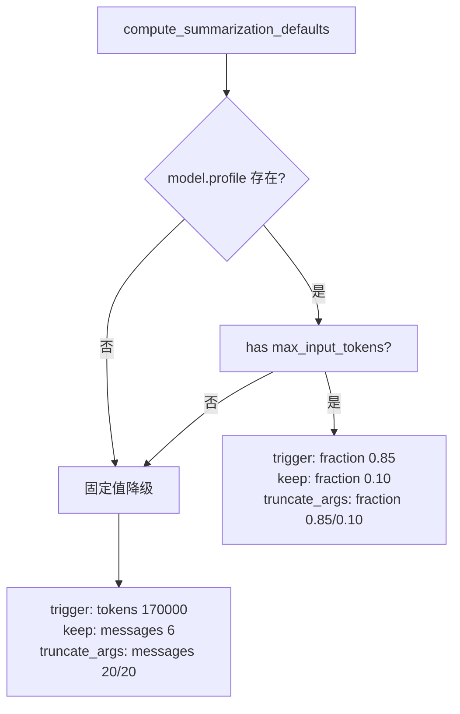
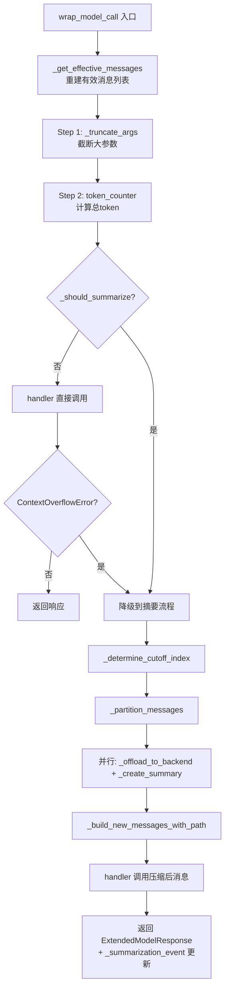
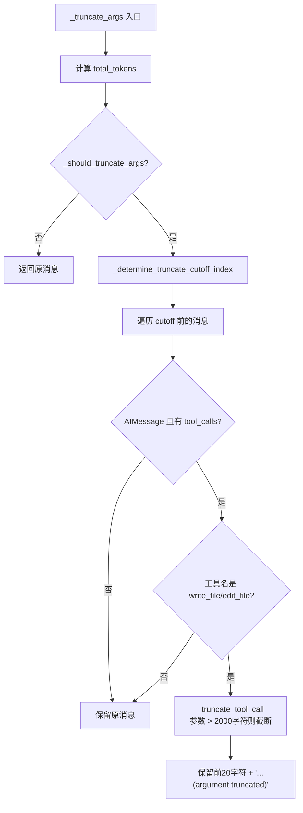

# PD-01.35 DeepAgents — SummarizationMiddleware 双轨上下文压缩与 Agent 自主 Compact

> 文档编号：PD-01.35
> 来源：DeepAgents `libs/deepagents/deepagents/middleware/summarization.py`
> GitHub：https://github.com/langchain-ai/deepagents.git
> 问题域：PD-01 上下文管理 Context Window Management
> 状态：可复用方案

---

## 第 1 章 问题与动机

### 1.1 核心问题

Agent 在长任务中持续积累工具调用和对话消息，token 消耗线性增长。当上下文接近模型的 `max_input_tokens` 限制时，要么触发 `ContextOverflowError` 导致任务中断，要么需要主动压缩历史以释放空间。DeepAgents 面临的具体挑战：

1. **多层 Agent 共享压缩逻辑**：主 Agent 和子 Agent（SubAgent）都需要独立的上下文管理，但应复用同一套压缩引擎
2. **工具参数膨胀**：`write_file`、`edit_file` 等工具调用携带大量代码内容，即使消息本身不多，token 也会快速膨胀
3. **压缩后历史可追溯**：被摘要替换的消息不能丢失，Agent 需要在后续任务中按需回溯完整历史
4. **Agent 自主压缩权**：除了自动触发外，Agent 应能主动判断何时压缩（如切换任务时），而非完全依赖阈值

### 1.2 DeepAgents 的解法概述

DeepAgents 通过 `SummarizationMiddleware` + `SummarizationToolMiddleware` 双中间件架构实现上下文管理：

1. **基于模型 profile 的自适应阈值**：通过 `compute_summarization_defaults()` 从模型的 `max_input_tokens` 自动计算触发阈值（85% fraction）和保留策略（10% fraction），无 profile 时降级为固定 token 数（`summarization.py:135-169`）
2. **三阶段压缩管道**：先截断大参数（truncate_args）→ 再检查是否需要摘要 → 最后执行摘要+持久化，每阶段独立可控（`summarization.py:855-922`）
3. **后端持久化 offload**：被摘要的消息以 Markdown 格式追加写入 `/conversation_history/{thread_id}.md`，Agent 可通过 `read_file` 回溯（`summarization.py:683-755`）
4. **compact_conversation 工具**：`SummarizationToolMiddleware` 暴露一个工具让 Agent 主动触发压缩，50% 阈值门控防止过早压缩（`summarization.py:1020-1285`）
5. **PatchToolCallsMiddleware 悬挂修复**：压缩可能导致 AIMessage 的 tool_calls 与 ToolMessage 分离，专用中间件自动补全悬挂调用（`patch_tool_calls.py:11-44`）

### 1.3 设计思想

| 设计原则 | 具体实现 | 理由 | 替代方案 |
|----------|----------|------|----------|
| 中间件透明注入 | `wrap_model_call` 拦截请求，修改 messages 后传递给 handler | 节点代码无需感知压缩逻辑，关注点分离 | 在 graph node 中硬编码压缩 |
| 事件驱动状态追踪 | `_summarization_event` 存储 cutoff_index + summary_message，不修改 LangGraph state 中的原始 messages | 保持 state 不可变性，支持链式摘要 | 直接修改 state.messages |
| 双轨压缩入口 | 自动触发（wrap_model_call）+ 手动触发（compact_conversation tool） | 自动保底 + Agent 自主决策，覆盖所有场景 | 仅自动触发 |
| 渐进式降级 | 有 profile 用 fraction，无 profile 用固定 token/message 数 | 适配不同 LLM 提供商 | 强制要求 profile |
| 参数截断前置 | 在摘要前先截断 write_file/edit_file 的大参数 | 减少摘要 LLM 的输入量，降低成本 | 不截断直接摘要 |

---

## 第 2 章 源码实现分析

### 2.1 架构概览

DeepAgents 的上下文管理由三个中间件协同完成，在 `create_deep_agent()` 中按固定顺序注册到中间件栈：

```
┌─────────────────────────────────────────────────────────────────┐
│                    create_deep_agent()                          │
│  middleware stack (按注册顺序):                                   │
│                                                                 │
│  1. TodoListMiddleware                                          │
│  2. FilesystemMiddleware                                        │
│  3. SubAgentMiddleware (每个子Agent内部也有独立的压缩中间件)        │
│  4. SummarizationMiddleware  ← 自动压缩                         │
│  5. AnthropicPromptCachingMiddleware                            │
│  6. PatchToolCallsMiddleware ← 悬挂tool_call修复                 │
│                                                                 │
│  + SummarizationToolMiddleware (通过 compact_conversation 工具)   │
└─────────────────────────────────────────────────────────────────┘
         │                              │
         ▼                              ▼
┌─────────────────┐          ┌─────────────────────┐
│  Backend 持久化  │          │  LLM 摘要生成        │
│  /conversation_  │          │  (复用主模型或指定    │
│  history/*.md    │          │   摘要模型)           │
└─────────────────┘          └─────────────────────┘
```

子 Agent 的中间件栈独立构建（`graph.py:199-212`），每个子 Agent 拥有自己的 `SummarizationMiddleware` 实例，参数通过 `compute_summarization_defaults(subagent_model)` 独立计算。

### 2.2 核心实现

#### 2.2.1 自适应阈值计算



对应源码 `libs/deepagents/deepagents/middleware/summarization.py:135-169`：

```python
def compute_summarization_defaults(model: BaseChatModel) -> SummarizationDefaults:
    has_profile = (
        model.profile is not None
        and isinstance(model.profile, dict)
        and "max_input_tokens" in model.profile
        and isinstance(model.profile["max_input_tokens"], int)
    )

    if has_profile:
        return {
            "trigger": ("fraction", 0.85),
            "keep": ("fraction", 0.10),
            "truncate_args_settings": {
                "trigger": ("fraction", 0.85),
                "keep": ("fraction", 0.10),
            },
        }
    return {
        "trigger": ("tokens", 170000),
        "keep": ("messages", 6),
        "truncate_args_settings": {
            "trigger": ("messages", 20),
            "keep": ("messages", 20),
        },
    }
```

#### 2.2.2 三阶段 wrap_model_call 管道



对应源码 `libs/deepagents/deepagents/middleware/summarization.py:833-922`：

```python
def wrap_model_call(
    self, request: ModelRequest, handler: Callable[[ModelRequest], ModelResponse],
) -> ModelResponse | ExtendedModelResponse:
    effective_messages = self._get_effective_messages(request)

    # Step 1: Truncate args if configured
    truncated_messages, _ = self._truncate_args(
        effective_messages, request.system_message, request.tools,
    )

    # Step 2: Check if summarization should happen
    counted_messages = (
        [request.system_message, *truncated_messages]
        if request.system_message is not None else truncated_messages
    )
    try:
        total_tokens = self.token_counter(counted_messages, tools=request.tools)
    except TypeError:
        total_tokens = self.token_counter(counted_messages)
    should_summarize = self._should_summarize(truncated_messages, total_tokens)

    if not should_summarize:
        try:
            return handler(request.override(messages=truncated_messages))
        except ContextOverflowError:
            pass  # Fallback to summarization on context overflow

    # Step 3: Perform summarization
    cutoff_index = self._determine_cutoff_index(truncated_messages)
    messages_to_summarize, preserved_messages = self._partition_messages(
        truncated_messages, cutoff_index
    )
    backend = self._get_backend(request.state, request.runtime)
    file_path = self._offload_to_backend(backend, messages_to_summarize)
    summary = self._create_summary(messages_to_summarize)
    new_messages = self._build_new_messages_with_path(summary, file_path)

    previous_event = request.state.get("_summarization_event")
    state_cutoff_index = self._compute_state_cutoff(previous_event, cutoff_index)
    new_event: SummarizationEvent = {
        "cutoff_index": state_cutoff_index,
        "summary_message": new_messages[0],
        "file_path": file_path,
    }
    modified_messages = [*new_messages, *preserved_messages]
    response = handler(request.override(messages=modified_messages))
    return ExtendedModelResponse(
        model_response=response,
        command=Command(update={"_summarization_event": new_event}),
    )
```

#### 2.2.3 工具参数截断



对应源码 `libs/deepagents/deepagents/middleware/summarization.py:594-681`：

```python
def _truncate_tool_call(self, tool_call: dict[str, Any]) -> dict[str, Any]:
    args = tool_call.get("args", {})
    truncated_args = {}
    modified = False
    for key, value in args.items():
        if isinstance(value, str) and len(value) > self._max_arg_length:
            truncated_args[key] = value[:20] + self._truncation_text
            modified = True
        else:
            truncated_args[key] = value
    if modified:
        return {**tool_call, "args": truncated_args}
    return tool_call
```

### 2.3 实现细节

**链式摘要的 cutoff 累加**：当发生多次摘要时，`_compute_state_cutoff` 将有效列表中的 cutoff 转换为绝对 state 索引（`summarization.py:487-513`）。公式为 `prior_cutoff + effective_cutoff - 1`，减 1 是因为有效列表的 index 0 是 summary message 而非真实 state 消息。

**后端持久化 offload**：每次摘要将被裁剪的消息转为 Markdown 格式，以 `## Summarized at {ISO timestamp}` 为节标题追加到 `/conversation_history/{thread_id}.md`。使用 `download_files()` 而非 `read()` 读取已有内容，因为 `read()` 返回带行号的内容（供 LLM 消费），而 `edit()` 需要原始内容（`summarization.py:714-717`）。

**摘要消息标记**：摘要 HumanMessage 通过 `additional_kwargs={"lc_source": "summarization"}` 标记，链式摘要时 `_filter_summary_messages` 过滤掉旧摘要消息避免重复存储（`summarization.py:367-397`）。

**ContextOverflowError 降级**：即使 `_should_summarize` 返回 False，如果 handler 抛出 `ContextOverflowError`，也会降级到摘要流程（`summarization.py:876-878`）。这是一个关键的容错设计——token 估算可能不精确，实际调用时才发现超限。

**异步并行优化**：在 `awrap_model_call` 中，offload 和 summary 生成通过 `asyncio.gather` 并行执行（`summarization.py:983-986`），因为两者互不依赖。

**compact_conversation 50% 门控**：Agent 调用 compact 工具时，`_is_eligible_for_compaction` 检查当前 token 是否超过触发阈值的 50%（`summarization.py:1194-1217`），防止在对话很短时浪费 LLM 调用。


---

## 第 3 章 迁移指南

### 3.1 迁移清单

**阶段 1：基础摘要能力**
- [ ] 实现 `ContextSize` 类型：`("fraction", float) | ("tokens", int) | ("messages", int)`
- [ ] 实现 `compute_summarization_defaults(model)` 根据模型 profile 自动计算阈值
- [ ] 实现 `_should_summarize()` 判断是否触发摘要
- [ ] 实现 `_determine_cutoff_index()` 计算保留边界
- [ ] 实现 `_partition_messages()` 分割待摘要和保留消息
- [ ] 实现 `_create_summary()` 调用 LLM 生成摘要

**阶段 2：参数截断**
- [ ] 实现 `_truncate_tool_call()` 截断大参数（write_file/edit_file）
- [ ] 实现 `_should_truncate_args()` + `_determine_truncate_cutoff_index()` 控制截断范围
- [ ] 配置 `max_arg_length`（默认 2000）和 `truncation_text`

**阶段 3：持久化 offload**
- [ ] 实现 `_offload_to_backend()` 将被摘要消息写入后端存储
- [ ] 实现 `_filter_summary_messages()` 过滤旧摘要避免重复存储
- [ ] 实现 `_build_new_messages_with_path()` 在摘要中引用存储路径

**阶段 4：Agent 自主压缩**
- [ ] 实现 `compact_conversation` 工具（StructuredTool）
- [ ] 实现 50% 门控（`_is_eligible_for_compaction`）
- [ ] 注入 system prompt 提示 Agent 何时使用 compact 工具

### 3.2 适配代码模板

以下是一个可独立运行的简化版 SummarizationMiddleware，不依赖 LangChain 框架：

```python
from dataclasses import dataclass, field
from typing import Any, Callable, Literal

ContextSize = tuple[Literal["fraction", "tokens", "messages"], float | int]


@dataclass
class SummarizationConfig:
    """上下文压缩配置，从模型 profile 自动计算。"""
    trigger: ContextSize = ("fraction", 0.85)
    keep: ContextSize = ("fraction", 0.10)
    max_arg_length: int = 2000
    truncation_text: str = "...(argument truncated)"

    @classmethod
    def from_model_profile(cls, max_input_tokens: int | None) -> "SummarizationConfig":
        if max_input_tokens is not None:
            return cls(
                trigger=("fraction", 0.85),
                keep=("fraction", 0.10),
            )
        return cls(
            trigger=("tokens", 170000),
            keep=("messages", 6),
        )


@dataclass
class SummarizationEvent:
    """追踪摘要状态，支持链式摘要。"""
    cutoff_index: int
    summary_text: str
    file_path: str | None = None


class ContextManager:
    """双轨上下文管理器：自动压缩 + Agent 主动 compact。"""

    def __init__(
        self,
        config: SummarizationConfig,
        token_counter: Callable[[list[dict]], int],
        summarizer: Callable[[list[dict]], str],
        max_input_tokens: int | None = None,
    ):
        self.config = config
        self.token_counter = token_counter
        self.summarizer = summarizer
        self.max_input_tokens = max_input_tokens
        self._event: SummarizationEvent | None = None

    def _resolve_threshold(self, size: ContextSize) -> int:
        kind, value = size
        if kind == "fraction":
            if self.max_input_tokens is None:
                return 170000
            return int(self.max_input_tokens * value)
        if kind == "tokens":
            return int(value)
        return int(value)  # messages — 由调用方处理

    def should_summarize(self, messages: list[dict]) -> bool:
        kind, value = self.config.trigger
        if kind == "messages":
            return len(messages) >= int(value)
        threshold = self._resolve_threshold(self.config.trigger)
        return self.token_counter(messages) >= threshold

    def truncate_tool_args(self, messages: list[dict]) -> list[dict]:
        """截断旧消息中 write_file/edit_file 的大参数。"""
        result = []
        for msg in messages:
            if msg.get("role") == "assistant" and "tool_calls" in msg:
                new_calls = []
                for tc in msg["tool_calls"]:
                    if tc["name"] in ("write_file", "edit_file"):
                        args = {
                            k: (v[:20] + self.config.truncation_text
                                 if isinstance(v, str) and len(v) > self.config.max_arg_length
                                 else v)
                            for k, v in tc.get("args", {}).items()
                        }
                        new_calls.append({**tc, "args": args})
                    else:
                        new_calls.append(tc)
                result.append({**msg, "tool_calls": new_calls})
            else:
                result.append(msg)
        return result

    def compress(self, messages: list[dict]) -> tuple[list[dict], SummarizationEvent]:
        """执行压缩，返回压缩后消息和事件。"""
        # 1. 截断大参数
        truncated = self.truncate_tool_args(messages)
        # 2. 计算 cutoff
        keep_kind, keep_value = self.config.keep
        if keep_kind == "messages":
            cutoff = max(0, len(truncated) - int(keep_value))
        else:
            cutoff = max(0, len(truncated) - 6)  # fallback
        if cutoff == 0:
            return truncated, self._event  # type: ignore
        # 3. 分割
        to_summarize = truncated[:cutoff]
        preserved = truncated[cutoff:]
        # 4. 生成摘要
        summary = self.summarizer(to_summarize)
        # 5. 构建事件
        state_cutoff = cutoff
        if self._event:
            state_cutoff = self._event.cutoff_index + cutoff - 1
        event = SummarizationEvent(cutoff_index=state_cutoff, summary_text=summary)
        self._event = event
        # 6. 返回压缩后消息
        summary_msg = {"role": "user", "content": f"[Summary]\n{summary}"}
        return [summary_msg, *preserved], event
```

### 3.3 适用场景

| 场景 | 适用度 | 说明 |
|------|--------|------|
| 长对话 Agent（编码助手、研究助手） | ⭐⭐⭐ | 核心场景，fraction 触发 + 后端 offload 完美匹配 |
| 多子 Agent 编排系统 | ⭐⭐⭐ | 每个子 Agent 独立压缩实例，互不干扰 |
| 工具密集型 Agent（大量文件读写） | ⭐⭐⭐ | 参数截断前置大幅减少 token 消耗 |
| 短对话 chatbot | ⭐ | 对话通常不会触及阈值，overhead 不值得 |
| 流式输出场景 | ⭐⭐ | 支持但摘要生成会引入延迟 |

---

## 第 4 章 测试用例

```python
import pytest
from dataclasses import dataclass
from typing import Any


# 模拟 DeepAgents 的核心类型
class MockMessage:
    def __init__(self, role: str, content: str, tool_calls=None, additional_kwargs=None):
        self.role = role
        self.content = content
        self.tool_calls = tool_calls or []
        self.additional_kwargs = additional_kwargs or {}
        self.type = "ai" if role == "assistant" else role


class TestComputeSummarizationDefaults:
    """测试 compute_summarization_defaults 的自适应阈值计算。"""

    def test_with_profile_returns_fraction(self):
        """有 max_input_tokens 时返回 fraction 策略。"""
        config = SummarizationConfig.from_model_profile(max_input_tokens=200000)
        assert config.trigger == ("fraction", 0.85)
        assert config.keep == ("fraction", 0.10)

    def test_without_profile_returns_fixed(self):
        """无 profile 时降级为固定 token 数。"""
        config = SummarizationConfig.from_model_profile(max_input_tokens=None)
        assert config.trigger == ("tokens", 170000)
        assert config.keep == ("messages", 6)


class TestTruncateToolArgs:
    """测试工具参数截断逻辑。"""

    def test_truncates_large_write_file_args(self):
        """write_file 参数超过 max_length 时被截断。"""
        mgr = ContextManager(
            config=SummarizationConfig(max_arg_length=100),
            token_counter=lambda msgs: sum(len(str(m)) for m in msgs),
            summarizer=lambda msgs: "summary",
        )
        messages = [{
            "role": "assistant",
            "tool_calls": [{
                "name": "write_file",
                "args": {"file_path": "/test.py", "content": "x" * 200},
            }],
        }]
        result = mgr.truncate_tool_args(messages)
        content = result[0]["tool_calls"][0]["args"]["content"]
        assert len(content) < 200
        assert "truncated" in content

    def test_preserves_small_args(self):
        """小参数不被截断。"""
        mgr = ContextManager(
            config=SummarizationConfig(max_arg_length=2000),
            token_counter=lambda msgs: 0,
            summarizer=lambda msgs: "summary",
        )
        messages = [{
            "role": "assistant",
            "tool_calls": [{
                "name": "write_file",
                "args": {"content": "short"},
            }],
        }]
        result = mgr.truncate_tool_args(messages)
        assert result[0]["tool_calls"][0]["args"]["content"] == "short"

    def test_ignores_non_file_tools(self):
        """非 write_file/edit_file 工具不截断。"""
        mgr = ContextManager(
            config=SummarizationConfig(max_arg_length=10),
            token_counter=lambda msgs: 0,
            summarizer=lambda msgs: "summary",
        )
        messages = [{
            "role": "assistant",
            "tool_calls": [{
                "name": "web_search",
                "args": {"query": "x" * 200},
            }],
        }]
        result = mgr.truncate_tool_args(messages)
        assert result[0]["tool_calls"][0]["args"]["query"] == "x" * 200


class TestShouldSummarize:
    """测试摘要触发判断。"""

    def test_fraction_trigger(self):
        mgr = ContextManager(
            config=SummarizationConfig(trigger=("fraction", 0.85)),
            token_counter=lambda msgs: 170001,
            summarizer=lambda msgs: "summary",
            max_input_tokens=200000,
        )
        assert mgr.should_summarize([{}]) is True

    def test_below_threshold_no_trigger(self):
        mgr = ContextManager(
            config=SummarizationConfig(trigger=("fraction", 0.85)),
            token_counter=lambda msgs: 100000,
            summarizer=lambda msgs: "summary",
            max_input_tokens=200000,
        )
        assert mgr.should_summarize([{}]) is False

    def test_message_count_trigger(self):
        mgr = ContextManager(
            config=SummarizationConfig(trigger=("messages", 10)),
            token_counter=lambda msgs: 0,
            summarizer=lambda msgs: "summary",
        )
        assert mgr.should_summarize([{}] * 10) is True
        assert mgr.should_summarize([{}] * 5) is False


class TestCompress:
    """测试压缩流程。"""

    def test_compress_produces_summary_message(self):
        mgr = ContextManager(
            config=SummarizationConfig(keep=("messages", 2)),
            token_counter=lambda msgs: 0,
            summarizer=lambda msgs: f"Summarized {len(msgs)} messages",
        )
        messages = [{"role": "user", "content": f"msg{i}"} for i in range(5)]
        result, event = mgr.compress(messages)
        assert result[0]["content"].startswith("[Summary]")
        assert len(result) == 3  # 1 summary + 2 preserved
        assert event.cutoff_index == 3

    def test_chained_summarization_accumulates_cutoff(self):
        """链式摘要时 cutoff_index 正确累加。"""
        mgr = ContextManager(
            config=SummarizationConfig(keep=("messages", 2)),
            token_counter=lambda msgs: 0,
            summarizer=lambda msgs: "summary",
        )
        # 第一次压缩
        msgs1 = [{"role": "user", "content": f"msg{i}"} for i in range(5)]
        _, event1 = mgr.compress(msgs1)
        assert event1.cutoff_index == 3
        # 第二次压缩（模拟更多消息）
        msgs2 = [{"role": "user", "content": f"msg{i}"} for i in range(5)]
        _, event2 = mgr.compress(msgs2)
        # cutoff = prior(3) + new(3) - 1 = 5
        assert event2.cutoff_index == 5
```


---

## 第 5 章 跨域关联

| 关联域 | 关系类型 | 说明 |
|--------|----------|------|
| PD-03 容错与重试 | 协同 | `ContextOverflowError` 捕获后降级到摘要流程，是容错的一种形式；offload 失败时 `file_path=None` 非致命，摘要仍继续 |
| PD-04 工具系统 | 依赖 | `compact_conversation` 作为 StructuredTool 注册，依赖工具系统的注册和调用机制；参数截断针对 `write_file`/`edit_file` 工具 |
| PD-05 沙箱隔离 | 协同 | CLI 模式下 conversation_history 路由到独立的 `FilesystemBackend(virtual_mode=True)` 临时目录，与工作目录隔离 |
| PD-06 记忆持久化 | 协同 | offload 的 Markdown 文件是一种持久化记忆，Agent 可通过 `read_file` 回溯；`MemoryMiddleware` 在中间件栈中位于 `SummarizationMiddleware` 之前 |
| PD-09 Human-in-the-Loop | 协同 | `compact_conversation` 工具可配置为需要人工审批（`REQUIRE_COMPACT_TOOL_APPROVAL=True`），CLI 中通过 `_add_interrupt_on` 注册 |
| PD-10 中间件管道 | 依赖 | 整个压缩逻辑通过 `AgentMiddleware.wrap_model_call` 实现，依赖中间件管道的执行顺序（`PatchToolCallsMiddleware` 必须在 `SummarizationMiddleware` 之后） |
| PD-11 可观测性 | 协同 | CLI 的 `_handle_compact` 计算并展示 token 节省百分比（`tokens_before → tokens_after`），`_format_token_count` 格式化为 K/M 单位 |

---

## 第 6 章 来源文件索引

| 文件 | 行范围 | 关键实现 |
|------|--------|----------|
| `libs/deepagents/deepagents/middleware/summarization.py` | L1-1320 | 核心：SummarizationMiddleware + SummarizationToolMiddleware 完整实现 |
| `libs/deepagents/deepagents/middleware/summarization.py` | L135-169 | `compute_summarization_defaults` 自适应阈值计算 |
| `libs/deepagents/deepagents/middleware/summarization.py` | L276-298 | `_should_summarize` / `_determine_cutoff_index` / `_partition_messages` 委托 |
| `libs/deepagents/deepagents/middleware/summarization.py` | L487-513 | `_compute_state_cutoff` 链式摘要 cutoff 累加 |
| `libs/deepagents/deepagents/middleware/summarization.py` | L515-681 | 参数截断：`_should_truncate_args` / `_truncate_tool_call` / `_truncate_args` |
| `libs/deepagents/deepagents/middleware/summarization.py` | L683-831 | 后端持久化 offload（sync + async） |
| `libs/deepagents/deepagents/middleware/summarization.py` | L833-1013 | `wrap_model_call` / `awrap_model_call` 三阶段管道 |
| `libs/deepagents/deepagents/middleware/summarization.py` | L1020-1285 | `SummarizationToolMiddleware` compact_conversation 工具 |
| `libs/deepagents/deepagents/middleware/summarization.py` | L1194-1217 | `_is_eligible_for_compaction` 50% 门控 |
| `libs/deepagents/deepagents/graph.py` | L85-324 | `create_deep_agent` 中间件栈组装，子 Agent 独立压缩实例 |
| `libs/deepagents/deepagents/graph.py` | L193-212 | 子 Agent 中间件栈构建（独立 SummarizationMiddleware） |
| `libs/deepagents/deepagents/graph.py` | L270-296 | 主 Agent 中间件栈注册顺序 |
| `libs/deepagents/deepagents/middleware/patch_tool_calls.py` | L11-44 | `PatchToolCallsMiddleware` 悬挂 tool_call 修复 |
| `libs/deepagents/deepagents/middleware/_utils.py` | L1-24 | `append_to_system_message` 工具函数 |
| `libs/cli/deepagents_cli/agent.py` | L388-597 | `create_cli_agent` CLI 层 Agent 创建，conversation_history 路由 |
| `libs/cli/deepagents_cli/agent.py` | L46-47 | `REQUIRE_COMPACT_TOOL_APPROVAL` 配置 |
| `libs/cli/deepagents_cli/agent.py` | L560-576 | CompositeBackend 路由：conversation_history → 独立临时目录 |
| `libs/cli/deepagents_cli/app.py` | L1293-1459 | `_handle_compact` CLI 手动 compact 实现，含 token 节省统计 |
| `libs/cli/deepagents_cli/app.py` | L106-119 | `_format_token_count` K/M 格式化 |

---

## 第 7 章 横向对比维度

> **重要：** 本章用于自动填充 Butcher Wiki 的横向对比表。
> 必须严格按以下 JSON 格式输出，放在 `comparison_data` 代码块中。

```json comparison_data
{
  "project": "DeepAgents",
  "dimensions": {
    "估算方式": "count_tokens_approximately 近似估算，支持 tools 参数计入",
    "压缩策略": "LLM 摘要 + 工具参数截断双管齐下",
    "触发机制": "fraction 0.85 自适应 + ContextOverflowError 降级兜底",
    "实现位置": "AgentMiddleware.wrap_model_call 中间件拦截",
    "容错设计": "offload 失败非致命，ContextOverflowError 降级到摘要",
    "保留策略": "fraction 0.10 保留最近消息，无 profile 时 keep 6 条",
    "AI/Tool消息对保护": "PatchToolCallsMiddleware 自动补全悬挂 tool_call",
    "工具输出压缩": "write_file/edit_file 参数 >2000字符截断为前20字符+标记",
    "子Agent隔离": "每个子Agent独立 SummarizationMiddleware 实例和阈值",
    "摘要模型选择": "复用主模型，不单独指定摘要模型",
    "增量摘要与全量摘要切换": "仅全量摘要，链式摘要时过滤旧 summary 避免重复",
    "Agent审查工作流": "compact_conversation 可配置 HITL 审批",
    "压缩效果验证": "CLI 层计算并展示 token 节省百分比"
  }
}
```

### 域元数据补充

```json domain_metadata
{
  "solution_summary": "DeepAgents 用 SummarizationMiddleware 三阶段管道（参数截断→阈值检查→LLM摘要+offload）+ compact_conversation 工具实现双轨上下文压缩",
  "description": "中间件拦截模式下的自动+手动双轨压缩，支持多 Agent 独立实例",
  "sub_problems": [
    "Agent 自主压缩门控：compact 工具需要 50% 阈值门控防止过早压缩浪费 LLM 调用",
    "链式摘要 cutoff 累加：多次摘要后有效列表与 state 列表的索引偏移需正确转换",
    "摘要消息标记与过滤：链式摘要时需标记并过滤旧 summary 消息避免重复 offload"
  ],
  "best_practices": [
    "参数截断前置于摘要：先截断大工具参数再做 LLM 摘要，减少摘要模型输入量和成本",
    "ContextOverflowError 降级兜底：即使估算未触发阈值，实际调用超限时自动降级到摘要流程",
    "offload 与摘要并行：两者互不依赖，asyncio.gather 并行执行减少延迟"
  ]
}
```

