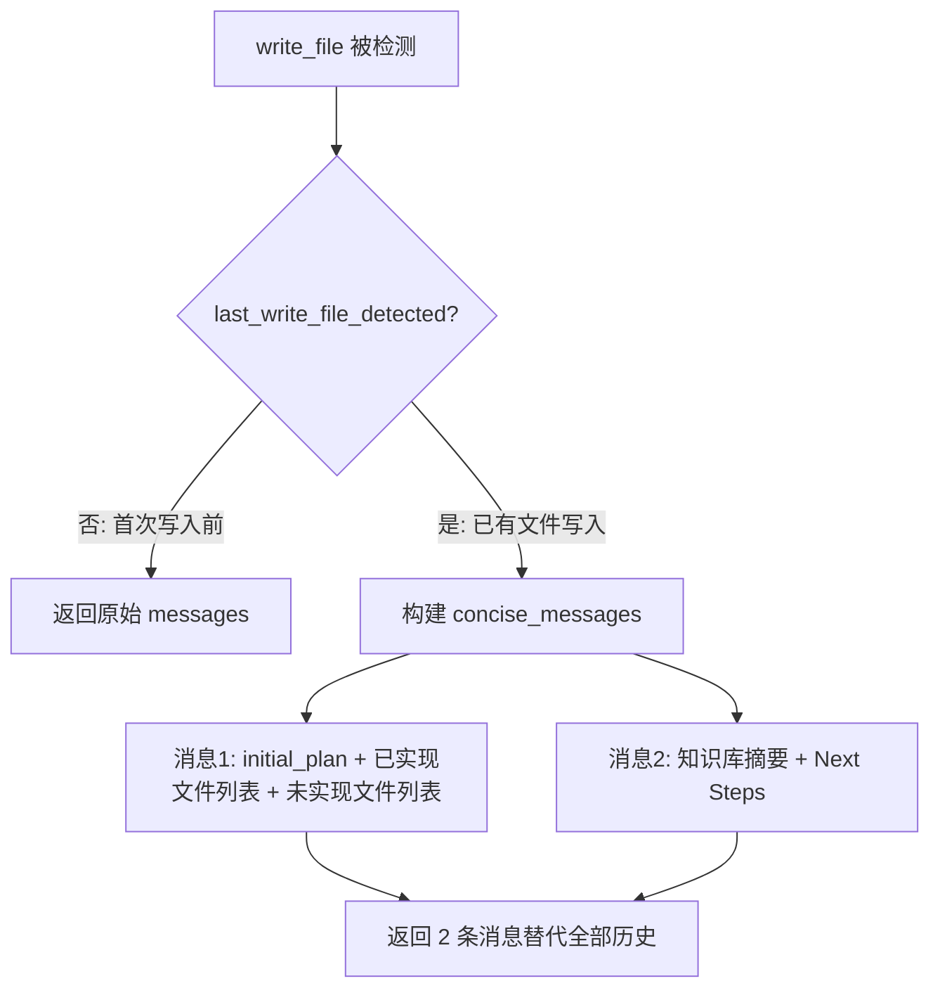
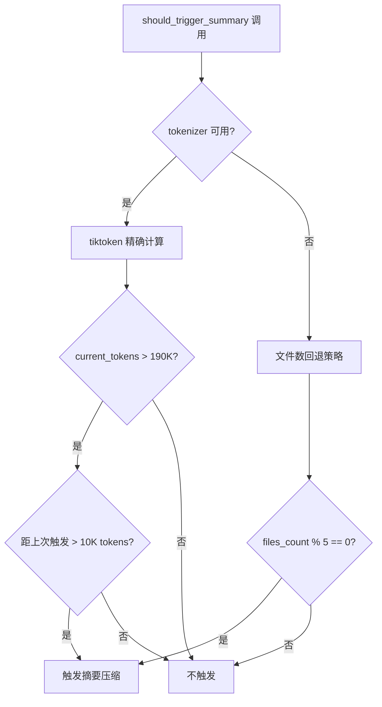

# PD-01.06 DeepCode — Clean-Slate 上下文管理与 Token 双轨触发

> 文档编号：PD-01.06
> 来源：DeepCode `workflows/agents/memory_agent_concise.py`, `workflows/agents/code_implementation_agent.py`
> GitHub：https://github.com/HKUDS/DeepCode.git
> 问题域：PD-01 上下文管理 Context Window Management
> 状态：可复用方案

---

## 第 1 章 问题与动机

### 1.1 核心问题

在长时间运行的代码生成工作流中，LLM 的上下文窗口会被大量工具调用结果、历史对话和中间分析内容填满。DeepCode 面临的具体挑战是：一个论文复现任务可能需要实现 15-30 个代码文件，每个文件的实现过程涉及多次 `read_file`、`search_code`、`write_file` 等工具调用，对话历史会迅速膨胀到 200K token 上限。

传统的滑动窗口方案（保留最近 N 轮对话）在代码生成场景中效果不佳，因为：
- 旧文件的实现细节对新文件的依赖分析仍然重要
- 简单截断可能丢失关键的架构决策和接口定义
- 工具调用结果（如文件内容）占据大量 token 但复用价值低

### 1.2 DeepCode 的解法概述

DeepCode 采用 **Clean-Slate + Knowledge Base** 双层策略：

1. **Clean-Slate 清除**：每次 `write_file` 完成后，清除全部历史对话，仅保留 `system_prompt` + `initial_plan` + 知识库摘要（`memory_agent_concise.py:1546-1569`）
2. **LLM 驱动的代码摘要**：每次写入文件后，调用 LLM 生成结构化摘要（Public Interface / Dependencies / Implementation Notes），追加到 `implement_code_summary.md`（`memory_agent_concise.py:994-1061`）
3. **Token 双轨触发**：主路径用 tiktoken 精确计算 token 数，在接近 200K 上限时触发；回退路径按文件数触发（`code_implementation_agent.py:575-675`）
4. **read_file 拦截优化**：已实现文件的 `read_file` 调用被拦截，优先返回摘要而非原始文件内容（`code_implementation_agent.py:280-409`）
5. **Essential Tools 过滤**：仅记录 8 种关键工具的结果，忽略其他工具调用（`memory_agent_concise.py:1516-1534`）

### 1.3 设计思想

| 设计原则 | 具体实现 | 理由 | 替代方案 |
|----------|----------|------|----------|
| 激进清除优于渐进压缩 | write_file 后清除全部历史 | 代码生成是文件级独立任务，旧对话价值极低 | 滑动窗口保留最近 N 轮 |
| 知识外置持久化 | 摘要写入 .md 文件而非内存 | 跨轮次持久化，不受上下文清除影响 | 内存中维护摘要字典 |
| 精确估算 + 粗略回退 | tiktoken 主路径 + 字符数/4 回退 | tiktoken 不可用时仍能工作 | 仅用字符数估算 |
| 读取拦截减少冗余 | read_file → read_code_mem 重定向 | 已实现文件的摘要比原文更紧凑 | 每次都读原始文件 |
| 工具结果选择性记录 | 仅记录 8 种 essential tools | 减少无关工具结果的 token 消耗 | 记录所有工具结果 |

---

## 第 2 章 源码实现分析

### 2.1 架构概览

DeepCode 的上下文管理由三个组件协作完成：

```
┌─────────────────────────────────────────────────────────────┐
│                CodeImplementationWorkflow                     │
│  (workflows/code_implementation_workflow.py)                  │
│                                                               │
│  ┌──────────────────┐    ┌──────────────────────────┐        │
│  │ CodeImplementation│    │   ConciseMemoryAgent     │        │
│  │     Agent         │◄──►│                          │        │
│  │                   │    │ • clean-slate 清除        │        │
│  │ • token 计算      │    │ • 知识库读写              │        │
│  │ • write_file 追踪 │    │ • 消息重构                │        │
│  │ • read_file 拦截  │    │ • 文件进度追踪            │        │
│  └──────────────────┘    └──────────────────────────┘        │
│           │                         │                         │
│           ▼                         ▼                         │
│  ┌──────────────────┐    ┌──────────────────────────┐        │
│  │   MCP Agent       │    │ implement_code_summary.md│        │
│  │ (工具执行层)       │    │ (外置知识库文件)          │        │
│  └──────────────────┘    └──────────────────────────┘        │
└─────────────────────────────────────────────────────────────┘
```

### 2.2 核心实现

#### 2.2.1 Clean-Slate 消息重构



对应源码 `workflows/agents/memory_agent_concise.py:1546-1679`：

```python
def create_concise_messages(
    self,
    system_prompt: str,
    messages: List[Dict[str, Any]],
    files_implemented: int,
) -> List[Dict[str, Any]]:
    if not self.last_write_file_detected:
        # 首次 write_file 前，使用正常对话流
        return messages

    concise_messages = []

    # 消息1: initial_plan + 文件进度
    initial_plan_message = {
        "role": "user",
        "content": f"""**Task: Implement code based on the following reproduction plan**
**Code Reproduction Plan:**
{self.initial_plan}
**All Previously Implemented Files:**
{implemented_files_list}
**Remaining Files to Implement:**
{unimplemented_files_list}
**IMPORTANT:** If the remaining files list shows "All files implemented!",
you MUST reply with "All files implemented" to complete the task.""",
    }
    concise_messages.append(initial_plan_message)

    # 消息2: 知识库 + 开发指引
    knowledge_base_message = {
        "role": "user",
        "content": f"""**Below is the Knowledge Base of the LATEST implemented code file:**
{self._read_code_knowledge_base()}
**Development Cycle - START HERE:**
...""",
    }
    concise_messages.append(knowledge_base_message)
    return concise_messages
```

#### 2.2.2 Token 双轨触发机制



对应源码 `workflows/agents/code_implementation_agent.py:575-675`：

```python
def calculate_messages_token_count(self, messages: List[Dict]) -> int:
    if not self.tokenizer:
        # 回退: 字符数 / 4 粗略估算
        total_chars = sum(len(str(msg.get("content", ""))) for msg in messages)
        return total_chars // 4

    total_tokens = 0
    for message in messages:
        content = str(message.get("content", ""))
        role = message.get("role", "")
        if content:
            content_tokens = len(
                self.tokenizer.encode(content, disallowed_special=())
            )
            total_tokens += content_tokens
        role_tokens = len(self.tokenizer.encode(role, disallowed_special=()))
        total_tokens += role_tokens + 4  # 消息格式额外 token
    return total_tokens

def should_trigger_summary_by_tokens(self, messages: List[Dict]) -> bool:
    current_token_count = self.calculate_messages_token_count(messages)
    should_trigger = (
        current_token_count > self.summary_trigger_tokens  # 190K
        and current_token_count > self.last_summary_token_count + 10000
    )
    return should_trigger
```

### 2.3 实现细节

**read_file 拦截与摘要重定向**（`code_implementation_agent.py:280-409`）：

当 `CodeImplementationAgent` 检测到 `read_file` 调用时，先通过 `read_code_mem` MCP 工具检查该文件是否已有摘要。如果摘要存在，直接返回摘要内容而非原始文件，节省大量 token。

**Essential Tools 白名单**（`memory_agent_concise.py:1516-1534`）：

```python
essential_tools = [
    "read_code_mem",      # 读取代码摘要
    "read_file",          # 读取文件内容
    "write_file",         # 写入文件（触发清除）
    "execute_python",     # Python 执行
    "execute_bash",       # Bash 执行
    "search_code",        # 代码搜索
    "search_reference_code",  # 参考代码搜索
    "get_file_structure",     # 文件结构
]
```

只有这 8 种工具的调用结果会被记录到 `current_round_tool_results`，其他工具调用被静默忽略。

**LLM 驱动的代码摘要生成**（`memory_agent_concise.py:994-1061`）：

每次 `write_file` 成功后，`create_code_implementation_summary` 方法调用 LLM 生成结构化摘要，包含 Core Purpose、Public Interface、Internal Dependencies、External Dependencies、Implementation Notes 五个部分，追加到 `implement_code_summary.md` 文件。Next Steps 信息仅存储在内存中，不写入文件。

**紧急消息裁剪**（`code_implementation_workflow.py:451-460`）：

当消息数超过 50 条时，强制触发 concise memory optimization，防止上下文溢出。

---

## 第 3 章 迁移指南

### 3.1 迁移清单

**阶段 1：基础 Token 计算**
- [ ] 安装 tiktoken：`pip install tiktoken`
- [ ] 实现 `calculate_messages_token_count()` 方法
- [ ] 配置 `max_context_tokens`（根据目标模型设置）
- [ ] 实现字符数/4 的回退估算

**阶段 2：Clean-Slate 机制**
- [ ] 实现 `write_file` 检测逻辑（监听工具调用事件）
- [ ] 实现 `create_concise_messages()` 消息重构
- [ ] 设计外置知识库文件格式（如 `implement_code_summary.md`）
- [ ] 实现知识库的追加写入和读取

**阶段 3：摘要生成**
- [ ] 设计摘要 prompt 模板（参考 `_create_code_summary_prompt`）
- [ ] 实现 LLM 调用生成摘要
- [ ] 实现摘要的结构化解析（`_extract_summary_sections`）
- [ ] 实现 read_file 拦截和摘要重定向（可选）

### 3.2 适配代码模板

```python
import tiktoken
from typing import List, Dict, Any, Optional

class ContextManager:
    """可移植的 Clean-Slate 上下文管理器"""

    def __init__(
        self,
        max_context_tokens: int = 200000,
        token_buffer: int = 10000,
        summary_file_path: str = "./code_summary.md",
    ):
        self.max_context_tokens = max_context_tokens
        self.summary_trigger_tokens = max_context_tokens - token_buffer

        # 初始化 tokenizer（带回退）
        try:
            self.tokenizer = tiktoken.get_encoding("o200k_base")
        except Exception:
            self.tokenizer = None

        self.summary_file_path = summary_file_path
        self.initial_plan: str = ""
        self.implemented_files: List[str] = []
        self._write_detected = False

    def count_tokens(self, messages: List[Dict[str, Any]]) -> int:
        """计算消息列表的 token 数"""
        if not self.tokenizer:
            return sum(len(str(m.get("content", ""))) for m in messages) // 4

        total = 0
        for msg in messages:
            content = str(msg.get("content", ""))
            total += len(self.tokenizer.encode(content, disallowed_special=()))
            total += 4  # 消息格式开销
        return total

    def on_write_file(self, file_path: str, content: str):
        """write_file 事件回调"""
        self._write_detected = True
        if file_path not in self.implemented_files:
            self.implemented_files.append(file_path)

    def should_optimize(self, messages: List[Dict]) -> bool:
        """判断是否需要触发上下文优化"""
        return self._write_detected

    def optimize_messages(
        self, messages: List[Dict], system_prompt: str
    ) -> List[Dict]:
        """执行 Clean-Slate 优化，返回精简消息列表"""
        if not self._write_detected:
            return messages

        knowledge = self._read_knowledge_base()
        remaining = [f for f in self.all_files if f not in self.implemented_files]

        optimized = [
            {
                "role": "user",
                "content": f"Plan:\n{self.initial_plan}\n\n"
                           f"Implemented: {self.implemented_files}\n"
                           f"Remaining: {remaining}",
            },
            {
                "role": "user",
                "content": f"Knowledge Base:\n{knowledge or 'No summaries yet'}",
            },
        ]
        self._write_detected = False
        return optimized

    def _read_knowledge_base(self) -> Optional[str]:
        """读取外置知识库"""
        import os
        if os.path.exists(self.summary_file_path):
            with open(self.summary_file_path, "r") as f:
                return f.read().strip() or None
        return None
```

### 3.3 适用场景

| 场景 | 适用度 | 说明 |
|------|--------|------|
| 多文件代码生成 | ⭐⭐⭐ | 核心场景，文件级独立性高 |
| 长对话 Agent 工作流 | ⭐⭐⭐ | 工具调用密集，历史价值递减 |
| 单文件深度编辑 | ⭐ | 历史对话对当前编辑仍有价值，不宜激进清除 |
| 多轮问答 | ⭐ | 对话连贯性重要，clean-slate 会丢失上下文 |
| RAG 检索增强 | ⭐⭐ | 可借鉴知识外置思路，但检索结果需保留 |

---

## 第 4 章 测试用例

```python
import pytest
from unittest.mock import MagicMock, patch, AsyncMock
from typing import List, Dict


class TestConciseMemoryAgent:
    """测试 ConciseMemoryAgent 的核心功能"""

    def setup_method(self):
        """每个测试前初始化"""
        self.plan = "Phase 1:\n- `src/model.py`\n- `src/utils.py`\nPhase 2:\n- `src/train.py`"
        # 使用 mock logger 避免依赖
        self.logger = MagicMock()

    def test_clean_slate_not_triggered_before_write(self):
        """write_file 前不应触发 clean-slate"""
        from workflows.agents.memory_agent_concise import ConciseMemoryAgent
        agent = ConciseMemoryAgent(self.plan, self.logger)
        messages = [{"role": "user", "content": "implement model.py"}]
        result = agent.create_concise_messages("system", messages, 0)
        # 未检测到 write_file，应返回原始消息
        assert result == messages

    def test_clean_slate_triggered_after_write(self):
        """write_file 后应触发 clean-slate，返回精简消息"""
        from workflows.agents.memory_agent_concise import ConciseMemoryAgent
        agent = ConciseMemoryAgent(self.plan, self.logger)
        agent.last_write_file_detected = True
        messages = [
            {"role": "user", "content": "msg1"},
            {"role": "assistant", "content": "msg2"},
            {"role": "user", "content": "msg3"},
        ] * 10  # 30 条消息
        result = agent.create_concise_messages("system", messages, 1)
        # 应压缩为 2 条消息
        assert len(result) == 2
        assert "initial_plan" not in result[0]["content"] or self.plan[:50] in result[0]["content"]

    def test_record_tool_result_essential_only(self):
        """仅记录 essential tools 的结果"""
        from workflows.agents.memory_agent_concise import ConciseMemoryAgent
        agent = ConciseMemoryAgent(self.plan, self.logger)
        agent.record_tool_result("write_file", {"file_path": "a.py"}, "ok")
        agent.record_tool_result("unknown_tool", {"x": 1}, "ignored")
        assert len(agent.current_round_tool_results) == 1
        assert agent.current_round_tool_results[0]["tool_name"] == "write_file"

    def test_write_file_detection_sets_flags(self):
        """write_file 调用应设置清除标志"""
        from workflows.agents.memory_agent_concise import ConciseMemoryAgent
        agent = ConciseMemoryAgent(self.plan, self.logger)
        assert not agent.last_write_file_detected
        assert not agent.should_clear_memory_next
        agent.record_tool_result("write_file", {"file_path": "a.py"}, "ok")
        assert agent.last_write_file_detected
        assert agent.should_clear_memory_next

    def test_unimplemented_files_tracking(self):
        """文件进度追踪：已实现 vs 未实现"""
        from workflows.agents.memory_agent_concise import ConciseMemoryAgent
        agent = ConciseMemoryAgent(self.plan, self.logger)
        # 模拟已实现一个文件
        agent.implemented_files = ["src/model.py"]
        unimplemented = agent.get_unimplemented_files()
        # src/model.py 已实现，不应出现在未实现列表中
        assert "src/model.py" not in [f.split("/")[-1] for f in unimplemented if "model" in f]


class TestCodeImplementationAgentTokens:
    """测试 CodeImplementationAgent 的 token 计算"""

    def test_token_count_with_tiktoken(self):
        """tiktoken 可用时的精确计算"""
        from workflows.agents.code_implementation_agent import CodeImplementationAgent
        agent = CodeImplementationAgent(mcp_agent=None)
        if agent.tokenizer:
            messages = [{"role": "user", "content": "Hello world"}]
            count = agent.calculate_messages_token_count(messages)
            assert count > 0
            assert count < 100  # "Hello world" 不应超过 100 tokens

    def test_token_count_fallback(self):
        """tiktoken 不可用时的回退估算"""
        from workflows.agents.code_implementation_agent import CodeImplementationAgent
        agent = CodeImplementationAgent(mcp_agent=None)
        agent.tokenizer = None  # 强制禁用
        messages = [{"role": "user", "content": "A" * 400}]
        count = agent.calculate_messages_token_count(messages)
        assert count == 100  # 400 chars / 4 = 100

    def test_summary_trigger_by_tokens(self):
        """token 数超过阈值时触发摘要"""
        from workflows.agents.code_implementation_agent import CodeImplementationAgent
        agent = CodeImplementationAgent(mcp_agent=None)
        agent.summary_trigger_tokens = 100  # 降低阈值便于测试
        agent.last_summary_token_count = 0
        messages = [{"role": "user", "content": "x" * 500}]
        assert agent.should_trigger_summary_by_tokens(messages)

    def test_summary_not_triggered_below_threshold(self):
        """token 数未超过阈值时不触发"""
        from workflows.agents.code_implementation_agent import CodeImplementationAgent
        agent = CodeImplementationAgent(mcp_agent=None)
        agent.summary_trigger_tokens = 200000
        messages = [{"role": "user", "content": "short message"}]
        assert not agent.should_trigger_summary_by_tokens(messages)
```


---

## 第 5 章 跨域关联

| 关联域 | 关系类型 | 说明 |
|--------|----------|------|
| PD-03 容错与重试 | 协同 | Clean-Slate 清除后如果 LLM 调用失败，需要重试机制保证摘要生成不丢失；DeepCode 的 `_call_llm_for_summary` 有 3 次重试 |
| PD-04 工具系统 | 依赖 | Essential Tools 白名单依赖工具系统的注册机制；read_file 拦截需要工具层支持重定向 |
| PD-06 记忆持久化 | 协同 | `implement_code_summary.md` 是外置持久化记忆的具体实现；Clean-Slate 的可行性依赖于知识库的完整性 |
| PD-07 质量检查 | 协同 | 摘要质量直接影响后续文件实现的正确性；DeepCode 通过结构化模板（5 个 section）保证摘要质量 |
| PD-11 可观测性 | 协同 | Token 计算结果可用于成本追踪；DeepCode 记录每次 `token_count` 和 `summary_trigger` 事件 |

---

## 第 6 章 来源文件索引

| 文件 | 行范围 | 关键实现 |
|------|--------|----------|
| `workflows/agents/memory_agent_concise.py` | L27-L100 | ConciseMemoryAgent 类定义与初始化 |
| `workflows/agents/memory_agent_concise.py` | L994-L1061 | `create_code_implementation_summary` LLM 摘要生成 |
| `workflows/agents/memory_agent_concise.py` | L1516-L1534 | Essential Tools 白名单与工具结果记录 |
| `workflows/agents/memory_agent_concise.py` | L1546-L1679 | `create_concise_messages` Clean-Slate 消息重构 |
| `workflows/agents/code_implementation_agent.py` | L280-L409 | read_file 拦截与 read_code_mem 重定向 |
| `workflows/agents/code_implementation_agent.py` | L575-L675 | Token 计算与双轨触发逻辑 |
| `workflows/code_implementation_workflow.py` | L451-L460 | 紧急消息裁剪（50 条上限） |
| `prompts/code_prompts.py` | L866-L961 | CONVERSATION_SUMMARY_PROMPT 和 SLIDING_WINDOW_SYSTEM_PROMPT |

---

## 第 7 章 横向对比维度

> **重要：** 本章用于自动填充 Butcher Wiki 的横向对比表。
> 必须严格按以下 JSON 格式输出，放在 `comparison_data` 代码块中。

```json comparison_data
{
  "project": "DeepCode",
  "dimensions": {
    "估算方式": "tiktoken 精确计算 + 字符数/4 回退双轨",
    "压缩策略": "Clean-Slate 全量清除 + LLM 生成结构化代码摘要外置",
    "触发机制": "write_file 事件驱动 + 190K token 阈值 + 50 条消息硬限",
    "实现位置": "独立 ConciseMemoryAgent 类 + CodeImplementationAgent 协作",
    "容错设计": "tokenizer 不可用时回退字符估算，摘要生成 3 次重试",
    "保留策略": "仅保留 system_prompt + initial_plan + 知识库摘要，历史全清",
    "子Agent隔离": "每个文件实现周期独立，write_file 后 clean-slate 天然隔离",
    "Prompt模板化": "CONVERSATION_SUMMARY_PROMPT 外置于 code_prompts.py",
    "知识库外置": "implement_code_summary.md 文件持久化代码摘要，跨轮次可读",
    "读取拦截优化": "read_file 调用被拦截重定向到 read_code_mem 返回摘要"
  }
}
```

### 域元数据补充

```json domain_metadata
{
  "solution_summary": "DeepCode 用 ConciseMemoryAgent 实现 write_file 事件驱动的 Clean-Slate 清除，配合 LLM 生成结构化代码摘要外置到 .md 文件，实现文件级上下文隔离",
  "description": "事件驱动的激进清除策略，适用于文件级独立性高的代码生成场景",
  "sub_problems": [
    "知识库外置持久化：将压缩后的摘要写入外部文件而非仅存内存，确保跨清除周期可用",
    "读取拦截优化：对已实现文件的 read_file 调用重定向到摘要，避免重复读取原始文件消耗 token",
    "事件驱动清除：以工具调用事件（如 write_file）而非 token 阈值作为清除触发条件"
  ],
  "best_practices": [
    "Clean-Slate 适合文件级独立任务：当每个子任务（如实现一个文件）相对独立时，激进清除比渐进压缩更高效",
    "知识库外置比内存摘要更可靠：写入文件的摘要不受上下文清除影响，且可被多个 Agent 共享",
    "read_file 拦截可显著节省 token：已有摘要的文件无需重新读取原始内容"
  ]
}
```
