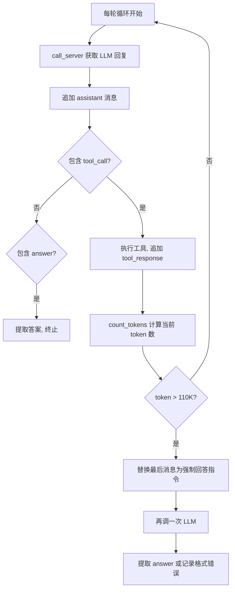
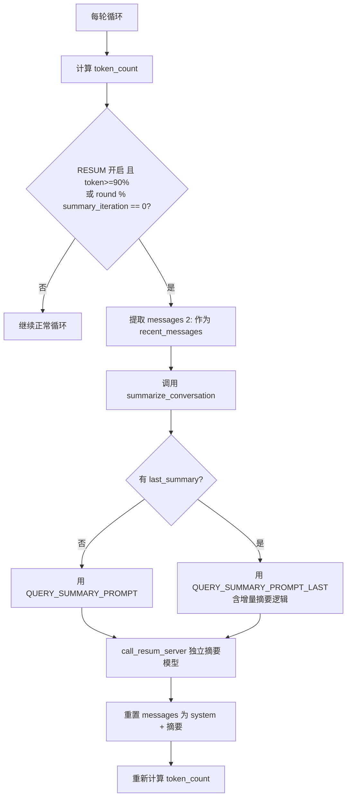
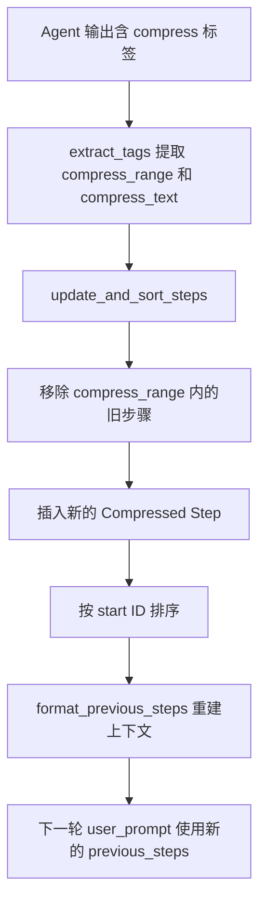

# PD-01.14 DeepResearch — 三层上下文管理：硬限强制回答 + ReSum 周期压缩 + AgentFold 步骤折叠

> 文档编号：PD-01.14
> 来源：DeepResearch `inference/react_agent.py` `WebAgent/WebResummer/src/react_agent.py` `WebAgent/AgentFold/infer.py`
> GitHub：https://github.com/Alibaba-NLP/DeepResearch
> 问题域：PD-01 上下文管理 Context Window Management
> 状态：可复用方案

---

## 第 1 章 问题与动机

### 1.1 核心问题

深度研究型 Agent 需要在多轮工具调用中积累大量搜索结果、网页摘要和推理历史。DeepResearch 的核心 Agent 循环最多执行 100 轮 LLM 调用（`inference/react_agent.py:29`），每轮都会追加 assistant 回复和 tool_response 到消息列表。在 110K token 上限（`inference/react_agent.py:186`）的约束下，不加管理的消息列表会迅速溢出，导致 LLM 调用失败或截断关键信息。

该项目面临三个递进的挑战：
1. **何时停止**：token 数逼近模型上限时，必须有明确的终止策略
2. **如何延长**：在不丢失关键信息的前提下压缩历史，延长有效推理轮次
3. **谁来决定压缩什么**：让 Agent 自身判断哪些步骤可以折叠，而非外部硬编码规则

### 1.2 DeepResearch 的解法概述

DeepResearch 提供了三个递进的上下文管理方案，分布在三个不同的 Agent 实现中：

1. **硬限强制回答**（`inference/react_agent.py:186-209`）：用 AutoTokenizer 精确计算 token 数，超过 110K 时替换最后一条消息为强制回答指令，迫使 Agent 立即输出 `<answer>` 标签
2. **ReSum 周期压缩**（`WebAgent/WebResummer/src/react_agent.py:135-156`）：引入独立的摘要模型（ReSum-Tool-30B），在 token 达到 90% 阈值或固定轮次间隔时，将全部对话历史压缩为摘要并重置消息列表
3. **AgentFold 步骤折叠**（`WebAgent/AgentFold/infer.py:147-198`）：让 Agent 在每轮输出中生成 `<compress>` 标签，自主决定折叠哪些历史步骤，实现细粒度的步骤级上下文管理

### 1.3 设计思想

| 设计原则 | 具体实现 | 理由 | 替代方案 |
|----------|----------|------|----------|
| 精确估算优于猜测 | AutoTokenizer.from_pretrained 加载模型原生 tokenizer | 不同模型 tokenizer 差异大，tiktoken 仅适用 OpenAI 系列 | tiktoken 近似估算（WebResummer 中作为 fallback） |
| 渐进式降级 | 90% 触发压缩 → 100% 强制回答 → 超时兜底 | 给 Agent 最大的推理空间，仅在必要时干预 | 固定轮次截断（丢失信息） |
| Agent 自主压缩 | AgentFold 让 LLM 生成 compress 标签决定折叠范围 | Agent 比外部规则更了解哪些步骤对当前推理有价值 | 外部 FIFO 滑动窗口（无语义感知） |
| 摘要模型分离 | ReSum 用独立的 30B 模型做摘要，不占用主模型推理 | 主模型专注推理，摘要任务用更小更快的模型 | 主模型自己做摘要（浪费推理 token） |
| 双轨记录 | WebResummer 维护 messages（压缩后）和 full_trajectory（完整） | 压缩后的 messages 用于 LLM 调用，完整轨迹用于调试和评估 | 仅保留压缩后版本（无法审计） |

---

## 第 2 章 源码实现分析

### 2.1 架构概览

DeepResearch 的三个 Agent 实现形成递进的上下文管理层次：

```
┌─────────────────────────────────────────────────────────────────┐
│                    DeepResearch 上下文管理架构                      │
├─────────────────────────────────────────────────────────────────┤
│                                                                 │
│  Layer 1: 硬限强制回答 (inference/react_agent.py)                │
│  ┌──────────┐    ┌──────────┐    ┌──────────────────┐          │
│  │ 消息追加  │───→│ 计算token │───→│ >110K? 强制回答   │          │
│  └──────────┘    └──────────┘    └──────────────────┘          │
│                                                                 │
│  Layer 2: ReSum 周期压缩 (WebResummer/src/react_agent.py)       │
│  ┌──────────┐    ┌──────────┐    ┌──────────────────┐          │
│  │ 消息追加  │───→│ 90%阈值?  │───→│ ReSum-30B 摘要    │          │
│  │          │    │ 或N轮间隔? │    │ → 重置消息列表    │          │
│  └──────────┘    └──────────┘    └──────────────────┘          │
│                                                                 │
│  Layer 3: AgentFold 步骤折叠 (AgentFold/infer.py)               │
│  ┌──────────┐    ┌──────────────┐    ┌─────────────────┐       │
│  │ Agent输出 │───→│ <compress>标签│───→│ 步骤列表更新      │       │
│  │ 含折叠指令│    │ 指定折叠范围  │    │ → 重建previous   │       │
│  └──────────┘    └──────────────┘    └─────────────────┘       │
│                                                                 │
│  Layer 4: 工具输出压缩 (NestBrowse/toolkit/tool_explore.py)     │
│  ┌──────────┐    ┌──────────────┐    ┌─────────────────┐       │
│  │ 网页原文  │───→│ 分片>64K?    │───→│ 增量摘要提取      │       │
│  │          │    │ 逐片摘要     │    │ evidence+summary │       │
│  └──────────┘    └──────────────┘    └─────────────────┘       │
└─────────────────────────────────────────────────────────────────┘
```

### 2.2 核心实现

#### 2.2.1 硬限强制回答机制



对应源码 `inference/react_agent.py:186-209`：

```python
max_tokens = 110 * 1024
token_count = self.count_tokens(messages)
print(f"round: {round}, token count: {token_count}")

if token_count > max_tokens:
    print(f"Token quantity exceeds the limit: {token_count} > {max_tokens}")
    
    messages[-1]['content'] = "You have now reached the maximum context length you can handle. You should stop making tool calls and, based on all the information above, think again and provide what you consider the most likely answer in the following format:<think>your final thinking</think>\n<answer>your answer</answer>"
    content = self.call_server(messages, planning_port)
    messages.append({"role": "assistant", "content": content.strip()})
    if '<answer>' in content and '</answer>' in content:
        prediction = messages[-1]['content'].split('<answer>')[1].split('</answer>')[0]
        termination = 'generate an answer as token limit reached'
    else:
        prediction = messages[-1]['content']
        termination = 'format error: generate an answer as token limit reached'
```

token 计算使用 AutoTokenizer 精确编码（`inference/react_agent.py:112-118`）：

```python
def count_tokens(self, messages):
    tokenizer = AutoTokenizer.from_pretrained(self.llm_local_path) 
    full_prompt = tokenizer.apply_chat_template(messages, tokenize=False)
    tokens = tokenizer(full_prompt, return_tensors="pt")
    token_count = len(tokens["input_ids"][0])
    return token_count
```

#### 2.2.2 ReSum 周期压缩机制



对应源码 `WebAgent/WebResummer/src/react_agent.py:131-156`：

```python
max_tokens = MAX_CONTEXT * 1024 - 1000
token_count = self.count_tokens(messages)

should_summarize = ((RESUM and token_count >= max_tokens * 0.9) or round % summary_iteration == 0) and num_llm_calls_available 
if should_summarize: 
    recent_messages = messages[2:].copy() 
    try:
        summary_response = summarize_conversation(question, recent_messages, last_summary)
    except Exception as e: 
        summary_response = "" 
    
    if summary_response:  
        last_summary = summary_response  
        new_observation = "Question: " + question + "\nBelow is a summary of the previous conversation..." \
                         + "Summary: " + summary_response + "\n"
        messages = [
            {"role": "system", "content": self.system_message}, 
            {"role": "user", "content": new_observation}
        ]
```

摘要模型调用（`WebAgent/WebResummer/src/summary_utils.py:13-47`）使用独立的 RESUM_TOOL_URL 端点，支持增量摘要（有 last_summary 时使用 QUERY_SUMMARY_PROMPT_LAST 模板）。

#### 2.2.3 AgentFold 步骤折叠机制



对应源码 `WebAgent/AgentFold/infer.py:147-168`：

```python
def format_previous_steps(step_list):
    previous_steps = ""
    step_list.sort(key=lambda x: x['start'])
    max_id = max([item['start'] for item in step_list])
    for item in step_list:
        start_id = item['start']
        end_id = item['end']
        content = item['content']
        if start_id == end_id:
            if start_id == max_id:
                header = f"[Step {start_id}]"
            else:
                header = f"[Compressed Step {start_id}]"
        else:
            header = f"[Compressed Step {start_id} to {end_id}]"
        formatted_step = f"**{header}**\n{content}\n\n"
        previous_steps += formatted_step
    return previous_steps
```

步骤更新逻辑（`WebAgent/AgentFold/infer.py:170-198`）：

```python
def update_and_sort_steps(step_list, compression_info, latest_step_id):
    steps_to_compress = compression_info['compress_range']
    compress_text = compression_info['compress_text']
    start_step = steps_to_compress[0]
    end_step = steps_to_compress[-1]
    new_compressed_step = {
        'start': start_step,
        'end': end_step,
        'content': compress_text
    }
    updated_step_list = [
        step for step in step_list
        if not (start_step <= step['start'] <= end_step)
    ]
    updated_step_list.append(new_compressed_step)
    updated_step_list.sort(key=lambda x: x['start'])
    return updated_step_list
```

### 2.3 实现细节

#### 工具输出分片摘要（NestBrowse）

NestBrowse 在工具层面实现了输出压缩。`tool_explore.py:7-47` 中的 `process_response` 函数将超过 MAX_SUMMARY_SHARD_LEN（64K token）的网页内容分片，逐片调用摘要模型提取 evidence 和 summary，后续分片使用增量摘要模板（SUMMARY_PROMPT_INCREMENTAL）融合已有信息。

#### 双 tokenizer 降级策略

`WebResummer/src/react_agent.py:73-82` 实现了 tokenizer 降级：优先用 AutoTokenizer 加载本地模型的 tokenizer，失败时降级到 tiktoken 的 gpt-4o 编码器。

#### 三重终止条件

`inference/react_agent.py` 中存在三重终止条件：
- **时间限制**：150 分钟超时（L140）
- **调用次数限制**：MAX_LLM_CALL_PER_RUN = 100（L29）
- **Token 限制**：110K token 硬限（L186）


---

## 第 3 章 迁移指南

### 3.1 迁移清单

**阶段 1：基础硬限保护（1 天）**
- [ ] 集成 tokenizer（AutoTokenizer 或 tiktoken）
- [ ] 在 Agent 循环中每轮计算 token 数
- [ ] 实现超限强制回答逻辑（替换最后消息 + 再调一次 LLM）
- [ ] 记录终止原因（answer / token_limit / timeout）

**阶段 2：ReSum 周期压缩（2-3 天）**
- [ ] 部署独立摘要模型（推荐 7B-30B 级别）
- [ ] 实现 summarize_conversation 函数（支持首次摘要和增量摘要）
- [ ] 配置触发条件（90% 阈值 + 固定轮次间隔）
- [ ] 维护 full_trajectory 用于调试

**阶段 3：AgentFold 步骤折叠（3-5 天）**
- [ ] 修改 system prompt，教 Agent 输出 `<compress>` 标签
- [ ] 实现 step_list 数据结构和 update_and_sort_steps 逻辑
- [ ] 实现 format_previous_steps 重建上下文
- [ ] 训练/微调模型理解 compress 指令（需要训练数据）

### 3.2 适配代码模板

以下是可直接复用的 ReSum 周期压缩模板：

```python
from transformers import AutoTokenizer
from openai import OpenAI
from typing import Optional, List, Dict

class ContextManager:
    """DeepResearch 风格的上下文管理器，支持硬限 + ReSum 双层保护"""
    
    def __init__(self, model_path: str, max_context_k: int = 32, 
                 resum_endpoint: Optional[str] = None):
        self.tokenizer = AutoTokenizer.from_pretrained(model_path)
        self.max_tokens = max_context_k * 1024 - 1000  # 预留 1K 安全边际
        self.resum_endpoint = resum_endpoint
        self.last_summary: Optional[str] = None
        self.full_trajectory: List[Dict] = []
    
    def count_tokens(self, messages: List[Dict]) -> int:
        prompt = self.tokenizer.apply_chat_template(messages, tokenize=False)
        return len(self.tokenizer.encode(prompt))
    
    def should_compress(self, messages: List[Dict], round_num: int, 
                        summary_interval: int = 10) -> bool:
        token_count = self.count_tokens(messages)
        return (token_count >= self.max_tokens * 0.9 or 
                round_num % summary_interval == 0)
    
    def compress(self, messages: List[Dict], question: str) -> List[Dict]:
        """压缩消息列表，返回新的消息列表"""
        recent = messages[2:]  # 跳过 system + 原始 question
        summary = self._call_resum(question, recent)
        if summary:
            self.last_summary = summary
            return [
                messages[0],  # system prompt
                {"role": "user", "content": f"Question: {question}\nSummary: {summary}"}
            ]
        return messages  # 摘要失败时保持原样
    
    def is_over_limit(self, messages: List[Dict]) -> bool:
        return self.count_tokens(messages) > self.max_tokens
    
    def force_answer_message(self) -> str:
        return ("You have now reached the maximum context length. "
                "Stop making tool calls and provide your best answer in: "
                "<think>your thinking</think>\n<answer>your answer</answer>")
    
    def _call_resum(self, question: str, recent: List[Dict]) -> Optional[str]:
        if not self.resum_endpoint:
            return None
        # 调用独立摘要模型（省略 HTTP 细节）
        ...
```

### 3.3 适用场景

| 场景 | 适用度 | 说明 |
|------|--------|------|
| 深度研究 Agent（多轮搜索+分析） | ⭐⭐⭐ | 核心场景，100 轮循环必须有上下文管理 |
| 代码生成 Agent（长文件编辑） | ⭐⭐⭐ | 工具输出（文件内容）容易超限 |
| 对话式 Agent（短轮次） | ⭐ | 通常不需要，10 轮以内很少超限 |
| 批量数据处理 Agent | ⭐⭐ | 硬限保护有用，ReSum 不太适合（非对话式） |
| 浏览器自动化 Agent | ⭐⭐⭐ | NestBrowse 的分片摘要模式直接适用 |

---

## 第 4 章 测试用例

```python
import pytest
from unittest.mock import MagicMock, patch
from typing import List, Dict


class TestTokenCounting:
    """测试 token 计算精确性"""
    
    def test_count_tokens_basic(self):
        """验证 AutoTokenizer 计算 token 数"""
        from transformers import AutoTokenizer
        tokenizer = AutoTokenizer.from_pretrained("Qwen/Qwen2.5-7B")
        messages = [
            {"role": "system", "content": "You are a helpful assistant."},
            {"role": "user", "content": "Hello world"}
        ]
        prompt = tokenizer.apply_chat_template(messages, tokenize=False)
        tokens = tokenizer.encode(prompt)
        assert len(tokens) > 0
        assert len(tokens) < 100  # 简单消息不应超过 100 token
    
    def test_count_tokens_with_tool_response(self):
        """验证包含工具响应的 token 计算"""
        from transformers import AutoTokenizer
        tokenizer = AutoTokenizer.from_pretrained("Qwen/Qwen2.5-7B")
        messages = [
            {"role": "system", "content": "System prompt"},
            {"role": "user", "content": "Question"},
            {"role": "assistant", "content": "<tool_call>{\"name\":\"search\"}</tool_call>"},
            {"role": "user", "content": "<tool_response>Long search result " + "x" * 10000 + "</tool_response>"}
        ]
        prompt = tokenizer.apply_chat_template(messages, tokenize=False)
        tokens = tokenizer.encode(prompt)
        assert len(tokens) > 2000  # 长工具响应应产生大量 token


class TestForceAnswer:
    """测试硬限强制回答逻辑"""
    
    def test_force_answer_trigger(self):
        """验证超过 max_tokens 时触发强制回答"""
        max_tokens = 110 * 1024
        token_count = 115000  # 超过 110K
        assert token_count > max_tokens
        
        force_msg = "You have now reached the maximum context length you can handle."
        assert "maximum context length" in force_msg
    
    def test_answer_extraction_from_forced_response(self):
        """验证从强制回答中提取 answer 标签"""
        content = "<think>Final analysis</think>\n<answer>42</answer>"
        assert '<answer>' in content and '</answer>' in content
        prediction = content.split('<answer>')[1].split('</answer>')[0]
        assert prediction == "42"
    
    def test_format_error_on_missing_answer_tag(self):
        """验证强制回答缺少 answer 标签时的降级处理"""
        content = "I think the answer is 42 but I'm not sure."
        has_answer = '<answer>' in content and '</answer>' in content
        assert not has_answer
        termination = 'format error: generate an answer as token limit reached'
        assert 'format error' in termination


class TestReSumCompression:
    """测试 ReSum 周期压缩"""
    
    def test_should_summarize_on_threshold(self):
        """验证 90% 阈值触发摘要"""
        max_context = 32
        max_tokens = max_context * 1024 - 1000
        token_count = int(max_tokens * 0.91)  # 超过 90%
        resum = True
        num_llm_calls_available = 10
        should = (resum and token_count >= max_tokens * 0.9) and num_llm_calls_available
        assert should
    
    def test_should_summarize_on_interval(self):
        """验证固定轮次间隔触发摘要"""
        round_num = 10
        summary_iteration = 5
        num_llm_calls_available = 50
        should = (round_num % summary_iteration == 0) and num_llm_calls_available
        assert should
    
    def test_message_reset_after_summary(self):
        """验证摘要后消息列表被重置"""
        system_msg = {"role": "system", "content": "System"}
        question = "What is X?"
        summary = "<summary>Key findings about X</summary>"
        new_observation = f"Question: {question}\nSummary: {summary}"
        messages = [system_msg, {"role": "user", "content": new_observation}]
        assert len(messages) == 2
        assert "Summary:" in messages[1]["content"]


class TestAgentFoldCompression:
    """测试 AgentFold 步骤折叠"""
    
    def test_format_previous_steps(self):
        """验证步骤格式化输出"""
        step_list = [
            {'start': 0, 'end': 2, 'content': 'Compressed info from steps 0-2'},
            {'start': 3, 'end': 3, 'content': 'Step 3 tool call and response'},
        ]
        # 模拟 format_previous_steps
        step_list.sort(key=lambda x: x['start'])
        max_id = max([item['start'] for item in step_list])
        result = ""
        for item in step_list:
            if item['start'] == item['end']:
                if item['start'] == max_id:
                    header = f"[Step {item['start']}]"
                else:
                    header = f"[Compressed Step {item['start']}]"
            else:
                header = f"[Compressed Step {item['start']} to {item['end']}]"
            result += f"**{header}**\n{item['content']}\n\n"
        
        assert "[Compressed Step 0 to 2]" in result
        assert "[Step 3]" in result
    
    def test_update_and_sort_steps(self):
        """验证步骤更新和排序"""
        step_list = [
            {'start': 0, 'end': 0, 'content': 'Step 0'},
            {'start': 1, 'end': 1, 'content': 'Step 1'},
            {'start': 2, 'end': 2, 'content': 'Step 2'},
        ]
        compression_info = {
            'compress_range': [0, 1, 2],
            'compress_text': 'Summary of steps 0-2'
        }
        start_step = compression_info['compress_range'][0]
        end_step = compression_info['compress_range'][-1]
        updated = [s for s in step_list if not (start_step <= s['start'] <= end_step)]
        updated.append({'start': start_step, 'end': end_step, 'content': compression_info['compress_text']})
        updated.sort(key=lambda x: x['start'])
        
        assert len(updated) == 1
        assert updated[0]['start'] == 0
        assert updated[0]['end'] == 2
```


---

## 第 5 章 跨域关联

| 关联域 | 关系类型 | 说明 |
|--------|----------|------|
| PD-02 多 Agent 编排 | 协同 | AgentFold 的 ThreadPoolExecutor 并发执行（`infer.py:358`）需要与上下文管理协调，每个线程独立维护 step_list |
| PD-03 容错与重试 | 依赖 | call_server 的指数退避重试（`react_agent.py:70-106`）在 token 超限时不应重试，需区分错误类型 |
| PD-04 工具系统 | 协同 | NestBrowse 的 process_response 在工具层面压缩输出，减轻 Agent 层的上下文压力 |
| PD-07 质量检查 | 协同 | 强制回答后的 termination 字段记录终止原因，可用于评估压缩策略对答案质量的影响 |
| PD-08 搜索与检索 | 依赖 | 搜索结果是上下文膨胀的主要来源，NestBrowse 的分片摘要直接服务于搜索结果压缩 |
| PD-11 可观测性 | 协同 | 每轮打印 token_count（`react_agent.py:188`），full_trajectory 保留完整轨迹用于审计 |
| PD-12 推理增强 | 协同 | AgentFold 的 `<compress>` 标签需要模型具备元认知能力，属于推理增强的一种形式 |

---

## 第 6 章 来源文件索引

| 文件 | 行范围 | 关键实现 |
|------|--------|----------|
| `inference/react_agent.py` | L29 | MAX_LLM_CALL_PER_RUN = 100 调用次数上限 |
| `inference/react_agent.py` | L112-118 | count_tokens：AutoTokenizer 精确 token 计算 |
| `inference/react_agent.py` | L138-209 | _run 主循环：时间限制 + token 限制 + 强制回答 |
| `inference/react_agent.py` | L186-209 | 110K token 硬限 + 强制回答逻辑 |
| `inference/react_agent.py` | L59-110 | call_server：指数退避重试 + vLLM 调用 |
| `WebAgent/WebResummer/src/react_agent.py` | L16-21 | 环境变量配置：RESUM、MAX_CONTEXT |
| `WebAgent/WebResummer/src/react_agent.py` | L73-82 | count_tokens：双 tokenizer 降级（AutoTokenizer → tiktoken） |
| `WebAgent/WebResummer/src/react_agent.py` | L95 | full_trajectory 双轨记录初始化 |
| `WebAgent/WebResummer/src/react_agent.py` | L131-156 | ReSum 周期压缩：90% 阈值 + 轮次间隔触发 |
| `WebAgent/WebResummer/src/summary_utils.py` | L13-47 | call_resum_server：独立摘要模型调用 |
| `WebAgent/WebResummer/src/summary_utils.py` | L50-59 | summarize_conversation：增量摘要逻辑 |
| `WebAgent/WebResummer/src/prompt.py` | L97-126 | QUERY_SUMMARY_PROMPT：首次摘要模板 |
| `WebAgent/WebResummer/src/prompt.py` | L129-169 | QUERY_SUMMARY_PROMPT_LAST：增量摘要模板 |
| `WebAgent/AgentFold/infer.py` | L78-81 | system_prompt：指导 Agent 生成 compress 标签 |
| `WebAgent/AgentFold/infer.py` | L147-168 | format_previous_steps：步骤格式化与标记 |
| `WebAgent/AgentFold/infer.py` | L170-198 | update_and_sort_steps：步骤折叠与排序 |
| `WebAgent/AgentFold/infer.py` | L200-282 | call_llm_with_tool：主循环含 compress 解析 |
| `WebAgent/NestBrowse/infer_async_nestbrowse.py` | L49 | count_tokens 检查 > MAX_AGENT_LEN (128K) |
| `WebAgent/NestBrowse/infer_async_nestbrowse.py` | L172 | MAX_AGENT_LEN = 128 * 1024 |
| `WebAgent/NestBrowse/toolkit/tool_explore.py` | L7-47 | process_response：分片增量摘要 |
| `WebAgent/NestBrowse/utils.py` | L76-81 | count_tokens：支持字符串和消息列表两种输入 |

---

## 第 7 章 横向对比维度

> **重要：** 本章用于自动填充 Butcher Wiki 的横向对比表。
> 必须严格按以下 JSON 格式输出，放在 `comparison_data` 代码块中。

```json comparison_data
{
  "project": "DeepResearch",
  "dimensions": {
    "估算方式": "AutoTokenizer.apply_chat_template 精确编码，tiktoken 作为 fallback",
    "压缩策略": "三层递进：硬限强制回答 → ReSum 独立模型周期压缩 → AgentFold 步骤折叠",
    "触发机制": "90% 阈值 + 固定轮次间隔双触发，100% 硬限强制回答",
    "实现位置": "Agent 循环层（硬限）+ 独立摘要服务（ReSum）+ Prompt 驱动（AgentFold）",
    "容错设计": "摘要失败保持原消息、双 tokenizer 降级、三重终止条件兜底",
    "摘要模型选择": "ReSum-Tool-30B 独立摘要模型，不占用主模型推理资源",
    "保留策略": "ReSum 保留 system+摘要；AgentFold 保留最新步骤原文+历史折叠摘要",
    "多维停止决策": "150 分钟超时 + 100 次调用上限 + 110K token 硬限三重终止",
    "AI/Tool消息对保护": "ReSum 整体压缩所有历史，不拆分消息对；AgentFold 按步骤粒度折叠",
    "分割粒度": "AgentFold 按步骤级折叠，ReSum 按整体对话压缩，NestBrowse 按 64K 分片",
    "增量摘要与全量摘要切换": "有 last_summary 时用增量模板 QUERY_SUMMARY_PROMPT_LAST，否则全量",
    "工具输出压缩": "NestBrowse 的 process_response 将网页内容分片提取 evidence+summary"
  }
}
```

### 域元数据补充

```json domain_metadata
{
  "solution_summary": "DeepResearch 用 AutoTokenizer 精确计算 token 数，110K 硬限触发强制回答，ReSum-30B 独立模型在 90% 阈值周期压缩对话，AgentFold 让 Agent 自主生成 compress 标签折叠历史步骤",
  "description": "Agent 自主决定压缩范围的元认知式上下文管理",
  "sub_problems": [
    "Agent 自主压缩决策：让 LLM 在输出中生成压缩指令，自主决定折叠哪些历史步骤",
    "步骤级上下文重建：将压缩后的步骤列表重新格式化为结构化的 Previous Steps 文本",
    "工具输出分片增量摘要：超长网页内容按 token 阈值分片，逐片增量提取 evidence 和 summary",
    "双轨轨迹记录：同时维护压缩后的 messages 和完整的 full_trajectory 用于不同用途"
  ],
  "best_practices": [
    "三重终止兜底：时间 + 调用次数 + token 数三维限制确保 Agent 不会无限运行",
    "摘要模型与主模型分离：用更小的专用模型做摘要，主模型专注推理任务",
    "Agent 自主压缩优于外部规则：让 LLM 判断哪些步骤可折叠，比 FIFO 滑动窗口更有语义感知"
  ]
}
```

