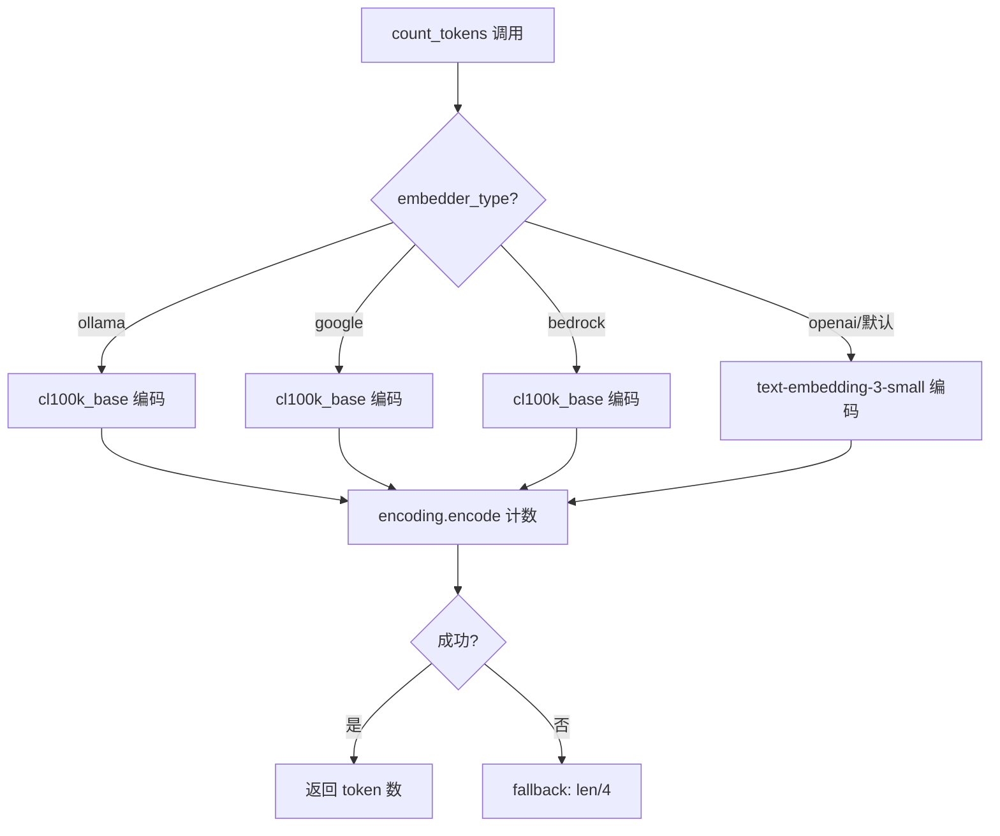
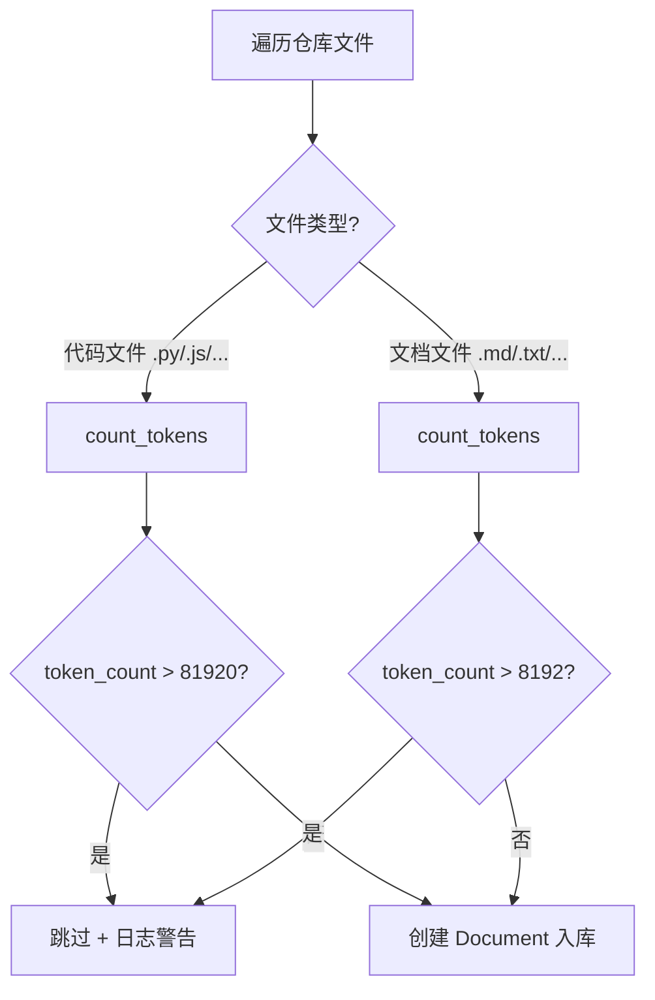
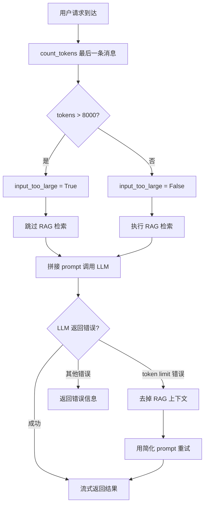

# PD-01.06 DeepWiki — tiktoken 分层降级上下文保护

> 文档编号：PD-01.06
> 来源：DeepWiki `api/data_pipeline.py`, `api/simple_chat.py`, `api/rag.py`
> GitHub：https://github.com/AsyncFuncAI/deepwiki-open.git
> 问题域：PD-01 上下文管理 Context Window Management
> 状态：可复用方案

---

## 第 1 章 问题与动机

### 1.1 核心问题

DeepWiki 是一个将 Git 仓库转化为交互式 Wiki 的系统，核心流程是：克隆仓库 → 读取全部文件 → 文本分块 → 向量嵌入 → FAISS 检索 → LLM 生成回答。这条流水线在两个关键环节面临上下文窗口限制：

1. **嵌入阶段**：OpenAI `text-embedding-3-small` 模型的 token 上限为 8192，超长文件无法生成有效向量。
2. **生成阶段**：用户查询 + RAG 检索上下文 + 对话历史 + system prompt 拼接后可能超出 LLM 的上下文窗口，导致 API 报错。

如果不做保护，大型代码文件（如自动生成的 `package-lock.json`、超长测试文件）会在嵌入阶段失败，而复杂的多轮对话会在生成阶段触发 token limit 错误。

### 1.2 DeepWiki 的解法概述

DeepWiki 采用**三层防线**策略，在数据流的不同阶段设置 token 检查点：

1. **入库过滤**（`data_pipeline.py:325-360`）：读取文件时用 tiktoken 计数，超限文件直接跳过，不进入向量数据库
2. **请求预检**（`simple_chat.py:80-89`）：API 入口处检查用户输入 token 数，超过 8000 则标记 `input_too_large`，跳过 RAG 检索
3. **运行时降级**（`simple_chat.py:564-578`）：捕获 LLM 返回的 token limit 错误，自动去掉 RAG 上下文重试

### 1.3 设计思想

| 设计原则 | 具体实现 | 理由 | 替代方案 |
|----------|----------|------|----------|
| 预防优于治疗 | 入库时就过滤超长文件 | 避免无效嵌入调用浪费 API 费用 | 截断文件内容后嵌入 |
| 分层防御 | 三个独立检查点互不依赖 | 任一层失效，下一层仍能兜底 | 单一入口检查 |
| 优雅降级 | 超限时去掉 RAG 上下文而非拒绝服务 | 用户仍能得到回答，只是质量略降 | 直接返回错误 |
| 多提供商适配 | tiktoken 按 embedder_type 选择编码器 | 不同模型 tokenizer 不同 | 统一用一种编码器 |
| 差异化阈值 | 代码文件 81920 token，文档文件 8192 token | 代码文件通常更长但信息密度高 | 统一阈值 |

---

## 第 2 章 源码实现分析

### 2.1 架构概览

DeepWiki 的上下文管理分布在三个文件中，形成一条从数据入库到请求响应的完整防线：

```
┌─────────────────────────────────────────────────────────────────┐
│                    DeepWiki 上下文保护架构                        │
├─────────────────────────────────────────────────────────────────┤
│                                                                 │
│  Layer 1: 入库过滤 (data_pipeline.py)                           │
│  ┌──────────┐    ┌──────────────┐    ┌──────────────────┐      │
│  │ 读取文件  │───→│ count_tokens │───→│ > 阈值? 跳过入库  │      │
│  └──────────┘    └──────────────┘    └──────────────────┘      │
│       │               │                                         │
│       │          tiktoken 精确计数                               │
│       │          fallback: len//4                                │
│       ▼                                                         │
│  Layer 2: 请求预检 (simple_chat.py:80-89)                       │
│  ┌──────────────┐    ┌──────────────────────────────┐          │
│  │ 用户消息到达  │───→│ tokens > 8000? 跳过 RAG 检索  │          │
│  └──────────────┘    └──────────────────────────────┘          │
│       │                                                         │
│       ▼                                                         │
│  Layer 3: 运行时降级 (simple_chat.py:564-578)                   │
│  ┌──────────────┐    ┌──────────────────────────────┐          │
│  │ LLM API 报错  │───→│ 去掉 RAG 上下文，简化 prompt  │          │
│  │ token limit   │    │ 重新调用 LLM                  │          │
│  └──────────────┘    └──────────────────────────────┘          │
│                                                                 │
└─────────────────────────────────────────────────────────────────┘
```

### 2.2 核心实现

#### 2.2.1 Token 计数器：多提供商适配



对应源码 `api/data_pipeline.py:27-70`：

```python
MAX_EMBEDDING_TOKENS = 8192

def count_tokens(text: str, embedder_type: str = None, is_ollama_embedder: bool = None) -> int:
    try:
        if embedder_type is None and is_ollama_embedder is not None:
            embedder_type = 'ollama' if is_ollama_embedder else None
        if embedder_type is None:
            from api.config import get_embedder_type
            embedder_type = get_embedder_type()

        if embedder_type == 'ollama':
            encoding = tiktoken.get_encoding("cl100k_base")
        elif embedder_type == 'google':
            encoding = tiktoken.get_encoding("cl100k_base")
        elif embedder_type == 'bedrock':
            encoding = tiktoken.get_encoding("cl100k_base")
        else:
            encoding = tiktoken.encoding_for_model("text-embedding-3-small")

        return len(encoding.encode(text))
    except Exception as e:
        logger.warning(f"Error counting tokens with tiktoken: {e}")
        return len(text) // 4
```

关键设计点：
- 为 4 种 embedder 类型选择对应的 tokenizer（`data_pipeline.py:52-63`）
- 异常时降级为字符数/4 的粗略估算（`data_pipeline.py:69-70`）
- 向后兼容旧的 `is_ollama_embedder` bool 参数（`data_pipeline.py:43-44`）

#### 2.2.2 入库阶段：差异化阈值过滤



对应源码 `api/data_pipeline.py:324-377`：

```python
# 代码文件：阈值 = MAX_EMBEDDING_TOKENS * 10 = 81920
token_count = count_tokens(content, embedder_type)
if token_count > MAX_EMBEDDING_TOKENS * 10:
    logger.warning(f"Skipping large file {relative_path}: Token count ({token_count}) exceeds limit")
    continue

# 文档文件：阈值 = MAX_EMBEDDING_TOKENS = 8192
token_count = count_tokens(content, embedder_type)
if token_count > MAX_EMBEDDING_TOKENS:
    logger.warning(f"Skipping large file {relative_path}: Token count ({token_count}) exceeds limit")
    continue
```

代码文件阈值是文档文件的 10 倍（81920 vs 8192），因为代码文件会经过 TextSplitter 分块（`chunk_size: 350 words, chunk_overlap: 100`），分块后每个 chunk 仍在嵌入限制内。文档文件不分块，所以直接用嵌入模型的原始限制。

#### 2.2.3 请求预检与运行时降级



对应源码 `api/simple_chat.py:80-89`（请求预检）：

```python
if request.messages and len(request.messages) > 0:
    last_message = request.messages[-1]
    if hasattr(last_message, 'content') and last_message.content:
        tokens = count_tokens(last_message.content, request.provider == "ollama")
        logger.info(f"Request size: {tokens} tokens")
        if tokens > 8000:
            logger.warning(f"Request exceeds recommended token limit ({tokens} > 7500)")
            input_too_large = True
```

对应源码 `api/simple_chat.py:564-578`（运行时降级）：

```python
if "maximum context length" in error_message or "token limit" in error_message or "too many tokens" in error_message:
    logger.warning("Token limit exceeded, retrying without context")
    simplified_prompt = f"/no_think {system_prompt}\n\n"
    if conversation_history:
        simplified_prompt += f"<conversation_history>\n{conversation_history}</conversation_history>\n\n"
    simplified_prompt += "<note>Answering without retrieval augmentation due to input size constraints.</note>\n\n"
    simplified_prompt += f"<query>\n{query}\n</query>\n\nAssistant: "
```

### 2.3 实现细节

**文本分块配置**（`api/config/embedder.json:36-40`）：

```json
{
  "text_splitter": {
    "split_by": "word",
    "chunk_size": 350,
    "chunk_overlap": 100
  }
}
```

分块策略：按词分割，每块 350 词，重叠 100 词。这确保了即使代码文件很长（最大 81920 token），分块后每个 chunk 约 350 词 ≈ 470 token，远低于嵌入模型的 8192 限制。

**RAG 检索配置**（`api/config/embedder.json:33-35`）：

```json
{
  "retriever": {
    "top_k": 20
  }
}
```

每次查询检索 20 个最相关的文档块。按每块 350 词计算，最大检索上下文约 7000 词 ≈ 9300 token。

**Memory 组件**（`api/rag.py:51-141`）：Memory 类维护对话历史，但没有实现历史裁剪。所有历史对话都会被拼入 prompt，这是一个潜在的上下文溢出风险点，目前依赖 Layer 3 的运行时降级来兜底。


---

## 第 3 章 迁移指南

### 3.1 迁移清单

**阶段 1：Token 计数基础设施**
- [ ] 安装 tiktoken：`pip install tiktoken`
- [ ] 实现 `count_tokens()` 函数，支持目标 LLM 提供商的 tokenizer
- [ ] 添加 fallback 估算逻辑（字符数/4）

**阶段 2：入库过滤**
- [ ] 在文档读取流程中加入 token 计数
- [ ] 根据文件类型设置差异化阈值
- [ ] 添加跳过日志，便于排查

**阶段 3：请求预检**
- [ ] 在 API 入口处检查输入 token 数
- [ ] 设置预检阈值（建议为模型上下文窗口的 60-70%）
- [ ] 超限时标记降级标志

**阶段 4：运行时降级**
- [ ] 捕获 LLM 的 token limit 错误
- [ ] 实现简化 prompt 重试逻辑
- [ ] 确保降级后仍能返回有意义的回答

### 3.2 适配代码模板

```python
import tiktoken
import logging
from typing import Optional
from dataclasses import dataclass
from enum import Enum

logger = logging.getLogger(__name__)


class ContextProtectionLevel(Enum):
    """上下文保护触发级别"""
    NONE = "none"           # 未触发任何保护
    SKIP_RAG = "skip_rag"   # 跳过 RAG 检索
    SIMPLIFIED = "simplified"  # 简化 prompt 重试


@dataclass
class TokenBudget:
    """Token 预算配置"""
    embedding_limit: int = 8192       # 嵌入模型 token 上限
    code_file_multiplier: int = 10    # 代码文件阈值倍数
    input_check_threshold: int = 8000 # 输入预检阈值
    safety_margin: float = 0.85       # 安全边际（预留 15% 给输出）


class ContextProtector:
    """三层上下文保护器 — 移植自 DeepWiki 模式"""

    def __init__(self, budget: TokenBudget = None, model: str = "text-embedding-3-small"):
        self.budget = budget or TokenBudget()
        try:
            self.encoding = tiktoken.encoding_for_model(model)
        except KeyError:
            self.encoding = tiktoken.get_encoding("cl100k_base")

    def count_tokens(self, text: str) -> int:
        """Layer 0: 精确 token 计数，异常时降级为粗略估算"""
        try:
            return len(self.encoding.encode(text))
        except Exception as e:
            logger.warning(f"tiktoken failed: {e}, using char/4 fallback")
            return len(text) // 4

    def should_skip_file(self, content: str, is_code: bool = True) -> bool:
        """Layer 1: 入库过滤 — 超长文件跳过"""
        token_count = self.count_tokens(content)
        limit = self.budget.embedding_limit * (
            self.budget.code_file_multiplier if is_code else 1
        )
        if token_count > limit:
            logger.warning(f"Skipping file: {token_count} tokens > {limit} limit")
            return True
        return False

    def check_input(self, user_input: str) -> ContextProtectionLevel:
        """Layer 2: 请求预检 — 输入过大时跳过 RAG"""
        tokens = self.count_tokens(user_input)
        if tokens > self.budget.input_check_threshold:
            logger.warning(f"Input too large: {tokens} tokens")
            return ContextProtectionLevel.SKIP_RAG
        return ContextProtectionLevel.NONE

    def is_token_limit_error(self, error_message: str) -> bool:
        """Layer 3: 检测 LLM 返回的 token limit 错误"""
        keywords = ["maximum context length", "token limit", "too many tokens"]
        return any(kw in error_message.lower() for kw in keywords)

    def build_fallback_prompt(
        self, system_prompt: str, query: str, conversation_history: str = ""
    ) -> str:
        """Layer 3: 构建去掉 RAG 上下文的降级 prompt"""
        prompt = f"{system_prompt}\n\n"
        if conversation_history:
            prompt += f"<conversation_history>\n{conversation_history}</conversation_history>\n\n"
        prompt += "<note>Answering without retrieval augmentation due to input size constraints.</note>\n\n"
        prompt += f"<query>\n{query}\n</query>"
        return prompt
```

### 3.3 适用场景

| 场景 | 适用度 | 说明 |
|------|--------|------|
| RAG 系统（文档/代码问答） | ⭐⭐⭐ | 完美匹配，DeepWiki 的原始场景 |
| 多轮对话 Agent | ⭐⭐ | 缺少对话历史裁剪，需自行补充 |
| 批量文档处理流水线 | ⭐⭐⭐ | 入库过滤逻辑可直接复用 |
| 实时流式生成 | ⭐⭐⭐ | 降级重试逻辑适配流式场景 |
| 多模态（图片/音频）系统 | ⭐ | 仅覆盖文本 token，需扩展 |

---

## 第 4 章 测试用例

```python
import pytest
from unittest.mock import patch, MagicMock


class TestCountTokens:
    """测试 token 计数器 — 基于 data_pipeline.py:27-70"""

    def test_openai_encoding(self):
        """OpenAI 默认编码器应返回精确 token 数"""
        from api.data_pipeline import count_tokens
        text = "Hello, world! This is a test."
        result = count_tokens(text, embedder_type='openai')
        assert isinstance(result, int)
        assert result > 0
        assert result < len(text)  # token 数应少于字符数

    def test_ollama_encoding(self):
        """Ollama 使用 cl100k_base 编码"""
        from api.data_pipeline import count_tokens
        text = "def hello(): return 'world'"
        result = count_tokens(text, embedder_type='ollama')
        assert isinstance(result, int)
        assert result > 0

    def test_fallback_on_error(self):
        """tiktoken 失败时应降级为 len//4"""
        from api.data_pipeline import count_tokens
        with patch('tiktoken.encoding_for_model', side_effect=Exception("mock error")):
            with patch('tiktoken.get_encoding', side_effect=Exception("mock error")):
                result = count_tokens("a" * 100)
                assert result == 25  # 100 // 4

    def test_backward_compatibility(self):
        """旧的 is_ollama_embedder 参数应正常工作"""
        from api.data_pipeline import count_tokens
        result = count_tokens("test", is_ollama_embedder=True)
        assert isinstance(result, int)


class TestDocumentFiltering:
    """测试入库过滤 — 基于 data_pipeline.py:324-377"""

    def test_skip_large_code_file(self):
        """超过 81920 token 的代码文件应被跳过"""
        from api.data_pipeline import MAX_EMBEDDING_TOKENS
        assert MAX_EMBEDDING_TOKENS == 8192
        # 代码文件阈值 = 8192 * 10 = 81920
        large_content = "x = 1\n" * 50000  # 远超阈值
        from api.data_pipeline import count_tokens
        token_count = count_tokens(large_content)
        assert token_count > MAX_EMBEDDING_TOKENS * 10

    def test_skip_large_doc_file(self):
        """超过 8192 token 的文档文件应被跳过"""
        from api.data_pipeline import MAX_EMBEDDING_TOKENS
        large_doc = "This is a long document. " * 5000
        from api.data_pipeline import count_tokens
        token_count = count_tokens(large_doc)
        assert token_count > MAX_EMBEDDING_TOKENS


class TestInputPrecheck:
    """测试请求预检 — 基于 simple_chat.py:80-89"""

    def test_large_input_detected(self):
        """超过 8000 token 的输入应被标记"""
        from api.data_pipeline import count_tokens
        large_input = "Explain this code: " + "x = 1; " * 5000
        tokens = count_tokens(large_input)
        input_too_large = tokens > 8000
        assert input_too_large is True

    def test_normal_input_passes(self):
        """正常大小的输入不应被标记"""
        from api.data_pipeline import count_tokens
        normal_input = "What does this function do?"
        tokens = count_tokens(normal_input)
        input_too_large = tokens > 8000
        assert input_too_large is False


class TestRuntimeDegradation:
    """测试运行时降级 — 基于 simple_chat.py:564-578"""

    @pytest.mark.parametrize("error_msg", [
        "maximum context length exceeded",
        "token limit reached",
        "too many tokens in request",
    ])
    def test_token_limit_error_detection(self, error_msg):
        """应能识别各种 token limit 错误消息"""
        keywords = ["maximum context length", "token limit", "too many tokens"]
        detected = any(kw in error_msg for kw in keywords)
        assert detected is True

    def test_simplified_prompt_no_context(self):
        """降级 prompt 不应包含 RAG 上下文"""
        system_prompt = "You are a code assistant."
        query = "What is this?"
        simplified = f"{system_prompt}\n\n"
        simplified += "<note>Answering without retrieval augmentation due to input size constraints.</note>\n\n"
        simplified += f"<query>\n{query}\n</query>"
        assert "<START_OF_CONTEXT>" not in simplified
        assert "retrieval augmentation" in simplified
```


---

## 第 5 章 跨域关联

| 关联域 | 关系类型 | 说明 |
|--------|----------|------|
| PD-08 搜索与检索 | 强依赖 | 上下文保护直接影响 RAG 检索行为：Layer 2 跳过 RAG 时，检索完全不执行；Layer 3 降级时，检索结果被丢弃。DeepWiki 的 FAISS 检索 top_k=20 的配置也间接影响上下文大小 |
| PD-03 容错与重试 | 协同 | Layer 3 的 token limit 错误捕获本质上是一种容错机制。DeepWiki 在 `simple_chat.py:564-733` 实现了完整的 try-catch-retry 模式，与 PD-03 的重试策略高度重叠 |
| PD-06 记忆持久化 | 协同 | Memory 组件（`rag.py:51-141`）维护对话历史但无裁剪机制，随着对话轮次增加会持续消耗上下文预算。未来需要与 PD-01 的压缩策略配合 |
| PD-04 工具系统 | 弱关联 | DeepWiki 的工具系统较简单（主要是 RAG 检索），但工具返回的上下文大小直接受 PD-01 的预算控制 |
| PD-11 可观测性 | 协同 | 每层保护都有 `logger.warning/info` 日志输出，但缺少结构化的 token 消耗追踪指标 |

---

## 第 6 章 来源文件索引

| 文件 | 行范围 | 关键实现 |
|------|--------|----------|
| `api/data_pipeline.py` | L25 | `MAX_EMBEDDING_TOKENS = 8192` 常量定义 |
| `api/data_pipeline.py` | L27-70 | `count_tokens()` 多提供商 token 计数器 |
| `api/data_pipeline.py` | L324-328 | 代码文件入库过滤（阈值 81920） |
| `api/data_pipeline.py` | L358-362 | 文档文件入库过滤（阈值 8192） |
| `api/simple_chat.py` | L80-89 | 请求预检：输入 token 检查 |
| `api/simple_chat.py` | L191 | RAG 检索跳过逻辑 |
| `api/simple_chat.py` | L319-326 | 上下文注入与空上下文处理 |
| `api/simple_chat.py` | L564-578 | 运行时降级：token limit 错误捕获与重试 |
| `api/rag.py` | L49 | `MAX_INPUT_TOKENS = 7500` 安全阈值 |
| `api/rag.py` | L51-141 | Memory 组件（无裁剪的对话历史） |
| `api/config/embedder.json` | L36-40 | TextSplitter 配置：350 词/块，100 词重叠 |
| `api/config/embedder.json` | L33-35 | Retriever 配置：top_k=20 |
| `api/prompts.py` | L1-57 | RAG prompt 模板（含上下文注入点） |
| `api/websocket_wiki.py` | L75-84 | WebSocket 端点的相同预检逻辑 |

---

## 第 7 章 横向对比维度

```json comparison_data
{
  "project": "DeepWiki",
  "dimensions": {
    "估算方式": "tiktoken 精确计数 + len//4 fallback，按 embedder_type 选编码器",
    "压缩策略": "无压缩，超限直接跳过文件或去掉 RAG 上下文",
    "触发机制": "三层：入库阈值过滤 → 请求 8000 token 预检 → 运行时错误捕获",
    "实现位置": "data_pipeline.py + simple_chat.py + rag.py 分布式三文件",
    "容错设计": "tiktoken 异常降级为 char/4；LLM 报错降级为无 RAG 重试",
    "分割粒度": "TextSplitter 按词分割，350 词/块，100 词重叠",
    "保留策略": "代码文件 81920 token 入库，文档文件 8192 token 入库，无历史裁剪",
    "Prompt模板化": "Jinja2 模板 RAG_TEMPLATE 含 contexts 条件注入",
    "批量并发控制": "OpenAI embedder batch_size=500，Ollama 单文档串行处理"
  }
}
```

### 域元数据补充

```json domain_metadata
{
  "solution_summary": "DeepWiki 用 tiktoken 多编码器精确计数 + 三层防线（入库过滤/请求预检/运行时降级）实现上下文窗口保护，超限时自动去掉 RAG 上下文降级回答",
  "description": "RAG 系统中嵌入阶段与生成阶段需要独立的上下文保护策略",
  "sub_problems": [
    "嵌入阶段文件过滤：根据文件类型设置差异化 token 阈值决定是否入库",
    "RAG 上下文动态裁剪：根据输入大小决定是否执行检索以及检索结果是否注入 prompt",
    "多提供商 tokenizer 选择：不同嵌入模型使用不同编码器，需运行时动态适配"
  ],
  "best_practices": [
    "代码文件与文档文件应设置不同的 token 阈值，代码可分块所以阈值更宽松",
    "运行时降级应捕获多种错误关键词而非单一字符串匹配",
    "token 计数器必须有 fallback 路径，避免 tiktoken 加载失败导致整个流水线中断"
  ]
}
```

