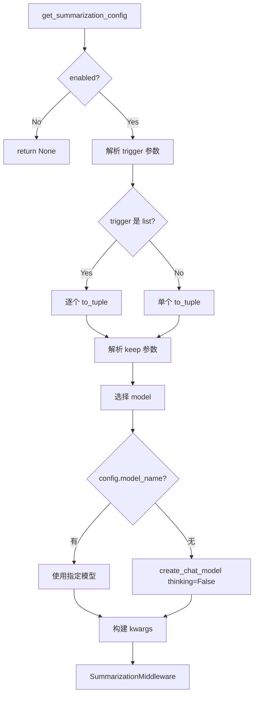
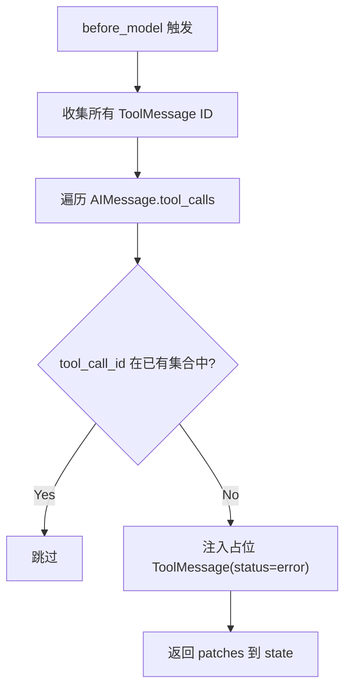

# PD-01.DF DeerFlow 2.0 — SummarizationMiddleware 上下文压缩与记忆注入

> 文档编号：PD-01.DF
> 来源：DeerFlow 2.0 `backend/src/config/summarization_config.py` `backend/src/agents/lead_agent/agent.py`
> GitHub：https://github.com/bytedance/deer-flow.git
> 问题域：PD-01 上下文管理 Context Window Management
> 状态：可复用方案

---

## 第 1 章 问题与动机

### 1.1 核心问题

DeerFlow 2.0 是一个开源超级 Agent 平台，支持子 Agent 并行编排、Skills 渐进式加载、长对话记忆注入等复杂场景。随着对话轮次增长和工具调用累积，上下文窗口面临三重压力：

1. **对话历史膨胀**：多轮工具调用产生大量 AIMessage + ToolMessage 对，token 消耗指数增长
2. **子 Agent 上下文污染**：子 Agent 内部的工具调用和中间推理不应回流到主 Agent 上下文
3. **Skills 描述占用**：每个启用的 Skill 的描述和路径都注入 system prompt，Skills 越多 token 越多

DeerFlow 的解法不是单一压缩策略，而是一套**中间件管道 + 记忆外置 + 渐进加载**的组合方案。

### 1.2 DeerFlow 的解法概述

1. **SummarizationMiddleware**：基于 LangChain 内置中间件，支持按 token 数/消息数/比例三种触发条件，自动将旧对话压缩为摘要（`agent.py:20-59`）
2. **DanglingToolCallMiddleware**：压缩后可能产生悬挂工具调用（AIMessage 有 tool_calls 但对应 ToolMessage 被裁掉），该中间件在 model 调用前自动注入占位 ToolMessage 修复格式（`dangling_tool_call_middleware.py:22-74`）
3. **Memory 外置注入**：将跨会话记忆持久化到 JSON 文件，每次对话前通过 tiktoken 精确计量后注入 system prompt 的 `<memory>` 标签（`prompt.py:283-309`）
4. **Skills 渐进式加载**：system prompt 只列出 Skill 名称和路径，Agent 按需 `read_file` 加载具体内容，避免一次性注入所有 Skill 全文（`prompt.py:312-350`）
5. **子 Agent 上下文隔离**：子 Agent 通过 `task` 工具调用运行在独立上下文中，结果以单条 ToolMessage 返回，内部对话不污染主 Agent（`prompt.py:16-146`）

### 1.3 设计思想

| 设计原则 | 具体实现 | 理由 | 替代方案 |
|----------|----------|------|----------|
| 中间件透明压缩 | SummarizationMiddleware 在 Agent 循环外自动触发 | 节点代码无需感知压缩逻辑，关注点分离 | 在 Agent 内部手动裁剪消息 |
| 三维触发条件 | 支持 fraction/tokens/messages 三种触发方式，可组合 | 不同场景需要不同粒度的控制 | 仅按消息数触发 |
| 悬挂修复前置 | DanglingToolCallMiddleware 在 before_model 阶段运行 | 压缩可能破坏 AI-Tool 消息对，必须在 LLM 看到之前修复 | 压缩时保证不拆对（更复杂） |
| 记忆外置 + tiktoken 计量 | memory.json 持久化 + tiktoken 精确 token 计数 | 跨会话可用 + 精确控制注入量 | 内存中保存 + 字符数估算 |
| 渐进式 Skill 加载 | system prompt 只放索引，按需 read_file | 10 个 Skill 可能占 5000+ token，索引只需 500 | 全量注入所有 Skill 内容 |
| 子 Agent 结果隔离 | task 工具返回摘要，内部对话不回流 | 3 个并行子 Agent 的内部对话可能有 10000+ token | 所有子 Agent 共享主上下文 |

---

## 第 2 章 源码实现分析

### 2.1 架构概览

DeerFlow 的上下文管理分布在中间件管道的多个层次：

```
┌─────────────────────────────────────────────────────────────┐
│                    Lead Agent 创建流程                        │
│  make_lead_agent(config)                                     │
│    ├── apply_prompt_template()  ← Skills索引 + Memory注入    │
│    ├── _build_middlewares()     ← 中间件管道组装              │
│    │   ├── ThreadDataMiddleware                               │
│    │   ├── UploadsMiddleware                                  │
│    │   ├── SandboxMiddleware                                  │
│    │   ├── DanglingToolCallMiddleware  ← 悬挂修复            │
│    │   ├── SummarizationMiddleware     ← 上下文压缩          │
│    │   ├── TodoListMiddleware (可选)                          │
│    │   ├── TitleMiddleware                                    │
│    │   ├── MemoryMiddleware            ← 记忆队列            │
│    │   ├── ViewImageMiddleware (可选)                         │
│    │   ├── SubagentLimitMiddleware (可选) ← 并发截断         │
│    │   └── ClarificationMiddleware                            │
│    └── create_agent(model, tools, middleware, system_prompt)  │
└─────────────────────────────────────────────────────────────┘
```

### 2.2 核心实现

#### 2.2.1 SummarizationMiddleware 配置与创建



对应源码 `backend/src/agents/lead_agent/agent.py:20-59`：

```python
def _create_summarization_middleware() -> SummarizationMiddleware | None:
    config = get_summarization_config()
    if not config.enabled:
        return None

    # 支持单个或多个触发条件
    trigger = None
    if config.trigger is not None:
        if isinstance(config.trigger, list):
            trigger = [t.to_tuple() for t in config.trigger]
        else:
            trigger = config.trigger.to_tuple()

    keep = config.keep.to_tuple()

    # 摘要模型选择：优先用轻量模型节省成本
    if config.model_name:
        model = config.model_name
    else:
        model = create_chat_model(thinking_enabled=False)

    kwargs = {
        "model": model,
        "trigger": trigger,
        "keep": keep,
    }
    if config.trim_tokens_to_summarize is not None:
        kwargs["trim_tokens_to_summarize"] = config.trim_tokens_to_summarize
    if config.summary_prompt is not None:
        kwargs["summary_prompt"] = config.summary_prompt

    return SummarizationMiddleware(**kwargs)
```

#### 2.2.2 SummarizationConfig 数据模型

```mermaid
graph TD
    A[SummarizationConfig] --> B[enabled: bool = False]
    A --> C[model_name: str | None]
    A --> D[trigger: ContextSize | list]
    A --> E[keep: ContextSize]
    A --> F[trim_tokens_to_summarize: int = 4000]
    A --> G[summary_prompt: str | None]
    D --> H[ContextSize]
    H --> I["type: fraction | tokens | messages"]
    H --> J["value: int | float"]
    H --> K["to_tuple() → (type, value)"]
```

对应源码 `backend/src/config/summarization_config.py:10-54`：

```python
class ContextSize(BaseModel):
    type: ContextSizeType = Field(description="Type of context size specification")
    value: int | float = Field(description="Value for the context size specification")

    def to_tuple(self) -> tuple[ContextSizeType, int | float]:
        return (self.type, self.value)

class SummarizationConfig(BaseModel):
    enabled: bool = Field(default=False)
    model_name: str | None = Field(default=None)
    trigger: ContextSize | list[ContextSize] | None = Field(default=None)
    keep: ContextSize = Field(
        default_factory=lambda: ContextSize(type="messages", value=20)
    )
    trim_tokens_to_summarize: int | None = Field(default=4000)
    summary_prompt: str | None = Field(default=None)
```

#### 2.2.3 DanglingToolCallMiddleware 悬挂修复



对应源码 `backend/src/agents/middlewares/dangling_tool_call_middleware.py:30-66`：

```python
def _fix_dangling_tool_calls(self, state: AgentState) -> dict | None:
    messages = state.get("messages", [])
    if not messages:
        return None

    existing_tool_msg_ids: set[str] = set()
    for msg in messages:
        if isinstance(msg, ToolMessage):
            existing_tool_msg_ids.add(msg.tool_call_id)

    patches: list[ToolMessage] = []
    for msg in messages:
        if getattr(msg, "type", None) != "ai":
            continue
        tool_calls = getattr(msg, "tool_calls", None)
        if not tool_calls:
            continue
        for tc in tool_calls:
            tc_id = tc.get("id")
            if tc_id and tc_id not in existing_tool_msg_ids:
                patches.append(ToolMessage(
                    content="[Tool call was interrupted and did not return a result.]",
                    tool_call_id=tc_id,
                    name=tc.get("name", "unknown"),
                    status="error",
                ))
                existing_tool_msg_ids.add(tc_id)
    if not patches:
        return None
    return {"messages": patches}
```

### 2.3 实现细节

#### Memory 注入与 tiktoken 精确计量

Memory 系统采用 JSON 文件持久化 + mtime 缓存失效 + tiktoken 精确 token 计数的三层设计。

注入流程（`backend/src/agents/lead_agent/prompt.py:283-309`）：
1. 从 `memory_config` 检查 `enabled` 和 `injection_enabled`
2. 调用 `get_memory_data()` 读取 JSON（带 mtime 缓存）
3. 调用 `format_memory_for_injection(data, max_tokens=2000)` 格式化
4. tiktoken `cl100k_base` 编码计数，超限按字符比例截断并留 5% 余量
5. 包裹在 `<memory>...</memory>` XML 标签中注入 system prompt

Token 计数实现（`backend/src/agents/memory/prompt.py:143-162`）：

```python
def _count_tokens(text: str, encoding_name: str = "cl100k_base") -> int:
    if not TIKTOKEN_AVAILABLE:
        return len(text) // 4  # 字符数/4 降级估算
    try:
        encoding = tiktoken.get_encoding(encoding_name)
        return len(encoding.encode(text))
    except Exception:
        return len(text) // 4
```

#### Memory 异步更新队列

MemoryUpdateQueue（`backend/src/agents/memory/queue.py:21-191`）实现了线程安全的去抖动更新：
- 同一 thread_id 的新消息替换旧消息（去重）
- `threading.Timer` 实现 30 秒去抖动（可配置 1-300 秒）
- 批量处理时每个 thread 间隔 0.5 秒防止 rate limiting
- `_processing` 标志防止并发处理

#### Skills 渐进式加载

system prompt 中只注入 Skill 索引（`backend/src/agents/lead_agent/prompt.py:312-350`）：

```xml
<skill_system>
  <available_skills>
    <skill>
      <name>web-search</name>
      <description>Search the web...</description>
      <location>/mnt/skills/public/web-search/SKILL.md</location>
    </skill>
  </available_skills>
</skill_system>
```

Agent 按需调用 `read_file` 加载具体 Skill 内容，而非一次性注入全部 Skill 文本。这是 prompt 中明确指导的 **Progressive Loading Pattern**（`prompt.py:339-344`）。

#### 子 Agent 并发限制中间件

SubagentLimitMiddleware（`backend/src/agents/middlewares/subagent_limit_middleware.py:24-75`）在 `after_model` 阶段截断超额的 `task` 工具调用：
- 硬限制范围 [2, 4]，默认 3
- 只保留前 N 个 task 调用，多余的静默丢弃
- 比纯 prompt 指令更可靠的并发控制

---

## 第 3 章 迁移指南

### 3.1 迁移清单

**阶段 1：基础压缩（1-2 天）**
- [ ] 安装依赖：`langchain>=0.3` + `tiktoken`
- [ ] 创建 `SummarizationConfig` Pydantic 模型
- [ ] 实现 `_create_summarization_middleware()` 工厂函数
- [ ] 在 Agent 创建时注入 SummarizationMiddleware
- [ ] 配置触发条件（推荐：`fraction=0.75` 或 `messages=40`）

**阶段 2：悬挂修复（0.5 天）**
- [ ] 实现 `DanglingToolCallMiddleware`
- [ ] 确保在 SummarizationMiddleware 之前注册（before_model 阶段）

**阶段 3：记忆外置（1-2 天）**
- [ ] 设计 memory.json 结构（user/history/facts 三层）
- [ ] 实现 tiktoken 精确计量的 `format_memory_for_injection()`
- [ ] 实现 MemoryUpdater（LLM 驱动的记忆提取）
- [ ] 实现 MemoryUpdateQueue（去抖动异步更新）
- [ ] 在 system prompt 模板中预留 `{memory_context}` 占位符

**阶段 4：渐进式加载（0.5 天）**
- [ ] 将 Skill/Plugin 描述改为索引模式（名称+路径）
- [ ] 在 system prompt 中添加 Progressive Loading 指导
- [ ] 确保 Agent 有 `read_file` 工具可用

### 3.2 适配代码模板

#### 最小可用的 SummarizationConfig + Middleware 组装

```python
from pydantic import BaseModel, Field
from typing import Literal
from langchain.agents import create_agent
from langchain.agents.middleware import SummarizationMiddleware

ContextSizeType = Literal["fraction", "tokens", "messages"]

class ContextSize(BaseModel):
    type: ContextSizeType
    value: int | float

    def to_tuple(self):
        return (self.type, self.value)

class SummarizationConfig(BaseModel):
    enabled: bool = True
    model_name: str | None = None
    trigger: ContextSize | list[ContextSize] | None = ContextSize(type="fraction", value=0.75)
    keep: ContextSize = ContextSize(type="messages", value=20)
    trim_tokens_to_summarize: int | None = 4000

def create_summarization_middleware(config: SummarizationConfig, default_model):
    if not config.enabled:
        return None
    trigger = None
    if config.trigger:
        if isinstance(config.trigger, list):
            trigger = [t.to_tuple() for t in config.trigger]
        else:
            trigger = config.trigger.to_tuple()
    return SummarizationMiddleware(
        model=config.model_name or default_model,
        trigger=trigger,
        keep=config.keep.to_tuple(),
        trim_tokens_to_summarize=config.trim_tokens_to_summarize,
    )
```

#### DanglingToolCallMiddleware 可直接复用

```python
from langchain.agents.middleware import AgentMiddleware
from langchain_core.messages import ToolMessage

class DanglingToolCallMiddleware(AgentMiddleware):
    def before_model(self, state, runtime):
        messages = state.get("messages", [])
        existing_ids = {m.tool_call_id for m in messages if isinstance(m, ToolMessage)}
        patches = []
        for msg in messages:
            for tc in getattr(msg, "tool_calls", []) or []:
                tc_id = tc.get("id")
                if tc_id and tc_id not in existing_ids:
                    patches.append(ToolMessage(
                        content="[Interrupted]",
                        tool_call_id=tc_id,
                        name=tc.get("name", "unknown"),
                        status="error",
                    ))
                    existing_ids.add(tc_id)
        return {"messages": patches} if patches else None
```

#### Memory 注入模板（tiktoken 精确计量）

```python
import tiktoken

def format_memory_for_injection(memory_data: dict, max_tokens: int = 2000) -> str:
    sections = []
    user = memory_data.get("user", {})
    for key in ["workContext", "personalContext", "topOfMind"]:
        summary = user.get(key, {}).get("summary", "")
        if summary:
            sections.append(f"- {key}: {summary}")

    result = "\n".join(sections)
    try:
        enc = tiktoken.get_encoding("cl100k_base")
        token_count = len(enc.encode(result))
    except Exception:
        token_count = len(result) // 4

    if token_count > max_tokens:
        ratio = max_tokens / token_count * 0.95
        result = result[:int(len(result) * ratio)] + "\n..."
    return result
```

### 3.3 适用场景

| 场景 | 适用度 | 说明 |
|------|--------|------|
| 长对话 Agent（>20 轮） | ⭐⭐⭐ | SummarizationMiddleware 核心场景 |
| 多工具调用 Agent | ⭐⭐⭐ | 工具结果膨胀快，压缩收益大 |
| 子 Agent 编排系统 | ⭐⭐⭐ | 隔离 + 并发限制组合方案 |
| 跨会话个性化 | ⭐⭐⭐ | Memory JSON + tiktoken 注入 |
| 单轮问答 Bot | ⭐ | 无需压缩，过度设计 |
| 纯 RAG 检索系统 | ⭐⭐ | 检索结果可能需要裁剪，但不需要对话压缩 |

---

## 第 4 章 测试用例

```python
import pytest
from unittest.mock import MagicMock, patch
from pydantic import BaseModel

# --- SummarizationConfig 测试 ---

class TestSummarizationConfig:
    def test_default_config_disabled(self):
        """默认配置应该是禁用状态"""
        from src.config.summarization_config import SummarizationConfig
        config = SummarizationConfig()
        assert config.enabled is False
        assert config.model_name is None
        assert config.keep.type == "messages"
        assert config.keep.value == 20
        assert config.trim_tokens_to_summarize == 4000

    def test_context_size_to_tuple(self):
        """ContextSize 应正确转换为 tuple"""
        from src.config.summarization_config import ContextSize
        cs = ContextSize(type="fraction", value=0.8)
        assert cs.to_tuple() == ("fraction", 0.8)

        cs2 = ContextSize(type="tokens", value=4000)
        assert cs2.to_tuple() == ("tokens", 4000)

    def test_multiple_triggers(self):
        """支持多个触发条件"""
        from src.config.summarization_config import SummarizationConfig, ContextSize
        config = SummarizationConfig(
            enabled=True,
            trigger=[
                ContextSize(type="messages", value=50),
                ContextSize(type="fraction", value=0.8),
            ],
        )
        assert len(config.trigger) == 2
        assert config.trigger[0].to_tuple() == ("messages", 50)

    def test_load_from_dict(self):
        """从字典加载配置"""
        from src.config.summarization_config import load_summarization_config_from_dict, get_summarization_config
        load_summarization_config_from_dict({
            "enabled": True,
            "trigger": {"type": "fraction", "value": 0.75},
            "keep": {"type": "messages", "value": 10},
        })
        config = get_summarization_config()
        assert config.enabled is True
        assert config.trigger.to_tuple() == ("fraction", 0.75)


# --- DanglingToolCallMiddleware 测试 ---

class TestDanglingToolCallMiddleware:
    def test_no_dangling_calls(self):
        """无悬挂调用时返回 None"""
        from src.agents.middlewares.dangling_tool_call_middleware import DanglingToolCallMiddleware
        mw = DanglingToolCallMiddleware()
        state = {"messages": []}
        assert mw._fix_dangling_tool_calls(state) is None

    def test_patches_dangling_call(self):
        """检测并修复悬挂的工具调用"""
        from src.agents.middlewares.dangling_tool_call_middleware import DanglingToolCallMiddleware
        from langchain_core.messages import AIMessage

        mw = DanglingToolCallMiddleware()
        ai_msg = AIMessage(content="", tool_calls=[{"id": "tc_1", "name": "search", "args": {}}])
        state = {"messages": [ai_msg]}
        result = mw._fix_dangling_tool_calls(state)
        assert result is not None
        assert len(result["messages"]) == 1
        assert result["messages"][0].tool_call_id == "tc_1"
        assert result["messages"][0].status == "error"


# --- Memory 注入测试 ---

class TestMemoryInjection:
    def test_format_empty_memory(self):
        """空记忆返回空字符串"""
        from src.agents.memory.prompt import format_memory_for_injection
        assert format_memory_for_injection({}) == ""
        assert format_memory_for_injection(None) == ""

    def test_format_with_user_context(self):
        """正确格式化用户上下文"""
        from src.agents.memory.prompt import format_memory_for_injection
        data = {
            "user": {
                "workContext": {"summary": "Python developer at ByteDance"},
                "topOfMind": {"summary": "Working on DeerFlow 2.0"},
            }
        }
        result = format_memory_for_injection(data, max_tokens=2000)
        assert "Python developer" in result
        assert "DeerFlow 2.0" in result

    def test_token_truncation(self):
        """超过 max_tokens 时截断"""
        from src.agents.memory.prompt import format_memory_for_injection
        data = {
            "user": {
                "workContext": {"summary": "x " * 5000},
            }
        }
        result = format_memory_for_injection(data, max_tokens=100)
        assert result.endswith("...")

    def test_tiktoken_fallback(self):
        """tiktoken 不可用时降级到字符估算"""
        from src.agents.memory.prompt import _count_tokens
        with patch("src.agents.memory.prompt.TIKTOKEN_AVAILABLE", False):
            count = _count_tokens("hello world")
            assert count == len("hello world") // 4
```

---

## 第 5 章 跨域关联

| 关联域 | 关系类型 | 说明 |
|--------|----------|------|
| PD-02 多 Agent 编排 | 协同 | 子 Agent 上下文隔离是编排架构的一部分，SubagentLimitMiddleware 同时服务于编排和上下文控制 |
| PD-03 容错与重试 | 协同 | DanglingToolCallMiddleware 本质是容错机制——修复因中断导致的消息格式错误 |
| PD-04 工具系统 | 依赖 | Skills 渐进式加载依赖 Agent 拥有 `read_file` 工具；工具调用结果是上下文膨胀的主要来源 |
| PD-06 记忆持久化 | 协同 | Memory JSON 持久化 + MemoryUpdateQueue 异步更新是记忆域的核心实现，注入到上下文是 PD-01 的消费端 |
| PD-10 中间件管道 | 依赖 | 所有上下文管理能力都通过 LangChain AgentMiddleware 管道实现，中间件顺序至关重要 |
| PD-11 可观测性 | 协同 | MemoryMiddleware 在 after_agent 阶段队列化对话用于记忆更新，可扩展为 token 消耗追踪 |

---

## 第 6 章 来源文件索引

| 文件 | 行范围 | 关键实现 |
|------|--------|----------|
| `backend/src/config/summarization_config.py` | L1-L75 | SummarizationConfig Pydantic 模型 + ContextSize 三维触发 |
| `backend/src/agents/lead_agent/agent.py` | L20-L59 | _create_summarization_middleware() 工厂函数 |
| `backend/src/agents/lead_agent/agent.py` | L186-L235 | _build_middlewares() 中间件管道组装 + 顺序注释 |
| `backend/src/agents/lead_agent/agent.py` | L238-L265 | make_lead_agent() Agent 创建入口 |
| `backend/src/agents/lead_agent/prompt.py` | L149-L280 | SYSTEM_PROMPT_TEMPLATE 含 memory/skills/subagent 占位符 |
| `backend/src/agents/lead_agent/prompt.py` | L283-L309 | _get_memory_context() 记忆注入 |
| `backend/src/agents/lead_agent/prompt.py` | L312-L350 | get_skills_prompt_section() 渐进式 Skill 索引 |
| `backend/src/agents/lead_agent/prompt.py` | L6-L146 | _build_subagent_section() 子 Agent 并发指导 |
| `backend/src/agents/middlewares/dangling_tool_call_middleware.py` | L22-L74 | DanglingToolCallMiddleware 悬挂修复 |
| `backend/src/agents/middlewares/memory_middleware.py` | L19-L107 | MemoryMiddleware + _filter_messages_for_memory |
| `backend/src/agents/middlewares/subagent_limit_middleware.py` | L24-L75 | SubagentLimitMiddleware 并发截断 |
| `backend/src/agents/memory/prompt.py` | L143-L230 | _count_tokens() tiktoken 计量 + format_memory_for_injection() |
| `backend/src/agents/memory/updater.py` | L158-L302 | MemoryUpdater LLM 驱动记忆更新 |
| `backend/src/agents/memory/queue.py` | L21-L191 | MemoryUpdateQueue 去抖动异步队列 |
| `backend/src/config/memory_config.py` | L6-L48 | MemoryConfig 配置模型（max_injection_tokens=2000） |
| `backend/src/skills/loader.py` | L21-L97 | load_skills() 按需加载 + enabled_only 过滤 |

---

## 第 7 章 横向对比维度

> **重要：** 本章用于自动填充 Butcher Wiki 的横向对比表。

```json comparison_data
{
  "project": "DeerFlow",
  "dimensions": {
    "估算方式": "tiktoken cl100k_base 精确计数，不可用时降级 len//4",
    "压缩策略": "LangChain SummarizationMiddleware 自动摘要",
    "触发机制": "fraction/tokens/messages 三维触发，支持多条件组合",
    "实现位置": "AgentMiddleware 管道，节点代码无感知",
    "容错设计": "DanglingToolCallMiddleware 注入占位 ToolMessage",
    "保留策略": "keep 参数支持 messages/tokens/fraction 三种保留方式",
    "子Agent隔离": "task 工具独立上下文，结果以单条 ToolMessage 返回",
    "摘要模型选择": "优先用轻量模型（thinking_enabled=False）节省成本",
    "Prompt模板化": "SYSTEM_PROMPT_TEMPLATE 含 memory/skills/subagent 动态占位符",
    "AI/Tool消息对保护": "DanglingToolCallMiddleware 在 before_model 修复悬挂对",
    "批量并发控制": "SubagentLimitMiddleware 硬限 [2,4] 截断超额 task 调用",
    "记忆注入预算": "max_injection_tokens=2000 + tiktoken 精确截断留 5% 余量",
    "渐进式加载": "Skills 只注入索引（名称+路径），Agent 按需 read_file 加载"
  }
}
```

### 域元数据补充

```json domain_metadata
{
  "solution_summary": "DeerFlow 2.0 用 LangChain SummarizationMiddleware 三维触发压缩 + DanglingToolCallMiddleware 悬挂修复 + Memory JSON tiktoken 精确注入 + Skills 渐进式索引加载",
  "description": "中间件管道透明压缩与多层上下文预算控制的工程实践",
  "sub_problems": [
    "记忆注入预算控制：跨会话记忆注入 system prompt 时的 token 预算精确控制与截断策略",
    "去抖动记忆更新：多轮对话中记忆更新的去抖动批量处理，避免频繁 LLM 调用",
    "中间件顺序依赖：压缩/修复/注入等中间件的执行顺序对正确性的影响"
  ],
  "best_practices": [
    "悬挂修复必须在压缩之后、模型调用之前：DanglingToolCallMiddleware 的 before_model 时机是关键",
    "记忆注入用 tiktoken 精确计量而非字符估算：不同语言的 token/字符比差异大",
    "Skills 用索引+按需加载替代全量注入：10 个 Skill 可节省 4000+ token"
  ]
}
```
