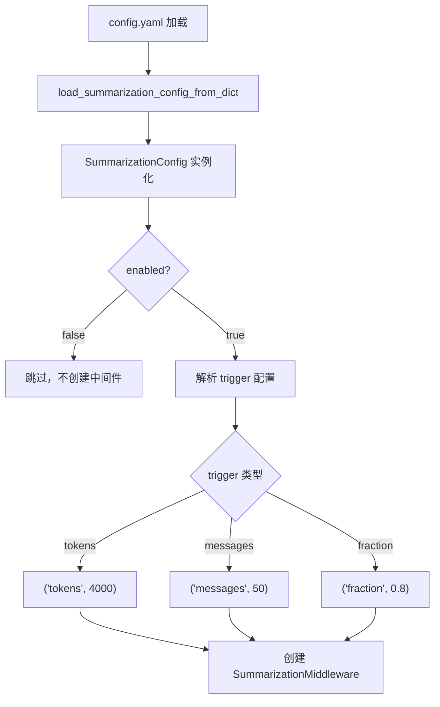
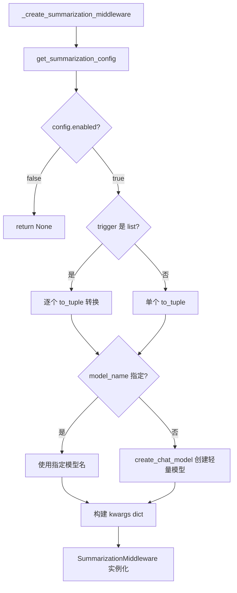
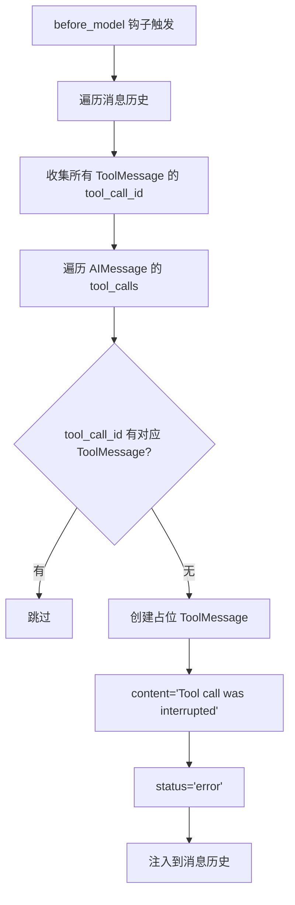

# PD-01.07 DeerFlow — SummarizationMiddleware 三策略上下文压缩

> 文档编号：PD-01.07
> 来源：DeerFlow `backend/src/config/summarization_config.py`, `backend/src/agents/lead_agent/agent.py`
> GitHub：https://github.com/bytedance/deer-flow
> 问题域：PD-01 上下文管理 Context Window Management
> 状态：可复用方案

---

## 第 1 章 问题与动机

### 1.1 核心问题

长对话场景下，Agent 的消息历史会持续膨胀。当 token 数逼近模型上下文窗口上限时，LLM 调用会失败或产生截断。DeerFlow 2.0 作为一个支持多轮对话、工具调用、子 Agent 委托的复杂系统，面临三重上下文压力：

1. **多轮对话累积**：用户与 Lead Agent 的对话可能持续数十轮，每轮包含 user message + AI response + 多个 tool call/result
2. **工具调用膨胀**：每次工具调用产生 AIMessage(tool_calls) + ToolMessage(result) 对，搜索类工具的返回结果尤其庞大
3. **子 Agent 结果回注**：子 Agent 的执行结果通过 task 工具返回，单次可能包含数千 token 的分析报告

DeerFlow 的解法核心是：**将上下文压缩实现为可插拔的中间件**，在 LLM 调用前自动检测并压缩，业务代码完全无感知。

### 1.2 DeerFlow 的解法概述

1. **Pydantic 配置驱动**：通过 `SummarizationConfig` 模型定义触发条件和保留策略，支持 YAML 热加载（`summarization_config.py:21-54`）
2. **三种触发策略**：tokens（绝对 token 数）、messages（消息条数）、fraction（模型窗口占比），任一满足即触发（`summarization_config.py:7`）
3. **LangChain SummarizationMiddleware 集成**：不自己实现压缩算法，而是复用 LangChain 的成熟中间件，通过配置参数适配（`agent.py:20-59`）
4. **DanglingToolCallMiddleware 修复**：压缩后可能出现 AIMessage 有 tool_calls 但对应 ToolMessage 被裁掉的情况，专门的中间件注入占位 ToolMessage 修复格式（`dangling_tool_call_middleware.py:22-74`）
5. **中间件链顺序编排**：Summarization 在 ThreadData/Sandbox 之后、Title/Clarification 之前执行，确保压缩发生在业务逻辑处理前（`agent.py:186-235`）

### 1.3 设计思想

| 设计原则 | 具体实现 | 理由 | 替代方案 |
|----------|----------|------|----------|
| 配置驱动 | Pydantic BaseModel + YAML 加载 | 运维可调参数无需改代码 | 硬编码阈值 |
| 中间件模式 | AgentMiddleware before_model 钩子 | 业务代码零侵入 | 在 Agent 循环中手动调用 |
| 多触发条件 OR 逻辑 | tokens/messages/fraction 任一满足 | 不同场景用不同维度更精准 | 单一 token 阈值 |
| 轻量模型摘要 | 可指定 gpt-4o-mini 等小模型 | 摘要不需要强推理，节省成本 | 用主模型做摘要 |
| 悬挂修复 | DanglingToolCallMiddleware 注入占位 | 防止 LLM 因格式错误拒绝响应 | 忽略（会导致运行时错误） |

---

## 第 2 章 源码实现分析

### 2.1 架构概览

DeerFlow 的上下文管理由三个核心组件协作完成：

```
┌─────────────────────────────────────────────────────────────┐
│                    Lead Agent 中间件链                        │
│                                                             │
│  ┌──────────────┐  ┌──────────────┐  ┌───────────────────┐  │
│  │ ThreadData   │→ │ Sandbox      │→ │ DanglingToolCall  │  │
│  │ Middleware    │  │ Middleware   │  │ Middleware        │  │
│  └──────────────┘  └──────────────┘  └───────┬───────────┘  │
│                                              │              │
│  ┌──────────────────────────────────────────┐│              │
│  │ SummarizationMiddleware (可选)           ││              │
│  │ ┌────────────┐ ┌──────────┐ ┌─────────┐ ││              │
│  │ │ trigger:   │ │ keep:    │ │ model:  │ │←              │
│  │ │ tokens/    │ │ messages/│ │ 轻量LLM │ │              │
│  │ │ messages/  │ │ tokens/  │ │         │ │              │
│  │ │ fraction   │ │ fraction │ │         │ │              │
│  │ └────────────┘ └──────────┘ └─────────┘ │              │
│  └──────────────────────────────────────────┘              │
│                         │                                   │
│  ┌──────────────┐  ┌────┴─────────┐  ┌───────────────────┐ │
│  │ TodoList     │→ │ Title        │→ │ Clarification     │ │
│  │ Middleware   │  │ Middleware   │  │ Middleware        │ │
│  └──────────────┘  └──────────────┘  └───────────────────┘ │
└─────────────────────────────────────────────────────────────┘
```

### 2.2 核心实现

#### 2.2.1 配置模型：三种 ContextSize 类型



对应源码 `backend/src/config/summarization_config.py:7-54`：

```python
ContextSizeType = Literal["fraction", "tokens", "messages"]

class ContextSize(BaseModel):
    """Context size specification for trigger or keep parameters."""
    type: ContextSizeType = Field(description="Type of context size specification")
    value: int | float = Field(description="Value for the context size specification")

    def to_tuple(self) -> tuple[ContextSizeType, int | float]:
        """Convert to tuple format expected by SummarizationMiddleware."""
        return (self.type, self.value)

class SummarizationConfig(BaseModel):
    enabled: bool = Field(default=False)
    model_name: str | None = Field(default=None)
    trigger: ContextSize | list[ContextSize] | None = Field(default=None)
    keep: ContextSize = Field(
        default_factory=lambda: ContextSize(type="messages", value=20)
    )
    trim_tokens_to_summarize: int | None = Field(default=4000)
    summary_prompt: str | None = Field(default=None)
```

关键设计点：`trigger` 支持单个或列表（OR 逻辑），`keep` 默认保留最近 20 条消息，`trim_tokens_to_summarize` 限制送入摘要模型的 token 数以控制成本。

#### 2.2.2 中间件工厂：条件创建与参数映射



对应源码 `backend/src/agents/lead_agent/agent.py:20-59`：

```python
def _create_summarization_middleware() -> SummarizationMiddleware | None:
    config = get_summarization_config()
    if not config.enabled:
        return None

    # Prepare trigger parameter
    trigger = None
    if config.trigger is not None:
        if isinstance(config.trigger, list):
            trigger = [t.to_tuple() for t in config.trigger]
        else:
            trigger = config.trigger.to_tuple()

    keep = config.keep.to_tuple()

    if config.model_name:
        model = config.model_name
    else:
        model = create_chat_model(thinking_enabled=False)

    kwargs = {"model": model, "trigger": trigger, "keep": keep}
    if config.trim_tokens_to_summarize is not None:
        kwargs["trim_tokens_to_summarize"] = config.trim_tokens_to_summarize
    if config.summary_prompt is not None:
        kwargs["summary_prompt"] = config.summary_prompt

    return SummarizationMiddleware(**kwargs)
```

#### 2.2.3 悬挂工具调用修复



对应源码 `backend/src/agents/middlewares/dangling_tool_call_middleware.py:30-66`：

```python
def _fix_dangling_tool_calls(self, state: AgentState) -> dict | None:
    messages = state.get("messages", [])
    if not messages:
        return None

    existing_tool_msg_ids: set[str] = set()
    for msg in messages:
        if isinstance(msg, ToolMessage):
            existing_tool_msg_ids.add(msg.tool_call_id)

    patches: list[ToolMessage] = []
    for msg in messages:
        if getattr(msg, "type", None) != "ai":
            continue
        tool_calls = getattr(msg, "tool_calls", None)
        if not tool_calls:
            continue
        for tc in tool_calls:
            tc_id = tc.get("id")
            if tc_id and tc_id not in existing_tool_msg_ids:
                patches.append(ToolMessage(
                    content="[Tool call was interrupted and did not return a result.]",
                    tool_call_id=tc_id,
                    name=tc.get("name", "unknown"),
                    status="error",
                ))
                existing_tool_msg_ids.add(tc_id)

    if not patches:
        return None
    return {"messages": patches}
```

### 2.3 实现细节

#### 中间件链编排顺序

DeerFlow 对中间件顺序有严格要求（`agent.py:177-235`）：

1. **ThreadDataMiddleware** — 注入 thread_id，后续中间件依赖
2. **UploadsMiddleware** — 处理文件上传，依赖 thread_id
3. **SandboxMiddleware** — 沙箱初始化
4. **DanglingToolCallMiddleware** — 修复悬挂调用（必须在 Summarization 前）
5. **SummarizationMiddleware** — 上下文压缩（可选）
6. **TodoListMiddleware** — 任务管理（可选，plan mode）
7. **TitleMiddleware** — 生成对话标题
8. **MemoryMiddleware** — 记忆更新队列
9. **ViewImageMiddleware** — 图片注入（可选，依赖模型 vision 能力）
10. **SubagentLimitMiddleware** — 子 Agent 并发限制（可选）
11. **ClarificationMiddleware** — 澄清拦截（必须最后）

DanglingToolCallMiddleware 在 SummarizationMiddleware 之前执行是关键设计：先修复格式问题，再做压缩，避免压缩过程中遇到格式错误。

#### 子 Agent 上下文隔离

DeerFlow 的子 Agent（通过 `task` 工具启动）运行在独立上下文中，其内部对话不会回注到主 Agent 的消息历史。只有最终结果作为 ToolMessage 返回。这是一种隐式的上下文管理策略——通过架构隔离避免主 Agent 上下文膨胀。

SubagentLimitMiddleware（`subagent_limit_middleware.py:24-75`）进一步限制单次响应最多 2-4 个并发子 Agent 调用，从源头控制工具结果的 token 增量。

---

## 第 3 章 迁移指南

### 3.1 迁移清单

**阶段 1：基础配置层（1 个文件）**
- [ ] 创建 `SummarizationConfig` Pydantic 模型，定义 `ContextSize` 类型
- [ ] 实现 `get/set/load_summarization_config` 全局单例管理
- [ ] 在应用配置加载流程中集成 summarization 配置解析

**阶段 2：中间件实现（2 个文件）**
- [ ] 实现 `DanglingToolCallMiddleware`，在 before_model 钩子中修复悬挂工具调用
- [ ] 实现 `_create_summarization_middleware` 工厂函数，条件创建中间件
- [ ] 将两个中间件按正确顺序插入中间件链

**阶段 3：配置文件（1 个文件）**
- [ ] 在 config.yaml 中添加 summarization 配置段
- [ ] 根据目标模型的上下文窗口调整 trigger 和 keep 参数

### 3.2 适配代码模板

以下代码可直接复用，不依赖 DeerFlow 特定框架：

```python
"""可移植的上下文压缩配置模块 — 从 DeerFlow 提取"""
from typing import Literal
from pydantic import BaseModel, Field

ContextSizeType = Literal["fraction", "tokens", "messages"]


class ContextSize(BaseModel):
    type: ContextSizeType
    value: int | float

    def to_tuple(self) -> tuple[ContextSizeType, int | float]:
        return (self.type, self.value)


class SummarizationConfig(BaseModel):
    enabled: bool = False
    model_name: str | None = None
    trigger: ContextSize | list[ContextSize] | None = None
    keep: ContextSize = Field(
        default_factory=lambda: ContextSize(type="messages", value=20)
    )
    trim_tokens_to_summarize: int | None = 4000
    summary_prompt: str | None = None


# --- 悬挂工具调用修复（框架无关版本）---
from dataclasses import dataclass

@dataclass
class ToolCallPatch:
    tool_call_id: str
    tool_name: str
    content: str = "[Tool call was interrupted and did not return a result.]"
    status: str = "error"


def find_dangling_tool_calls(
    messages: list[dict],
    ai_type: str = "ai",
    tool_type: str = "tool",
) -> list[ToolCallPatch]:
    """扫描消息历史，找出缺少对应 ToolMessage 的 tool_calls。
    
    Args:
        messages: 消息列表，每条消息需有 type 和可选的 tool_calls/tool_call_id 字段
        ai_type: AI 消息的 type 标识
        tool_type: 工具消息的 type 标识
    
    Returns:
        需要注入的占位 ToolMessage 列表
    """
    existing_ids = {
        msg.get("tool_call_id")
        for msg in messages
        if msg.get("type") == tool_type and msg.get("tool_call_id")
    }
    
    patches = []
    for msg in messages:
        if msg.get("type") != ai_type:
            continue
        for tc in msg.get("tool_calls", []):
            tc_id = tc.get("id")
            if tc_id and tc_id not in existing_ids:
                patches.append(ToolCallPatch(
                    tool_call_id=tc_id,
                    tool_name=tc.get("name", "unknown"),
                ))
                existing_ids.add(tc_id)
    return patches
```

### 3.3 适用场景

| 场景 | 适用度 | 说明 |
|------|--------|------|
| 多轮对话 Agent（>20 轮） | ⭐⭐⭐ | 核心场景，消息累积最快 |
| 工具密集型 Agent | ⭐⭐⭐ | 工具调用产生大量 tool_call/result 对 |
| 多模型切换场景 | ⭐⭐⭐ | fraction 触发自动适配不同模型窗口 |
| 短对话（<10 轮） | ⭐ | 不需要压缩，增加不必要的复杂度 |
| 需要精确历史回溯 | ⭐ | 摘要会丢失细节，不适合审计场景 |

---

## 第 4 章 测试用例

```python
"""DeerFlow SummarizationConfig 测试用例 — 基于真实函数签名"""
import pytest
from typing import Literal
from pydantic import BaseModel, Field, ValidationError


# --- 被测代码（从 summarization_config.py 提取）---
ContextSizeType = Literal["fraction", "tokens", "messages"]

class ContextSize(BaseModel):
    type: ContextSizeType
    value: int | float
    def to_tuple(self) -> tuple[ContextSizeType, int | float]:
        return (self.type, self.value)

class SummarizationConfig(BaseModel):
    enabled: bool = Field(default=False)
    model_name: str | None = Field(default=None)
    trigger: ContextSize | list[ContextSize] | None = Field(default=None)
    keep: ContextSize = Field(
        default_factory=lambda: ContextSize(type="messages", value=20)
    )
    trim_tokens_to_summarize: int | None = Field(default=4000)
    summary_prompt: str | None = Field(default=None)


class TestContextSize:
    def test_to_tuple_tokens(self):
        cs = ContextSize(type="tokens", value=4000)
        assert cs.to_tuple() == ("tokens", 4000)

    def test_to_tuple_fraction(self):
        cs = ContextSize(type="fraction", value=0.8)
        assert cs.to_tuple() == ("fraction", 0.8)

    def test_to_tuple_messages(self):
        cs = ContextSize(type="messages", value=50)
        assert cs.to_tuple() == ("messages", 50)

    def test_invalid_type_rejected(self):
        with pytest.raises(ValidationError):
            ContextSize(type="invalid", value=100)


class TestSummarizationConfig:
    def test_defaults(self):
        config = SummarizationConfig()
        assert config.enabled is False
        assert config.model_name is None
        assert config.trigger is None
        assert config.keep.type == "messages"
        assert config.keep.value == 20
        assert config.trim_tokens_to_summarize == 4000

    def test_single_trigger(self):
        config = SummarizationConfig(
            enabled=True,
            trigger=ContextSize(type="tokens", value=6000),
        )
        assert config.trigger.to_tuple() == ("tokens", 6000)

    def test_multiple_triggers(self):
        config = SummarizationConfig(
            enabled=True,
            trigger=[
                ContextSize(type="tokens", value=4000),
                ContextSize(type="messages", value=50),
            ],
        )
        assert len(config.trigger) == 2
        assert config.trigger[0].to_tuple() == ("tokens", 4000)
        assert config.trigger[1].to_tuple() == ("messages", 50)

    def test_from_yaml_dict(self):
        """模拟 YAML 加载后的 dict 输入"""
        yaml_data = {
            "enabled": True,
            "model_name": "gpt-4o-mini",
            "trigger": [
                {"type": "tokens", "value": 6000},
                {"type": "fraction", "value": 0.7},
            ],
            "keep": {"type": "messages", "value": 25},
            "trim_tokens_to_summarize": 5000,
        }
        config = SummarizationConfig(**yaml_data)
        assert config.enabled is True
        assert config.model_name == "gpt-4o-mini"
        assert len(config.trigger) == 2
        assert config.keep.value == 25


class TestDanglingToolCallFix:
    """测试悬挂工具调用修复逻辑"""

    def test_no_dangling(self):
        messages = [
            {"type": "ai", "tool_calls": [{"id": "tc1", "name": "search"}]},
            {"type": "tool", "tool_call_id": "tc1", "content": "result"},
        ]
        from find_dangling_tool_calls import find_dangling_tool_calls  # noqa
        patches = find_dangling_tool_calls(messages)
        assert len(patches) == 0

    def test_one_dangling(self):
        messages = [
            {"type": "ai", "tool_calls": [
                {"id": "tc1", "name": "search"},
                {"id": "tc2", "name": "read_file"},
            ]},
            {"type": "tool", "tool_call_id": "tc1", "content": "result"},
            # tc2 缺少对应 ToolMessage
        ]
        from find_dangling_tool_calls import find_dangling_tool_calls  # noqa
        patches = find_dangling_tool_calls(messages)
        assert len(patches) == 1
        assert patches[0].tool_call_id == "tc2"
        assert patches[0].tool_name == "read_file"

    def test_no_tool_calls(self):
        messages = [
            {"type": "ai", "content": "Hello"},
            {"type": "human", "content": "Hi"},
        ]
        from find_dangling_tool_calls import find_dangling_tool_calls  # noqa
        patches = find_dangling_tool_calls(messages)
        assert len(patches) == 0
```

---

## 第 5 章 跨域关联

| 关联域 | 关系类型 | 说明 |
|--------|----------|------|
| PD-02 多 Agent 编排 | 协同 | 子 Agent 运行在隔离上下文中，SubagentLimitMiddleware 限制并发数（2-4），从架构层面控制主 Agent 上下文增长 |
| PD-03 容错与重试 | 依赖 | DanglingToolCallMiddleware 是容错机制的一部分——当工具调用被中断时注入占位消息，防止 LLM 格式错误 |
| PD-04 工具系统 | 协同 | 工具调用结果是上下文膨胀的主要来源，SubagentLimitMiddleware 通过截断多余 task 调用间接控制 token 增量 |
| PD-06 记忆持久化 | 协同 | MemoryMiddleware 在 Summarization 之后执行，过滤掉工具调用只保留 user/assistant 最终对话，异步更新长期记忆 |
| PD-10 中间件管道 | 依赖 | 整个上下文管理方案建立在 LangChain AgentMiddleware 管道之上，中间件顺序是核心设计约束 |
| PD-11 可观测性 | 协同 | 摘要触发事件可通过 LangSmith tracing 追踪（agent.py:249-257 注入 metadata），但 DeerFlow 未实现 token 消耗累计追踪 |

---

## 第 6 章 来源文件索引

| 文件 | 行范围 | 关键实现 |
|------|--------|----------|
| `backend/src/config/summarization_config.py` | L1-L75 | SummarizationConfig Pydantic 模型，ContextSize 类型定义，全局单例管理 |
| `backend/src/agents/lead_agent/agent.py` | L20-L59 | _create_summarization_middleware 工厂函数，条件创建与参数映射 |
| `backend/src/agents/lead_agent/agent.py` | L186-L235 | _build_middlewares 中间件链编排，顺序注释说明 |
| `backend/src/agents/lead_agent/agent.py` | L238-L265 | make_lead_agent 入口，注入 LangSmith metadata |
| `backend/src/agents/middlewares/dangling_tool_call_middleware.py` | L22-L74 | DanglingToolCallMiddleware，悬挂工具调用检测与修复 |
| `backend/src/agents/middlewares/subagent_limit_middleware.py` | L24-L75 | SubagentLimitMiddleware，截断多余 task 调用（限制 2-4） |
| `backend/src/agents/middlewares/memory_middleware.py` | L53-L107 | MemoryMiddleware，过滤工具调用后异步更新记忆 |
| `backend/src/agents/lead_agent/prompt.py` | L149-L280 | SYSTEM_PROMPT_TEMPLATE，系统提示模板（动态拼接） |
| `backend/src/config/app_config.py` | L82-L84 | AppConfig.from_file 中加载 summarization 配置 |
| `backend/src/agents/thread_state.py` | L48-L56 | ThreadState 定义，AgentState 扩展 |
| `backend/docs/summarization.md` | L1-L354 | 官方文档：配置说明、最佳实践、故障排查 |

---

## 第 7 章 横向对比维度

```json comparison_data
{
  "project": "DeerFlow",
  "dimensions": {
    "估算方式": "依赖 LangChain 内置 token 计数（Anthropic ~3.3 char/token，其他用默认估算）",
    "压缩策略": "LLM 驱动摘要压缩，可指定轻量模型（如 gpt-4o-mini）降低成本",
    "触发机制": "tokens/messages/fraction 三种触发，OR 逻辑任一满足即压缩",
    "实现位置": "LangChain AgentMiddleware before_model 钩子，业务代码零侵入",
    "容错设计": "DanglingToolCallMiddleware 注入占位 ToolMessage 修复压缩后格式断裂",
    "分割粒度": "AI/Tool 消息对保护，不拆分工具调用序列",
    "Prompt模板化": "SYSTEM_PROMPT_TEMPLATE 动态拼接，支持 subagent/skills/memory 条件注入",
    "累计预算": "未实现跨调用累计追踪，仅单次触发检查",
    "保留策略": "可配置 keep 参数（messages/tokens/fraction），默认保留最近 20 条消息",
    "子Agent隔离": "子 Agent 运行在独立上下文，结果仅作为 ToolMessage 回注主 Agent"
  }
}
```

### 域元数据补充

```json domain_metadata
{
  "solution_summary": "DeerFlow 通过 LangChain SummarizationMiddleware 实现 tokens/messages/fraction 三策略触发的 LLM 摘要压缩，配合 DanglingToolCallMiddleware 修复压缩后格式断裂，全程配置驱动零侵入",
  "description": "中间件模式下的配置驱动上下文压缩，强调业务代码零侵入和压缩后格式完整性",
  "sub_problems": [
    "AI/Tool 消息对保护：压缩时不拆分工具调用与结果的配对关系",
    "子 Agent 上下文隔离：通过架构设计避免子 Agent 内部对话污染主 Agent 上下文",
    "摘要模型选择：为压缩任务选择成本效益最优的模型而非主模型"
  ],
  "best_practices": [
    "悬挂修复先于压缩：DanglingToolCallMiddleware 必须在 SummarizationMiddleware 之前执行",
    "fraction 触发适配多模型：使用窗口占比而非绝对 token 数，自动适配不同模型的上下文窗口",
    "配置驱动而非硬编码：所有阈值通过 YAML 配置，运维可调无需改代码"
  ]
}
```
