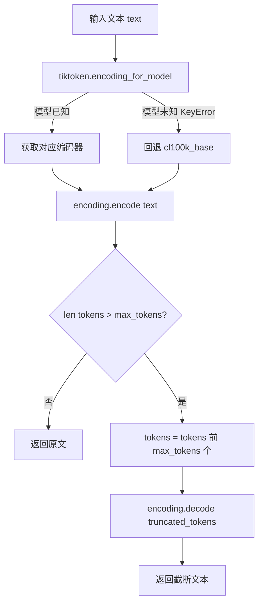
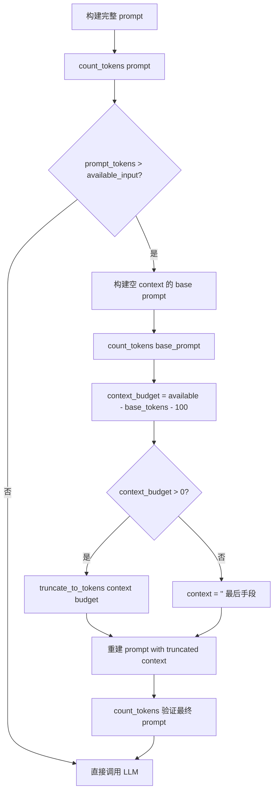

# PD-01.17 FastCode — 双层 Token 预算与自适应行数控制

> 文档编号：PD-01.17
> 来源：FastCode `fastcode/answer_generator.py` `fastcode/iterative_agent.py` `fastcode/utils.py`
> GitHub：https://github.com/HKUDS/FastCode.git
> 问题域：PD-01 上下文管理 Context Window Management
> 状态：可复用方案

---

## 第 1 章 问题与动机

### 1.1 核心问题

代码问答系统面临双重上下文压力：

1. **LLM 输入层**：将检索到的代码片段 + 系统提示 + 对话历史拼装成 prompt 时，总 token 数可能超过模型上下文窗口（200K）。需要在调用前精确估算并截断。
2. **检索层**：迭代检索过程中，每轮新增的代码行数会累积膨胀。如果不加控制，最终送入 LLM 的代码量远超必要，既浪费 token 又引入噪声。

FastCode 的独特之处在于它同时在两个层面实施预算管理——AnswerGenerator 管 token 预算，IterativeAgent 管行数预算——形成"双层漏斗"架构。

### 1.2 FastCode 的解法概述

1. **tiktoken 精确计数**：通过 `count_tokens()` 使用 tiktoken 对 prompt 进行精确 token 计数，支持模型自适应编码器选择（`fastcode/utils.py:90-100`）
2. **三段式 token 预算公式**：`available_input = max_context_tokens - max_tokens - reserve_tokens`，将 200K 窗口分为输入区、输出区、安全边际三段（`fastcode/answer_generator.py:106`）
3. **上下文优先截断**：超限时先计算 base prompt（不含 context）的 token 数，再将剩余预算分配给 context，从尾部截断（`fastcode/answer_generator.py:117-130`）
4. **自适应行数预算**：IterativeAgent 根据查询复杂度（0-100）动态调整行数预算，简单查询 60%、中等 80%、复杂 100%×repo_factor（`fastcode/iterative_agent.py:140-145`）
5. **多维停止决策**：结合置信度阈值、行数预算、ROI 分析、停滞检测四重条件决定是否继续迭代（`fastcode/iterative_agent.py:2284-2368`）

### 1.3 设计思想

| 设计原则 | 具体实现 | 理由 | 替代方案 |
|----------|----------|------|----------|
| 精确优于估算 | tiktoken 编码后取 len(tokens) | 避免字符数/4 的粗略估算导致截断不足或浪费 | 字符数估算、API 返回的 usage |
| 双层漏斗 | Token 预算（LLM 层）+ 行数预算（检索层） | 检索层用行数更直观，LLM 层用 token 更精确 | 单层 token 控制 |
| 查询驱动预算 | 复杂度 0-30 给 60% 预算，60+ 给 100% | 简单查询不需要大量代码，节省成本 | 固定预算 |
| 安全边际分离 | reserve_tokens 独立于 max_tokens | 防止输出被截断，同时为 prompt 模板留余量 | 合并到 max_tokens |
| 优先保留头部 | 截断从尾部开始，保留前面的高相关代码 | 检索结果按相关度排序，头部最重要 | 均匀采样、摘要压缩 |

---

## 第 2 章 源码实现分析

### 2.1 架构概览

FastCode 的上下文管理分布在两个核心组件中，形成双层漏斗：

```
┌─────────────────────────────────────────────────────────┐
│                    IterativeAgent                        │
│  ┌─────────────────────────────────────────────────┐    │
│  │  行数预算层 (adaptive_line_budget)               │    │
│  │  ┌───────┐  ┌───────┐  ┌───────┐  ┌─────────┐  │    │
│  │  │Round 1│→│Round 2│→│Round N│→│smart_prune│  │    │
│  │  │检索   │  │检索   │  │检索   │  │智能裁剪  │  │    │
│  │  └───────┘  └───────┘  └───────┘  └─────────┘  │    │
│  │  budget_usage_pct 追踪 + ROI 分析 + 停滞检测    │    │
│  └─────────────────────────────────────────────────┘    │
│                         ↓ 最终 elements                  │
├─────────────────────────────────────────────────────────┤
│                   AnswerGenerator                        │
│  ┌─────────────────────────────────────────────────┐    │
│  │  Token 预算层 (max_context_tokens)              │    │
│  │  count_tokens → 超限? → 计算 context_budget     │    │
│  │  → truncate_to_tokens → 重建 prompt → 验证      │    │
│  └─────────────────────────────────────────────────┘    │
│                         ↓ 最终 prompt                    │
│                      LLM API 调用                        │
└─────────────────────────────────────────────────────────┘
```

### 2.2 核心实现

#### 2.2.1 tiktoken 精确计数与截断



对应源码 `fastcode/utils.py:90-115`：

```python
def count_tokens(text: str, model: str = "gpt-4") -> int:
    """Count tokens in text"""
    try:
        encoding = tiktoken.encoding_for_model(model)
    except KeyError:
        encoding = tiktoken.get_encoding("cl100k_base")
    
    # 允许特殊 token 字符串（如 <|endoftext|>）避免非英文场景报错
    return len(encoding.encode(text, disallowed_special=()))


def truncate_to_tokens(text: str, max_tokens: int, model: str = "gpt-4") -> str:
    """Truncate text to fit within token limit"""
    try:
        encoding = tiktoken.encoding_for_model(model)
    except KeyError:
        encoding = tiktoken.get_encoding("cl100k_base")
    
    tokens = encoding.encode(text, disallowed_special=())
    if len(tokens) <= max_tokens:
        return text
    
    truncated_tokens = tokens[:max_tokens]
    return encoding.decode(truncated_tokens)
```

关键细节：`disallowed_special=()` 允许所有特殊 token 字符串通过编码，这是处理多语言和代码混合文本的必要措施。

#### 2.2.2 AnswerGenerator 三段式 Token 预算



对应源码 `fastcode/answer_generator.py:100-141`：

```python
# Count tokens
prompt_tokens = count_tokens(prompt, self.model)
self.logger.info(f"Initial prompt tokens: {prompt_tokens}")

# Calculate available tokens for input
# Reserve tokens for: output (max_tokens) + safety margin
available_input_tokens = self.max_context_tokens - self.max_tokens - self.reserve_tokens

# Truncate if needed - keep front part, truncate from the end
if prompt_tokens > available_input_tokens:
    self.logger.warning(
        f"Prompt exceeds limit ({prompt_tokens} > {available_input_tokens} tokens). "
        f"Truncating context to fit. (max_context_tokens={self.max_context_tokens}, "
        f"max_tokens={self.max_tokens}, reserve={self.reserve_tokens})"
    )

    # Calculate tokens for each component to determine how much context we can keep
    system_prompt_sample = self._build_prompt(query, "", query_info, dialogue_history)
    base_tokens = count_tokens(system_prompt_sample, self.model)
    context_token_budget = available_input_tokens - base_tokens - 100  # Extra safety margin

    if context_token_budget > 0:
        context = self._truncate_context(context, context_token_budget)
        self.logger.info(f"Context truncated to ~{context_token_budget} tokens")
    else:
        self.logger.error(
            f"Cannot fit prompt even without context! "
            f"Base tokens: {base_tokens}, available: {available_input_tokens}"
        )
        context = ""  # Last resort

    # Rebuild prompt with truncated context
    prompt = self._build_prompt(query, context, query_info, dialogue_history)

    # Verify final token count
    final_prompt_tokens = count_tokens(prompt, self.model)
    self.logger.info(f"Final prompt tokens after truncation: {final_prompt_tokens}")
```

预算公式拆解（默认配置 `config/config.yaml:149-151`）：
- `max_context_tokens = 200000`（模型窗口上限）
- `max_tokens = 20000`（输出预留）
- `reserve_tokens = 10000`（安全边际）
- **可用输入 = 200000 - 20000 - 10000 = 170000 tokens**

### 2.3 实现细节

#### 2.3.1 自适应行数预算（IterativeAgent）

IterativeAgent 在检索层使用"行数"而非"token"作为预算单位，因为代码检索的粒度是代码元素（函数、类），行数比 token 更直观。

核心逻辑在 `fastcode/iterative_agent.py:109-152`：

```python
def _initialize_adaptive_parameters(self, query_complexity: int):
    # Calculate repo complexity factor
    repo_factor = self._calculate_repo_factor()
    
    # Adaptive line budget: scales with complexity
    if query_complexity <= 30:
        self.adaptive_line_budget = int(self.max_total_lines * 0.6)  # 6000 lines
    elif query_complexity <= 60:
        self.adaptive_line_budget = int(self.max_total_lines * 0.8)  # 8000 lines
    else:
        self.adaptive_line_budget = int(self.max_total_lines * 1.0 * repo_factor)
```

预算分配矩阵：

| 查询复杂度 | 行数预算 | 占基准比例 | 典型场景 |
|-----------|---------|-----------|---------|
| 0-30（简单） | 7,200 行 | 60% | "这个函数做什么" |
| 31-60（中等） | 9,600 行 | 80% | "这个模块的架构" |
| 61-100（复杂） | 12,000×repo_factor | 100%+ | "跨模块调用链分析" |

#### 2.3.2 多维停止决策

IterativeAgent 的 `_should_continue_iteration` 方法（`fastcode/iterative_agent.py:2270-2368`）实现了 6 重停止检查：

1. **置信度达标**：confidence >= threshold（自适应阈值 90-95）
2. **迭代次数上限**：current_round >= max_iterations（自适应 2-6 轮）
3. **行数预算耗尽**：total_lines >= adaptive_line_budget
4. **停滞检测**：连续两轮 |confidence_gain| < 1.0
5. **连续低效**：连续两轮 low_performance（显著下降或低 ROI）
6. **严格停滞**：最近 3 轮置信度波动 < 2

#### 2.3.3 智能裁剪（Smart Prune）

当行数超预算时，`_smart_prune_elements`（`fastcode/iterative_agent.py:1971-2014`）按优先级评分裁剪：

```python
# 优先级因子：
# 1. 检索相关度分数 (0-1)
# 2. 来源加分：agent_found +0.3 > llm_selected +0.2 > semantic +0.15
# 3. 元素类型：function +0.2 > class +0.15 > file +0.05
# 4. 代码大小惩罚：行数越多惩罚越大（鼓励精准片段）
```

按评分降序选取，直到行数预算用完，但至少保留 5 个元素确保最低覆盖。


---

## 第 3 章 迁移指南

### 3.1 迁移清单

**阶段 1：Token 精确计数基础设施**
- [ ] 安装 tiktoken：`pip install tiktoken`
- [ ] 实现 `count_tokens(text, model)` 和 `truncate_to_tokens(text, max_tokens, model)` 工具函数
- [ ] 在 LLM 调用前集成 token 计数检查

**阶段 2：三段式 Token 预算**
- [ ] 在配置中定义 `max_context_tokens`、`max_tokens`（输出）、`reserve_tokens`（安全边际）
- [ ] 实现 prompt 构建 → 计数 → 超限截断 → 重建 → 验证 的完整流程
- [ ] 截断策略：先计算 base prompt（不含动态内容）的 token 数，剩余分配给动态内容

**阶段 3：自适应行数预算（可选，适用于迭代检索场景）**
- [ ] 定义查询复杂度评估逻辑（可用 LLM 评估或规则匹配）
- [ ] 实现 `adaptive_line_budget = base_budget × complexity_factor × repo_factor`
- [ ] 在每轮检索后追踪 budget_usage_pct，超预算时触发智能裁剪

### 3.2 适配代码模板

#### 模板 1：Token 预算管理器（可直接复用）

```python
import tiktoken
from typing import Optional, Tuple
from dataclasses import dataclass


@dataclass
class TokenBudgetConfig:
    """Token 预算配置"""
    max_context_tokens: int = 200000    # 模型窗口上限
    max_output_tokens: int = 20000      # 输出预留
    reserve_tokens: int = 10000         # 安全边际
    safety_margin: int = 100            # 额外安全余量

    @property
    def available_input_tokens(self) -> int:
        return self.max_context_tokens - self.max_output_tokens - self.reserve_tokens


class TokenBudgetManager:
    """双层 Token 预算管理器 — 移植自 FastCode"""

    def __init__(self, config: TokenBudgetConfig, model: str = "gpt-4"):
        self.config = config
        self.model = model
        self._encoding = self._get_encoding(model)

    def _get_encoding(self, model: str):
        try:
            return tiktoken.encoding_for_model(model)
        except KeyError:
            return tiktoken.get_encoding("cl100k_base")

    def count_tokens(self, text: str) -> int:
        """精确计数 token 数"""
        return len(self._encoding.encode(text, disallowed_special=()))

    def truncate_to_tokens(self, text: str, max_tokens: int) -> str:
        """截断文本到指定 token 数"""
        tokens = self._encoding.encode(text, disallowed_special=())
        if len(tokens) <= max_tokens:
            return text
        return self._encoding.decode(tokens[:max_tokens])

    def fit_prompt(
        self,
        base_prompt: str,
        dynamic_content: str,
        prompt_builder: callable
    ) -> Tuple[str, int]:
        """
        将动态内容适配到 token 预算内。

        Args:
            base_prompt: 不含动态内容的基础 prompt
            dynamic_content: 需要截断的动态内容（如检索到的代码）
            prompt_builder: 接受 (dynamic_content) 返回完整 prompt 的函数

        Returns:
            (最终 prompt, 实际 token 数)
        """
        full_prompt = prompt_builder(dynamic_content)
        prompt_tokens = self.count_tokens(full_prompt)
        available = self.config.available_input_tokens

        if prompt_tokens <= available:
            return full_prompt, prompt_tokens

        # 计算 base prompt 占用
        base_tokens = self.count_tokens(base_prompt)
        content_budget = available - base_tokens - self.config.safety_margin

        if content_budget > 0:
            truncated = self.truncate_to_tokens(dynamic_content, content_budget)
        else:
            truncated = ""  # 极端情况：base prompt 已超限

        final_prompt = prompt_builder(truncated)
        final_tokens = self.count_tokens(final_prompt)
        return final_prompt, final_tokens
```

#### 模板 2：自适应行数预算控制器

```python
from dataclasses import dataclass, field
from typing import List, Dict, Any


@dataclass
class LineBudgetConfig:
    """行数预算配置"""
    max_total_lines: int = 12000
    complexity_thresholds: Dict[str, float] = field(default_factory=lambda: {
        "simple": 0.6,    # 复杂度 0-30
        "medium": 0.8,    # 复杂度 31-60
        "complex": 1.0,   # 复杂度 61+
    })


class AdaptiveLineBudget:
    """自适应行数预算 — 移植自 FastCode IterativeAgent"""

    def __init__(self, config: LineBudgetConfig):
        self.config = config
        self.budget = config.max_total_lines
        self.used_lines = 0
        self.history: List[Dict[str, Any]] = []

    def initialize(self, query_complexity: int, repo_factor: float = 1.0):
        """根据查询复杂度初始化预算"""
        if query_complexity <= 30:
            ratio = self.config.complexity_thresholds["simple"]
        elif query_complexity <= 60:
            ratio = self.config.complexity_thresholds["medium"]
        else:
            ratio = self.config.complexity_thresholds["complex"]

        self.budget = int(self.config.max_total_lines * ratio * repo_factor)
        self.used_lines = 0

    def can_add(self, lines: int) -> bool:
        """检查是否还有预算"""
        return self.used_lines + lines <= self.budget

    def add(self, lines: int, round_num: int, confidence_gain: float):
        """记录新增行数"""
        self.used_lines += lines
        roi = (confidence_gain / lines * 1000) if lines > 0 else 0.0
        self.history.append({
            "round": round_num,
            "lines_added": lines,
            "total_lines": self.used_lines,
            "confidence_gain": confidence_gain,
            "roi": roi,
            "budget_usage_pct": (self.used_lines / self.budget) * 100,
        })

    @property
    def remaining(self) -> int:
        return max(0, self.budget - self.used_lines)

    @property
    def usage_pct(self) -> float:
        return (self.used_lines / self.budget) * 100 if self.budget > 0 else 100.0
```

### 3.3 适用场景

| 场景 | 适用度 | 说明 |
|------|--------|------|
| RAG 代码问答系统 | ⭐⭐⭐ | 完美匹配：检索代码 + LLM 生成答案 |
| 迭代式 Agent 检索 | ⭐⭐⭐ | 行数预算 + 多维停止决策直接可用 |
| 单轮 LLM 调用 | ⭐⭐ | Token 预算部分可用，行数预算不需要 |
| 多模态上下文 | ⭐ | 仅处理文本 token，不涉及图片/音频 |
| 非 OpenAI tokenizer 模型 | ⭐⭐ | tiktoken 回退 cl100k_base，但非 GPT 系模型精度有偏差 |

---

## 第 4 章 测试用例

```python
import pytest
from unittest.mock import MagicMock


class TestCountTokens:
    """测试 token 精确计数 — 基于 fastcode/utils.py:90-100"""

    def test_empty_string(self):
        from fastcode.utils import count_tokens
        assert count_tokens("", "gpt-4") == 0

    def test_known_token_count(self):
        from fastcode.utils import count_tokens
        # "hello world" 在 cl100k_base 中是 2 个 token
        result = count_tokens("hello world", "gpt-4")
        assert result == 2

    def test_unknown_model_fallback(self):
        """未知模型应回退到 cl100k_base"""
        from fastcode.utils import count_tokens
        result = count_tokens("hello world", "unknown-model-xyz")
        assert result == 2  # cl100k_base 编码结果

    def test_special_tokens_allowed(self):
        """包含特殊 token 字符串不应报错"""
        from fastcode.utils import count_tokens
        text = "some text <|endoftext|> more text"
        result = count_tokens(text, "gpt-4")
        assert result > 0  # 不抛异常即可


class TestTruncateToTokens:
    """测试 token 截断 — 基于 fastcode/utils.py:103-115"""

    def test_no_truncation_needed(self):
        from fastcode.utils import truncate_to_tokens
        text = "short text"
        result = truncate_to_tokens(text, 100, "gpt-4")
        assert result == text

    def test_truncation_applied(self):
        from fastcode.utils import truncate_to_tokens, count_tokens
        long_text = "word " * 1000  # ~1000 tokens
        result = truncate_to_tokens(long_text, 50, "gpt-4")
        assert count_tokens(result, "gpt-4") <= 50

    def test_truncation_preserves_prefix(self):
        """截断应保留文本前部"""
        from fastcode.utils import truncate_to_tokens
        text = "KEEP_THIS " * 10 + "TRUNCATE_THIS " * 1000
        result = truncate_to_tokens(text, 20, "gpt-4")
        assert result.startswith("KEEP_THIS")


class TestTokenBudgetFormula:
    """测试三段式预算公式 — 基于 answer_generator.py:106"""

    def test_default_budget(self):
        """默认配置：200K - 20K - 10K = 170K"""
        max_context = 200000
        max_tokens = 20000
        reserve = 10000
        available = max_context - max_tokens - reserve
        assert available == 170000

    def test_context_budget_calculation(self):
        """上下文预算 = 可用输入 - base_prompt - 安全余量"""
        available_input = 170000
        base_tokens = 5000
        safety_margin = 100
        context_budget = available_input - base_tokens - safety_margin
        assert context_budget == 164900

    def test_context_budget_negative_fallback(self):
        """base_prompt 超限时 context 应为空"""
        available_input = 170000
        base_tokens = 180000  # 超过可用输入
        safety_margin = 100
        context_budget = available_input - base_tokens - safety_margin
        assert context_budget < 0
        # FastCode 此时设置 context = ""


class TestAdaptiveLineBudget:
    """测试自适应行数预算 — 基于 iterative_agent.py:109-152"""

    def test_simple_query_budget(self):
        """简单查询应获得 60% 预算"""
        max_total_lines = 12000
        query_complexity = 20
        expected = int(max_total_lines * 0.6)
        assert expected == 7200

    def test_medium_query_budget(self):
        """中等查询应获得 80% 预算"""
        max_total_lines = 12000
        query_complexity = 50
        expected = int(max_total_lines * 0.8)
        assert expected == 9600

    def test_complex_query_with_repo_factor(self):
        """复杂查询预算受 repo_factor 影响"""
        max_total_lines = 12000
        query_complexity = 80
        repo_factor = 1.5
        expected = int(max_total_lines * 1.0 * repo_factor)
        assert expected == 18000

    def test_budget_usage_tracking(self):
        """预算使用率应正确追踪"""
        budget = 10000
        total_lines = 7500
        usage_pct = (total_lines / budget) * 100
        assert usage_pct == 75.0
```


---

## 第 5 章 跨域关联

| 关联域 | 关系类型 | 说明 |
|--------|----------|------|
| PD-04 工具系统 | 协同 | IterativeAgent 的 AgentTools 提供 read_file/search 等工具，工具返回的内容直接受行数预算约束 |
| PD-08 搜索与检索 | 依赖 | 行数预算控制的是检索结果的总量，检索质量决定了预算的利用效率（ROI） |
| PD-11 可观测性 | 协同 | iteration_metadata 输出 budget_usage_pct、ROI、stopping_reason 等指标，可直接接入监控 |
| PD-03 容错与重试 | 协同 | token 计数失败时回退 cl100k_base，context_budget < 0 时降级为空 context |
| PD-12 推理增强 | 互斥 | 推理增强（如 CoT）会消耗更多输出 token，需要调大 reserve_tokens 压缩输入预算 |

---

## 第 6 章 来源文件索引

| 文件 | 行范围 | 关键实现 |
|------|--------|----------|
| `fastcode/utils.py` | L90-L115 | count_tokens + truncate_to_tokens（tiktoken 精确计数与截断） |
| `fastcode/answer_generator.py` | L21-L33 | AnswerGenerator.__init__（预算参数初始化） |
| `fastcode/answer_generator.py` | L100-L141 | generate() 中的 token 预算检查与截断流程 |
| `fastcode/answer_generator.py` | L227-L256 | generate_stream() 中的同逻辑截断（流式版本） |
| `fastcode/answer_generator.py` | L631-L633 | _truncate_context 委托 truncate_to_tokens |
| `fastcode/iterative_agent.py` | L46-L65 | IterativeAgent.__init__（行数预算参数） |
| `fastcode/iterative_agent.py` | L109-L152 | _initialize_adaptive_parameters（自适应预算计算） |
| `fastcode/iterative_agent.py` | L1971-L2014 | _smart_prune_elements（智能裁剪） |
| `fastcode/iterative_agent.py` | L2270-L2368 | _should_continue_iteration（多维停止决策） |
| `fastcode/iterative_agent.py` | L2432-L2452 | _calculate_repo_factor（仓库复杂度因子） |
| `fastcode/iterative_agent.py` | L2461-L2470 | _calculate_total_lines（行数统计） |
| `config/config.yaml` | L149-L151 | max_context_tokens / reserve_tokens_for_response 配置 |
| `config/config.yaml` | L170-L180 | agent.iterative 配置（max_iterations / max_total_lines） |

---

## 第 7 章 横向对比维度

> **重要：** 本章用于自动填充 Butcher Wiki 的横向对比表。

```json comparison_data
{
  "project": "FastCode",
  "dimensions": {
    "估算方式": "tiktoken 精确编码计数，模型自适应 + cl100k_base 回退",
    "压缩策略": "无摘要压缩，直接从尾部截断 context 保留头部高相关内容",
    "触发机制": "prompt_tokens > available_input_tokens 时触发截断",
    "实现位置": "AnswerGenerator（token 层）+ IterativeAgent（行数层）双层",
    "容错设计": "未知模型回退 cl100k_base，context_budget<0 时降级空 context",
    "保留策略": "保留头部（高相关度），尾部截断；智能裁剪按优先级评分选取",
    "累计预算": "IterativeAgent 跨轮追踪 total_lines 和 budget_usage_pct",
    "分割粒度": "检索层按代码元素（函数/类）粒度，LLM 层按 token 粒度",
    "查询驱动预算": "按查询复杂度 0-100 动态分配 60%-100% 行数预算",
    "多维停止决策": "置信度+行数+ROI+停滞+连续低效+严格停滞 6 重检查"
  }
}
```

### 域元数据补充

```json domain_metadata
{
  "solution_summary": "FastCode 用 tiktoken 精确计数 + 三段式 token 预算（200K-20K-10K）管理 LLM 输入，IterativeAgent 按查询复杂度动态分配 60%-100% 行数预算并通过 6 重停止条件控制迭代检索",
  "description": "代码问答场景下检索层与 LLM 层的双层预算协同管理",
  "sub_problems": [
    "查询驱动预算分配：根据查询复杂度评分动态调整上下文预算比例",
    "检索 ROI 量化：用 confidence_gain/lines_added 衡量每轮检索的成本效益",
    "智能裁剪优先级：按来源类型×元素类型×相关度评分的多因子优先级裁剪超预算内容"
  ],
  "best_practices": [
    "双层漏斗优于单层控制：检索层用行数预算粗筛，LLM 层用 token 预算精裁",
    "安全边际独立配置：reserve_tokens 与 max_tokens 分离，避免输出截断",
    "截断后必须验证：重建 prompt 后再次 count_tokens 确认未超限"
  ]
}
```

