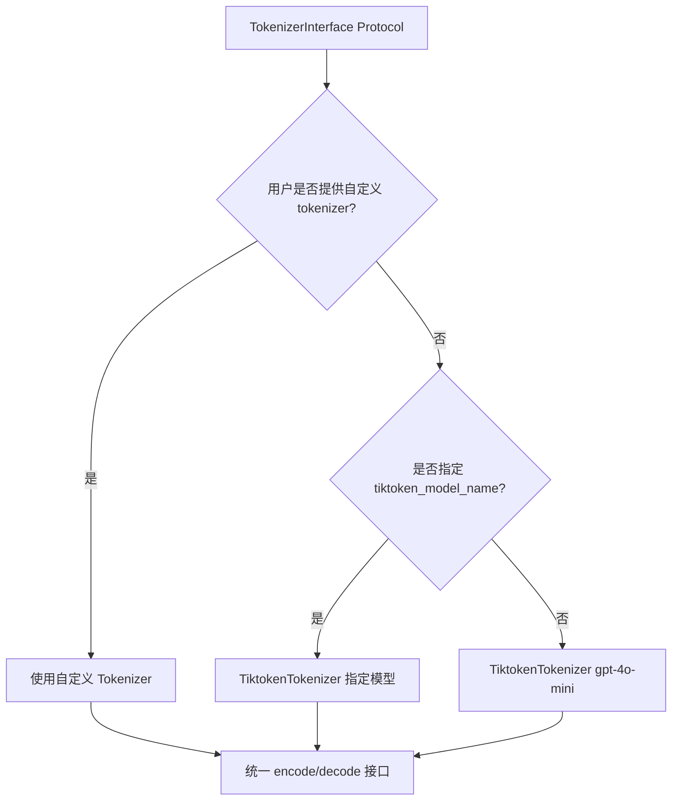
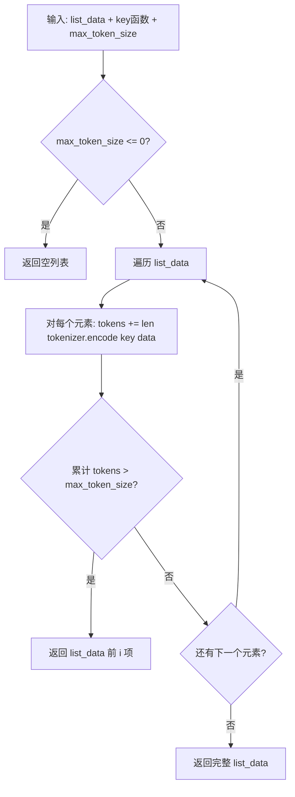
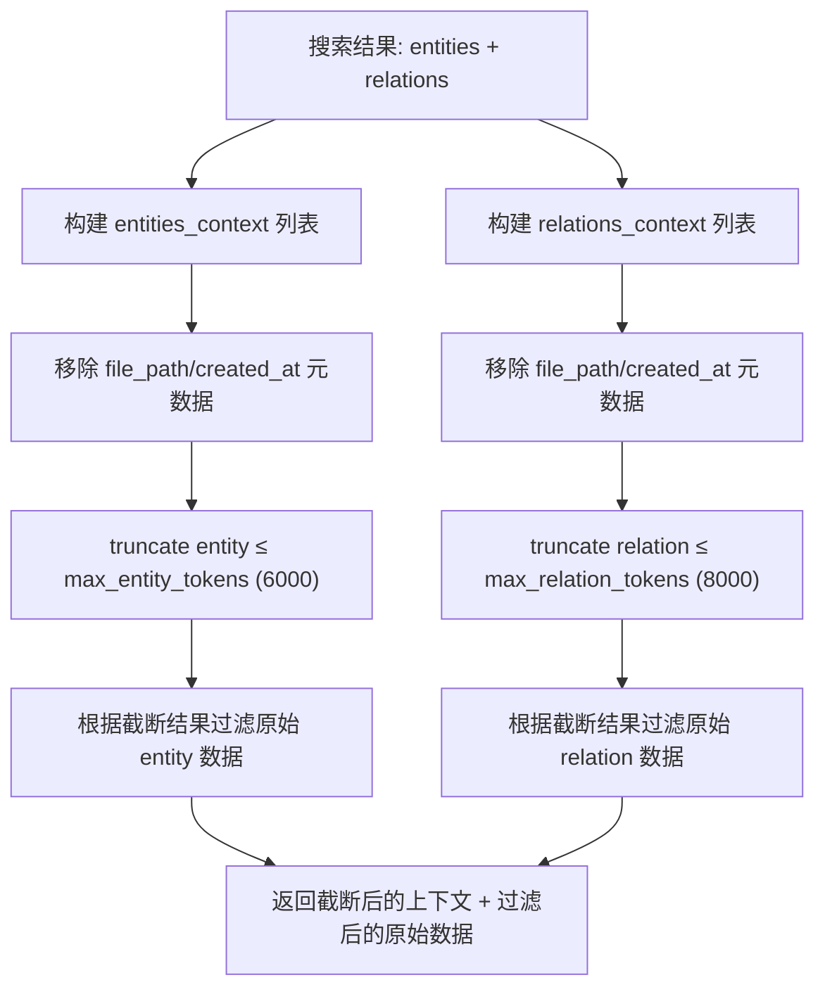
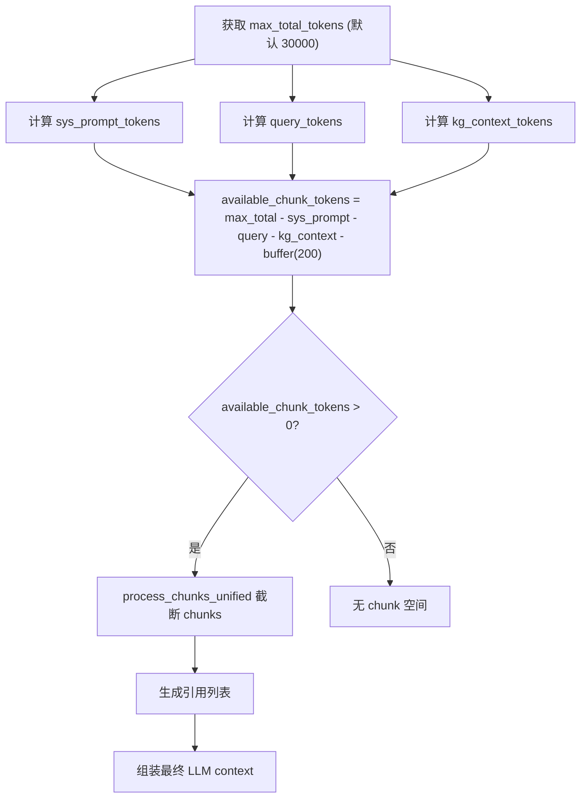

# PD-01.06 LightRAG — 三级 Token 预算截断

> 文档编号：PD-01.06
> 来源：LightRAG `lightrag/operate.py`, `lightrag/utils.py`, `lightrag/constants.py`
> GitHub：https://github.com/HKUDS/LightRAG.git
> 问题域：PD-01 上下文管理 Context Window Management
> 状态：可复用方案

---

## 第 1 章 问题与动机

### 1.1 核心问题

RAG 系统在检索阶段会从知识图谱和向量数据库中拉取大量实体（entity）、关系（relation）和文本块（chunk）。这些检索结果的总 token 数往往远超 LLM 的上下文窗口限制。如果不加控制地将所有检索结果塞入 prompt，会导致：

1. **超出模型上下文窗口**：直接报错或被 API 截断，丢失关键信息
2. **注意力稀释**：过长的上下文导致 LLM 对关键信息的注意力下降（Lost in the Middle 问题）
3. **成本失控**：输入 token 越多，API 调用费用越高
4. **延迟增加**：更长的 prompt 意味着更慢的推理速度

LightRAG 作为一个基于知识图谱的 RAG 框架，其检索结果天然包含三种异构数据类型（实体、关系、文本块），每种类型的信息密度和重要性不同，需要差异化的 token 预算管理。

### 1.2 LightRAG 的解法概述

LightRAG 采用**三级 Token 预算截断**策略，核心思路是为不同类型的检索上下文分配独立的 token 预算，通过 tiktoken 精确计量后按优先级截断：

1. **精确 token 计量**：使用 tiktoken（默认 gpt-4o-mini 编码器）对每条检索结果精确编码计数，而非字符数估算（`lightrag/utils.py:1350-1364`）
2. **三类独立预算**：entity 预算 6000 token、relation 预算 8000 token、总预算 30000 token，各自独立控制（`lightrag/constants.py:49-51`）
3. **动态剩余分配**：总预算减去系统 prompt、query、KG 上下文和安全缓冲后，剩余 token 动态分配给文本块（`lightrag/operate.py:3980-3982`）
4. **4 阶段流水线**：Search → Truncate → Merge → Build Context，截断发生在合并之前，避免无效合并（`lightrag/operate.py:4098-4099`）
5. **200 token 安全缓冲**：为引用列表和格式开销预留固定缓冲区（`lightrag/operate.py:3979`）

### 1.3 设计思想

| 设计原则 | 具体实现 | 理由 | 替代方案 |
|----------|----------|------|----------|
| 精确计量优于估算 | tiktoken 编码后 len() 计数 | 字符数/词数估算误差大，尤其中文场景 | 按字符数 ÷ 4 估算 |
| 分类预算优于统一预算 | entity/relation/chunk 三级独立预算 | 不同类型信息密度不同，统一预算会导致某类信息被过度截断 | 所有检索结果共享一个 token 上限 |
| 截断优于压缩 | 按优先级丢弃低优先级条目 | 截断保持原始信息完整性，压缩可能引入噪声 | LLM 摘要压缩 |
| 动态分配优于静态分配 | chunk 预算 = 总预算 - 已用 token | 不同 query 的 KG 上下文大小不同，静态分配浪费空间 | 固定 chunk 预算 |
| 先截断后合并 | 4 阶段流水线中截断在 Stage 2 | 避免合并大量最终会被丢弃的 chunk，节省计算 | 先合并后截断 |

---

## 第 2 章 源码实现分析

### 2.1 架构概览

LightRAG 的上下文管理贯穿从文档插入到查询响应的全流程，核心架构如下：

```
┌─────────────────────────────────────────────────────────────────┐
│                    LightRAG 上下文管理架构                        │
├─────────────────────────────────────────────────────────────────┤
│                                                                 │
│  ┌──────────────┐    ┌──────────────┐    ┌──────────────┐      │
│  │  文档插入阶段  │    │  实体提取阶段  │    │  查询响应阶段  │      │
│  │              │    │              │    │              │      │
│  │ chunk_token  │    │ max_extract  │    │ 三级预算截断  │      │
│  │ _size=1200   │    │ _input=20480 │    │              │      │
│  └──────┬───────┘    └──────┬───────┘    └──────┬───────┘      │
│         │                   │                   │              │
│         ▼                   ▼                   ▼              │
│  ┌──────────────────────────────────────────────────────┐      │
│  │              TiktokenTokenizer (gpt-4o-mini)          │      │
│  │              统一 token 计量基础设施                     │      │
│  └──────────────────────────────────────────────────────┘      │
│         │                   │                   │              │
│         ▼                   ▼                   ▼              │
│  truncate_list_by    ChunkTokenLimit     _apply_token_         │
│  _token_size()       ExceededError       truncation()          │
│                                          _build_context_str()  │
└─────────────────────────────────────────────────────────────────┘
```

查询阶段的 4 阶段流水线是上下文管理的核心：

```
┌──────────┐    ┌──────────────┐    ┌──────────────┐    ┌──────────────┐
│ Stage 1  │    │   Stage 2    │    │   Stage 3    │    │   Stage 4    │
│  Search  │───→│  Truncate    │───→│    Merge     │───→│ Build Context│
│          │    │              │    │              │    │              │
│ KG检索   │    │ entity≤6000  │    │ 合并去重chunk │    │ 动态分配chunk │
│ 向量检索  │    │ relation≤8000│    │              │    │ 预算=总-已用  │
└──────────┘    └──────────────┘    └──────────────┘    └──────────────┘
```

### 2.2 核心实现

#### 2.2.1 Tokenizer 抽象层

LightRAG 设计了一个可插拔的 Tokenizer 接口，默认使用 tiktoken：



对应源码 `lightrag/utils.py:1245-1327`：

```python
class TokenizerInterface(Protocol):
    """Defines the interface for a tokenizer."""
    def encode(self, content: str) -> List[int]: ...
    def decode(self, tokens: List[int]) -> str: ...

class Tokenizer:
    """A wrapper around a tokenizer to provide a consistent interface."""
    def __init__(self, model_name: str, tokenizer: TokenizerInterface):
        self.model_name: str = model_name
        self.tokenizer: TokenizerInterface = tokenizer

    def encode(self, content: str) -> List[int]:
        return self.tokenizer.encode(content)

    def decode(self, tokens: List[int]) -> str:
        return self.tokenizer.decode(tokens)

class TiktokenTokenizer(Tokenizer):
    def __init__(self, model_name: str = "gpt-4o-mini"):
        import tiktoken
        tokenizer = tiktoken.encoding_for_model(model_name)
        super().__init__(model_name=model_name, tokenizer=tokenizer)
```

#### 2.2.2 核心截断函数 truncate_list_by_token_size

这是整个上下文管理的基础原语，所有截断操作都调用它：



对应源码 `lightrag/utils.py:1350-1364`：

```python
def truncate_list_by_token_size(
    list_data: list[Any],
    key: Callable[[Any], str],
    max_token_size: int,
    tokenizer: Tokenizer,
) -> list[int]:
    """Truncate a list of data by token size"""
    if max_token_size <= 0:
        return []
    tokens = 0
    for i, data in enumerate(list_data):
        tokens += len(tokenizer.encode(key(data)))
        if tokens > max_token_size:
            return list_data[:i]
    return list_data
```

关键设计点：
- **贪心截断**：按列表顺序逐条累加，超限时截断到前 i 项（不含第 i 项）
- **key 函数抽象**：通过 lambda 支持不同数据结构的 token 计算方式
- **零预算保护**：`max_token_size <= 0` 直接返回空列表

#### 2.2.3 三级预算截断（Stage 2）

`_apply_token_truncation` 函数对 entity 和 relation 分别应用独立预算：



对应源码 `lightrag/operate.py:3630-3798`：

```python
async def _apply_token_truncation(
    search_result: dict[str, Any],
    query_param: QueryParam,
    global_config: dict[str, str],
) -> dict[str, Any]:
    """Apply token-based truncation to entities and relations for LLM efficiency."""
    tokenizer = global_config.get("tokenizer")
    # Get token limits from query_param with fallbacks
    max_entity_tokens = getattr(
        query_param, "max_entity_tokens",
        global_config.get("max_entity_tokens", DEFAULT_MAX_ENTITY_TOKENS),
    )
    max_relation_tokens = getattr(
        query_param, "max_relation_tokens",
        global_config.get("max_relation_tokens", DEFAULT_MAX_RELATION_TOKENS),
    )
    # ... 构建 entities_context 和 relations_context ...
    # 分别截断
    entities_context = truncate_list_by_token_size(
        entities_context_for_truncation,
        key=lambda x: "\n".join(
            json.dumps(item, ensure_ascii=False) for item in [x]
        ),
        max_token_size=max_entity_tokens,
        tokenizer=tokenizer,
    )
    relations_context = truncate_list_by_token_size(
        relations_context_for_truncation,
        key=lambda x: "\n".join(
            json.dumps(item, ensure_ascii=False) for item in [x]
        ),
        max_token_size=max_relation_tokens,
        tokenizer=tokenizer,
    )
```

#### 2.2.4 动态 Chunk 预算分配（Stage 4）

`_build_context_str` 函数计算剩余 token 预算并分配给文本块：



对应源码 `lightrag/operate.py:3903-3996`：

```python
async def _build_context_str(
    entities_context, relations_context, merged_chunks,
    query, query_param, global_config, ...
) -> tuple[str, dict[str, Any]]:
    tokenizer = global_config.get("tokenizer")
    max_total_tokens = getattr(
        query_param, "max_total_tokens",
        global_config.get("max_total_tokens", DEFAULT_MAX_TOTAL_TOKENS),
    )
    # 计算各部分 token 开销
    kg_context_tokens = len(tokenizer.encode(pre_kg_context))
    sys_prompt_tokens = len(tokenizer.encode(pre_sys_prompt))
    query_tokens = len(tokenizer.encode(query))
    buffer_tokens = 200  # 安全缓冲
    # 动态计算 chunk 可用预算
    available_chunk_tokens = max_total_tokens - (
        sys_prompt_tokens + kg_context_tokens + query_tokens + buffer_tokens
    )
    # 用动态预算截断 chunks
    truncated_chunks = await process_chunks_unified(
        query=query, unique_chunks=merged_chunks,
        query_param=query_param, global_config=global_config,
        source_type=query_param.mode,
        chunk_token_limit=available_chunk_tokens,
    )
```

### 2.3 实现细节

**Token 预算默认值体系**（`lightrag/constants.py:49-51`）：

| 参数 | 默认值 | 用途 |
|------|--------|------|
| `DEFAULT_MAX_ENTITY_TOKENS` | 6000 | 实体上下文 token 上限 |
| `DEFAULT_MAX_RELATION_TOKENS` | 8000 | 关系上下文 token 上限 |
| `DEFAULT_MAX_TOTAL_TOKENS` | 30000 | 总上下文 token 上限 |
| `DEFAULT_SUMMARY_CONTEXT_SIZE` | 12000 | 摘要输入 token 上限 |
| `DEFAULT_MAX_EXTRACT_INPUT_TOKENS` | 20480 | 实体提取输入 token 上限 |
| `DEFAULT_SUMMARY_MAX_TOKENS` | 1200 | 摘要输出 token 上限 |

**元数据剥离优化**：截断计算时移除 `file_path` 和 `created_at` 字段（`operate.py:3723-3729`），避免元数据占用 token 预算。截断后再通过 entity name / relation pair 反查原始数据，保持数据完整性。

**Chunk 处理统一管道**（`utils.py:2702-2808`）：`process_chunks_unified` 是一个 5 步管道：
1. Rerank（可选）→ 2. 最低分过滤 → 3. chunk_top_k 限制 → 4. Token 截断 → 5. 添加 ID

**插入阶段的 token 控制**：文档插入时，每个 chunk 的 token 数被精确记录（`lightrag.py:1235`），超过 `chunk_token_size` 的文本会被滑动窗口二次切分（`operate.py:131-139`），超限且不可切分时抛出 `ChunkTokenLimitExceededError`。

---

## 第 3 章 迁移指南

### 3.1 迁移清单

**阶段 1：基础设施（Tokenizer 抽象）**
- [ ] 定义 `TokenizerInterface` Protocol（encode/decode）
- [ ] 实现 `TiktokenTokenizer` 默认实现
- [ ] 在系统初始化时创建全局 tokenizer 实例
- [ ] 支持通过配置切换 tokenizer（适配不同 LLM 提供商）

**阶段 2：核心截断函数**
- [ ] 实现 `truncate_list_by_token_size` 通用截断函数
- [ ] 为不同数据类型定义 key 函数（entity/relation/chunk 各自的序列化方式）

**阶段 3：预算配置**
- [ ] 定义 token 预算常量（entity/relation/total）
- [ ] 支持通过环境变量或配置文件覆盖默认值
- [ ] 在 QueryParam 中暴露预算参数，支持按查询动态调整

**阶段 4：查询流水线集成**
- [ ] 在检索后、LLM 调用前插入截断阶段
- [ ] 实现动态 chunk 预算计算（总预算 - 已用 token）
- [ ] 添加 200 token 安全缓冲

### 3.2 适配代码模板

以下是一个可直接复用的三级预算截断实现：

```python
from typing import Any, Callable, List, Protocol
import json

class TokenizerProtocol(Protocol):
    def encode(self, content: str) -> List[int]: ...

def truncate_list_by_token_size(
    list_data: list[Any],
    key: Callable[[Any], str],
    max_token_size: int,
    tokenizer: TokenizerProtocol,
) -> list[Any]:
    """按 token 预算截断列表，保留前 N 项直到超出预算。"""
    if max_token_size <= 0:
        return []
    tokens = 0
    for i, data in enumerate(list_data):
        tokens += len(tokenizer.encode(key(data)))
        if tokens > max_token_size:
            return list_data[:i]
    return list_data

class ThreeTierTokenBudget:
    """三级 Token 预算管理器。"""

    def __init__(
        self,
        tokenizer: TokenizerProtocol,
        max_entity_tokens: int = 6000,
        max_relation_tokens: int = 8000,
        max_total_tokens: int = 30000,
        buffer_tokens: int = 200,
    ):
        self.tokenizer = tokenizer
        self.max_entity_tokens = max_entity_tokens
        self.max_relation_tokens = max_relation_tokens
        self.max_total_tokens = max_total_tokens
        self.buffer_tokens = buffer_tokens

    def truncate_entities(self, entities: list[dict]) -> list[dict]:
        return truncate_list_by_token_size(
            entities,
            key=lambda x: json.dumps(x, ensure_ascii=False),
            max_token_size=self.max_entity_tokens,
            tokenizer=self.tokenizer,
        )

    def truncate_relations(self, relations: list[dict]) -> list[dict]:
        return truncate_list_by_token_size(
            relations,
            key=lambda x: json.dumps(x, ensure_ascii=False),
            max_token_size=self.max_relation_tokens,
            tokenizer=self.tokenizer,
        )

    def calculate_chunk_budget(
        self,
        system_prompt: str,
        query: str,
        kg_context: str,
    ) -> int:
        """动态计算 chunk 可用 token 预算。"""
        used = (
            len(self.tokenizer.encode(system_prompt))
            + len(self.tokenizer.encode(query))
            + len(self.tokenizer.encode(kg_context))
            + self.buffer_tokens
        )
        return max(0, self.max_total_tokens - used)

    def truncate_chunks(self, chunks: list[dict], budget: int) -> list[dict]:
        return truncate_list_by_token_size(
            chunks,
            key=lambda x: json.dumps(x, ensure_ascii=False),
            max_token_size=budget,
            tokenizer=self.tokenizer,
        )
```

### 3.3 适用场景

| 场景 | 适用度 | 说明 |
|------|--------|------|
| 知识图谱 RAG 系统 | ⭐⭐⭐ | 天然适配，entity/relation/chunk 三类数据直接对应三级预算 |
| 普通向量 RAG | ⭐⭐ | 可简化为两级（chunk + system prompt），动态预算分配仍有价值 |
| 多轮对话系统 | ⭐⭐ | 需扩展为 history/tool_result/system 三级，截断逻辑可复用 |
| Agent 工具调用 | ⭐ | 工具结果的截断需要更复杂的优先级策略，简单贪心截断不够 |
| 流式长文档生成 | ⭐ | 不适用，该方案面向检索上下文截断，非生成过程控制 |

---

## 第 4 章 测试用例

```python
import json
import pytest
from unittest.mock import MagicMock

class FakeTokenizer:
    """模拟 tokenizer，每个字符算 1 个 token（简化测试）。"""
    def encode(self, content: str) -> list[int]:
        return list(range(len(content)))

def truncate_list_by_token_size(list_data, key, max_token_size, tokenizer):
    if max_token_size <= 0:
        return []
    tokens = 0
    for i, data in enumerate(list_data):
        tokens += len(tokenizer.encode(key(data)))
        if tokens > max_token_size:
            return list_data[:i]
    return list_data

class TestTruncateListByTokenSize:
    """测试核心截断函数。"""

    def setup_method(self):
        self.tokenizer = FakeTokenizer()
        self.key = lambda x: json.dumps(x, ensure_ascii=False)

    def test_normal_truncation(self):
        """正常截断：超出预算时截断到前 N 项。"""
        data = [{"name": "A"}, {"name": "B"}, {"name": "C"}]
        result = truncate_list_by_token_size(
            data, self.key, max_token_size=30, tokenizer=self.tokenizer
        )
        assert len(result) < len(data)
        assert all(item in data for item in result)

    def test_zero_budget(self):
        """零预算返回空列表。"""
        data = [{"name": "A"}]
        result = truncate_list_by_token_size(
            data, self.key, max_token_size=0, tokenizer=self.tokenizer
        )
        assert result == []

    def test_negative_budget(self):
        """负预算返回空列表。"""
        result = truncate_list_by_token_size(
            [{"x": 1}], self.key, max_token_size=-10, tokenizer=self.tokenizer
        )
        assert result == []

    def test_all_fit(self):
        """所有数据都在预算内时返回完整列表。"""
        data = [{"a": 1}]
        result = truncate_list_by_token_size(
            data, self.key, max_token_size=10000, tokenizer=self.tokenizer
        )
        assert result == data

    def test_empty_list(self):
        """空列表输入返回空列表。"""
        result = truncate_list_by_token_size(
            [], self.key, max_token_size=100, tokenizer=self.tokenizer
        )
        assert result == []

    def test_first_item_exceeds_budget(self):
        """第一项就超出预算时返回空列表。"""
        data = [{"name": "x" * 1000}]
        result = truncate_list_by_token_size(
            data, self.key, max_token_size=10, tokenizer=self.tokenizer
        )
        assert result == []

class TestDynamicChunkBudget:
    """测试动态 chunk 预算计算。"""

    def setup_method(self):
        self.tokenizer = FakeTokenizer()

    def test_budget_calculation(self):
        """验证 chunk 预算 = 总预算 - 已用 token - 缓冲。"""
        max_total = 30000
        sys_prompt = "You are a helpful assistant."  # ~30 chars
        query = "What is LightRAG?"  # ~18 chars
        kg_context = "entity data here"  # ~16 chars
        buffer = 200

        used = (
            len(self.tokenizer.encode(sys_prompt))
            + len(self.tokenizer.encode(query))
            + len(self.tokenizer.encode(kg_context))
            + buffer
        )
        available = max_total - used
        assert available > 0
        assert available == 30000 - 30 - 18 - 16 - 200

    def test_budget_exhausted(self):
        """当已用 token 超过总预算时，chunk 预算为 0。"""
        max_total = 100
        sys_prompt = "x" * 80
        query = "y" * 30
        buffer = 200
        used = len(self.tokenizer.encode(sys_prompt)) + len(self.tokenizer.encode(query)) + buffer
        available = max(0, max_total - used)
        assert available == 0
```
