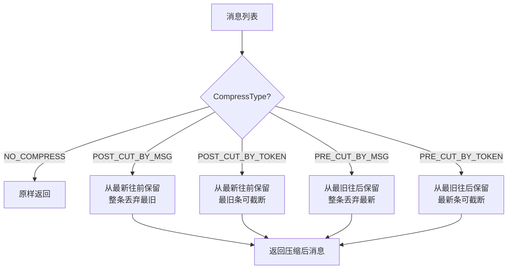
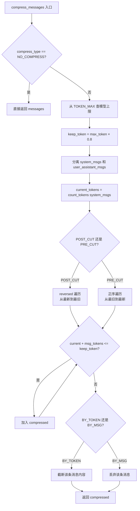
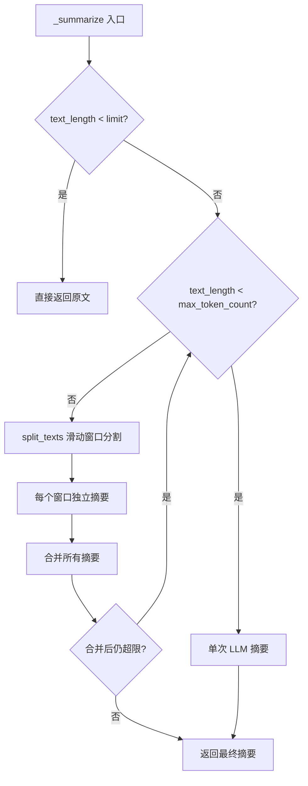

# PD-01.06 MetaGPT — BrainMemory 滑动窗口 + 4 策略消息压缩

> 文档编号：PD-01.06
> 来源：MetaGPT `metagpt/memory/brain_memory.py`, `metagpt/provider/base_llm.py`, `metagpt/configs/compress_msg_config.py`
> GitHub：https://github.com/FoundationAgents/MetaGPT.git
> 问题域：PD-01 上下文管理 Context Window Management
> 状态：可复用方案

---

## 第 1 章 问题与动机

### 1.1 核心问题

多 Agent 协作系统中，每个 Role（角色）在执行 Action 时都需要与 LLM 交互。随着对话轮次增加，历史消息会迅速膨胀超出模型上下文窗口。MetaGPT 面临的具体挑战：

1. **多角色对话累积**：ProductManager → Architect → Engineer → QA 链式执行，每个角色的对话历史都在增长
2. **多提供商差异**：支持 20+ LLM 提供商（OpenAI/Claude/Gemini/Qwen/DeepSeek 等），每个模型的上下文窗口从 4K 到 4M 不等
3. **长期记忆需求**：BrainMemory 用于 AgentStore 场景，需要跨会话保持记忆，但不能无限增长
4. **成本控制**：token 消耗直接关联费用，需要精确计量和预算控制

### 1.2 MetaGPT 的解法概述

MetaGPT 采用**三层上下文管理架构**：

1. **Token 精确计量层**（`token_counter.py:430-546`）：基于 tiktoken/anthropic SDK 的精确 token 计数，覆盖 100+ 模型的价格和上限表
2. **消息截断压缩层**（`base_llm.py:340-412`）：4 种 CompressType 策略，在 LLM 调用前自动裁剪消息，保留 system prompt + 按方向截断
3. **LLM 摘要压缩层**（`brain_memory.py:130-304`）：BrainMemory 的滑动窗口分割 + 递归 LLM 摘要，用于长期记忆场景

### 1.3 设计思想

| 设计原则 | 具体实现 | 理由 | 替代方案 |
|----------|----------|------|----------|
| 配置驱动压缩 | `LLMConfig.compress_type` 枚举选择策略 | 不同场景需要不同裁剪方向，配置化避免硬编码 | 固定策略（灵活性差） |
| System Prompt 永不裁剪 | `compress_messages` 始终保留 system 消息 | system prompt 定义角色行为，丢失会导致角色错乱 | 按比例裁剪所有消息 |
| 80% 阈值预留 | `threshold=0.8` 为输出预留 20% 空间 | 避免输入占满窗口导致输出被截断 | 动态计算输出预留 |
| 多提供商 tokenizer 适配 | Claude 用 anthropic SDK，OpenAI 用 tiktoken，其余用字符估算 | 不同模型 tokenizer 差异大，精确计数避免溢出 | 统一用字符数估算 |
| Redis 持久化记忆 | BrainMemory 通过 Redis 缓存，30 分钟 TTL | AgentStore 场景需要跨会话保持，Redis 提供高性能读写 | 文件存储（性能差） |

---

## 第 2 章 源码实现分析

### 2.1 架构概览

MetaGPT 的上下文管理分为三个独立但协作的子系统：

```
┌─────────────────────────────────────────────────────────────┐
│                    LLMConfig (配置层)                         │
│  compress_type: CompressType    max_token: 4096              │
│  context_length: Optional[int]  calc_usage: True             │
└──────────────┬──────────────────────────┬───────────────────┘
               │                          │
    ┌──────────▼──────────┐    ┌──────────▼──────────┐
    │   BaseLLM.aask()    │    │   BrainMemory       │
    │  (每次调用前压缩)    │    │  (长期记忆压缩)      │
    │                     │    │                     │
    │ compress_messages() │    │ summarize()         │
    │ count_tokens()      │    │ split_texts()       │
    └──────────┬──────────┘    └──────────┬──────────┘
               │                          │
    ┌──────────▼──────────┐    ┌──────────▼──────────┐
    │   token_counter     │    │   Redis Cache       │
    │  (精确计量)          │    │  (持久化存储)        │
    │                     │    │                     │
    │ tiktoken / anthropic│    │ 30min TTL           │
    │ TOKEN_MAX / COSTS   │    │ JSON 序列化          │
    └─────────────────────┘    └─────────────────────┘
```

### 2.2 核心实现

#### 2.2.1 CompressType 四策略枚举



对应源码 `metagpt/configs/compress_msg_config.py:1-33`：

```python
class CompressType(Enum):
    """
    Compression Type for messages. Used to compress messages under token limit.
    - "": No compression. Default value.
    - "post_cut_by_msg": Keep as many latest messages as possible.
    - "post_cut_by_token": Keep as many latest messages as possible
      and truncate the earliest fit-in message.
    - "pre_cut_by_msg": Keep as many earliest messages as possible.
    - "pre_cut_by_token": Keep as many earliest messages as possible
      and truncate the latest fit-in message.
    """
    NO_COMPRESS = ""
    POST_CUT_BY_MSG = "post_cut_by_msg"
    POST_CUT_BY_TOKEN = "post_cut_by_token"
    PRE_CUT_BY_MSG = "pre_cut_by_msg"
    PRE_CUT_BY_TOKEN = "pre_cut_by_token"
```

#### 2.2.2 BaseLLM.compress_messages — 核心压缩引擎



对应源码 `metagpt/provider/base_llm.py:340-412`：

```python
def compress_messages(
    self,
    messages: list[dict],
    compress_type: CompressType = CompressType.NO_COMPRESS,
    max_token: int = 128000,
    threshold: float = 0.8,
) -> list[dict]:
    if compress_type == CompressType.NO_COMPRESS:
        return messages

    max_token = TOKEN_MAX.get(self.model, max_token)
    keep_token = int(max_token * threshold)
    compressed = []

    # Always keep system messages
    system_msg_val = self._system_msg("")["role"]
    system_msgs = []
    for i, msg in enumerate(messages):
        if msg["role"] == system_msg_val:
            system_msgs.append(msg)
        else:
            user_assistant_msgs = messages[i:]
            break
    compressed.extend(system_msgs)
    current_token_count = self.count_tokens(system_msgs)

    if compress_type in [CompressType.POST_CUT_BY_TOKEN, CompressType.POST_CUT_BY_MSG]:
        for i, msg in enumerate(reversed(user_assistant_msgs)):
            token_count = self.count_tokens([msg])
            if current_token_count + token_count <= keep_token:
                compressed.insert(len(system_msgs), msg)
                current_token_count += token_count
            else:
                if compress_type == CompressType.POST_CUT_BY_TOKEN \
                   or len(compressed) == len(system_msgs):
                    truncated_content = msg["content"][
                        -(keep_token - current_token_count):
                    ]
                    compressed.insert(
                        len(system_msgs),
                        {"role": msg["role"], "content": truncated_content}
                    )
                break
    # PRE_CUT 分支对称实现...
    return compressed
```

#### 2.2.3 aask 调用链 — 压缩自动触发

在 `base_llm.py:207` 中，每次 `aask()` 调用都会自动触发压缩：

```python
compressed_message = self.compress_messages(
    message, compress_type=self.config.compress_type
)
rsp = await self.acompletion_text(
    compressed_message, stream=stream, timeout=self.get_timeout(timeout)
)
```

这意味着压缩对上层调用者完全透明——Role 和 Action 不需要关心 token 限制。

### 2.3 实现细节

#### BrainMemory 滑动窗口摘要

BrainMemory（`brain_memory.py:276-304`）实现了递归摘要压缩：



`split_texts`（`brain_memory.py:321-345`）使用带重叠的滑动窗口：

```python
@staticmethod
def split_texts(text: str, window_size) -> List[str]:
    """Splitting long text into sliding windows text"""
    if window_size <= 0:
        window_size = DEFAULT_TOKEN_SIZE  # 500
    padding_size = 20 if window_size > 20 else 0
    windows = []
    idx = 0
    data_len = window_size - padding_size
    while idx < total_len:
        w = text[idx : idx + window_size]
        windows.append(w)
        idx += data_len  # 步进 = 窗口 - 重叠
    return windows
```

窗口重叠 20 字符确保上下文连续性，避免在句子中间断裂导致信息丢失。

#### Token 精确计量的多提供商适配

`token_counter.py:430-507` 中 `count_message_tokens` 的分支逻辑：

- **Claude 系列**：调用 `anthropic.Client().beta.messages.count_tokens()`，需要 API key（`token_counter.py:416-427`）
- **OpenAI 系列**：使用 `tiktoken.encoding_for_model()`，精确到 `tokens_per_message` 和 `tokens_per_name` 的开销（`token_counter.py:469-506`）
- **其他模型**：fallback 到 `cl100k_base` 编码（`token_counter.py:438-439`）
- **BaseLLM 默认**：`len(content) * 0.5` 的粗略估算（`base_llm.py:332-338`）

#### CostManager 累计预算追踪

`cost_manager.py:25-91` 实现了跨调用的成本累计：

```python
class CostManager(BaseModel):
    total_prompt_tokens: int = 0
    total_completion_tokens: int = 0
    total_budget: float = 0
    max_budget: float = 10.0
    total_cost: float = 0
    token_costs: dict = TOKEN_COSTS

    def update_cost(self, prompt_tokens, completion_tokens, model):
        cost = (
            prompt_tokens * self.token_costs[model]["prompt"]
            + completion_tokens * self.token_costs[model]["completion"]
        ) / 1000
        self.total_cost += cost
```

每次 LLM 调用后自动更新，支持 `max_budget` 上限控制。

---

## 第 3 章 迁移指南

### 3.1 迁移清单

**阶段 1：Token 计量基础设施**
- [ ] 引入 tiktoken 依赖，建立 `TOKEN_MAX` 模型上限表
- [ ] 实现 `count_message_tokens()` 函数，支持至少 OpenAI + Claude 两个 tokenizer
- [ ] 建立 `TOKEN_COSTS` 价格表，用于成本追踪

**阶段 2：消息压缩引擎**
- [ ] 定义 `CompressType` 枚举（至少 POST_CUT_BY_MSG + POST_CUT_BY_TOKEN）
- [ ] 在 LLM 调用层实现 `compress_messages()`，自动在 `aask()` 前触发
- [ ] 配置化：通过 LLMConfig 选择压缩策略，默认 NO_COMPRESS

**阶段 3：长期记忆压缩（可选）**
- [ ] 实现 BrainMemory 的滑动窗口分割 + LLM 递归摘要
- [ ] 接入 Redis 或其他 KV 存储做记忆持久化
- [ ] 实现 `historical_summary` 机制，压缩后清空 history

### 3.2 适配代码模板

以下是可直接复用的消息压缩引擎，从 MetaGPT 提取并简化：

```python
"""
MetaGPT-style message compressor — 可独立使用的消息压缩模块
从 MetaGPT base_llm.py 提取，适配任意 LLM 调用场景
"""
from enum import Enum
from typing import Optional
import tiktoken


class CompressType(Enum):
    NO_COMPRESS = ""
    POST_CUT_BY_MSG = "post_cut_by_msg"
    POST_CUT_BY_TOKEN = "post_cut_by_token"
    PRE_CUT_BY_MSG = "pre_cut_by_msg"
    PRE_CUT_BY_TOKEN = "pre_cut_by_token"


# 模型上下文窗口上限（按需扩展）
TOKEN_MAX = {
    "gpt-4o": 128000,
    "gpt-4o-mini": 128000,
    "claude-3-5-sonnet-20240620": 200000,
    "claude-3-opus-20240229": 200000,
    "deepseek-chat": 128000,
}


def count_tokens(messages: list[dict], model: str = "gpt-4o") -> int:
    """精确计算消息列表的 token 数"""
    try:
        encoding = tiktoken.encoding_for_model(model)
    except KeyError:
        encoding = tiktoken.get_encoding("cl100k_base")

    num_tokens = 0
    for message in messages:
        num_tokens += 3  # message overhead
        for key, value in message.items():
            if isinstance(value, str):
                num_tokens += len(encoding.encode(value))
            if key == "name":
                num_tokens += 1
    num_tokens += 3  # reply priming
    return num_tokens


def compress_messages(
    messages: list[dict],
    compress_type: CompressType = CompressType.POST_CUT_BY_MSG,
    model: str = "gpt-4o",
    max_token: Optional[int] = None,
    threshold: float = 0.8,
) -> list[dict]:
    """
    压缩消息列表以适应模型上下文窗口。

    Args:
        messages: OpenAI 格式消息列表
        compress_type: 压缩策略
        model: 模型名称，用于查询 TOKEN_MAX
        max_token: 手动指定上限，优先于 TOKEN_MAX
        threshold: 预留比例，0.8 = 为输出预留 20%
    """
    if compress_type == CompressType.NO_COMPRESS:
        return messages

    effective_max = max_token or TOKEN_MAX.get(model, 128000)
    keep_token = int(effective_max * threshold)

    # 分离 system 消息（永不裁剪）
    system_msgs = [m for m in messages if m["role"] == "system"]
    other_msgs = [m for m in messages if m["role"] != "system"]
    compressed = list(system_msgs)
    current = count_tokens(system_msgs, model)

    if compress_type in (CompressType.POST_CUT_BY_TOKEN, CompressType.POST_CUT_BY_MSG):
        # 从最新往最旧遍历
        for msg in reversed(other_msgs):
            tok = count_tokens([msg], model)
            if current + tok <= keep_token:
                compressed.insert(len(system_msgs), msg)
                current += tok
            else:
                if compress_type == CompressType.POST_CUT_BY_TOKEN:
                    remain = keep_token - current
                    compressed.insert(len(system_msgs), {
                        "role": msg["role"],
                        "content": msg["content"][-remain:]
                    })
                break

    elif compress_type in (CompressType.PRE_CUT_BY_TOKEN, CompressType.PRE_CUT_BY_MSG):
        # 从最旧往最新遍历
        for msg in other_msgs:
            tok = count_tokens([msg], model)
            if current + tok <= keep_token:
                compressed.append(msg)
                current += tok
            else:
                if compress_type == CompressType.PRE_CUT_BY_TOKEN:
                    remain = keep_token - current
                    compressed.append({
                        "role": msg["role"],
                        "content": msg["content"][:remain]
                    })
                break

    return compressed
```

### 3.3 适用场景

| 场景 | 适用度 | 说明 |
|------|--------|------|
| 多轮对话 Agent | ⭐⭐⭐ | POST_CUT_BY_MSG 保留最新上下文，最常用 |
| 长文档分析 | ⭐⭐⭐ | BrainMemory 滑动窗口 + 递归摘要 |
| 多 Agent 链式执行 | ⭐⭐ | 每个 Agent 独立压缩，但跨 Agent 上下文传递需额外设计 |
| 实时聊天机器人 | ⭐⭐⭐ | Redis 持久化 + 自动摘要，适合 AgentStore 场景 |
| 单次问答 | ⭐ | 通常不需要压缩，NO_COMPRESS 即可 |

---

## 第 4 章 测试用例

```python
"""
基于 MetaGPT 真实函数签名的测试用例
测试 CompressType 四策略 + token 计数 + BrainMemory 滑动窗口
"""
import pytest
from unittest.mock import AsyncMock, MagicMock


# === CompressType 测试 ===

class TestCompressType:
    def test_no_compress_returns_original(self):
        from metagpt.configs.compress_msg_config import CompressType
        assert CompressType.NO_COMPRESS.value == ""
        assert CompressType.get_type("") == CompressType.NO_COMPRESS

    def test_cut_types_returns_four(self):
        from metagpt.configs.compress_msg_config import CompressType
        cuts = CompressType.cut_types()
        assert len(cuts) == 4
        assert CompressType.NO_COMPRESS not in cuts

    def test_unknown_type_fallback(self):
        from metagpt.configs.compress_msg_config import CompressType
        assert CompressType.get_type("nonexistent") == CompressType.NO_COMPRESS


# === Token Counter 测试 ===

class TestTokenCounter:
    def test_get_max_completion_tokens(self):
        from metagpt.utils.token_counter import get_max_completion_tokens, TOKEN_MAX
        messages = [{"role": "user", "content": "hello"}]
        model = "gpt-4o"
        result = get_max_completion_tokens(messages, model, default=4096)
        assert result > 0
        assert result < TOKEN_MAX[model]

    def test_unknown_model_returns_default(self):
        from metagpt.utils.token_counter import get_max_completion_tokens
        messages = [{"role": "user", "content": "hello"}]
        result = get_max_completion_tokens(messages, "unknown-model", default=4096)
        assert result == 4096

    def test_token_max_coverage(self):
        from metagpt.utils.token_counter import TOKEN_MAX
        # 确保主流模型都有上限定义
        assert "gpt-4o" in TOKEN_MAX
        assert "claude-3-opus-20240229" in TOKEN_MAX
        assert TOKEN_MAX["gpt-4o"] == 128000
        assert TOKEN_MAX["claude-3-opus-20240229"] == 200000


# === BrainMemory 测试 ===

class TestBrainMemory:
    def test_split_texts_basic(self):
        from metagpt.memory.brain_memory import BrainMemory
        text = "a" * 100
        windows = BrainMemory.split_texts(text, window_size=30)
        assert len(windows) >= 4  # 100 / (30-20) = 10 windows
        assert all(len(w) <= 30 for w in windows[:-1])

    def test_split_texts_short_text(self):
        from metagpt.memory.brain_memory import BrainMemory
        text = "short"
        windows = BrainMemory.split_texts(text, window_size=100)
        assert len(windows) == 1
        assert windows[0] == "short"

    def test_split_texts_overlap(self):
        from metagpt.memory.brain_memory import BrainMemory
        text = "abcdefghijklmnopqrstuvwxyz" * 4  # 104 chars
        windows = BrainMemory.split_texts(text, window_size=50)
        # 验证窗口间有重叠
        if len(windows) >= 2:
            overlap = windows[0][-20:]  # 最后 20 字符
            assert windows[1].startswith(overlap)

    def test_add_history_dedup(self):
        from metagpt.memory.brain_memory import BrainMemory
        from metagpt.schema import Message
        bm = BrainMemory()
        msg1 = Message(content="hello", id="1", role="user")
        msg2 = Message(content="world", id="1", role="user")  # same id
        bm.add_history(msg1)
        bm.add_history(msg2)
        assert len(bm.history) == 1  # id 重复不会重复添加

    def test_history_text_with_summary(self):
        from metagpt.memory.brain_memory import BrainMemory
        from metagpt.schema import Message
        bm = BrainMemory()
        bm.historical_summary = "Previous context summary"
        bm.history = [
            Message(content="msg1", role="user"),
            Message(content="msg2", role="assistant"),
        ]
        text = bm.history_text
        assert "Previous context summary" in text
        assert "msg1" in text
        # 最后一条不包含在 history_text 中（用于当前对话）
        assert "msg2" not in text
```

---

## 第 5 章 跨域关联

| 关联域 | 关系类型 | 说明 |
|--------|----------|------|
| PD-02 多 Agent 编排 | 协同 | MetaGPT 的 Role 链式执行产生大量对话历史，compress_messages 在每个 Role 的 LLM 调用前自动触发，是编排系统正常运行的前提 |
| PD-03 容错与重试 | 协同 | CompressType.get_type() 对未知类型返回 NO_COMPRESS 而非抛异常，token_counter 对未知模型 fallback 到 cl100k_base，体现容错设计 |
| PD-06 记忆持久化 | 依赖 | BrainMemory 通过 Redis 持久化压缩后的摘要（historical_summary），是记忆系统的核心组件 |
| PD-11 可观测性 | 协同 | CostManager 在每次 LLM 调用后记录 prompt_tokens/completion_tokens/cost，提供累计成本追踪和 max_budget 预算控制 |

---

## 第 6 章 来源文件索引

| 文件 | 行范围 | 关键实现 |
|------|--------|----------|
| `metagpt/configs/compress_msg_config.py` | L1-L33 | CompressType 枚举定义，4 种压缩策略 + NO_COMPRESS |
| `metagpt/provider/base_llm.py` | L332-L338 | count_tokens() 基础估算：`len(content) * 0.5` |
| `metagpt/provider/base_llm.py` | L340-L412 | compress_messages() 核心压缩引擎，system 保留 + 方向裁剪 |
| `metagpt/provider/base_llm.py` | L207 | aask() 中自动调用 compress_messages 的集成点 |
| `metagpt/utils/token_counter.py` | L18-L120 | TOKEN_COSTS 价格表，100+ 模型 |
| `metagpt/utils/token_counter.py` | L247-L353 | TOKEN_MAX 上下文窗口上限表 |
| `metagpt/utils/token_counter.py` | L416-L427 | count_claude_message_tokens() Anthropic SDK 精确计数 |
| `metagpt/utils/token_counter.py` | L430-L507 | count_message_tokens() tiktoken 精确计数 |
| `metagpt/utils/token_counter.py` | L533-L546 | get_max_completion_tokens() 计算剩余输出空间 |
| `metagpt/memory/brain_memory.py` | L26-L36 | BrainMemory Pydantic 模型定义 |
| `metagpt/memory/brain_memory.py` | L130-L175 | summarize() 双路径摘要（OpenAI/MetaGPT） |
| `metagpt/memory/brain_memory.py` | L276-L304 | _summarize() 递归滑动窗口摘要 |
| `metagpt/memory/brain_memory.py` | L321-L345 | split_texts() 带重叠的滑动窗口分割 |
| `metagpt/memory/brain_memory.py` | L63-L85 | Redis loads/dumps 持久化 |
| `metagpt/utils/cost_manager.py` | L25-L91 | CostManager 累计成本追踪 |
| `metagpt/configs/llm_config.py` | L52-L137 | LLMConfig 配置类，含 compress_type/max_token/context_length |
| `metagpt/const.py` | L116-L164 | DEFAULT_MAX_TOKENS=1500, DEFAULT_TOKEN_SIZE=500 等常量 |

---

## 第 7 章 横向对比维度

```json comparison_data
{
  "project": "MetaGPT",
  "dimensions": {
    "估算方式": "tiktoken(OpenAI) + anthropic SDK(Claude) + 字符×0.5 fallback 三级适配",
    "压缩策略": "4 种 CompressType 枚举：pre/post × msg/token 组合，配置驱动选择",
    "触发机制": "aask() 调用前自动触发 compress_messages，对上层透明",
    "实现位置": "BaseLLM 基类统一实现，所有 Provider 子类继承",
    "容错设计": "未知 CompressType 返回 NO_COMPRESS，未知模型 fallback cl100k_base",
    "保留策略": "System Prompt 永不裁剪，threshold=0.8 为输出预留 20%",
    "累计预算": "CostManager 跨调用累计 prompt/completion tokens 和 cost，支持 max_budget",
    "分割粒度": "BrainMemory 字符级滑动窗口（window_size - 20 步进），非语义分割"
  }
}
```

### 域元数据补充

```json domain_metadata
{
  "solution_summary": "MetaGPT 通过 CompressType 4 策略枚举（pre/post × msg/token）在 BaseLLM.aask() 前自动裁剪消息，BrainMemory 用滑动窗口+递归 LLM 摘要压缩长期记忆并持久化到 Redis",
  "description": "消息压缩可按方向（保留最新/最旧）和粒度（整条/截断）组合为多策略矩阵",
  "sub_problems": [
    "压缩方向选择：根据场景决定保留最新消息（对话）还是最旧消息（任务上下文）",
    "递归摘要收敛：超长文本需多轮滑动窗口摘要，需防止无限递归（MetaGPT 用 max_count=100 兜底）"
  ],
  "best_practices": [
    "压缩对调用者透明：在 LLM 基类统一拦截，上层 Role/Action 无需感知 token 限制",
    "多 tokenizer 分级适配：精确 SDK > tiktoken > 字符估算，逐级降级而非一刀切"
  ]
}
```
