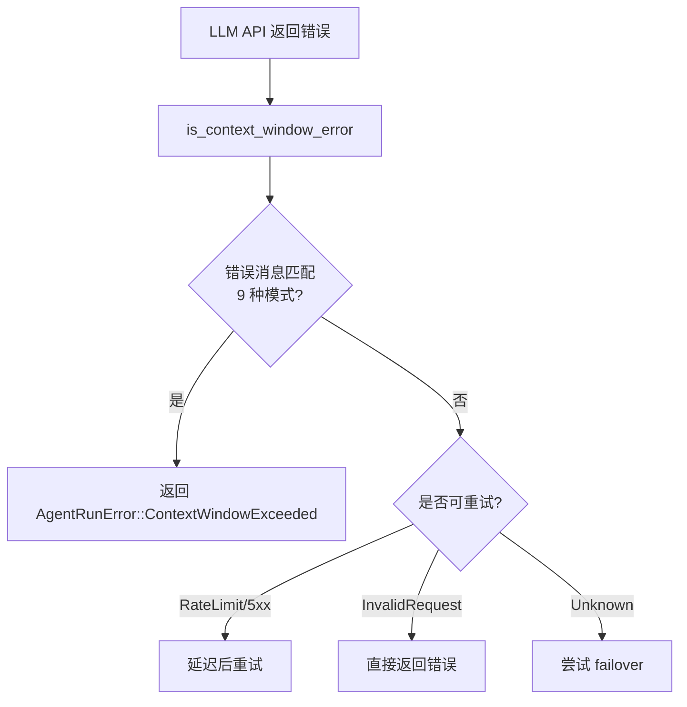
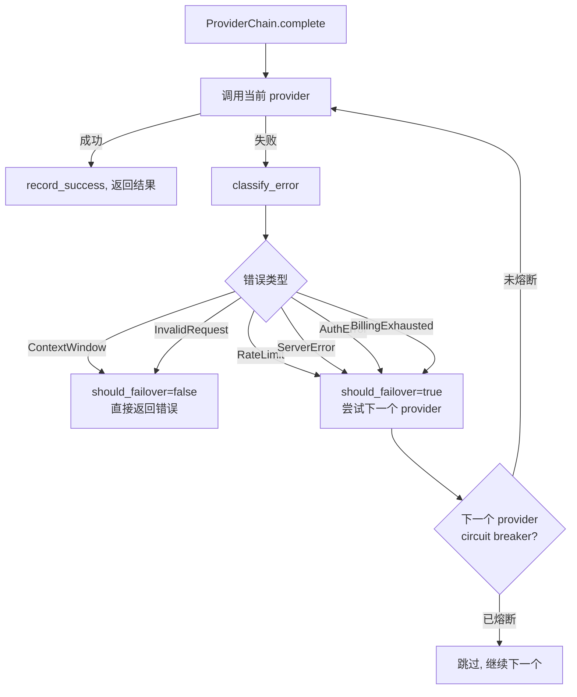
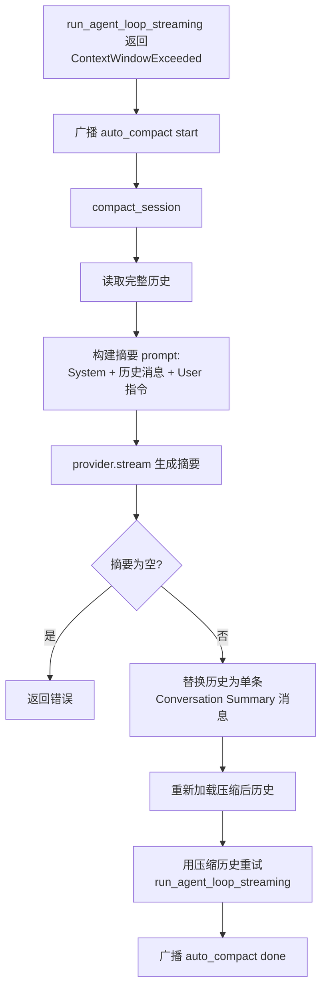

# PD-01.NN Moltis — 错误驱动上下文压缩与 ProviderChain 隔离

> 文档编号：PD-01.NN
> 来源：Moltis `crates/agents/src/runner.rs`, `crates/agents/src/provider_chain.rs`, `crates/sessions/src/compaction.rs`
> GitHub：https://github.com/moltis-org/moltis.git
> 问题域：PD-01 上下文管理 Context Window Management
> 状态：可复用方案

---

## 第 1 章 问题与动机

### 1.1 核心问题

Agent 系统在多轮工具调用循环中，对话历史不断膨胀。当 token 总量超过 LLM 提供商的上下文窗口限制时，API 返回错误（如 `context_length_exceeded`、`request_too_large`）。如果不处理，Agent 循环直接中断，用户丢失整个会话上下文。

Moltis 面临的特殊挑战：
- **多提供商环境**：支持 Anthropic、OpenAI、Google、本地 LLM 等，每家的错误格式和上下文窗口大小不同
- **流式 + 非流式双模式**：runner 同时支持 `complete()` 和 `stream()` 两条路径，都需要处理溢出
- **工具结果膨胀**：shell 执行、浏览器操作等工具可能返回数十 KB 的原始输出

### 1.2 Moltis 的解法概述

Moltis 采用**错误驱动（reactive）**而非预估驱动（proactive）的上下文管理策略：

1. **模式匹配检测**：在 `runner.rs:37-47` 定义 9 种上下文溢出错误模式，覆盖主流 LLM 提供商的错误消息格式
2. **ProviderChain 错误分类隔离**：`provider_chain.rs:26-56` 将 ContextWindow 错误与 RateLimit/ServerError 等区分，ContextWindow 不触发 failover，直接回传调用方
3. **自动压缩重试**：`chat/src/lib.rs:5921-5980` 捕获 `ContextWindowExceeded` 后自动调用 LLM 摘要压缩，替换历史后重试
4. **工具结果预截断**：`runner.rs:594-609` 在工具结果进入对话历史前，按 `max_tool_result_bytes`（默认 50KB）截断，并剥离 base64/hex blob
5. **Prompt 分段限额**：`prompt.rs:164-170` 为 Memory（8000 字符）、项目上下文（8000 字符）、工作区文件（6000 字符）各设独立上限

### 1.3 设计思想

| 设计原则 | 具体实现 | 理由 | 替代方案 |
|----------|----------|------|----------|
| 错误驱动而非预估 | 不做 token 计数，等 API 报错再压缩 | 避免维护多提供商 tokenizer，简化实现 | tiktoken 预估（MiroThinker 方案） |
| 错误分类隔离 | ContextWindow 不 failover，InvalidRequest 不 failover | 换提供商解决不了上下文过大的问题 | 统一重试所有错误 |
| 工具结果预防性截断 | 50KB 硬限制 + base64/hex 剥离 | 防止单次工具调用就撑爆上下文 | 不截断，依赖后续压缩 |
| 压缩前记忆保存 | silent_turn 在压缩前用 LLM 提取记忆写入磁盘 | 压缩会丢失细节，先持久化重要信息 | 压缩后手动保存 |
| Prompt 分段限额 | 各注入段独立字符上限 | 防止单一来源（如大型 MEMORY.md）挤占其他内容 | 统一 token 预算 |

---

## 第 2 章 源码实现分析

### 2.1 架构概览

Moltis 的上下文管理分布在三个层次：

```
┌─────────────────────────────────────────────────────────────────┐
│                     chat/src/lib.rs                              │
│  ┌──────────────┐    ┌──────────────┐    ┌──────────────────┐   │
│  │ 自动压缩重试  │───→│ compact_     │───→│ replace_history  │   │
│  │ (L5921-5980) │    │ session()    │    │ (SessionStore)   │   │
│  └──────┬───────┘    │ (L6167-6243) │    └──────────────────┘   │
│         │            └──────────────┘                           │
│         │ ContextWindowExceeded                                 │
├─────────┼───────────────────────────────────────────────────────┤
│         │          agents/src/runner.rs                          │
│  ┌──────┴───────┐    ┌──────────────┐    ┌──────────────────┐   │
│  │ Agent Loop   │───→│ is_context_  │    │ sanitize_tool_   │   │
│  │ (L824-910)   │    │ window_error │    │ result (L594)    │   │
│  └──────┬───────┘    │ (L50-53)     │    └──────────────────┘   │
│         │            └──────────────┘                           │
│         │ provider.complete()                                   │
├─────────┼───────────────────────────────────────────────────────┤
│         │       agents/src/provider_chain.rs                    │
│  ┌──────┴───────┐    ┌──────────────┐                           │
│  │ ProviderChain│───→│ classify_    │                           │
│  │ .complete()  │    │ error()      │                           │
│  │ (L231-338)   │    │ (L73-131)    │                           │
│  └──────────────┘    └──────────────┘                           │
│         ContextWindow → 不 failover，直接返回错误               │
│         RateLimit/ServerError → failover 到下一个 provider      │
└─────────────────────────────────────────────────────────────────┘
```

### 2.2 核心实现

#### 2.2.1 上下文溢出检测



对应源码 `crates/agents/src/runner.rs:36-53`：

```rust
/// Error patterns that indicate the context window has been exceeded.
const CONTEXT_WINDOW_PATTERNS: &[&str] = &[
    "context_length_exceeded",
    "max_tokens",
    "too many tokens",
    "request too large",
    "maximum context length",
    "context window",
    "token limit",
    "content_too_large",
    "request_too_large",
];

/// Check if an error message indicates a context window overflow.
fn is_context_window_error(msg: &str) -> bool {
    let lower = msg.to_lowercase();
    CONTEXT_WINDOW_PATTERNS.iter().any(|p| lower.contains(p))
}
```

该检测在 runner 的两条路径中都被调用：
- 非流式路径：`runner.rs:882`
- 流式路径：`runner.rs:1495`

#### 2.2.2 ProviderChain 错误分类与隔离



对应源码 `crates/agents/src/provider_chain.rs:26-56`：

```rust
#[derive(Debug, Clone, Copy, PartialEq, Eq)]
pub enum ProviderErrorKind {
    RateLimit,
    AuthError,
    ServerError,
    BillingExhausted,
    /// Context window exceeded — don't rotate, caller should compact.
    ContextWindow,
    /// 400, bad format — don't rotate, it'll fail everywhere.
    InvalidRequest,
    Unknown,
}

impl ProviderErrorKind {
    pub fn should_failover(self) -> bool {
        matches!(
            self,
            Self::RateLimit | Self::AuthError | Self::ServerError
                | Self::BillingExhausted | Self::Unknown
        )
    }
}
```

关键设计：`ContextWindow` 和 `InvalidRequest` 的 `should_failover()` 返回 `false`。这意味着上下文溢出错误会被直接传播回调用方（runner），而不是浪费时间尝试其他提供商——因为消息太长在哪个提供商都会失败。

#### 2.2.3 自动压缩重试流程



对应源码 `crates/chat/src/lib.rs:6167-6243`：

```rust
async fn compact_session(
    store: &Arc<SessionStore>,
    session_key: &str,
    provider: &Arc<dyn moltis_agents::model::LlmProvider>,
) -> error::Result<()> {
    let history = store.read(session_key).await
        .map_err(|source| error::Error::external("failed to read session history", source))?;

    // 使用结构化 ChatMessage 防止 prompt injection
    let mut summary_messages = vec![ChatMessage::system(
        "You are a conversation summarizer. The messages that follow are a conversation \
         you must summarize. Preserve all key facts, decisions, and context.",
    )];
    summary_messages.extend(values_to_chat_messages(&history));
    summary_messages.push(ChatMessage::user(
        "Summarize the conversation above into a concise form. Output only the summary.",
    ));

    let mut stream = provider.stream(summary_messages);
    let mut summary = String::new();
    while let Some(event) = stream.next().await {
        match event {
            StreamEvent::Delta(delta) => summary.push_str(&delta),
            StreamEvent::Done(_) => break,
            StreamEvent::Error(e) => return Err(/* ... */),
            _ => {},
        }
    }

    // 替换为单条摘要消息
    let compacted_msg = PersistedMessage::Assistant {
        content: format!("[Conversation Summary]\n\n{summary}"),
        /* ... */
    };
    store.replace_history(session_key, vec![compacted_msg.to_value()]).await?;
    Ok(())
}
```

### 2.3 实现细节

#### 工具结果预截断

`runner.rs:594-609` 的 `sanitize_tool_result` 在工具结果进入对话历史前执行三步清洗：

1. **剥离 base64 blob**：移除 ≥200 字符的 `data:...;base64,...` 数据 URI
2. **剥离 hex blob**：移除 ≥200 字符的连续十六进制序列
3. **字节截断**：超过 `max_tool_result_bytes`（默认 50KB）时截断，附加 `[truncated — N bytes total]` 标记

对于支持视觉的提供商，图片数据 URI 会被提取为独立的 `ContentPart::Image`，文本部分仍然截断。

#### Prompt 分段限额

`prompt.rs:164-170` 定义了三个独立的字符上限：

```rust
const MEMORY_BOOTSTRAP_MAX_CHARS: usize = 8_000;
const PROJECT_CONTEXT_MAX_CHARS: usize = 8_000;
const WORKSPACE_FILE_MAX_CHARS: usize = 6_000;
```

每个注入段超限时附加截断提示（如 `*(MEMORY.md truncated — use memory_search for full content)*`），引导 LLM 使用工具获取完整内容。

#### 压缩前记忆保存（Silent Turn）

`silent_turn.rs:124-208` 在压缩前运行一个隐藏的 Agent 循环，用专用 system prompt 指导 LLM 将重要信息写入 `MEMORY.md` 和 `memory/YYYY-MM-DD.md`。这确保压缩丢失的细节仍可通过 `memory_search` 工具检索。

#### 压缩安全性

`compact_session` 使用结构化 `ChatMessage` 对象而非拼接文本来构建摘要 prompt（`chat/src/lib.rs:6180-6182`），防止用户消息中的 `\nassistant:` 等注入内容被误解为角色边界。


---

## 第 3 章 迁移指南

### 3.1 迁移清单

**阶段 1：错误检测层（1 个文件）**

- [ ] 定义上下文溢出错误模式列表（覆盖目标提供商的错误消息格式）
- [ ] 实现 `is_context_window_error(msg: &str) -> bool` 检测函数
- [ ] 在 Agent 循环的错误处理分支中调用检测函数，返回专用错误类型

**阶段 2：提供商链错误分类（可选，多提供商场景）**

- [ ] 定义错误分类枚举（ContextWindow / RateLimit / ServerError / ...）
- [ ] 实现 `classify_error` 函数，基于错误消息文本分类
- [ ] 在 failover 逻辑中，ContextWindow 错误不触发 failover

**阶段 3：自动压缩重试**

- [ ] 实现 `compact_session`：读取历史 → LLM 摘要 → 替换历史
- [ ] 在 Agent 循环外层捕获 ContextWindowExceeded，调用压缩后重试
- [ ] 添加压缩状态广播（通知前端显示"正在压缩"）

**阶段 4：预防性截断**

- [ ] 实现工具结果截断函数（剥离 base64/hex + 字节限制）
- [ ] 为 system prompt 各注入段设置独立字符上限

### 3.2 适配代码模板

#### 错误检测（Python 版本）

```python
import re
from enum import Enum, auto
from typing import Optional

CONTEXT_WINDOW_PATTERNS = [
    "context_length_exceeded",
    "max_tokens",
    "too many tokens",
    "request too large",
    "maximum context length",
    "context window",
    "token limit",
    "content_too_large",
    "request_too_large",
]

class ProviderErrorKind(Enum):
    RATE_LIMIT = auto()
    AUTH_ERROR = auto()
    SERVER_ERROR = auto()
    CONTEXT_WINDOW = auto()
    INVALID_REQUEST = auto()
    UNKNOWN = auto()

    @property
    def should_failover(self) -> bool:
        return self not in (
            ProviderErrorKind.CONTEXT_WINDOW,
            ProviderErrorKind.INVALID_REQUEST,
        )

def classify_error(error_msg: str) -> ProviderErrorKind:
    msg = error_msg.lower()
    if any(p in msg for p in CONTEXT_WINDOW_PATTERNS):
        return ProviderErrorKind.CONTEXT_WINDOW
    if "429" in msg or "rate limit" in msg:
        return ProviderErrorKind.RATE_LIMIT
    if any(code in msg for code in ["500", "502", "503"]):
        return ProviderErrorKind.SERVER_ERROR
    if "401" in msg or "403" in msg:
        return ProviderErrorKind.AUTH_ERROR
    if "400" in msg or "bad request" in msg:
        return ProviderErrorKind.INVALID_REQUEST
    return ProviderErrorKind.UNKNOWN
```

#### 自动压缩重试（Python 版本）

```python
from dataclasses import dataclass
from typing import List, Dict, Any

@dataclass
class CompactResult:
    summary: str
    original_count: int

async def compact_session(
    messages: List[Dict[str, Any]],
    llm_client,
    model: str = "claude-sonnet-4-20250514",
) -> CompactResult:
    """Summarize conversation history into a single message."""
    summary_messages = [
        {"role": "system", "content": (
            "You are a conversation summarizer. "
            "Preserve all key facts, decisions, and context."
        )},
        *messages,
        {"role": "user", "content": (
            "Summarize the conversation above into a concise form. "
            "Output only the summary, no preamble."
        )},
    ]
    response = await llm_client.chat(model=model, messages=summary_messages)
    return CompactResult(
        summary=response.text,
        original_count=len(messages),
    )

async def run_with_auto_compact(
    agent_fn, messages, session_store, llm_client, **kwargs
):
    """Run agent function with automatic compaction on context overflow."""
    try:
        return await agent_fn(messages=messages, **kwargs)
    except Exception as e:
        kind = classify_error(str(e))
        if kind != ProviderErrorKind.CONTEXT_WINDOW:
            raise
        # Compact and retry
        result = await compact_session(messages, llm_client)
        compacted = [{"role": "assistant", "content": f"[Summary]\n\n{result.summary}"}]
        await session_store.replace(compacted)
        return await agent_fn(messages=compacted, **kwargs)
```

### 3.3 适用场景

| 场景 | 适用度 | 说明 |
|------|--------|------|
| 多提供商 Agent 系统 | ⭐⭐⭐ | ProviderChain 错误分类隔离是核心价值 |
| 长对话 + 工具调用密集 | ⭐⭐⭐ | 工具结果截断 + 自动压缩重试组合有效 |
| 单提供商简单 Agent | ⭐⭐ | 错误检测 + 压缩重试仍有价值，但 ProviderChain 不需要 |
| 需要精确 token 控制 | ⭐ | Moltis 不做预估，无法精确控制 token 分配 |
| 实时流式对话 | ⭐⭐⭐ | 流式路径也有溢出检测，压缩对用户透明 |

---

## 第 4 章 测试用例

```rust
// 基于 Moltis 真实测试模式的测试用例

#[cfg(test)]
mod tests {
    use super::*;

    // ── 错误分类测试 ──

    #[test]
    fn test_context_window_error_detection() {
        assert!(is_context_window_error("context_length_exceeded: maximum context length is 200000"));
        assert!(is_context_window_error("Error: too many tokens in request"));
        assert!(is_context_window_error("content_too_large: request exceeds limit"));
        assert!(!is_context_window_error("429 rate limit exceeded"));
        assert!(!is_context_window_error("500 internal server error"));
    }

    #[test]
    fn test_context_window_no_failover() {
        let kind = classify_error("context_length_exceeded");
        assert_eq!(kind, ProviderErrorKind::ContextWindow);
        assert!(!kind.should_failover());
    }

    #[test]
    fn test_rate_limit_does_failover() {
        let kind = classify_error("429 Too Many Requests");
        assert_eq!(kind, ProviderErrorKind::RateLimit);
        assert!(kind.should_failover());
    }

    // ── 工具结果截断测试 ──

    #[test]
    fn test_sanitize_preserves_short_input() {
        assert_eq!(sanitize_tool_result("hello world", 50_000), "hello world");
    }

    #[test]
    fn test_sanitize_truncates_long_input() {
        let input = "x".repeat(100_000);
        let result = sanitize_tool_result(&input, 50_000);
        assert!(result.len() < 60_000);
        assert!(result.contains("[truncated"));
    }

    #[test]
    fn test_sanitize_strips_base64_blobs() {
        let input = format!("before data:image/png;base64,{} after", "A".repeat(500));
        let result = sanitize_tool_result(&input, 50_000);
        assert!(!result.contains("AAAA"));
        assert!(result.contains("before"));
    }

    // ── 压缩流程测试 ──

    #[tokio::test]
    async fn test_compact_session_produces_summary() {
        let messages = vec![
            json!({"role": "user", "content": "What is Rust?"}),
            json!({"role": "assistant", "content": "Rust is a systems programming language."}),
        ];
        // Mock: compact_session should produce non-empty summary
        let result = compact_session(&messages, &mock_provider).await;
        assert!(result.is_ok());
        let compacted = result.unwrap();
        assert!(!compacted.summary.is_empty());
    }

    #[tokio::test]
    async fn test_compact_rejects_empty_history() {
        let result = compact_session(&[], &mock_provider).await;
        assert!(result.is_err());
    }

    // ── 压缩前记忆保存测试 ──

    #[tokio::test]
    async fn test_silent_memory_turn_writes_file() {
        let conversation = vec![
            ChatMessage::user("I prefer Rust over Python."),
            ChatMessage::assistant("Noted! Rust is a great choice."),
        ];
        let paths = run_silent_memory_turn(provider, &conversation, writer).await.unwrap();
        assert!(!paths.is_empty());
        assert!(paths[0].ends_with("MEMORY.md"));
    }
}
```


---

## 第 5 章 跨域关联

| 关联域 | 关系类型 | 说明 |
|--------|----------|------|
| PD-03 容错与重试 | 强依赖 | ProviderChain 的 circuit breaker（3 次失败熔断 + 60s 冷却）和 runner 的指数退避重试直接服务于上下文管理——ContextWindow 错误被分类为"不可重试"，与 RateLimit 的"可重试"形成互补 |
| PD-04 工具系统 | 协同 | `sanitize_tool_result` 是工具系统与上下文管理的交汇点：工具返回的原始数据在进入对话历史前被截断和清洗，`max_tool_result_bytes` 配置项同时影响两个域 |
| PD-06 记忆持久化 | 协同 | `silent_turn.rs` 在压缩前运行记忆保存 Agent，将即将被压缩丢失的细节写入 `MEMORY.md` 和 `memory/*.md`，确保长期记忆不因压缩而丢失 |
| PD-11 可观测性 | 协同 | runner 在每次 LLM 调用后累计 `total_input_tokens` / `total_output_tokens`，ProviderChain 通过 metrics feature 记录每个提供商的 token 消耗和错误类型分布 |

---

## 第 6 章 来源文件索引

| 文件 | 行范围 | 关键实现 |
|------|--------|----------|
| `crates/agents/src/runner.rs` | L36-53 | `CONTEXT_WINDOW_PATTERNS` 定义 + `is_context_window_error` 检测函数 |
| `crates/agents/src/runner.rs` | L219-228 | `AgentRunError` 枚举，含 `ContextWindowExceeded` 变体 |
| `crates/agents/src/runner.rs` | L594-609 | `sanitize_tool_result`：base64/hex 剥离 + 字节截断 |
| `crates/agents/src/runner.rs` | L762-910 | `run_agent_loop_with_context`：非流式 Agent 循环，含溢出检测 |
| `crates/agents/src/runner.rs` | L1238-1523 | 流式 Agent 循环，含溢出检测（L1495） |
| `crates/agents/src/provider_chain.rs` | L26-56 | `ProviderErrorKind` 枚举 + `should_failover` 逻辑 |
| `crates/agents/src/provider_chain.rs` | L59-69 | `CONTEXT_WINDOW_PATTERNS`（与 runner.rs 共享模式列表） |
| `crates/agents/src/provider_chain.rs` | L73-131 | `classify_error`：错误消息文本分类 |
| `crates/agents/src/provider_chain.rs` | L231-338 | `ProviderChain::complete`：failover 循环 + 错误分类路由 |
| `crates/agents/src/model.rs` | L339-343 | `LlmProvider::context_window()` trait 方法，默认 200,000 |
| `crates/agents/src/prompt.rs` | L164-170 | Prompt 分段字符上限常量 |
| `crates/agents/src/prompt.rs` | L550-574 | `append_truncated_text_block`：截断 + 提示注入 |
| `crates/agents/src/silent_turn.rs` | L21-36 | 压缩前记忆保存的 system prompt |
| `crates/agents/src/silent_turn.rs` | L124-208 | `run_silent_memory_turn`：隐藏 Agent 循环写入记忆文件 |
| `crates/sessions/src/compaction.rs` | L1-6 | `compact_session` 接口（todo! 占位，实际实现在 chat crate） |
| `crates/chat/src/lib.rs` | L5921-5980 | 自动压缩重试：捕获 ContextWindowExceeded → compact → retry |
| `crates/chat/src/lib.rs` | L6167-6243 | `compact_session`：LLM 流式摘要 + 历史替换 |
| `crates/config/src/schema.rs` | L1210-1240 | `agent_max_iterations`（默认 25）和 `max_tool_result_bytes`（默认 50KB）配置 |

---

## 第 7 章 横向对比维度

> **重要：** 本章用于自动填充 Butcher Wiki 的横向对比表。

```json comparison_data
{
  "project": "Moltis",
  "dimensions": {
    "估算方式": "不做预估，依赖 API 错误响应触发（9 种模式匹配）",
    "压缩策略": "LLM 流式摘要，全量历史替换为单条 [Conversation Summary] 消息",
    "触发机制": "错误驱动：API 返回 context_length_exceeded 等错误后自动压缩重试",
    "实现位置": "三层分布：provider_chain 分类 → runner 检测 → chat 压缩重试",
    "容错设计": "ContextWindow 不 failover（换提供商无用），压缩失败返回原始错误",
    "供应商适配": "ProviderErrorKind 枚举统一分类，9 种模式覆盖 Anthropic/OpenAI/Google",
    "保留策略": "压缩前 silent_turn 将重要信息写入 MEMORY.md，压缩后仅保留摘要",
    "Prompt模板化": "分段限额：Memory 8K / ProjectContext 8K / Workspace 6K 字符独立上限",
    "AI/Tool消息对保护": "压缩为全量替换（单条摘要），不存在拆分配对问题",
    "二次截断兜底": "sanitize_tool_result 50KB 硬限制 + base64/hex blob 剥离",
    "压缩效果验证": "摘要为空时返回错误拒绝替换，但不验证摘要长度 < 原始长度",
    "累计预算": "runner 用 saturating_add 累计 total_input/output_tokens，但不用于触发压缩"
  }
}
```

### 域元数据补充

```json domain_metadata
{
  "solution_summary": "Moltis 用 9 种错误模式匹配检测上下文溢出，ProviderChain 将 ContextWindow 错误隔离不做 failover，chat 层自动 LLM 摘要压缩后重试，压缩前 silent_turn 保存记忆到磁盘",
  "description": "错误驱动的被动式上下文管理，不做 token 预估而依赖 API 错误响应触发压缩",
  "sub_problems": [
    "ProviderChain 错误分类隔离：区分上下文溢出与可重试错误，避免无效 failover",
    "压缩前记忆保存：在摘要替换历史前用隐藏 Agent 循环将重要信息持久化到文件",
    "压缩安全性：使用结构化消息对象构建摘要 prompt，防止用户内容中的角色前缀注入"
  ],
  "best_practices": [
    "ContextWindow 错误不应触发 failover：消息太长在所有提供商都会失败，应回传调用方处理",
    "压缩前先保存记忆：silent_turn 模式确保压缩丢失的细节仍可通过记忆搜索恢复"
  ]
}
```

