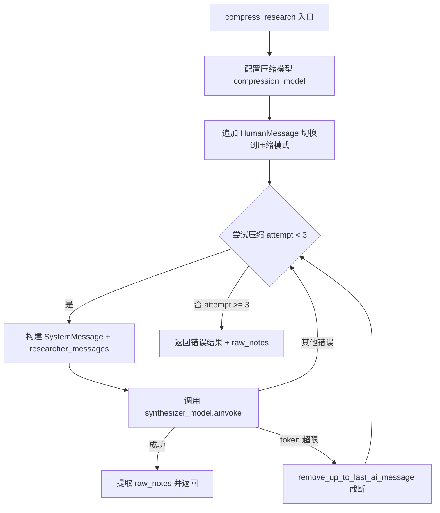
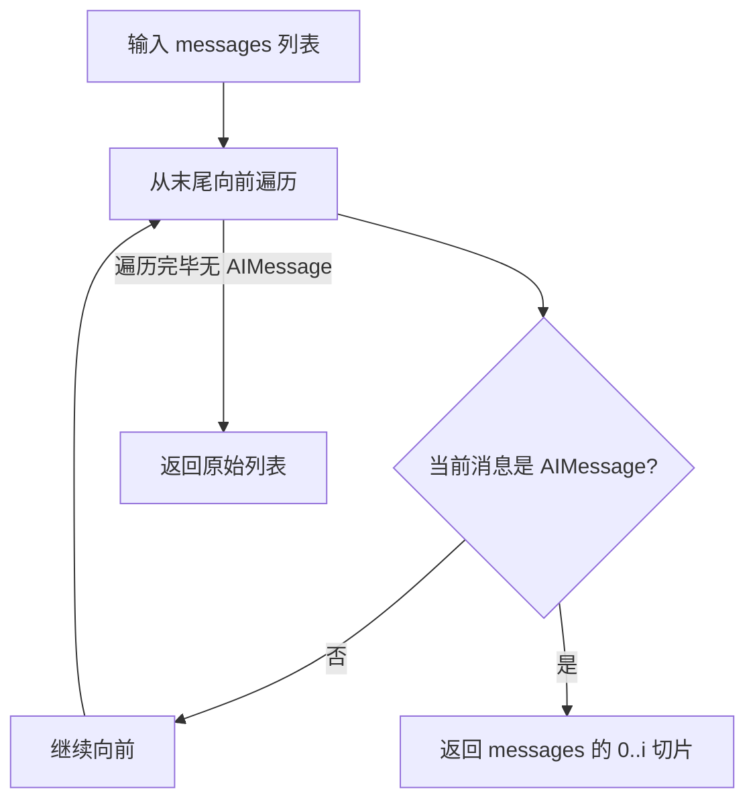
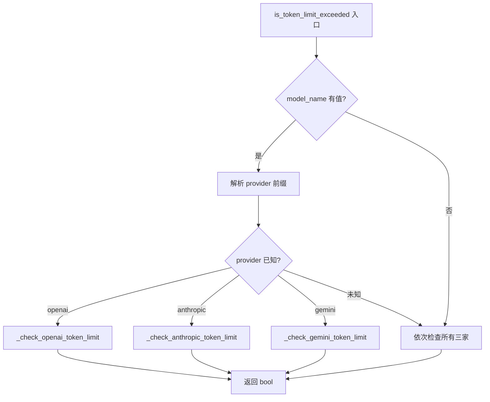

# PD-01.36 Open Deep Research — compress_research 节点压缩与渐进式截断重试

> 文档编号：PD-01.36
> 来源：Open Deep Research `src/open_deep_research/deep_researcher.py`, `src/open_deep_research/utils.py`
> GitHub：https://github.com/langchain-ai/open_deep_research.git
> 问题域：PD-01 上下文管理 Context Window Management
> 状态：可复用方案

---

## 第 1 章 问题与动机

### 1.1 核心问题

深度研究 Agent 的核心矛盾：研究越深入，积累的搜索结果和工具输出越多，但 LLM 的上下文窗口有限。Open Deep Research 采用 Supervisor → Researcher → Compress 三层架构，每个 Researcher 子图在完成搜索后必须将所有原始消息压缩为精简摘要，否则 Supervisor 汇总多个 Researcher 结果时会立即超限。

此外，不同 LLM 提供商（OpenAI、Anthropic、Google、Cohere、Mistral、Ollama、Bedrock）的 token 限制差异巨大（从 4096 到 2097152），同一套代码必须适配所有提供商的上下文约束。

### 1.2 Open Deep Research 的解法概述

1. **compress_research 节点**：每个 Researcher 子图的最后一个节点，用独立的压缩模型将所有研究消息压缩为结构化摘要（`deep_researcher.py:511-585`）
2. **渐进式截断重试**：压缩失败时通过 `remove_up_to_last_ai_message` 逐步移除最近的 AI 消息轮次，缩小输入后重试（`utils.py:848-866`）
3. **多供应商 token 限制映射表**：`MODEL_TOKEN_LIMITS` 字典覆盖 8 个供应商 30+ 个模型的精确 token 限制（`utils.py:788-829`）
4. **多供应商异常检测**：`is_token_limit_exceeded` 函数通过异常类型 + 错误消息模式匹配识别 OpenAI/Anthropic/Gemini 三家的 token 超限错误（`utils.py:665-785`）
5. **final_report 渐进式字符截断**：最终报告生成时，首次超限按 `model_token_limit * 4` 估算字符上限，后续每次重试缩减 10%（`deep_researcher.py:607-697`）

### 1.3 设计思想

| 设计原则 | 具体实现 | 理由 | 替代方案 |
|----------|----------|------|----------|
| 节点级压缩 | compress_research 作为 LangGraph 子图的独立节点 | 每个 Researcher 独立压缩，避免 Supervisor 汇总时爆炸 | 全局压缩（但延迟高、单点故障） |
| 异常驱动而非预估 | 不预估 token 数，而是捕获超限异常后截断重试 | 避免 tokenizer 依赖，简化多供应商适配 | tiktoken 预估（但需每个供应商的 tokenizer） |
| 渐进式降级 | 每次移除一轮 AI 消息，最多重试 3 次 | 保留尽可能多的研究内容，只丢弃最近的冗余轮次 | 一次性截断到固定长度（但可能丢失关键信息） |
| 独立压缩模型 | compression_model 可配置为不同于 research_model 的模型 | 压缩任务可用更便宜的模型（如 gpt-4.1-mini） | 复用主模型（但成本更高） |
| 字符级粗估 | token_limit * 4 作为字符上限 | 简单有效的 token-to-char 近似，无需 tokenizer | 精确 tokenizer 计算（但增加依赖） |

---

## 第 2 章 源码实现分析

### 2.1 架构概览

Open Deep Research 的 LangGraph 架构分为三层子图，上下文管理贯穿每一层：

```
┌─────────────────────────────────────────────────────────────────┐
│                    Main Graph (AgentState)                       │
│                                                                 │
│  clarify_with_user → write_research_brief → research_supervisor │
│                                                  │              │
│                                                  ▼              │
│                                          final_report_generation│
│                                          (渐进式字符截断重试)    │
└──────────────────────────────┬──────────────────────────────────┘
                               │
                    ┌──────────▼──────────┐
                    │ Supervisor Subgraph  │
                    │ (SupervisorState)    │
                    │                     │
                    │ supervisor ←→ supervisor_tools │
                    │     │ ConductResearch ×N       │
                    └─────┼──────────────────────────┘
                          │ 并行调用
              ┌───────────┼───────────┐
              ▼           ▼           ▼
    ┌─────────────┐ ┌─────────────┐ ┌─────────────┐
    │ Researcher  │ │ Researcher  │ │ Researcher  │
    │ Subgraph    │ │ Subgraph    │ │ Subgraph    │
    │             │ │             │ │             │
    │ researcher  │ │ researcher  │ │ researcher  │
    │     ↕       │ │     ↕       │ │     ↕       │
    │ researcher  │ │ researcher  │ │ researcher  │
    │ _tools      │ │ _tools      │ │ _tools      │
    │     ↓       │ │     ↓       │ │     ↓       │
    │ compress_   │ │ compress_   │ │ compress_   │
    │ research ★  │ │ research ★  │ │ research ★  │
    └─────────────┘ └─────────────┘ └─────────────┘
         ★ = 上下文压缩节点（本文核心）
```

### 2.2 核心实现

#### 2.2.1 compress_research 节点：研究消息压缩



对应源码 `src/open_deep_research/deep_researcher.py:511-585`：

```python
async def compress_research(state: ResearcherState, config: RunnableConfig):
    # Step 1: 配置独立的压缩模型（可与研究模型不同）
    configurable = Configuration.from_runnable_config(config)
    synthesizer_model = configurable_model.with_config({
        "model": configurable.compression_model,
        "max_tokens": configurable.compression_model_max_tokens,
        "api_key": get_api_key_for_model(configurable.compression_model, config),
        "tags": ["langsmith:nostream"]
    })
    
    researcher_messages = state.get("researcher_messages", [])
    # 追加人类消息，指示从研究模式切换到压缩模式
    researcher_messages.append(HumanMessage(content=compress_research_simple_human_message))
    
    # Step 2: 渐进式截断重试循环
    synthesis_attempts = 0
    max_attempts = 3
    
    while synthesis_attempts < max_attempts:
        try:
            compression_prompt = compress_research_system_prompt.format(date=get_today_str())
            messages = [SystemMessage(content=compression_prompt)] + researcher_messages
            response = await synthesizer_model.ainvoke(messages)
            
            # 提取所有工具和 AI 消息作为原始笔记
            raw_notes_content = "\n".join([
                str(message.content) 
                for message in filter_messages(researcher_messages, include_types=["tool", "ai"])
            ])
            return {
                "compressed_research": str(response.content),
                "raw_notes": [raw_notes_content]
            }
        except Exception as e:
            synthesis_attempts += 1
            if is_token_limit_exceeded(e, configurable.research_model):
                # 关键：截断到最后一条 AI 消息之前
                researcher_messages = remove_up_to_last_ai_message(researcher_messages)
                continue
            continue
    
    # 所有重试失败后返回错误
    return {
        "compressed_research": "Error synthesizing research report: Maximum retries exceeded",
        "raw_notes": [raw_notes_content]
    }
```

#### 2.2.2 remove_up_to_last_ai_message：渐进式消息截断



对应源码 `src/open_deep_research/utils.py:848-866`：

```python
def remove_up_to_last_ai_message(
    messages: list[MessageLikeRepresentation]
) -> list[MessageLikeRepresentation]:
    """截断消息历史：移除最后一条 AI 消息及其后的所有消息。"""
    for i in range(len(messages) - 1, -1, -1):
        if isinstance(messages[i], AIMessage):
            return messages[:i]  # 不包含该 AI 消息
    return messages  # 无 AI 消息则返回原列表
```

这个函数的精妙之处在于：每次调用移除一轮完整的 AI 交互（AI 消息 + 后续的 Tool 消息），而不是简单地按字符数截断。这保证了消息列表的结构完整性——不会出现悬挂的 ToolMessage 没有对应的 AIMessage。

#### 2.2.3 多供应商 token 超限检测



对应源码 `src/open_deep_research/utils.py:665-785`：

```python
def is_token_limit_exceeded(exception: Exception, model_name: str = None) -> bool:
    error_str = str(exception).lower()
    
    # 根据模型名前缀确定供应商，避免不必要的检查
    provider = None
    if model_name:
        model_str = str(model_name).lower()
        if model_str.startswith('openai:'):
            provider = 'openai'
        elif model_str.startswith('anthropic:'):
            provider = 'anthropic'
        elif model_str.startswith('gemini:') or model_str.startswith('google:'):
            provider = 'gemini'
    
    # 按供应商分发检查，或全部检查
    if provider == 'openai':
        return _check_openai_token_limit(exception, error_str)
    elif provider == 'anthropic':
        return _check_anthropic_token_limit(exception, error_str)
    elif provider == 'gemini':
        return _check_gemini_token_limit(exception, error_str)
    
    return (
        _check_openai_token_limit(exception, error_str) or
        _check_anthropic_token_limit(exception, error_str) or
        _check_gemini_token_limit(exception, error_str)
    )
```

每个供应商的检测逻辑不同：
- **OpenAI**：检查 `BadRequestError` + `token/context/length` 关键词，或 `code == 'context_length_exceeded'`（`utils.py:703-734`）
- **Anthropic**：检查 `BadRequestError` + `'prompt is too long'`（`utils.py:736-757`）
- **Gemini**：检查 `ResourceExhausted` 或 `GoogleGenerativeAIFetchError`（`utils.py:759-785`）

### 2.3 实现细节

#### 2.3.1 final_report_generation 的渐进式字符截断

最终报告生成阶段有独立的 token 超限处理策略（`deep_researcher.py:607-697`）：

1. 首次超限：查询 `MODEL_TOKEN_LIMITS` 获取模型的精确 token 限制，乘以 4 得到字符上限
2. 后续重试：每次将字符上限缩减 10%（`findings_token_limit * 0.9`）
3. 最多重试 3 次
4. 如果模型不在映射表中，直接返回错误提示用户更新映射表

```python
# deep_researcher.py:666-682
if current_retry == 1:
    model_token_limit = get_model_token_limit(configurable.final_report_model)
    if not model_token_limit:
        return {"final_report": f"Error: could not determine model's maximum context length..."}
    findings_token_limit = model_token_limit * 4  # token → char 粗估
else:
    findings_token_limit = int(findings_token_limit * 0.9)  # 每次缩减 10%

findings = findings[:findings_token_limit]  # 字符级截断
```

#### 2.3.2 搜索结果预压缩：summarize_webpage

在搜索阶段就进行第一层压缩（`utils.py:82-136`）：

- `max_content_length`（默认 50000 字符）截断原始网页内容
- 用独立的 `summarization_model`（默认 gpt-4.1-mini）将网页压缩为 `Summary(summary, key_excerpts)` 结构
- 60 秒超时保护，失败时降级返回原始内容
- 所有搜索结果并行压缩（`asyncio.gather`）

#### 2.3.3 双轨笔记保留

系统同时维护两条数据轨道：
- `compressed_research`：压缩后的精简摘要，传递给 Supervisor
- `raw_notes`：所有工具和 AI 消息的原始内容拼接，用于最终报告生成时的补充参考

---

## 第 3 章 迁移指南

### 3.1 迁移清单

**阶段 1：基础设施**
- [ ] 创建多供应商 token 限制映射表（可直接复用 `MODEL_TOKEN_LIMITS`）
- [ ] 实现 `is_token_limit_exceeded` 多供应商异常检测
- [ ] 实现 `remove_up_to_last_ai_message` 消息截断函数

**阶段 2：压缩节点**
- [ ] 在 LangGraph 子图中添加 compress 节点作为研究循环的出口
- [ ] 配置独立的 compression_model（推荐用 gpt-4.1-mini 降低成本）
- [ ] 编写压缩 system prompt（可参考 `compress_research_system_prompt`）

**阶段 3：渐进式重试**
- [ ] 在压缩节点中实现 while 循环 + 异常捕获 + 截断重试
- [ ] 在最终报告生成中实现字符级渐进截断（token_limit * 4 → 每次 -10%）

### 3.2 适配代码模板

以下是一个可直接复用的压缩节点模板：

```python
from langchain_core.messages import AIMessage, HumanMessage, SystemMessage, filter_messages

# 多供应商 token 限制映射（从 Open Deep Research 提取）
MODEL_TOKEN_LIMITS = {
    "openai:gpt-4.1-mini": 1047576,
    "openai:gpt-4.1": 1047576,
    "openai:o4-mini": 200000,
    "anthropic:claude-sonnet-4": 200000,
    "google:gemini-1.5-pro": 2097152,
    # ... 按需扩展
}

def remove_up_to_last_ai_message(messages: list) -> list:
    """移除最后一条 AI 消息及其后续消息，用于渐进式截断。"""
    for i in range(len(messages) - 1, -1, -1):
        if isinstance(messages[i], AIMessage):
            return messages[:i]
    return messages

async def compress_node(state, config):
    """LangGraph 压缩节点：将研究消息压缩为精简摘要。"""
    compression_model = init_chat_model(
        model="openai:gpt-4.1-mini",  # 用便宜模型压缩
        max_tokens=8192
    )
    
    messages = state["messages"][:]
    messages.append(HumanMessage(content="请将以上研究内容整理为精简摘要，保留所有关键信息和来源。"))
    
    for attempt in range(3):
        try:
            prompt = [SystemMessage(content="你是研究摘要助手...")] + messages
            response = await compression_model.ainvoke(prompt)
            return {"compressed": response.content}
        except Exception as e:
            if is_token_limit_exceeded(e):
                messages = remove_up_to_last_ai_message(messages)
            continue
    
    return {"compressed": "压缩失败：重试次数耗尽"}
```

### 3.3 适用场景

| 场景 | 适用度 | 说明 |
|------|--------|------|
| 多 Agent 研究系统 | ⭐⭐⭐ | 每个子 Agent 独立压缩后汇总，完美匹配 |
| 单 Agent 长对话 | ⭐⭐ | 可用但不如滑动窗口方案灵活 |
| 多供应商适配 | ⭐⭐⭐ | MODEL_TOKEN_LIMITS + 异常检测覆盖主流供应商 |
| 实时对话场景 | ⭐ | 压缩节点引入额外延迟，不适合实时交互 |
| 成本敏感场景 | ⭐⭐⭐ | 独立压缩模型可选用便宜模型，降低总成本 |

---

## 第 4 章 测试用例

```python
import pytest
from unittest.mock import AsyncMock, MagicMock
from langchain_core.messages import AIMessage, HumanMessage, ToolMessage


class TestRemoveUpToLastAiMessage:
    """测试渐进式消息截断函数。"""
    
    def test_normal_truncation(self):
        """正常情况：移除最后一条 AI 消息及后续内容。"""
        from open_deep_research.utils import remove_up_to_last_ai_message
        
        messages = [
            HumanMessage(content="query"),
            AIMessage(content="response 1"),
            ToolMessage(content="tool result", tool_call_id="1"),
            AIMessage(content="response 2"),
            ToolMessage(content="tool result 2", tool_call_id="2"),
        ]
        result = remove_up_to_last_ai_message(messages)
        assert len(result) == 3  # HumanMessage + AIMessage + ToolMessage
        assert isinstance(result[-1], ToolMessage)
    
    def test_single_ai_message(self):
        """只有一条 AI 消息时，返回它之前的所有消息。"""
        from open_deep_research.utils import remove_up_to_last_ai_message
        
        messages = [
            HumanMessage(content="query"),
            AIMessage(content="only response"),
        ]
        result = remove_up_to_last_ai_message(messages)
        assert len(result) == 1
        assert isinstance(result[0], HumanMessage)
    
    def test_no_ai_messages(self):
        """无 AI 消息时返回原始列表。"""
        from open_deep_research.utils import remove_up_to_last_ai_message
        
        messages = [HumanMessage(content="query")]
        result = remove_up_to_last_ai_message(messages)
        assert result == messages


class TestIsTokenLimitExceeded:
    """测试多供应商 token 超限检测。"""
    
    def test_openai_context_length_exceeded(self):
        """OpenAI BadRequestError + context 关键词。"""
        from open_deep_research.utils import is_token_limit_exceeded
        
        # 模拟 OpenAI 异常
        exc = type('BadRequestError', (Exception,), {
            '__module__': 'openai._exceptions'
        })("maximum context length exceeded")
        assert is_token_limit_exceeded(exc, "openai:gpt-4.1") is True
    
    def test_anthropic_prompt_too_long(self):
        """Anthropic BadRequestError + prompt is too long。"""
        from open_deep_research.utils import is_token_limit_exceeded
        
        exc = type('BadRequestError', (Exception,), {
            '__module__': 'anthropic._exceptions'
        })("prompt is too long: 250000 tokens > 200000 maximum")
        assert is_token_limit_exceeded(exc, "anthropic:claude-sonnet-4") is True
    
    def test_non_token_error(self):
        """非 token 相关错误应返回 False。"""
        from open_deep_research.utils import is_token_limit_exceeded
        
        exc = ValueError("invalid argument")
        assert is_token_limit_exceeded(exc, "openai:gpt-4.1") is False


class TestGetModelTokenLimit:
    """测试模型 token 限制查询。"""
    
    def test_known_model(self):
        from open_deep_research.utils import get_model_token_limit
        assert get_model_token_limit("openai:gpt-4.1") == 1047576
    
    def test_unknown_model(self):
        from open_deep_research.utils import get_model_token_limit
        assert get_model_token_limit("unknown:model-x") is None
```

---

## 第 5 章 跨域关联

| 关联域 | 关系类型 | 说明 |
|--------|----------|------|
| PD-02 多 Agent 编排 | 依赖 | compress_research 是 Supervisor → Researcher 多 Agent 架构的关键衔接点，每个 Researcher 子图压缩后才能汇总 |
| PD-03 容错与重试 | 协同 | 渐进式截断重试本身就是容错机制，`is_token_limit_exceeded` 的多供应商异常分类也服务于容错 |
| PD-04 工具系统 | 协同 | 搜索工具（Tavily/Anthropic/OpenAI）的输出是压缩的主要输入，`summarize_webpage` 在工具层做了第一层预压缩 |
| PD-08 搜索与检索 | 依赖 | 搜索结果的 `raw_content` 经 `max_content_length` 截断 + `summarize_webpage` 压缩后才进入 Researcher 消息流 |
| PD-11 可观测性 | 协同 | `raw_notes` 双轨保留机制为后续审计和调试提供完整的原始数据轨迹 |

---

## 第 6 章 来源文件索引

| 文件 | 行范围 | 关键实现 |
|------|--------|----------|
| `src/open_deep_research/deep_researcher.py` | L511-L585 | `compress_research` 节点：压缩模型配置、渐进式截断重试循环 |
| `src/open_deep_research/deep_researcher.py` | L607-L697 | `final_report_generation`：字符级渐进截断（token_limit*4 → 每次-10%） |
| `src/open_deep_research/deep_researcher.py` | L587-L605 | Researcher 子图构建：researcher → researcher_tools → compress_research |
| `src/open_deep_research/utils.py` | L665-L701 | `is_token_limit_exceeded`：多供应商异常检测入口 |
| `src/open_deep_research/utils.py` | L703-L734 | `_check_openai_token_limit`：OpenAI 异常模式匹配 |
| `src/open_deep_research/utils.py` | L736-L757 | `_check_anthropic_token_limit`：Anthropic 异常模式匹配 |
| `src/open_deep_research/utils.py` | L759-L785 | `_check_gemini_token_limit`：Gemini 异常模式匹配 |
| `src/open_deep_research/utils.py` | L788-L829 | `MODEL_TOKEN_LIMITS`：8 供应商 30+ 模型的 token 限制映射表 |
| `src/open_deep_research/utils.py` | L831-L846 | `get_model_token_limit`：模型 token 限制查询 |
| `src/open_deep_research/utils.py` | L848-L866 | `remove_up_to_last_ai_message`：渐进式消息截断 |
| `src/open_deep_research/utils.py` | L82-L136 | `tavily_search`：搜索结果预压缩（max_content_length + summarize_webpage） |
| `src/open_deep_research/utils.py` | L175-L213 | `summarize_webpage`：网页内容压缩为 Summary 结构 + 60s 超时保护 |
| `src/open_deep_research/prompts.py` | L186-L226 | `compress_research_system_prompt`：压缩任务的 system prompt |
| `src/open_deep_research/configuration.py` | L173-L192 | `compression_model` / `compression_model_max_tokens` 配置 |
| `src/open_deep_research/configuration.py` | L141-L152 | `max_content_length` 配置（默认 50000 字符） |
| `src/open_deep_research/state.py` | L83-L96 | `ResearcherState` / `ResearcherOutputState`：compressed_research + raw_notes 双轨状态 |

---

## 第 7 章 横向对比维度

```json comparison_data
{
  "project": "OpenDeepResearch",
  "dimensions": {
    "估算方式": "无预估，异常驱动：捕获 token 超限异常后才触发截断",
    "压缩策略": "LLM 压缩节点：独立 compression_model 将研究消息压缩为结构化摘要",
    "触发机制": "子图出口自动触发：Researcher 子图的 compress_research 节点在研究完成后必经",
    "实现位置": "LangGraph 子图节点：compress_research 作为 ResearcherState 子图的最后一个节点",
    "容错设计": "渐进式截断重试：remove_up_to_last_ai_message 逐轮移除 + 最多 3 次重试",
    "供应商适配": "8 供应商 30+ 模型映射表 + 三家异常模式匹配（OpenAI/Anthropic/Gemini）",
    "摘要模型选择": "独立 compression_model 可配置为 gpt-4.1-mini 等低成本模型",
    "工具输出压缩": "搜索阶段预压缩：max_content_length 截断 + summarize_webpage 结构化摘要",
    "保留策略": "双轨保留：compressed_research（精简）+ raw_notes（完整原始内容）",
    "二次截断兜底": "final_report 阶段：token_limit*4 字符估算 → 每次重试缩减 10%",
    "AI/Tool消息对保护": "remove_up_to_last_ai_message 按 AI 消息边界截断，隐式保护消息对完整性",
    "子Agent隔离": "每个 Researcher 子图独立压缩，压缩后的摘要才传递给 Supervisor"
  }
}
```

### 域元数据补充

```json domain_metadata
{
  "solution_summary": "Open Deep Research 通过 compress_research LangGraph 节点 + remove_up_to_last_ai_message 渐进式截断 + 8 供应商 30+ 模型 TOKEN_LIMITS 映射表实现异常驱动的多供应商上下文管理",
  "description": "异常驱动的上下文管理：不预估 token 而是捕获超限异常后渐进式截断重试",
  "sub_problems": [
    "异常驱动 vs 预估驱动：不依赖 tokenizer 预估而是通过异常捕获触发截断的权衡",
    "字符-token 粗估比例：token_limit * 4 作为字符上限的近似精度与适用范围",
    "搜索结果预压缩：在工具层对原始网页内容做第一层 LLM 摘要减少下游 token 压力"
  ],
  "best_practices": [
    "独立压缩模型降本：压缩任务用 gpt-4.1-mini 等便宜模型，不必复用主研究模型",
    "按 AI 消息边界截断：比按字符数截断更安全，自动保护消息对完整性",
    "搜索结果入口即压缩：在工具返回时就做第一层摘要，减少后续压缩压力"
  ]
}
```
