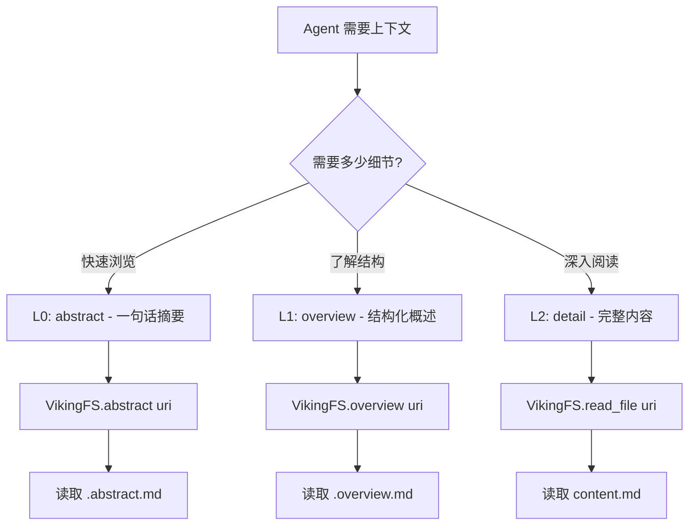
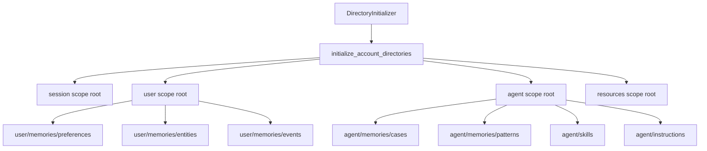
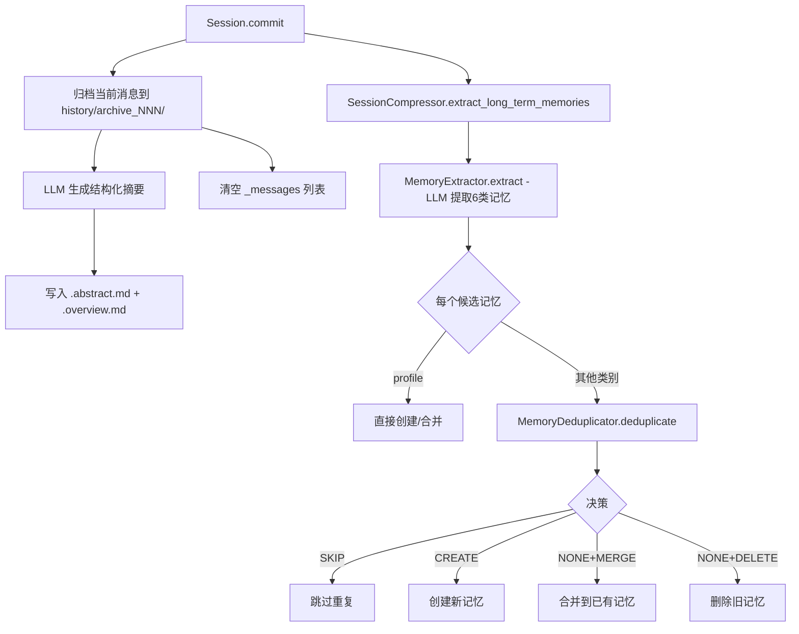

# PD-01.14 OpenViking — 三层上下文分级加载与会话压缩记忆提取

> 文档编号：PD-01.14
> 来源：OpenViking `openviking/core/context.py`, `openviking/session/compressor.py`, `openviking/core/directories.py`
> GitHub：https://github.com/volcengine/OpenViking.git
> 问题域：PD-01 上下文管理 Context Window Management
> 状态：可复用方案

---

## 第 1 章 问题与动机

### 1.1 核心问题

Agent 系统在长会话中面临两个核心矛盾：

1. **上下文膨胀**：随着对话轮次增加，消息历史、工具调用结果、检索内容不断累积，很快超出 LLM 的上下文窗口限制。
2. **信息衰减**：简单截断会丢失早期重要信息，而全量保留又不经济。Agent 需要一种机制在"记住重要的"和"忘掉不重要的"之间取得平衡。

OpenViking 的独特之处在于：它不仅仅做会话级压缩，而是构建了一套**虚拟文件系统（VikingFS）+ 三层上下文分级（L0/L1/L2）+ 六类记忆提取**的完整体系，将上下文管理从"被动裁剪"提升为"主动知识沉淀"。

### 1.2 OpenViking 的解法概述

1. **L0/L1/L2 三层上下文分级**：每个知识节点（目录/文件）都有 Abstract（一句话摘要）、Overview（结构化概述）、Detail（完整内容）三层，Agent 按需加载不同层级，避免一次性读取全部内容（`openviking/core/context.py:32-37`）。
2. **虚拟文件系统 VikingFS**：基于 AGFS 的 URI 寻址文件系统，所有上下文（记忆、技能、资源、会话）统一存储为 `viking://` URI 下的文件，支持 `abstract()`/`overview()` 按层读取（`openviking/storage/viking_fs.py:506-534`）。
3. **会话压缩归档**：Session 达到阈值后自动 commit，将消息归档到 `history/archive_NNN/` 并生成 LLM 结构化摘要，清空当前消息列表（`openviking/session/session.py:221-295`）。
4. **六类记忆提取**：SessionCompressor 从归档消息中提取 profile/preferences/entities/events/cases/patterns 六类长期记忆，每类记忆也遵循 L0/L1/L2 三层结构（`openviking/session/compressor.py:121-230`）。
5. **LLM 辅助去重**：MemoryDeduplicator 通过向量预过滤 + LLM 决策，对新提取的记忆做 skip/create/merge/delete 四种处理，防止记忆膨胀（`openviking/session/memory_deduplicator.py:88-115`）。

### 1.3 设计思想

| 设计原则 | 具体实现 | 理由 | 替代方案 |
|----------|----------|------|----------|
| 分层按需加载 | ContextLevel 枚举 L0/L1/L2 | 大多数场景只需摘要，避免加载全文 | 全量加载 + 截断 |
| 文件系统隐喻 | VikingFS + viking:// URI | 统一寻址所有上下文类型，Agent 可用文件操作理解 | 数据库表 + API |
| 结构化压缩 | LLM 生成 Markdown 摘要模板 | 保留关键里程碑和用户原话 | 简单截断或 token 计数 |
| 记忆分类存储 | 6 类 MemoryCategory 枚举 | 不同类型记忆有不同生命周期和更新策略 | 统一 key-value 存储 |
| 向量 + LLM 去重 | 先向量检索相似记忆，再 LLM 判断 | 纯向量阈值不够精确，LLM 理解语义重复 | 纯向量相似度阈值 |

---

## 第 2 章 源码实现分析

### 2.1 架构概览

```
┌─────────────────────────────────────────────────────────────────┐
│                        VikingFS (虚拟文件系统)                    │
│  viking://user/{space}/memories/preferences/...                  │
│  viking://agent/{space}/memories/cases/...                       │
│  viking://session/{space}/{session_id}/messages.jsonl            │
│  viking://session/{space}/{session_id}/history/archive_001/      │
├─────────────────────────────────────────────────────────────────┤
│  每个目录节点:                                                    │
│    .abstract.md  (L0: 一句话摘要)                                │
│    .overview.md  (L1: 结构化概述)                                │
│    content.md    (L2: 完整内容)                                  │
├─────────────────────────────────────────────────────────────────┤
│                                                                  │
│  Session ──commit()──→ Archive + LLM Summary                     │
│     │                      │                                     │
│     └──SessionCompressor──→ MemoryExtractor (6类)                │
│                                │                                 │
│                          MemoryDeduplicator                      │
│                          (向量预过滤 + LLM决策)                   │
│                                │                                 │
│                          VikingDB (向量索引)                      │
└─────────────────────────────────────────────────────────────────┘
```

### 2.2 核心实现

#### 2.2.1 L0/L1/L2 三层上下文模型



对应源码 `openviking/core/context.py:32-37`：

```python
class ContextLevel(int, Enum):
    """Context level (L0/L1/L2) for vector indexing"""
    ABSTRACT = 0  # L0: abstract
    OVERVIEW = 1  # L1: overview
    DETAIL = 2    # L2: detail/content
```

Context 类（`openviking/core/context.py:50-94`）是所有上下文的统一数据模型：

```python
class Context:
    def __init__(
        self,
        uri: str,                          # viking:// URI 唯一标识
        parent_uri: Optional[str] = None,  # 父节点 URI（树结构）
        is_leaf: bool = False,             # 是否叶子节点
        abstract: str = "",                # L0 摘要
        context_type: Optional[str] = None,# skill/memory/resource
        category: Optional[str] = None,    # 细分类别
        ...
    ):
        self.vectorize = Vectorize(abstract)  # 向量化文本默认用 abstract
```

#### 2.2.2 预设目录树与 L0/L1 初始化



对应源码 `openviking/core/directories.py:22-28`：

```python
@dataclass
class DirectoryDefinition:
    path: str       # 相对路径
    abstract: str   # L0 summary
    overview: str   # L1 description
    children: List["DirectoryDefinition"] = field(default_factory=list)
```

每个预设目录在初始化时同时写入 `.abstract.md` 和 `.overview.md`，并将 overview 文本作为向量化内容入队（`openviking/core/directories.py:242-254`）：

```python
context = Context(uri=uri, parent_uri=parent_uri, is_leaf=False, ...)
context.set_vectorize(Vectorize(text=defn.overview))
dir_emb_msg = EmbeddingMsgConverter.from_context(context)
await self.vikingdb.enqueue_embedding_msg(dir_emb_msg)
```

#### 2.2.3 会话压缩归档流程



对应源码 `openviking/session/session.py:221-295`，commit 方法的核心流程：

```python
def commit(self) -> Dict[str, Any]:
    # 1. 归档当前消息
    self._compression.compression_index += 1
    messages_to_archive = self._messages.copy()
    summary = self._generate_archive_summary(messages_to_archive)
    self._write_archive(
        index=self._compression.compression_index,
        messages=messages_to_archive,
        abstract=archive_abstract,
        overview=archive_overview,
    )
    self._messages.clear()

    # 2. 提取长期记忆
    if self._session_compressor:
        memories = run_async(
            self._session_compressor.extract_long_term_memories(
                messages=messages_to_archive,
                user=self.user,
                session_id=self.session_id,
                ctx=self.ctx,
            )
        )

    # 3-6. 写入 AGFS、创建关联、更新活跃度、统计
```

### 2.3 实现细节

**YAML Prompt 模板系统**：所有 LLM 调用的 prompt 都通过 `render_prompt("compression.xxx", vars)` 从 YAML 文件加载，支持 Jinja2 变量替换、类型校验、max_length 截断（`openviking/prompts/manager.py:125-168`）。压缩相关模板包括：
- `compression.structured_summary` — 会话归档摘要
- `compression.memory_extraction` — 六类记忆提取
- `compression.dedup_decision` — 去重决策
- `compression.memory_merge_bundle` — 记忆合并

**记忆提取的语言检测**：MemoryExtractor 通过 Unicode 范围检测用户消息的主要语言（CJK/Kana/Hangul/Cyrillic/Arabic），确保提取的记忆与用户语言一致（`openviking/session/memory_extractor.py:107-147`）。

**向量预过滤 + LLM 去重**：MemoryDeduplicator 先用 embedding 向量在同类别 URI 前缀下检索相似记忆（`search_similar_memories`），再将候选和相似记忆一起发给 LLM 做 skip/create/none 决策。LLM 返回的 per-memory action 支持 merge 和 delete（`openviking/session/memory_deduplicator.py:88-115`）。

**安全网机制**：如果 LLM 返回 create + merge 的矛盾决策，自动归一化为 none（`openviking/session/compressor.py:163-170`）。

---

## 第 3 章 迁移指南

### 3.1 迁移清单

**阶段 1：L0/L1/L2 分层模型**
- [ ] 定义 ContextLevel 枚举（ABSTRACT/OVERVIEW/DETAIL）
- [ ] 为每个知识节点创建 `.abstract.md` 和 `.overview.md` 隐藏文件
- [ ] 实现 `abstract(uri)` 和 `overview(uri)` 读取方法
- [ ] Agent 的 tree/ls 命令默认只返回 L0 摘要

**阶段 2：会话压缩归档**
- [ ] 实现 Session 类，支持消息追加和 JSONL 持久化
- [ ] 实现 commit() 方法：归档消息 + LLM 摘要 + 清空
- [ ] 配置 auto_commit_threshold（默认 8000 token）
- [ ] 归档目录结构：`history/archive_NNN/{messages.jsonl, .abstract.md, .overview.md}`

**阶段 3：记忆提取与去重**
- [ ] 实现 MemoryExtractor（LLM 提取 6 类记忆）
- [ ] 实现 MemoryDeduplicator（向量预过滤 + LLM 决策）
- [ ] 配置向量存储后端（VikingDB 或其他向量数据库）
- [ ] 实现记忆合并逻辑（merge_memory_bundle）

### 3.2 适配代码模板

最小可用的三层上下文管理器：

```python
from enum import IntEnum
from dataclasses import dataclass
from typing import Optional, Dict, Any
from pathlib import Path


class ContextLevel(IntEnum):
    ABSTRACT = 0  # L0: 一句话摘要
    OVERVIEW = 1  # L1: 结构化概述
    DETAIL = 2    # L2: 完整内容


@dataclass
class ContextNode:
    uri: str
    parent_uri: Optional[str] = None
    abstract: str = ""       # L0
    overview: str = ""       # L1
    is_leaf: bool = False

    def read(self, level: ContextLevel = ContextLevel.ABSTRACT) -> str:
        if level == ContextLevel.ABSTRACT:
            return self.abstract
        elif level == ContextLevel.OVERVIEW:
            return self.overview
        else:
            # L2: 从存储读取完整内容
            return self._read_detail()

    def _read_detail(self) -> str:
        raise NotImplementedError("Override with your storage backend")


class SessionArchiver:
    """最小会话压缩归档器"""

    def __init__(self, llm_client, storage, threshold: int = 8000):
        self.llm = llm_client
        self.storage = storage
        self.threshold = threshold
        self.messages = []
        self.archive_index = 0

    def add_message(self, role: str, content: str):
        self.messages.append({"role": role, "content": content})
        estimated_tokens = sum(len(m["content"]) // 4 for m in self.messages)
        if estimated_tokens > self.threshold:
            self.commit()

    def commit(self):
        if not self.messages:
            return
        self.archive_index += 1
        # 1. LLM 生成摘要
        summary = self.llm.summarize(self.messages)
        # 2. 归档
        self.storage.write_archive(
            index=self.archive_index,
            messages=self.messages,
            abstract=summary[:100],
            overview=summary,
        )
        # 3. 清空
        self.messages.clear()
```

### 3.3 适用场景

| 场景 | 适用度 | 说明 |
|------|--------|------|
| 长对话 Agent（>20 轮） | ⭐⭐⭐ | 核心场景，归档 + 记忆提取效果最佳 |
| 知识库管理系统 | ⭐⭐⭐ | L0/L1/L2 分层天然适合文档索引 |
| 多会话用户画像 | ⭐⭐⭐ | 6 类记忆提取可跨会话积累用户偏好 |
| 短对话 Bot（<5 轮） | ⭐ | 过度设计，简单截断即可 |
| 实时流式对话 | ⭐⭐ | 需要额外处理流式消息的归档时机 |

---

## 第 4 章 测试用例

```python
import pytest
from enum import IntEnum
from dataclasses import dataclass
from typing import Optional, List, Dict


class ContextLevel(IntEnum):
    ABSTRACT = 0
    OVERVIEW = 1
    DETAIL = 2


class MemoryCategory:
    PROFILE = "profile"
    PREFERENCES = "preferences"
    ENTITIES = "entities"
    EVENTS = "events"
    CASES = "cases"
    PATTERNS = "patterns"


class TestContextLevel:
    """测试 L0/L1/L2 分层模型"""

    def test_level_ordering(self):
        assert ContextLevel.ABSTRACT < ContextLevel.OVERVIEW < ContextLevel.DETAIL

    def test_abstract_is_shortest(self):
        abstract = "OpenViking: AI Agent memory system"
        overview = "## Overview\n- Memory extraction\n- Deduplication\n- Retrieval"
        detail = "Full content..." * 100
        assert len(abstract) < len(overview) < len(detail)


class TestSessionCompression:
    """测试会话压缩归档"""

    def test_archive_index_increments(self):
        index = 0
        for _ in range(3):
            index += 1
        assert index == 3

    def test_messages_cleared_after_commit(self):
        messages = [{"role": "user", "content": "hello"}] * 10
        archived = messages.copy()
        messages.clear()
        assert len(messages) == 0
        assert len(archived) == 10

    def test_archive_summary_extraction(self):
        summary = "**Overview**: Discussed memory system refactoring"
        import re
        match = re.search(r"^\*\*[^*]+\*\*:\s*(.+)$", summary, re.MULTILINE)
        assert match is not None
        assert "Discussed" in match.group(1)


class TestMemoryDeduplication:
    """测试记忆去重决策"""

    def test_no_similar_returns_create(self):
        similar_memories = []
        decision = "create" if not similar_memories else "check_llm"
        assert decision == "create"

    def test_skip_decision_clears_actions(self):
        decision = "skip"
        actions = [{"uri": "viking://test", "decide": "merge"}]
        if decision == "skip":
            actions = []
        assert actions == []

    def test_create_with_merge_normalizes_to_none(self):
        """create + merge 矛盾决策应归一化为 none"""
        decision = "create"
        actions = [{"decide": "merge"}]
        has_merge = any(a["decide"] == "merge" for a in actions)
        if decision == "create" and has_merge:
            decision = "none"
        assert decision == "none"

    def test_cosine_similarity(self):
        vec_a = [1.0, 0.0, 0.0]
        vec_b = [1.0, 0.0, 0.0]
        dot = sum(a * b for a, b in zip(vec_a, vec_b))
        mag_a = sum(a * a for a in vec_a) ** 0.5
        mag_b = sum(b * b for b in vec_b) ** 0.5
        similarity = dot / (mag_a * mag_b)
        assert similarity == 1.0


class TestMemoryCategories:
    """测试六类记忆分类"""

    def test_user_categories(self):
        user_cats = {"profile", "preferences", "entities", "events"}
        assert "profile" in user_cats
        assert "cases" not in user_cats

    def test_agent_categories(self):
        agent_cats = {"cases", "patterns"}
        assert "patterns" in agent_cats
        assert "preferences" not in agent_cats

    def test_category_to_uri_mapping(self):
        cat_dirs = {
            "profile": "memories/profile.md",
            "preferences": "memories/preferences",
            "entities": "memories/entities",
            "events": "memories/events",
            "cases": "memories/cases",
            "patterns": "memories/patterns",
        }
        assert cat_dirs["preferences"] == "memories/preferences"
        assert cat_dirs["profile"].endswith(".md")
```

---

## 第 5 章 跨域关联

| 关联域 | 关系类型 | 说明 |
|--------|----------|------|
| PD-06 记忆持久化 | 强依赖 | SessionCompressor 提取的 6 类记忆直接写入 VikingFS 持久化存储，L0/L1/L2 三层结构也是持久化方案的核心 |
| PD-08 搜索与检索 | 协同 | VikingFS.find/search 使用 HierarchicalRetriever 做向量检索 + rerank，MemoryDeduplicator 也依赖向量搜索做预过滤 |
| PD-04 工具系统 | 协同 | Agent 的 skill 注册在 `viking://agent/{space}/skills/` 下，也遵循 L0/L1/L2 分层，工具调用结果记录在 session 中 |
| PD-07 质量检查 | 协同 | 记忆去重的 LLM 决策（skip/create/merge/delete）本质是对记忆质量的检查，create+merge 矛盾决策的安全网也是质量保障 |
| PD-10 中间件管道 | 协同 | Prompt 模板系统（PromptManager + YAML + Jinja2）可视为上下文注入的中间件，render_prompt 在多个流程中透明注入 |
| PD-11 可观测性 | 协同 | Session.stats 追踪 total_turns/total_tokens/compression_count/memories_extracted，commit 后输出统计信息 |

---

## 第 6 章 来源文件索引

| 文件 | 行范围 | 关键实现 |
|------|--------|----------|
| `openviking/core/context.py` | L14-37 | ResourceContentType/ContextType/ContextLevel 枚举定义 |
| `openviking/core/context.py` | L50-94 | Context 统一上下文类（URI/parent/abstract/vector） |
| `openviking/core/directories.py` | L22-124 | DirectoryDefinition + PRESET_DIRECTORIES 预设目录树 |
| `openviking/core/directories.py` | L140-310 | DirectoryInitializer 递归初始化 + L0/L1 写入 + 向量入队 |
| `openviking/core/building_tree.py` | L11-104 | BuildingTree 上下文树容器（URI 索引/父子关系/路径追溯） |
| `openviking/session/session.py` | L65-94 | Session 类初始化（auto_commit_threshold/消息列表/压缩状态） |
| `openviking/session/session.py` | L221-295 | commit() 归档 + 记忆提取 + 关联创建 + 活跃度更新 |
| `openviking/session/session.py` | L313-367 | get_context_for_search() 查询相关归档（关键词匹配 + 时间排序） |
| `openviking/session/session.py` | L383-404 | _generate_archive_summary() LLM 摘要生成 |
| `openviking/session/compressor.py` | L47-57 | SessionCompressor 初始化（MemoryExtractor + MemoryDeduplicator） |
| `openviking/session/compressor.py` | L121-230 | extract_long_term_memories() 完整提取流程 |
| `openviking/session/memory_extractor.py` | L28-40 | MemoryCategory 六类枚举 |
| `openviking/session/memory_extractor.py` | L42-52 | CandidateMemory 数据类（L0/L1/L2 三层） |
| `openviking/session/memory_extractor.py` | L149-230 | extract() LLM 提取 + 语言检测 |
| `openviking/session/memory_extractor.py` | L232-308 | create_memory() 持久化到 VikingFS |
| `openviking/session/memory_deduplicator.py` | L27-33 | DedupDecision 枚举（SKIP/CREATE/NONE） |
| `openviking/session/memory_deduplicator.py` | L62-67 | MemoryDeduplicator 配置（SIMILARITY_THRESHOLD/MAX_PROMPT） |
| `openviking/session/memory_deduplicator.py` | L88-115 | deduplicate() 向量预过滤 + LLM 决策 |
| `openviking/session/memory_deduplicator.py` | L256-359 | _parse_decision_payload() 决策归一化 + 安全网 |
| `openviking/storage/viking_fs.py` | L149-159 | VikingFS 类定义（AGFS + embedder + rerank + vector_store） |
| `openviking/storage/viking_fs.py` | L506-534 | abstract()/overview() L0/L1 读取 |
| `openviking/storage/viking_fs.py` | L1484-1523 | write_context() L0/L1/L2 写入 |
| `openviking/prompts/manager.py` | L46-56 | PromptManager（YAML 加载 + Jinja2 渲染 + 线程安全缓存） |
| `openviking/prompts/manager.py` | L125-168 | render() 变量校验 + max_length 截断 + 模板渲染 |
| `openviking/prompts/templates/compression/memory_extraction.yaml` | L1-294 | 六类记忆提取 prompt（含 few-shot 示例） |
| `openviking/prompts/templates/compression/structured_summary.yaml` | L1-71 | 会话归档摘要 prompt |

---

## 第 7 章 横向对比维度

> **重要：** 本章用于自动填充 Butcher Wiki 的横向对比表。

```json comparison_data
{
  "project": "OpenViking",
  "dimensions": {
    "估算方式": "len(content)//4 粗估 token，auto_commit_threshold=8000 触发归档",
    "压缩策略": "LLM 结构化摘要归档 + 六类记忆提取，非就地替换而是归档+提取双轨",
    "触发机制": "Session.commit() 手动触发，可配置 auto_commit_threshold 自动触发",
    "实现位置": "Session/SessionCompressor/MemoryExtractor/MemoryDeduplicator 四层分离",
    "容错设计": "create+merge 矛盾决策自动归一化为 none，LLM 不可用时降级为 CREATE",
    "Prompt模板化": "YAML+Jinja2 PromptManager，支持变量校验/max_length截断/线程安全缓存",
    "保留策略": "归档消息完整保留在 history/archive_NNN/，Agent 可按需回溯",
    "分割粒度": "六类记忆（profile/preferences/entities/events/cases/patterns）独立存储",
    "摘要提取": "LLM 生成 Markdown 结构化摘要（里程碑/意图/概念/错误/待办）",
    "树构建": "BuildingTree URI 索引树 + DirectoryDefinition 预设目录 + 递归初始化",
    "知识库外置": "所有记忆写入 VikingFS 文件系统，跨会话持久化",
    "子Agent隔离": "user/agent/session/resources 四 scope 隔离，owner_space 权限校验",
    "压缩效果验证": "merge_memory_bundle 要求 LLM 返回 decision=merge 且 abstract+content 非空",
    "供应商适配": "vlm.get_completion_async 统一接口，vlm.is_available() 可用性检查",
    "文件化注入": "viking:// URI 寻址，.abstract.md/.overview.md 隐藏文件存储 L0/L1"
  }
}
```

### 域元数据补充

```json domain_metadata
{
  "solution_summary": "OpenViking 用 L0/L1/L2 三层上下文分级（Abstract/Overview/Detail）+ VikingFS 虚拟文件系统 + 六类记忆提取实现按需加载与会话压缩",
  "description": "虚拟文件系统隐喻下的分层上下文管理，将压缩转化为知识沉淀",
  "sub_problems": [
    "六类记忆分类提取：从会话中按 profile/preferences/entities/events/cases/patterns 分类提取长期记忆",
    "记忆合并决策：新提取记忆与已有记忆的 skip/create/merge/delete 四种处理策略",
    "记忆语言检测：根据用户消息的 Unicode 范围自动检测语言，确保提取记忆与用户语言一致",
    "归档摘要结构化：LLM 生成包含里程碑/意图/概念/错误/待办的 Markdown 结构化摘要",
    "归档相关性检索：commit 后的归档通过关键词匹配 + 时间排序按需召回"
  ],
  "best_practices": [
    "分层按需加载优于全量读取：L0 摘要满足 90% 浏览需求，仅深入时加载 L2",
    "压缩应产出结构化知识而非简单截断：归档+记忆提取比丢弃消息更有价值",
    "记忆去重需向量+LLM双重判断：纯向量阈值不够精确，LLM 理解语义重复更可靠",
    "矛盾决策需安全网：LLM 返回 create+merge 等矛盾组合时自动归一化，防止数据损坏"
  ]
}
```
