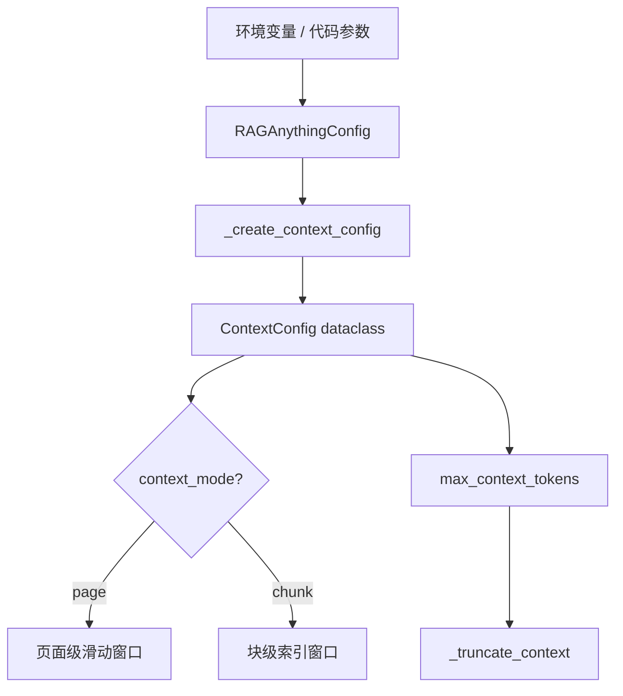
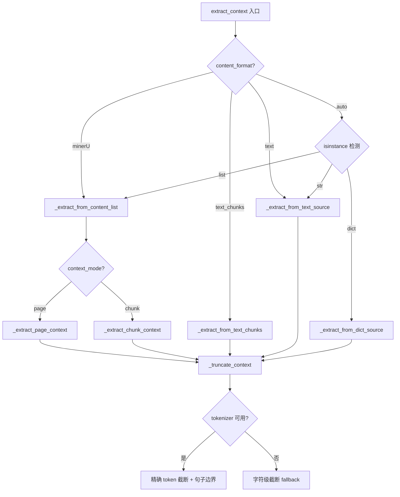

# PD-01.06 RAG-Anything — 多模态上下文提取与 Token 截断

> 文档编号：PD-01.06
> 来源：RAG-Anything `raganything/modalprocessors.py`, `raganything/config.py`
> GitHub：https://github.com/HKUDS/RAG-Anything.git
> 问题域：PD-01 上下文管理 Context Window Management
> 状态：可复用方案

---

## 第 1 章 问题与动机

### 1.1 核心问题

多模态 RAG 系统在处理 PDF、图片、表格、公式等混合内容时，面临一个独特的上下文管理挑战：**每个非文本元素（图片/表格/公式）需要周围的文本上下文来辅助 LLM 理解其语义**，但上下文不能无限膨胀，否则会超出 LLM 的 token 限制或产生不必要的成本。

传统 RAG 系统的上下文管理主要关注对话历史的压缩和裁剪，而 RAG-Anything 面对的是**文档内部的空间上下文**——一张图片的含义取决于它前后页面的文字描述，一个公式的意义取决于周围的推导过程。

### 1.2 RAG-Anything 的解法概述

RAG-Anything 通过 `ContextExtractor` + `ContextConfig` 双组件架构解决此问题：

1. **三模式上下文提取**：支持 page（页面级）、chunk（块级）、token（字符级）三种粒度的上下文窗口（`raganything/modalprocessors.py:126-131`）
2. **精确 Token 截断**：复用 LightRAG 的 tokenizer 进行精确 token 计数，截断时尝试在句子边界断开（`raganything/modalprocessors.py:308-357`）
3. **配置驱动**：所有上下文参数通过 `ContextConfig` dataclass 集中管理，支持环境变量覆盖（`raganything/config.py:75-101`）
4. **运行时热更新**：通过 `update_context_config()` 方法支持运行时修改上下文配置并自动传播到所有处理器（`raganything/raganything.py:521-551`）
5. **多格式适配**：自动检测内容源格式（MinerU、text_chunks、dict、plain text），统一提取上下文（`raganything/modalprocessors.py:62-112`）

### 1.3 设计思想

| 设计原则 | 具体实现 | 理由 | 替代方案 |
|----------|----------|------|----------|
| 配置与逻辑分离 | `ContextConfig` dataclass + 环境变量 | 不同文档类型需要不同的上下文窗口大小 | 硬编码参数 |
| Tokenizer 复用 | 从 LightRAG 实例继承 tokenizer | 确保 token 计数与下游 LLM 一致 | 独立 tokenizer |
| 优雅截断 | 句子/换行边界回退（80% 阈值） | 避免截断在词中间，保持语义完整 | 硬截断 |
| 多粒度窗口 | page/chunk 两种模式 | 页面级适合 PDF，块级适合纯文本 | 仅支持一种模式 |
| 内容类型过滤 | `filter_content_types` 白名单 | 上下文只需要文本，不需要嵌套图片 | 全部包含 |

---

## 第 2 章 源码实现分析

### 2.1 架构概览

RAG-Anything 的上下文管理架构由三层组成：配置层、提取层、消费层。

```
┌─────────────────────────────────────────────────────────┐
│                   RAGAnything (主入口)                    │
│  ┌──────────────┐  ┌──────────────────────────────────┐ │
│  │ContextConfig │──│ _create_context_config()          │ │
│  │  dataclass   │  │ _create_context_extractor()       │ │
│  └──────────────┘  │ update_context_config()           │ │
│                    └──────────────────────────────────┘ │
├─────────────────────────────────────────────────────────┤
│                  ContextExtractor (核心)                  │
│  ┌──────────────┐  ┌──────────────┐  ┌──────────────┐  │
│  │ Page Context  │  │ Chunk Context │  │ Token Trunc  │  │
│  │ (滑动窗口)    │  │ (索引窗口)    │  │ (精确截断)    │  │
│  └──────────────┘  └──────────────┘  └──────────────┘  │
├─────────────────────────────────────────────────────────┤
│              Modal Processors (消费者)                    │
│  ┌────────┐ ┌────────┐ ┌──────────┐ ┌─────────┐       │
│  │ Image  │ │ Table  │ │ Equation │ │ Generic │       │
│  │Processor│ │Processor│ │Processor │ │Processor│       │
│  └────────┘ └────────┘ └──────────┘ └─────────┘       │
│       ↓          ↓           ↓            ↓             │
│  _get_context_for_item() → context → LLM prompt        │
└─────────────────────────────────────────────────────────┘
```

### 2.2 核心实现

#### 2.2.1 ContextConfig — 配置数据类



对应源码 `raganything/config.py:75-101`：

```python
# Context Extraction Configuration
context_window: int = field(default=get_env_value("CONTEXT_WINDOW", 1, int))
"""Number of pages/chunks to include before and after current item for context."""

context_mode: str = field(default=get_env_value("CONTEXT_MODE", "page", str))
"""Context extraction mode: 'page' for page-based, 'chunk' for chunk-based."""

max_context_tokens: int = field(
    default=get_env_value("MAX_CONTEXT_TOKENS", 2000, int)
)
"""Maximum number of tokens in extracted context."""

include_headers: bool = field(default=get_env_value("INCLUDE_HEADERS", True, bool))
include_captions: bool = field(default=get_env_value("INCLUDE_CAPTIONS", True, bool))

context_filter_content_types: List[str] = field(
    default_factory=lambda: get_env_value(
        "CONTEXT_FILTER_CONTENT_TYPES", "text", str
    ).split(",")
)
```

默认值设计：`context_window=1`（前后各 1 页/块）、`max_context_tokens=2000`（约 1500 词），这是一个保守但安全的默认值，适合大多数 LLM 的上下文预算。

#### 2.2.2 ContextExtractor — 上下文提取核心



对应源码 `raganything/modalprocessors.py:133-171`（页面级上下文提取）：

```python
def _extract_page_context(
    self, content_list: List[Dict], current_item_info: Dict
) -> str:
    current_page = current_item_info.get("page_idx", 0)
    window_size = self.config.context_window

    start_page = max(0, current_page - window_size)
    end_page = current_page + window_size + 1

    context_texts = []
    for item in content_list:
        item_page = item.get("page_idx", 0)
        item_type = item.get("type", "")

        if (
            start_page <= item_page < end_page
            and item_type in self.config.filter_content_types
        ):
            text_content = self._extract_text_from_item(item)
            if text_content and text_content.strip():
                if item_page != current_page:
                    context_texts.append(f"[Page {item_page}] {text_content}")
                else:
                    context_texts.append(text_content)

    context = "\n".join(context_texts)
    return self._truncate_context(context)
```

关键设计点：
- **页面标记**：非当前页的上下文会加 `[Page N]` 前缀，帮助 LLM 理解空间关系（`modalprocessors.py:165-166`）
- **类型过滤**：只提取 `filter_content_types` 白名单中的内容类型，默认只取 `text`（`modalprocessors.py:161`）
- **窗口计算**：`start_page = max(0, current_page - window_size)` 防止负索引（`modalprocessors.py:148`）

#### 2.2.3 Token 截断 — 精确且优雅

对应源码 `raganything/modalprocessors.py:308-357`：

```python
def _truncate_context(self, context: str) -> str:
    if not context:
        return ""

    if self.tokenizer:
        tokens = self.tokenizer.encode(context)
        if len(tokens) <= self.config.max_context_tokens:
            return context

        truncated_tokens = tokens[: self.config.max_context_tokens]
        truncated_text = self.tokenizer.decode(truncated_tokens)

        # Try to end at a sentence boundary
        last_period = truncated_text.rfind(".")
        last_newline = truncated_text.rfind("\n")

        if last_period > len(truncated_text) * 0.8:
            return truncated_text[: last_period + 1]
        elif last_newline > len(truncated_text) * 0.8:
            return truncated_text[:last_newline]
        else:
            return truncated_text + "..."
    else:
        # Fallback to character-based truncation
        if len(context) <= self.config.max_context_tokens:
            return context
        truncated = context[: self.config.max_context_tokens]
        last_period = truncated.rfind(".")
        last_newline = truncated.rfind("\n")
        if last_period > len(truncated) * 0.8:
            return truncated[: last_period + 1]
        elif last_newline > len(truncated) * 0.8:
            return truncated[:last_newline]
        else:
            return truncated + "..."
```

截断策略的 80% 阈值含义：只有当句号/换行出现在截断文本的后 20% 区域时才回退到该位置，避免过度丢失内容。

### 2.3 实现细节

#### 运行时热更新机制

`raganything/raganything.py:521-551` 实现了上下文配置的运行时热更新：

```python
def update_context_config(self, **context_kwargs):
    # Update the main config
    for key, value in context_kwargs.items():
        if hasattr(self.config, key):
            setattr(self.config, key, value)

    # Recreate context extractor with new config
    if self.lightrag and self.modal_processors:
        self.context_extractor = self._create_context_extractor()
        # Update all processors with new context extractor
        for processor_name, processor in self.modal_processors.items():
            processor.context_extractor = self.context_extractor
```

这意味着可以在处理不同文档时动态调整上下文窗口大小，无需重新初始化整个系统。

#### Tokenizer 继承链

```
LightRAG.tokenizer → RAGAnything._create_context_extractor() → ContextExtractor.tokenizer
                   → BaseModalProcessor.__init__() → self.tokenizer (用于 chunk token 计数)
```

`BaseModalProcessor.__init__`（`modalprocessors.py:394-400`）中有一个防御性设计：如果外部传入的 `context_extractor` 没有 tokenizer，会自动从 LightRAG 继承：

```python
if self.context_extractor.tokenizer is None:
    self.context_extractor.tokenizer = self.tokenizer
```

#### 上下文注入到 LLM Prompt

每个 Modal Processor 在调用 LLM 时，会根据是否有上下文选择不同的 prompt 模板。以 ImageModalProcessor 为例（`modalprocessors.py:873-899`）：

- 有上下文时使用 `vision_prompt_with_context`，包含 `{context}` 占位符
- 无上下文时使用 `vision_prompt`，不含上下文字段

这种双模板设计避免了在无上下文时向 LLM 发送空的 context 字段。

---

## 第 3 章 迁移指南

### 3.1 迁移清单

**阶段 1：核心组件移植**
- [ ] 复制 `ContextConfig` dataclass，根据项目需求调整默认值
- [ ] 复制 `ContextExtractor` 类，保留 `_truncate_context` 的双路径设计（tokenizer / 字符 fallback）
- [ ] 确保项目中有可用的 tokenizer（tiktoken、transformers 等）

**阶段 2：集成到处理管道**
- [ ] 在内容处理器基类中注入 `ContextExtractor` 实例
- [ ] 实现 `_get_context_for_item()` 方法，统一上下文获取接口
- [ ] 为 LLM prompt 模板添加 `_with_context` 变体

**阶段 3：配置化与运行时调整**
- [ ] 将上下文参数暴露为环境变量或配置文件
- [ ] 实现 `update_context_config()` 热更新方法
- [ ] 添加上下文提取的日志和监控

### 3.2 适配代码模板

以下是一个可直接复用的最小化 ContextExtractor 实现：

```python
from dataclasses import dataclass, field
from typing import List, Dict, Any, Optional


@dataclass
class ContextConfig:
    """上下文提取配置"""
    context_window: int = 1          # 前后各 N 页/块
    context_mode: str = "page"       # "page" | "chunk"
    max_context_tokens: int = 2000   # 最大 token 数
    include_headers: bool = True
    include_captions: bool = True
    filter_content_types: List[str] = field(default_factory=lambda: ["text"])


class ContextExtractor:
    """通用上下文提取器 — 从 RAG-Anything 移植"""

    def __init__(self, config: ContextConfig = None, tokenizer=None):
        self.config = config or ContextConfig()
        self.tokenizer = tokenizer

    def extract_context(
        self,
        content_list: List[Dict[str, Any]],
        current_item_info: Dict[str, Any],
    ) -> str:
        """提取当前元素周围的上下文文本"""
        if not content_list:
            return ""

        if self.config.context_mode == "page":
            return self._extract_page_context(content_list, current_item_info)
        else:
            return self._extract_chunk_context(content_list, current_item_info)

    def _extract_page_context(
        self, content_list: List[Dict], item_info: Dict
    ) -> str:
        current_page = item_info.get("page_idx", 0)
        w = self.config.context_window
        start, end = max(0, current_page - w), current_page + w + 1

        texts = []
        for item in content_list:
            page = item.get("page_idx", 0)
            if start <= page < end and item.get("type") in self.config.filter_content_types:
                text = item.get("text", "")
                if text.strip():
                    prefix = f"[Page {page}] " if page != current_page else ""
                    texts.append(f"{prefix}{text}")

        return self._truncate("\n".join(texts))

    def _extract_chunk_context(
        self, content_list: List[Dict], item_info: Dict
    ) -> str:
        idx = item_info.get("index", 0)
        w = self.config.context_window
        start, end = max(0, idx - w), min(len(content_list), idx + w + 1)

        texts = []
        for i in range(start, end):
            if i != idx:
                item = content_list[i]
                if item.get("type") in self.config.filter_content_types:
                    text = item.get("text", "")
                    if text.strip():
                        texts.append(text)

        return self._truncate("\n".join(texts))

    def _truncate(self, text: str) -> str:
        """精确 token 截断，优先在句子边界断开"""
        if not text:
            return ""

        if self.tokenizer:
            tokens = self.tokenizer.encode(text)
            if len(tokens) <= self.config.max_context_tokens:
                return text
            truncated = self.tokenizer.decode(
                tokens[: self.config.max_context_tokens]
            )
        else:
            if len(text) <= self.config.max_context_tokens:
                return text
            truncated = text[: self.config.max_context_tokens]

        # 尝试在句子边界断开（80% 阈值）
        threshold = len(truncated) * 0.8
        for sep in [".", "\n"]:
            pos = truncated.rfind(sep)
            if pos > threshold:
                return truncated[: pos + 1]
        return truncated + "..."
```

### 3.3 适用场景

| 场景 | 适用度 | 说明 |
|------|--------|------|
| 多模态文档 RAG（PDF/图片/表格） | ⭐⭐⭐ | 核心设计目标，page 模式完美匹配 |
| 纯文本 RAG 的 chunk 上下文增强 | ⭐⭐⭐ | chunk 模式 + text_chunks 格式 |
| Agent 对话历史管理 | ⭐ | 不适用，该方案面向文档内部空间上下文 |
| 长文档摘要压缩 | ⭐⭐ | 可复用截断逻辑，但缺少摘要生成能力 |
| 流式对话 token 预算控制 | ⭐ | 缺少累计预算追踪，仅做单次截断 |

---

## 第 4 章 测试用例

```python
import pytest
from unittest.mock import MagicMock


class MockTokenizer:
    """模拟 tokenizer，1 个字符 ≈ 1 个 token"""
    def encode(self, text: str) -> list:
        return list(text)

    def decode(self, tokens: list) -> str:
        return "".join(tokens)


@dataclass
class ContextConfig:
    context_window: int = 1
    context_mode: str = "page"
    max_context_tokens: int = 2000
    include_headers: bool = True
    include_captions: bool = True
    filter_content_types: list = None

    def __post_init__(self):
        if self.filter_content_types is None:
            self.filter_content_types = ["text"]


class TestContextExtractor:
    """测试 ContextExtractor 核心功能"""

    def _make_content_list(self, pages=5):
        """生成测试用 content_list"""
        items = []
        for p in range(pages):
            items.append({
                "type": "text",
                "text": f"Page {p} text content here.",
                "page_idx": p,
            })
            if p == 2:
                items.append({
                    "type": "image",
                    "img_path": "/tmp/img.png",
                    "page_idx": p,
                })
        return items

    def test_page_context_window_1(self):
        """window=1 时应提取前后各 1 页的文本"""
        from raganything.modalprocessors import ContextExtractor, ContextConfig

        config = ContextConfig(context_window=1, context_mode="page")
        extractor = ContextExtractor(config=config, tokenizer=MockTokenizer())

        content_list = self._make_content_list(5)
        context = extractor.extract_context(
            content_list, {"page_idx": 2}, "minerU"
        )

        assert "Page 1" in context  # 前一页
        assert "Page 2" in context  # 当前页
        assert "Page 3" in context  # 后一页
        assert "Page 0" not in context  # 超出窗口
        assert "Page 4" not in context  # 超出窗口

    def test_page_context_window_0(self):
        """window=0 时应只提取当前页"""
        from raganything.modalprocessors import ContextExtractor, ContextConfig

        config = ContextConfig(context_window=0, context_mode="page")
        extractor = ContextExtractor(config=config, tokenizer=MockTokenizer())

        content_list = self._make_content_list(5)
        context = extractor.extract_context(
            content_list, {"page_idx": 2}, "minerU"
        )

        assert "Page 2" in context
        assert "[Page 1]" not in context
        assert "[Page 3]" not in context

    def test_filter_content_types(self):
        """应只提取 filter_content_types 中的内容类型"""
        from raganything.modalprocessors import ContextExtractor, ContextConfig

        config = ContextConfig(
            context_window=5,
            filter_content_types=["text"],
        )
        extractor = ContextExtractor(config=config, tokenizer=MockTokenizer())

        content_list = self._make_content_list(5)
        context = extractor.extract_context(
            content_list, {"page_idx": 2}, "minerU"
        )

        # 图片内容不应出现在上下文中
        assert "img" not in context.lower() or "image" not in context.lower()

    def test_truncation_with_tokenizer(self):
        """超出 max_context_tokens 时应截断"""
        from raganything.modalprocessors import ContextExtractor, ContextConfig

        config = ContextConfig(max_context_tokens=20)
        extractor = ContextExtractor(config=config, tokenizer=MockTokenizer())

        long_text = "A" * 100
        result = extractor._truncate_context(long_text)

        assert len(result) <= 25  # 20 tokens + 可能的 "..." 后缀

    def test_truncation_sentence_boundary(self):
        """截断应尝试在句子边界断开"""
        from raganything.modalprocessors import ContextExtractor, ContextConfig

        config = ContextConfig(max_context_tokens=50)
        extractor = ContextExtractor(config=config, tokenizer=MockTokenizer())

        text = "First sentence here. Second sentence that is longer and will be cut."
        result = extractor._truncate_context(text)

        # 应在句号处截断（如果句号在 80% 之后）
        assert result.endswith(".") or result.endswith("...")

    def test_fallback_without_tokenizer(self):
        """无 tokenizer 时应回退到字符级截断"""
        from raganything.modalprocessors import ContextExtractor, ContextConfig

        config = ContextConfig(max_context_tokens=20)
        extractor = ContextExtractor(config=config, tokenizer=None)

        long_text = "A" * 100
        result = extractor._truncate_context(long_text)

        assert len(result) <= 25

    def test_chunk_mode(self):
        """chunk 模式应按索引提取上下文"""
        from raganything.modalprocessors import ContextExtractor, ContextConfig

        config = ContextConfig(context_window=1, context_mode="chunk")
        extractor = ContextExtractor(config=config, tokenizer=MockTokenizer())

        chunks = [
            {"type": "text", "text": "Chunk 0"},
            {"type": "text", "text": "Chunk 1"},
            {"type": "text", "text": "Chunk 2"},
            {"type": "text", "text": "Chunk 3"},
        ]

        context = extractor.extract_context(chunks, {"index": 2}, "minerU")

        assert "Chunk 1" in context
        assert "Chunk 3" in context
        assert "Chunk 2" not in context  # 当前块被排除
        assert "Chunk 0" not in context  # 超出窗口

    def test_empty_content_source(self):
        """空内容源应返回空字符串"""
        from raganything.modalprocessors import ContextExtractor, ContextConfig

        extractor = ContextExtractor(tokenizer=MockTokenizer())
        result = extractor.extract_context([], {"page_idx": 0}, "minerU")
        assert result == ""
```

---

## 第 5 章 跨域关联

| 关联域 | 关系类型 | 说明 |
|--------|----------|------|
| PD-04 工具系统 | 协同 | ContextExtractor 作为 Modal Processor 的内置工具，提供上下文增强能力 |
| PD-08 搜索与检索 | 依赖 | 上下文提取的质量直接影响多模态内容被检索时的语义准确性 |
| PD-11 可观测性 | 协同 | 上下文提取的 token 消耗应纳入成本追踪（当前未实现） |
| PD-07 质量检查 | 协同 | 上下文截断后的完整性可作为质量检查维度 |

RAG-Anything 的上下文管理与其他已分析项目的关键差异：

- **vs MiroThinker**：MiroThinker 关注对话历史的 token 预算（85% 阈值），RAG-Anything 关注文档内部空间上下文
- **vs DeerFlow**：DeerFlow 的上下文管理在 Agent 编排层面（子 Agent 隔离），RAG-Anything 在文档处理层面
- **vs LightRAG**：RAG-Anything 直接复用 LightRAG 的 tokenizer，但在其之上增加了多模态上下文提取层

---

## 第 6 章 来源文件索引

| 文件 | 行范围 | 关键实现 |
|------|--------|----------|
| `raganything/modalprocessors.py` | L33-46 | `ContextConfig` dataclass 定义 |
| `raganything/modalprocessors.py` | L49-112 | `ContextExtractor` 类：初始化 + `extract_context` 入口 |
| `raganything/modalprocessors.py` | L114-171 | `_extract_from_content_list` + `_extract_page_context` 页面级提取 |
| `raganything/modalprocessors.py` | L173-204 | `_extract_chunk_context` 块级提取 |
| `raganything/modalprocessors.py` | L206-236 | `_extract_text_from_item` 文本提取（含 header/caption 处理） |
| `raganything/modalprocessors.py` | L308-357 | `_truncate_context` 精确 token 截断 |
| `raganything/modalprocessors.py` | L360-440 | `BaseModalProcessor` 基类（tokenizer 继承、`_get_context_for_item`） |
| `raganything/modalprocessors.py` | L824-929 | `ImageModalProcessor.generate_description_only`（上下文注入 prompt） |
| `raganything/config.py` | L75-101 | 上下文配置字段定义（环境变量支持） |
| `raganything/raganything.py` | L154-175 | `_create_context_config` + `_create_context_extractor` 工厂方法 |
| `raganything/raganything.py` | L177-220 | `_initialize_processors` 处理器初始化（注入 context_extractor） |
| `raganything/raganything.py` | L493-519 | `set_content_source_for_context` 设置内容源 |
| `raganything/raganything.py` | L521-551 | `update_context_config` 运行时热更新 |
| `raganything/prompt.py` | L59-89 | `vision_prompt_with_context` 带上下文的图片分析 prompt |
| `raganything/prompt.py` | L130-160 | `table_prompt_with_context` 带上下文的表格分析 prompt |
| `raganything/prompt.py` | L191-220 | `equation_prompt_with_context` 带上下文的公式分析 prompt |

---

## 第 7 章 横向对比维度

> **重要：** 本章用于自动填充 Butcher Wiki 的横向对比表。

```json comparison_data
{
  "project": "RAG-Anything",
  "dimensions": {
    "估算方式": "LightRAG tokenizer 精确 encode/decode，支持字符级 fallback",
    "压缩策略": "无压缩，仅截断；80% 阈值句子边界回退",
    "触发机制": "每次多模态元素处理时按需提取上下文",
    "实现位置": "独立 ContextExtractor 类，注入到所有 ModalProcessor",
    "容错设计": "tokenizer 不可用时回退字符截断；异常返回空字符串",
    "保留策略": "滑动窗口保留前后 N 页/块，默认 window=1",
    "分割粒度": "page（页面级）和 chunk（块级）双模式",
    "多模态上下文": "为图片/表格/公式提取周围文本作为 LLM 理解辅助",
    "运行时热更新": "update_context_config 动态修改参数并传播到所有处理器"
  }
}
```

### 域元数据补充

```json domain_metadata
{
  "solution_summary": "RAG-Anything 用 ContextExtractor 三模式滑动窗口（page/chunk/token）为多模态元素提取周围文本上下文，通过 LightRAG tokenizer 精确截断并在句子边界回退",
  "description": "多模态文档处理中非文本元素的空间上下文提取与 token 预算控制",
  "sub_problems": [
    "多模态元素上下文：为图片/表格/公式等非文本元素提取周围文本作为 LLM 理解辅助",
    "上下文粒度选择：根据文档类型选择页面级或块级上下文窗口",
    "上下文配置热更新：运行时动态调整上下文参数并传播到所有处理组件"
  ],
  "best_practices": [
    "截断时用 80% 阈值在句子边界回退，避免语义断裂",
    "复用下游 LLM 的 tokenizer 做上下文截断，确保 token 计数一致",
    "为有/无上下文场景准备双 prompt 模板，避免发送空 context 字段"
  ]
}
```
