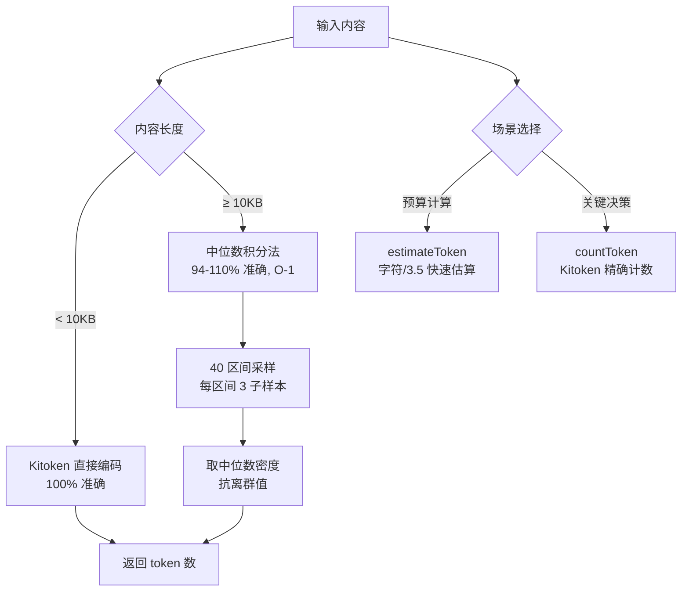
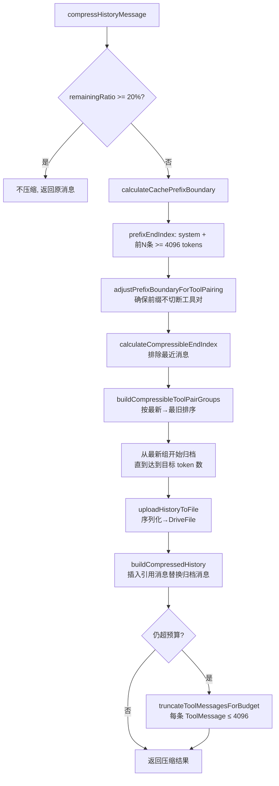

# PD-01.09 Refly — ArchivedRef 路由表与缓存友好上下文压缩

> 文档编号：PD-01.09
> 来源：Refly `packages/skill-template/src/utils/context-manager.ts`
> GitHub：https://github.com/refly-ai/refly.git
> 问题域：PD-01 上下文管理 Context Window Management
> 状态：可复用方案

---

## 第 1 章 问题与动机

### 1.1 核心问题

Agent 在多轮工具调用循环（ReAct loop）中，上下文窗口会被工具输入/输出快速填满。传统的"超限后截断"策略存在三个致命缺陷：

1. **工具调用配对断裂**：LLM API 要求 `AIMessage(tool_calls)` 与对应的 `ToolMessage(tool_call_id)` 严格配对，截断时如果只删了一半，API 直接报错
2. **Prompt 缓存失效**：Anthropic/OpenAI 的 prompt caching 依赖消息前缀的字节级一致性，如果压缩改变了前缀消息，缓存命中率归零，成本翻倍
3. **归档内容不可追溯**：被截断的历史消息彻底丢失，Agent 无法在后续轮次中按需回溯

Refly 的解决方案围绕三个核心创新：**ArchivedRef 路由表**（永不截断的归档索引）、**缓存友好压缩**（从最新消息开始压缩以保护前缀）、**DriveFile 归档**（被压缩的消息上传为文件，Agent 可通过 `read_file` 工具按需读取）。

### 1.2 Refly 的解法概述

1. **双模 Token 估算**：字符比率快速估算（`estimateToken`，~1000x 快于精确计数）用于预算计算，Kitoken 精确计数（`countToken`）用于关键决策，大文件采用中位数积分法实现 O(1) 复杂度（`context-manager.ts:19-24`, `token.ts:66-78`）
2. **ArchivedRef 路由表**：`ContextBlock.archivedRefs` 字段在任何截断操作中都被保护，永不删除，作为归档内容的快速检索索引（`context.ts:130-165`）
3. **缓存友好压缩方向**：计算缓存前缀边界（system + 前 N 条消息 ≥ 4096 tokens），从最新消息向最旧方向压缩，确保前缀字节一致性（`context-manager.ts:559-571`）
4. **工具调用配对保护**：压缩时将 `AIMessage(tool_calls)` 与其所有 `ToolMessage` 作为原子组处理，要么全部归档要么全部保留（`context-manager.ts:416-491`）
5. **DriveFile 归档 + 引用消息**：被压缩的消息序列化后上传到 DriveFile，原位替换为一条 AIMessage 引用消息，Agent 可通过 `read_file` 工具按需读取归档内容（`context-manager.ts:114-122`）

### 1.3 设计思想

| 设计原则 | 具体实现 | 理由 | 替代方案 |
|----------|----------|------|----------|
| 缓存优先 | 从最新消息开始压缩，保护前缀 | Anthropic 缓存可节省 90% 成本 | 从最旧开始压缩（传统方案，破坏缓存） |
| 原子配对 | tool_calls + ToolMessages 作为组操作 | LLM API 要求严格配对 | 逐条消息删除（会导致 API 错误） |
| 可追溯归档 | DriveFile 上传 + ArchivedRef 路由表 | Agent 可按需回溯历史 | 直接丢弃（信息永久丢失） |
| 双模估算 | 快速估算做预算，精确计数做决策 | 平衡性能与准确性 | 全部精确计数（性能差 1000x） |
| 元数据优先 | ContextBlock 只存文件元数据，不存内容 | 大幅减少上下文占用 | 全量内容注入（浪费 token） |

---

## 第 2 章 源码实现分析

### 2.1 架构概览

Refly 的上下文管理分为三层：Token 计数层、上下文准备层、历史压缩层。

```
┌─────────────────────────────────────────────────────────────────┐
│                     Agent Loop (ReAct)                          │
│  每轮 LLM 调用前 → compressAgentLoopMessages()                  │
└──────────────┬──────────────────────────────────────────────────┘
               │
    ┌──────────▼──────────┐
    │  Budget Calculator   │  targetBudget = contextLimit - maxOutput
    │  (model-aware)       │  remainingBudget = targetBudget - currentTokens
    └──────────┬──────────┘
               │ remainingRatio < 20%?
    ┌──────────▼──────────┐
    │  Cache Prefix Guard  │  calculateCachePrefixBoundary()
    │  (≥ 4096 tokens)     │  → prefixEndIndex（不可压缩）
    └──────────┬──────────┘
               │
    ┌──────────▼──────────┐
    │  Tool Pair Grouper   │  buildCompressibleToolPairGroups()
    │  (原子配对保护)       │  → toolPairGroups + standaloneMessages
    └──────────┬──────────┘
               │ 从最新→最旧归档
    ┌──────────▼──────────┐
    │  DriveFile Archiver  │  uploadHistoryToFile()
    │  + Reference Message │  → createHistoryReferenceMessage()
    └──────────┬──────────┘
               │ 仍超预算?
    ┌──────────▼──────────┐
    │  ToolMessage Truncator│  truncateToolMessagesForBudget()
    │  (head 70% + tail 30%)│  → 每条 ToolMessage ≤ 4096 tokens
    └─────────────────────┘
```

### 2.2 核心实现

#### 2.2.1 双模 Token 估算体系



对应源码 `packages/utils/src/token.ts:66-78`：

```typescript
export const countToken = (content: string): number => {
  if (!content) return 0;
  const len = content.length;
  // Small content: direct encode (accurate)
  if (len < SMALL_CONTENT_THRESHOLD) {
    return getEncoder().encode(content, false).length;
  }
  // Large content: median integration estimation (O(1))
  return countTokenMedianIntegration(content);
};
```

快速估算层 `packages/skill-template/src/scheduler/utils/token.ts:13-24`：

```typescript
const CHARS_PER_TOKEN = 3.5;

export const estimateToken = (content: MessageContent): number => {
  const inputText = Array.isArray(content)
    ? content.map((msg) => (msg.type === 'text' ? msg.text : '')).join('')
    : String(content || '');
  return Math.ceil(inputText.length / CHARS_PER_TOKEN);
};
```

中位数积分法 `packages/utils/src/token.ts:234-276` 的核心思路：将大文件分为 40 个区间，每个区间采样 3 个子点计算 token 密度，取中位数（抗离群值）后积分，总采样量固定约 35KB，实现 O(1) 复杂度。

#### 2.2.2 缓存友好压缩算法



对应源码 `packages/skill-template/src/utils/context-manager.ts:572-727`：

```typescript
export async function compressHistoryMessage(args: {
  chatHistory: BaseMessage[];
  remainingBudget: number;
  targetBudget: number;
  context: HistoryCompressionContext;
}): Promise<HistoryCompressionResult> {
  const { chatHistory, remainingBudget, targetBudget, context } = args;
  const remainingRatio = targetBudget > 0 ? remainingBudget / targetBudget : 1;

  if (remainingRatio >= REMAINING_SPACE_THRESHOLD || chatHistory.length < 3) {
    return { compressedHistory: chatHistory, wasCompressed: false,
             archivedMessageCount: 0, tokensSaved: 0 };
  }

  // 1. Cache prefix boundary
  const prefixEndIndex = calculateCachePrefixBoundary(chatHistory);
  if (prefixEndIndex >= chatHistory.length - 1) {
    return { compressedHistory: chatHistory, wasCompressed: false,
             archivedMessageCount: 0, tokensSaved: 0 };
  }

  // 2. Compressible range
  const compressibleStartIndex = prefixEndIndex;
  const compressibleEndIndex = calculateCompressibleEndIndex(chatHistory, compressibleStartIndex);

  // 3. Target tokens to free
  const minRemainingTokens = targetBudget * REMAINING_SPACE_THRESHOLD;
  const tokensToFree = Math.max(0, -remainingBudget + minRemainingTokens);
  const compressibleTokens = estimateMessagesTokens(
    chatHistory.slice(compressibleStartIndex, compressibleEndIndex));
  const targetTokensToArchive = Math.max(tokensToFree,
    Math.floor(compressibleTokens * HISTORY_COMPRESS_RATIO));

  // 4-5. Compress newest first
  const { toolPairGroups, standaloneMessages } = buildCompressibleToolPairGroups(
    chatHistory, compressibleStartIndex, compressibleEndIndex);

  let archivedTokens = 0;
  const archivedIndices = new Set<number>();
  for (const group of toolPairGroups) {
    if (archivedTokens >= targetTokensToArchive) break;
    archivedIndices.add(group.aiMessage.index);
    for (const toolEntry of group.toolMessages) {
      archivedIndices.add(toolEntry.index);
    }
    archivedTokens += group.totalTokens;
  }
  // ... standalone messages compression ...

  // 6-7. Upload and build compressed history
  const messagesToArchive = chatHistory.filter((_, i) => archivedIndices.has(i));
  const { fileId } = await uploadHistoryToFile({ messages: messagesToArchive, context });
  const compressedHistory = buildCompressedHistory(
    chatHistory, archivedIndices, messagesToArchive, toolPairGroups, fileId);
  // ...
}
```

### 2.3 实现细节

#### ArchivedRef 路由表

`packages/skill-template/src/scheduler/utils/context.ts:130-165` 定义了 `ArchivedRef` 类型和 `ContextBlock`：

```typescript
export type ArchivedRefType = 'search_result' | 'chat_history' | 'tool_output' | 'context_file';

export interface ArchivedRef {
  fileId: string;           // DriveFile ID，用于 read_file 检索
  type: ArchivedRefType;    // 归档内容类型
  source: string;           // 来源标识
  summary: string;          // 简要描述
  archivedAt: number;       // 归档时间戳
  tokensSaved: number;      // 节省的 token 数
  itemCount?: number;       // 原始条目数
}

export interface ContextBlock {
  files: ContextFileMeta[];
  resultsMeta?: AgentResultMeta[];
  totalTokens?: number;
  archivedRefs?: ArchivedRef[];  // 永不截断的路由表
}
```

在 `truncateContextBlockForPrompt`（`context-manager.ts:733-778`）中，`archivedRefs` 被显式保护：

```typescript
export function truncateContextBlockForPrompt(context, maxTokens, opts?) {
  // IMPORTANT: Always preserve archivedRefs
  const archivedRefs = context?.archivedRefs;
  const resultsMeta = context?.resultsMeta;
  // ... 截断 files ...
  return { files, resultsMeta, totalTokens: usedTokens, archivedRefs };
}
```

#### 缓存前缀边界计算

`context-manager.ts:221-250` 的 `calculateCachePrefixBoundary` 确保前缀满足最低 4096 tokens（Anthropic 缓存最低要求），并通过 `adjustPrefixBoundaryForToolPairing` 保证前缀不会切断工具调用配对。

#### 元数据优先的上下文准备

`context.ts:361-424` 的 `prepareContext` 只存储文件元数据（name, fileId, type, summary），不存储文件内容。LLM 需要时通过 `read_file` 工具按需读取，大幅减少上下文占用。

#### 关键词驱动的摘要提取

`context.ts:248-279` 的 `extractSummaryFromContent` 使用中英文关键词（"已完成"、"completed"、"in summary" 等 39 个）从内容末尾反向搜索摘要段落，限制在 100 tokens 以内。

#### 两级 Prompt 缓存策略

`message.ts:341-371` 的 `applyContextCaching` 实现两级缓存：
- **全局静态点**：System Prompt 后添加 `cachePoint`（跨用户共享）
- **会话动态点**：最后 3 条可缓存消息添加 `cachePoint`（会话内复用）


---

## 第 3 章 迁移指南

### 3.1 迁移清单

**阶段 1：Token 估算基础设施**
- [ ] 引入 Kitoken（或 tiktoken）作为精确 tokenizer
- [ ] 实现双模估算：快速估算（字符/3.5）+ 精确计数
- [ ] 为大文件实现中位数积分法（可选，>10KB 文件场景）

**阶段 2：工具调用配对保护**
- [ ] 实现 `ToolPairGroup` 数据结构，将 AIMessage(tool_calls) 与 ToolMessage 绑定
- [ ] 实现边界调整函数，确保压缩/缓存边界不切断配对
- [ ] 添加单元测试验证配对完整性

**阶段 3：缓存友好压缩**
- [ ] 实现缓存前缀边界计算（system + 前 N 条 ≥ 最低缓存 token 数）
- [ ] 实现从最新→最旧的压缩方向
- [ ] 实现 DriveFile 归档（或替换为你的文件存储方案）
- [ ] 实现引用消息替换

**阶段 4：ArchivedRef 路由表**
- [ ] 在 ContextBlock 中添加 `archivedRefs` 字段
- [ ] 在所有截断函数中保护该字段
- [ ] 在 system prompt 中告知 LLM 可通过 `read_file` 读取归档内容

### 3.2 适配代码模板

以下是一个可直接复用的缓存友好压缩核心逻辑（TypeScript + LangChain）：

```typescript
import { BaseMessage, AIMessage, ToolMessage } from '@langchain/core/messages';

// ---- 配置常量 ----
const CACHE_MIN_TOKENS = 4096;
const REMAINING_SPACE_THRESHOLD = 0.2;  // 20% 剩余空间触发压缩
const HISTORY_COMPRESS_RATIO = 0.7;     // 压缩 70% 可压缩消息
const MAX_TOOL_MESSAGE_TOKENS = 4096;

// ---- 工具配对组 ----
interface ToolPairGroup {
  aiMessage: { msg: BaseMessage; index: number; tokens: number };
  toolMessages: { msg: BaseMessage; index: number; tokens: number }[];
  totalTokens: number;
}

// ---- 核心：缓存前缀边界 ----
function calculateCachePrefixBoundary(
  messages: BaseMessage[],
  estimateTokenFn: (msg: BaseMessage) => number,
): number {
  let prefixEnd = Math.min(3, messages.length); // system + 2 条
  let prefixTokens = 0;
  for (let i = 0; i < prefixEnd; i++) {
    prefixTokens += estimateTokenFn(messages[i]);
  }
  // 扩展直到满足最低缓存要求
  while (prefixEnd < messages.length && prefixTokens < CACHE_MIN_TOKENS) {
    prefixTokens += estimateTokenFn(messages[prefixEnd]);
    prefixEnd++;
  }
  // 确保不切断工具配对（省略，参考 Refly 的 adjustPrefixBoundaryForToolPairing）
  return prefixEnd;
}

// ---- 核心：从最新开始压缩 ----
function compressCacheFriendly(
  messages: BaseMessage[],
  prefixEnd: number,
  compressibleEnd: number,
  targetTokensToArchive: number,
  estimateTokenFn: (msg: BaseMessage) => number,
): Set<number> {
  const archivedIndices = new Set<number>();
  let archivedTokens = 0;

  // 构建工具配对组，按最新→最旧排序
  const groups = buildToolPairGroups(messages, prefixEnd, compressibleEnd, estimateTokenFn);
  for (const group of groups) {
    if (archivedTokens >= targetTokensToArchive) break;
    archivedIndices.add(group.aiMessage.index);
    group.toolMessages.forEach(t => archivedIndices.add(t.index));
    archivedTokens += group.totalTokens;
  }
  return archivedIndices;
}
```

### 3.3 适用场景

| 场景 | 适用度 | 说明 |
|------|--------|------|
| 多轮工具调用 Agent | ⭐⭐⭐ | 核心场景，工具输出快速填满上下文 |
| 长对话聊天机器人 | ⭐⭐⭐ | 缓存友好压缩显著降低成本 |
| RAG + Agent 混合 | ⭐⭐ | ArchivedRef 路由表适合管理检索结果归档 |
| 单轮问答 | ⭐ | 无需压缩，过度设计 |
| 流式生成（无工具） | ⭐ | 无工具配对问题，简单截断即可 |

---

## 第 4 章 测试用例

```typescript
import { AIMessage, HumanMessage, ToolMessage, SystemMessage } from '@langchain/core/messages';

// 模拟 estimateToken
const estimateToken = (content: string | any) => {
  const text = typeof content === 'string' ? content : JSON.stringify(content);
  return Math.ceil(text.length / 3.5);
};

describe('CacheFriendlyCompression', () => {
  // 构造测试消息序列
  const buildTestMessages = (toolPairCount: number): any[] => {
    const msgs: any[] = [new SystemMessage('You are a helpful assistant.')];
    for (let i = 0; i < toolPairCount; i++) {
      msgs.push(new HumanMessage(`Question ${i}`));
      msgs.push(new AIMessage({
        content: `Thinking about question ${i}...`,
        tool_calls: [{ id: `call_${i}`, name: `tool_${i}`, args: {} }],
      }));
      msgs.push(new ToolMessage({
        content: `Result for question ${i}: ${'x'.repeat(500)}`,
        tool_call_id: `call_${i}`,
      }));
    }
    msgs.push(new HumanMessage('Final question'));
    return msgs;
  };

  test('should not compress when remaining ratio >= 20%', () => {
    const messages = buildTestMessages(2);
    // 模拟充足预算
    const remainingRatio = 0.5;
    expect(remainingRatio >= 0.2).toBe(true);
    // 不触发压缩
  });

  test('should preserve cache prefix (system + first N messages)', () => {
    const messages = buildTestMessages(5);
    const prefixEnd = 3; // system + 2 messages
    // 验证前缀消息不在归档集合中
    const archivedIndices = new Set([6, 7, 8, 9, 10, 11]); // 最新的工具对
    for (let i = 0; i < prefixEnd; i++) {
      expect(archivedIndices.has(i)).toBe(false);
    }
  });

  test('should keep tool_calls and ToolMessages as atomic group', () => {
    const messages = buildTestMessages(3);
    // AIMessage at index 4 has tool_calls[{id: 'call_1'}]
    // ToolMessage at index 5 has tool_call_id: 'call_1'
    // 如果归档 index 4，必须同时归档 index 5
    const archivedIndices = new Set<number>();
    // 模拟归档第二个工具对
    archivedIndices.add(4); // AI with tool_calls
    archivedIndices.add(5); // corresponding ToolMessage
    // 验证配对完整
    expect(archivedIndices.has(4) && archivedIndices.has(5)).toBe(true);
  });

  test('should compress newest messages first', () => {
    const messages = buildTestMessages(4);
    // 最新的工具对在 index 10,11,12
    // 最旧的工具对在 index 1,2,3
    // 压缩应该先归档 10,11,12 再归档 7,8,9
    const compressionOrder = [10, 11, 12, 7, 8, 9, 4, 5, 6];
    // 验证最新的先被归档
    expect(compressionOrder[0]).toBeGreaterThan(compressionOrder[3]);
  });

  test('should truncate ToolMessage content when still over budget', () => {
    const longContent = 'x'.repeat(20000); // ~5714 tokens
    const truncated = truncateContentFast(longContent, 4096);
    const truncatedTokens = estimateToken(truncated);
    expect(truncatedTokens).toBeLessThanOrEqual(4096 + 50); // 50 token margin
  });
});

// 辅助函数
function truncateContentFast(content: string, targetTokens: number): string {
  const estimatedTokens = Math.ceil(content.length / 3.5);
  if (estimatedTokens <= targetTokens) return content;
  const headChars = Math.floor((targetTokens - 50) * 0.7 * 3.5);
  const tailChars = Math.floor((targetTokens - 50) * 0.3 * 3.5);
  return `${content.substring(0, headChars)}\n\n[... Truncated ...]\n\n${content.substring(content.length - tailChars)}`;
}
```


---

## 第 5 章 跨域关联

| 关联域 | 关系类型 | 说明 |
|--------|----------|------|
| PD-02 多 Agent 编排 | 协同 | `compressAgentLoopMessages` 在 ReAct 循环中每轮调用，编排器需要在调度前触发压缩 |
| PD-04 工具系统 | 依赖 | 工具调用配对保护（ToolPairGroup）直接依赖工具系统的 tool_call_id 机制 |
| PD-06 记忆持久化 | 协同 | DriveFile 归档本质上是一种记忆持久化，ArchivedRef 路由表是记忆索引 |
| PD-08 搜索与检索 | 协同 | ArchivedRef 支持 `search_result` 类型，检索结果归档后可通过路由表按需读取 |
| PD-11 可观测性 | 协同 | 压缩结果包含 tokensSaved、archivedMessageCount 等指标，可接入成本追踪 |

---

## 第 6 章 来源文件索引

| 文件 | 行范围 | 关键实现 |
|------|--------|----------|
| `packages/skill-template/src/utils/context-manager.ts` | L1-L1082 | 历史压缩核心：compressHistoryMessage, compressAgentLoopMessages, truncateContextBlockForModelPrompt |
| `packages/skill-template/src/scheduler/utils/context.ts` | L1-L425 | ContextBlock/ArchivedRef 类型定义, prepareContext, extractSummaryFromContent |
| `packages/skill-template/src/scheduler/utils/token.ts` | L1-L100 | 双模 Token 估算：estimateToken（快速）, countToken（精确）, truncateContentFast |
| `packages/utils/src/token.ts` | L1-L277 | Kitoken 初始化, countToken（含中位数积分法）, truncateContent（含积分搜索） |
| `packages/skill-template/src/scheduler/utils/message.ts` | L1-L403 | buildFinalRequestMessages, applyContextCaching（两级缓存策略）, applyAgentLoopCaching |
| `packages/skill-template/src/scheduler/utils/queryProcessor.ts` | L1-L39 | processQuery: 计算 remainingTokens = maxTokens - queryTokens - chatHistoryTokens |

---

## 第 7 章 横向对比维度

```json comparison_data
{
  "project": "Refly",
  "dimensions": {
    "估算方式": "双模：字符/3.5 快速估算 + Kitoken 精确计数 + 大文件中位数积分 O(1)",
    "压缩策略": "缓存友好：从最新消息向最旧压缩，保护前缀字节一致性",
    "触发机制": "剩余预算比 < 20% 时触发，每轮 Agent Loop 调用前检查",
    "实现位置": "独立 context-manager.ts 模块，与 Agent 循环解耦",
    "容错设计": "DriveFile 上传失败则跳过压缩，ToolMessage 二次截断兜底",
    "保留策略": "ArchivedRef 路由表永不截断，归档内容可通过 read_file 按需读取",
    "Prompt模板化": "SkillPromptModule 接口 + ContextBlock 结构化注入",
    "子Agent隔离": "元数据优先：ContextBlock 只存 meta，LLM 按需 read_file 读取内容",
    "AI/Tool消息对保护": "ToolPairGroup 原子组：AIMessage + 所有 ToolMessage 整体归档或保留",
    "缓存前缀保护": "system + 前 N 条 ≥ 4096 tokens 作为不可压缩前缀",
    "二次截断兜底": "压缩后仍超预算时，每条 ToolMessage 截断至 ≤ 4096 tokens",
    "摘要提取": "39 个中英文关键词反向搜索 + 段落边界扩展，≤ 100 tokens"
  }
}
```

### 域元数据补充

```json domain_metadata
{
  "solution_summary": "Refly 用 ArchivedRef 永不截断路由表 + 缓存友好压缩（从最新消息开始归档保护前缀）+ DriveFile 归档实现可追溯的上下文管理",
  "description": "Agent Loop 中每轮 LLM 调用前的自动上下文压缩与归档追溯",
  "sub_problems": [
    "缓存前缀保护：压缩时保护消息前缀的字节一致性以维持 prompt caching 命中率",
    "归档内容可追溯：被压缩的消息不丢弃而是归档为文件，Agent 可按需读取",
    "元数据优先注入：上下文只注入文件/结果的元数据，LLM 按需通过工具读取全文",
    "ToolMessage 二次截断：历史压缩后仍超预算时对工具输出内容做 head/tail 截断兜底",
    "关键词驱动摘要提取：用中英文完成/总结关键词从内容末尾反向定位摘要段落"
  ],
  "best_practices": [
    "缓存友好压缩方向：从最新消息开始压缩而非最旧，保护前缀缓存命中率（Anthropic 90% / OpenAI 50% 成本节省）",
    "归档而非丢弃：被压缩的消息上传为文件并留下引用消息，Agent 可通过工具按需回溯",
    "两级 Prompt 缓存：全局静态点（System Prompt 后）+ 会话动态点（最后 3 条消息），最大化缓存复用"
  ]
}
```

