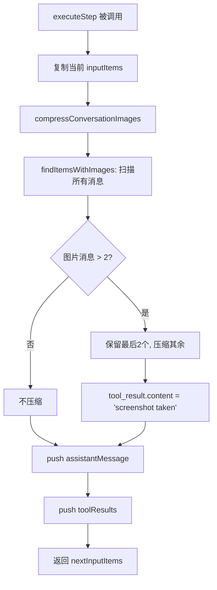
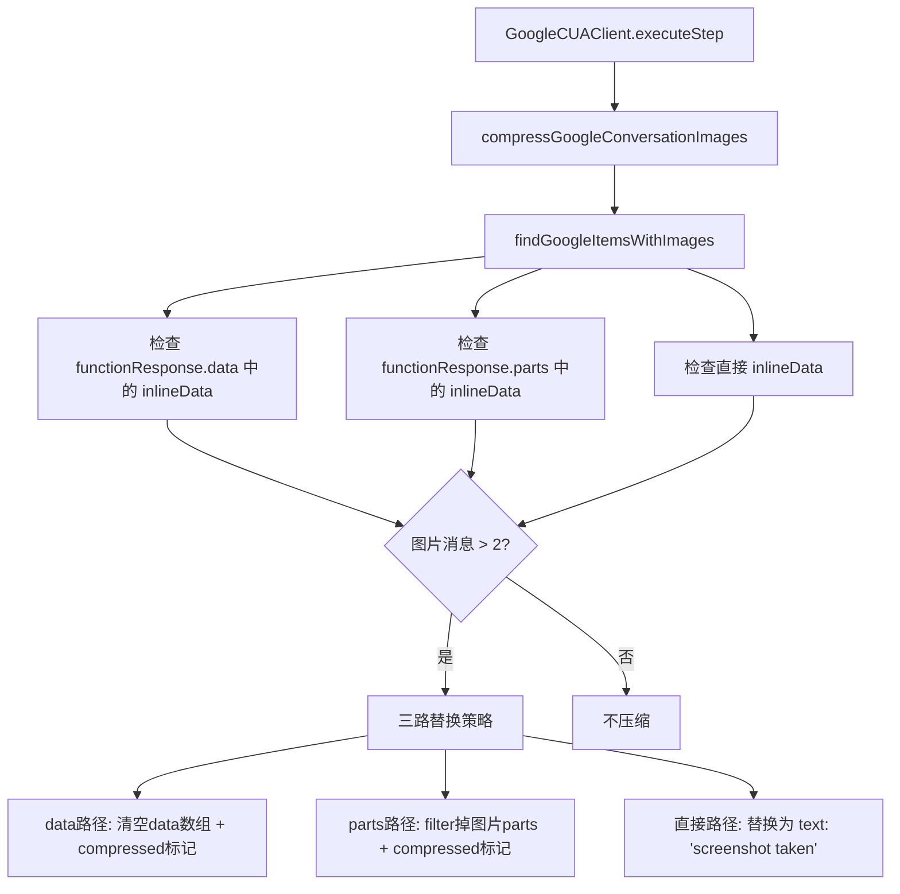
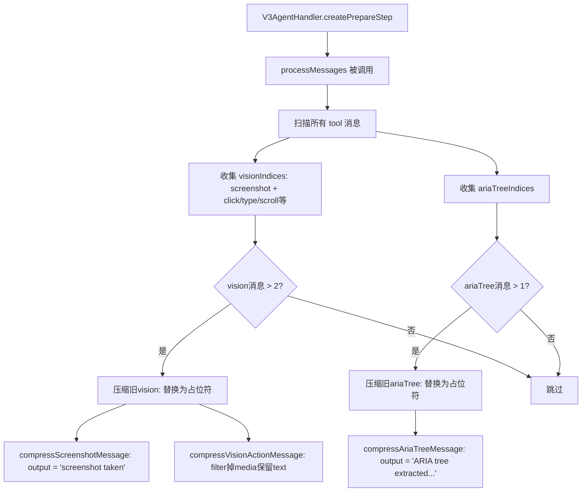

# PD-01.NN Stagehand — 多供应商截图滑动窗口压缩

> 文档编号：PD-01.NN
> 来源：Stagehand `packages/core/lib/v3/agent/utils/imageCompression.ts`, `packages/core/lib/v3/agent/utils/messageProcessing.ts`
> GitHub：https://github.com/browserbase/stagehand.git
> 问题域：PD-01 上下文管理 Context Window Management
> 状态：可复用方案

---

## 第 1 章 问题与动机

### 1.1 核心问题

浏览器自动化 Agent 的每一步操作都会产生截图（base64 编码的 PNG/JPEG），一张截图通常消耗 1000-3000 tokens。在一个 10-20 步的 Agent 任务中，仅截图就可能消耗 20000-60000 tokens，轻松突破上下文窗口限制。

更复杂的是，Stagehand 同时支持三家 LLM 供应商（Anthropic、OpenAI、Google），每家的消息格式完全不同：
- Anthropic 使用 `tool_result` 嵌套 `image` 类型的 content block
- OpenAI 使用 `computer_call_output` 带 `input_image` 类型的 output
- Google 使用 `functionResponse` 带 `inlineData` 的 parts 结构

这意味着图片压缩逻辑不能写一套通用的，必须为每个供应商实现独立的检测和替换逻辑。

此外，Agent 还会产生 ariaTree（无障碍树）数据，这是一种大型文本结构，描述页面上所有可交互元素。ariaTree 数据量同样巨大，但与截图不同，它只需保留最新一份即可（因为页面状态是最新的才有意义）。

### 1.2 Stagehand 的解法概述

Stagehand 采用**双层滑动窗口**策略，在两个不同的抽象层级实现上下文压缩：

1. **CUA 层图片压缩**（`imageCompression.ts`）：在 Anthropic/Google CUA 客户端的 `executeStep` 方法中，每步执行前压缩对话历史中的旧截图，保留最近 2 张，旧图替换为 `"screenshot taken"` 文本占位符（`imageCompression.ts:64-303`）
2. **AI SDK 层消息处理**（`messageProcessing.ts`）：在 v3AgentHandler 的 `prepareStep` 回调中，对 AI SDK 格式的消息做二次压缩——截图/视觉操作保留最近 2 个，ariaTree 保留最近 1 个（`messageProcessing.ts:60-108`）
3. **供应商隔离**：三家供应商各有独立的 find + compress 函数对，互不干扰（`imageCompression.ts` 中 Anthropic/OpenAI/Google 各一套）
4. **就地修改**：所有压缩操作都是 in-place 修改消息数组，避免深拷贝开销
5. **Anthropic prompt caching**：系统消息附加 `cacheControl: { type: "ephemeral" }` 以利用 Anthropic 的 prompt caching（`v3AgentHandler.ts:59-62`）

### 1.3 设计思想

| 设计原则 | 具体实现 | 理由 | 替代方案 |
|----------|----------|------|----------|
| 多模态优先压缩 | 只压缩图片/ariaTree，保留文本消息 | 图片是 token 消耗大户（单张 1000-3000 tokens），文本消息相对廉价 | 全消息滑动窗口（会丢失重要文本上下文） |
| 供应商格式隔离 | 每个供应商独立的 find/compress 函数 | 三家 API 消息结构差异大，统一抽象层反而增加复杂度 | 统一消息格式中间层（需要序列化/反序列化开销） |
| 占位符替换而非删除 | 旧截图替换为 `"screenshot taken"` | LLM 仍能知道"这里曾经有截图"，保持对话连贯性 | 直接删除消息（可能导致工具调用/结果不配对） |
| 差异化保留策略 | 截图保留 2 张，ariaTree 保留 1 份 | 截图需要前后对比（操作前后），ariaTree 只需最新页面状态 | 统一保留数量（浪费或不足） |
| 就地修改 | `forEach` + 直接赋值，不创建新数组 | 避免大型 base64 字符串的深拷贝，减少内存压力 | 不可变更新（函数式风格但内存开销大） |

---

## 第 2 章 源码实现分析

### 2.1 架构概览

Stagehand 的上下文压缩分布在两个层级，分别服务于 CUA（Computer Use Agent）模式和 AI SDK Agent 模式：

```
┌─────────────────────────────────────────────────────────┐
│                    Agent 执行入口                         │
├──────────────────────┬──────────────────────────────────┤
│   CUA 模式           │   AI SDK 模式                     │
│   (直接调用供应商API)  │   (通过 Vercel AI SDK)            │
├──────────────────────┼──────────────────────────────────┤
│ AnthropicCUAClient   │                                  │
│   └─ executeStep()   │   V3AgentHandler                 │
│      └─ compress     │     └─ prepareStep()             │
│         Conversation │        └─ processMessages()      │
│         Images()     │           ├─ 截图: 保留最近2个     │
│                      │           └─ ariaTree: 保留最近1个 │
│ GoogleCUAClient      │                                  │
│   └─ executeStep()   │                                  │
│      └─ compress     │                                  │
│         Google       │                                  │
│         Conversation │                                  │
│         Images()     │                                  │
│                      │                                  │
│ OpenAICUAClient      │                                  │
│   (无压缩,用         │                                  │
│    previousResponseId│                                  │
│    延续对话)          │                                  │
└──────────────────────┴──────────────────────────────────┘
```

关键发现：OpenAI CUA 客户端虽然定义了 `compressOpenAIConversationImages` 函数（`imageCompression.ts:189`），但实际从未调用。OpenAI 的 Responses API 使用 `previousResponseId` 机制让服务端管理对话历史，客户端无需自行压缩。

### 2.2 核心实现

#### 2.2.1 CUA 层：Anthropic 图片压缩



对应源码 `packages/core/lib/v3/agent/utils/imageCompression.ts:64-104`：

```typescript
export function compressConversationImages(
  items: ResponseInputItem[],
  keepMostRecentCount: number = 2,
): { items: ResponseInputItem[] } {
  const itemsWithImages = findItemsWithImages(items);

  items.forEach((item, index) => {
    const imageIndex = itemsWithImages.indexOf(index);
    const shouldCompress =
      imageIndex >= 0 &&
      imageIndex < itemsWithImages.length - keepMostRecentCount;

    if (shouldCompress) {
      if (Array.isArray(item.content)) {
        item.content = item.content.map(
          (contentItem: AnthropicContentBlock) => {
            if (
              contentItem.type === "tool_result" &&
              "content" in contentItem &&
              Array.isArray(contentItem.content) &&
              (contentItem.content as AnthropicContentBlock[]).some(
                (nestedItem: AnthropicContentBlock) =>
                  nestedItem.type === "image",
              )
            ) {
              return {
                ...contentItem,
                content: "screenshot taken",
              } as AnthropicContentBlock;
            }
            return contentItem;
          },
        );
      }
    }
  });

  return { items };
}
```

调用点在 `AnthropicCUAClient.ts:351`，位于 `executeStep` 方法中，在 push 新的 assistant 消息之前执行压缩：

```typescript
// AnthropicCUAClient.ts:348-353
const nextInputItems: ResponseInputItem[] = [...inputItems];
// Add the assistant message with tool_use blocks to the history
compressConversationImages(nextInputItems);
nextInputItems.push(assistantMessage);
```

#### 2.2.2 CUA 层：Google 图片压缩



对应源码 `packages/core/lib/v3/agent/utils/imageCompression.ts:229-303`：

```typescript
export function compressGoogleConversationImages(
  items: GoogleContent[],
  keepMostRecentCount: number = 2,
): { items: GoogleContent[] } {
  const itemsWithImages = findGoogleItemsWithImages(items);

  items.forEach((item, index) => {
    const imageIndex = itemsWithImages.indexOf(index);
    const shouldCompress =
      imageIndex >= 0 &&
      imageIndex < itemsWithImages.length - keepMostRecentCount;

    if (shouldCompress && item.parts && Array.isArray(item.parts)) {
      item.parts = item.parts.map((part: GooglePart) => {
        // 三路检测: functionResponse.data / functionResponse.parts / 直接 inlineData
        if (part.functionResponse?.response?.data) {
          const data = part.functionResponse.response.data as FunctionResponseData[];
          const hasImage = data.some((dataItem) =>
            dataItem.inlineData?.mimeType?.startsWith("image/"),
          );
          if (hasImage) {
            return {
              ...part,
              functionResponse: {
                ...part.functionResponse,
                data: [] as FunctionResponseData[],
                response: {
                  ...part.functionResponse.response,
                  compressed: "screenshot taken",
                },
              },
            };
          }
        }
        // ... (parts 路径和直接 inlineData 路径类似)
        return part;
      });
    }
  });

  return { items };
}
```

调用点在 `GoogleCUAClient.ts:357-360`：

```typescript
// GoogleCUAClient.ts:356-361
const compressedResult = compressGoogleConversationImages(
  this.history,
  2,
);
const compressedHistory = compressedResult.items;
```

#### 2.2.3 AI SDK 层：消息处理（截图 + ariaTree 双通道压缩）



对应源码 `packages/core/lib/v3/agent/utils/messageProcessing.ts:60-108`：

```typescript
export function processMessages(messages: ModelMessage[]): number {
  let compressedCount = 0;

  const visionIndices: number[] = [];
  const ariaTreeIndices: number[] = [];

  for (let i = 0; i < messages.length; i++) {
    const message = messages[i];
    if (isToolMessage(message)) {
      const content = message.content as unknown[];
      if (content.some(isVisionPart)) {
        visionIndices.push(i);
      }
      if (content.some(isAriaTreePart)) {
        ariaTreeIndices.push(i);
      }
    }
  }

  // 截图/视觉操作: 保留最近 2 个
  if (visionIndices.length > 2) {
    const toCompress = visionIndices.slice(0, visionIndices.length - 2);
    for (const index of toCompress) {
      const message = messages[index];
      if (isToolMessage(message)) {
        compressScreenshotMessage(message);
        compressVisionActionMessage(message);
        compressedCount++;
      }
    }
  }

  // ariaTree: 保留最近 1 个
  if (ariaTreeIndices.length > 1) {
    const toCompress = ariaTreeIndices.slice(0, ariaTreeIndices.length - 1);
    for (const idx of toCompress) {
      const message = messages[idx];
      if (isToolMessage(message)) {
        compressAriaTreeMessage(message);
        compressedCount++;
      }
    }
  }

  return compressedCount;
}
```

调用点在 `v3AgentHandler.ts:171-181`，作为 AI SDK 的 `prepareStep` 回调：

```typescript
// v3AgentHandler.ts:171-181
private createPrepareStep(
  userCallback?: PrepareStepFunction<ToolSet>,
): PrepareStepFunction<ToolSet> {
  return async (options) => {
    processMessages(options.messages);
    if (userCallback) {
      return userCallback(options);
    }
    return options;
  };
}
```

### 2.3 实现细节

**视觉操作工具分类**（`messageProcessing.ts:4-11`）：

Stagehand 将 7 种浏览器操作工具归类为"视觉操作工具"，它们的结果中包含截图：
- `click`, `type`, `dragAndDrop`, `wait`, `fillFormVision`, `scroll`
- 加上独立的 `screenshot` 工具

压缩视觉操作消息时，策略是**保留文本结果、只移除 media 内容**（`messageProcessing.ts:180-184`）：

```typescript
const filteredValue = (
  typedPart.output.value as Array<{ type?: string }>
).filter(
  (item) => item && typeof item === "object" && item.type !== "media",
);
```

这比截图工具的处理更精细——截图工具直接替换为 `"screenshot taken"`，而视觉操作工具保留了操作结果的文本描述（如点击是否成功），只移除附带的截图。

**Anthropic prompt caching 集成**（`v3AgentHandler.ts:51-67`）：

```typescript
function prependSystemMessage(
  systemPrompt: string,
  messages: ModelMessage[],
): ModelMessage[] {
  return [
    {
      role: "system",
      content: systemPrompt,
      providerOptions: {
        anthropic: {
          cacheControl: { type: "ephemeral" },
        },
      },
    },
    ...messages,
  ];
}
```

系统消息标记为 `ephemeral` 缓存，这意味着 Anthropic 会缓存系统 prompt 的 token，后续步骤不需要重新计算。这与图片压缩形成互补——系统 prompt 通过缓存节省，历史截图通过压缩节省。

**Google CUA 的 maxOutputTokens 限制**（`GoogleCUAClient.ts:95-99`）：

```typescript
this.generateContentConfig = {
  temperature: 1,
  topP: 0.95,
  topK: 40,
  maxOutputTokens: 8192,
};
```

Google 客户端显式设置了 8192 的输出 token 上限，这是唯一一处硬编码的 token 限制。

**OpenAI 的特殊处理**：OpenAI CUA 客户端使用 `previousResponseId`（`OpenAICUAClient.ts:130,160`）让 OpenAI 服务端管理对话历史，因此客户端无需自行压缩。这是一种"服务端上下文管理"模式，与 Anthropic/Google 的"客户端上下文管理"形成对比。


---

## 第 3 章 迁移指南

### 3.1 迁移清单

**阶段 1：基础图片压缩（1 个文件）**
- [ ] 实现 `compressConversationImages` 函数，支持你使用的 LLM 供应商消息格式
- [ ] 确定保留数量（默认 2 张最近截图）
- [ ] 选择占位符文本（如 `"screenshot taken"`）
- [ ] 在 Agent 循环的每步执行前调用压缩

**阶段 2：多模态内容分类压缩（可选）**
- [ ] 区分不同类型的多模态内容（截图 vs ariaTree vs 视觉操作结果）
- [ ] 为每种类型设置独立的保留策略
- [ ] 视觉操作结果：保留文本描述，只移除 media

**阶段 3：多供应商适配（按需）**
- [ ] 为每个供应商实现独立的 find + compress 函数对
- [ ] 注意 OpenAI Responses API 可能不需要客户端压缩（使用 `previousResponseId`）
- [ ] 考虑 Anthropic prompt caching（`cacheControl: { type: "ephemeral" }`）

### 3.2 适配代码模板

以下是一个通用的多模态滑动窗口压缩器，可直接用于任何 Agent 项目：

```typescript
interface Message {
  role: string;
  content: unknown[];
}

interface CompressionConfig {
  /** 保留最近 N 个含图片的消息 */
  keepRecentImages: number;
  /** 保留最近 N 个含大型文本数据的消息 */
  keepRecentLargeText: number;
  /** 图片占位符文本 */
  imagePlaceholder: string;
  /** 大型文本占位符文本 */
  textPlaceholder: string;
  /** 判断消息部分是否为图片 */
  isImagePart: (part: unknown) => boolean;
  /** 判断消息部分是否为大型文本（如 ariaTree） */
  isLargeTextPart: (part: unknown) => boolean;
}

const DEFAULT_CONFIG: CompressionConfig = {
  keepRecentImages: 2,
  keepRecentLargeText: 1,
  imagePlaceholder: "screenshot taken",
  textPlaceholder: "large text data extracted",
  isImagePart: (part: any) =>
    part?.type === "image" ||
    part?.inlineData?.mimeType?.startsWith("image/"),
  isLargeTextPart: (part: any) =>
    part?.toolName === "ariaTree" || part?.type === "aria_tree",
};

/**
 * 通用多模态滑动窗口压缩器
 * 就地修改消息数组，返回压缩数量
 */
export function compressMultimodalMessages(
  messages: Message[],
  config: Partial<CompressionConfig> = {},
): number {
  const cfg = { ...DEFAULT_CONFIG, ...config };
  let compressedCount = 0;

  // 收集各类型消息的索引
  const imageIndices: number[] = [];
  const largeTextIndices: number[] = [];

  for (let i = 0; i < messages.length; i++) {
    const msg = messages[i];
    if (msg.role === "tool" && Array.isArray(msg.content)) {
      if (msg.content.some(cfg.isImagePart)) imageIndices.push(i);
      if (msg.content.some(cfg.isLargeTextPart)) largeTextIndices.push(i);
    }
  }

  // 压缩旧图片
  if (imageIndices.length > cfg.keepRecentImages) {
    const toCompress = imageIndices.slice(
      0,
      imageIndices.length - cfg.keepRecentImages,
    );
    for (const idx of toCompress) {
      const msg = messages[idx];
      msg.content = msg.content.map((part: any) =>
        cfg.isImagePart(part)
          ? { type: "text", text: cfg.imagePlaceholder }
          : part,
      );
      compressedCount++;
    }
  }

  // 压缩旧大型文本
  if (largeTextIndices.length > cfg.keepRecentLargeText) {
    const toCompress = largeTextIndices.slice(
      0,
      largeTextIndices.length - cfg.keepRecentLargeText,
    );
    for (const idx of toCompress) {
      const msg = messages[idx];
      msg.content = msg.content.map((part: any) =>
        cfg.isLargeTextPart(part)
          ? { type: "text", text: cfg.textPlaceholder }
          : part,
      );
      compressedCount++;
    }
  }

  return compressedCount;
}

// 使用示例：在 Agent 循环中
// while (!done && step < maxSteps) {
//   compressMultimodalMessages(messages);
//   const result = await llm.generate(messages);
//   messages.push(...result.newMessages);
//   step++;
// }
```

### 3.3 适用场景

| 场景 | 适用度 | 说明 |
|------|--------|------|
| 浏览器自动化 Agent | ⭐⭐⭐ | 完美匹配：每步产生截图，需要滑动窗口 |
| 多模态对话 Agent | ⭐⭐⭐ | 用户上传图片的长对话场景 |
| 代码编辑 Agent（带预览） | ⭐⭐ | 如果 Agent 会截取 UI 预览图 |
| 纯文本 Agent | ⭐ | 不适用：没有多模态内容需要压缩 |
| 视频分析 Agent | ⭐⭐ | 可扩展：将视频帧视为截图处理 |

---

## 第 4 章 测试用例

```typescript
import { describe, it, expect } from "vitest";

// 模拟 Stagehand 的消息结构
interface ToolMessage {
  role: "tool";
  content: Array<{
    toolName: string;
    output?: { type: string; value?: unknown[] };
  }>;
}

function createScreenshotMessage(imageData: string): ToolMessage {
  return {
    role: "tool",
    content: [
      {
        toolName: "screenshot",
        output: {
          type: "content",
          value: [{ type: "media", data: imageData, mimeType: "image/png" }],
        },
      },
    ],
  };
}

function createAriaTreeMessage(treeData: string): ToolMessage {
  return {
    role: "tool",
    content: [
      {
        toolName: "ariaTree",
        output: {
          type: "content",
          value: [{ type: "text", text: treeData }],
        },
      },
    ],
  };
}

describe("processMessages - 滑动窗口压缩", () => {
  it("保留最近 2 个截图，压缩更早的", () => {
    const messages = [
      createScreenshotMessage("old-1"),
      createScreenshotMessage("old-2"),
      createScreenshotMessage("recent-1"),
      createScreenshotMessage("recent-2"),
    ];

    const count = processMessages(messages as any);

    expect(count).toBe(2); // 压缩了 2 个
    // 前 2 个被压缩为占位符
    expect(messages[0].content[0].output?.value).toEqual([
      { type: "text", text: "screenshot taken" },
    ]);
    expect(messages[1].content[0].output?.value).toEqual([
      { type: "text", text: "screenshot taken" },
    ]);
    // 后 2 个保持原样
    expect(messages[2].content[0].output?.value?.[0]).toHaveProperty(
      "type",
      "media",
    );
    expect(messages[3].content[0].output?.value?.[0]).toHaveProperty(
      "type",
      "media",
    );
  });

  it("保留最近 1 个 ariaTree，压缩更早的", () => {
    const messages = [
      createAriaTreeMessage("old-tree"),
      createAriaTreeMessage("recent-tree"),
    ];

    const count = processMessages(messages as any);

    expect(count).toBe(1);
    expect(messages[0].content[0].output?.value).toEqual([
      { type: "text", text: "ARIA tree extracted for context of page elements" },
    ]);
    // 最新的保持原样
    expect(messages[1].content[0].output?.value?.[0]).toHaveProperty(
      "text",
      "recent-tree",
    );
  });

  it("不足阈值时不压缩", () => {
    const messages = [
      createScreenshotMessage("only-one"),
    ];

    const count = processMessages(messages as any);

    expect(count).toBe(0);
    expect(messages[0].content[0].output?.value?.[0]).toHaveProperty(
      "data",
      "only-one",
    );
  });

  it("视觉操作工具保留文本、移除 media", () => {
    const messages: ToolMessage[] = [
      {
        role: "tool",
        content: [
          {
            toolName: "click",
            output: {
              type: "content",
              value: [
                { type: "text", text: "clicked button" },
                { type: "media", data: "screenshot-data", mimeType: "image/png" },
              ],
            },
          },
        ],
      },
      createScreenshotMessage("recent-1"),
      createScreenshotMessage("recent-2"),
      createScreenshotMessage("recent-3"),
    ];

    processMessages(messages as any);

    // click 消息的 media 被移除，text 保留
    const clickOutput = messages[0].content[0].output?.value as any[];
    expect(clickOutput).toHaveLength(1);
    expect(clickOutput[0]).toEqual({ type: "text", text: "clicked button" });
  });
});

describe("compressConversationImages - Anthropic 格式", () => {
  it("keepMostRecentCount 参数控制保留数量", () => {
    const items = Array.from({ length: 5 }, (_, i) => ({
      role: "user" as const,
      content: [
        {
          type: "tool_result" as const,
          tool_use_id: `tool-${i}`,
          content: [{ type: "image" as const, source: { data: `img-${i}` } }],
        },
      ],
    }));

    compressConversationImages(items, 3);

    // 前 2 个被压缩
    expect(items[0].content[0].content).toBe("screenshot taken");
    expect(items[1].content[0].content).toBe("screenshot taken");
    // 后 3 个保留
    expect(items[2].content[0].content).toHaveLength(1);
    expect(items[3].content[0].content).toHaveLength(1);
    expect(items[4].content[0].content).toHaveLength(1);
  });
});
```


---

## 第 5 章 跨域关联

| 关联域 | 关系类型 | 说明 |
|--------|----------|------|
| PD-04 工具系统 | 协同 | 压缩逻辑依赖工具名（`screenshot`, `ariaTree`, `click` 等）来识别需要压缩的消息，工具系统的设计直接影响压缩策略 |
| PD-03 容错与重试 | 协同 | Google CUA 客户端在压缩后的 `generateContent` 调用中实现了 5 次指数退避重试（`GoogleCUAClient.ts:364-388`），压缩减少了重试时的 token 消耗 |
| PD-11 可观测性 | 协同 | `processMessages` 返回压缩数量，`v3AgentHandler` 追踪 `totalUsage`（inputTokens/outputTokens/cachedInputTokens），可用于监控压缩效果 |
| PD-09 Human-in-the-Loop | 独立 | Stagehand 的 `SafetyConfirmationHandler` 在 CUA 客户端中处理安全确认，与压缩逻辑互不干扰 |
| PD-02 多 Agent 编排 | 弱关联 | Stagehand 是单 Agent 架构（一个 Agent 控制一个浏览器），但 `messages` 数组可通过 `AgentResult.messages` 传递给后续 Agent 调用实现会话延续 |

---

## 第 6 章 来源文件索引

| 文件 | 行范围 | 关键实现 |
|------|--------|----------|
| `packages/core/lib/v3/agent/utils/imageCompression.ts` | L31-55 | `findItemsWithImages` — Anthropic 格式图片检测 |
| `packages/core/lib/v3/agent/utils/imageCompression.ts` | L64-104 | `compressConversationImages` — Anthropic 图片压缩核心 |
| `packages/core/lib/v3/agent/utils/imageCompression.ts` | L111-146 | `findGoogleItemsWithImages` — Google 格式图片检测（三路检查） |
| `packages/core/lib/v3/agent/utils/imageCompression.ts` | L153-180 | `findOpenAIItemsWithImages` — OpenAI 格式图片检测 |
| `packages/core/lib/v3/agent/utils/imageCompression.ts` | L189-220 | `compressOpenAIConversationImages` — OpenAI 图片压缩（已定义但未使用） |
| `packages/core/lib/v3/agent/utils/imageCompression.ts` | L229-303 | `compressGoogleConversationImages` — Google 图片压缩核心 |
| `packages/core/lib/v3/agent/utils/messageProcessing.ts` | L4-11 | `VISION_ACTION_TOOLS` — 视觉操作工具白名单 |
| `packages/core/lib/v3/agent/utils/messageProcessing.ts` | L60-108 | `processMessages` — AI SDK 层双通道压缩（截图+ariaTree） |
| `packages/core/lib/v3/agent/utils/messageProcessing.ts` | L142-159 | `compressScreenshotMessage` — 截图消息压缩 |
| `packages/core/lib/v3/agent/utils/messageProcessing.ts` | L166-194 | `compressVisionActionMessage` — 视觉操作消息压缩（保留文本） |
| `packages/core/lib/v3/agent/utils/messageProcessing.ts` | L201-222 | `compressAriaTreeMessage` — ariaTree 消息压缩 |
| `packages/core/lib/v3/agent/AnthropicCUAClient.ts` | L351 | 调用点：`compressConversationImages(nextInputItems)` |
| `packages/core/lib/v3/agent/GoogleCUAClient.ts` | L357-360 | 调用点：`compressGoogleConversationImages(this.history, 2)` |
| `packages/core/lib/v3/handlers/v3AgentHandler.ts` | L51-67 | `prependSystemMessage` — Anthropic prompt caching |
| `packages/core/lib/v3/handlers/v3AgentHandler.ts` | L105 | `maxSteps` 默认值 20 |
| `packages/core/lib/v3/handlers/v3AgentHandler.ts` | L171-181 | `createPrepareStep` — 调用 `processMessages` 的入口 |
| `packages/core/lib/v3/handlers/v3AgentHandler.ts` | L535-543 | token 用量追踪（inputTokens/outputTokens/cachedInputTokens） |
| `packages/core/lib/v3/agent/GoogleCUAClient.ts` | L95-99 | `maxOutputTokens: 8192` — Google 输出 token 限制 |
| `packages/core/lib/v3/agent/OpenAICUAClient.ts` | L130,160 | `previousResponseId` — OpenAI 服务端对话管理 |

---

## 第 7 章 横向对比维度

> **重要：** 本章用于自动填充 Butcher Wiki 的横向对比表。
> 必须严格按以下 JSON 格式输出，放在 `comparison_data` 代码块中。

```json comparison_data
{
  "project": "Stagehand",
  "dimensions": {
    "估算方式": "无显式 token 估算，依赖滑动窗口固定保留数量控制",
    "压缩策略": "多模态滑动窗口：截图保留最近2张、ariaTree保留最近1份，旧内容替换为文本占位符",
    "触发机制": "每步执行前自动触发（prepareStep 回调 + CUA executeStep 入口）",
    "实现位置": "双层：CUA 客户端层（供应商格式）+ AI SDK 层（统一格式）",
    "容错设计": "Google CUA 5次指数退避重试；output.type 校验防止非 content 类型被误压缩",
    "保留策略": "截图/视觉操作保留最近2个，ariaTree保留最近1个，视觉操作保留文本移除media",
    "多模态上下文": "截图+ariaTree+视觉操作结果三类多模态内容分类压缩",
    "缓存前缀保护": "Anthropic system message 标记 cacheControl ephemeral 利用 prompt caching",
    "供应商适配": "Anthropic/Google/OpenAI 三套独立 find+compress 函数，OpenAI 用服务端 previousResponseId 免压缩",
    "就地修改策略": "所有压缩操作 in-place 修改消息数组，避免 base64 大字符串深拷贝"
  }
}
```

### 域元数据补充

```json domain_metadata
{
  "solution_summary": "Stagehand 用双层滑动窗口（CUA层+AI SDK层）对三家供应商的截图/ariaTree/视觉操作结果分类压缩，保留最近2张截图和1份ariaTree",
  "description": "浏览器自动化场景下多模态内容（截图/DOM树）的分类压缩与供应商格式适配",
  "sub_problems": [
    "多供应商消息格式适配：同一压缩逻辑需为 Anthropic/OpenAI/Google 各实现一套检测和替换",
    "视觉操作结果精细压缩：区分截图工具（全替换）和操作工具（保留文本移除media）的差异化处理",
    "服务端 vs 客户端上下文管理：OpenAI previousResponseId 模式下客户端无需压缩的架构选择",
    "DOM 无障碍树压缩：ariaTree 等大型结构化文本数据的独立保留策略（仅保留最新1份）"
  ],
  "best_practices": [
    "占位符替换优于直接删除：保留 'screenshot taken' 让 LLM 知道此处曾有截图，维持对话连贯性",
    "多模态内容分类保留：截图需前后对比保留2张，DOM树只需最新状态保留1份，不同类型不同策略",
    "就地修改避免深拷贝：base64 图片数据量大，in-place 修改比创建新数组节省大量内存"
  ]
}
```

