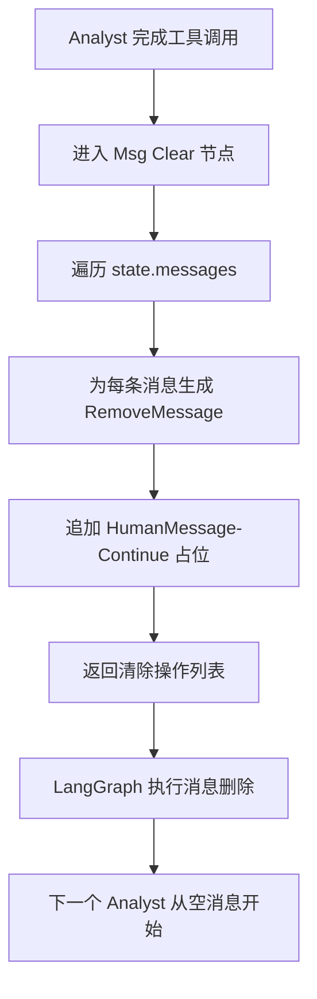
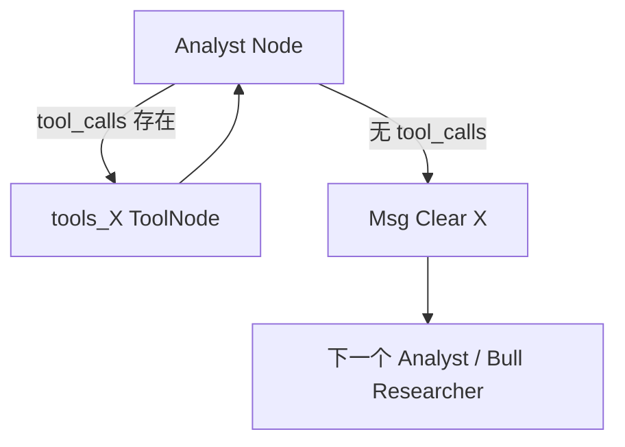
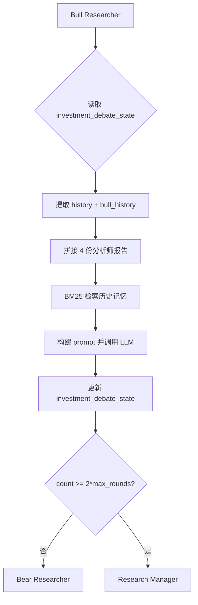

# PD-01.NN TradingAgents — RemoveMessage 节点间上下文清除与辩论状态隔离

> 文档编号：PD-01.NN
> 来源：TradingAgents `tradingagents/agents/utils/agent_utils.py`
> GitHub：https://github.com/TauricResearch/TradingAgents.git
> 问题域：PD-01 上下文管理 Context Window Management
> 状态：可复用方案

---

## 第 1 章 问题与动机

### 1.1 核心问题

TradingAgents 是一个多阶段金融分析系统，包含 4 个分析师（Market/Social/News/Fundamentals）、2 个研究员（Bull/Bear 辩论）、1 个交易员、3 个风险分析师（Aggressive/Conservative/Neutral 辩论）和 2 个裁判（Research Manager/Risk Judge）。这些 Agent 通过 LangGraph StateGraph 串行/并行编排。

核心问题在于：**分析师节点使用 LangChain 的 `MessagesState` 管理消息历史，每个分析师会调用工具（get_stock_data、get_indicators 等）产生大量工具调用消息。如果不在分析师之间清除消息，后续分析师会继承前序分析师的全部消息历史，导致上下文累积溢出。**

具体来说：
- Market Analyst 调用 2-3 次工具，产生 ~6 条消息（HumanMessage + AIMessage + ToolMessage 循环）
- Social Analyst 继承这些消息后再调用工具，消息数翻倍
- 到 Fundamentals Analyst 时，消息列表可能已有 20+ 条无关消息
- 辩论阶段（Bull/Bear 各 N 轮 + Risk 三方各 N 轮）进一步放大上下文

### 1.2 TradingAgents 的解法概述

TradingAgents 采用**双层上下文隔离**策略：

1. **消息层清除（RemoveMessage）**：在每个分析师节点完成后，插入 `Msg Clear` 节点，用 LangGraph 的 `RemoveMessage` 原语清除全部消息历史，仅保留一条 `"Continue"` 占位消息（`agent_utils.py:22-35`）
2. **辩论状态隔离（TypedDict）**：辩论阶段不使用 `messages` 列表，而是通过独立的 `InvestDebateState` 和 `RiskDebateState` TypedDict 管理历史，将辩论上下文与主消息流完全分离（`agent_states.py:11-47`）
3. **报告提取到顶层字段**：每个分析师的最终报告存入 `AgentState` 的独立字段（`market_report`、`sentiment_report` 等），而非依赖消息历史传递（`agent_states.py:57-63`）
4. **轮次计数器控制辩论深度**：通过 `count` 字段和 `max_debate_rounds` / `max_risk_discuss_rounds` 参数限制辩论轮数，间接控制上下文增长（`conditional_logic.py:9-12`）

### 1.3 设计思想

| 设计原则 | 具体实现 | 理由 | 替代方案 |
|----------|----------|------|----------|
| 激进清除优于渐进压缩 | RemoveMessage 清除全部消息 | 分析师间无需共享工具调用细节，报告已提取到独立字段 | 滑动窗口保留最近 N 条 |
| 结构化状态优于消息流 | TypedDict 管理辩论历史 | 辩论需要精确区分 bull_history/bear_history，消息列表无法表达 | 用 SystemMessage 标记角色 |
| 占位消息保持兼容性 | 清除后插入 "Continue" HumanMessage | Anthropic API 要求消息列表非空且以 HumanMessage 开头 | 保留最后一条消息 |
| 轮次上限控制增长 | count + max_rounds 参数 | 辩论可能无限循环，需要硬性截止 | Token 计数动态截止 |

---

## 第 2 章 源码实现分析

### 2.1 架构概览

TradingAgents 的上下文管理架构分为两个独立的上下文域：

```
┌─────────────────────────────────────────────────────────────────┐
│                    AgentState (MessagesState)                    │
│                                                                  │
│  messages: list[BaseMessage]  ← 分析师使用，节点间清除            │
│  market_report: str           ← 分析师输出提取到顶层              │
│  sentiment_report: str                                           │
│  news_report: str                                                │
│  fundamentals_report: str                                        │
│                                                                  │
│  ┌──────────────────────────┐  ┌──────────────────────────────┐ │
│  │  InvestDebateState       │  │  RiskDebateState             │ │
│  │  history: str            │  │  history: str                │ │
│  │  bull_history: str       │  │  aggressive_history: str     │ │
│  │  bear_history: str       │  │  conservative_history: str   │ │
│  │  current_response: str   │  │  neutral_history: str        │ │
│  │  count: int              │  │  latest_speaker: str         │ │
│  └──────────────────────────┘  │  count: int                  │ │
│                                 └──────────────────────────────┘ │
└─────────────────────────────────────────────────────────────────┘
```

图执行流程：

```
START → Market Analyst ⇄ tools_market → Msg Clear Market
      → Social Analyst ⇄ tools_social → Msg Clear Social
      → News Analyst ⇄ tools_news → Msg Clear News
      → Fundamentals Analyst ⇄ tools_fundamentals → Msg Clear Fundamentals
      → Bull Researcher ⇄ Bear Researcher (N 轮) → Research Manager
      → Trader
      → Aggressive ⇄ Conservative ⇄ Neutral (N 轮) → Risk Judge → END
```

### 2.2 核心实现

#### 2.2.1 消息清除节点（RemoveMessage 模式）



对应源码 `tradingagents/agents/utils/agent_utils.py:22-35`：

```python
from langchain_core.messages import HumanMessage, RemoveMessage

def create_msg_delete():
    def delete_messages(state):
        """Clear messages and add placeholder for Anthropic compatibility"""
        messages = state["messages"]

        # Remove all messages
        removal_operations = [RemoveMessage(id=m.id) for m in messages]

        # Add a minimal placeholder message
        placeholder = HumanMessage(content="Continue")

        return {"messages": removal_operations + [placeholder]}

    return delete_messages
```

关键设计点：
- `RemoveMessage(id=m.id)` 是 LangGraph 的状态操作原语，不是直接删除，而是生成一个"删除指令"由框架执行（`agent_utils.py:28`）
- 占位消息 `HumanMessage(content="Continue")` 确保 Anthropic Claude API 兼容性——Claude 要求对话以 HumanMessage 开头（`agent_utils.py:31`）
- `create_msg_delete()` 是工厂函数，每个分析师类型创建独立实例（`setup.py:64-86`）

#### 2.2.2 图中清除节点的编排



对应源码 `tradingagents/graph/setup.py:111-153`：

```python
# 为每个分析师类型注册三个节点：分析师、工具、清除
for analyst_type, node in analyst_nodes.items():
    workflow.add_node(f"{analyst_type.capitalize()} Analyst", node)
    workflow.add_node(
        f"Msg Clear {analyst_type.capitalize()}", delete_nodes[analyst_type]
    )
    workflow.add_node(f"tools_{analyst_type}", tool_nodes[analyst_type])

# 条件边：有工具调用则循环，否则进入清除节点
for i, analyst_type in enumerate(selected_analysts):
    current_analyst = f"{analyst_type.capitalize()} Analyst"
    current_tools = f"tools_{analyst_type}"
    current_clear = f"Msg Clear {analyst_type.capitalize()}"

    workflow.add_conditional_edges(
        current_analyst,
        getattr(self.conditional_logic, f"should_continue_{analyst_type}"),
        [current_tools, current_clear],
    )
    workflow.add_edge(current_tools, current_analyst)

    # 清除后连接到下一个分析师或 Bull Researcher
    if i < len(selected_analysts) - 1:
        next_analyst = f"{selected_analysts[i+1].capitalize()} Analyst"
        workflow.add_edge(current_clear, next_analyst)
    else:
        workflow.add_edge(current_clear, "Bull Researcher")
```

#### 2.2.3 辩论状态隔离（TypedDict 双轨制）



对应源码 `tradingagents/agents/utils/agent_states.py:11-22`：

```python
class InvestDebateState(TypedDict):
    bull_history: Annotated[str, "Bullish Conversation history"]
    bear_history: Annotated[str, "Bearish Conversation history"]
    history: Annotated[str, "Conversation history"]
    current_response: Annotated[str, "Latest response"]
    judge_decision: Annotated[str, "Final judge decision"]
    count: Annotated[int, "Length of the current conversation"]
```

辩论节点（如 Bull Researcher）直接操作这个 TypedDict 而非 `messages` 列表（`bull_researcher.py:7-57`）：

```python
def bull_node(state) -> dict:
    investment_debate_state = state["investment_debate_state"]
    history = investment_debate_state.get("history", "")
    bull_history = investment_debate_state.get("bull_history", "")
    # ... 构建 prompt，调用 LLM ...
    new_investment_debate_state = {
        "history": history + "\n" + argument,
        "bull_history": bull_history + "\n" + argument,
        "bear_history": investment_debate_state.get("bear_history", ""),
        "current_response": argument,
        "count": investment_debate_state["count"] + 1,
    }
    return {"investment_debate_state": new_investment_debate_state}
```

### 2.3 实现细节

**报告提取模式**：分析师节点在完成工具调用后，将最终报告提取到 `AgentState` 的顶层字段。例如 Market Analyst（`market_analyst.py:75-83`）：

```python
report = ""
if len(result.tool_calls) == 0:
    report = result.content
return {
    "messages": [result],
    "market_report": report,
}
```

这意味着即使 `messages` 被清除，报告内容仍然通过 `market_report` 字段传递给后续节点。辩论节点通过 `state["market_report"]` 等字段获取分析结果，完全不依赖消息历史。

**Trader 节点的独立消息构建**：Trader 不使用 `state["messages"]`，而是从零构建消息列表（`trader.py:30-36`）：

```python
messages = [
    {"role": "system", "content": f"...{past_memory_str}..."},
    context,
]
result = llm.invoke(messages)
```

这是另一种上下文隔离——直接绕过共享消息状态，自行构建干净的 prompt。

**轮次控制**：`ConditionalLogic` 通过 `count` 字段控制辩论深度（`conditional_logic.py:46-55`）：

```python
def should_continue_debate(self, state: AgentState) -> str:
    if state["investment_debate_state"]["count"] >= 2 * self.max_debate_rounds:
        return "Research Manager"
    if state["investment_debate_state"]["current_response"].startswith("Bull"):
        return "Bear Researcher"
    return "Bull Researcher"
```

投资辩论用 `2 * max_rounds`（Bull + Bear 各算一次），风险辩论用 `3 * max_rounds`（三方各算一次）。默认 `max_debate_rounds=1`，即 Bull/Bear 各说一轮就结束。

---

## 第 3 章 迁移指南

### 3.1 迁移清单

**阶段 1：消息清除节点**
- [ ] 安装依赖：`langchain-core >= 0.2`（提供 `RemoveMessage`）、`langgraph >= 0.1`
- [ ] 创建 `create_msg_delete()` 工厂函数
- [ ] 在 StateGraph 中为每个需要隔离的节点对之间插入清除节点
- [ ] 确认目标 LLM API 对空消息列表的兼容性（Anthropic 需要占位消息，OpenAI 不需要）

**阶段 2：结构化状态分离**
- [ ] 为需要独立上下文的子流程定义 TypedDict（如辩论、审批等）
- [ ] 将子流程的历史管理从 `messages` 迁移到 TypedDict 字段
- [ ] 确保子流程节点只读写自己的 TypedDict，不触碰 `messages`

**阶段 3：报告提取**
- [ ] 为每个产出报告的节点在 AgentState 中添加顶层字段
- [ ] 修改节点返回值，将最终输出同时写入 `messages` 和报告字段
- [ ] 下游节点改为从报告字段读取，而非解析消息历史

### 3.2 适配代码模板

#### 通用消息清除节点（支持多 LLM 提供商）

```python
from langchain_core.messages import HumanMessage, RemoveMessage
from typing import Literal

def create_msg_clear(
    provider: Literal["anthropic", "openai", "other"] = "anthropic"
):
    """创建消息清除节点，支持不同 LLM 提供商的兼容性要求。
    
    Args:
        provider: LLM 提供商，决定是否需要占位消息
    """
    def clear_messages(state):
        messages = state["messages"]
        removal_ops = [RemoveMessage(id=m.id) for m in messages]
        
        if provider == "anthropic":
            # Anthropic 要求消息列表以 HumanMessage 开头
            placeholder = HumanMessage(content="Continue")
            return {"messages": removal_ops + [placeholder]}
        else:
            # OpenAI 等可以接受空消息列表
            return {"messages": removal_ops}
    
    return clear_messages
```

#### 辩论状态 TypedDict 模板

```python
from typing import Annotated
from typing_extensions import TypedDict

class DebateState(TypedDict):
    """通用辩论状态，可扩展为任意多方辩论。"""
    history: Annotated[str, "完整辩论历史"]
    participant_histories: Annotated[
        dict[str, str], "各参与者的独立历史 {role: history}"
    ]
    current_response: Annotated[str, "最新发言"]
    latest_speaker: Annotated[str, "最后发言者"]
    count: Annotated[int, "当前轮次"]

class MyAgentState(MessagesState):
    """主状态，嵌套辩论状态。"""
    debate_state: Annotated[DebateState, "辩论子状态"]
    # 报告提取字段
    analysis_report: Annotated[str, "分析报告"]
    final_decision: Annotated[str, "最终决策"]
```

#### 带清除节点的图编排模板

```python
from langgraph.graph import StateGraph, START, END

def build_graph_with_clearing(analysts: list[str], max_rounds: int = 1):
    workflow = StateGraph(MyAgentState)
    
    for analyst_type in analysts:
        workflow.add_node(f"{analyst_type}_analyst", analyst_nodes[analyst_type])
        workflow.add_node(f"{analyst_type}_clear", create_msg_clear("anthropic"))
        workflow.add_node(f"{analyst_type}_tools", tool_nodes[analyst_type])
        
        # 条件边：工具调用循环 or 清除
        workflow.add_conditional_edges(
            f"{analyst_type}_analyst",
            lambda s, t=analyst_type: (
                f"{t}_tools" if s["messages"][-1].tool_calls else f"{t}_clear"
            ),
            [f"{analyst_type}_tools", f"{analyst_type}_clear"],
        )
        workflow.add_edge(f"{analyst_type}_tools", f"{analyst_type}_analyst")
    
    # 串联清除节点
    for i in range(len(analysts) - 1):
        workflow.add_edge(f"{analysts[i]}_clear", f"{analysts[i+1]}_analyst")
    
    workflow.add_edge(START, f"{analysts[0]}_analyst")
    workflow.add_edge(f"{analysts[-1]}_clear", "next_stage")
    
    return workflow.compile()
```

### 3.3 适用场景

| 场景 | 适用度 | 说明 |
|------|--------|------|
| 多分析师串行管道 | ⭐⭐⭐ | 每个分析师独立调用工具，报告通过字段传递，消息无需累积 |
| 辩论/对抗式多 Agent | ⭐⭐⭐ | TypedDict 隔离辩论历史，避免污染主消息流 |
| 单 Agent 长对话 | ⭐ | 不适用——单 Agent 需要保留对话连续性，不能全量清除 |
| RAG + 工具调用混合 | ⭐⭐ | 工具调用结果可清除，但 RAG 检索结果可能需要保留 |
| 人机交互审批流 | ⭐⭐ | 审批前可清除工具消息，但需保留人类输入 |

---

## 第 4 章 测试用例

```python
import pytest
from langchain_core.messages import HumanMessage, AIMessage, ToolMessage, RemoveMessage
from tradingagents.agents.utils.agent_utils import create_msg_delete
from tradingagents.agents.utils.agent_states import (
    AgentState, InvestDebateState, RiskDebateState
)


class TestMsgDelete:
    """测试消息清除节点。"""

    def test_clears_all_messages(self):
        """正常路径：清除所有消息，保留占位消息。"""
        delete_fn = create_msg_delete()
        state = {
            "messages": [
                HumanMessage(content="Analyze AAPL", id="msg1"),
                AIMessage(content="Let me check...", id="msg2"),
                ToolMessage(content="AAPL: $150", tool_call_id="tc1", id="msg3"),
            ]
        }
        result = delete_fn(state)
        
        # 应有 3 个 RemoveMessage + 1 个占位 HumanMessage
        assert len(result["messages"]) == 4
        assert all(
            isinstance(m, RemoveMessage) for m in result["messages"][:3]
        )
        assert isinstance(result["messages"][-1], HumanMessage)
        assert result["messages"][-1].content == "Continue"

    def test_empty_messages(self):
        """边界情况：空消息列表。"""
        delete_fn = create_msg_delete()
        state = {"messages": []}
        result = delete_fn(state)
        
        # 只有占位消息
        assert len(result["messages"]) == 1
        assert isinstance(result["messages"][0], HumanMessage)

    def test_preserves_message_ids(self):
        """RemoveMessage 使用正确的消息 ID。"""
        delete_fn = create_msg_delete()
        state = {
            "messages": [
                HumanMessage(content="test", id="abc123"),
                AIMessage(content="reply", id="def456"),
            ]
        }
        result = delete_fn(state)
        remove_ids = [m.id for m in result["messages"] if isinstance(m, RemoveMessage)]
        assert "abc123" in remove_ids
        assert "def456" in remove_ids


class TestDebateStateIsolation:
    """测试辩论状态与消息流的隔离。"""

    def test_invest_debate_state_independent(self):
        """辩论状态更新不影响 messages。"""
        state: AgentState = {
            "messages": [HumanMessage(content="start", id="m1")],
            "investment_debate_state": {
                "history": "",
                "bull_history": "",
                "bear_history": "",
                "current_response": "",
                "judge_decision": "",
                "count": 0,
            },
            "market_report": "bullish signals",
            "sentiment_report": "",
            "news_report": "",
            "fundamentals_report": "",
        }
        
        # 模拟 Bull Researcher 更新
        new_debate = {
            "history": "Bull Analyst: strong growth",
            "bull_history": "Bull Analyst: strong growth",
            "bear_history": "",
            "current_response": "Bull Analyst: strong growth",
            "count": 1,
        }
        
        # 辩论状态更新不应触碰 messages
        state["investment_debate_state"] = new_debate
        assert len(state["messages"]) == 1
        assert state["messages"][0].content == "start"

    def test_debate_round_counting(self):
        """轮次计数器正确递增。"""
        debate_state = {
            "history": "",
            "bull_history": "",
            "bear_history": "",
            "current_response": "",
            "count": 0,
        }
        
        # 模拟 3 轮辩论
        for i in range(3):
            debate_state["count"] += 1
        
        assert debate_state["count"] == 3

    def test_risk_debate_three_party(self):
        """三方风险辩论状态正确维护。"""
        risk_state: RiskDebateState = {
            "aggressive_history": "",
            "conservative_history": "",
            "neutral_history": "",
            "history": "",
            "latest_speaker": "",
            "current_aggressive_response": "",
            "current_conservative_response": "",
            "current_neutral_response": "",
            "judge_decision": "",
            "count": 0,
        }
        
        # 模拟 Aggressive 发言
        risk_state["aggressive_history"] = "Aggressive: go all in"
        risk_state["history"] = "Aggressive: go all in"
        risk_state["latest_speaker"] = "Aggressive"
        risk_state["count"] = 1
        
        assert risk_state["latest_speaker"] == "Aggressive"
        assert risk_state["conservative_history"] == ""  # 未被污染
```

---

## 第 5 章 跨域关联

| 关联域 | 关系类型 | 说明 |
|--------|----------|------|
| PD-02 多 Agent 编排 | 依赖 | 消息清除节点是编排图的一部分，`setup.py` 中清除节点与分析师节点、工具节点一起注册到 StateGraph。编排拓扑决定了清除点的位置 |
| PD-06 记忆持久化 | 协同 | BM25 记忆系统（`FinancialSituationMemory`）为辩论节点提供历史经验注入，弥补了消息清除导致的短期记忆丢失。清除消息后，长期知识通过记忆系统而非消息历史传递 |
| PD-04 工具系统 | 协同 | 分析师节点的工具调用（`get_stock_data`、`get_indicators` 等）是消息膨胀的主要来源。工具返回的大量数据通过 ToolMessage 进入消息列表，清除节点正是为了解决这个问题 |
| PD-07 质量检查 | 协同 | Research Manager 和 Risk Judge 作为辩论裁判，其决策质量依赖于辩论历史的完整性。TypedDict 隔离确保裁判能看到完整的辩论记录而非被截断的消息 |
| PD-11 可观测性 | 互补 | 消息清除后，调试和审计需要依赖其他机制（如日志）来追踪被删除的消息内容。当前实现没有在清除前记录日志，这是一个可改进点 |

---

## 第 6 章 来源文件索引

| 文件 | 行范围 | 关键实现 |
|------|--------|----------|
| `tradingagents/agents/utils/agent_utils.py` | L1-35 | `create_msg_delete()` 工厂函数，RemoveMessage 清除 + 占位消息 |
| `tradingagents/agents/utils/agent_states.py` | L11-22 | `InvestDebateState` TypedDict，投资辩论状态定义 |
| `tradingagents/agents/utils/agent_states.py` | L25-47 | `RiskDebateState` TypedDict，风险辩论状态定义 |
| `tradingagents/agents/utils/agent_states.py` | L50-77 | `AgentState(MessagesState)`，主状态含报告字段和嵌套辩论状态 |
| `tradingagents/graph/setup.py` | L56-86 | 分析师节点 + 清除节点 + 工具节点的创建和注册 |
| `tradingagents/graph/setup.py` | L111-153 | 图边定义：条件边（工具循环 vs 清除）和串联边 |
| `tradingagents/graph/conditional_logic.py` | L9-12 | `max_debate_rounds` / `max_risk_discuss_rounds` 参数 |
| `tradingagents/graph/conditional_logic.py` | L46-67 | 辩论轮次控制逻辑（count 对比 max_rounds） |
| `tradingagents/agents/researchers/bull_researcher.py` | L7-57 | Bull Researcher 节点，操作 InvestDebateState 而非 messages |
| `tradingagents/agents/researchers/bear_researcher.py` | L7-59 | Bear Researcher 节点，同上 |
| `tradingagents/agents/risk_mgmt/aggressive_debator.py` | L5-55 | Aggressive Analyst 节点，操作 RiskDebateState |
| `tradingagents/agents/managers/research_manager.py` | L5-55 | Research Manager 裁判节点，读取辩论历史做决策 |
| `tradingagents/agents/managers/risk_manager.py` | L5-66 | Risk Judge 裁判节点，读取风险辩论历史做最终决策 |
| `tradingagents/agents/trader/trader.py` | L6-46 | Trader 节点，独立构建消息列表绕过共享 messages |
| `tradingagents/agents/analysts/market_analyst.py` | L8-85 | Market Analyst，报告提取到 `market_report` 字段 |
| `tradingagents/agents/utils/memory.py` | L12-98 | `FinancialSituationMemory` BM25 记忆系统 |

---

## 第 7 章 横向对比维度

> **重要：** 本章用于自动填充 Butcher Wiki 的横向对比表。
> 必须严格按以下 JSON 格式输出，放在 `comparison_data` 代码块中。

```json comparison_data
{
  "project": "TradingAgents",
  "dimensions": {
    "估算方式": "无 token 估算，不计算当前 prompt 大小",
    "压缩策略": "全量清除（RemoveMessage），非压缩/摘要",
    "触发机制": "图拓扑驱动：分析师完成后固定进入清除节点",
    "实现位置": "LangGraph 图节点（Msg Clear X），框架原语级",
    "容错设计": "占位 HumanMessage 保证 Anthropic API 兼容",
    "子Agent隔离": "TypedDict 双轨制：辩论状态与消息流完全分离",
    "保留策略": "报告提取到顶层字段，消息全量丢弃",
    "Prompt模板化": "f-string 内联模板，无外置配置文件",
    "辩论轮次控制": "count 计数器 + max_rounds 参数硬性截止"
  }
}
```

### 域元数据补充

```json domain_metadata
{
  "solution_summary": "TradingAgents 用 LangGraph RemoveMessage 在分析师节点间全量清除消息，辩论历史通过独立 TypedDict 管理，报告提取到 AgentState 顶层字段实现跨节点传递",
  "description": "多 Agent 串行管道中节点间上下文隔离与结构化状态分离",
  "sub_problems": [
    "辩论历史双轨管理：共享 history 与角色独立 history 的同步维护",
    "LLM 提供商占位消息兼容：不同 API 对空消息列表的差异化要求",
    "报告字段提取时机：工具调用循环中仅在最终响应时提取报告内容"
  ],
  "best_practices": [
    "全量清除适合无需跨节点共享消息的串行管道，比滑动窗口更简单可靠",
    "辩论状态用 TypedDict 而非消息列表，可精确控制每个角色看到的上下文范围"
  ]
}
```
