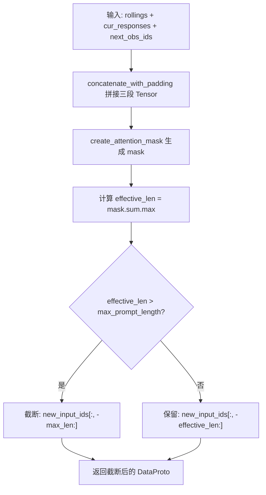
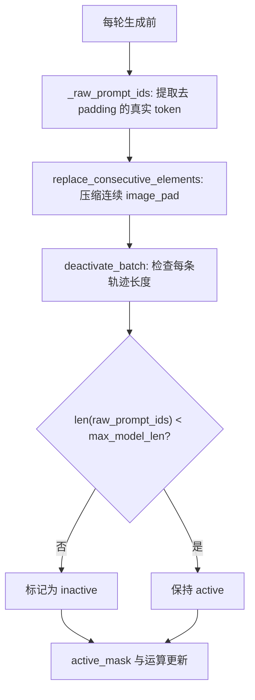

# PD-01.XX VRAG — 滚动窗口与批量停用上下文管理

> 文档编号：PD-01.XX
> 来源：VRAG `VRAG-RL/vrag_agent/generation.py`, `VRAG-RL/vrag_agent/tensor_helper.py`
> GitHub：https://github.com/Alibaba-NLP/VRAG.git
> 问题域：PD-01 上下文管理 Context Window Management
> 状态：可复用方案

---

## 第 1 章 问题与动机

### 1.1 核心问题

在多轮视觉 RAG（Retrieval-Augmented Generation）强化学习训练中，Agent 每一步都会产生新的 response 和 observation（搜索结果、裁剪图片等），这些内容不断拼接到 prompt 中。由于 RL 训练需要对整个 batch 的轨迹同时进行前向推理和梯度计算，上下文管理面临三个独特挑战：

1. **Tensor 级别的上下文膨胀**：不同于 API 调用场景的字符串拼接，RL 训练中 prompt 是 `torch.Tensor`，需要在 GPU 显存中对齐 padding、拼接 attention_mask 和 position_ids，任何一步出错都会导致训练崩溃。
2. **批量轨迹长度不一致**：同一 batch 中不同样本的轨迹长度差异巨大（有的 1 轮就给出答案，有的搜索 4 轮），需要在 Tensor 维度上统一处理活跃/非活跃样本。
3. **多模态数据的动态拼接**：每轮检索可能返回新图片，图片经过 vision processor 后产生不定长的 `pixel_values` 和 `image_grid_thw`，需要与文本 token 序列正确对齐。

### 1.2 VRAG 的解法概述

VRAG 采用"滚动窗口 + 批量停用"的双层上下文管理策略：

1. **滚动窗口截断**（`_update_rolling_state`，`generation.py:216-243`）：每轮将 response + observation 拼接到 rolling state，然后按 `max_prompt_length` 从左侧截断，只保留最近的上下文。
2. **批量轨迹停用**（`deactivate_batch`，`generation.py:365-370`）：在每轮生成前检查每条轨迹的真实 token 长度（去除 padding 和连续 image_pad），超过 `max_model_len` 的轨迹直接标记为非活跃，不再参与后续生成。
3. **Padding 感知拼接**（`TensorHelper.concatenate_with_padding`，`tensor_helper.py:40-45`）：所有 Tensor 拼接操作都通过 `convert_pad_structure` 重新排列 padding 位置，确保左对齐一致性。
4. **多模态数据增量拼接**（`_concat_multi_modal_data`，`generation.py:191-213`）：每轮新检索的图片 `pixel_values` 和 `image_grid_thw` 通过 `torch.cat` 增量追加到 rolling state 的 `non_tensor_batch` 中。
5. **GPU Padding 对齐**（`_generate_with_gpu_padding`，`generation.py:267-342`）：多 GPU 推理时，batch size 必须被 GPU 数整除，不足时用 dummy 序列填充，生成后裁剪。

### 1.3 设计思想

| 设计原则 | 具体实现 | 理由 | 替代方案 |
|----------|----------|------|----------|
| Tensor 原生操作 | 所有截断/拼接在 torch.Tensor 上完成，不经过字符串 | RL 训练需要梯度回传，字符串操作会断开计算图 | 字符串拼接后重新 tokenize（慢且不精确） |
| 左截断保留最新 | `new_input_ids[:, -max_len:]` 保留右侧最新内容 | 多轮 Agent 中最近的搜索结果和推理最重要 | 右截断保留最早内容（丢失最新信息） |
| 双阈值分层控制 | `max_prompt_length` 控制输入截断，`max_model_len` 控制轨迹停用 | 输入截断是软限制（可继续生成），轨迹停用是硬限制（防 OOM） | 单一阈值（无法区分软硬限制） |
| Active Mask 位图 | `active_mask: torch.BoolTensor` 追踪每条轨迹状态 | 避免动态删除 batch 元素导致的索引混乱 | 动态 resize batch（复杂且易错） |
| Image Pad 去重计数 | `replace_consecutive_elements` 将连续 image_pad 压缩为 1 个再计长度 | 图片 token 展开后数量巨大但实际只占 1 个语义位置 | 直接计数（严重高估长度导致过早停用） |

---

## 第 2 章 源码实现分析

### 2.1 架构概览

VRAG 的上下文管理围绕 `LLMGenerationManager` 类展开，核心数据流如下：

```
┌─────────────────────────────────────────────────────────────────┐
│                    LLMGenerationManager                         │
│                                                                 │
│  ┌──────────┐    ┌──────────────┐    ┌───────────────────┐     │
│  │ rollings │───→│ _update_     │───→│ 截断后的 rollings  │     │
│  │ (当前态) │    │ rolling_state│    │ (下轮输入)         │     │
│  └──────────┘    └──────────────┘    └───────────────────┘     │
│       ↑                                      │                  │
│       │          ┌──────────────┐             │                  │
│       └──────────│ deactivate_  │←────────────┘                  │
│                  │ batch        │                                │
│                  └──────────────┘                                │
│                        │                                        │
│                  active_mask 更新                                │
│                                                                 │
│  ┌──────────────────┐  ┌────────────────────┐                   │
│  │ TensorHelper     │  │ _concat_multi_     │                   │
│  │ (padding 对齐)   │  │ modal_data         │                   │
│  └──────────────────┘  │ (图片增量拼接)     │                   │
│                        └────────────────────┘                   │
└─────────────────────────────────────────────────────────────────┘
```

关键组件关系：
- `GenerationConfig`（`generation.py:44-52`）：定义 `max_prompt_length`、`max_model_len`、`max_turns` 三个上下文控制参数
- `TensorHelper`（`tensor_helper.py:9-72`）：提供 padding 感知的 Tensor 操作原语
- `run_llm_loop`（`generation.py:372-511`）：主循环，每轮调用截断和停用检查

### 2.2 核心实现

#### 2.2.1 滚动窗口截断



对应源码 `VRAG-RL/vrag_agent/generation.py:216-243`：

```python
def _update_rolling_state(self, rollings, cur_responses: torch.Tensor, 
                        next_obs_ids: torch.Tensor) -> Dict:
    """Update rolling state with new responses and observations."""
    # Concatenate and handle padding
    if next_obs_ids.shape[1] != 0:
        new_input_ids = self.tensor_fn.concatenate_with_padding([
            rollings.batch['input_ids'],
            cur_responses,
            next_obs_ids
        ])
    else:
        new_input_ids = self.tensor_fn.concatenate_with_padding([
            rollings.batch['input_ids'],
            cur_responses
        ])
    # Create attention mask and position ids
    new_attention_mask = self.tensor_fn.create_attention_mask(new_input_ids)
    new_position_ids = self.tensor_fn.create_position_ids(new_attention_mask)

    # Cut to appropriate length
    effective_len = new_attention_mask.sum(dim=1).max()
    max_len = min(self.config.max_prompt_length, effective_len)
    
    return DataProto.from_dict({
        'input_ids': new_input_ids[:, -max_len:],
        'position_ids': new_position_ids[:, -max_len:],
        'attention_mask': new_attention_mask[:, -max_len:]
    }, rollings.non_tensor_batch)
```

关键细节：
- `effective_len` 取 batch 中所有样本的最大有效长度（`sum(dim=1).max()`），确保不会因为某个短样本而截断其他样本
- `max_len = min(max_prompt_length, effective_len)` 实现"按需截断"——只有真正超限时才截断
- 截断方向是左截断（`[:, -max_len:]`），保留最新的上下文

#### 2.2.2 批量轨迹停用与 Image Pad 去重



对应源码 `VRAG-RL/vrag_agent/generation.py:344-370`：

```python
def _raw_prompt_ids(self, rollings):
    new_raw_prompt_ids = []
    rollings.batch['input_ids'] = rollings.batch['input_ids'].long()
    raw_next_obs_ids = [ids[mask == 1].tolist() 
                        for ids, mask in zip(np.array(rollings.batch['input_ids']),  
                                           np.array(rollings.batch['attention_mask']))]
    def replace_consecutive_elements(arr, target):
        result = []
        i = 0
        while i < len(arr):
            if arr[i] == target:
                result.append(target)
                while i + 1 < len(arr) and arr[i + 1] == target:
                    i += 1
            else:
                result.append(arr[i])
            i += 1
        return result
    raw_next_obs_ids = [replace_consecutive_elements(row, self.config.image_pad_id) 
                        for row in raw_next_obs_ids]  # 151655
    raw_next_obs_ids = np.array(raw_next_obs_ids, dtype=object)
    rollings.non_tensor_batch['raw_prompt_ids'] = raw_next_obs_ids
    return rollings

def deactivate_batch(self, active_mask, rollings):
    raw_prompt_ids = rollings.non_tensor_batch['raw_prompt_ids']
    max_model_len = self.config.max_model_len
    curr_active_mask = torch.tensor(
        [len(raw_prompt_ids_item) < max_model_len 
         for raw_prompt_ids_item in raw_prompt_ids], dtype=torch.bool)
    active_mask = active_mask * curr_active_mask
    return active_mask
```

这里的 `replace_consecutive_elements` 是一个精巧的设计：Qwen2-VL 的图片 token 展开后会产生大量连续的 `image_pad_id`（151655），如果直接计数会严重高估序列长度。通过将连续的 image_pad 压缩为 1 个，得到更准确的"语义长度"用于停用判断。

### 2.3 实现细节

#### 多模态数据增量拼接

`_concat_multi_modal_data`（`generation.py:191-213`）处理每轮新检索图片的增量追加：

```python
for idx, multi_modal_data_item in enumerate(next_obs_multi_modal_data):
    if len(multi_modal_data_item['image']) > 0:
        rollings.non_tensor_batch['multi_modal_data'][idx]['image'].extend(
            multi_modal_data_item['image'])
        if 'pixel_values' in rollings.non_tensor_batch['multi_modal_inputs'][idx]:
            rollings.non_tensor_batch['multi_modal_inputs'][idx]['pixel_values'] = torch.cat(
                (rollings.non_tensor_batch['multi_modal_inputs'][idx]['pixel_values'], 
                 next_obs_multi_modal_inputs[idx]['pixel_values']), dim=0)
            rollings.non_tensor_batch['multi_modal_inputs'][idx]['image_grid_thw'] = torch.cat(
                (rollings.non_tensor_batch['multi_modal_inputs'][idx]['image_grid_thw'], 
                 next_obs_multi_modal_inputs[idx]['image_grid_thw']), dim=0)
```

#### 主循环中的上下文管理流程

`run_llm_loop`（`generation.py:372-511`）中每轮的上下文管理步骤：

1. `cut_to_effective_len`（`tensor_helper.py:13-24`）：先裁剪掉多余的 padding 列，减少显存占用
2. `_raw_prompt_ids` → `deactivate_batch`：检查并停用超长轨迹
3. 只对 `active_mask` 为 True 的样本执行生成（`generation.py:405-412`）
4. `_postprocess_responses`：提取 `<search>`/`<answer>`/`<think>` 标签内容
5. `_example_level_pad`（`tensor_helper.py:47-72`）：将活跃样本的 response 填回完整 batch
6. `_update_rolling_state`：拼接并截断
7. `_update_right_side`：同步更新右侧（response 侧）状态

#### TensorHelper 的 Padding 重排

`concatenate_with_padding`（`tensor_helper.py:40-45`）的核心是 `convert_pad_structure`（`tensor_helper.py:26-30`）：

```python
def convert_pad_structure(self, tensor: torch.Tensor, pad_to_left: bool = True) -> Tuple:
    mask = tensor != self.config.pad_token_id if pad_to_left else tensor == self.config.pad_token_id
    sorted_indices = mask.to(torch.int64).argsort(dim=1, stable=True)
    return tensor.gather(1, sorted_indices), sorted_indices
```

通过 `argsort` 将 pad token 排到左侧（或右侧），实现 padding 位置的统一化。这比手动计算偏移量更简洁，且利用了 PyTorch 的 `stable=True` 保证非 pad token 的相对顺序不变。


---

## 第 3 章 迁移指南

### 3.1 迁移清单

**阶段 1：基础滚动窗口（1 个文件）**
- [ ] 实现 `TensorHelper` 类，提供 `concatenate_with_padding`、`create_attention_mask`、`create_position_ids`
- [ ] 在生成循环中每轮调用 `_update_rolling_state` 截断上下文

**阶段 2：批量停用（2 个文件）**
- [ ] 实现 `_raw_prompt_ids` 提取去 padding 的真实 token 序列
- [ ] 实现 `deactivate_batch` 基于 `max_model_len` 停用超长轨迹
- [ ] 如果有多模态 token（如 image_pad），实现 `replace_consecutive_elements` 去重

**阶段 3：多模态支持（可选）**
- [ ] 实现 `_concat_multi_modal_data` 增量追加图片数据
- [ ] 实现 `_generate_with_gpu_padding` 多 GPU 对齐

### 3.2 适配代码模板

以下是一个可直接复用的滚动窗口 + 批量停用模板：

```python
import torch
from dataclasses import dataclass
from typing import List, Dict, Tuple

@dataclass
class RollingWindowConfig:
    max_prompt_length: int = 8192   # 滚动窗口大小（软限制）
    max_model_len: int = 10240      # 轨迹最大长度（硬限制）
    pad_token_id: int = 0

class RollingWindowManager:
    """滚动窗口上下文管理器，适用于多轮 Agent RL 训练。"""
    
    def __init__(self, config: RollingWindowConfig):
        self.config = config
    
    def concatenate_with_padding(self, tensors: List[torch.Tensor], 
                                  pad_to_left: bool = True) -> torch.Tensor:
        """拼接多个 Tensor 并重排 padding 位置。"""
        concatenated = torch.cat(tensors, dim=1)
        mask = (concatenated != self.config.pad_token_id if pad_to_left 
                else concatenated == self.config.pad_token_id)
        sorted_indices = mask.to(torch.int64).argsort(dim=1, stable=True)
        return concatenated.gather(1, sorted_indices)
    
    def update_rolling_state(self, current_ids: torch.Tensor, 
                              new_response: torch.Tensor,
                              new_obs: torch.Tensor) -> Tuple[torch.Tensor, torch.Tensor]:
        """拼接新内容并按 max_prompt_length 截断。"""
        parts = [current_ids, new_response]
        if new_obs.shape[1] > 0:
            parts.append(new_obs)
        
        new_ids = self.concatenate_with_padding(parts)
        attention_mask = (new_ids != self.config.pad_token_id).long()
        
        effective_len = attention_mask.sum(dim=1).max().item()
        max_len = min(self.config.max_prompt_length, effective_len)
        
        return new_ids[:, -max_len:], attention_mask[:, -max_len:]
    
    def deactivate_overlong(self, active_mask: torch.Tensor, 
                             input_ids: torch.Tensor,
                             attention_mask: torch.Tensor,
                             special_token_id: int = None) -> torch.Tensor:
        """停用超过 max_model_len 的轨迹。"""
        for i in range(input_ids.shape[0]):
            real_ids = input_ids[i][attention_mask[i] == 1].tolist()
            # 可选：压缩连续特殊 token
            if special_token_id is not None:
                compressed = []
                prev_is_special = False
                for tid in real_ids:
                    if tid == special_token_id:
                        if not prev_is_special:
                            compressed.append(tid)
                        prev_is_special = True
                    else:
                        compressed.append(tid)
                        prev_is_special = False
                real_ids = compressed
            
            if len(real_ids) >= self.config.max_model_len:
                active_mask[i] = False
        
        return active_mask
```

### 3.3 适用场景

| 场景 | 适用度 | 说明 |
|------|--------|------|
| 多轮 Agent RL 训练（GRPO/PPO） | ⭐⭐⭐ | 核心场景，Tensor 级操作避免梯度断裂 |
| 多模态 RAG Agent | ⭐⭐⭐ | image_pad 去重和多模态拼接直接可用 |
| 批量推理（非训练） | ⭐⭐ | 滚动窗口和停用逻辑可用，但不需要梯度相关考虑 |
| 单样本 API 调用场景 | ⭐ | 过于重量级，字符串截断更简单 |
| 对话式 Agent（无 RL） | ⭐ | 不需要 batch 级别的 active_mask 管理 |

---

## 第 4 章 测试用例

```python
import torch
import pytest
from dataclasses import dataclass

@dataclass
class MockConfig:
    pad_token_id: int = 0
    max_prompt_length: int = 20
    max_model_len: int = 30
    image_pad_id: int = 99

class TestRollingWindowTruncation:
    """测试滚动窗口截断逻辑。"""
    
    def test_no_truncation_when_within_limit(self):
        """上下文未超限时不截断。"""
        # 10 tokens, max_prompt_length=20
        input_ids = torch.tensor([[0, 0, 1, 2, 3, 4, 5, 6, 7, 8]])
        attention_mask = torch.where(input_ids != 0, 1, 0)
        effective_len = attention_mask.sum(dim=1).max().item()
        max_len = min(20, effective_len)
        result = input_ids[:, -max_len:]
        assert result.shape[1] == 8  # effective_len = 8
        assert result[0, -1].item() == 8
    
    def test_truncation_keeps_latest(self):
        """超限时保留最新内容（左截断）。"""
        # 25 tokens, max_prompt_length=10
        input_ids = torch.arange(1, 26).unsqueeze(0)  # [1..25]
        attention_mask = torch.ones_like(input_ids)
        effective_len = 25
        max_len = min(10, effective_len)
        result = input_ids[:, -max_len:]
        assert result.shape[1] == 10
        assert result[0, 0].item() == 16  # 保留 16..25
        assert result[0, -1].item() == 25
    
    def test_batch_effective_len_uses_max(self):
        """batch 中取最大有效长度。"""
        input_ids = torch.tensor([
            [0, 0, 0, 1, 2, 3],  # effective=3
            [0, 1, 2, 3, 4, 5],  # effective=5
        ])
        attention_mask = torch.where(input_ids != 0, 1, 0)
        effective_len = attention_mask.sum(dim=1).max().item()
        assert effective_len == 5


class TestDeactivateBatch:
    """测试批量停用逻辑。"""
    
    def test_deactivate_overlong_trajectory(self):
        """超过 max_model_len 的轨迹被停用。"""
        active_mask = torch.tensor([True, True, True])
        raw_prompt_ids = [
            list(range(25)),   # len=25 < 30, active
            list(range(35)),   # len=35 >= 30, deactivate
            list(range(10)),   # len=10 < 30, active
        ]
        max_model_len = 30
        curr_active = torch.tensor([len(ids) < max_model_len for ids in raw_prompt_ids])
        result = active_mask * curr_active
        assert result.tolist() == [True, False, True]
    
    def test_image_pad_compression(self):
        """连续 image_pad 压缩为 1 个后再计长度。"""
        image_pad_id = 99
        raw_ids = [1, 2, 99, 99, 99, 99, 99, 3, 4, 99, 99, 5]
        # 压缩后: [1, 2, 99, 3, 4, 99, 5] -> len=7
        result = []
        i = 0
        while i < len(raw_ids):
            if raw_ids[i] == image_pad_id:
                result.append(raw_ids[i])
                while i + 1 < len(raw_ids) and raw_ids[i + 1] == image_pad_id:
                    i += 1
            else:
                result.append(raw_ids[i])
            i += 1
        assert len(result) == 7
        assert result == [1, 2, 99, 3, 4, 99, 5]
    
    def test_already_inactive_stays_inactive(self):
        """已停用的轨迹不会被重新激活。"""
        active_mask = torch.tensor([True, False, True])
        curr_active = torch.tensor([True, True, True])
        result = active_mask * curr_active
        assert result.tolist() == [True, False, True]


class TestPaddingRestructure:
    """测试 Padding 重排逻辑。"""
    
    def test_left_pad_after_concat(self):
        """拼接后 padding 移到左侧。"""
        pad_id = 0
        t1 = torch.tensor([[0, 0, 1, 2]])  # left-padded
        t2 = torch.tensor([[3, 4, 0, 0]])  # right-padded
        concatenated = torch.cat([t1, t2], dim=1)
        # [0, 0, 1, 2, 3, 4, 0, 0]
        mask = (concatenated != pad_id).to(torch.int64)
        sorted_indices = mask.argsort(dim=1, stable=True)
        result = concatenated.gather(1, sorted_indices)
        # padding should be on the left: [0, 0, 0, 0, 1, 2, 3, 4]
        assert result[0, :4].tolist() == [0, 0, 0, 0]
        assert set(result[0, 4:].tolist()) == {1, 2, 3, 4}
```


---

## 第 5 章 跨域关联

| 关联域 | 关系类型 | 说明 |
|--------|----------|------|
| PD-02 多 Agent 编排 | 协同 | `active_mask` 位图管理与多 Agent 批量编排共享相同的"活跃/非活跃"状态追踪模式；`run_llm_loop` 本身就是一个单 Agent 多轮编排循环 |
| PD-03 容错与重试 | 协同 | `deactivate_batch` 是一种优雅降级——超长轨迹不会导致整个 batch 失败，而是被静默停用；`_process_next_obs` 中的 try/except 对图片裁剪失败的容错也与上下文管理紧密相关 |
| PD-04 工具系统 | 依赖 | `execute_predictions` 解析 `<search>`/`<answer>`/`<bbox>` 标签并调用外部搜索引擎，工具返回的 observation 直接影响上下文长度增长速度 |
| PD-08 搜索与检索 | 依赖 | 每轮搜索结果（文本 + 图片）是上下文膨胀的主要来源；`_process_next_obs` 将检索到的图片转为 vision token 拼入上下文 |
| PD-11 可观测性 | 协同 | `active_num_list` 记录每轮活跃轨迹数量，`print("ACTIVE_TRAJ_NUM:", active_num_list)` 提供了基本的上下文管理可观测性 |

---

## 第 6 章 来源文件索引

| 文件 | 行范围 | 关键实现 |
|------|--------|----------|
| `VRAG-RL/vrag_agent/generation.py` | L44-L52 | `GenerationConfig` 数据类：`max_prompt_length`、`max_model_len`、`max_turns` |
| `VRAG-RL/vrag_agent/generation.py` | L55-L71 | `LLMGenerationManager.__init__`：初始化 TensorHelper |
| `VRAG-RL/vrag_agent/generation.py` | L191-L213 | `_concat_multi_modal_data`：多模态数据增量拼接 |
| `VRAG-RL/vrag_agent/generation.py` | L216-L243 | `_update_rolling_state`：滚动窗口截断核心逻辑 |
| `VRAG-RL/vrag_agent/generation.py` | L245-L264 | `_update_right_side`：右侧 response 状态同步截断 |
| `VRAG-RL/vrag_agent/generation.py` | L267-L342 | `_generate_with_gpu_padding`：多 GPU batch 对齐 |
| `VRAG-RL/vrag_agent/generation.py` | L344-L363 | `_raw_prompt_ids`：image_pad 去重与真实长度计算 |
| `VRAG-RL/vrag_agent/generation.py` | L365-L370 | `deactivate_batch`：批量轨迹停用 |
| `VRAG-RL/vrag_agent/generation.py` | L372-L511 | `run_llm_loop`：主生成循环 |
| `VRAG-RL/vrag_agent/tensor_helper.py` | L6-L7 | `TensorConfig` 数据类 |
| `VRAG-RL/vrag_agent/tensor_helper.py` | L9-L45 | `TensorHelper`：padding 感知 Tensor 操作 |
| `VRAG-RL/vrag_agent/tensor_helper.py` | L47-L72 | `_example_level_pad`：活跃样本回填 |
| `VRAG-RL/verl/trainer/ppo/ray_trainer.py` | L46 | 导入 `LLMGenerationManager` |
| `VRAG-RL/verl/trainer/ppo/ray_trainer.py` | L707-L712 | `GenerationConfig` 实例化：`max_prompt_length=99999` |
| `VRAG-RL/verl/trainer/config/ppo_trainer.yaml` | L6-L7 | `max_prompt_length: 512`、`max_response_length: 512` 默认配置 |
| `VRAG-RL/train_grpo_qwen2_5_vl_7b.sh` | L36-L37 | 训练脚本：`max_prompt_length=8192`、`max_response_length=2048` |

---

## 第 7 章 横向对比维度

> **重要：** 本章用于自动填充 Butcher Wiki 的横向对比表。

```json comparison_data
{
  "project": "VRAG",
  "dimensions": {
    "估算方式": "attention_mask.sum() 计算有效 token 数，image_pad 连续去重后计语义长度",
    "压缩策略": "无压缩/摘要，纯左截断滚动窗口丢弃最旧内容",
    "触发机制": "每轮生成前自动触发：rolling_state 截断 + deactivate_batch 停用",
    "实现位置": "Tensor 原生操作，generation.py 的 _update_rolling_state 方法",
    "容错设计": "超长轨迹静默停用不影响 batch 其他样本，图片裁剪失败回退文本提示",
    "多模态上下文": "pixel_values/image_grid_thw 增量 torch.cat 拼接，image_pad 连续去重",
    "批量并发控制": "active_mask 位图追踪活跃轨迹，GPU padding 对齐确保 batch 可整除",
    "多维停止决策": "max_turns 步数限制 + active_mask done 信号 + max_model_len 长度停用",
    "保留策略": "左截断保留最新上下文，right_side 同步截断保持 prompt/response 对齐"
  }
}
```

### 域元数据补充

```json domain_metadata
{
  "solution_summary": "VRAG 用 Tensor 原生滚动窗口 + active_mask 批量停用实现 RL 训练中的多轮多模态上下文管理，image_pad 连续去重避免长度高估",
  "description": "RL 训练场景下 Tensor 级别的上下文管理，需处理 batch 内轨迹长度不一致和多模态数据对齐",
  "sub_problems": [
    "Tensor 级滚动窗口：在 GPU Tensor 上直接截断而非字符串操作，保持梯度计算图完整",
    "批量轨迹停用：同一 batch 中不同样本轨迹长度差异大，需按样本级别停用超长轨迹",
    "多模态 token 长度失真：vision token 展开后数量远超语义长度，需去重后再判断是否超限",
    "GPU batch 对齐填充：多 GPU 推理要求 batch size 整除 GPU 数，需 dummy 序列填充和裁剪"
  ],
  "best_practices": [
    "双阈值分层控制：用 max_prompt_length 做软截断（可继续生成），用 max_model_len 做硬停用（防 OOM）",
    "active_mask 位图优于动态 resize：用布尔掩码追踪活跃样本，避免动态删除 batch 元素导致索引混乱",
    "多模态 token 去重计长：连续 image_pad 压缩为 1 个再计算语义长度，避免过早停用有效轨迹"
  ]
}
```

