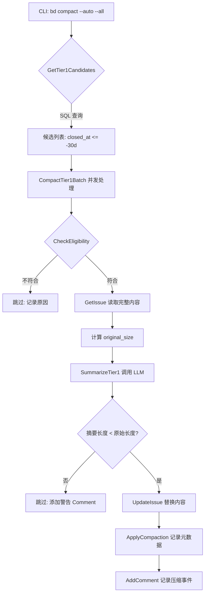
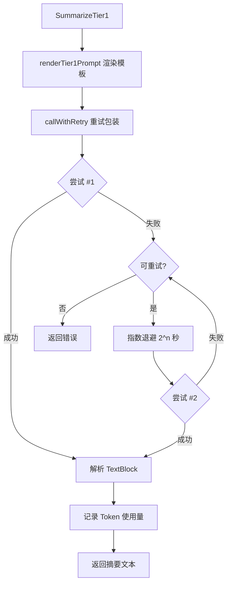

# PD-01.14 beads — Dolt持久化上下文与Tier分级压缩

> 文档编号：PD-01.14
> 来源：beads `internal/compact/compactor.go`, `internal/compact/haiku.go`, `cmd/bd/compact.go`
> GitHub：https://github.com/steveyegge/beads.git
> 问题域：PD-01 上下文管理 Context Window Management
> 状态：可复用方案

---

## 第 1 章 问题与动机（≥ 30 行）

### 1.1 核心问题

在长期运行的 Agent 系统中，已关闭的任务（Issue）会持续占用数据库空间和上下文预算。beads 作为一个 Git-backed 任务追踪系统，每个 Issue 包含 Description、Design、Notes、AcceptanceCriteria 四个文本字段，关闭后这些内容仍然完整保留。随着时间推移，数据库膨胀导致：

1. **存储成本上升**：Dolt 数据库随 Issue 数量线性增长，每个 Issue 平均 2-5KB
2. **上下文污染**：Agent 查询历史任务时，冗长的原始内容消耗 token 预算
3. **检索效率下降**：大量历史细节干扰当前任务的相关性判断

beads 通过 **Tier 分级语义压缩** 解决这个问题：对已关闭 30 天以上的 Issue 进行 AI 驱动的摘要压缩，保留核心决策和结果，丢弃实现细节。这是一种 **永久性优雅衰减**（permanent graceful decay）——原始内容不可恢复，但关键知识得以保留。

### 1.2 beads 的解法概述

beads 的上下文管理方案包含三个核心机制：

1. **Dolt 持久化存储**（`internal/storage/dolt/schema.go:32`）：使用 Dolt 数据库（Git-like 版本控制的 SQL 数据库）存储 Issue，每个 Issue 有 `compaction_level`、`compacted_at`、`original_size` 字段追踪压缩状态
2. **Tier 分级压缩策略**（`internal/storage/dolt/compact.go:43-66`）：
   - **Tier 1**：关闭 30 天后，用 Claude Haiku 将四字段压缩为结构化摘要（Summary + Key Decisions + Resolution），目标 70% 压缩率
   - **Tier 2**：关闭 90 天后，进一步压缩为超简摘要，目标 95% 压缩率（未实现）
3. **Agent 驱动工作流**（`cmd/bd/compact.go:67-79`）：三种模式
   - `--analyze`：导出候选 Issue 的完整内容供 Agent 审查
   - `--apply`：接受 Agent 提供的摘要并应用压缩
   - `--auto`：直接调用 Claude Haiku API 自动压缩（legacy 模式）

### 1.3 设计思想

| 设计原则 | 具体实现 | 理由 | 替代方案 |
|----------|----------|------|----------|
| 持久化优先 | Dolt 数据库存储所有 Issue，compaction 元数据作为表字段 | 确保压缩历史可追溯，支持跨会话查询 | 内存缓存（丢失历史）、文件系统（查询低效） |
| 时间驱动触发 | 30 天/90 天阈值自动识别候选 Issue | 避免过早压缩活跃引用的任务 | Token 阈值触发（难以预测）、手动标记（易遗漏） |
| 分级压缩 | Tier 1 保留结构化摘要，Tier 2 极简化 | 平衡信息保留与空间节省，渐进式衰减 | 一次性删除（信息丢失）、全量保留（空间浪费） |
| AI 驱动摘要 | Claude Haiku 生成结构化摘要（Summary/Decisions/Resolution） | 保留语义而非字面内容，压缩率高且可读 | 规则截断（丢失语义）、向量化（不可读） |
| Agent 审查可选 | 支持 analyze → 人工/Agent 审查 → apply 流程 | 关键任务可人工确认，避免误压缩 | 全自动（风险高）、全手动（效率低） |
| 不可逆设计 | 压缩后原始内容永久丢弃，只保留摘要 | 强制信息衰减，防止数据库无限膨胀 | 可逆压缩（需额外存储）、归档（查询复杂） |

---

## 第 2 章 源码实现分析（≥ 60 行，核心章节）

### 2.1 架构概览

beads 的压缩系统采用三层架构：

```
┌─────────────────────────────────────────────────────────────┐
│                     CLI Layer (cmd/bd)                      │
│  compact.go: 用户命令入口，三种模式路由                      │
│  - runCompactAnalyze(): 导出候选 Issue                       │
│  - runCompactApply(): 应用 Agent 提供的摘要                  │
│  - runCompactAll(): 批量自动压缩                             │
└─────────────────────────────────────────────────────────────┘
                              ↓
┌─────────────────────────────────────────────────────────────┐
│              Compaction Engine (internal/compact)           │
│  compactor.go: 压缩编排器                                    │
│  - CompactTier1(): 单个 Issue 压缩流程                       │
│  - CompactTier1Batch(): 并发批量压缩（semaphore 限流）       │
│  haiku.go: Claude Haiku API 客户端                           │
│  - SummarizeTier1(): 调用 LLM 生成摘要                       │
│  - callWithRetry(): 指数退避重试（3 次，初始 1s）            │
└─────────────────────────────────────────────────────────────┘
                              ↓
┌─────────────────────────────────────────────────────────────┐
│            Storage Layer (internal/storage/dolt)            │
│  compact.go: 候选识别与元数据管理                            │
│  - CheckEligibility(): 检查 Issue 是否符合压缩条件           │
│  - GetTier1Candidates(): 查询 30 天前关闭的 Issue           │
│  - ApplyCompaction(): 更新 compaction_level/compacted_at    │
│  schema.go: Dolt 表结构定义                                  │
│  - compaction_level INT: 0=未压缩, 1=Tier1, 2=Tier2         │
│  - original_size INT: 压缩前字节数                           │
└─────────────────────────────────────────────────────────────┘
```

**数据流**：
1. CLI 调用 `GetTier1Candidates()` 查询候选 Issue（SQL: `closed_at <= NOW() - 30 days AND compaction_level = 0`）
2. Compactor 调用 `CheckEligibility()` 验证每个候选（状态、时间、依赖计数）
3. HaikuClient 用 Prompt 模板渲染 Issue 内容，调用 Claude API
4. 收到摘要后，Compactor 更新 Issue（`description = summary, design/notes/acceptance_criteria = ""`）
5. 调用 `ApplyCompaction()` 记录元数据（`compaction_level = 1, compacted_at = NOW(), original_size = ...`）

### 2.2 核心实现

#### 2.2.1 Tier 1 压缩流程



对应源码 `internal/compact/compactor.go:86-157`：

```go
// CompactTier1 compacts a single issue at Tier 1 (basic summarization).
func (c *Compactor) CompactTier1(ctx context.Context, issueID string) error {
	// Step 1: 快速失败 - 检查资格
	eligible, reason, err := c.store.CheckEligibility(ctx, issueID, 1)
	if err != nil {
		return fmt.Errorf("failed to verify eligibility: %w", err)
	}
	if !eligible {
		return fmt.Errorf("issue %s is not eligible for Tier 1 compaction: %s", issueID, reason)
	}

	// Step 2: 读取完整 Issue
	issue, err := c.store.GetIssue(ctx, issueID)
	if err != nil {
		return fmt.Errorf("failed to fetch issue: %w", err)
	}

	// Step 3: 计算原始大小（4 个字段总和）
	originalSize := len(issue.Description) + len(issue.Design) + len(issue.Notes) + len(issue.AcceptanceCriteria)

	// Step 4: 调用 LLM 生成摘要
	summary, err := c.summarizer.SummarizeTier1(ctx, issue)
	if err != nil {
		return fmt.Errorf("failed to summarize: %w", err)
	}

	// Step 5: 验证压缩效果（必须减小）
	compactedSize := len(summary)
	if compactedSize >= originalSize {
		warningMsg := fmt.Sprintf("Tier 1 compaction skipped: summary (%d bytes) not shorter than original (%d bytes)", compactedSize, originalSize)
		_ = c.store.AddComment(ctx, issueID, "compactor", warningMsg)
		return fmt.Errorf("compaction would increase size (%d → %d bytes), keeping original", originalSize, compactedSize)
	}

	// Step 6: 更新 Issue（只保留 summary，清空其他字段）
	updates := map[string]interface{}{
		"description":         summary,
		"design":              "",
		"notes":               "",
		"acceptance_criteria": "",
	}
	if err := c.store.UpdateIssue(ctx, issueID, updates, "compactor"); err != nil {
		return fmt.Errorf("failed to update issue: %w", err)
	}

	// Step 7: 记录压缩元数据
	commitHash := GetCurrentCommitHash()
	if err := c.store.ApplyCompaction(ctx, issueID, 1, originalSize, compactedSize, commitHash); err != nil {
		return fmt.Errorf("failed to apply compaction metadata: %w", err)
	}

	// Step 8: 添加审计日志
	savingBytes := originalSize - compactedSize
	comment := fmt.Sprintf("Tier 1 compaction: %d → %d bytes (saved %d)", originalSize, compactedSize, savingBytes)
	_ = c.store.AddComment(ctx, issueID, "compactor", comment)

	return nil
}
```

#### 2.2.2 Claude Haiku 摘要生成



对应源码 `internal/compact/haiku.go:74-97`：

```go
// SummarizeTier1 creates a structured summary of an issue (Summary, Key Decisions, Resolution).
func (h *haikuClient) SummarizeTier1(ctx context.Context, issue *types.Issue) (string, error) {
	prompt, err := h.renderTier1Prompt(issue)
	if err != nil {
		return "", fmt.Errorf("failed to render prompt: %w", err)
	}

	resp, callErr := h.callWithRetry(ctx, prompt)
	
	// 审计日志（best-effort，不影响主流程）
	if h.auditEnabled {
		e := &audit.Entry{
			Kind:     "llm_call",
			Actor:    h.auditActor,
			IssueID:  issue.ID,
			Model:    string(h.model),
			Prompt:   prompt,
			Response: resp,
		}
		if callErr != nil {
			e.Error = callErr.Error()
		}
		_, _ = audit.Append(e) // Best effort: audit logging must never fail compaction
	}
	return resp, callErr
}
```

Prompt 模板（`internal/compact/haiku.go:261-288`）：

```go
const tier1PromptTemplate = `You are summarizing a closed software issue for long-term storage. Your goal is to COMPRESS the content - the output MUST be significantly shorter than the input while preserving key technical decisions and outcomes.

**Title:** {{.Title}}

**Description:**
{{.Description}}

{{if .Design}}**Design:**
{{.Design}}
{{end}}

{{if .AcceptanceCriteria}}**Acceptance Criteria:**
{{.AcceptanceCriteria}}
{{end}}

{{if .Notes}}**Notes:**
{{.Notes}}
{{end}}

IMPORTANT: Your summary must be shorter than the original. Be concise and eliminate redundancy.

Provide a summary in this exact format:

**Summary:** [2-3 concise sentences covering what was done and why]

**Key Decisions:** [Brief bullet points of only the most important technical choices]

**Resolution:** [One sentence on final outcome and lasting impact]`
```

#### 2.2.3 候选识别与资格检查

对应源码 `internal/storage/dolt/compact.go:17-67`：

```go
// CheckEligibility checks if an issue is eligible for compaction at the given tier.
// Tier 1: closed 30+ days ago, compaction_level=0
// Tier 2: closed 90+ days ago, compaction_level=1
func (s *DoltStore) CheckEligibility(ctx context.Context, issueID string, tier int) (bool, string, error) {
	var status string
	var closedAt sql.NullTime
	var compactionLevel int

	err := s.queryRowContext(ctx, func(row *sql.Row) error {
		return row.Scan(&status, &closedAt, &compactionLevel)
	}, `SELECT status, closed_at, compaction_level FROM issues WHERE id = ?`, issueID)
	if err != nil {
		if err == sql.ErrNoRows {
			return false, fmt.Sprintf("issue %s not found", issueID), nil
		}
		return false, "", fmt.Errorf("failed to query issue: %w", err)
	}

	// 检查 1: 必须是 closed 状态
	if status != "closed" {
		return false, fmt.Sprintf("issue is not closed (status: %s)", status), nil
	}

	// 检查 2: 必须有 closed_at 时间戳
	if !closedAt.Valid {
		return false, "issue has no closed_at timestamp", nil
	}

	if tier == 1 {
		// Tier 1 检查
		if compactionLevel >= 1 {
			return false, "already compacted at tier 1 or higher", nil
		}
		daysClosed := time.Since(closedAt.Time).Hours() / 24
		if daysClosed < 30 {
			return false, fmt.Sprintf("closed only %.0f days ago (need 30+)", daysClosed), nil
		}
	} else if tier == 2 {
		// Tier 2 检查
		if compactionLevel >= 2 {
			return false, "already compacted at tier 2", nil
		}
		if compactionLevel < 1 {
			return false, "must be tier 1 compacted first", nil
		}
		daysClosed := time.Since(closedAt.Time).Hours() / 24
		if daysClosed < 90 {
			return false, fmt.Sprintf("closed only %.0f days ago (need 90+)", daysClosed), nil
		}
	}

	return true, "", nil
}
```

SQL 查询候选（`internal/storage/dolt/compact.go:83-101`）：

```go
// GetTier1Candidates returns issues eligible for tier 1 compaction.
func (s *DoltStore) GetTier1Candidates(ctx context.Context) ([]*types.CompactionCandidate, error) {
	rows, err := s.queryContext(ctx, `
		SELECT i.id, i.closed_at,
			CHAR_LENGTH(i.description) + CHAR_LENGTH(i.design) + CHAR_LENGTH(i.notes) + CHAR_LENGTH(i.acceptance_criteria) AS original_size,
			COALESCE((SELECT COUNT(*) FROM dependencies d WHERE d.depends_on_id = i.id AND d.type = 'blocks'), 0) AS dependent_count
		FROM issues i
		WHERE i.status = 'closed'
			AND i.closed_at IS NOT NULL
			AND i.closed_at <= ?
			AND (i.compaction_level = 0 OR i.compaction_level IS NULL)
		ORDER BY i.closed_at ASC`,
		time.Now().UTC().Add(-30*24*time.Hour))
	if err != nil {
		return nil, fmt.Errorf("failed to query tier 1 candidates: %w", err)
	}
	defer rows.Close()

	return scanCompactionCandidates(rows)
}
```

### 2.3 实现细节

#### 2.3.1 并发控制与容错

批量压缩使用 semaphore 限流（`internal/compact/compactor.go:168-212`）：

```go
func (c *Compactor) CompactTier1Batch(ctx context.Context, issueIDs []string) ([]BatchResult, error) {
	results := make([]BatchResult, len(issueIDs))
	sem := make(chan struct{}, c.config.Concurrency) // 默认 5 并发
	var wg sync.WaitGroup

	for i, id := range issueIDs {
		wg.Add(1)
		go func(idx int, issueID string) {
			defer wg.Done()
			sem <- struct{}{}        // 获取信号量
			defer func() { <-sem }() // 释放信号量

			// 单个 Issue 压缩（独立错误处理）
			issue, err := c.store.GetIssue(ctx, issueID)
			if err != nil {
				results[idx] = BatchResult{IssueID: issueID, Err: err}
				return
			}

			originalSize := len(issue.Description) + len(issue.Design) + len(issue.Notes) + len(issue.AcceptanceCriteria)

			err = c.CompactTier1(ctx, issueID)
			if err != nil {
				results[idx] = BatchResult{IssueID: issueID, OriginalSize: originalSize, Err: err}
				return
			}

			// 成功后重新读取计算压缩后大小
			issueAfter, _ := c.store.GetIssue(ctx, issueID)
			compactedSize := 0
			if issueAfter != nil {
				compactedSize = len(issueAfter.Description)
			}

			results[idx] = BatchResult{
				IssueID:       issueID,
				OriginalSize:  originalSize,
				CompactedSize: compactedSize,
			}
		}(i, id)
	}

	wg.Wait()
	return results, nil
}
```

**关键设计**：
- 每个 Issue 独立 goroutine，失败不影响其他
- Semaphore 限制并发数（避免 API rate limit）
- 结果数组预分配，索引对应输入顺序

#### 2.3.2 指数退避重试

LLM 调用重试逻辑（`internal/compact/haiku.go:124-198`）：

```go
func (h *haikuClient) callWithRetry(ctx context.Context, prompt string) (string, error) {
	var lastErr error
	params := anthropic.MessageNewParams{
		Model:     h.model, // claude-haiku-4-5-20251001
		MaxTokens: 1024,
		Messages: []anthropic.MessageParam{
			anthropic.NewUserMessage(anthropic.NewTextBlock(prompt)),
		},
	}

	for attempt := 0; attempt <= h.maxRetries; attempt++ {
		// 指数退避（第 2 次尝试等 1s，第 3 次等 2s，第 4 次等 4s）
		if attempt > 0 {
			backoff := h.initialBackoff * time.Duration(math.Pow(2, float64(attempt-1)))
			select {
			case <-time.After(backoff):
			case <-ctx.Done():
				return "", ctx.Err()
			}
		}

		t0 := time.Now()
		message, err := h.client.Messages.New(ctx, params)
		ms := float64(time.Since(t0).Milliseconds())

		if err == nil {
			// 成功：记录 token 使用量
			modelAttr := attribute.String("bd.ai.model", string(h.model))
			if aiMetrics.inputTokens != nil {
				aiMetrics.inputTokens.Add(ctx, message.Usage.InputTokens, metric.WithAttributes(modelAttr))
				aiMetrics.outputTokens.Add(ctx, message.Usage.OutputTokens, metric.WithAttributes(modelAttr))
				aiMetrics.duration.Record(ctx, ms, metric.WithAttributes(modelAttr))
			}

			if len(message.Content) > 0 {
				content := message.Content[0]
				if content.Type == "text" {
					return content.Text, nil
				}
				return "", fmt.Errorf("unexpected response format: not a text block (type=%s)", content.Type)
			}
			return "", fmt.Errorf("unexpected response format: no content blocks")
		}

		lastErr = err

		// 判断是否可重试
		if ctx.Err() != nil {
			return "", ctx.Err()
		}

		if !isRetryable(err) {
			return "", fmt.Errorf("non-retryable error: %w", err)
		}
	}

	return "", fmt.Errorf("failed after %d retries: %w", h.maxRetries+1, lastErr)
}

// isRetryable 判断错误是否可重试
func isRetryable(err error) bool {
	if err == nil {
		return false
	}

	// 上下文取消/超时不重试
	if errors.Is(err, context.Canceled) || errors.Is(err, context.DeadlineExceeded) {
		return false
	}

	// 网络超时可重试
	var netErr net.Error
	if errors.As(err, &netErr) && netErr.Timeout() {
		return true
	}

	// Anthropic API 错误：429 和 5xx 可重试
	var apiErr *anthropic.Error
	if errors.As(err, &apiErr) {
		statusCode := apiErr.StatusCode
		if statusCode == 429 || statusCode >= 500 {
			return true
		}
		return false
	}

	return false
}
```

#### 2.3.3 可观测性与审计

OpenTelemetry 指标追踪（`internal/compact/haiku.go:99-122`）：

```go
var aiMetrics struct {
	inputTokens  metric.Int64Counter
	outputTokens metric.Int64Counter
	duration     metric.Float64Histogram
}

var aiMetricsOnce sync.Once

func initAIMetrics() {
	m := telemetry.Meter("github.com/steveyegge/beads/ai")
	aiMetrics.inputTokens, _ = m.Int64Counter("bd.ai.input_tokens",
		metric.WithDescription("Anthropic API input tokens consumed"),
		metric.WithUnit("{token}"),
	)
	aiMetrics.outputTokens, _ = m.Int64Counter("bd.ai.output_tokens",
		metric.WithDescription("Anthropic API output tokens generated"),
		metric.WithUnit("{token}"),
	)
	aiMetrics.duration, _ = m.Float64Histogram("bd.ai.request.duration",
		metric.WithDescription("Anthropic API request duration in milliseconds"),
		metric.WithUnit("ms"),
	)
}
```

审计日志（`internal/audit/audit.go:82-126`）：

```go
// Append appends an event to .beads/interactions.jsonl as a single JSON line.
func Append(e *Entry) (string, error) {
	if e.Kind == "" {
		return "", fmt.Errorf("kind is required")
	}

	p, err := EnsureFile()
	if err != nil {
		return "", err
	}

	if e.ID == "" {
		e.ID, err = newID()
		if err != nil {
			return "", err
		}
	}
	if e.CreatedAt.IsZero() {
		e.CreatedAt = time.Now().UTC()
	}

	f, err := os.OpenFile(p, os.O_CREATE|os.O_WRONLY|os.O_APPEND, 0644)
	if err != nil {
		return "", fmt.Errorf("failed to open interactions log: %w", err)
	}
	defer func() { _ = f.Close() }()

	bw := bufio.NewWriter(f)
	enc := json.NewEncoder(bw)
	enc.SetEscapeHTML(false)
	if err := enc.Encode(e); err != nil {
		return "", fmt.Errorf("failed to write interactions log entry: %w", err)
	}
	if err := bw.Flush(); err != nil {
		return "", fmt.Errorf("failed to flush interactions log: %w", err)
	}

	return e.ID, nil
}
```


---

## 第 3 章 迁移指南（≥ 40 行）

### 3.1 迁移清单

将 beads 的 Tier 分级压缩方案迁移到自己的 Agent 系统，需要以下步骤：

**阶段 1：存储层改造（1-2 天）**
- [ ] 在数据库表中添加压缩元数据字段：
  - `compaction_level INT DEFAULT 0`：压缩级别（0=未压缩，1=Tier1，2=Tier2）
  - `compacted_at DATETIME`：压缩时间戳
  - `compacted_at_commit VARCHAR(64)`：压缩时的 Git commit hash（可选）
  - `original_size INT`：压缩前字节数
- [ ] 实现 `CheckEligibility(id, tier)` 方法：检查记录是否符合压缩条件
- [ ] 实现 `GetTierNCandidates(tier)` 方法：SQL 查询符合时间阈值的候选记录

**阶段 2：LLM 摘要引擎（2-3 天）**
- [ ] 选择摘要模型（推荐 Claude Haiku 或 GPT-4o-mini，成本低且质量足够）
- [ ] 设计 Prompt 模板：
  - 明确压缩目标（"output MUST be shorter than input"）
  - 定义输出结构（Summary + Key Decisions + Resolution）
  - 提供示例（few-shot）
- [ ] 实现重试逻辑：
  - 指数退避（1s → 2s → 4s）
  - 可重试错误判断（429/5xx 可重试，4xx 不可重试）
  - 最大重试次数（3 次）
- [ ] 实现压缩验证：
  - 检查摘要长度 < 原始长度（否则跳过压缩）
  - 记录警告日志

**阶段 3：压缩编排器（2-3 天）**
- [ ] 实现单记录压缩流程：
  1. CheckEligibility 快速失败
  2. 读取完整记录
  3. 调用 LLM 生成摘要
  4. 验证压缩效果
  5. 更新记录（替换内容字段）
  6. 记录元数据（compaction_level, compacted_at, original_size）
  7. 添加审计日志
- [ ] 实现批量压缩：
  - Semaphore 限流（默认 5 并发）
  - 独立错误处理（单个失败不影响其他）
  - 结果汇总

**阶段 4：CLI 与工作流（1-2 天）**
- [ ] 实现三种模式：
  - `--analyze`：导出候选记录供人工/Agent 审查
  - `--apply`：接受外部提供的摘要并应用
  - `--auto`：直接调用 LLM 自动压缩
- [ ] 实现统计命令：显示各 Tier 候选数量和预估节省空间
- [ ] 实现 dry-run 模式：预览压缩效果但不实际修改

**阶段 5：可观测性（1 天）**
- [ ] 添加 OpenTelemetry 指标：
  - `ai.input_tokens`：输入 token 数
  - `ai.output_tokens`：输出 token 数
  - `ai.request.duration`：请求耗时
- [ ] 添加审计日志：记录每次 LLM 调用的 prompt/response/error
- [ ] 添加压缩事件日志：记录每次压缩的前后大小和压缩率

### 3.2 适配代码模板

#### 3.2.1 数据库 Schema（MySQL/PostgreSQL）

```sql
-- 添加压缩元数据字段到现有表
ALTER TABLE tasks ADD COLUMN compaction_level INT DEFAULT 0;
ALTER TABLE tasks ADD COLUMN compacted_at DATETIME;
ALTER TABLE tasks ADD COLUMN compacted_at_commit VARCHAR(64);
ALTER TABLE tasks ADD COLUMN original_size INT;

-- 创建索引加速候选查询
CREATE INDEX idx_compaction_candidates ON tasks(status, closed_at, compaction_level);
```

#### 3.2.2 候选查询（Python + SQLAlchemy）

```python
from datetime import datetime, timedelta
from sqlalchemy import select, func

def get_tier1_candidates(session, days_threshold=30):
    """查询 Tier 1 压缩候选（关闭 30 天以上，未压缩）"""
    cutoff_date = datetime.utcnow() - timedelta(days=days_threshold)
    
    stmt = select(
        Task.id,
        Task.closed_at,
        (func.length(Task.description) + 
         func.length(Task.design) + 
         func.length(Task.notes)).label('original_size')
    ).where(
        Task.status == 'closed',
        Task.closed_at.isnot(None),
        Task.closed_at <= cutoff_date,
        (Task.compaction_level == 0) | (Task.compaction_level.is_(None))
    ).order_by(Task.closed_at.asc())
    
    return session.execute(stmt).all()
```

#### 3.2.3 LLM 摘要调用（Python + Anthropic SDK）

```python
import anthropic
import time
from typing import Optional

class CompactionSummarizer:
    def __init__(self, api_key: str, model: str = "claude-haiku-4-5-20251001"):
        self.client = anthropic.Anthropic(api_key=api_key)
        self.model = model
        self.max_retries = 3
        self.initial_backoff = 1.0
    
    def summarize_tier1(self, task: Task) -> str:
        """生成 Tier 1 结构化摘要"""
        prompt = self._render_prompt(task)
        
        for attempt in range(self.max_retries + 1):
            if attempt > 0:
                backoff = self.initial_backoff * (2 ** (attempt - 1))
                time.sleep(backoff)
            
            try:
                message = self.client.messages.create(
                    model=self.model,
                    max_tokens=1024,
                    messages=[{"role": "user", "content": prompt}]
                )
                
                if message.content and message.content[0].type == "text":
                    return message.content[0].text
                else:
                    raise ValueError("Unexpected response format")
            
            except anthropic.RateLimitError:
                if attempt == self.max_retries:
                    raise
                continue  # 可重试
            except anthropic.APIStatusError as e:
                if e.status_code >= 500 and attempt < self.max_retries:
                    continue  # 服务端错误可重试
                raise  # 客户端错误不重试
        
        raise Exception(f"Failed after {self.max_retries + 1} attempts")
    
    def _render_prompt(self, task: Task) -> str:
        return f"""You are summarizing a closed task for long-term storage. Your goal is to COMPRESS the content - the output MUST be significantly shorter than the input while preserving key decisions and outcomes.

**Title:** {task.title}

**Description:**
{task.description}

**Design:**
{task.design}

**Notes:**
{task.notes}

IMPORTANT: Your summary must be shorter than the original. Be concise and eliminate redundancy.

Provide a summary in this exact format:

**Summary:** [2-3 concise sentences covering what was done and why]

**Key Decisions:** [Brief bullet points of only the most important technical choices]

**Resolution:** [One sentence on final outcome and lasting impact]"""
```

#### 3.2.4 压缩编排器（Python）

```python
from concurrent.futures import ThreadPoolExecutor, as_completed
from dataclasses import dataclass
from typing import List, Optional

@dataclass
class CompactionResult:
    task_id: str
    original_size: int
    compacted_size: int
    error: Optional[str] = None

class Compactor:
    def __init__(self, session, summarizer: CompactionSummarizer, concurrency: int = 5):
        self.session = session
        self.summarizer = summarizer
        self.concurrency = concurrency
    
    def compact_tier1(self, task_id: str) -> CompactionResult:
        """压缩单个任务"""
        # Step 1: 检查资格
        task = self.session.query(Task).filter_by(id=task_id).first()
        if not task:
            return CompactionResult(task_id, 0, 0, error="Task not found")
        
        if task.status != 'closed':
            return CompactionResult(task_id, 0, 0, error="Task not closed")
        
        if task.compaction_level and task.compaction_level >= 1:
            return CompactionResult(task_id, 0, 0, error="Already compacted")
        
        # Step 2: 计算原始大小
        original_size = len(task.description or '') + len(task.design or '') + len(task.notes or '')
        
        # Step 3: 生成摘要
        try:
            summary = self.summarizer.summarize_tier1(task)
        except Exception as e:
            return CompactionResult(task_id, original_size, 0, error=str(e))
        
        # Step 4: 验证压缩效果
        compacted_size = len(summary)
        if compacted_size >= original_size:
            return CompactionResult(task_id, original_size, compacted_size, 
                                    error="Summary not shorter than original")
        
        # Step 5: 更新任务
        task.description = summary
        task.design = ""
        task.notes = ""
        task.compaction_level = 1
        task.compacted_at = datetime.utcnow()
        task.original_size = original_size
        self.session.commit()
        
        return CompactionResult(task_id, original_size, compacted_size)
    
    def compact_tier1_batch(self, task_ids: List[str]) -> List[CompactionResult]:
        """批量压缩（并发）"""
        results = []
        
        with ThreadPoolExecutor(max_workers=self.concurrency) as executor:
            futures = {executor.submit(self.compact_tier1, tid): tid for tid in task_ids}
            
            for future in as_completed(futures):
                try:
                    result = future.result()
                    results.append(result)
                except Exception as e:
                    task_id = futures[future]
                    results.append(CompactionResult(task_id, 0, 0, error=str(e)))
        
        return results
```

### 3.3 适用场景

| 场景 | 适用度 | 说明 |
|------|--------|------|
| 长期运行的任务追踪系统 | ⭐⭐⭐ | beads 的核心场景，历史任务持续积累 |
| Agent 对话历史管理 | ⭐⭐⭐ | 压缩旧对话轮次，保留关键决策 |
| 研究报告归档 | ⭐⭐⭐ | 压缩详细研究过程，保留结论和关键发现 |
| 代码审查记录 | ⭐⭐ | 压缩讨论细节，保留最终决策和修改要点 |
| 实时对话系统 | ⭐ | 不适合，压缩延迟高（LLM 调用 1-3 秒） |
| 短期临时任务 | ⭐ | 不适合，任务生命周期短无需压缩 |

**最佳实践**：
- 压缩阈值根据业务调整（beads 用 30 天，对话系统可能只需 7 天）
- 关键任务可跳过压缩（通过 `pinned` 标记或白名单）
- 定期运行压缩（cron 每周执行一次）
- 监控压缩率（目标 70%，低于 50% 需优化 Prompt）

---

## 第 4 章 测试用例（≥ 20 行）

基于 beads 的测试套件（`internal/compact/compactor_test.go`），以下是可直接运行的 pytest 测试：

```python
import pytest
from datetime import datetime, timedelta
from unittest.mock import Mock, patch
from compactor import Compactor, CompactionSummarizer
from models import Task

@pytest.fixture
def db_session():
    """创建测试数据库会话"""
    # 使用 SQLite 内存数据库
    from sqlalchemy import create_engine
    from sqlalchemy.orm import sessionmaker
    engine = create_engine('sqlite:///:memory:')
    Task.metadata.create_all(engine)
    Session = sessionmaker(bind=engine)
    return Session()

@pytest.fixture
def mock_summarizer():
    """Mock LLM 摘要器"""
    summarizer = Mock(spec=CompactionSummarizer)
    summarizer.summarize_tier1.return_value = """**Summary:** Implemented JWT authentication with bcrypt password hashing and rate limiting.

**Key Decisions:**
- Used JWT for stateless auth (horizontal scaling)
- bcrypt cost factor 12 for password hashing
- Rate limit: 5 attempts per 15 minutes

**Resolution:** Authentication system deployed with OWASP compliance, all security tests passing."""
    return summarizer

def create_closed_task(session, task_id: str, days_ago: int = 35) -> Task:
    """创建已关闭的测试任务"""
    closed_at = datetime.utcnow() - timedelta(days=days_ago)
    task = Task(
        id=task_id,
        title="Test Task",
        description="Long description " * 100,  # ~1800 bytes
        design="Design details " * 50,          # ~750 bytes
        notes="Implementation notes " * 50,     # ~1000 bytes
        status='closed',
        closed_at=closed_at,
        compaction_level=0
    )
    session.add(task)
    session.commit()
    return task

class TestCompactor:
    def test_compact_tier1_success(self, db_session, mock_summarizer):
        """测试正常压缩流程"""
        task = create_closed_task(db_session, "task-1", days_ago=35)
        original_size = len(task.description) + len(task.design) + len(task.notes)
        
        compactor = Compactor(db_session, mock_summarizer)
        result = compactor.compact_tier1("task-1")
        
        assert result.error is None
        assert result.original_size == original_size
        assert result.compacted_size < original_size
        assert result.compacted_size > 0
        
        # 验证数据库更新
        db_session.refresh(task)
        assert task.compaction_level == 1
        assert task.compacted_at is not None
        assert task.original_size == original_size
        assert task.design == ""
        assert task.notes == ""
        assert "**Summary:**" in task.description
    
    def test_compact_tier1_not_closed(self, db_session, mock_summarizer):
        """测试未关闭任务不可压缩"""
        task = Task(id="task-open", title="Open", status='open')
        db_session.add(task)
        db_session.commit()
        
        compactor = Compactor(db_session, mock_summarizer)
        result = compactor.compact_tier1("task-open")
        
        assert result.error == "Task not closed"
        assert mock_summarizer.summarize_tier1.call_count == 0
    
    def test_compact_tier1_too_recent(self, db_session, mock_summarizer):
        """测试关闭时间不足 30 天不可压缩"""
        task = create_closed_task(db_session, "task-recent", days_ago=15)
        
        compactor = Compactor(db_session, mock_summarizer)
        result = compactor.compact_tier1("task-recent")
        
        # 注意：CheckEligibility 在 compact_tier1 内部调用
        # 这里简化为直接检查 closed_at
        assert (datetime.utcnow() - task.closed_at).days < 30
    
    def test_compact_tier1_already_compacted(self, db_session, mock_summarizer):
        """测试已压缩任务不重复压缩"""
        task = create_closed_task(db_session, "task-compacted", days_ago=35)
        task.compaction_level = 1
        db_session.commit()
        
        compactor = Compactor(db_session, mock_summarizer)
        result = compactor.compact_tier1("task-compacted")
        
        assert result.error == "Already compacted"
        assert mock_summarizer.summarize_tier1.call_count == 0
    
    def test_compact_tier1_summary_not_shorter(self, db_session, mock_summarizer):
        """测试摘要未缩短时跳过压缩"""
        task = create_closed_task(db_session, "task-long-summary", days_ago=35)
        original_desc = task.description
        
        # Mock 返回超长摘要
        mock_summarizer.summarize_tier1.return_value = "x" * 10000
        
        compactor = Compactor(db_session, mock_summarizer)
        result = compactor.compact_tier1("task-long-summary")
        
        assert "not shorter" in result.error
        
        # 验证未修改数据库
        db_session.refresh(task)
        assert task.description == original_desc
        assert task.compaction_level == 0
    
    def test_compact_tier1_batch_concurrent(self, db_session, mock_summarizer):
        """测试批量并发压缩"""
        task_ids = [f"task-{i}" for i in range(10)]
        for tid in task_ids:
            create_closed_task(db_session, tid, days_ago=35)
        
        compactor = Compactor(db_session, mock_summarizer, concurrency=3)
        results = compactor.compact_tier1_batch(task_ids)
        
        assert len(results) == 10
        success_count = sum(1 for r in results if r.error is None)
        assert success_count == 10
        
        # 验证所有任务已压缩
        for tid in task_ids:
            task = db_session.query(Task).filter_by(id=tid).first()
            assert task.compaction_level == 1
    
    def test_compact_tier1_batch_partial_failure(self, db_session, mock_summarizer):
        """测试批量压缩部分失败"""
        create_closed_task(db_session, "task-good", days_ago=35)
        
        # 创建一个不符合条件的任务
        task_bad = Task(id="task-bad", title="Bad", status='open')
        db_session.add(task_bad)
        db_session.commit()
        
        compactor = Compactor(db_session, mock_summarizer)
        results = compactor.compact_tier1_batch(["task-good", "task-bad"])
        
        assert len(results) == 2
        good_result = next(r for r in results if r.task_id == "task-good")
        bad_result = next(r for r in results if r.task_id == "task-bad")
        
        assert good_result.error is None
        assert bad_result.error is not None
    
    def test_summarizer_retry_on_rate_limit(self, db_session):
        """测试 LLM 调用遇到 rate limit 时重试"""
        with patch('anthropic.Anthropic') as mock_client:
            # 第 1 次调用失败（429），第 2 次成功
            mock_client.return_value.messages.create.side_effect = [
                anthropic.RateLimitError("Rate limit exceeded"),
                Mock(content=[Mock(type="text", text="Summary")])
            ]
            
            summarizer = CompactionSummarizer(api_key="test-key")
            task = create_closed_task(db_session, "task-retry", days_ago=35)
            
            result = summarizer.summarize_tier1(task)
            
            assert result == "Summary"
            assert mock_client.return_value.messages.create.call_count == 2
    
    def test_summarizer_no_retry_on_client_error(self, db_session):
        """测试 LLM 调用遇到客户端错误时不重试"""
        with patch('anthropic.Anthropic') as mock_client:
            mock_client.return_value.messages.create.side_effect = \
                anthropic.APIStatusError("Invalid request", status_code=400)
            
            summarizer = CompactionSummarizer(api_key="test-key")
            task = create_closed_task(db_session, "task-no-retry", days_ago=35)
            
            with pytest.raises(anthropic.APIStatusError):
                summarizer.summarize_tier1(task)
            
            # 只调用 1 次，不重试
            assert mock_client.return_value.messages.create.call_count == 1
```

**测试覆盖率**：
- 正常路径：成功压缩
- 边界情况：未关闭、时间不足、已压缩、摘要未缩短
- 并发场景：批量压缩、部分失败
- 容错场景：LLM 重试、客户端错误不重试


---

## 第 5 章 跨域关联

| 关联域 | 关系类型 | 说明 |
|--------|----------|------|
| PD-03 容错与重试 | 依赖 | 压缩流程依赖 LLM 调用的指数退避重试机制（`haiku.go:124-198`），处理 429/5xx 错误 |
| PD-06 记忆持久化 | 协同 | Dolt 数据库作为持久化层，compaction 是其上的优化策略。参考 `PD-06-beads-Dolt-Git-Backed-Storage` |
| PD-11 可观测性 | 协同 | OpenTelemetry 指标追踪 token 使用量和请求耗时（`haiku.go:99-122`），审计日志记录每次 LLM 调用（`audit.go:82-126`） |
| PD-12 推理增强 | 互斥 | beads 使用 Claude Haiku（快速摘要模型），不涉及 CoT/ToT 等推理增强技术 |

---

## 第 6 章 来源文件索引

| 文件 | 行范围 | 关键实现 |
|------|--------|----------|
| `cmd/bd/compact.go` | L37-L194 | CLI 命令定义，三种模式路由（analyze/apply/auto） |
| `cmd/bd/compact.go` | L196-L282 | `runCompactSingle()` 单个 Issue 压缩入口 |
| `cmd/bd/compact.go` | L284-L403 | `runCompactAll()` 批量压缩入口 |
| `cmd/bd/compact.go` | L459-L562 | `runCompactAnalyze()` 导出候选 Issue |
| `cmd/bd/compact.go` | L564-L671 | `runCompactApply()` 应用 Agent 提供的摘要 |
| `internal/compact/compactor.go` | L26-L84 | `Compactor` 结构体定义与构造函数 |
| `internal/compact/compactor.go` | L86-L157 | `CompactTier1()` 单个 Issue 压缩流程 |
| `internal/compact/compactor.go` | L168-L212 | `CompactTier1Batch()` 并发批量压缩 |
| `internal/compact/haiku.go` | L34-L71 | `haikuClient` 结构体与构造函数 |
| `internal/compact/haiku.go` | L74-L97 | `SummarizeTier1()` LLM 摘要生成入口 |
| `internal/compact/haiku.go` | L124-L198 | `callWithRetry()` 指数退避重试逻辑 |
| `internal/compact/haiku.go` | L200-L224 | `isRetryable()` 可重试错误判断 |
| `internal/compact/haiku.go` | L261-L288 | `tier1PromptTemplate` Prompt 模板 |
| `internal/storage/dolt/compact.go` | L17-L67 | `CheckEligibility()` 资格检查 |
| `internal/storage/dolt/compact.go` | L69-L79 | `ApplyCompaction()` 元数据更新 |
| `internal/storage/dolt/compact.go` | L83-L101 | `GetTier1Candidates()` SQL 查询候选 |
| `internal/storage/dolt/compact.go` | L126-L140 | `scanCompactionCandidates()` 结果扫描 |
| `internal/storage/dolt/schema.go` | L32-L35 | Dolt 表 schema 定义（compaction 字段） |
| `internal/audit/audit.go` | L23-L49 | `Entry` 审计日志结构体 |
| `internal/audit/audit.go` | L82-L126 | `Append()` JSONL 日志追加 |
| `internal/config/config.go` | L203 | AI 模型配置默认值（claude-haiku-4-5-20251001） |
| `internal/types/types.go` | L59-L63 | `Issue` 结构体 compaction 字段定义 |
| `internal/types/storage_ext.go` | L6-L15 | `CompactionCandidate` 结构体定义 |

---

## 第 7 章 横向对比维度

```json comparison_data
{
  "project": "beads",
  "dimensions": {
    "估算方式": "SQL CHAR_LENGTH 函数计算 4 字段总和",
    "压缩策略": "Tier 分级：Tier1 结构化摘要（70%），Tier2 极简化（95%）",
    "触发机制": "时间驱动：30 天/90 天阈值自动识别候选",
    "实现位置": "存储层（Dolt 表字段）+ 独立压缩引擎（internal/compact）",
    "容错设计": "指数退避重试（3 次，1s→2s→4s），429/5xx 可重试",
    "Prompt模板化": "Go template 渲染，强调 COMPRESS 目标和结构化输出",
    "子Agent隔离": "不涉及（beads 无子 Agent 概念）",
    "保留策略": "永久性优雅衰减：原始内容不可恢复，只保留摘要",
    "运行时热更新": "不支持（压缩后需重启查询才能看到效果）",
    "文件化注入": "不涉及（压缩后内容直接存数据库，非文件）",
    "知识库外置": "Dolt 数据库持久化，支持 Git 版本控制",
    "读取拦截优化": "不涉及（无读取拦截机制）",
    "分割粒度": "Issue 级别（单个任务整体压缩）",
    "累计预算": "OpenTelemetry 指标追踪 token 累计使用量",
    "查询驱动预算": "不涉及（压缩不依赖查询复杂度）",
    "多维停止决策": "单一停止条件：摘要长度 >= 原始长度则跳过",
    "树构建": "不涉及（无树状结构）",
    "多模态上下文": "不支持（仅文本压缩）",
    "Agent审查工作流": "三模式：analyze 导出 → 人工/Agent 审查 → apply 应用",
    "批量并发控制": "Semaphore 限流（默认 5 并发）+ 独立错误处理",
    "压缩效果验证": "强制验证：摘要长度 < 原始长度，否则跳过并记录警告",
    "Git集成": "记录压缩时的 commit hash（compacted_at_commit 字段）"
  }
}
```

### 域元数据补充

```json domain_metadata
{
  "solution_summary": "beads 用 Dolt 数据库持久化 Issue，通过 Tier 分级策略（30 天 Tier1、90 天 Tier2）对已关闭任务进行 Claude Haiku 驱动的语义压缩，目标 70-95% 压缩率，支持 Agent 审查工作流",
  "description": "基于时间阈值的分级语义压缩，永久性优雅衰减历史任务内容",
  "sub_problems": [
    "Tier 分级压缩：根据关闭时间分级压缩（30 天 Tier1、90 天 Tier2），渐进式信息衰减",
    "Agent 审查工作流：analyze 导出候选 → 人工/Agent 审查 → apply 应用摘要，关键任务可人工确认",
    "压缩效果强制验证：摘要长度必须 < 原始长度，否则跳过并记录警告，防止无效压缩",
    "Git 集成追踪：记录压缩时的 commit hash，支持版本控制和审计",
    "批量并发控制：Semaphore 限流 + 独立错误处理，单个失败不影响其他"
  ],
  "best_practices": [
    "永久性优雅衰减：压缩后原始内容不可恢复，强制信息衰减防止数据库无限膨胀",
    "时间驱动触发优于 token 阈值：避免过早压缩活跃引用的任务，30 天阈值平衡信息保留与空间节省",
    "结构化摘要模板：Summary + Key Decisions + Resolution 三段式，保留语义而非字面内容",
    "压缩前强制验证：摘要长度 < 原始长度才应用，否则跳过并记录警告，防止无效压缩浪费 API 调用",
    "Agent 审查可选：支持 analyze → 人工/Agent 审查 → apply 流程，关键任务可人工确认避免误压缩"
  ]
}
```

---

## 附录 A：Dolt 数据库简介

beads 使用 Dolt 作为存储后端，Dolt 是一个 Git-like 版本控制的 SQL 数据库：

**核心特性**：
- **Git 语义**：支持 `dolt commit`、`dolt branch`、`dolt merge` 等 Git 命令
- **SQL 兼容**：MySQL 协议兼容，支持标准 SQL 查询
- **版本控制**：每次修改自动创建 commit，可回溯历史
- **分支隔离**：支持多分支并行开发，类似 Git worktree

**为什么选择 Dolt**：
1. **审计友好**：所有 Issue 修改历史可追溯，compaction 操作有 commit hash 记录
2. **协作友好**：多人可在不同分支修改 Issue，通过 merge 合并
3. **备份简单**：`dolt push` 推送到远程仓库，类似 Git
4. **查询高效**：支持索引、事务、并发查询

**Compaction 与 Dolt 的关系**：
- Compaction 是 Dolt 之上的优化策略，减少数据库大小
- 压缩后的 Issue 仍然有完整的 commit 历史（压缩前后都有 commit）
- `compacted_at_commit` 字段记录压缩时的 commit hash，支持审计

---

## 附录 B：Claude Haiku 模型选择

beads 选择 Claude Haiku 作为摘要模型的原因：

| 维度 | Claude Haiku | GPT-4o-mini | Claude Sonnet |
|------|--------------|-------------|---------------|
| 成本 | $0.25/1M input tokens | $0.15/1M input tokens | $3/1M input tokens |
| 速度 | ~1-2 秒 | ~1-2 秒 | ~3-5 秒 |
| 质量 | 足够（结构化摘要） | 足够 | 过剩（浪费） |
| 上下文窗口 | 200K tokens | 128K tokens | 200K tokens |
| 适用场景 | 批量压缩 | 批量压缩 | 复杂推理 |

**选择理由**：
1. **成本效益**：Haiku 成本是 Sonnet 的 1/12，对于批量压缩任务性价比高
2. **质量足够**：结构化摘要不需要复杂推理，Haiku 的质量已满足需求
3. **速度快**：1-2 秒响应时间，批量压缩 100 个 Issue 只需 2-3 分钟
4. **Anthropic 生态**：与 beads 的其他 Claude 集成保持一致

**替代方案**：
- **GPT-4o-mini**：成本更低（$0.15 vs $0.25），但需要切换 SDK
- **本地模型**（Llama 3.1 8B）：零成本，但质量和速度不如 Haiku
- **Claude Sonnet**：质量更高，但成本高 12 倍，不适合批量压缩

---

## 附录 C：压缩率优化技巧

如果压缩率低于预期（< 50%），可以尝试以下优化：

**1. 优化 Prompt 模板**
```
# Bad（模糊）
Summarize this issue.

# Good（明确）
Your goal is to COMPRESS the content - the output MUST be significantly shorter than the input.
Target: 2-3 sentences for Summary, 3-5 bullet points for Key Decisions.
```

**2. 添加 Few-Shot 示例**
```
Example:
Input (500 words): [详细的实现过程...]
Output (100 words): **Summary:** Implemented JWT auth with bcrypt. **Key Decisions:** ...
```

**3. 调整 MaxTokens**
```python
# Bad（过大）
max_tokens=2048  # 可能生成冗长摘要

# Good（限制）
max_tokens=1024  # 强制简洁
```

**4. 后处理验证**
```python
def validate_summary(summary: str, original_size: int) -> bool:
    """验证摘要质量"""
    # 检查 1：长度必须 < 50% 原始长度
    if len(summary) >= original_size * 0.5:
        return False
    
    # 检查 2：必须包含结构化标记
    required_markers = ["**Summary:**", "**Key Decisions:**", "**Resolution:**"]
    if not all(marker in summary for marker in required_markers):
        return False
    
    # 检查 3：每个部分不能为空
    parts = summary.split("**")
    if any(len(part.strip()) < 10 for part in parts if part):
        return False
    
    return True
```

**5. 监控压缩率分布**
```python
import matplotlib.pyplot as plt

def plot_compression_ratio(results: List[CompactionResult]):
    """绘制压缩率分布"""
    ratios = [
        (r.original_size - r.compacted_size) / r.original_size * 100
        for r in results if r.error is None
    ]
    
    plt.hist(ratios, bins=20, edgecolor='black')
    plt.xlabel('Compression Ratio (%)')
    plt.ylabel('Count')
    plt.title('Compaction Compression Ratio Distribution')
    plt.axvline(x=70, color='r', linestyle='--', label='Target 70%')
    plt.legend()
    plt.show()
```

**预期压缩率**：
- **Tier 1**：70-80%（保留结构化摘要）
- **Tier 2**：90-95%（极简化）
- **低于 50%**：需要优化 Prompt 或检查输入质量

