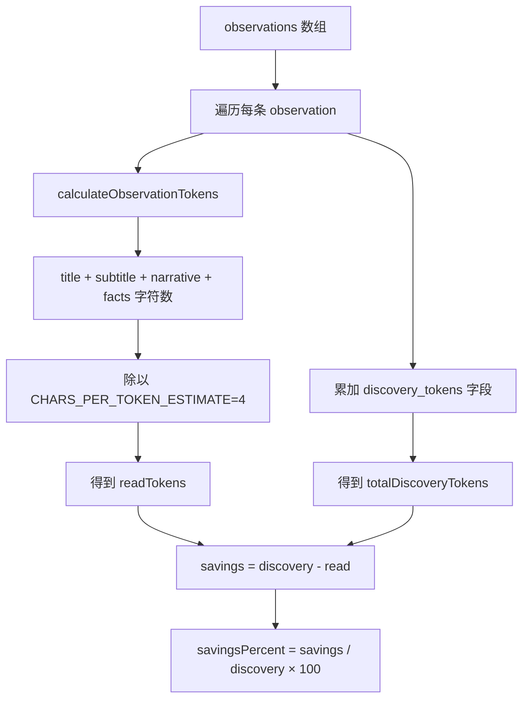
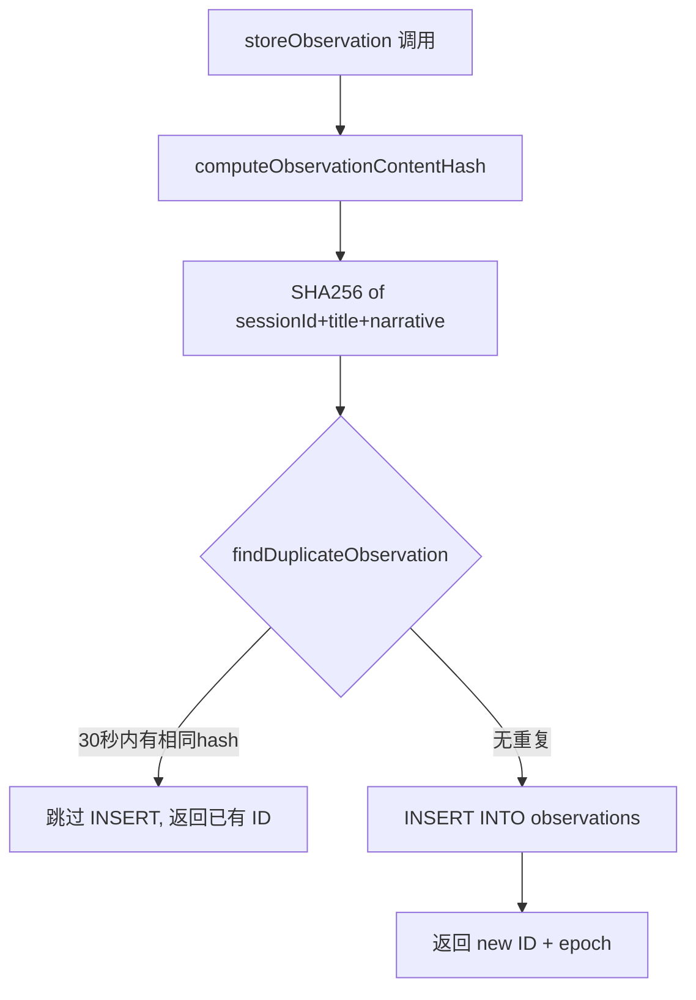
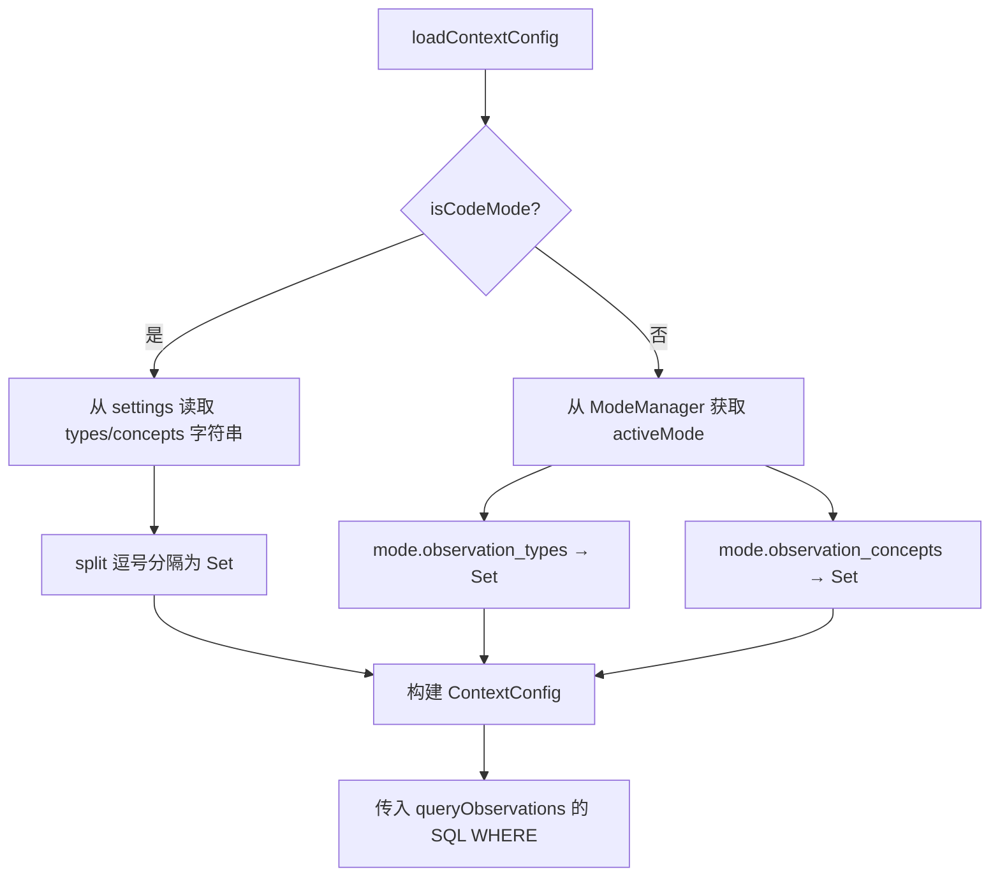

# PD-01.07 claude-mem — 三层检索 Token 经济学与渐进式上下文注入

> 文档编号：PD-01.07
> 来源：claude-mem `src/services/context/`
> GitHub：https://github.com/thedotmack/claude-mem.git
> 问题域：PD-01 上下文管理 Context Window Management
> 状态：可复用方案

---

## 第 1 章 问题与动机

### 1.1 核心问题

Claude Code 等 AI 编程助手在长会话中面临一个根本矛盾：**工具调用产生的原始数据（代码阅读、搜索结果、文件修改）消耗大量 token，但其中真正有价值的知识只占一小部分**。一次 `read_file` 可能消耗 2000 token，但其核心发现只需 200 token 就能表达。如果不做压缩，上下文窗口很快被原始数据填满，导致 LLM 丢失早期重要信息。

claude-mem 将这个问题重新定义为**经济学问题**：每条知识都有"发现成本"（discovery_tokens）和"读取成本"（read_tokens），通过将原始工具输出压缩为结构化 observation，实现 10x 级别的 token 节省。

### 1.2 claude-mem 的解法概述

1. **Observation 抽象层**：每次工具调用的原始输入/输出被 SDK Agent 压缩为结构化 XML observation（type/title/subtitle/facts/narrative/concepts/files），存入 SQLite（`src/services/sqlite/observations/store.ts:51`）
2. **Token 经济学量化**：TokenCalculator 对比 discovery_tokens（原始工具输出大小）与 read_tokens（压缩后 observation 大小），计算节省比例并展示给用户（`src/services/context/TokenCalculator.ts:25`）
3. **三层渐进式检索**：Context Index（标题+类型+文件+token 数）→ get_observations（按 ID 获取完整 observation）→ mem-search（向量搜索历史），逐层加深但逐层更贵（`src/services/context/formatters/MarkdownFormatter.ts:70-79`）
4. **Mode 驱动的类型/概念过滤**：不同工作模式（code/email-investigation 等）自动切换 observation 类型和概念过滤器，只注入当前模式相关的上下文（`src/services/context/ContextConfigLoader.ts:22-41`）
5. **跨会话 transcript 恢复**：从 JSONL transcript 文件反向提取上一会话的 assistant 消息，注入"Previously"段落实现会话连续性（`src/services/context/ObservationCompiler.ts:138-184`）

### 1.3 设计思想

| 设计原则 | 具体实现 | 理由 | 替代方案 |
|----------|----------|------|----------|
| 经济学驱动 | 每条 observation 记录 discovery_tokens，与 read_tokens 对比计算 ROI | 让用户和 Agent 都能量化"记忆的价值" | 仅做 token 计数，不区分发现/读取成本 |
| 渐进式披露 | 三层检索：Index → Full Observation → Vector Search | 大多数情况下标题索引就够用，避免不必要的 token 消耗 | 一次性注入所有历史（浪费 token） |
| 模式感知过滤 | ModeManager 单例管理 observation_types 和 concepts 过滤 | 不同任务类型需要不同维度的上下文 | 固定过滤规则，不区分模式 |
| 内容去重 | SHA256 哈希 + 30 秒滑动窗口防止重复存储 | 工具调用可能重复触发，避免存储冗余 observation | 不去重，依赖后续查询去重 |
| 配置三级优先 | env > settings.json > defaults，SettingsDefaultsManager 统一管理 | 灵活适配不同部署环境 | 硬编码配置 |

---

## 第 2 章 源码实现分析

### 2.1 架构概览

claude-mem 的上下文管理分为三个阶段：**采集**（Hook 拦截工具调用 → SDK Agent 压缩为 observation）、**存储**（SQLite + 去重）、**注入**（ContextBuilder 编排渐进式上下文）。

```
┌─────────────────────────────────────────────────────────────────┐
│                    Claude Code 主会话                            │
│  工具调用 → PostToolUse Hook → Worker API → SDK Agent 压缩      │
└──────────────────────────┬──────────────────────────────────────┘
                           │ observation XML
                           ▼
┌─────────────────────────────────────────────────────────────────┐
│                    SQLite 存储层                                 │
│  observations 表（SHA256 去重）+ session_summaries 表            │
└──────────────────────────┬──────────────────────────────────────┘
                           │ query
                           ▼
┌─────────────────────────────────────────────────────────────────┐
│                    ContextBuilder 注入层                         │
│  ContextConfigLoader → ObservationCompiler → TokenCalculator    │
│  → HeaderRenderer → TimelineRenderer → FooterRenderer           │
│                                                                 │
│  输出: Markdown/ANSI 格式的上下文索引                             │
│  三层检索: Index → get_observations → mem-search                 │
└─────────────────────────────────────────────────────────────────┘
```

### 2.2 核心实现

#### 2.2.1 Token 经济学计算



对应源码 `src/services/context/TokenCalculator.ts:14-48`：

```typescript
export function calculateObservationTokens(obs: Observation): number {
  const obsSize = (obs.title?.length || 0) +
                  (obs.subtitle?.length || 0) +
                  (obs.narrative?.length || 0) +
                  JSON.stringify(obs.facts || []).length;
  return Math.ceil(obsSize / CHARS_PER_TOKEN_ESTIMATE);
}

export function calculateTokenEconomics(observations: Observation[]): TokenEconomics {
  const totalObservations = observations.length;
  const totalReadTokens = observations.reduce((sum, obs) => {
    return sum + calculateObservationTokens(obs);
  }, 0);
  const totalDiscoveryTokens = observations.reduce((sum, obs) => {
    return sum + (obs.discovery_tokens || 0);
  }, 0);
  const savings = totalDiscoveryTokens - totalReadTokens;
  const savingsPercent = totalDiscoveryTokens > 0
    ? Math.round((savings / totalDiscoveryTokens) * 100)
    : 0;
  return { totalObservations, totalReadTokens, totalDiscoveryTokens, savings, savingsPercent };
}
```

#### 2.2.2 Observation 去重与存储



对应源码 `src/services/sqlite/observations/store.ts:19-73`：

```typescript
const DEDUP_WINDOW_MS = 30_000;

export function computeObservationContentHash(
  memorySessionId: string, title: string | null, narrative: string | null
): string {
  return createHash('sha256')
    .update((memorySessionId || '') + (title || '') + (narrative || ''))
    .digest('hex').slice(0, 16);
}

export function findDuplicateObservation(
  db: Database, contentHash: string, timestampEpoch: number
): { id: number; created_at_epoch: number } | null {
  const windowStart = timestampEpoch - DEDUP_WINDOW_MS;
  const stmt = db.prepare(
    'SELECT id, created_at_epoch FROM observations WHERE content_hash = ? AND created_at_epoch > ?'
  );
  return stmt.get(contentHash, windowStart) as { id: number; created_at_epoch: number } | null;
}
```

#### 2.2.3 Mode 驱动的上下文过滤



对应源码 `src/services/context/ContextConfigLoader.ts:17-57`：

```typescript
export function loadContextConfig(): ContextConfig {
  const settingsPath = path.join(homedir(), '.claude-mem', 'settings.json');
  const settings = SettingsDefaultsManager.loadFromFile(settingsPath);
  const modeId = settings.CLAUDE_MEM_MODE;
  const isCodeMode = modeId === 'code' || modeId.startsWith('code--');

  let observationTypes: Set<string>;
  let observationConcepts: Set<string>;

  if (isCodeMode) {
    observationTypes = new Set(
      settings.CLAUDE_MEM_CONTEXT_OBSERVATION_TYPES.split(',').map((t: string) => t.trim()).filter(Boolean)
    );
    observationConcepts = new Set(
      settings.CLAUDE_MEM_CONTEXT_OBSERVATION_CONCEPTS.split(',').map((c: string) => c.trim()).filter(Boolean)
    );
  } else {
    const mode = ModeManager.getInstance().getActiveMode();
    observationTypes = new Set(mode.observation_types.map(t => t.id));
    observationConcepts = new Set(mode.observation_concepts.map(c => c.id));
  }
  // ... 构建完整 ContextConfig
}
```

### 2.3 实现细节

**三层检索的 Prompt 引导**：ContextBuilder 在 Header 中明确告诉 LLM 三层检索策略（`src/services/context/formatters/MarkdownFormatter.ts:70-79`）：

- 第一层：Context Index（标题、类型、文件、token 数）— 通常足够理解过去的工作
- 第二层：`get_observations([IDs])` — 需要实现细节、决策理由时按 ID 获取
- 第三层：`mem-search` — 搜索历史决策、bug、深度研究

**跨会话 transcript 恢复**：ObservationCompiler 从 JSONL transcript 文件中反向扫描，提取最后一条 assistant 消息（过滤掉 `<system-reminder>` 标签），注入为"Previously"段落（`src/services/context/ObservationCompiler.ts:138-184`）。

**Worktree 多项目支持**：queryObservationsMulti 和 querySummariesMulti 支持同时查询多个项目的 observation，用于 git worktree 场景下合并父仓库和工作树的上下文（`src/services/context/ObservationCompiler.ts:75-103`）。

**Timeline 按天分组渲染**：TimelineRenderer 将 observation 和 summary 合并为统一时间线，按天分组、按文件聚合，生成 Markdown 表格或 ANSI 彩色输出（`src/services/context/sections/TimelineRenderer.ts:20-170`）。


---

## 第 3 章 迁移指南

### 3.1 迁移清单

**阶段 1：Observation 抽象层**
- [ ] 定义 Observation 数据结构（type/title/subtitle/facts/narrative/concepts/files_read/files_modified）
- [ ] 实现 LLM 压缩管道：工具调用原始输出 → XML prompt → 解析为结构化 observation
- [ ] 实现 SHA256 内容去重（30 秒滑动窗口）
- [ ] 存储层：SQLite 表 + discovery_tokens 字段

**阶段 2：Token 经济学**
- [ ] 实现 token 估算函数（字符数 / 4 的简单估算）
- [ ] 计算 discovery vs read 的 savings 比例
- [ ] 在上下文 Header 中展示经济学数据

**阶段 3：渐进式检索**
- [ ] 第一层：生成 Context Index（标题+类型+文件的表格）
- [ ] 第二层：实现 get_observations(ids) 按需获取完整内容
- [ ] 第三层：接入向量搜索（Chroma 或其他）
- [ ] 在 system prompt 中引导 LLM 使用三层检索

**阶段 4：Mode 过滤**
- [ ] 定义 Mode 配置文件（JSON 格式，含 observation_types 和 concepts）
- [ ] 实现 ModeManager 单例 + 继承机制（parent--override）
- [ ] 根据当前 mode 过滤 observation 查询

### 3.2 适配代码模板

**Token 经济学计算器（可直接复用）：**

```typescript
// 通用 Token 经济学计算器
interface TokenEconomics {
  totalObservations: number;
  totalReadTokens: number;
  totalDiscoveryTokens: number;
  savings: number;
  savingsPercent: number;
}

interface Observation {
  title: string | null;
  narrative: string | null;
  facts: string | null;
  discovery_tokens: number;
}

const CHARS_PER_TOKEN = 4; // 简单估算，适用于英文为主的内容

function calculateReadTokens(obs: Observation): number {
  const size = (obs.title?.length || 0) +
               (obs.narrative?.length || 0) +
               (obs.facts?.length || 0);
  return Math.ceil(size / CHARS_PER_TOKEN);
}

function calculateEconomics(observations: Observation[]): TokenEconomics {
  const totalReadTokens = observations.reduce((sum, obs) => sum + calculateReadTokens(obs), 0);
  const totalDiscoveryTokens = observations.reduce((sum, obs) => sum + (obs.discovery_tokens || 0), 0);
  const savings = totalDiscoveryTokens - totalReadTokens;
  return {
    totalObservations: observations.length,
    totalReadTokens,
    totalDiscoveryTokens,
    savings,
    savingsPercent: totalDiscoveryTokens > 0 ? Math.round((savings / totalDiscoveryTokens) * 100) : 0,
  };
}
```

**SHA256 去重模板：**

```typescript
import { createHash } from 'crypto';

const DEDUP_WINDOW_MS = 30_000;

function contentHash(sessionId: string, title: string | null, narrative: string | null): string {
  return createHash('sha256')
    .update(`${sessionId || ''}${title || ''}${narrative || ''}`)
    .digest('hex')
    .slice(0, 16);
}

function isDuplicate(db: Database, hash: string, now: number): boolean {
  const windowStart = now - DEDUP_WINDOW_MS;
  const row = db.prepare(
    'SELECT id FROM observations WHERE content_hash = ? AND created_at_epoch > ?'
  ).get(hash, windowStart);
  return row !== null;
}
```

### 3.3 适用场景

| 场景 | 适用度 | 说明 |
|------|--------|------|
| AI 编程助手（长会话） | ⭐⭐⭐ | 核心场景，工具调用频繁，压缩 ROI 最高 |
| 多模式 Agent（代码+调研+邮件） | ⭐⭐⭐ | Mode 过滤机制天然适配 |
| 跨会话记忆系统 | ⭐⭐⭐ | Observation 持久化 + transcript 恢复 |
| 单次短对话 | ⭐ | 无需压缩，overhead 大于收益 |
| 实时流式场景 | ⭐⭐ | 需要适配异步压缩，避免阻塞主流程 |

---

## 第 4 章 测试用例

```typescript
import { describe, it, expect } from 'vitest';
import { calculateObservationTokens, calculateTokenEconomics } from './TokenCalculator';
import { computeObservationContentHash, findDuplicateObservation } from './observations/store';

describe('TokenCalculator', () => {
  it('should estimate tokens from observation fields', () => {
    const obs = {
      id: 1, memory_session_id: 's1', type: 'research',
      title: 'Found auth bug', subtitle: 'in login.ts',
      narrative: 'The login handler does not validate JWT expiry',
      facts: '["JWT expiry not checked","No refresh token logic"]',
      files_read: null, files_modified: null,
      discovery_tokens: 2000, created_at: '', created_at_epoch: 0,
      concepts: null,
    };
    const tokens = calculateObservationTokens(obs);
    // (14 + 11 + 47 + 52) / 4 = 31
    expect(tokens).toBeGreaterThan(20);
    expect(tokens).toBeLessThan(50);
  });

  it('should calculate savings correctly', () => {
    const observations = [
      { id: 1, memory_session_id: 's1', type: 'research',
        title: 'Short title', subtitle: null, narrative: 'Brief note',
        facts: '[]', files_read: null, files_modified: null,
        discovery_tokens: 5000, created_at: '', created_at_epoch: 0, concepts: null },
    ];
    const economics = calculateTokenEconomics(observations);
    expect(economics.totalDiscoveryTokens).toBe(5000);
    expect(economics.totalReadTokens).toBeLessThan(100);
    expect(economics.savingsPercent).toBeGreaterThan(95);
  });

  it('should handle zero discovery tokens', () => {
    const observations = [
      { id: 1, memory_session_id: 's1', type: 'decision',
        title: 'Chose React', subtitle: null, narrative: null,
        facts: '[]', files_read: null, files_modified: null,
        discovery_tokens: 0, created_at: '', created_at_epoch: 0, concepts: null },
    ];
    const economics = calculateTokenEconomics(observations);
    expect(economics.savingsPercent).toBe(0);
  });
});

describe('Observation Deduplication', () => {
  it('should produce consistent content hash', () => {
    const hash1 = computeObservationContentHash('s1', 'title', 'narrative');
    const hash2 = computeObservationContentHash('s1', 'title', 'narrative');
    expect(hash1).toBe(hash2);
    expect(hash1).toHaveLength(16);
  });

  it('should produce different hash for different content', () => {
    const hash1 = computeObservationContentHash('s1', 'title A', 'narrative');
    const hash2 = computeObservationContentHash('s1', 'title B', 'narrative');
    expect(hash1).not.toBe(hash2);
  });

  it('should handle null fields gracefully', () => {
    const hash = computeObservationContentHash('s1', null, null);
    expect(hash).toHaveLength(16);
  });
});
```


---

## 第 5 章 跨域关联

| 关联域 | 关系类型 | 说明 |
|--------|----------|------|
| PD-06 记忆持久化 | 强依赖 | Observation 存储在 SQLite 中，session_summaries 提供跨会话记忆，是上下文注入的数据源 |
| PD-08 搜索与检索 | 协同 | 第三层检索（mem-search）依赖 Chroma 向量数据库，将 observation 嵌入为向量供语义搜索 |
| PD-11 可观测性 | 协同 | Token 经济学数据（savings/savingsPercent）本身就是可观测性指标，展示在 Header 和 Footer 中 |
| PD-04 工具系统 | 上游依赖 | Observation 的原始数据来自工具调用（PostToolUse Hook），工具系统的设计直接影响 observation 质量 |
| PD-10 中间件管道 | 协同 | Hook 系统（SessionStart/PostToolUse/Stop）构成了 observation 采集的中间件管道 |

---

## 第 6 章 来源文件索引

| 文件 | 行范围 | 关键实现 |
|------|--------|----------|
| `src/services/context/TokenCalculator.ts` | L14-L48 | Token 经济学计算：calculateObservationTokens + calculateTokenEconomics |
| `src/services/context/ContextBuilder.ts` | L76-L170 | 上下文编排主入口：buildContextOutput + generateContext |
| `src/services/context/ObservationCompiler.ts` | L25-L263 | 数据查询：queryObservations（类型/概念过滤）、buildTimeline、extractPriorMessages |
| `src/services/context/ContextConfigLoader.ts` | L17-L57 | 配置加载：Mode 感知的 types/concepts 过滤 |
| `src/services/context/types.ts` | L1-L138 | 核心类型定义：Observation、TokenEconomics、ContextConfig、CHARS_PER_TOKEN_ESTIMATE |
| `src/services/sqlite/observations/store.ts` | L19-L104 | Observation 存储 + SHA256 去重（30 秒窗口） |
| `src/services/context/formatters/MarkdownFormatter.ts` | L70-L109 | 三层检索 Prompt 引导 + 经济学展示 |
| `src/services/context/sections/TimelineRenderer.ts` | L20-L170 | Timeline 按天分组 + 按文件聚合渲染 |
| `src/services/domain/ModeManager.ts` | L15-L254 | Mode 单例管理 + 继承机制（parent--override） |
| `src/shared/SettingsDefaultsManager.ts` | L73-L244 | 三级配置优先级：env > settings.json > defaults |
| `src/sdk/prompts.ts` | L29-L86 | SDK Agent 的 observation 压缩 prompt 模板 |
| `src/sdk/parser.ts` | L33-L99 | XML observation 解析器 |
| `src/cli/handlers/observation.ts` | L15-L81 | PostToolUse Hook：拦截工具调用发送到 Worker |
| `src/cli/handlers/context.ts` | L16-L90 | SessionStart Hook：从 Worker 获取上下文注入 |
| `src/services/transcripts/processor.ts` | L29-L371 | Transcript 事件处理器：工具调用 → observation → summary 全流程 |

---

## 第 7 章 横向对比维度

> **重要：** 本章用于自动填充 Butcher Wiki 的横向对比表。

```json comparison_data
{
  "project": "claude-mem",
  "dimensions": {
    "估算方式": "字符数/4 简单估算，CHARS_PER_TOKEN_ESTIMATE=4 常量",
    "压缩策略": "SDK Agent 将工具输出压缩为结构化 XML observation（type/title/facts/narrative）",
    "触发机制": "PostToolUse Hook 事件驱动，每次工具调用自动触发 observation 采集",
    "实现位置": "独立 Worker 进程 + SQLite，与主 Claude Code 会话解耦",
    "容错设计": "Worker 不可用时静默降级返回空上下文，不阻塞主会话",
    "Prompt模板化": "ModeConfig JSON 文件驱动所有 prompt 模板，支持继承（parent--override）",
    "保留策略": "按 totalObservationCount 配置限制查询数量（默认 50），LIMIT SQL 裁剪",
    "文件化注入": "通过 SessionStart Hook 的 additionalContext 注入，或写入 AGENTS.md 文件",
    "知识库外置": "SQLite 持久化 + 可选 Chroma 向量库，跨会话跨清除周期可用",
    "读取拦截优化": "三层渐进检索：Context Index → get_observations → mem-search，避免重复读取原始文件",
    "Observation经济学": "discovery_tokens vs read_tokens 对比，计算并展示 savings 百分比"
  }
}
```

### 域元数据补充

```json domain_metadata
{
  "solution_summary": "claude-mem 通过 SDK Agent 将工具输出压缩为结构化 observation，用 discovery_tokens vs read_tokens 经济学量化压缩 ROI，三层渐进检索（Index→ID查询→向量搜索）实现 10x token 节省",
  "description": "工具输出到结构化知识的压缩经济学，量化每条记忆的发现成本与读取成本",
  "sub_problems": [
    "Mode 继承与深度合并：parent--override 模式配置的递归加载与 deepMerge 策略",
    "Worktree 多项目上下文合并：git worktree 场景下父仓库与工作树 observation 的统一时间线",
    "Timeline 按文件聚合：将散落的 observation 按修改文件分组，减少上下文碎片化"
  ],
  "best_practices": [
    "用经济学指标（savings%）量化压缩效果，让用户和 Agent 都能评估记忆系统的 ROI",
    "三层渐进检索比一次性注入更经济：大多数情况标题索引就够，按需深入",
    "去重窗口要足够短（30秒）：太长会误杀合法的相似 observation，太短则无法去重"
  ]
}
```

