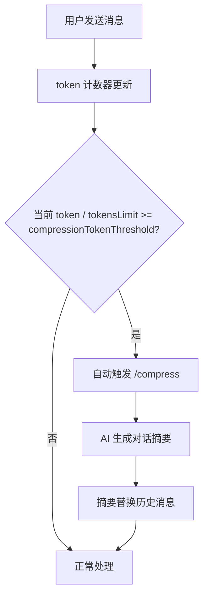
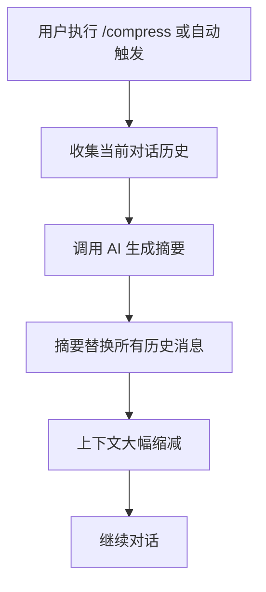
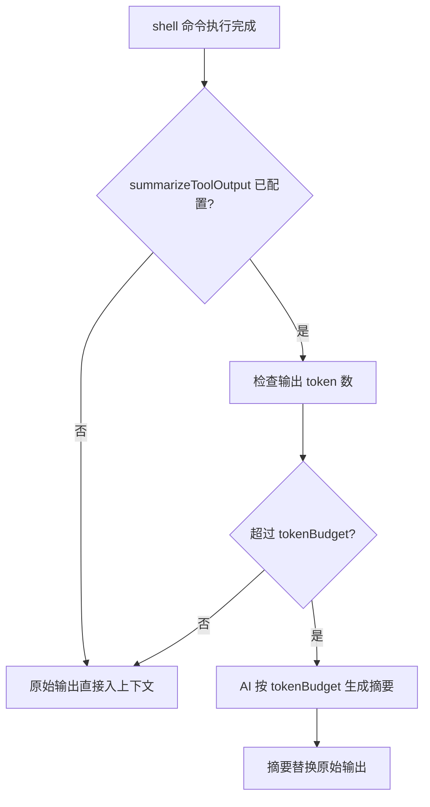
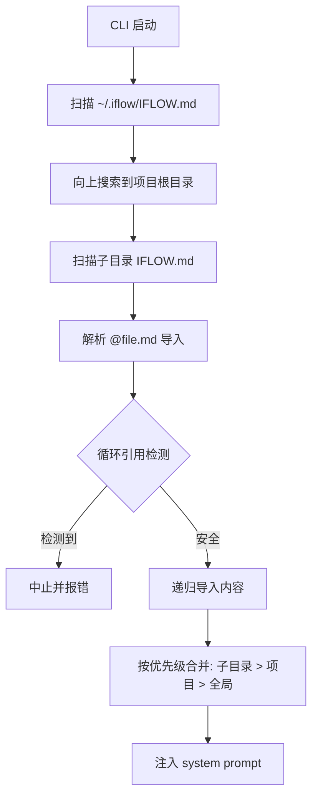

# PD-01.18 iflow-cli — 阈值驱动自动压缩与分层记忆上下文管理

> 文档编号：PD-01.18
> 来源：iflow-cli `docs_en/configuration/settings.md`, `docs_en/features/interactive.md`, `docs_en/configuration/iflow.md`
> GitHub：https://github.com/iflow-ai/iflow-cli.git
> 问题域：PD-01 上下文管理 Context Window Management
> 状态：可复用方案

---

## 第 1 章 问题与动机

### 1.1 核心问题

CLI 类 AI 助手在长对话中面临上下文窗口溢出问题。用户与 AI 的多轮对话、工具调用输出、文件引用内容会持续累积 token，最终超出模型的上下文窗口限制（如 128K tokens），导致：

1. **对话中断**：超出窗口后模型无法继续处理
2. **工具输出膨胀**：shell 命令输出可能产生数万 token 的原始文本
3. **大文本粘贴冲击**：用户粘贴大段代码/日志直接占满上下文
4. **跨会话记忆丢失**：清除上下文后项目知识需要重新建立
5. **多层级配置冲突**：全局偏好、项目规范、模块指令需要有序合并

### 1.2 iflow-cli 的解法概述

iflow-cli 采用**五层防御**策略管理上下文：

1. **阈值自动压缩**：`compressionTokenThreshold`（默认 0.8）在 token 用量达到窗口 80% 时自动触发 `/compress`，将对话历史替换为 AI 生成的摘要（`docs_en/configuration/settings.md:453-458`）
2. **工具输出预算压缩**：`summarizeToolOutput` 按 `tokenBudget` 对 shell 命令输出做摘要，当前支持 `run_shell_command`（`docs_en/configuration/settings.md:417-427`）
3. **大文本智能截断**：>5000 字符的内容显示首尾各 2000 字符，中间折叠；>800 字符的粘贴生成占位符（`docs_en/features/interactive.md:122-133`）
4. **分层记忆系统**：IFLOW.md 按 全局 → 项目 → 子目录 三级加载，支持 `@file.md` 模块化导入（`docs_en/configuration/iflow.md:17-46`）
5. **会话轮次硬限**：`maxSessionTurns` 设置最大对话轮数，超限自动开启新会话（`docs_en/configuration/settings.md:409-415`）

### 1.3 设计思想

| 设计原则 | 具体实现 | 理由 | 替代方案 |
|----------|----------|------|----------|
| 比例阈值触发 | 80% 窗口占用自动压缩 | 预留 20% 给输出和新输入，避免硬编码 token 数 | 固定 token 数阈值（不适配不同模型） |
| 工具输出独立预算 | tokenBudget 按工具类型配置 | shell 输出是最大膨胀源，需独立控制 | 统一截断所有工具输出（丢失关键信息） |
| 显示截断 ≠ 内容截断 | 大文本 UI 折叠但模型收到完整内容 | 用户体验与模型能力解耦 | 真正截断内容（模型丢失信息） |
| 分层覆盖 | 子目录 > 项目 > 全局 | 越具体的指令优先级越高 | 单一配置文件（无法分模块管理） |
| 模块化导入 | @file.md 语法 + 循环检测 | 大型项目需要拆分上下文配置 | 单文件写所有指令（难维护） |

---

## 第 2 章 源码实现分析

### 2.1 架构概览

iflow-cli 是闭源 Node.js CLI 工具（通过 npm 分发），源码不可直接阅读。以下分析基于官方文档中暴露的配置接口、命令行为和架构描述。

```
┌─────────────────────────────────────────────────────────────┐
│                    iflow-cli 上下文管理架构                    │
├─────────────────────────────────────────────────────────────┤
│                                                             │
│  ┌──────────────┐   ┌──────────────┐   ┌───────────────┐   │
│  │ 分层记忆加载  │   │ 输入预处理    │   │ 对话循环      │   │
│  │              │   │              │   │               │   │
│  │ ~/.iflow/    │   │ >800 char    │   │ token 计数    │   │
│  │  IFLOW.md    │──→│  → 占位符    │──→│  ↓            │   │
│  │ ./IFLOW.md   │   │ >5000 char   │   │ >= 80%?      │   │
│  │ ./src/       │   │  → 首尾截断  │   │  → /compress  │   │
│  │  IFLOW.md    │   │ @file.md     │   │               │   │
│  │              │   │  → 递归导入  │   │ >= maxTurns?  │   │
│  └──────────────┘   └──────────────┘   │  → 新会话     │   │
│                                         └───────────────┘   │
│                                               │             │
│                                               ▼             │
│                      ┌──────────────────────────────┐       │
│                      │ 工具输出压缩                   │       │
│                      │ summarizeToolOutput           │       │
│                      │ tokenBudget: 2000             │       │
│                      │ (仅 run_shell_command)        │       │
│                      └──────────────────────────────┘       │
└─────────────────────────────────────────────────────────────┘
```

### 2.2 核心实现

#### 2.2.1 阈值驱动自动压缩



对应配置 `docs_en/configuration/settings.md:444-458`：

```json
{
  "tokensLimit": 128000,
  "compressionTokenThreshold": 0.8
}
```

`tokensLimit` 定义模型上下文窗口长度（默认 128000），`compressionTokenThreshold` 是触发比例（默认 0.8）。当 `当前token数 / tokensLimit >= 0.8` 时，系统自动执行 `/compress` 命令，将整个对话历史替换为 AI 生成的摘要。

README 中明确提到："Auto-compression when context reaches 70%"（`README.md:47`），说明实际产品中可能使用了更激进的 70% 阈值，而配置默认值 0.8 允许用户自定义。

#### 2.2.2 /compress 命令行为



对应文档 `docs_en/features/slash-commands.md:64`：

```
/compress — Content compression: Use AI to compress conversation history into summary
```

`/compress` 既可手动触发也可由阈值自动触发。压缩后对话历史被替换为一条摘要消息，释放大量 token 空间。

#### 2.2.3 工具输出预算压缩



对应配置 `docs_en/configuration/settings.md:417-427`：

```json
{
  "summarizeToolOutput": {
    "run_shell_command": {
      "tokenBudget": 2000
    }
  }
}
```

当前仅支持 `run_shell_command` 工具。当 shell 命令输出超过 `tokenBudget`（如 2000 tokens）时，系统调用 AI 将输出压缩为不超过预算的摘要。这是一种**工具级粒度**的压缩策略，避免单次 `npm install` 或 `git log` 输出吞噬大量上下文。

#### 2.2.4 大文本智能截断

对应文档 `docs_en/features/interactive.md:118-133`：

```
检测规则：
- 长文本粘贴 >800 字符 → 生成文本占位符 [Pasted text #X +Y lines]
- 长内容显示 >5000 字符 → 截断显示优化

界面优化：
- 显示前 2000 个字符和最后 2000 个字符，中间内容折叠
- 占位符明确标识文本块的行数
- 模型仍能获得完整的原始文本
```

关键设计：**显示层截断，模型层完整**。用户在终端看到的是折叠后的内容，但 AI 模型收到的是完整原始文本。这是纯 UI 优化，不影响模型理解能力。

#### 2.2.5 分层记忆系统



对应文档 `docs_en/configuration/iflow.md:17-46`：

```
加载优先级（从低到高）：
1. 全局级: ~/.iflow/IFLOW.md — 个人偏好，适用所有项目
2. 项目级: /path/to/project/IFLOW.md — 项目架构、团队规范
3. 子目录级: /path/to/project/src/IFLOW.md — 模块特定指令

安全机制：
- 循环导入检测：维护导入路径栈，检测循环引用
- 深度限制：最大 5 层嵌套
- 路径验证：只允许授权目录
- 错误恢复：导入失败不中断整体流程
```

`contextFileName` 支持自定义（`docs_en/configuration/settings.md:249-252`）：

```json
{
  "contextFileName": ["IFLOW.md", "AGENTS.md", "CONTEXT.md"]
}
```

### 2.3 实现细节

**配置层级系统**（`docs_en/configuration/settings.md:12-19`）：

iflow-cli 的配置优先级从低到高为：
1. 应用默认值
2. 用户全局设置 `~/.iflow/settings.json`
3. 项目设置 `.iflow/settings.json`
4. 系统级设置 `/etc/iflow-cli/settings.json`
5. 环境变量 `IFLOW_*`
6. 命令行参数（最高优先级）

所有上下文管理参数（`tokensLimit`、`compressionTokenThreshold`、`summarizeToolOutput`、`maxSessionTurns`）都遵循这个层级，意味着可以在项目级别覆盖全局默认值。

**环境变量支持**（`docs_en/configuration/settings.md:22-48`）：

所有配置项支持 `IFLOW_` 前缀环境变量，如 `IFLOW_tokensLimit=100000`，方便 CI/CD 场景动态调整上下文参数。

**会话轮次限制**（`docs_en/configuration/settings.md:409-415`）：

```json
{
  "maxSessionTurns": 10
}
```

默认 `-1`（无限制）。超过限制后 CLI 停止处理并开启新会话，作为上下文管理的最后一道防线。


---

## 第 3 章 迁移指南

### 3.1 迁移清单

将 iflow-cli 的上下文管理方案迁移到自己的 CLI Agent 项目，分三个阶段：

**阶段 1：基础压缩（1-2 天）**
- [ ] 实现 token 计数器（每次 LLM 调用前更新）
- [ ] 实现比例阈值触发器（`currentTokens / maxTokens >= threshold`）
- [ ] 实现 `/compress` 命令：调用 LLM 生成对话摘要并替换历史
- [ ] 添加 `tokensLimit` 和 `compressionTokenThreshold` 配置项

**阶段 2：工具输出压缩（1 天）**
- [ ] 为工具输出添加 token 预算配置（`summarizeToolOutput`）
- [ ] 实现工具输出摘要：超预算时调用 LLM 压缩
- [ ] 支持按工具类型配置不同预算

**阶段 3：分层记忆（1-2 天）**
- [ ] 实现多级配置文件扫描（全局 → 项目 → 子目录）
- [ ] 实现 `@file.md` 导入语法 + 循环检测
- [ ] 实现配置优先级合并逻辑

### 3.2 适配代码模板

#### 阈值驱动自动压缩

```python
"""
iflow-cli 风格的阈值驱动自动压缩实现。
可直接集成到任何基于 LLM 的 CLI Agent 中。
"""
from dataclasses import dataclass, field
from typing import Optional
import tiktoken


@dataclass
class ContextConfig:
    tokens_limit: int = 128000
    compression_threshold: float = 0.8  # 80% 触发压缩
    max_session_turns: int = -1  # -1 = 无限制
    tool_output_budgets: dict = field(default_factory=lambda: {
        "run_shell_command": 2000,
    })


class ContextManager:
    """iflow-cli 风格的上下文管理器"""

    def __init__(self, config: ContextConfig, llm_client):
        self.config = config
        self.llm = llm_client
        self.messages: list[dict] = []
        self.turn_count: int = 0
        self.encoder = tiktoken.encoding_for_model("gpt-4")

    def count_tokens(self, messages: list[dict]) -> int:
        """估算消息列表的 token 数"""
        total = 0
        for msg in messages:
            total += len(self.encoder.encode(msg.get("content", "")))
            total += 4  # 消息格式开销
        return total

    def should_compress(self) -> bool:
        """检查是否需要触发自动压缩"""
        current = self.count_tokens(self.messages)
        threshold = self.config.tokens_limit * self.config.compression_threshold
        return current >= threshold

    def should_end_session(self) -> bool:
        """检查是否超过会话轮次限制"""
        if self.config.max_session_turns == -1:
            return False
        return self.turn_count >= self.config.max_session_turns

    async def compress(self) -> str:
        """将对话历史压缩为摘要"""
        history_text = "\n".join(
            f"{m['role']}: {m['content']}" for m in self.messages
        )
        summary = await self.llm.chat([
            {"role": "system", "content": "Compress the following conversation into a concise summary, preserving key decisions, code changes, and context."},
            {"role": "user", "content": history_text},
        ])
        # 替换历史为摘要
        self.messages = [
            {"role": "assistant", "content": f"[Compressed Summary]\n{summary}"}
        ]
        return summary

    async def process_tool_output(self, tool_name: str, output: str) -> str:
        """按预算压缩工具输出"""
        budget = self.config.tool_output_budgets.get(tool_name)
        if budget is None:
            return output
        token_count = len(self.encoder.encode(output))
        if token_count <= budget:
            return output
        # 超预算，调用 LLM 压缩
        summary = await self.llm.chat([
            {"role": "system", "content": f"Summarize the following tool output in at most {budget} tokens. Preserve errors, key results, and actionable information."},
            {"role": "user", "content": output},
        ])
        return f"[Summarized output, original {token_count} tokens]\n{summary}"

    async def add_message(self, role: str, content: str):
        """添加消息并检查是否需要压缩"""
        self.messages.append({"role": role, "content": content})
        if role == "user":
            self.turn_count += 1
        if self.should_compress():
            await self.compress()
```

#### 分层记忆加载

```python
"""
iflow-cli 风格的分层 IFLOW.md 记忆加载器。
支持 @file.md 导入语法和循环检测。
"""
import os
import re
from pathlib import Path


class MemoryLoader:
    """分层记忆文件加载器"""

    MAX_IMPORT_DEPTH = 5
    IMPORT_PATTERN = re.compile(r'^@(.+\.md)\s*$', re.MULTILINE)

    def __init__(self, context_filenames: list[str] = None):
        self.context_filenames = context_filenames or ["IFLOW.md"]

    def load_all(self, working_dir: str) -> str:
        """加载所有层级的记忆文件并合并"""
        layers = []

        # 1. 全局级
        global_dir = Path.home() / ".iflow"
        for fname in self.context_filenames:
            gpath = global_dir / fname
            if gpath.exists():
                content = self._load_with_imports(gpath, set(), 0)
                layers.append(f"# [Global] {fname}\n{content}")

        # 2. 项目级（从 cwd 向上搜索到 .git 或 home）
        cwd = Path(working_dir).resolve()
        for parent in [cwd, *cwd.parents]:
            for fname in self.context_filenames:
                fpath = parent / fname
                if fpath.exists() and fpath != (global_dir / fname):
                    content = self._load_with_imports(fpath, set(), 0)
                    layers.append(f"# [Project: {parent}] {fname}\n{content}")
            if (parent / ".git").exists() or parent == Path.home():
                break

        # 3. 子目录级（扫描 cwd 下的子目录，限制 200 个）
        scanned = 0
        for root, dirs, files in os.walk(working_dir):
            dirs[:] = [d for d in dirs if d not in {
                "node_modules", ".git", "dist", "__pycache__", ".venv"
            }]
            for fname in self.context_filenames:
                fpath = Path(root) / fname
                if fpath.exists() and Path(root) != cwd:
                    content = self._load_with_imports(fpath, set(), 0)
                    layers.append(f"# [Subdir: {root}] {fname}\n{content}")
            scanned += 1
            if scanned >= 200:
                break

        return "\n\n---\n\n".join(layers)

    def _load_with_imports(
        self, filepath: Path, visited: set, depth: int
    ) -> str:
        """递归加载文件，处理 @import 语法"""
        if depth > self.MAX_IMPORT_DEPTH:
            return f"<!-- Import depth exceeded at {filepath} -->"
        abs_path = filepath.resolve()
        if abs_path in visited:
            return f"<!-- Circular import detected: {filepath} -->"
        visited.add(abs_path)

        try:
            content = filepath.read_text(encoding="utf-8")
        except (OSError, UnicodeDecodeError):
            return f"<!-- Failed to read: {filepath} -->"

        def replace_import(match):
            import_path = match.group(1).strip()
            resolved = (filepath.parent / import_path).resolve()
            return self._load_with_imports(resolved, visited.copy(), depth + 1)

        return self.IMPORT_PATTERN.sub(replace_import, content)
```

### 3.3 适用场景

| 场景 | 适用度 | 说明 |
|------|--------|------|
| CLI Agent（长对话） | ⭐⭐⭐ | 核心场景，阈值压缩 + 工具输出预算直接适用 |
| IDE 插件 Agent | ⭐⭐⭐ | 分层记忆系统特别适合多项目切换 |
| CI/CD Agent | ⭐⭐ | 工具输出压缩有用，但通常单轮对话不需要历史压缩 |
| 多 Agent 编排 | ⭐⭐ | 分层记忆可复用，但需要额外的 Agent 间上下文隔离 |
| 纯 API 服务 | ⭐ | 无状态服务不需要会话级压缩 |

---

## 第 4 章 测试用例

```python
"""
基于 iflow-cli 上下文管理方案的测试用例。
测试阈值压缩、工具输出预算、分层记忆加载。
"""
import pytest
import tempfile
import os
from pathlib import Path
from unittest.mock import AsyncMock, MagicMock


class TestContextManager:
    """测试阈值驱动自动压缩"""

    def setup_method(self):
        self.config = ContextConfig(
            tokens_limit=1000,
            compression_threshold=0.8,
            max_session_turns=5,
            tool_output_budgets={"run_shell_command": 100},
        )
        self.llm = AsyncMock()
        self.llm.chat.return_value = "Compressed summary of conversation"
        self.manager = ContextManager(self.config, self.llm)

    def test_should_compress_below_threshold(self):
        """低于阈值不触发压缩"""
        self.manager.messages = [{"role": "user", "content": "hello"}]
        assert not self.manager.should_compress()

    def test_should_compress_above_threshold(self):
        """超过 80% 阈值触发压缩"""
        # 填充消息直到超过 800 tokens (80% of 1000)
        long_msg = "x " * 500  # ~500 tokens
        self.manager.messages = [
            {"role": "user", "content": long_msg},
            {"role": "assistant", "content": long_msg},
        ]
        assert self.manager.should_compress()

    @pytest.mark.asyncio
    async def test_compress_replaces_history(self):
        """压缩后历史被替换为摘要"""
        self.manager.messages = [
            {"role": "user", "content": "msg1"},
            {"role": "assistant", "content": "msg2"},
            {"role": "user", "content": "msg3"},
        ]
        await self.manager.compress()
        assert len(self.manager.messages) == 1
        assert "[Compressed Summary]" in self.manager.messages[0]["content"]

    def test_session_turn_limit(self):
        """会话轮次限制"""
        self.manager.turn_count = 5
        assert self.manager.should_end_session()

    def test_session_unlimited(self):
        """-1 表示无限制"""
        self.config.max_session_turns = -1
        self.manager.turn_count = 9999
        assert not self.manager.should_end_session()

    @pytest.mark.asyncio
    async def test_tool_output_within_budget(self):
        """工具输出在预算内不压缩"""
        result = await self.manager.process_tool_output(
            "run_shell_command", "ok"
        )
        assert result == "ok"
        self.llm.chat.assert_not_called()

    @pytest.mark.asyncio
    async def test_tool_output_exceeds_budget(self):
        """工具输出超预算触发压缩"""
        long_output = "line\n" * 200  # 远超 100 tokens
        result = await self.manager.process_tool_output(
            "run_shell_command", long_output
        )
        assert "[Summarized output" in result
        self.llm.chat.assert_called_once()


class TestMemoryLoader:
    """测试分层记忆加载"""

    def test_basic_file_loading(self, tmp_path):
        """基本文件加载"""
        (tmp_path / "IFLOW.md").write_text("# Project Context\nHello")
        loader = MemoryLoader()
        result = loader.load_all(str(tmp_path))
        assert "Hello" in result

    def test_import_syntax(self, tmp_path):
        """@file.md 导入语法"""
        (tmp_path / "IFLOW.md").write_text("Main\n@./sub.md\nEnd")
        (tmp_path / "sub.md").write_text("Imported content")
        loader = MemoryLoader()
        result = loader.load_all(str(tmp_path))
        assert "Imported content" in result
        assert "Main" in result

    def test_circular_import_detection(self, tmp_path):
        """循环导入检测"""
        (tmp_path / "a.md").write_text("@./b.md")
        (tmp_path / "b.md").write_text("@./a.md")
        (tmp_path / "IFLOW.md").write_text("@./a.md")
        loader = MemoryLoader()
        result = loader.load_all(str(tmp_path))
        assert "Circular import detected" in result

    def test_max_depth_limit(self, tmp_path):
        """最大导入深度限制（5 层）"""
        for i in range(7):
            name = f"level{i}.md"
            next_name = f"level{i+1}.md"
            (tmp_path / name).write_text(f"Level {i}\n@./{next_name}")
        (tmp_path / "level7.md").write_text("Bottom")
        (tmp_path / "IFLOW.md").write_text("@./level0.md")
        loader = MemoryLoader()
        result = loader.load_all(str(tmp_path))
        assert "Import depth exceeded" in result

    def test_custom_context_filenames(self, tmp_path):
        """自定义上下文文件名"""
        (tmp_path / "AGENTS.md").write_text("Agent instructions")
        loader = MemoryLoader(context_filenames=["AGENTS.md"])
        result = loader.load_all(str(tmp_path))
        assert "Agent instructions" in result

    def test_missing_file_graceful(self, tmp_path):
        """缺失文件优雅处理"""
        (tmp_path / "IFLOW.md").write_text("@./nonexistent.md")
        loader = MemoryLoader()
        result = loader.load_all(str(tmp_path))
        assert "Failed to read" in result
```


---

## 第 5 章 跨域关联

| 关联域 | 关系类型 | 说明 |
|--------|----------|------|
| PD-02 多 Agent 编排 | 协同 | iflow-cli 的 SubAgent 系统（`$agent-type` 调用）需要独立上下文，分层记忆的子目录级配置可为不同 Agent 提供差异化指令 |
| PD-03 容错与重试 | 依赖 | 压缩操作本身是 LLM 调用，可能失败；需要容错机制保证压缩失败时不丢失原始历史 |
| PD-04 工具系统 | 协同 | `summarizeToolOutput` 直接作用于工具输出，工具系统的输出格式影响压缩效果 |
| PD-06 记忆持久化 | 依赖 | IFLOW.md 分层记忆系统是持久化记忆的载体；`/memory add` 命令将信息写入持久化文件 |
| PD-07 质量检查 | 协同 | 压缩摘要的质量直接影响后续对话准确性，需要验证摘要是否保留了关键信息 |
| PD-09 Human-in-the-Loop | 协同 | `/compress` 可手动触发，用户可主动控制压缩时机；`/memory show` 允许用户审查当前上下文 |
| PD-10 中间件管道 | 协同 | 输入预处理（大文本截断、占位符生成）可视为输入中间件；工具输出压缩可视为输出中间件 |
| PD-11 可观测性 | 协同 | `/stats` 命令显示会话统计，包含 token 使用情况，为压缩决策提供数据支撑 |

---

## 第 6 章 来源文件索引

| 文件 | 行范围 | 关键实现 |
|------|--------|----------|
| `docs_en/configuration/settings.md` | L444-L458 | `tokensLimit` 和 `compressionTokenThreshold` 配置定义 |
| `docs_en/configuration/settings.md` | L417-L427 | `summarizeToolOutput` 工具输出预算压缩配置 |
| `docs_en/configuration/settings.md` | L409-L415 | `maxSessionTurns` 会话轮次限制 |
| `docs_en/configuration/settings.md` | L249-L252 | `contextFileName` 自定义上下文文件名 |
| `docs_en/configuration/settings.md` | L12-L19 | 配置层级优先级系统 |
| `docs_en/features/interactive.md` | L118-L133 | 大文本智能截断规则（>800 占位符，>5000 首尾截断） |
| `docs_en/configuration/iflow.md` | L17-L46 | 分层记忆加载机制（全局/项目/子目录） |
| `docs_en/configuration/iflow.md` | L133-L194 | @file.md 模块化导入语法和安全机制 |
| `docs_en/features/slash-commands.md` | L60-L67 | `/compress`、`/memory`、`/clear` 命令定义 |
| `docs_en/features/memory-import.md` | L39-L43 | 循环导入检测和安全限制 |
| `README.md` | L47 | "Auto-compression when context reaches 70%" 产品描述 |

---

## 第 7 章 横向对比维度

> **重要：** 本章用于自动填充 Butcher Wiki 的横向对比表。
> 必须严格按以下 JSON 格式输出，放在 `comparison_data` 代码块中。

```json comparison_data
{
  "project": "iflow-cli",
  "dimensions": {
    "估算方式": "比例阈值（currentTokens/tokensLimit），默认 128K 窗口",
    "压缩策略": "/compress 全量摘要替换，AI 生成对话摘要",
    "触发机制": "compressionTokenThreshold 比例阈值（默认 0.8）自动触发",
    "实现位置": "CLI 内置，闭源 Node.js 实现",
    "容错设计": "maxSessionTurns 硬限兜底，超限开启新会话",
    "工具输出压缩": "summarizeToolOutput 按 tokenBudget 独立压缩 shell 输出",
    "保留策略": "大文本 UI 层首尾各 2000 字符截断，模型层保留完整",
    "文件化注入": "IFLOW.md 三级分层加载 + @file.md 模块化导入",
    "Prompt模板化": "contextFileName 支持多文件名配置，环境变量引用",
    "供应商适配": "OpenAI 兼容协议，支持多模型切换"
  }
}
```

### 域元数据补充

```json domain_metadata
{
  "solution_summary": "iflow-cli 用 compressionTokenThreshold 比例阈值自动触发 /compress 全量摘要，summarizeToolOutput 按 tokenBudget 独立压缩 shell 输出，IFLOW.md 三级分层记忆注入",
  "description": "CLI Agent 场景下配置驱动的多层上下文防御体系",
  "sub_problems": [
    "显示层截断与模型层完整的解耦：UI 折叠大文本但模型收到完整内容的双轨处理",
    "上下文文件名多态配置：支持单文件名或文件名数组，适配不同项目约定",
    "子目录记忆扫描限流：限制子目录扫描数量（默认 200）防止大型 monorepo 启动卡顿"
  ],
  "best_practices": [
    "比例阈值优于固定值：用占比而非绝对 token 数触发压缩，自动适配不同模型窗口大小",
    "工具输出独立预算：shell 等高膨胀工具应有独立的 tokenBudget，不与对话压缩混为一谈"
  ]
}
```

