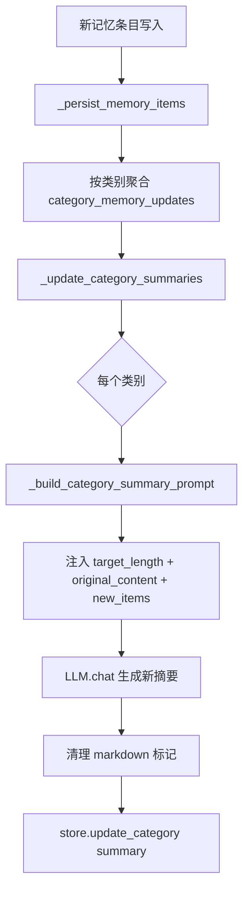
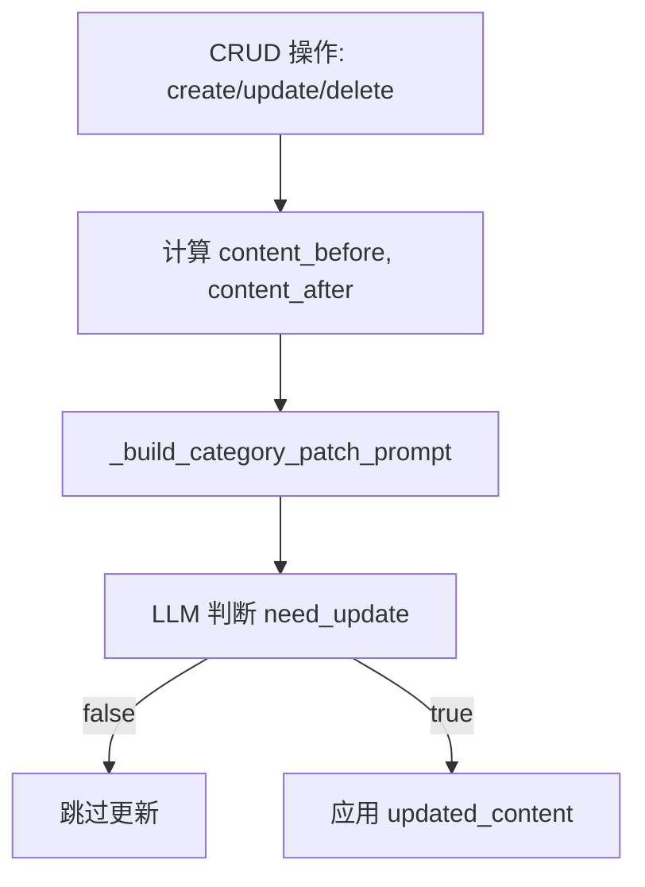

# PD-01.42 memU — Category Summary 增量摘要与三层充分性检索

> 文档编号：PD-01.42
> 来源：memU `src/memu/app/memorize.py`, `src/memu/app/retrieve.py`, `src/memu/app/crud.py`
> GitHub：https://github.com/NevaMind-AI/memU.git
> 问题域：PD-01 上下文管理 Context Window Management
> 状态：可复用方案

---

## 第 1 章 问题与动机（≥ 30 行）

### 1.1 核心问题

长期记忆系统面临一个根本矛盾：用户的记忆条目会随时间无限增长，但每次 LLM 调用的上下文窗口是有限的。如果每次检索都把所有原始记忆条目塞进 prompt，token 成本会爆炸，且大量无关信息会稀释 LLM 的注意力。

传统做法是全量重写摘要——每次有新记忆写入时，把所有条目和旧摘要一起发给 LLM 重新生成。这在记忆量大时成本极高，且容易丢失细节。

### 1.2 memU 的解法概述

memU 通过 **Category Summary** 机制解决这个问题，核心思路是"按类别维护受控长度的摘要"：

1. **分类摘要架构**：每个记忆类别（personal_info、preferences 等）独立维护一份 summary，而非全局单一摘要。类别定义在 `CategoryConfig` 中，每个类别可配置独立的 `target_length`（`src/memu/app/settings.py:67-71`）

2. **增量更新而非全量重写**：新记忆写入时，只把新增条目和当前摘要发给 LLM 做增量合并，而非重新处理所有历史条目。通过 `_update_category_summaries` 实现（`src/memu/app/memorize.py:1100-1139`）

3. **CRUD 级别的 Patch 机制**：单条记忆的增删改通过轻量级 patch prompt 处理，LLM 先判断 `need_update` 再决定是否更新摘要，避免不必要的 LLM 调用（`src/memu/app/crud.py:638-713`）

4. **三层充分性检索**：检索时按 Category → Item → Resource 三层递进，每层之后用 LLM 做 sufficiency check，如果当前层已足够回答查询就提前终止，避免过度检索浪费 token（`src/memu/app/retrieve.py:106-210`）

5. **target_length 预算控制**：每个类别的摘要长度受 `target_length` 约束（默认 400 token），prompt 中明确告知 LLM 不得超限，必要时合并或省略不重要信息（`src/memu/prompts/category_summary/category.py:215`）

### 1.3 设计思想

| 设计原则 | 具体实现 | 理由 | 替代方案 |
|----------|----------|------|----------|
| 分类隔离 | 每个 category 独立 summary | 避免不同主题信息互相干扰，支持差异化 target_length | 全局单一摘要 |
| 增量优先 | 新记忆只与当前摘要合并 | 避免全量重写的 O(n) 成本 | 每次全量重建 |
| 按需检索 | sufficiency check 提前终止 | 简单查询只需 category 摘要即可，无需深入 item 层 | 固定检索所有层 |
| Patch 决策 | LLM 判断 need_update | 单条记忆变更可能不影响摘要，跳过无效更新 | 每次变更都重写 |
| 预算硬约束 | prompt 中注入 target_length | 防止摘要无限膨胀 | 后处理截断 |

---

## 第 2 章 源码实现分析（≥ 60 行，核心章节）

### 2.1 架构概览

memU 的上下文管理分为两条路径：**写入路径**（memorize/CRUD → 更新摘要）和**读取路径**（retrieve → 充分性检索）。

```
┌─────────────────────────────────────────────────────────────┐
│                     memU Context Management                  │
├──────────────────────┬──────────────────────────────────────┤
│   写入路径 (Write)    │         读取路径 (Read)               │
│                      │                                      │
│  memorize()          │  retrieve()                          │
│    ↓                 │    ↓                                 │
│  _persist_memory_    │  route_intention                     │
│   items()            │    ↓                                 │
│    ↓                 │  Tier 1: Category (cosine/LLM rank)  │
│  _update_category_   │    ↓ sufficiency_check               │
│   summaries()        │  Tier 2: Item (vector search)        │
│    ↓                 │    ↓ sufficiency_check               │
│  LLM: merge new +   │  Tier 3: Resource (cosine topk)      │
│   old → summary      │    ↓                                 │
│   (target_length)    │  build_context → response            │
│                      │                                      │
│  CRUD patch:         │                                      │
│  _patch_category_    │                                      │
│   summaries()        │                                      │
│    ↓                 │                                      │
│  LLM: need_update?   │                                      │
│  → patch summary     │                                      │
└──────────────────────┴──────────────────────────────────────┘
```

### 2.2 核心实现

#### 2.2.1 Category Summary 增量更新



对应源码 `src/memu/app/memorize.py:1100-1139`：

```python
async def _update_category_summaries(
    self,
    updates: dict[str, list[tuple[str, str]]] | dict[str, list[str]],
    ctx: Context,
    store: Database,
    llm_client: Any | None = None,
) -> dict[str, str]:
    updated_summaries: dict[str, str] = {}
    if not updates:
        return updated_summaries
    tasks = []
    target_ids: list[str] = []
    client = llm_client or self._get_llm_client()
    for cid, memories in updates.items():
        cat = store.memory_category_repo.categories.get(cid)
        if not cat or not memories:
            continue
        prompt = self._build_category_summary_prompt(category=cat, new_memories=memories)
        tasks.append(client.chat(prompt))
        target_ids.append(cid)
    if not tasks:
        return updated_summaries
    summaries = await asyncio.gather(*tasks)  # 并行更新所有受影响类别
    for cid, summary in zip(target_ids, summaries, strict=True):
        cleaned_summary = summary.replace("```markdown", "").replace("```", "").strip()
        store.memory_category_repo.update_category(
            category_id=cid,
            summary=cleaned_summary,
        )
        updated_summaries[cid] = cleaned_summary
    return updated_summaries
```

关键点：`asyncio.gather(*tasks)` 并行更新所有受影响的类别摘要，而非串行处理。

#### 2.2.2 target_length 预算注入

```mermaid
graph TD
    A[_build_category_summary_prompt] --> B{category_config.target_length?}
    B -->|有| C[使用 per-category target_length]
    B -->|无| D[使用 default_category_summary_target_length=400]
    C --> E[注入 prompt: target_length={value}]
    D --> E
    E --> F[prompt 硬约束: 不得超过 target_length tokens]
```

对应源码 `src/memu/app/memorize.py:1090-1098`：

```python
target_length = (
    category_config and category_config.target_length
) or self.memorize_config.default_category_summary_target_length
return prompt.format(
    category=self._escape_prompt_value(category.name),
    original_content=self._escape_prompt_value(original or ""),
    new_memory_items_text=self._escape_prompt_value(new_items_text or "No new memory items."),
    target_length=target_length,
)
```

prompt 模板中的硬约束（`src/memu/prompts/category_summary/category.py:214-216`）：

```python
PROMPT_BLOCK_OUTPUT = """
# Critical
Always ensure that your output does not exceed {target_length} tokens.
You may merge or omit unimportant information to meet this limit.
"""
```

### 2.3 实现细节

#### CRUD Patch 增量更新

当通过 API 单独创建/更新/删除一条记忆时，不走全量摘要更新，而是用轻量级 patch prompt。



对应源码 `src/memu/app/crud.py:672-698`：

```python
def _build_category_patch_prompt(
    self, *, category: MemoryCategory, content_before: str | None, content_after: str | None
) -> str:
    if content_before and content_after:
        update_content = "\n".join([
            "The memory content before:", content_before,
            "The memory content after:", content_after,
        ])
    elif content_before:
        update_content = "\n".join(["This memory content is discarded:", content_before])
    elif content_after:
        update_content = "\n".join(["This memory content is newly added:", content_after])
    return prompt.format(
        category=self._escape_prompt_value(category.name),
        original_content=self._escape_prompt_value(original_content or ""),
        update_content=self._escape_prompt_value(update_content or ""),
    )
```

patch 响应解析（`src/memu/app/crud.py:700-713`）：LLM 返回 JSON `{"need_update": bool, "updated_content": str}`，只有 `need_update=true` 时才写入。

#### 三层充分性检索

检索 workflow 定义在 `src/memu/app/retrieve.py:106-210`，核心是每层检索后插入 sufficiency check：

```python
# Tier 1 后的充分性检查 (retrieve.py:288-322)
async def _rag_category_sufficiency(self, state, step_context):
    retrieved_content = self._format_category_content(hits, summary_lookup, store)
    needs_more, rewritten_query = await self._decide_if_retrieval_needed(
        state["active_query"], state["context_queries"],
        retrieved_content=retrieved_content or "No content retrieved yet.",
    )
    state["proceed_to_items"] = needs_more  # 控制是否进入下一层
```

`_decide_if_retrieval_needed`（`retrieve.py:746-784`）使用 pre_retrieval_decision prompt，LLM 输出 `<decision>RETRIEVE/NO_RETRIEVE</decision>` 和 `<rewritten_query>` 标签。


---

## 第 3 章 迁移指南（≥ 40 行）

### 3.1 迁移清单

**阶段 1：数据模型**
- [ ] 定义 `MemoryCategory` 模型，包含 `name`, `description`, `summary`, `embedding` 字段
- [ ] 定义 `MemoryItem` 模型，包含 `memory_type`, `summary`, `embedding`, `extra` 字段
- [ ] 定义 `CategoryItem` 关联表，建立 item ↔ category 多对多关系
- [ ] 实现 `CategoryConfig`，支持 per-category `target_length` 和 `summary_prompt` 覆盖

**阶段 2：摘要更新管线**
- [ ] 实现 category summary prompt 模板，包含 `{target_length}`, `{category}`, `{original_content}`, `{new_memory_items_text}` 占位符
- [ ] 实现 `_build_category_summary_prompt`：解析 per-category 配置 → fallback 到全局默认
- [ ] 实现 `_update_category_summaries`：asyncio.gather 并行更新所有受影响类别
- [ ] 实现 CRUD patch prompt（before/after 差异 → need_update 判断）

**阶段 3：检索管线**
- [ ] 实现 pre-retrieval decision（RETRIEVE/NO_RETRIEVE 路由）
- [ ] 实现三层检索 workflow：Category → sufficiency → Item → sufficiency → Resource
- [ ] 实现 `_decide_if_retrieval_needed`：解析 `<decision>` 和 `<rewritten_query>` 标签

### 3.2 适配代码模板

以下是一个可直接复用的 Category Summary 更新器：

```python
import asyncio
from dataclasses import dataclass, field

CATEGORY_SUMMARY_PROMPT = """
# Task
Merge new memory items into the existing category summary.

# Rules
- Add new information, update conflicting entries with newer data
- Remove one-off events without long-term value
- Output must not exceed {target_length} tokens
- Use Markdown hierarchy: # Category > ## Subcategory > - Item

# Input
Category: {category}
Current summary:
<content>{original_content}</content>

New items:
<item>{new_memory_items_text}</item>

# Output
Updated summary in Markdown (no explanations, no meta text):
"""

PATCH_PROMPT = """
# Task
Determine if the category summary needs updating based on a single memory change.

# Input
Category: {category}
Current summary: <content>{original_content}</content>
Change: {update_content}

# Output (JSON)
{{"need_update": true/false, "updated_content": "..." or "empty"}}
"""


@dataclass
class CategoryConfig:
    name: str
    description: str = ""
    target_length: int | None = None  # Per-category override


@dataclass
class CategorySummaryManager:
    default_target_length: int = 400
    category_configs: dict[str, CategoryConfig] = field(default_factory=dict)

    def build_summary_prompt(
        self, category_name: str, current_summary: str, new_items: list[str]
    ) -> str:
        config = self.category_configs.get(category_name)
        target = (config and config.target_length) or self.default_target_length
        items_text = "\n".join(f"- {item}" for item in new_items)
        return CATEGORY_SUMMARY_PROMPT.format(
            category=category_name,
            original_content=current_summary or "",
            new_memory_items_text=items_text or "No new items.",
            target_length=target,
        )

    def build_patch_prompt(
        self, category_name: str, current_summary: str,
        content_before: str | None, content_after: str | None,
    ) -> str:
        if content_before and content_after:
            update = f"Before: {content_before}\nAfter: {content_after}"
        elif content_before:
            update = f"Discarded: {content_before}"
        else:
            update = f"Added: {content_after}"
        return PATCH_PROMPT.format(
            category=category_name,
            original_content=current_summary or "",
            update_content=update,
        )

    async def update_summaries(
        self, updates: dict[str, list[str]], current_summaries: dict[str, str],
        llm_chat_fn,
    ) -> dict[str, str]:
        """Parallel update all affected category summaries."""
        tasks, target_ids = [], []
        for cat_name, new_items in updates.items():
            if not new_items:
                continue
            prompt = self.build_summary_prompt(
                cat_name, current_summaries.get(cat_name, ""), new_items
            )
            tasks.append(llm_chat_fn(prompt))
            target_ids.append(cat_name)
        if not tasks:
            return {}
        results = await asyncio.gather(*tasks)
        return {
            cat: result.strip() for cat, result in zip(target_ids, results)
        }
```

### 3.3 适用场景

| 场景 | 适用度 | 说明 |
|------|--------|------|
| 长期用户画像记忆 | ⭐⭐⭐ | 核心场景：用户偏好、个人信息等按类别维护摘要 |
| 多轮对话历史压缩 | ⭐⭐ | 可适配，但 memU 的设计更偏向结构化记忆而非对话流 |
| Agent 工具结果压缩 | ⭐ | 不直接适用，memU 的 category 是语义类别而非工具输出 |
| RAG 检索上下文控制 | ⭐⭐⭐ | 三层充分性检索直接可用，避免过度检索 |
| 多用户隔离记忆 | ⭐⭐⭐ | 内置 user_scope 过滤，天然支持多租户 |

---

## 第 4 章 测试用例（≥ 20 行）

```python
import json
import pytest
from unittest.mock import AsyncMock, MagicMock


class TestCategorySummaryManager:
    """基于 memU CategorySummaryManager 的测试用例"""

    def test_build_summary_prompt_uses_per_category_target(self):
        """per-category target_length 优先于全局默认"""
        from category_summary_manager import CategoryConfig, CategorySummaryManager
        mgr = CategorySummaryManager(
            default_target_length=400,
            category_configs={"preferences": CategoryConfig(name="preferences", target_length=200)},
        )
        prompt = mgr.build_summary_prompt("preferences", "old summary", ["likes coffee"])
        assert "200" in prompt
        assert "400" not in prompt

    def test_build_summary_prompt_falls_back_to_default(self):
        """无 per-category 配置时使用全局默认"""
        from category_summary_manager import CategorySummaryManager
        mgr = CategorySummaryManager(default_target_length=400)
        prompt = mgr.build_summary_prompt("unknown_cat", "", ["item1"])
        assert "400" in prompt

    def test_build_patch_prompt_added(self):
        """新增记忆的 patch prompt"""
        from category_summary_manager import CategorySummaryManager
        mgr = CategorySummaryManager()
        prompt = mgr.build_patch_prompt("personal_info", "existing", None, "new content")
        assert "Added:" in prompt
        assert "new content" in prompt

    def test_build_patch_prompt_discarded(self):
        """删除记忆的 patch prompt"""
        from category_summary_manager import CategorySummaryManager
        mgr = CategorySummaryManager()
        prompt = mgr.build_patch_prompt("personal_info", "existing", "old content", None)
        assert "Discarded:" in prompt

    def test_build_patch_prompt_updated(self):
        """更新记忆的 patch prompt 包含 before/after"""
        from category_summary_manager import CategorySummaryManager
        mgr = CategorySummaryManager()
        prompt = mgr.build_patch_prompt("personal_info", "existing", "old", "new")
        assert "Before:" in prompt
        assert "After:" in prompt

    @pytest.mark.asyncio
    async def test_update_summaries_parallel(self):
        """验证并行更新多个类别"""
        from category_summary_manager import CategorySummaryManager
        mgr = CategorySummaryManager()
        mock_llm = AsyncMock(side_effect=["summary_a", "summary_b"])
        result = await mgr.update_summaries(
            {"cat_a": ["item1"], "cat_b": ["item2"]},
            {"cat_a": "", "cat_b": ""},
            mock_llm,
        )
        assert result == {"cat_a": "summary_a", "cat_b": "summary_b"}
        assert mock_llm.call_count == 2

    @pytest.mark.asyncio
    async def test_update_summaries_skips_empty(self):
        """空更新列表不触发 LLM 调用"""
        from category_summary_manager import CategorySummaryManager
        mgr = CategorySummaryManager()
        mock_llm = AsyncMock()
        result = await mgr.update_summaries({}, {}, mock_llm)
        assert result == {}
        mock_llm.assert_not_called()


class TestPatchDecision:
    """测试 CRUD patch 的 need_update 判断逻辑"""

    def test_parse_patch_response_need_update_true(self):
        """need_update=true 时返回更新内容"""
        response = json.dumps({"need_update": True, "updated_content": "new summary"})
        data = json.loads(response)
        assert data["need_update"] is True
        assert data["updated_content"] == "new summary"

    def test_parse_patch_response_need_update_false(self):
        """need_update=false 时跳过更新"""
        response = json.dumps({"need_update": False, "updated_content": ""})
        data = json.loads(response)
        assert data["need_update"] is False

    def test_parse_patch_response_empty_means_clear(self):
        """updated_content='empty' 表示清空摘要（memU 约定）"""
        response = json.dumps({"need_update": True, "updated_content": "empty"})
        data = json.loads(response)
        content = data["updated_content"].strip()
        if content == "empty":
            content = ""
        assert content == ""


class TestSufficiencyCheck:
    """测试三层充分性检索的决策逻辑"""

    def test_extract_decision_retrieve(self):
        """包含 RETRIEVE 标签时返回 RETRIEVE"""
        raw = "<decision>RETRIEVE</decision><rewritten_query>what are my hobbies</rewritten_query>"
        import re
        match = re.search(r"<decision>(.*?)</decision>", raw)
        assert match and "RETRIEVE" in match.group(1).upper()

    def test_extract_decision_no_retrieve(self):
        """包含 NO_RETRIEVE 时提前终止检索"""
        raw = "<decision>NO_RETRIEVE</decision><rewritten_query>hello</rewritten_query>"
        import re
        match = re.search(r"<decision>(.*?)</decision>", raw)
        assert match and "NO_RETRIEVE" in match.group(1).upper()

    def test_extract_decision_defaults_to_retrieve(self):
        """无法解析时默认 RETRIEVE（安全侧）"""
        raw = "I'm not sure what to do"
        import re
        match = re.search(r"<decision>(.*?)</decision>", raw)
        decision = "RETRIEVE" if not match else match.group(1).strip().upper()
        assert decision == "RETRIEVE"
```


---

## 第 5 章 跨域关联

| 关联域 | 关系类型 | 说明 |
|--------|----------|------|
| PD-06 记忆持久化 | 依赖 | memU 的 Category Summary 本质是记忆持久化的一种形式，summary 存储在 MemoryCategory 模型中，支持 inmemory/postgres/sqlite 三种后端 |
| PD-08 搜索与检索 | 协同 | 三层充分性检索直接服务于搜索场景，category summary 作为第一层检索的语义索引 |
| PD-04 工具系统 | 协同 | memU 的 ToolCallResult 模型支持工具记忆（tool memory type），工具调用结果也会进入 category summary 管线 |
| PD-07 质量检查 | 协同 | sufficiency check 本质是一种质量检查——判断检索结果是否足够回答查询 |
| PD-09 Human-in-the-Loop | 弱关联 | memU 的 CRUD API 允许人工创建/修改/删除记忆条目，间接影响 category summary |

---

## 第 6 章 来源文件索引

| 文件 | 行范围 | 关键实现 |
|------|--------|----------|
| `src/memu/app/settings.py` | L67-L71 | CategoryConfig 定义（name, target_length, summary_prompt） |
| `src/memu/app/settings.py` | L146-L201 | RetrieveConfig 定义（sufficiency_check, method, top_k） |
| `src/memu/app/settings.py` | L204-L243 | MemorizeConfig 定义（default_category_summary_target_length=400） |
| `src/memu/app/memorize.py` | L578-L623 | _persist_memory_items：记忆写入 + category_memory_updates 聚合 |
| `src/memu/app/memorize.py` | L1038-L1098 | _build_category_summary_prompt：target_length 解析 + prompt 构建 |
| `src/memu/app/memorize.py` | L1100-L1139 | _update_category_summaries：asyncio.gather 并行更新 |
| `src/memu/app/crud.py` | L638-L713 | _patch_category_summaries + _build_category_patch_prompt：CRUD 增量 patch |
| `src/memu/app/retrieve.py` | L106-L210 | _build_rag_retrieve_workflow：三层检索 workflow 定义 |
| `src/memu/app/retrieve.py` | L288-L322 | _rag_category_sufficiency：Tier 1 后充分性检查 |
| `src/memu/app/retrieve.py` | L369-L398 | _rag_item_sufficiency：Tier 2 后充分性检查 |
| `src/memu/app/retrieve.py` | L746-L784 | _decide_if_retrieval_needed：LLM 决策 RETRIEVE/NO_RETRIEVE |
| `src/memu/prompts/category_summary/category.py` | L146-L297 | 模块化 prompt 模板（6 个 block） |
| `src/memu/prompts/category_summary/category.py` | L214-L216 | target_length 硬约束指令 |
| `src/memu/prompts/category_patch/category.py` | L1-L45 | CRUD patch prompt（need_update 判断） |
| `src/memu/prompts/retrieve/pre_retrieval_decision.py` | L1-L54 | 检索路由 prompt（RETRIEVE/NO_RETRIEVE） |
| `src/memu/database/models.py` | L76-L101 | MemoryItem + MemoryCategory 数据模型 |

---

## 第 7 章 横向对比维度

> **重要：** 本章用于自动填充 Butcher Wiki 的横向对比表。

```json comparison_data
{
  "project": "memU",
  "dimensions": {
    "估算方式": "prompt 模板注入 target_length 硬约束，LLM 自行控制输出长度",
    "压缩策略": "Category Summary 增量合并：新记忆 + 旧摘要 → LLM 生成受控长度新摘要",
    "触发机制": "写入触发：memorize 时全量更新；CRUD 时 patch 增量更新",
    "实现位置": "MemorizeMixin._update_category_summaries + CRUDMixin._patch_category_summaries",
    "容错设计": "patch 返回 need_update=false 跳过无效更新；updated_content='empty' 清空摘要",
    "增量摘要与全量摘要切换": "memorize 走全量合并（新条目+旧摘要），CRUD 走 patch（before/after 差异）",
    "记忆注入预算": "per-category target_length 覆盖全局默认 400 token",
    "查询驱动预算": "三层 sufficiency check：category 够用就不查 item，item 够用就不查 resource",
    "渐进式加载": "Category → Item → Resource 三层递进检索，每层后 LLM 判断是否继续",
    "Prompt模板化": "6-block 模块化 prompt（objective/workflow/rules/output/examples/input），支持 per-category 覆盖",
    "检索去重追踪": "enable_item_references 时 summary 内嵌 [ref:ITEM_ID] 引用，检索时可追溯原始条目",
    "分类摘要隔离": "每个 category 独立 summary，10 个默认类别各自维护，互不干扰"
  }
}
```

### 域元数据补充

```json domain_metadata
{
  "solution_summary": "memU 用 per-category target_length 受控的增量 Category Summary + 三层 sufficiency check 递进检索实现上下文管理",
  "description": "分类记忆摘要的增量维护与按需检索终止策略",
  "sub_problems": [
    "分类摘要隔离：不同语义类别的记忆需要独立维护摘要，避免主题混杂导致信息丢失",
    "CRUD 级增量 patch：单条记忆变更时用 before/after 差异判断是否需要更新摘要，避免全量重写",
    "检索充分性提前终止：多层检索中每层后判断已有信息是否足够，避免不必要的深层检索消耗 token",
    "引用追溯：摘要中嵌入 [ref:ITEM_ID] 引用，支持从压缩摘要反向定位原始记忆条目"
  ],
  "best_practices": [
    "per-category 差异化预算：不同类别的记忆重要性不同，应支持独立的 target_length 配置",
    "patch 优于全量重写：单条记忆变更时先让 LLM 判断 need_update，跳过无效更新节省成本",
    "并行更新受影响类别：asyncio.gather 同时更新所有受影响的 category summary，而非串行处理"
  ]
}
```

