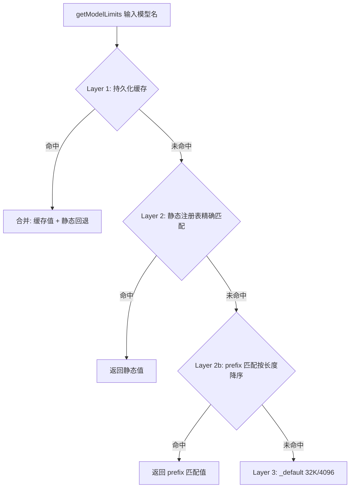
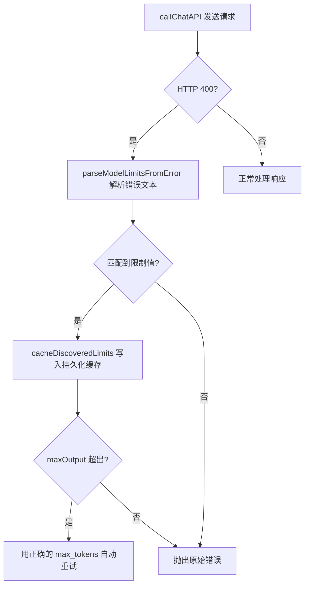
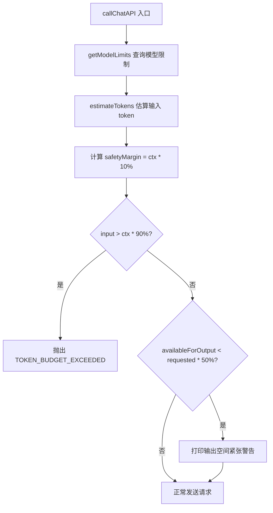

# PD-01.09 moyin-creator — 三层查表 Token 预算与 Error-driven Discovery

> 文档编号：PD-01.09
> 来源：moyin-creator `src/lib/ai/model-registry.ts`, `src/lib/script/script-parser.ts`, `src/lib/ai/batch-processor.ts`
> GitHub：https://github.com/MemeCalculate/moyin-creator.git
> 问题域：PD-01 上下文管理 Context Window Management
> 状态：可复用方案

---

## 第 1 章 问题与动机

### 1.1 核心问题

moyin-creator 是一个 AI 驱动的影视剧本创作工具，核心流程是将用户输入的剧本文本通过 LLM 解析为结构化数据（角色、场景、分镜），再批量生成视觉描述。这个流程面临三个上下文管理挑战：

1. **模型限制未知**：项目通过 MemeFast 等中转平台调用 50+ 种模型（DeepSeek、GLM、Gemini、GPT 等），每个模型的 contextWindow 和 maxOutput 各不相同，且中转平台可能施加额外限制，无法提前全部掌握。
2. **输入可能超限**：用户输入的剧本文本长度不可控（从一句话创意到数万字长篇），加上 system prompt 本身就很长（PARSE_SYSTEM_PROMPT 约 133 行），很容易撞到模型上下文上限。
3. **批量处理的双重约束**：分镜校准需要将数十个 shot 分批发给 AI，每批既要控制 input token 不超限，又要确保 output token 有足够空间输出完整 JSON。

### 1.2 moyin-creator 的解法概述

1. **三层查表模型注册表**：`getModelLimits()` 按 持久化缓存 → 静态注册表 → 保守默认值 三层查找模型限制（`model-registry.ts:125-142`）
2. **Error-driven Discovery**：API 返回 400 错误时自动解析错误消息中的真实限制，缓存到 localStorage 供后续使用（`model-registry.ts:178-229`）
3. **调用前 Token 预算检查**：`callChatAPI()` 在发请求前估算 input token，超过 90% 直接拒绝，50% 输出空间不足时打印警告（`script-parser.ts:254-283`）
4. **双重约束自适应分批**：`batch-processor.ts` 的贪心分组算法同时满足 input 和 output token 约束，60K Hard Cap 防止 Lost-in-the-middle（`batch-processor.ts:246-285`）
5. **Mustache 模板编译**：`PromptCompiler` 通过 `{{variable}}` 插值动态组装 prompt，支持运行时热更新模板（`prompt-compiler.ts:50-160`）

### 1.3 设计思想

| 设计原则 | 具体实现 | 理由 | 替代方案 |
|----------|----------|------|----------|
| 保守默认，渐进学习 | 未知模型用 32K/4096 默认值，从错误中学习真实值 | 宁可多分批也不撞限制；中转平台限制无法提前知道 | 要求用户手动配置每个模型的限制 |
| 按模型名查表，不按 URL | 同一模型无论直连还是中转，限制相同 | MemeFast 代理的模型和官方 API 限制一致 | 按 provider+model 组合键查表 |
| prefix 匹配降序排列 | `deepseek-v3.2` 优先于 `deepseek-` 匹配 | 避免短前缀误匹配更具体的模型变体 | 正则匹配（更灵活但更复杂） |
| 字符/1.5 粗估 token | `estimateTokens(text) = Math.ceil(text.length / 1.5)` | 不引入 tiktoken 等重型库，前端 WASM 兼容性差 | 引入 tiktoken-wasm（精确但体积大） |
| 双重约束分批 | input budget + output budget 同时满足 | 只控制 input 会导致 output 被截断 | 仅按 item 数量固定分批 |

---

## 第 2 章 源码实现分析

### 2.1 架构概览

moyin-creator 的上下文管理分为 4 个层次，从底层到上层依次是：

```
┌─────────────────────────────────────────────────────────────┐
│                    应用层 (script-parser / shot-calibration)  │
│  parseScript() / generateShotList() / calibrateShotsMultiStage() │
├─────────────────────────────────────────────────────────────┤
│                    调度层 (feature-router + batch-processor)  │
│  callFeatureAPI() → callChatAPI()    processBatched()        │
│  多模型轮询 + Key 轮换               双重约束贪心分批          │
├─────────────────────────────────────────────────────────────┤
│                    注册层 (model-registry)                    │
│  getModelLimits()  三层查找: 缓存→静态→默认                    │
│  estimateTokens()  字符/1.5 保守估算                          │
│  parseModelLimitsFromError()  Error-driven Discovery         │
├─────────────────────────────────────────────────────────────┤
│                    持久层 (api-config-store + localStorage)   │
│  discoveredModelLimits: Record<string, DiscoveredModelLimits>│
│  injectDiscoveryCache() 依赖注入避免循环引用                   │
└─────────────────────────────────────────────────────────────┘
```

### 2.2 核心实现

#### 2.2.1 三层查表模型注册表



对应源码 `src/lib/ai/model-registry.ts:125-162`：

```typescript
export function getModelLimits(modelName: string): ModelLimits {
  const m = modelName.toLowerCase();

  // Layer 1: 持久化缓存（最准确，从 API 错误中学到的真实值）
  if (_getDiscoveredLimits) {
    const discovered = _getDiscoveredLimits(m);
    if (discovered) {
      const staticFallback = lookupStatic(m);
      return {
        contextWindow: discovered.contextWindow ?? staticFallback.contextWindow,
        maxOutput: discovered.maxOutput ?? staticFallback.maxOutput,
      };
    }
  }
  // Layer 2 + 3: 静态注册表 → _default
  return lookupStatic(m);
}

function lookupStatic(modelNameLower: string): ModelLimits {
  if (STATIC_REGISTRY[modelNameLower]) return STATIC_REGISTRY[modelNameLower];
  // prefix 匹配（长度降序保证最具体的先命中）
  for (const key of SORTED_KEYS) {
    if (modelNameLower.startsWith(key)) return STATIC_REGISTRY[key];
  }
  return STATIC_REGISTRY['_default'];
}
```

静态注册表覆盖了主流模型系列（`model-registry.ts:50-89`），包含 DeepSeek（128K）、GLM（200K）、Gemini（1M）、Claude（200K）、GPT（128K）等，以及通用 prefix 规则如 `'deepseek-'`、`'gemini-'` 等。

#### 2.2.2 Error-driven Discovery



对应源码 `src/lib/ai/model-registry.ts:178-229`：

```typescript
export function parseModelLimitsFromError(errorText: string): Partial<DiscoveredModelLimits> | null {
  const result: Partial<DiscoveredModelLimits> = {};
  let found = false;

  // Pattern 1: "valid range of max_tokens is [1, 8192]" (DeepSeek)
  const rangeMatch = errorText.match(/valid\s+range.*?\[\s*\d+\s*,\s*(\d+)\s*\]/i);
  if (rangeMatch) { result.maxOutput = parseInt(rangeMatch[1], 10); found = true; }

  // Pattern 2: "max_tokens must be less than or equal to 8192" (智谱)
  if (!found) {
    const lteMatch = errorText.match(/max_tokens.*?(?:less than or equal to|<=|不超过|上限为?)\s*(\d{3,6})/i);
    if (lteMatch) { result.maxOutput = parseInt(lteMatch[1], 10); found = true; }
  }

  // Pattern 3: Generic fallback
  if (!found) {
    const genericMatch = errorText.match(/max_tokens.*?\b(\d{3,6})\b/i);
    if (genericMatch) { result.maxOutput = parseInt(genericMatch[1], 10); found = true; }
  }

  // 解析 context window: "context length is 128000"
  const ctxMatch = errorText.match(/context.*?length.*?(\d{4,7})/i);
  if (ctxMatch) { result.contextWindow = parseInt(ctxMatch[1], 10); found = true; }

  if (!found) return null;
  result.discoveredAt = Date.now();
  return result;
}
```

发现的限制通过依赖注入写入 Zustand store 并持久化到 localStorage（`api-config-store.ts:1192-1195`）：

```typescript
injectDiscoveryCache(
  (model) => useAPIConfigStore.getState().getDiscoveredModelLimits(model),
  (model, limits) => useAPIConfigStore.getState().setDiscoveredModelLimits(model, limits),
);
```

#### 2.2.3 调用前 Token 预算检查



对应源码 `src/lib/script/script-parser.ts:254-283`：

```typescript
const inputTokens = estimateTokens(systemPrompt + userPrompt);
const safetyMargin = Math.ceil(modelLimits.contextWindow * 0.1);
const availableForOutput = modelLimits.contextWindow - inputTokens - safetyMargin;

// 输入已超过 context window 的 90% → 抛出错误（不发请求，省钱）
if (inputTokens > modelLimits.contextWindow * 0.9) {
  const err = new Error(
    `[TokenBudget] 输入 token (≈${inputTokens}) 超出 ${model} 的 context window ` +
    `(${modelLimits.contextWindow}) 的 90%，请缩减输入或使用更大上下文的模型`
  );
  (err as any).code = 'TOKEN_BUDGET_EXCEEDED';
  throw err;
}

// 输出空间不到请求的 50% → 打印 warning
if (availableForOutput < requestedMaxTokens * 0.5) {
  console.warn(`[Dispatch] ⚠️ ${model}: 输出空间紧张！可用≈${availableForOutput} tokens`);
}
```

### 2.3 实现细节

**推理模型 token 耗尽自动重试**（`script-parser.ts:398-451`）：当推理模型（如 GLM-4.7）的 reasoning_content 占用了 >80% 的 completion tokens 导致 content 为空时，自动以双倍 max_tokens 重试。这是一个独特的容错设计——推理模型的"思考"过程会消耗大量 output token，导致实际输出为空。

**5 阶段分镜校准**（`shot-calibration-stages.ts:1-80`）：将 30+ 字段拆分为 5 个独立 AI 调用（叙事骨架→视觉描述→拍摄控制→首帧提示词→动态+尾帧），每阶段通过 `processBatched()` 自适应分批，避免单次调用 token 耗尽。

**双重约束贪心分批**（`batch-processor.ts:246-285`）：

```
inputBudget  = min(contextWindow * 0.6, 60K)   // Hard Cap 防 Lost-in-the-middle
outputBudget = maxOutput * 0.8                   // 留 20% 给 JSON 格式开销

for each item:
  if (currentInput + itemInput > inputBudget OR
      currentOutput + itemOutput > outputBudget):
    开始新批次
  else:
    加入当前批次
```

**safeTruncate 智能截断**（`model-registry.ts:272-303`）：在段落边界或句子边界截断，追加 `...[后续内容已截断]` 提示后缀，减少 LLM 因信息不完整产生的幻觉。


---

## 第 3 章 迁移指南

### 3.1 迁移清单

**阶段 1：模型注册表（1 个文件）**
- [ ] 创建 `model-registry.ts`，包含 `ModelLimits` 接口、静态注册表、`getModelLimits()`、`estimateTokens()`
- [ ] 根据项目实际使用的模型填充静态注册表
- [ ] 实现 prefix 匹配（按 key 长度降序排列）

**阶段 2：Error-driven Discovery（2 个文件）**
- [ ] 实现 `parseModelLimitsFromError()` 正则解析
- [ ] 实现 `injectDiscoveryCache()` 依赖注入接口
- [ ] 在持久化 store 中添加 `discoveredModelLimits` 字段
- [ ] 模块加载时调用 `injectDiscoveryCache()` 注入读写函数

**阶段 3：Token 预算检查（集成到 API 调用层）**
- [ ] 在 API 调用入口添加 `estimateTokens()` 检查
- [ ] 实现 90% 硬拒绝 + 50% 软警告
- [ ] 添加 `TOKEN_BUDGET_EXCEEDED` 错误码

**阶段 4：批处理器（可选，适用于批量 AI 调用场景）**
- [ ] 实现 `createBatches()` 双重约束贪心分组
- [ ] 集成重试 + 容错隔离

### 3.2 适配代码模板

以下是一个可直接复用的最小化模型注册表 + Token 预算检查：

```typescript
// === model-registry.ts ===

interface ModelLimits {
  contextWindow: number;
  maxOutput: number;
}

interface DiscoveredLimits {
  maxOutput?: number;
  contextWindow?: number;
  discoveredAt: number;
}

// 静态注册表（按项目需要填充）
const REGISTRY: Record<string, ModelLimits> = {
  'gpt-4o':       { contextWindow: 128000, maxOutput: 16384 },
  'claude-3.5':   { contextWindow: 200000, maxOutput: 8192  },
  'gpt-':         { contextWindow: 128000, maxOutput: 16384 },  // prefix
  'claude-':      { contextWindow: 200000, maxOutput: 8192  },  // prefix
  '_default':     { contextWindow: 32000,  maxOutput: 4096  },
};

const SORTED_KEYS = Object.keys(REGISTRY)
  .filter(k => k !== '_default')
  .sort((a, b) => b.length - a.length);

// 依赖注入：持久化缓存的读写
let _getCache: ((m: string) => DiscoveredLimits | undefined) | null = null;
let _setCache: ((m: string, l: Partial<DiscoveredLimits>) => void) | null = null;

export function injectCache(
  getter: (m: string) => DiscoveredLimits | undefined,
  setter: (m: string, l: Partial<DiscoveredLimits>) => void,
) {
  _getCache = getter;
  _setCache = setter;
}

export function getModelLimits(model: string): ModelLimits {
  const m = model.toLowerCase();
  // Layer 1: 持久化缓存
  if (_getCache) {
    const cached = _getCache(m);
    if (cached) {
      const fallback = lookupStatic(m);
      return {
        contextWindow: cached.contextWindow ?? fallback.contextWindow,
        maxOutput: cached.maxOutput ?? fallback.maxOutput,
      };
    }
  }
  return lookupStatic(m);
}

function lookupStatic(m: string): ModelLimits {
  if (REGISTRY[m]) return REGISTRY[m];
  for (const key of SORTED_KEYS) {
    if (m.startsWith(key)) return REGISTRY[key];
  }
  return REGISTRY['_default'];
}

export function estimateTokens(text: string): number {
  return Math.ceil(text.length / 1.5);
}

// Error-driven Discovery: 从 400 错误中学习
export function parseErrorLimits(errorText: string): Partial<DiscoveredLimits> | null {
  let maxOutput: number | undefined;
  const rangeMatch = errorText.match(/valid\s+range.*?\[\s*\d+\s*,\s*(\d+)\s*\]/i);
  if (rangeMatch) maxOutput = parseInt(rangeMatch[1], 10);
  if (!maxOutput) {
    const lteMatch = errorText.match(/max_tokens.*?(?:<=|less than or equal to)\s*(\d{3,6})/i);
    if (lteMatch) maxOutput = parseInt(lteMatch[1], 10);
  }
  const ctxMatch = errorText.match(/context.*?length.*?(\d{4,7})/i);
  if (!maxOutput && !ctxMatch) return null;
  return {
    maxOutput,
    contextWindow: ctxMatch ? parseInt(ctxMatch[1], 10) : undefined,
    discoveredAt: Date.now(),
  };
}

// === 在 API 调用层集成 ===
export function checkTokenBudget(
  model: string,
  inputText: string,
  requestedMaxTokens: number,
): { effectiveMaxTokens: number; inputTokens: number } {
  const limits = getModelLimits(model);
  const inputTokens = estimateTokens(inputText);
  const effectiveMaxTokens = Math.min(requestedMaxTokens, limits.maxOutput);

  if (inputTokens > limits.contextWindow * 0.9) {
    throw Object.assign(
      new Error(`Input tokens (≈${inputTokens}) exceed 90% of ${model} context (${limits.contextWindow})`),
      { code: 'TOKEN_BUDGET_EXCEEDED' },
    );
  }

  const available = limits.contextWindow - inputTokens - Math.ceil(limits.contextWindow * 0.1);
  if (available < requestedMaxTokens * 0.5) {
    console.warn(`⚠️ ${model}: tight output space, available≈${available}, requested=${requestedMaxTokens}`);
  }

  return { effectiveMaxTokens, inputTokens };
}
```

### 3.3 适用场景

| 场景 | 适用度 | 说明 |
|------|--------|------|
| 多模型多供应商 AI 应用 | ⭐⭐⭐ | 三层查表 + Error-driven Discovery 完美适配模型种类多、限制不确定的场景 |
| 批量 AI 处理管线 | ⭐⭐⭐ | 双重约束分批 + 容错隔离适合需要处理大量 item 的场景 |
| 前端直调 LLM API | ⭐⭐⭐ | 不依赖 tiktoken，纯字符估算适合浏览器环境 |
| 单模型后端服务 | ⭐⭐ | 三层查表过度设计，直接硬编码限制即可 |
| 需要精确 token 计数 | ⭐ | 字符/1.5 粗估对中英混合文本误差较大，需要 tiktoken |

---

## 第 4 章 测试用例

```typescript
import { describe, it, expect, vi, beforeEach } from 'vitest';

// === 模型注册表测试 ===
describe('getModelLimits', () => {
  it('精确匹配优先于 prefix', () => {
    const limits = getModelLimits('deepseek-v3.2');
    expect(limits.contextWindow).toBe(128000);
    expect(limits.maxOutput).toBe(8192);
  });

  it('prefix 匹配按长度降序', () => {
    // 'deepseek-v3' (11字符) 应优先于 'deepseek-' (9字符)
    const limits = getModelLimits('deepseek-v3');
    expect(limits.contextWindow).toBe(128000);
  });

  it('未知模型返回保守默认值', () => {
    const limits = getModelLimits('unknown-model-xyz');
    expect(limits.contextWindow).toBe(32000);
    expect(limits.maxOutput).toBe(4096);
  });

  it('持久化缓存优先于静态注册表', () => {
    injectCache(
      (m) => m === 'test-model' ? { maxOutput: 9999, discoveredAt: Date.now() } : undefined,
      () => {},
    );
    const limits = getModelLimits('test-model');
    expect(limits.maxOutput).toBe(9999);
    expect(limits.contextWindow).toBe(32000); // 缓存无 contextWindow，回退到静态默认
  });
});

// === Error-driven Discovery 测试 ===
describe('parseModelLimitsFromError', () => {
  it('解析 DeepSeek 格式: valid range', () => {
    const result = parseErrorLimits('Invalid max_tokens value, the valid range of max_tokens is [1, 8192]');
    expect(result?.maxOutput).toBe(8192);
  });

  it('解析智谱格式: less than or equal to', () => {
    const result = parseErrorLimits('max_tokens must be less than or equal to 4096');
    expect(result?.maxOutput).toBe(4096);
  });

  it('解析 OpenAI 格式: context length', () => {
    const result = parseErrorLimits('maximum context length is 128000 tokens, you requested 150000 tokens');
    expect(result?.contextWindow).toBe(128000);
  });

  it('无匹配返回 null', () => {
    const result = parseErrorLimits('Internal server error');
    expect(result).toBeNull();
  });
});

// === Token 预算检查测试 ===
describe('checkTokenBudget', () => {
  it('输入超 90% 抛出 TOKEN_BUDGET_EXCEEDED', () => {
    // 默认模型 contextWindow=32000, 90% = 28800
    // 需要 28800 * 1.5 = 43200 字符的输入
    const longInput = 'x'.repeat(44000);
    expect(() => checkTokenBudget('unknown-model', longInput, 4096))
      .toThrow('TOKEN_BUDGET_EXCEEDED');
  });

  it('effectiveMaxTokens 被 clamp 到 maxOutput', () => {
    const { effectiveMaxTokens } = checkTokenBudget('unknown-model', 'short input', 99999);
    expect(effectiveMaxTokens).toBe(4096); // _default maxOutput
  });
});

// === estimateTokens 测试 ===
describe('estimateTokens', () => {
  it('空字符串返回 0', () => {
    expect(estimateTokens('')).toBe(0);
  });

  it('中文文本保守估算', () => {
    const tokens = estimateTokens('你好世界'); // 4字符 / 1.5 = 2.67 → 3
    expect(tokens).toBe(3);
  });

  it('英文文本保守估算', () => {
    const tokens = estimateTokens('hello world'); // 11字符 / 1.5 = 7.33 → 8
    expect(tokens).toBe(8);
  });
});
```


---

## 第 5 章 跨域关联

| 关联域 | 关系类型 | 说明 |
|--------|----------|------|
| PD-03 容错与重试 | 协同 | Error-driven Discovery 本质是容错机制——从 400 错误中恢复并自动重试；推理模型 token 耗尽的双倍 max_tokens 重试也是容错设计 |
| PD-04 工具系统 | 协同 | PromptCompiler 的 Mustache 模板引擎可视为工具系统的 prompt 构建组件；feature-router 的多模型轮询是工具调度的一种形式 |
| PD-10 中间件管道 | 依赖 | batch-processor 的 `buildPrompts → callFeatureAPI → parseResult` 是一个简化的管道模式；5 阶段分镜校准是串行管道 |
| PD-11 可观测性 | 协同 | callChatAPI 中大量的 console.log 诊断信息（input token 估算、利用率百分比、key 轮换状态）是可观测性的基础实现 |

---

## 第 6 章 来源文件索引

| 文件 | 行范围 | 关键实现 |
|------|--------|----------|
| `src/lib/ai/model-registry.ts` | L22-27 | `ModelLimits` 接口定义 |
| `src/lib/ai/model-registry.ts` | L50-89 | 静态注册表（50+ 模型限制） |
| `src/lib/ai/model-registry.ts` | L93-95 | prefix 匹配 key 排序 |
| `src/lib/ai/model-registry.ts` | L107-113 | `injectDiscoveryCache()` 依赖注入 |
| `src/lib/ai/model-registry.ts` | L125-162 | `getModelLimits()` 三层查找 |
| `src/lib/ai/model-registry.ts` | L178-229 | `parseModelLimitsFromError()` 错误解析 |
| `src/lib/ai/model-registry.ts` | L260-262 | `estimateTokens()` 字符/1.5 估算 |
| `src/lib/ai/model-registry.ts` | L272-303 | `safeTruncate()` 智能截断 |
| `src/lib/script/script-parser.ts` | L209-463 | `callChatAPI()` 含 Token 预算检查 |
| `src/lib/script/script-parser.ts` | L254-275 | Token Budget Calculator 核心逻辑 |
| `src/lib/script/script-parser.ts` | L337-366 | Error-driven Discovery 重试逻辑 |
| `src/lib/script/script-parser.ts` | L398-451 | 推理模型 token 耗尽自动重试 |
| `src/lib/ai/batch-processor.ts` | L105-233 | `processBatched()` 自适应批处理 |
| `src/lib/ai/batch-processor.ts` | L246-285 | `createBatches()` 双重约束贪心分组 |
| `src/lib/ai/batch-processor.ts` | L292-326 | `executeBatchWithRetry()` 单批次重试 |
| `src/lib/ai/feature-router.ts` | L133-182 | `getFeatureConfig()` 多模型轮询 |
| `src/lib/ai/feature-router.ts` | L238-279 | `callFeatureAPI()` 统一调用入口 |
| `src/packages/ai-core/services/prompt-compiler.ts` | L50-82 | `PromptCompiler` 类 Mustache 插值 |
| `src/packages/ai-core/services/prompt-compiler.ts` | L147-152 | `updateTemplates()` 运行时热更新 |
| `src/stores/api-config-store.ts` | L187 | `discoveredModelLimits` 状态字段 |
| `src/stores/api-config-store.ts` | L843-858 | Discovery cache getter/setter |
| `src/stores/api-config-store.ts` | L1192-1195 | `injectDiscoveryCache()` 调用点 |
| `src/lib/script/shot-calibration-stages.ts` | L1-80 | 5 阶段分镜校准定义 |

---

## 第 7 章 横向对比维度

```json comparison_data
{
  "project": "moyin-creator",
  "dimensions": {
    "估算方式": "字符数/1.5 保守粗估，不引入 tiktoken，前端友好",
    "压缩策略": "无历史压缩；safeTruncate 在段落/句子边界截断 + 提示后缀",
    "触发机制": "调用前预估：90% 硬拒绝 + 50% 输出空间软警告",
    "实现位置": "model-registry 注册层 + script-parser 调度层 + batch-processor 分批层",
    "容错设计": "Error-driven Discovery 从 400 错误自动学习模型限制并持久化缓存",
    "Prompt模板化": "PromptCompiler Mustache 插值引擎，4 模板 + 运行时热更新",
    "供应商适配": "三层查表按模型名查找，prefix 降序匹配，覆盖 50+ 模型",
    "实时数据注入": "PromptCompiler {{variable}} 动态注入场景/角色/风格等运行时数据",
    "批量并发控制": "60K Hard Cap + 双重约束贪心分批 + runStaggered 并发 + 单批次指数退避重试",
    "推理模型适配": "检测 reasoning_tokens 占比 >80% 时自动双倍 max_tokens 重试"
  }
}
```

### 域元数据补充

```json domain_metadata
{
  "solution_summary": "moyin-creator 用三层查表（缓存→静态→默认）+ Error-driven Discovery 自动学习模型限制，配合 90% 硬拒绝预算检查和 60K Hard Cap 双重约束分批",
  "description": "前端多模型场景下不依赖 tokenizer 的轻量级上下文预算管理",
  "sub_problems": [
    "推理模型 token 耗尽：reasoning 占用 >80% completion tokens 导致 content 为空，需检测并自动扩容重试",
    "模型限制动态发现：中转平台可能施加额外限制，需从 API 错误中自动学习真实值并持久化",
    "批处理双重约束：同时满足 input token 预算和 output token 预算的贪心分组策略",
    "Lost-in-the-middle 防护：即使模型支持超长上下文，单批 input 也需 Hard Cap 防止注意力衰减"
  ],
  "best_practices": [
    "prefix 匹配按 key 长度降序排列，避免短前缀误匹配更具体的模型变体",
    "依赖注入解耦注册表与持久化层，避免 model-registry ↔ store 循环依赖",
    "Error-driven Discovery 的正则要覆盖主流 API 的多种错误格式（DeepSeek/OpenAI/智谱）",
    "批处理设置 60K Hard Cap，即使模型支持 1M 上下文也不要一次塞满"
  ]
}
```

