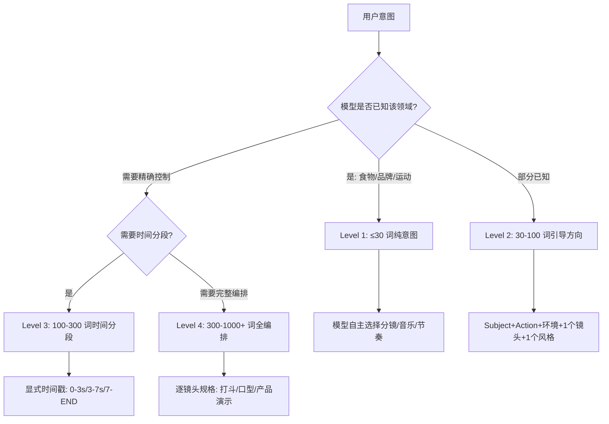
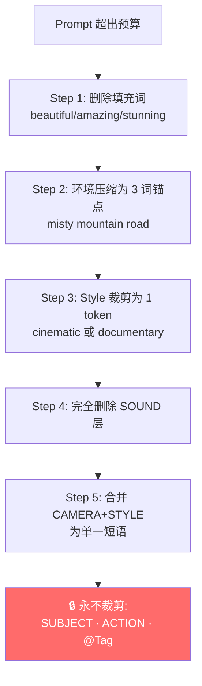

# PD-01.20 seedance-2.0 — 委托级别与压缩阶梯上下文管理

> 文档编号：PD-01.20
> 来源：seedance-2.0 `skills/seedance-prompt/SKILL.md` `skills/seedance-troubleshoot/SKILL.md` `references/json-schema.md`
> GitHub：https://github.com/Emily2040/seedance-2.0.git
> 问题域：PD-01 上下文管理 Context Window Management
> 状态：可复用方案

---

## 第 1 章 问题与动机

### 1.1 核心问题

AI 视频生成模型（如 Seedance 2.0）的 prompt 上下文管理面临独特挑战：模型对输入 token 的注意力分配极度不均匀——前 20-30 个词承载了不成比例的权重，而后续内容的影响力急剧衰减。这意味着传统的"尽量塞满上下文窗口"策略在视频生成场景中不仅无效，反而有害。

与 LLM 对话场景不同，视频生成的上下文管理核心矛盾是：
1. **信息密度 vs 注意力衰减**：更多描述词不等于更好的输出，过载的 prompt 导致"动作混乱"（chaotic motion）
2. **多模态文件预算**：除文本 token 外，还需管理图片×9、视频×3、音频×3 的硬性文件数量限制（Rule of 12）
3. **委托粒度选择**：模型对已知领域有内置知识，过度指定反而干扰模型的"导演智能"

### 1.2 seedance-2.0 的解法概述

seedance-2.0 通过一套纯配置驱动的 Skill 文件体系（非运行时代码），实现了面向 AI 视频生成的上下文管理方案：

1. **四级委托体系（Delegation Level 1-4）**：根据场景复杂度选择 prompt 长度级别，从 ≤30 词的纯意图到 1000+ 词的完整编排（`skills/seedance-prompt/SKILL.md:66-89`）
2. **五层 Prompt 栈（Five-Layer Stack）**：Subject → Action → Camera → Style → Sound 的固定构建顺序，确保高权重位置放置核心信息（`skills/seedance-prompt/SKILL.md:49-63`）
3. **压缩阶梯（Compression Ladder）**：6 级优先级裁剪规则，从删除填充词到合并层，但永不裁剪 Subject/Action/@Tag（`skills/seedance-troubleshoot/SKILL.md:149-158`）
4. **Rule of 12 文件预算**：多模态输入的硬性数量上限管理（`references/platform-constraints.md:22-28`）
5. **前置加载规则（Front-load Rule）**：强制 Subject+Action 占据前 20-30 词位置，利用模型注意力分布特性（`skills/seedance-prompt/SKILL.md:43,62`）

### 1.3 设计思想

| 设计原则 | 具体实现 | 理由 | 替代方案 |
|----------|----------|------|----------|
| 委托优于控制 | Level 1-4 分级，已知领域信任模型 | 模型对常见场景有内置知识，过度指定产生冲突 | 统一使用最详细的 prompt（导致过载） |
| 位置即权重 | 前 20-30 词必须是 Subject+Action | 模型注意力分布前重后轻，位置决定影响力 | 随意排列描述词（浪费高权重位置） |
| 分层裁剪 | 6 级压缩阶梯，Sound 先删 Subject 永不删 | 不同层对输出质量的贡献不同 | 均匀截断（丢失关键信息） |
| 硬预算约束 | Rule of 12 文件上限 + 15s 视频/音频总时长 | 平台物理限制，超出直接失败 | 无限制上传（触发平台拒绝） |
| 可测量性过滤 | Anti-Slop 协议删除不可测量词 | 不可测量词浪费 token 且触发泛化输出 | 保留所有修饰词（降低输出质量） |

---

## 第 2 章 源码实现分析

### 2.1 架构概览

seedance-2.0 是一个纯 Skill 文件体系（无运行时代码），通过 Markdown 配置文件定义 prompt 构建规则。其上下文管理架构如下：

```
┌─────────────────────────────────────────────────────────┐
│                  seedance-20 (Router)                     │
│  根 SKILL.md — 模式路由 + 平台约束 + 版权检查入口         │
└──────────┬──────────────────────────────────┬────────────┘
           │                                  │
    ┌──────▼──────┐                   ┌───────▼───────┐
    │  interview   │                   │  troubleshoot  │
    │ 5 阶段引导    │                   │ 压缩阶梯+QA    │
    │ Vision→Brief │                   │ 错误诊断修复    │
    └──────┬──────┘                   └───────┬───────┘
           │                                  │
    ┌──────▼──────────────────────────────────▼────────┐
    │              seedance-prompt (核心)                │
    │  Five-Layer Stack + Level 1-4 + @Tag + JSON v3   │
    │  前置加载规则 + 单动作规则 + 预算纪律              │
    └──────┬──────────────────────────────────┬────────┘
           │                                  │
    ┌──────▼──────┐                   ┌───────▼───────┐
    │  antislop    │                   │  json-schema   │
    │ 黑名单过滤    │                   │ Schema v3 编译  │
    │ 精度阶梯替换  │                   │ 预算分级裁剪    │
    └─────────────┘                   └───────────────┘
           │
    ┌──────▼──────────────────────────────────────────┐
    │  platform-constraints (硬约束)                    │
    │  Rule of 12 · 4-15s · 6 种宽高比 · MP3 only     │
    └─────────────────────────────────────────────────┘
```

### 2.2 核心实现

#### 2.2.1 四级委托体系



对应源码 `skills/seedance-prompt/SKILL.md:66-89`：

```markdown
### Level 1 — Pure Intent (≤30 words)
Use when the model knows the domain (food, brands, sports, everyday life).
生成一个精美高级的兰州拉面广告，注意分镜编排
The model selects shots, music, pacing independently.

### Level 2 — Guided Direction (30–100 words)
Subject + action + environment + one camera note + one style anchor.

### Level 3 — Time-Segmented (100–300 words)
Use explicit timestamps: 0–3s: ... 3–7s: ... 7–END: ...

### Level 4 — Full Choreography (300–1000+ words)
Per-shot specifications. Use for fight scenes, lip-sync, product demos.

**Decision rule:** Does the model already know how to shoot this?
Yes → Level 1–2. Novel/precise → Level 3–4.
```

这是一个"委托优于控制"的设计：Level 1 的 `注意分镜编排` 指令激活模型的"导演智能"，让模型自主决定分镜、音乐和节奏。只有当模型不具备领域知识时才升级到更高级别。

#### 2.2.2 五层 Prompt 栈与前置加载


对应源码 `skills/seedance-prompt/SKILL.md:49-63`：

```markdown
Build prompts in this order. The model is motion-first; subject anchor before style.

1. SUBJECT  — who/what is central (identity anchor)
2. ACTION   — primary motion verb + physics/timing
3. CAMERA   — framing + movement + speed + angle
4. STYLE    — 1–3 tokens max (film language, not adjectives)
5. SOUND    — ambient + SFX + music + silence
+ CONSTRAINTS — what must stay consistent; what to avoid

First 20–30 words carry disproportionate weight. Subject + action always first.
```

关键设计点：
- **单动作规则**（`skills/seedance-prompt/SKILL.md:45`）：每个 prompt 只允许一个主要动作动词，多动作产生混乱
- **Style 限制为 1-3 tokens**：防止风格描述膨胀挤占核心信息空间
- **Sound 不是可选的**（`skills/seedance-prompt/SKILL.md:256`）：10000+ 代实践数据证实忽略音频产生平淡结果

#### 2.2.3 压缩阶梯（Compression Ladder）



对应源码 `skills/seedance-troubleshoot/SKILL.md:149-158`：

```markdown
## Compression Ladder (prompt budget exceeded)
Remove in this order — stop when within budget:
1. Remove filler phrases (`beautiful`, `amazing`, `stunning`)
2. Collapse environment to 3-word anchor (`misty mountain road`)
3. Cut style to 1 token (`cinematic` or `documentary`)
4. Drop SOUND layer entirely
5. Merge CAMERA + STYLE into single phrase
6. **Never cut**: SUBJECT · ACTION · @Tag assignments
```

JSON Schema 中也定义了对应的字段级裁剪优先级（`references/json-schema.md:68-77`）：

```markdown
| Priority | Field              | Cut rule           |
|----------|--------------------|--------------------|
| 6 (cut last)  | shot.subj shot.act | Never cut         |
| 5             | ref.*              | Never cut         |
| 4             | shot.cam           | Compress to 3 words|
| 3             | shot.light         | Drop to 1 phrase   |
| 2             | shot.style         | Reduce to 1 token  |
| 1 (cut first) | shot.snd exit      | Remove entirely    |
```

这是一个双层裁剪体系：文本层（Compression Ladder）和结构层（JSON Schema Budget Triage）使用相同的优先级逻辑，确保无论用户使用哪种格式构建 prompt，裁剪行为一致。

### 2.3 实现细节

#### Anti-Slop 过滤作为 Token 回收机制

Anti-Slop 协议（`skills/seedance-antislop/SKILL.md`）本质上是一个 token 回收机制。它通过删除不可测量词来释放 token 预算：

- **黑名单词表**：`stunning` `cinematic` `epic` `masterpiece` `8K` 等 50+ 词（`skills/seedance-antislop/SKILL.md:52-78`）
- **可测量性测试**：`"Can a camera, light meter, or stopwatch measure this?"` — 不能则删除（`skills/seedance-antislop/SKILL.md:33`）
- **精度阶梯**：从 Level 0（slop）到 Level 4（数值化），提供渐进式替换路径（`skills/seedance-antislop/SKILL.md:339-351`）
- **密度审计**：0 slop = 提交；1-2 = 删除收紧；3-5 = 从 Subject 重写；5+ = 丢弃重来（`skills/seedance-antislop/SKILL.md:326-333`）

实际效果量化（来自 antislop 示例）：
- 产品广告：删除 14 个 slop token，换回 3 条可测量灯光指令 + 1 条镜头路径 + 2 条约束
- 动作场景：删除 16 个 slop token，换回完整编排 + 时间线 + 镜头运动 + 音频提示

#### Rule of 12 多模态预算

```
总文件数 ≤ 12
├── 图片 ≤ 9 张（每张 < 30MB，JPG/PNG/WEBP）
├── 视频 ≤ 3 段（合计 ≤ 15s，非单段 15s）
└── 音频 ≤ 3 段（合计 ≤ 15s，仅 MP3）
```

关键陷阱：视频的 15 秒限制是**合计总时长**而非单段时长（`references/platform-constraints.md:30`），这是一个常见误解。

#### @Tag 角色分配作为上下文锚定

每个 @Tag 必须有且仅有一个显式角色（`skills/seedance-prompt/SKILL.md:103-115`），这是一种上下文锚定策略：

```
@Image1's character as the subject     ← 身份锚定
@Image2 as the first frame             ← 时间锚定
Scene references @Image2               ← 环境锚定
Reference @Video1's camera movement    ← 运动锚定
BGM references @Audio1                 ← 音频锚定
```

裸 @Tag（无角色说明）被标记为"weak"，因为模型无法确定该引用的用途，导致注意力分散。
