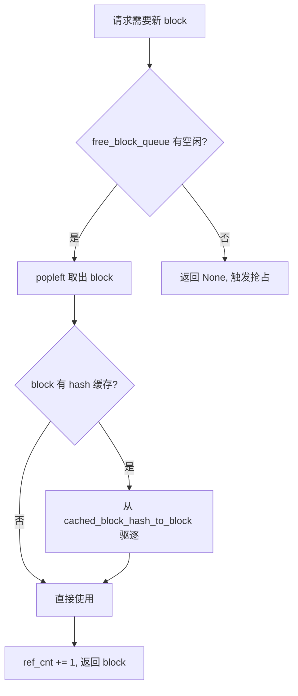
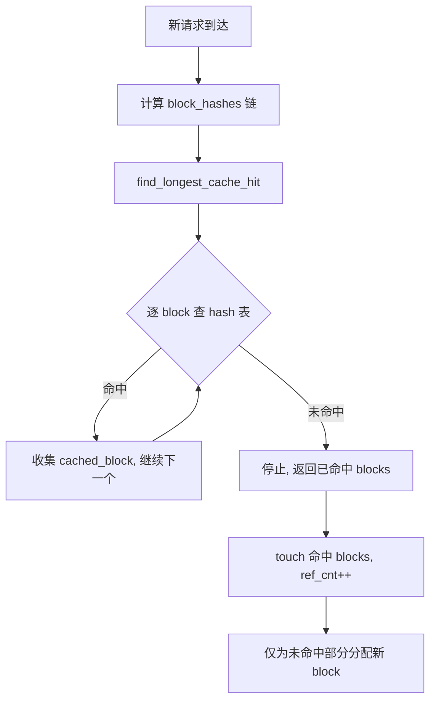
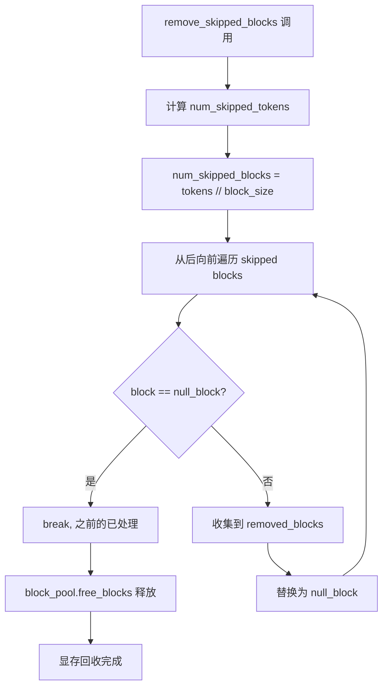

# PD-01.16 vLLM — PagedAttention 分页 KV Cache 上下文管理

> 文档编号：PD-01.16
> 来源：vLLM `vllm/v1/core/kv_cache_manager.py`, `vllm/v1/core/block_pool.py`, `vllm/v1/core/kv_cache_coordinator.py`
> GitHub：https://github.com/vllm-project/vllm.git
> 问题域：PD-01 上下文管理 Context Window Management
> 状态：可复用方案

---

## 第 1 章 问题与动机

### 1.1 核心问题

LLM 推理的 KV Cache 是上下文管理的核心瓶颈。传统实现为每个请求预分配连续的 `max_model_len` 大小的 GPU 显存，导致：

1. **内存碎片化**：请求实际长度远小于 max_model_len 时，大量显存被浪费
2. **无法共享前缀**：多个请求共享相同 system prompt 时，KV Cache 被重复计算和存储
3. **滑动窗口浪费**：使用 sliding window attention 的模型，窗口外的 KV 仍占用显存
4. **混合架构冲突**：同一模型中 Full Attention + Sliding Window + Mamba 层的 KV Cache 需求不同

vLLM 通过 PagedAttention 将 KV Cache 切分为固定大小的 block（类似操作系统虚拟内存分页），在 block 级别实现精细的分配、复用和回收。

### 1.2 vLLM 的解法概述

1. **Block 级分页管理**：KV Cache 被切分为 `block_size` 个 token 的 block，通过 `BlockPool` 统一管理分配和回收（`vllm/v1/core/block_pool.py:129`）
2. **Prefix Caching**：基于 block hash 的前缀缓存，相同前缀的请求自动复用已计算的 KV block（`block_pool.py:210-318`）
3. **多注意力类型协调**：`KVCacheCoordinator` 统一协调 FullAttention / SlidingWindow / ChunkedLocalAttention / Mamba 四种 KV Cache 类型（`kv_cache_coordinator.py:28`）
4. **Sliding Window 自动回收**：窗口外的 block 自动替换为 null_block 并释放显存（`single_type_kv_cache_manager.py:347-388`）
5. **Scheduler 集成**：调度器在每步调度时通过 `allocate_slots` 精确计算所需 block 数，不足时触发抢占（`scheduler.py:436-484`）

### 1.3 设计思想

| 设计原则 | 具体实现 | 理由 | 替代方案 |
|----------|----------|------|----------|
| 虚拟内存分页 | block_size 固定分页，FreeKVCacheBlockQueue 双向链表管理 | 消除内存碎片，支持非连续分配 | 连续分配（浪费严重） |
| 内容寻址缓存 | SHA256/xxHash 对 block 内容哈希，hash→block 映射 | 自动发现和复用相同前缀 | 显式前缀树（维护成本高） |
| 策略模式 | SingleTypeKVCacheManager 抽象基类 + 6 种具体实现 | 不同注意力类型独立管理 | 统一管理（无法处理差异） |
| 引用计数 | block.ref_cnt 追踪共享，ref_cnt=0 时进入可驱逐队列 | 安全共享 + LRU 驱逐 | 标记清除（延迟高） |
| 协调者模式 | KVCacheCoordinator 统一协调多 KV Cache 组 | 混合模型的 cache hit 长度需跨组对齐 | 独立管理（无法保证一致性） |

---

## 第 2 章 源码实现分析

### 2.1 架构概览

vLLM v1 的 KV Cache 管理采用三层架构：

```
┌─────────────────────────────────────────────────────────┐
│                    Scheduler                             │
│  schedule() → get_computed_blocks() → allocate_slots()  │
└──────────────────────┬──────────────────────────────────┘
                       │
┌──────────────────────▼──────────────────────────────────┐
│                KVCacheManager                            │
│  max_model_len 限制 · prefix cache stats · 入口 API     │
└──────────────────────┬──────────────────────────────────┘
                       │
┌──────────────────────▼──────────────────────────────────┐
│             KVCacheCoordinator                           │
│  ┌─────────────┐  ┌──────────────┐  ┌───────────────┐  │
│  │ Unitary      │  │ Hybrid       │  │ NoPrefixCache │  │
│  │ (单组)       │  │ (多组混合)    │  │ (无缓存)      │  │
│  └──────┬──────┘  └──────┬───────┘  └───────────────┘  │
│         │                │                               │
│  ┌──────▼────────────────▼──────────────────────────┐   │
│  │         SingleTypeKVCacheManager × N              │   │
│  │  FullAttention │ SlidingWindow │ Mamba │ Cross    │   │
│  └──────────────────────┬───────────────────────────┘   │
└─────────────────────────┼───────────────────────────────┘
                          │
┌─────────────────────────▼───────────────────────────────┐
│                    BlockPool                              │
│  FreeKVCacheBlockQueue (双向链表) · BlockHashToBlockMap  │
│  null_block · ref_cnt · touch/free/evict                 │
└─────────────────────────────────────────────────────────┘
```

### 2.2 核心实现

#### 2.2.1 BlockPool — 分页内存池



对应源码 `vllm/v1/core/block_pool.py:320-350`：

```python
def get_new_blocks(self, num_blocks: int) -> list[KVCacheBlock]:
    if num_blocks > self.get_num_free_blocks():
        raise ValueError(
            f"Cannot get {num_blocks} free blocks from the pool")
    ret: list[KVCacheBlock] = self.free_block_queue.popleft_n(num_blocks)
    if self.enable_caching:
        for block in ret:
            self._maybe_evict_cached_block(block)
            assert block.ref_cnt == 0
            block.ref_cnt += 1
    else:
        for block in ret:
            assert block.ref_cnt == 0
            block.ref_cnt += 1
    return ret
```

#### 2.2.2 Prefix Caching — 内容寻址缓存



对应源码 `vllm/v1/core/single_type_kv_cache_manager.py:408-456`（FullAttentionManager）：

```python
@classmethod
def find_longest_cache_hit(cls, block_hashes, max_length,
                           kv_cache_group_ids, block_pool,
                           kv_cache_spec, use_eagle, alignment_tokens,
                           dcp_world_size=1, pcp_world_size=1):
    computed_blocks = tuple([] for _ in range(len(kv_cache_group_ids)))
    block_size = kv_cache_spec.block_size
    if dcp_world_size * pcp_world_size > 1:
        block_size *= dcp_world_size * pcp_world_size
    max_num_blocks = max_length // block_size
    for block_hash in itertools.islice(block_hashes, max_num_blocks):
        if cached_block := block_pool.get_cached_block(
            block_hash, kv_cache_group_ids):
            for computed, cached in zip(computed_blocks, cached_block):
                computed.append(cached)
        else:
            break
    if use_eagle and computed_blocks[0]:
        for computed in computed_blocks:
            computed.pop()
    return computed_blocks
```

#### 2.2.3 Sliding Window 自动回收



对应源码 `vllm/v1/core/single_type_kv_cache_manager.py:564-590`（SlidingWindowManager）：

```python
def get_num_skipped_tokens(self, num_computed_tokens: int) -> int:
    # sliding_window=4, num_computed_tokens=7
    # Tokens:   [ 0  1  2  3  4  5  6  7 ]
    #           | ---- computed -----|
    #                      |-----------| sliding window
    #           |--skipped---|
    # get_num_skipped_tokens(7) == 4
    return max(0, num_computed_tokens - self.sliding_window + 1)
```

### 2.3 实现细节

**Hybrid 模型的 cache hit 对齐**（`kv_cache_coordinator.py:453-544`）：

当模型同时包含 FullAttention 和 SlidingWindow 层时，`HybridKVCacheCoordinator` 使用迭代定点算法对齐 cache hit 长度：

1. 计算所有注意力类型 block_size 的 LCM（最小公倍数）
2. 每种注意力类型独立查找 cache hit，可能缩短候选长度
3. 如果任何类型缩短了长度，重新检查所有类型
4. 长度单调递减且有下界 0，保证收敛

**Scheduler 的 allocate_slots 三阶段**（`kv_cache_manager.py:206-376`）：

```
----------------------------------------------------------------------
| < comp > | < new_comp > | < ext_comp >  | < new >  | < lookahead > |
----------------------------------------------------------------------
                                          |   < to be computed >     |
----------------------------------------------------------------------
                          |            < to be allocated >           |
----------------------------------------------------------------------
```

1. 释放 sliding window 外的旧 block（`remove_skipped_blocks`）
2. 处理前缀 token：释放不需要的 + 为外部计算 token 分配
3. 为新 token + lookahead token 分配新 block


---

## 第 3 章 迁移指南

### 3.1 迁移清单

**阶段 1：基础分页（1-2 周）**
- [ ] 定义 `KVCacheBlock` 数据结构（block_id, ref_cnt, block_hash）
- [ ] 实现 `FreeKVCacheBlockQueue` 双向链表
- [ ] 实现 `BlockPool`：分配、释放、引用计数
- [ ] 集成到推理引擎的 attention 计算中

**阶段 2：Prefix Caching（1 周）**
- [ ] 实现 block hash 计算（SHA256 或 xxHash）
- [ ] 实现 `BlockHashToBlockMap` 缓存表
- [ ] 在 `find_longest_cache_hit` 中查找前缀命中
- [ ] 实现 `touch` 和 `evict` 逻辑

**阶段 3：多注意力类型支持（可选）**
- [ ] 抽象 `SingleTypeKVCacheManager` 基类
- [ ] 实现 `SlidingWindowManager`（自动回收窗口外 block）
- [ ] 实现 `KVCacheCoordinator`（多组协调）

### 3.2 适配代码模板

以下是一个可直接复用的简化版 BlockPool 实现：

```python
from dataclasses import dataclass, field
from collections import deque
from typing import Optional
import hashlib


@dataclass
class KVBlock:
    block_id: int
    ref_cnt: int = 0
    block_hash: Optional[bytes] = None

    def reset_hash(self):
        self.block_hash = None


class SimpleBlockPool:
    """简化版 BlockPool，支持分页分配和 prefix caching。"""

    def __init__(self, num_blocks: int, block_size: int):
        self.block_size = block_size
        self.blocks = [KVBlock(i) for i in range(num_blocks)]
        self.free_queue: deque[KVBlock] = deque(self.blocks)
        self.hash_to_block: dict[bytes, KVBlock] = {}

    @property
    def num_free(self) -> int:
        return len(self.free_queue)

    def allocate(self, n: int) -> list[KVBlock]:
        if n > self.num_free:
            return []  # 触发抢占
        result = []
        for _ in range(n):
            block = self.free_queue.popleft()
            # 驱逐缓存
            if block.block_hash and block.block_hash in self.hash_to_block:
                del self.hash_to_block[block.block_hash]
                block.reset_hash()
            block.ref_cnt = 1
            result.append(block)
        return result

    def free(self, blocks: list[KVBlock]):
        for block in reversed(blocks):  # 尾部优先释放
            block.ref_cnt -= 1
            if block.ref_cnt == 0:
                self.free_queue.append(block)

    def cache_block(self, block: KVBlock, token_ids: list[int]):
        h = hashlib.sha256(bytes(token_ids)).digest()
        block.block_hash = h
        self.hash_to_block[h] = block

    def find_cached(self, token_ids: list[int]) -> Optional[KVBlock]:
        h = hashlib.sha256(bytes(token_ids)).digest()
        block = self.hash_to_block.get(h)
        if block:
            if block.ref_cnt == 0:
                self.free_queue.remove(block)
            block.ref_cnt += 1
        return block

    @property
    def usage(self) -> float:
        return 1.0 - (self.num_free / len(self.blocks))
```

### 3.3 适用场景

| 场景 | 适用度 | 说明 |
|------|--------|------|
| 高并发 LLM 推理服务 | ⭐⭐⭐ | 核心场景，显存利用率提升 2-4x |
| 共享 system prompt 的多请求 | ⭐⭐⭐ | prefix caching 避免重复计算 |
| 长上下文模型（128K+） | ⭐⭐⭐ | 分页避免预分配浪费 |
| Sliding window 模型（Mistral 等） | ⭐⭐⭐ | 自动回收窗口外显存 |
| 混合架构模型（Mamba + Attention） | ⭐⭐ | 需要 HybridKVCacheCoordinator |
| 单请求批处理 | ⭐ | 分页开销大于收益 |
| Agent 对话上下文管理 | ⭐⭐ | 可借鉴 block 级缓存思想管理对话历史 |

---

## 第 4 章 测试用例

```python
import pytest
from typing import Optional


# 使用第 3 章的 SimpleBlockPool
class TestBlockPool:
    def setup_method(self):
        self.pool = SimpleBlockPool(num_blocks=10, block_size=4)

    def test_allocate_basic(self):
        """正常分配 block"""
        blocks = self.pool.allocate(3)
        assert len(blocks) == 3
        assert all(b.ref_cnt == 1 for b in blocks)
        assert self.pool.num_free == 7

    def test_allocate_exceeds_capacity(self):
        """超出容量返回空列表"""
        blocks = self.pool.allocate(11)
        assert blocks == []

    def test_free_returns_to_pool(self):
        """释放后 block 回到空闲队列"""
        blocks = self.pool.allocate(5)
        self.pool.free(blocks)
        assert self.pool.num_free == 10
        assert all(b.ref_cnt == 0 for b in blocks)

    def test_prefix_caching_hit(self):
        """prefix caching 命中测试"""
        blocks = self.pool.allocate(1)
        token_ids = [1, 2, 3, 4]
        self.pool.cache_block(blocks[0], token_ids)

        # 相同 token_ids 应命中缓存
        cached = self.pool.find_cached(token_ids)
        assert cached is not None
        assert cached.block_id == blocks[0].block_id
        assert cached.ref_cnt == 2  # 原始 + 新引用

    def test_prefix_caching_miss(self):
        """prefix caching 未命中测试"""
        cached = self.pool.find_cached([5, 6, 7, 8])
        assert cached is None

    def test_eviction_on_allocate(self):
        """分配时驱逐缓存 block"""
        # 分配所有 block
        blocks = self.pool.allocate(10)
        # 缓存并释放
        for i, b in enumerate(blocks):
            self.pool.cache_block(b, [i * 4 + j for j in range(4)])
        self.pool.free(blocks)
        assert self.pool.num_free == 10

        # 重新分配应驱逐缓存
        new_blocks = self.pool.allocate(5)
        assert len(new_blocks) == 5
        # 被驱逐的 block 的 hash 应被清除
        assert all(b.block_hash is None for b in new_blocks)

    def test_usage_tracking(self):
        """使用率追踪"""
        assert self.pool.usage == 0.0
        self.pool.allocate(5)
        assert self.pool.usage == 0.5
        self.pool.allocate(5)
        assert self.pool.usage == 1.0

    def test_shared_block_not_freed_early(self):
        """共享 block 不会被提前释放"""
        blocks = self.pool.allocate(1)
        token_ids = [1, 2, 3, 4]
        self.pool.cache_block(blocks[0], token_ids)

        # 第二个请求命中缓存
        cached = self.pool.find_cached(token_ids)
        assert cached.ref_cnt == 2

        # 第一个请求释放，block 不应回到空闲队列
        self.pool.free(blocks)
        assert cached.ref_cnt == 1
        assert self.pool.num_free == 9  # 其他 9 个空闲
```


---

## 第 5 章 跨域关联

| 关联域 | 关系类型 | 说明 |
|--------|----------|------|
| PD-02 多 Agent 编排 | 协同 | Scheduler 的调度策略（FCFS/Priority）决定请求优先级，影响 KV Cache 抢占顺序 |
| PD-03 容错与重试 | 依赖 | 分配失败时触发 preemption（抢占低优先级请求），是容错的核心机制 |
| PD-05 沙箱隔离 | 协同 | KV Cache 的 block 级隔离天然提供请求间的内存隔离 |
| PD-06 记忆持久化 | 协同 | prefix caching 本质是一种短期记忆持久化，跨请求复用已计算的 KV |
| PD-08 搜索与检索 | 协同 | prefix caching 的 hash 查找是一种内容寻址检索 |
| PD-11 可观测性 | 依赖 | PrefixCacheStats 追踪命中率，KVCacheMetricsCollector 追踪 block 驻留时间 |

---

## 第 6 章 来源文件索引

| 文件 | 行范围 | 关键实现 |
|------|--------|----------|
| `vllm/v1/core/block_pool.py` | L129-L511 | BlockPool 核心：分配、释放、缓存、驱逐 |
| `vllm/v1/core/kv_cache_manager.py` | L94-L495 | KVCacheManager 入口：allocate_slots 三阶段分配 |
| `vllm/v1/core/kv_cache_coordinator.py` | L28-L592 | 三种 Coordinator：Unitary/Hybrid/NoPrefixCache |
| `vllm/v1/core/single_type_kv_cache_manager.py` | L28-L1115 | 6 种注意力类型的 KV Cache 管理器 |
| `vllm/v1/core/kv_cache_utils.py` | L1-L150 | KVCacheBlock 数据结构、hash 工具函数 |
| `vllm/config/cache.py` | L39-L251 | CacheConfig：block_size、sliding_window、prefix_caching 配置 |
| `vllm/v1/kv_cache_interface.py` | L1-L120 | KVCacheSpec 抽象：FullAttention/SlidingWindow/Mamba 规格定义 |
| `vllm/v1/core/sched/scheduler.py` | L63-L800 | Scheduler：调度循环中的 KV Cache 分配与抢占逻辑 |

---

## 第 7 章 横向对比维度

> **重要：** 本章用于自动填充 Butcher Wiki 的横向对比表。
> 必须严格按以下 JSON 格式输出，放在 `comparison_data` 代码块中。

```json comparison_data
{
  "project": "vLLM",
  "dimensions": {
    "估算方式": "block 级精确计算：cdiv(num_tokens, block_size) 得到所需 block 数",
    "压缩策略": "无压缩，通过 block 分页避免浪费；sliding window 自动回收窗口外 block",
    "触发机制": "每步调度时 allocate_slots 检查，不足时触发 preemption 抢占",
    "实现位置": "推理引擎核心层：Scheduler → KVCacheManager → BlockPool",
    "容错设计": "分配失败返回 None 触发抢占链，RLHF 场景支持 reset_prefix_cache",
    "缓存前缀保护": "SHA256/xxHash 内容寻址，block hash 链式依赖保证前缀一致性",
    "保留策略": "引用计数 + LRU 驱逐队列，ref_cnt=0 的 block 按 FIFO 顺序驱逐",
    "分割粒度": "固定 block_size（1/8/16/32/64/128/256 token），GPU 上限 32",
    "多模态上下文": "CrossAttentionManager 独立管理 encoder KV，不参与 prefix caching",
    "滑动窗口回收": "SlidingWindowManager 自动计算窗口外 token 数并替换为 null_block",
    "混合注意力协调": "HybridKVCacheCoordinator 迭代定点算法对齐多组 cache hit 长度"
  }
}
```

### 域元数据补充

```json domain_metadata
{
  "solution_summary": "vLLM 用 PagedAttention 将 KV Cache 切分为固定 block，通过 BlockPool 引用计数 + SHA256 内容寻址实现分页分配、prefix caching 和 sliding window 自动回收",
  "description": "推理引擎层面的 GPU 显存级上下文管理，与 Agent 层的 token 级管理互补",
  "sub_problems": [
    "混合注意力 cache hit 对齐：同一模型中 FullAttention 和 SlidingWindow 层的 cache hit 长度需跨组对齐到 LCM",
    "Speculative decoding block 回退：draft token 被拒绝后已分配的 block 需要安全回收而非立即释放",
    "RLHF 权重更新后缓存失效：模型权重更新后所有 prefix cache 必须失效，需要原子性 reset 机制",
    "分布式 KV 传输协调：P/D 分离架构中 prefill 节点和 decode 节点间的 KV block 异步传输与调度协调"
  ],
  "best_practices": [
    "用引用计数而非标记清除管理共享 block，释放时尾部优先保证 LRU 语义",
    "block hash 使用链式依赖（前一个 block 的 hash 参与下一个的计算），保证前缀匹配的正确性",
    "null_block 哨兵模式：用单个不可释放的 null_block 替代已回收位置，避免数组重排"
  ]
}
```

