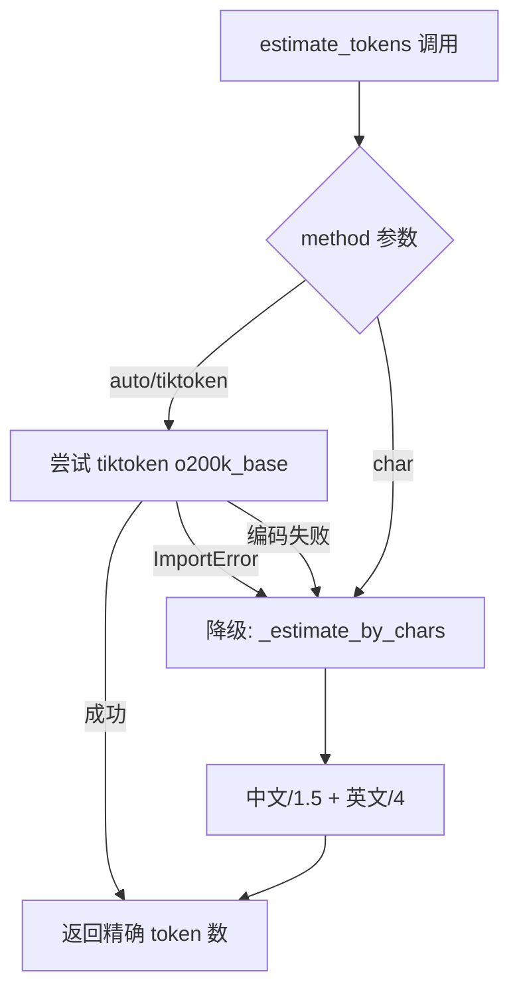
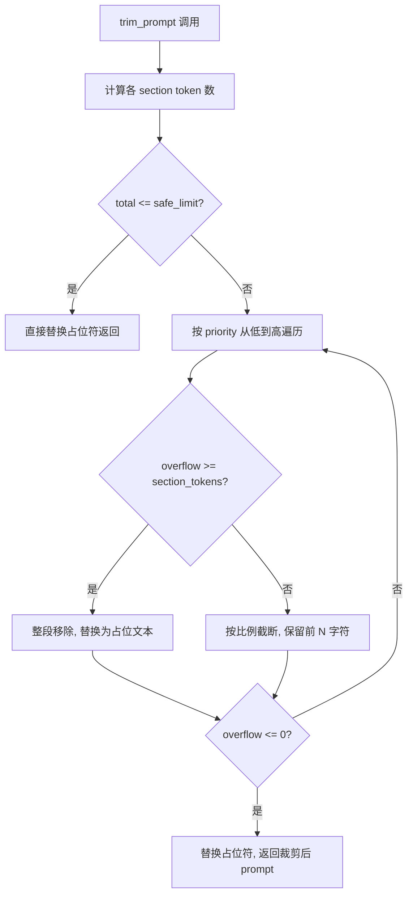
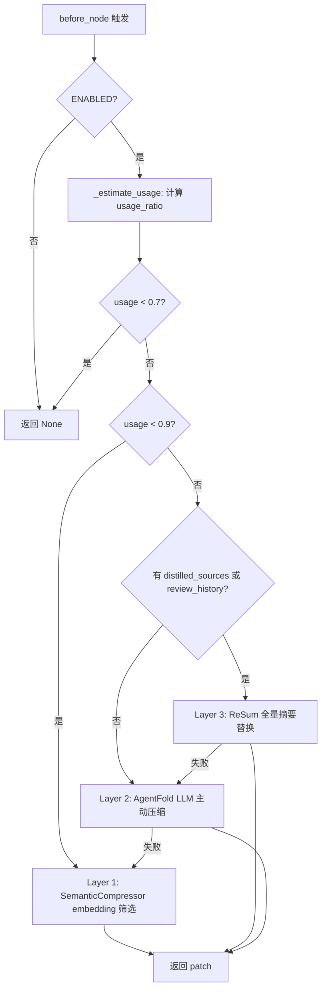

# PD-01.07 vibe-blog — 三层上下文管理中间件（AgentFold + ReSum 融合）

> 文档编号：PD-01.07
> 来源：vibe-blog `backend/services/blog_generator/context_management_middleware.py`
> GitHub：https://github.com/datawhalechina/vibe-blog.git
> 问题域：PD-01 上下文管理 Context Window Management
> 状态：可复用方案

---

## 第 1 章 问题与动机

### 1.1 核心问题

vibe-blog 是一个基于 LangGraph 的多 Agent 长文博客生成系统，单次生成流程涉及 15+ 个节点（researcher → planner → writer → questioner → reviewer → humanizer → assembler 等），每个节点都会向 state 中累积大量文本：搜索结果、大纲、章节内容、审核历史、知识增强数据等。

在 medium/long 模式下，state 中的文本总量很容易突破 128K token 上限（GPT-4o）甚至逼近 200K（Claude）。如果不做上下文管理，后续节点（如 reviewer、humanizer）会因为 prompt 超限而直接报错，或者因为上下文过长导致 LLM 注意力分散、输出质量下降。

核心挑战在于：这不是简单的对话历史压缩问题，而是**多源异构数据**（搜索结果、章节内容、审核记录、知识库文档）在 DAG 工作流中的动态管理问题。

### 1.2 vibe-blog 的解法概述

vibe-blog 实现了一套三层递进式上下文管理体系，由三个独立但协作的组件构成：

1. **ContextGuard**（`backend/utils/context_guard.py:104`）— 底层守卫，负责 token 估算和按优先级裁剪 prompt 模板中的各段内容
2. **ContextCompressor**（`backend/utils/context_compressor.py:16`）— 中层压缩器，按 usage_ratio 分级压缩消息列表（工具结果替换、搜索结果去重截断、修订历史压缩）
3. **ContextManagementMiddleware**（`backend/services/blog_generator/context_management_middleware.py:32`）— 顶层中间件，融合 AgentFold（LLM 主动压缩）和 ReSum（增量摘要替换），通过 MiddlewarePipeline 在每个 LangGraph 节点执行前自动调度
4. **SemanticCompressor**（`backend/services/blog_generator/services/semantic_compressor.py:86`）— Layer 1 的 embedding 语义筛选引擎
5. **TokenBudgetMiddleware**（`backend/services/blog_generator/middleware.py:229`）— 节点级 token 预算分配，按权重为不同 Agent 分配预算

### 1.3 设计思想

| 设计原则 | 具体实现 | 理由 | 替代方案 |
|----------|----------|------|----------|
| 三层递进压缩 | L1 embedding 筛选 → L2 LLM 压缩 → L3 全量摘要 | 低成本操作优先，LLM 压缩仅在必要时触发 | 单一 LLM 压缩（成本高） |
| 中间件透明注入 | 通过 MiddlewarePipeline.wrap_node() 包装 | 节点代码无需感知压缩逻辑，关注点分离 | 在每个 Agent 内部手动调用 |
| 双模式 token 估算 | tiktoken 优先，字符估算降级 | tiktoken 精确但有依赖，字符估算零依赖 | 仅用 tiktoken（无降级） |
| 环境变量驱动阈值 | FOLD_THRESHOLD=0.7, SUMMARY_THRESHOLD=0.9 | 不同模型/场景可调，无需改代码 | 硬编码阈值 |
| 安全系数预留 | SAFETY_MARGIN_RATIO=0.85，再减 max_output_tokens + 1000 buffer | 为输出和系统开销预留空间 | 用满上下文窗口 |
| 层间降级链 | L3 失败 → L2，L2 失败 → L1 | 任何一层失败不阻断流程 | 失败直接报错 |

---

## 第 2 章 源码实现分析

### 2.1 架构概览

vibe-blog 的上下文管理体系分为四个层次，通过 MiddlewarePipeline 串联：

```
┌─────────────────────────────────────────────────────────────────┐
│                    MiddlewarePipeline                            │
│  ┌──────────┐ ┌──────────┐ ┌─────────────────────┐ ┌────────┐ │
│  │ Tracing  │→│ Reducer  │→│ ContextManagement   │→│ Token  │ │
│  │ MW       │ │ MW       │ │ Middleware (L1/L2/L3)│ │ Budget │ │
│  └──────────┘ └──────────┘ └─────────────────────┘ └────────┘ │
│                                    │                            │
│                    ┌───────────────┼───────────────┐            │
│                    ▼               ▼               ▼            │
│              ContextGuard   SemanticCompressor  LLM Service     │
│              (token 估算     (embedding 筛选)   (主动压缩)      │
│               + 裁剪)                                           │
└─────────────────────────────────────────────────────────────────┘
                              │
                    ┌─────────▼─────────┐
                    │  ContextCompressor │
                    │  (消息级分级压缩)   │
                    └───────────────────┘
```

数据流：每个 LangGraph 节点执行前，MiddlewarePipeline 按注册顺序调用所有中间件的 `before_node()`。ContextManagementMiddleware 在此阶段估算当前 state 的 token 使用率，根据阈值选择 Layer 1/2/3 压缩策略，将压缩后的数据作为 patch 合并回 state。

### 2.2 核心实现

#### 2.2.1 ContextGuard — Token 估算与优先级裁剪



对应源码 `backend/utils/context_guard.py:45-76`：

```python
def estimate_tokens(text: str, method: str = "auto") -> int:
    if not text:
        return 0
    if method == "char":
        return _estimate_by_chars(text)
    if method in ("tiktoken", "auto"):
        try:
            import tiktoken
            if not hasattr(estimate_tokens, "_encoder"):
                try:
                    estimate_tokens._encoder = tiktoken.get_encoding("o200k_base")
                except Exception:
                    estimate_tokens._encoder = tiktoken.get_encoding("cl100k_base")
            return len(estimate_tokens._encoder.encode(text))
        except ImportError:
            if method == "tiktoken":
                logger.warning("tiktoken 未安装，降级为字符估算")
            return _estimate_by_chars(text)
        except Exception as e:
            logger.warning(f"tiktoken 编码失败: {e}，降级为字符估算")
            return _estimate_by_chars(text)
    return _estimate_by_chars(text)
```

关键设计点：
- **编码器缓存**：`estimate_tokens._encoder` 作为函数属性缓存，避免重复初始化（`context_guard.py:63`）
- **双编码器降级**：优先 `o200k_base`（GPT-4o 系列），失败回退 `cl100k_base`（GPT-3.5/4 系列）（`context_guard.py:64-66`）
- **中英文混合估算**：`_estimate_by_chars` 对中文按 1.5 字/token、英文按 4 字符/token 估算（`context_guard.py:80-83`）

#### 2.2.2 ContextGuard.trim_prompt — 按优先级裁剪



对应源码 `backend/utils/context_guard.py:153-232`：

```python
def trim_prompt(self, prompt: str, sections: Dict[str, str],
                priority: List[str] = None) -> Tuple[str, Dict]:
    if priority is None:
        priority = ["research", "existing_content", "outline", "instructions"]
    section_tokens = {name: estimate_tokens(content) for name, content in sections.items()}
    total_tokens = sum(section_tokens.values())
    # ...
    if total_tokens <= self.safe_input_limit:
        # 不需要裁剪
        final_prompt = prompt
        for name, content in sections.items():
            final_prompt = final_prompt.replace(f"{{{name}}}", content)
        return final_prompt, trim_info

    # 按优先级从低到高裁剪
    overflow = total_tokens - self.safe_input_limit
    for section_name in priority:
        if overflow <= 0:
            break
        content = trimmed_sections[section_name]
        stc = section_tokens[section_name]
        if overflow >= stc:
            trimmed_sections[section_name] = f"[{section_name} 已裁剪以适应上下文窗口]"
            overflow -= stc
        else:
            keep_ratio = 1 - (overflow / stc)
            keep_chars = int(len(content) * keep_ratio)
            trimmed_sections[section_name] = content[:keep_chars] + f"\n\n... [{section_name} 已截断，保留 {keep_ratio:.0%}] ..."
            overflow = 0
```

默认裁剪优先级：`research` → `existing_content` → `outline` → `instructions`，即搜索素材最先被裁，指令最后被裁。

#### 2.2.3 ContextManagementMiddleware — 三层递进压缩



对应源码 `backend/services/blog_generator/context_management_middleware.py:54-80`：

```python
def before_node(self, state: Dict[str, Any], node_name: str) -> Optional[Dict[str, Any]]:
    if os.getenv("CONTEXT_COMPRESSION_MIDDLEWARE_ENABLED", "false").lower() != "true":
        return None
    usage = self._estimate_usage(state)
    if usage < FOLD_THRESHOLD:
        return None
    patch: Dict[str, Any] = {"_context_usage_ratio": usage}
    if usage < SUMMARY_THRESHOLD:
        layer_patch = self._apply_layer1(state, node_name)
    else:
        has_extra_context = bool(
            state.get("distilled_sources") or state.get("review_history")
        )
        if has_extra_context:
            layer_patch = self._apply_layer3(state, node_name)
        else:
            layer_patch = self._apply_layer2(state, node_name)
    patch.update(layer_patch)
    return patch if len(patch) > 1 else None
```

### 2.3 实现细节

**Layer 1 — SemanticCompressor embedding 筛选**（`semantic_compressor.py:86-150`）：
- 将 query 和搜索结果做 embedding，按余弦相似度排序保留 top-K
- 支持 OpenAI embedding 和本地 TF-IDF 近似 embedding 双模式
- 本地模式零外部依赖，作为 OpenAI 不可用时的降级方案

**Layer 2 — AgentFold 式 LLM 主动压缩**（`context_management_middleware.py:117-139`）：
- 仅压缩 `research_data` 字段，截取前 8000 字符送入 LLM
- 压缩失败时降级到 Layer 1
- 维护 `_compression_count` 计数器追踪压缩次数

**Layer 3 — ReSum 增量摘要替换**（`context_management_middleware.py:141-174`）：
- 合并 `research_data`、`distilled_sources`、`review_history` 三个字段
- 支持增量摘要：如果有上次摘要（`_last_summary`），使用增量 prompt 而非全量 prompt
- 压缩后清空 `distilled_sources`，将摘要写入 `research_data`
- 失败时降级到 Layer 2

**ContextCompressor 消息级压缩**（`context_compressor.py:65-90`）：
- 按 usage_ratio 四级策略：<70% 不压缩、70-85% 保留最近 3 个工具结果、85-95% 保留最近 1 个 + 裁剪长消息、>95% 交给 ContextGuard 兜底
- 工具结果替换为占位文本而非删除，保持消息列表结构完整

**TokenBudgetMiddleware 节点预算分配**（`middleware.py:229-278`）：
- 按权重为不同节点分配 token 预算：writer 35%、revision 15%、researcher/planner/reviewer 各 10%
- 总预算使用超 80% 时主动触发 ContextCompressor 压缩

**Agent 场景定制压缩**（`context_compressor.py:138-159`）：
- `compress_for_writer`：只给 Writer 当前章节 + 前后章节摘要 + 相关搜索结果
- `compress_for_reviewer`：给 Reviewer 完整大纲 + 全文摘要 + 上轮审核摘要

---

## 第 3 章 迁移指南

### 3.1 迁移清单

**阶段 1：基础 — ContextGuard（1 个文件）**
- [ ] 复制 `context_guard.py`，根据项目使用的模型调整 `MODEL_CONTEXT_LIMITS`
- [ ] 在 LLM 调用前调用 `guard.check(messages)` 检查是否超限
- [ ] 如果使用 prompt 模板，用 `guard.trim_prompt()` 自动裁剪

**阶段 2：消息压缩 — ContextCompressor（1 个文件）**
- [ ] 复制 `context_compressor.py`，根据项目的消息格式调整 `filter_tool_results`
- [ ] 在 LLM 调用前调用 `compressor.apply_strategy(messages, usage_ratio)` 压缩消息列表
- [ ] 为不同 Agent 角色实现定制化的 `compress_for_xxx` 方法

**阶段 3：中间件集成 — ContextManagementMiddleware（需要中间件管道）**
- [ ] 如果项目有中间件管道（如 LangGraph、LangChain），复制 `context_management_middleware.py`
- [ ] 配置 `CONTEXT_FOLD_THRESHOLD` 和 `CONTEXT_SUMMARY_THRESHOLD` 环境变量
- [ ] 可选：集成 SemanticCompressor（需要 embedding 服务）

### 3.2 适配代码模板

**最小可用版本 — 仅 ContextGuard：**

```python
from context_guard import ContextGuard, estimate_tokens

# 初始化
guard = ContextGuard(model_name="gpt-4o", max_output_tokens=4096)

# 在 LLM 调用前检查
def safe_llm_call(messages: list, llm_client) -> str:
    result = guard.check(messages)
    if not result["is_safe"]:
        # 方案 A：使用 trim_prompt 裁剪模板
        prompt_template = "{instructions}\n\n{research}\n\n{content}"
        sections = {
            "instructions": system_prompt,
            "research": research_data,
            "content": user_content,
        }
        trimmed_prompt, trim_info = guard.trim_prompt(
            prompt_template, sections,
            priority=["research", "content", "instructions"]  # 低优先级先裁
        )
        messages = [{"role": "user", "content": trimmed_prompt}]

    return llm_client.chat(messages=messages)
```

**完整版 — 三层中间件集成到 LangGraph：**

```python
from context_management_middleware import ContextManagementMiddleware
from middleware import MiddlewarePipeline, TokenBudgetMiddleware

# 构建中间件管道
pipeline = MiddlewarePipeline(middlewares=[
    ContextManagementMiddleware(
        llm_service=llm_client,
        model_name="gpt-4o",
    ),
    TokenBudgetMiddleware(total_budget=500_000),
])

# 包装 LangGraph 节点
workflow = StateGraph(MyState)
workflow.add_node("researcher", pipeline.wrap_node("researcher", researcher_fn))
workflow.add_node("writer", pipeline.wrap_node("writer", writer_fn))
```

### 3.3 适用场景

| 场景 | 适用度 | 说明 |
|------|--------|------|
| 多 Agent DAG 工作流 | ⭐⭐⭐ | 最佳场景，中间件管道天然适配 |
| 单轮长 prompt 生成 | ⭐⭐⭐ | ContextGuard.trim_prompt 直接可用 |
| 多轮对话系统 | ⭐⭐ | 需要改造 ContextCompressor 的消息格式处理 |
| RAG 检索增强 | ⭐⭐⭐ | SemanticCompressor 可直接用于检索结果筛选 |
| 实时聊天 | ⭐ | 三层压缩延迟较高，不适合实时场景 |

---

## 第 4 章 测试用例

基于 `backend/tests/test_context_guard.py` 的真实测试，扩展覆盖三层压缩：

```python
import pytest
from unittest.mock import MagicMock, patch
from context_guard import ContextGuard, estimate_tokens, _estimate_by_chars, get_context_limit
from context_compressor import ContextCompressor
from context_management_middleware import ContextManagementMiddleware


class TestEstimateTokens:
    """Token 估算测试"""

    def test_empty_string(self):
        assert estimate_tokens("") == 0

    def test_char_method_english(self):
        assert estimate_tokens("a" * 400, method="char") == 100  # 400/4

    def test_char_method_chinese(self):
        assert estimate_tokens("你" * 150, method="char") == 100  # 150/1.5

    def test_auto_with_tiktoken(self):
        tokens = estimate_tokens("Hello world", method="auto")
        assert tokens > 0

    def test_tiktoken_fallback(self):
        """tiktoken 不可用时降级为字符估算"""
        with patch.dict('sys.modules', {'tiktoken': None}):
            if hasattr(estimate_tokens, '_encoder'):
                delattr(estimate_tokens, '_encoder')
            tokens = estimate_tokens("a" * 400, method="auto")
            assert tokens > 0


class TestContextGuard:
    """ContextGuard 核心功能测试"""

    def test_safe_check(self):
        guard = ContextGuard("gpt-4o", max_output_tokens=4096)
        result = guard.check([{"role": "user", "content": "Hello"}])
        assert result["is_safe"] is True

    def test_overflow_detection(self):
        guard = ContextGuard("gpt-4", max_output_tokens=4096)
        result = guard.check([{"role": "user", "content": "x" * 100000}])
        assert result["is_safe"] is False
        assert result["overflow_tokens"] > 0

    def test_trim_prompt_no_trim(self):
        guard = ContextGuard("gpt-4o")
        prompt = "{instructions}\n{research}"
        sections = {"instructions": "Write", "research": "Data"}
        result, info = guard.trim_prompt(prompt, sections)
        assert info["trimmed"] is False

    def test_trim_prompt_removes_low_priority(self):
        guard = ContextGuard("gpt-4", max_output_tokens=4096)
        prompt = "{instructions}\n{research}"
        sections = {"instructions": "Write", "research": "data " * 10000}
        _, info = guard.trim_prompt(prompt, sections, priority=["research", "instructions"])
        assert info["trimmed"] is True
        assert info["trimmed_sections"][0]["section"] == "research"


class TestContextCompressor:
    """ContextCompressor 分级压缩测试"""

    def test_no_compression_below_70(self):
        compressor = ContextCompressor()
        messages = [{"role": "user", "content": "test"}]
        result = compressor.apply_strategy(messages, usage_ratio=0.5)
        assert result == messages

    def test_tool_filter_at_70_85(self):
        compressor = ContextCompressor()
        messages = [
            {"role": "user", "content": "q"},
            {"role": "tool", "content": "old result 1"},
            {"role": "tool", "content": "old result 2"},
            {"role": "tool", "content": "old result 3"},
            {"role": "tool", "content": "recent result"},
        ]
        result = compressor.apply_strategy(messages, usage_ratio=0.75)
        # keep_recent=3, 第一个 tool 应被替换
        assert "omitted" in result[1]["content"]

    def test_aggressive_at_85_plus(self):
        compressor = ContextCompressor()
        messages = [
            {"role": "user", "content": "q"},
            {"role": "assistant", "content": "x" * 5000},
        ]
        result = compressor.apply_strategy(messages, usage_ratio=0.90)
        assert len(result[1]["content"]) < 5000


class TestContextManagementMiddleware:
    """三层中间件测试"""

    def test_disabled_by_default(self):
        mw = ContextManagementMiddleware(model_name="gpt-4o")
        result = mw.before_node({}, "writer")
        assert result is None  # 默认关闭

    def test_layer1_triggered(self):
        """usage 70-90% 触发 Layer 1"""
        compressor = MagicMock()
        compressor.compress.return_value = [{"title": "compressed"}]
        mw = ContextManagementMiddleware(
            semantic_compressor=compressor, model_name="gpt-4o"
        )
        state = {
            "search_results": [{"title": f"r{i}"} for i in range(20)],
            "topic": "AI",
            "research_data": "x" * 80000,  # 触发 >70% usage
        }
        with patch.dict('os.environ', {'CONTEXT_COMPRESSION_MIDDLEWARE_ENABLED': 'true'}):
            with patch.object(mw, '_estimate_usage', return_value=0.75):
                result = mw.before_node(state, "writer")
        if result:
            assert result.get("_context_layer") == 1

    def test_layer_degradation(self):
        """Layer 2 失败应降级到 Layer 1"""
        llm = MagicMock()
        llm.chat.side_effect = Exception("LLM error")
        compressor = MagicMock()
        compressor.compress.return_value = []
        mw = ContextManagementMiddleware(
            llm_service=llm, semantic_compressor=compressor, model_name="gpt-4o"
        )
        state = {"research_data": "x" * 5000, "topic": "test"}
        with patch.dict('os.environ', {'CONTEXT_COMPRESSION_MIDDLEWARE_ENABLED': 'true'}):
            with patch.object(mw, '_estimate_usage', return_value=0.92):
                result = mw.before_node(state, "writer")
        # 不应抛异常，应降级处理
        assert result is None or isinstance(result, dict)
```

---

## 第 5 章 跨域关联

| 关联域 | 关系类型 | 说明 |
|--------|----------|------|
| PD-02 多 Agent 编排 | 依赖 | ContextManagementMiddleware 通过 MiddlewarePipeline 注入 LangGraph DAG，依赖编排层的节点包装机制 |
| PD-03 容错与重试 | 协同 | 三层降级链（L3→L2→L1）本身就是容错设计；ContextGuard 的 tiktoken→字符估算降级也是容错 |
| PD-04 工具系统 | 协同 | ContextCompressor.filter_tool_results 专门处理工具返回结果的压缩，工具结果是上下文膨胀的主要来源 |
| PD-07 质量检查 | 协同 | compress_for_reviewer 为 Reviewer Agent 定制压缩策略，确保审核时有足够上下文但不超限 |
| PD-08 搜索与检索 | 依赖 | SemanticCompressor 直接作用于搜索结果，compress_search_results 做去重+截断 |
| PD-10 中间件管道 | 依赖 | ContextManagementMiddleware 实现 NodeMiddleware 协议，通过 MiddlewarePipeline.wrap_node() 注入 |
| PD-11 可观测性 | 协同 | TokenBudgetMiddleware 追踪节点级 token 消耗，ContextManagementMiddleware 记录压缩层级和压缩次数 |

---

## 第 6 章 来源文件索引

| 文件 | 行范围 | 关键实现 |
|------|--------|----------|
| `backend/utils/context_guard.py` | L1-L233 | ContextGuard 类、estimate_tokens、trim_prompt、MODEL_CONTEXT_LIMITS |
| `backend/utils/context_compressor.py` | L1-L217 | ContextCompressor 类、apply_strategy 四级压缩、compress_for_writer/reviewer |
| `backend/services/blog_generator/context_management_middleware.py` | L1-L228 | ContextManagementMiddleware 三层压缩、ReSum prompt 模板 |
| `backend/services/blog_generator/services/semantic_compressor.py` | L1-L151 | SemanticCompressor、EmbeddingProvider 双模式 |
| `backend/services/blog_generator/middleware.py` | L229-L278 | TokenBudgetMiddleware 节点预算分配 |
| `backend/services/blog_generator/middleware.py` | L74-L174 | MiddlewarePipeline.wrap_node() 中间件注入机制 |
| `backend/services/blog_generator/generator.py` | L151-L169 | 中间件管道初始化，ContextManagementMiddleware 注册 |
| `backend/tests/test_context_guard.py` | L1-L175 | ContextGuard 完整单元测试 |

---

## 第 7 章 横向对比维度

```json comparison_data
{
  "project": "vibe-blog",
  "dimensions": {
    "估算方式": "tiktoken o200k_base 优先，降级字符估算（中文/1.5 + 英文/4）",
    "压缩策略": "三层递进：L1 embedding 筛选 → L2 LLM 主动压缩 → L3 ReSum 增量摘要",
    "触发机制": "usage_ratio 双阈值：0.7 触发 L1，0.9 触发 L2/L3",
    "实现位置": "MiddlewarePipeline 中间件，before_node 钩子透明注入",
    "容错设计": "三层降级链 L3→L2→L1 + tiktoken→字符估算降级",
    "Prompt模板化": "trim_prompt 占位符替换 + ReSum 初始/增量双 prompt 模板",
    "子Agent隔离": "compress_for_writer/reviewer 按角色定制上下文视图",
    "保留策略": "低优先级先裁（research→content→instructions），工具结果替换为占位文本",
    "累计预算": "TokenBudgetMiddleware 按节点权重分配预算，总预算 500K token",
    "查询驱动预算": "无，使用固定权重分配（writer 35%、revision 15%）",
    "批量并发控制": "无并发压缩，中间件串行执行",
    "压缩效果验证": "无显式验证，依赖 usage_ratio 阈值判断",
    "Agent审查工作流": "无，压缩自动执行无人工确认"
  }
}
```

### 域元数据补充

```json domain_metadata
{
  "solution_summary": "vibe-blog 用三层递进中间件（L1 embedding 筛选 + L2 AgentFold LLM 压缩 + L3 ReSum 增量摘要）配合 ContextGuard 双模式 token 估算和按优先级 prompt 裁剪，实现 DAG 工作流中多源异构数据的自动上下文管理",
  "description": "DAG 工作流中多源异构数据（搜索结果、章节、审核历史）的中间件式自动压缩",
  "sub_problems": [
    "Agent 角色定制压缩：为 Writer/Reviewer 等不同角色提供差异化的上下文视图",
    "节点级 token 预算权重分配：按 Agent 重要性分配 token 预算比例",
    "增量摘要与全量摘要切换：根据是否有历史摘要选择增量或全量 ReSum 策略",
    "中间件透明注入：通过 wrap_node 包装使节点代码无需感知压缩逻辑"
  ],
  "best_practices": [
    "低成本操作优先：embedding 筛选成本远低于 LLM 压缩，应作为第一道防线",
    "工具结果替换而非删除：保持消息列表结构完整，避免悬挂引用",
    "环境变量驱动阈值：FOLD_THRESHOLD 和 SUMMARY_THRESHOLD 可运行时调整",
    "编码器双降级：o200k_base → cl100k_base → 字符估算，覆盖所有模型系列"
  ]
}
```
