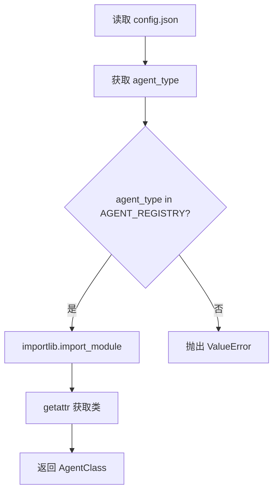
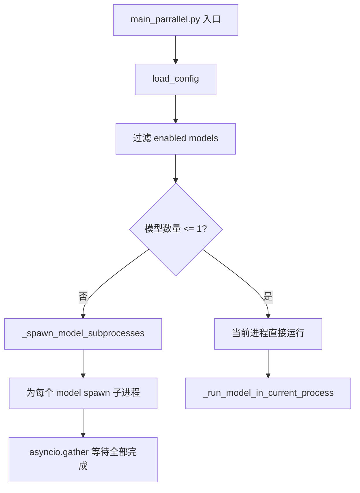
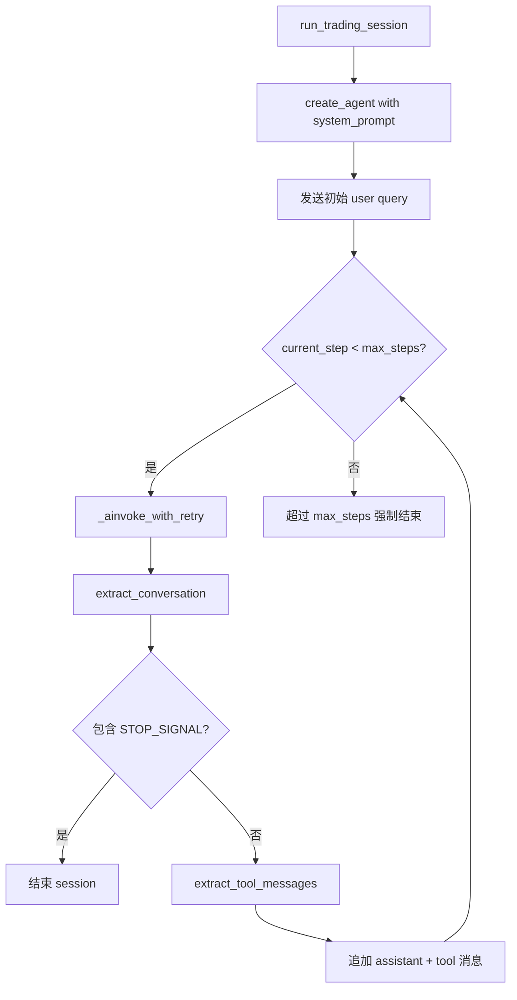

# PD-02.AI-Trader AI-Trader — 进程级多模型并行竞赛编排

> 文档编号：PD-02.AI-Trader
> 来源：AI-Trader `main_parrallel.py`, `main.py`, `agent/base_agent/base_agent.py`
> GitHub：https://github.com/HKUDS/AI-Trader.git
> 问题域：PD-02 多 Agent 编排 Multi-Agent Orchestration
> 状态：可复用方案

---

## 第 1 章 问题与动机

### 1.1 核心问题

在量化交易场景中，不同 LLM 模型（GPT-5、Claude 3.7 Sonnet、DeepSeek V3.1、Qwen3-Max、Gemini 2.5 Flash）对市场信号的理解和交易决策存在显著差异。如何让多个 LLM 模型在相同市场条件下独立运行交易策略，形成"竞赛"格局，从而通过实际收益对比评估不同模型的交易能力？

这不是传统的多 Agent 协作问题（多个 Agent 合作完成一个任务），而是**多 Agent 竞争问题**——每个 Agent 独立决策、独立持仓、独立核算，最终通过收益率排名评判优劣。

### 1.2 AI-Trader 的解法概述

AI-Trader 采用了一种极简但有效的编排方案：

1. **AGENT_REGISTRY 动态加载**：通过字典注册表 + `importlib` 动态导入，支持 5 种 Agent 类型（`main.py:16-37`）
2. **JSON 配置驱动**：所有模型、日期范围、Agent 参数均通过 `configs/*.json` 声明，零代码切换实验配置（`configs/default_config.json`）
3. **进程级并行隔离**：`main_parrallel.py` 在多模型场景下为每个模型 spawn 独立子进程，通过 `RUNTIME_ENV_PATH` 环境变量实现运行时配置隔离（`main_parrallel.py:171-188`）
4. **市场多态适配**：同一编排逻辑通过 `agent_type` 字段自动路由到 US/CN/Crypto 三种市场的 Agent 实现（`main.py:128-139`）
5. **STOP_SIGNAL 收敛**：Agent 内部通过 `<FINISH_SIGNAL>` 标记自主判断交易完成，编排层无需干预（`prompts/agent_prompt.py:23`）

### 1.3 设计思想

| 设计原则 | 具体实现 | 理由 | 替代方案 |
|----------|----------|------|----------|
| 进程级隔离 | 每个模型 spawn 独立 Python 子进程 | 避免 asyncio 事件循环冲突和全局状态污染 | 线程池（有 GIL 限制）、容器级隔离（过重） |
| 配置驱动 | JSON 文件声明模型列表和 enabled 标志 | 实验可复现，无需改代码即可切换模型组合 | 命令行参数（不够结构化）、环境变量（难管理多模型） |
| 注册表模式 | AGENT_REGISTRY dict + importlib 动态导入 | 新增 Agent 类型只需加一行注册，不改编排逻辑 | if-else 分支（不可扩展）、插件系统（过度设计） |
| 自主收敛 | Agent 输出 STOP_SIGNAL 自行终止 | 交易决策完成时机由 LLM 自主判断，编排层不强制 | 固定步数截断（可能截断未完成的分析） |
| 运行时环境隔离 | 每个 signature 独立的 .runtime_env.json | 并行进程间配置不互相覆盖 | 共享配置文件加锁（复杂且易死锁） |

---

## 第 2 章 源码实现分析

### 2.1 架构概览

AI-Trader 的编排架构分为三层：配置层、编排层、执行层。

```
┌─────────────────────────────────────────────────────────┐
│                    配置层 (configs/*.json)                │
│  agent_type + models[] + date_range + agent_config      │
└──────────────────────┬──────────────────────────────────┘
                       │
┌──────────────────────▼──────────────────────────────────┐
│              编排层 (main_parrallel.py / main.py)        │
│                                                          │
│  ┌─────────────┐  ┌─────────────┐  ┌─────────────┐     │
│  │ subprocess  │  │ subprocess  │  │ subprocess  │     │
│  │ GPT-5       │  │ Claude 3.7  │  │ Qwen3-Max   │     │
│  │ signature=  │  │ signature=  │  │ signature=  │     │
│  │ "gpt-5"     │  │ "claude-3.7"│  │ "qwen3-max" │     │
│  └──────┬──────┘  └──────┬──────┘  └──────┬──────┘     │
└─────────┼────────────────┼────────────────┼─────────────┘
          │                │                │
┌─────────▼────────────────▼────────────────▼─────────────┐
│              执行层 (BaseAgent / BaseAgentCrypto 等)      │
│                                                          │
│  AGENT_REGISTRY → importlib → AgentClass                │
│  initialize() → MCP tools → LangChain Agent             │
│  run_date_range() → run_trading_session() × N days      │
│  STOP_SIGNAL → 自主收敛                                  │
└─────────────────────────────────────────────────────────┘
```

### 2.2 核心实现

#### 2.2.1 AGENT_REGISTRY 动态加载



对应源码 `main.py:16-73`：

```python
# Agent class mapping table - for dynamic import and instantiation
AGENT_REGISTRY = {
    "BaseAgent": {
        "module": "agent.base_agent.base_agent",
        "class": "BaseAgent"
    },
    "BaseAgent_Hour": {
        "module": "agent.base_agent.base_agent_hour",
        "class": "BaseAgent_Hour"
    },
    "BaseAgentAStock": {
        "module": "agent.base_agent_astock.base_agent_astock",
        "class": "BaseAgentAStock"
    },
    "BaseAgentAStock_Hour": {
        "module": "agent.base_agent_astock.base_agent_astock_hour",
        "class": "BaseAgentAStock_Hour"
    },
    "BaseAgentCrypto": {
        "module": "agent.base_agent_crypto.base_agent_crypto",
        "class": "BaseAgentCrypto"
    }
}

def get_agent_class(agent_type):
    if agent_type not in AGENT_REGISTRY:
        supported_types = ", ".join(AGENT_REGISTRY.keys())
        raise ValueError(f"Unsupported agent type: {agent_type}\nSupported: {supported_types}")
    agent_info = AGENT_REGISTRY[agent_type]
    module = importlib.import_module(agent_info["module"])
    return getattr(module, agent_info["class"])
```

#### 2.2.2 进程级并行编排



对应源码 `main_parrallel.py:171-188` 和 `main_parrallel.py:255-262`：

```python
async def _spawn_model_subprocesses(config_path, enabled_models):
    tasks = []
    python_exec = sys.executable
    this_file = str(Path(__file__).resolve())
    for model in enabled_models:
        signature = model.get("signature")
        if not signature:
            continue
        cmd = [python_exec, this_file]
        if config_path:
            cmd.append(str(config_path))
        cmd.extend(["--signature", signature])
        proc = await asyncio.create_subprocess_exec(*cmd)
        tasks.append(proc.wait())
    if not tasks:
        return
    await asyncio.gather(*tasks)

# 入口判断：单模型直接运行，多模型 spawn 子进程
if len(enabled_models) <= 1:
    for model_config in enabled_models:
        await _run_model_in_current_process(AgentClass, model_config, ...)
else:
    await _spawn_model_subprocesses(config_path, enabled_models)
```

关键设计：每个子进程通过 `--signature` 参数过滤到自己负责的模型，复用同一个 `main_parrallel.py` 脚本。子进程内部设置独立的 `RUNTIME_ENV_PATH`（`main_parrallel.py:120-123`）：

```python
runtime_env_dir = project_root / "data" / "agent_data" / signature
runtime_env_dir.mkdir(parents=True, exist_ok=True)
runtime_env_path = runtime_env_dir / ".runtime_env.json"
os.environ["RUNTIME_ENV_PATH"] = str(runtime_env_path)
```

#### 2.2.3 交易循环与自主收敛



对应源码 `agent/base_agent/base_agent.py:437-519`，Agent 内部的交易循环是一个 while 循环，每轮调用 LLM 并检查 STOP_SIGNAL。LLM 通过 MCP 工具执行实际交易操作（查价格、下单、搜索新闻），当 LLM 认为当日交易分析完成时输出 `<FINISH_SIGNAL>` 自行终止。

### 2.3 实现细节

**DeepSeek 兼容层**：AI-Trader 发现 DeepSeek 模型返回的 `tool_calls.args` 是 JSON 字符串而非字典，因此创建了 `DeepSeekChatOpenAI` 子类（`agent/base_agent/base_agent.py:39-94`），在 `_generate` 和 `_agenerate` 中自动修复格式。这是多模型编排中常见的供应商兼容性问题。

**MCP 服务管理**：`MCPServiceManager`（`agent_tools/start_mcp_services.py:20-297`）管理 5 个 MCP 服务进程（Math、Search、Trade、Price、Crypto），支持端口冲突检测和自动端口分配。每个 Agent 通过 `MultiServerMCPClient` 连接到这些共享的 MCP 服务。

**运行时配置隔离**：`general_tools.py:10-69` 实现了基于 JSON 文件的运行时配置系统。每个 Agent signature 有独立的 `.runtime_env.json`，通过 `RUNTIME_ENV_PATH` 环境变量定位。`get_config_value` 优先读 JSON 文件，fallback 到环境变量。

**市场多态**：同一 `main.py` 通过 `agent_type` 自动检测市场类型（`main.py:128-139`）：BaseAgentAStock → cn，BaseAgentCrypto → crypto，其他 → us。不同市场使用不同的默认股票池（NASDAQ 100 / SSE 50 / Bitwise 10）。

---

## 第 3 章 迁移指南

### 3.1 迁移清单

**阶段 1：注册表 + 配置驱动（1 天）**
- [ ] 定义 `AGENT_REGISTRY` 字典，注册所有 Agent 类型的 module path 和 class name
- [ ] 实现 `get_agent_class(agent_type)` 动态加载函数
- [ ] 创建 JSON 配置文件模板，包含 `agent_type`、`models[]`（含 enabled 标志）、`agent_config`

**阶段 2：进程级并行（1 天）**
- [ ] 实现 `_spawn_model_subprocesses()`：为每个 enabled model spawn 独立子进程
- [ ] 实现 `--signature` 参数过滤，使子进程只运行自己负责的模型
- [ ] 为每个 signature 创建独立的运行时配置目录（`data/{signature}/.runtime_env.json`）

**阶段 3：Agent 执行层（2 天）**
- [ ] 实现 BaseAgent 基类：`initialize()` → `run_date_range()` → `run_trading_session()`
- [ ] 实现 STOP_SIGNAL 自主收敛机制
- [ ] 实现 `_ainvoke_with_retry()` 指数退避重试

**阶段 4：多模型兼容（按需）**
- [ ] 为有格式差异的模型（如 DeepSeek）创建 ChatOpenAI 子类修复 tool_calls 格式

### 3.2 适配代码模板

以下是一个可直接复用的进程级并行编排模板：

```python
import asyncio
import sys
import json
import importlib
import argparse
from pathlib import Path

# === 1. Agent 注册表 ===
AGENT_REGISTRY = {
    "WorkerAgent": {
        "module": "agents.worker",
        "class": "WorkerAgent"
    },
    "AnalystAgent": {
        "module": "agents.analyst",
        "class": "AnalystAgent"
    },
}

def get_agent_class(agent_type: str):
    if agent_type not in AGENT_REGISTRY:
        raise ValueError(f"Unknown agent_type: {agent_type}")
    info = AGENT_REGISTRY[agent_type]
    module = importlib.import_module(info["module"])
    return getattr(module, info["class"])

# === 2. 配置加载 ===
def load_config(path: str = None) -> dict:
    config_path = Path(path) if path else Path("configs/default.json")
    with open(config_path, "r") as f:
        return json.load(f)

# === 3. 单模型运行 ===
async def run_single(config: dict, model_config: dict):
    AgentClass = get_agent_class(config["agent_type"])
    agent = AgentClass(
        signature=model_config["signature"],
        model_name=model_config["basemodel"],
    )
    await agent.initialize()
    await agent.run()

# === 4. 进程级并行 ===
async def spawn_parallel(config_path: str, models: list):
    tasks = []
    for model in models:
        sig = model["signature"]
        cmd = [sys.executable, __file__, config_path, "--signature", sig]
        proc = await asyncio.create_subprocess_exec(*cmd)
        tasks.append(proc.wait())
    await asyncio.gather(*tasks)

# === 5. 入口 ===
async def main(config_path=None, only_signature=None):
    config = load_config(config_path)
    models = [m for m in config["models"] if m.get("enabled", True)]
    if only_signature:
        models = [m for m in models if m["signature"] == only_signature]
    
    if len(models) <= 1:
        for m in models:
            await run_single(config, m)
    else:
        await spawn_parallel(config_path, models)

if __name__ == "__main__":
    parser = argparse.ArgumentParser()
    parser.add_argument("config", nargs="?", default=None)
    parser.add_argument("--signature", default=None)
    args = parser.parse_args()
    asyncio.run(main(args.config, args.signature))
```

### 3.3 适用场景

| 场景 | 适用度 | 说明 |
|------|--------|------|
| 多 LLM 模型 A/B 测试 | ⭐⭐⭐ | 核心场景：相同任务、不同模型、独立评估 |
| 多策略并行回测 | ⭐⭐⭐ | 不同交易策略同时运行，对比收益 |
| 多 Agent 独立任务 | ⭐⭐ | 任务间无依赖的批量执行 |
| 需要 Agent 间协作的场景 | ⭐ | 不适用：AI-Trader 的 Agent 间完全隔离，无通信机制 |
| DAG 依赖编排 | ⭐ | 不适用：仅支持扁平并行，无依赖图 |

---

## 第 4 章 测试用例

```python
import asyncio
import json
import os
import tempfile
from pathlib import Path
from unittest.mock import AsyncMock, MagicMock, patch

import pytest


class TestAgentRegistry:
    """测试 AGENT_REGISTRY 动态加载机制"""

    def test_get_agent_class_valid_type(self):
        """正常路径：已注册的 agent_type 应返回对应类"""
        from main import AGENT_REGISTRY, get_agent_class
        
        # BaseAgent 是默认注册的类型
        AgentClass = get_agent_class("BaseAgent")
        assert AgentClass.__name__ == "BaseAgent"

    def test_get_agent_class_invalid_type(self):
        """边界情况：未注册的 agent_type 应抛出 ValueError"""
        from main import get_agent_class
        
        with pytest.raises(ValueError, match="Unsupported agent type"):
            get_agent_class("NonExistentAgent")

    def test_registry_completeness(self):
        """结构验证：每个注册项必须包含 module 和 class 字段"""
        from main import AGENT_REGISTRY
        
        for agent_type, info in AGENT_REGISTRY.items():
            assert "module" in info, f"{agent_type} missing 'module'"
            assert "class" in info, f"{agent_type} missing 'class'"


class TestParallelOrchestration:
    """测试进程级并行编排"""

    def test_single_model_runs_in_process(self):
        """单模型时应在当前进程运行，不 spawn 子进程"""
        from main_parrallel import main
        
        config = {
            "agent_type": "BaseAgent",
            "date_range": {"init_date": "2025-01-01", "end_date": "2025-01-02"},
            "models": [{"name": "test", "basemodel": "gpt-4", "signature": "test-sig", "enabled": True}],
            "agent_config": {"max_steps": 1, "max_retries": 1},
            "log_config": {"log_path": "/tmp/test"}
        }
        # 验证单模型不触发 subprocess spawn
        assert len([m for m in config["models"] if m.get("enabled")]) <= 1

    def test_multi_model_triggers_subprocess(self):
        """多模型时应触发子进程 spawn"""
        enabled_models = [
            {"signature": "gpt-5", "enabled": True},
            {"signature": "claude-3.7", "enabled": True},
        ]
        assert len(enabled_models) > 1  # 触发并行分支

    def test_signature_filter(self):
        """--signature 参数应正确过滤到单个模型"""
        models = [
            {"signature": "gpt-5", "enabled": True},
            {"signature": "claude-3.7", "enabled": True},
        ]
        only_signature = "gpt-5"
        filtered = [m for m in models if m["signature"] == only_signature]
        assert len(filtered) == 1
        assert filtered[0]["signature"] == "gpt-5"


class TestRuntimeConfigIsolation:
    """测试运行时配置隔离"""

    def test_write_and_read_config(self):
        """配置写入后应能正确读取"""
        with tempfile.NamedTemporaryFile(suffix=".json", delete=False) as f:
            tmp_path = f.name
        
        try:
            os.environ["RUNTIME_ENV_PATH"] = tmp_path
            from tools.general_tools import write_config_value, get_config_value
            
            write_config_value("TEST_KEY", "test_value")
            assert get_config_value("TEST_KEY") == "test_value"
        finally:
            os.unlink(tmp_path)
            del os.environ["RUNTIME_ENV_PATH"]

    def test_config_isolation_between_signatures(self):
        """不同 signature 的配置应互不干扰"""
        with tempfile.TemporaryDirectory() as tmpdir:
            path_a = os.path.join(tmpdir, "agent_a", ".runtime_env.json")
            path_b = os.path.join(tmpdir, "agent_b", ".runtime_env.json")
            os.makedirs(os.path.dirname(path_a))
            os.makedirs(os.path.dirname(path_b))
            
            from tools.general_tools import _load_runtime_env
            
            # 写入不同配置
            with open(path_a, "w") as f:
                json.dump({"SIGNATURE": "agent_a"}, f)
            with open(path_b, "w") as f:
                json.dump({"SIGNATURE": "agent_b"}, f)
            
            # 验证隔离
            os.environ["RUNTIME_ENV_PATH"] = path_a
            env_a = _load_runtime_env()
            assert env_a["SIGNATURE"] == "agent_a"
            
            os.environ["RUNTIME_ENV_PATH"] = path_b
            env_b = _load_runtime_env()
            assert env_b["SIGNATURE"] == "agent_b"


class TestStopSignalConvergence:
    """测试 STOP_SIGNAL 自主收敛"""

    def test_stop_signal_detection(self):
        """Agent 输出包含 STOP_SIGNAL 时应终止循环"""
        from prompts.agent_prompt import STOP_SIGNAL
        
        agent_response = f"Trading analysis complete. {STOP_SIGNAL}"
        assert STOP_SIGNAL in agent_response

    def test_max_steps_fallback(self):
        """超过 max_steps 时应强制终止"""
        max_steps = 3
        current_step = 0
        steps_executed = 0
        
        while current_step < max_steps:
            current_step += 1
            steps_executed += 1
        
        assert steps_executed == max_steps
```

---

## 第 5 章 跨域关联

| 关联域 | 关系类型 | 说明 |
|--------|----------|------|
| PD-01 上下文管理 | 协同 | 每个 Agent 的交易循环中消息列表持续增长（`message.extend(new_messages)`），无压缩机制，长日期范围可能导致 token 爆炸 |
| PD-03 容错与重试 | 依赖 | `_ainvoke_with_retry` 实现线性退避重试（`base_delay * attempt`），`run_with_retry` 在 session 级别再包一层重试 |
| PD-04 工具系统 | 依赖 | 通过 `MultiServerMCPClient` 连接 4-5 个 MCP 服务，工具集在 `initialize()` 时一次性加载 |
| PD-06 记忆持久化 | 协同 | 每个 Agent 的持仓通过 `position.jsonl` 持久化，交易日志通过 `log/{date}/log.jsonl` 记录 |
| PD-11 可观测性 | 协同 | `verbose` 模式启用 LangChain debug + StdOutCallbackHandler，但无结构化指标采集 |

---

## 第 6 章 来源文件索引

| 文件 | 行范围 | 关键实现 |
|------|--------|----------|
| `main.py` | L16-L37 | AGENT_REGISTRY 定义（5 种 Agent 类型） |
| `main.py` | L40-L73 | `get_agent_class()` 动态加载 |
| `main.py` | L109-L342 | `main()` 串行编排入口 |
| `main.py` | L128-L139 | 市场类型自动检测 |
| `main_parrallel.py` | L17-L26 | 并行版 AGENT_REGISTRY（仅 BaseAgent + Hour） |
| `main_parrallel.py` | L100-L168 | `_run_model_in_current_process()` 单模型运行 |
| `main_parrallel.py` | L171-L188 | `_spawn_model_subprocesses()` 进程级并行 |
| `main_parrallel.py` | L191-L262 | `main()` 并行编排入口 |
| `agent/base_agent/base_agent.py` | L106-L697 | BaseAgent 完整实现 |
| `agent/base_agent/base_agent.py` | L39-L94 | DeepSeekChatOpenAI 兼容层 |
| `agent/base_agent/base_agent.py` | L330-L404 | `initialize()` MCP + 模型初始化 |
| `agent/base_agent/base_agent.py` | L437-L519 | `run_trading_session()` 交易循环 |
| `agent/base_agent/base_agent.py` | L423-L435 | `_ainvoke_with_retry()` 重试逻辑 |
| `agent/base_agent/base_agent_hour.py` | L32-L296 | BaseAgent_Hour 小时级扩展 |
| `agent/base_agent_crypto/base_agent_crypto.py` | L107-L569 | BaseAgentCrypto 加密货币 Agent |
| `agent/base_agent_astock/base_agent_astock.py` | L95-L602 | BaseAgentAStock A 股 Agent |
| `agent_tools/start_mcp_services.py` | L20-L297 | MCPServiceManager 服务管理 |
| `tools/general_tools.py` | L10-L69 | 运行时配置隔离（JSON 文件读写） |
| `prompts/agent_prompt.py` | L23 | STOP_SIGNAL 定义 |
| `prompts/agent_prompt.py` | L25-L59 | 交易 Agent 系统提示词模板 |
| `configs/default_config.json` | 全文 | 默认配置（US 市场，5 模型） |
| `configs/default_hour_config.json` | 全文 | 小时级配置 |

---

## 第 7 章 横向对比维度

```json comparison_data
{
  "project": "AI-Trader",
  "dimensions": {
    "编排模式": "进程级并行竞赛：每个 LLM 模型独立子进程，无协作无通信",
    "并行能力": "asyncio.create_subprocess_exec + gather，模型数=进程数",
    "状态管理": "每个 signature 独立 .runtime_env.json + position.jsonl",
    "并发限制": "无显式限制，模型数即并发数",
    "工具隔离": "共享 MCP 服务端口，Agent 间工具集相同",
    "模块自治": "AGENT_REGISTRY + importlib 动态加载，新增类型零改编排",
    "迭代收敛": "STOP_SIGNAL 自主收敛 + max_steps 硬上限双保险",
    "结果回传": "各 Agent 独立 position.jsonl，无汇聚层",
    "异步解耦": "子进程完全解耦，通过 asyncio.gather 等待",
    "多模型兼容": "DeepSeekChatOpenAI 子类修复 tool_calls 格式差异",
    "竞赛评估": "同条件独立运行，通过收益率排名对比模型能力"
  }
}
```

### 域元数据补充

```json domain_metadata
{
  "solution_summary": "AI-Trader 用 asyncio subprocess spawn 为每个 LLM 模型创建独立进程，通过 AGENT_REGISTRY 动态加载 + JSON 配置驱动实现多模型并行竞赛编排",
  "description": "竞赛式编排：多 Agent 独立决策、独立核算，通过结果对比评估模型能力",
  "sub_problems": [
    "多模型竞赛评估：相同任务条件下不同 LLM 独立运行并通过结果排名对比",
    "供应商 API 兼容：不同 LLM 供应商的 tool_calls 返回格式差异修复",
    "运行时配置隔离：并行进程间如何通过独立配置文件避免全局状态污染"
  ],
  "best_practices": [
    "进程级隔离优于线程级：避免 asyncio 事件循环冲突和 GIL 限制",
    "自复用脚本模式：子进程复用同一入口脚本 + --signature 过滤，减少代码重复",
    "STOP_SIGNAL + max_steps 双保险：LLM 自主收敛为主，硬上限为兜底"
  ]
}
```
