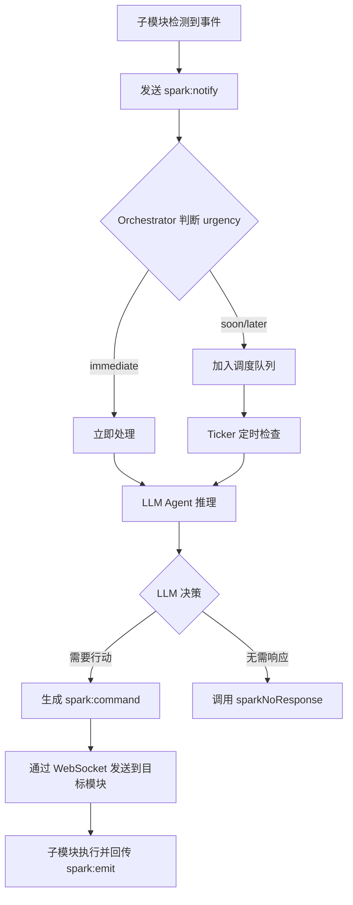
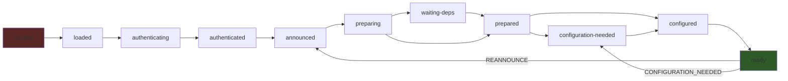
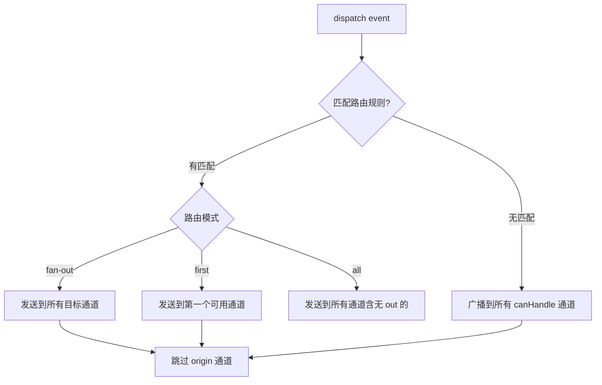

# PD-02.08 AIRI — Spark 协议跨 Agent 事件编排

> 文档编号：PD-02.08
> 来源：AIRI `packages/plugin-protocol/src/types/events.ts`, `packages/stage-ui/src/stores/character/orchestrator/store.ts`
> GitHub：https://github.com/moeru-ai/airi.git
> 问题域：PD-02 多 Agent 编排 Multi-Agent Orchestration
> 状态：可复用方案

---

## 第 1 章 问题与动机

### 1.1 核心问题

AIRI 是一个多模态 AI 角色系统，需要协调来自不同平台（Discord、Minecraft、Web UI、桌面宠物）的多个模块/Agent 协同工作。核心挑战：

1. **异构模块通信**：Minecraft Agent、Telegram Bot、Web 前端等运行在不同进程甚至不同机器上，需要统一的事件协议
2. **模块生命周期管理**：每个插件模块需要经历认证→声明→配置→能力贡献→就绪的完整生命周期，且支持运行时重配置
3. **事件优先级路由**：来自 Minecraft 的紧急攻击事件需要立即中断当前任务，而邮件提醒可以延后处理
4. **LLM 驱动的命令派发**：中心角色（Character）收到通知后，需要通过 LLM 推理决定向哪些子 Agent 发送什么指令

### 1.2 AIRI 的解法概述

1. **Spark 三事件协议**：`spark:notify`（通知上报）、`spark:command`（指令下发）、`spark:emit`（状态回传），形成完整的事件闭环（`packages/plugin-protocol/src/types/events.ts:742-806`）
2. **XState 驱动的模块生命周期**：17 步状态机管理模块从加载到就绪的全过程，支持回退和重配置（`packages/plugin-sdk/src/plugin-host/core.ts:173-259`）
3. **ChannelGateway 路由层**：支持 `fan-out`/`first`/`all` 三种路由模式，基于规则匹配将事件分发到目标通道（`packages/stage-ui/src/stores/mods/api/channel-gateway.ts:30-123`）
4. **LLM Agent 处理 Spark 通知**：Orchestrator 收到 `spark:notify` 后，构造 LLM 对话让模型决定是否响应、如何响应、向谁发送 `spark:command`（`packages/stage-ui/src/stores/character/orchestrator/agents/event-handler-spark-notify/index.ts:103-226`）
5. **优先级调度队列**：基于 urgency（immediate/soon/later）计算延迟执行时间，支持重试和最大尝试次数限制（`packages/stage-ui/src/stores/character/orchestrator/store.ts:55-71`）

### 1.3 设计思想

| 设计原则 | 具体实现 | 理由 | 替代方案 |
|----------|----------|------|----------|
| 事件驱动解耦 | Spark 三事件协议 + Eventa 事件库 | 模块间零直接依赖，通过事件总线通信 | 直接 RPC 调用（耦合度高） |
| 状态机确定性 | XState 管理 17 步生命周期 | 防止非法状态转换，支持回退 | 手动 if-else 状态管理 |
| LLM 决策中枢 | Character Orchestrator 用 LLM 决定命令派发 | 灵活应对未预见场景，支持人格化响应 | 规则引擎硬编码路由 |
| 传输无关性 | Eventa 适配器支持 EventTarget/WebSocket | 本地插件和远程插件共享同一 API | 为每种传输写独立协议 |
| 优先级分级 | urgency 四级 + priority 四级 + interrupt 三模式 | 紧急事件可中断，低优先级排队 | 统一 FIFO 队列 |

---

## 第 2 章 源码实现分析

### 2.1 架构概览

AIRI 的多 Agent 编排分为三层：协议层（Spark 事件定义）、传输层（WebSocket/EventTarget）、编排层（Orchestrator + ChannelGateway）。

```
┌─────────────────────────────────────────────────────────────────┐
│                     Character Orchestrator                       │
│  ┌──────────────┐  ┌──────────────┐  ┌───────────────────────┐  │
│  │ SparkNotify  │  │  Scheduler   │  │  LLM Agent (xsai)     │  │
│  │ Handler      │→ │  (tick loop) │→ │  builtIn_sparkCommand  │  │
│  └──────────────┘  └──────────────┘  └───────────────────────┘  │
└────────────────────────────┬────────────────────────────────────┘
                             │ spark:command ↓  spark:notify ↑
┌────────────────────────────┴────────────────────────────────────┐
│                    Channel Gateway (Router)                       │
│  ┌─────────┐  ┌─────────┐  ┌─────────┐  ┌─────────────────┐   │
│  │ fan-out │  │  first  │  │   all   │  │ canHandle filter │   │
│  └─────────┘  └─────────┘  └─────────┘  └─────────────────┘   │
└────────────────────────────┬────────────────────────────────────┘
                             │ WebSocket / EventTarget
    ┌────────────┐  ┌────────────┐  ┌────────────┐  ┌──────────┐
    │ Minecraft  │  │  Discord   │  │  Stage-UI  │  │ Telegram │
    │   Agent    │  │    Bot     │  │  (Web/App) │  │   Bot    │
    └────────────┘  └────────────┘  └────────────┘  └──────────┘
```

### 2.2 核心实现

#### 2.2.1 Spark 三事件协议



对应源码 `packages/plugin-protocol/src/types/events.ts:742-806`：

```typescript
// spark:notify — 子模块向中心角色上报事件
interface SparkNotifyEvent {
  id: string
  eventId: string
  lane?: string
  kind: 'alarm' | 'ping' | 'reminder'
  urgency: 'immediate' | 'soon' | 'later'
  headline: string
  note?: string
  payload?: Record<string, unknown>
  ttlMs?: number
  requiresAck?: boolean
  destinations: Array<string>
  metadata?: Record<string, unknown>
}

// spark:command — 中心角色向子模块下发指令
interface SparkCommandEvent {
  id: string
  eventId?: string
  parentEventId?: string
  commandId: string
  interrupt: 'force' | 'soft' | false
  priority: 'critical' | 'high' | 'normal' | 'low'
  intent: 'plan' | 'proposal' | 'action' | 'pause' | 'resume' | 'reroute' | 'context'
  ack?: string
  guidance?: SparkCommandGuidance
  contexts?: Array<ContextUpdate>
  destinations: Array<string>
}

// spark:emit — 双向状态回传
interface SparkEmitEvent {
  id: string
  eventId?: string
  state: 'queued' | 'working' | 'done' | 'dropped' | 'blocked' | 'expired'
  note?: string
  destinations: Array<string>
  metadata?: Record<string, unknown>
}
```

#### 2.2.2 XState 模块生命周期状态机



对应源码 `packages/plugin-sdk/src/plugin-host/core.ts:173-259`：

```typescript
const pluginLifecycleMachine = createMachine({
  id: 'plugin-lifecycle',
  initial: 'loading',
  states: {
    'loading': {
      on: { SESSION_LOADED: 'loaded', SESSION_FAILED: 'failed' },
    },
    'loaded': {
      on: { START_AUTHENTICATION: 'authenticating', STOP: 'stopped', SESSION_FAILED: 'failed' },
    },
    'authenticating': {
      on: { AUTHENTICATED: 'authenticated', SESSION_FAILED: 'failed' },
    },
    'authenticated': {
      on: { ANNOUNCED: 'announced', SESSION_FAILED: 'failed' },
    },
    'announced': {
      on: {
        START_PREPARING: 'preparing',
        CONFIGURATION_NEEDED: 'configuration-needed',
        STOP: 'stopped', SESSION_FAILED: 'failed',
      },
    },
    // ... preparing → waiting-deps → prepared → configuration-needed → configured → ready
    'ready': {
      on: {
        REANNOUNCE: 'announced',           // 支持运行时重声明
        CONFIGURATION_NEEDED: 'configuration-needed',  // 支持运行时重配置
        STOP: 'stopped', SESSION_FAILED: 'failed',
      },
    },
    'failed': { on: { STOP: 'stopped' } },
    'stopped': { type: 'final' },
  },
})
```

#### 2.2.3 ChannelGateway 路由分发



对应源码 `packages/stage-ui/src/stores/mods/api/channel-gateway.ts:30-71`：

```typescript
export function createChannelGateway(): ChannelGateway {
  const channels = new Map<string, GatewayChannel>()
  const routes: GatewayRoute[] = []
  const readers = new Map<string, ReadableStreamDefaultReader<GatewayEvent>>()

  function dispatch(event: GatewayEvent, options?: DispatchOptions) {
    const matchedRoutes = routes.filter(rule => rule.match(event))

    if (matchedRoutes.length > 0) {
      for (const rule of matchedRoutes) {
        const targets = rule.to
          .map(name => channels.get(name))
          .filter((channel): channel is GatewayChannel => !!channel)

        if (rule.mode === 'first') {
          const target = targets.find(channel => channel.out)
          if (target && target.name !== options?.origin)
            target.out?.(event)
          continue
        }

        for (const target of targets) {
          if (!target.out) continue
          if (target.name === options?.origin) continue
          target.out(event)
        }
      }
      return
    }

    // 无匹配规则时：广播到所有 canHandle 的通道
    for (const channel of channels.values()) {
      if (channel.name === options?.origin) continue
      if (channel.canHandle && !channel.canHandle(event)) continue
      channel.out?.(event)
    }
  }
  // ...
}
```

### 2.3 实现细节

#### LLM 驱动的 Spark 命令生成

Orchestrator 的核心创新在于用 LLM 作为命令决策中枢。当收到 `spark:notify` 时，系统构造一个包含系统 prompt + 事件数据的对话，让 LLM 通过工具调用决定：

1. **`builtIn_sparkNoResponse`**：无需响应，静默处理
2. **`builtIn_sparkCommand`**：生成结构化命令，包含目标 Agent ID、中断级别、优先级、意图类型、以及详细的 guidance（含 persona 人格调整、分步指令、风险评估、回退方案）

命令的 guidance 结构特别丰富（`packages/stage-ui/src/stores/character/orchestrator/agents/event-handler-spark-notify/index.ts:81-98`），支持：
- **persona 人格调整**：如 `{ bravery: "high", cautiousness: "low" }`，用于游戏 NPC 场景
- **options 多方案**：每个方案含 steps、rationale、possibleOutcome、risk、fallback、triggers
- **guidance type**：proposal（建议）、instruction（指令）、memory-recall（记忆回溯）

#### 优先级调度与重试

Orchestrator 使用 tick 定时器（默认 2s 间隔）轮询调度队列（`packages/stage-ui/src/stores/character/orchestrator/store.ts:146-176`）：

- `immediate` 事件：延迟 0ms，直接处理
- `soon` 事件：延迟 10s
- `later` 事件：延迟 60s
- 重试时追加 `requeueDelayMs`（默认 30s）× 已尝试次数
- 最大重试 3 次后丢弃

#### 分布式追踪（Minecraft EventBus）

Minecraft 认知 Agent 使用独立的 `EventBus`（`services/minecraft/src/cognitive/event-bus.ts:106-171`），通过 `AsyncLocalStorage` 实现 traceId/parentId 自动传播，事件 payload 使用 `deepFreeze` 保证不可变性。


---

## 第 3 章 迁移指南

### 3.1 迁移清单

**阶段 1：事件协议层**
- [ ] 定义三事件类型（notify/command/emit）的 TypeScript 接口
- [ ] 实现 EventEnvelope 基础结构（id、type、time、priority、source）
- [ ] 定义 urgency 和 priority 枚举

**阶段 2：传输层**
- [ ] 实现 ChannelGateway 路由器（register/unregister/dispatch/route）
- [ ] 实现 ReadableStream 驱动的通道自动泵送
- [ ] 适配 WebSocket 和本地 EventTarget 两种传输

**阶段 3：编排层**
- [ ] 实现 Orchestrator Store（调度队列 + tick 定时器）
- [ ] 集成 LLM 工具调用生成 spark:command
- [ ] 实现优先级延迟计算和重试逻辑

**阶段 4：模块生命周期（可选）**
- [ ] 引入 XState 定义模块状态机
- [ ] 实现 authenticate → announce → configure → ready 流程
- [ ] 支持能力贡献和运行时重配置

### 3.2 适配代码模板

#### 最小化 Spark 事件协议实现

```typescript
// spark-protocol.ts — 可直接复用的事件协议定义
import { nanoid } from 'nanoid'

// === 事件信封 ===
export interface EventEnvelope<TType extends string = string, TPayload = unknown> {
  id: string
  type: TType
  time: number
  priority?: 'critical' | 'high' | 'normal' | 'low'
  source?: string
  payload: TPayload
}

export function createEvent<T>(type: string, payload: T, options?: {
  priority?: EventEnvelope['priority']
  source?: string
}): EventEnvelope<string, T> {
  return { id: nanoid(), type, time: Date.now(), ...options, payload }
}

// === Spark 三事件 ===
export interface SparkNotify {
  id: string
  kind: 'alarm' | 'ping' | 'reminder'
  urgency: 'immediate' | 'soon' | 'later'
  headline: string
  note?: string
  destinations: string[]
  payload?: Record<string, unknown>
}

export interface SparkCommand {
  id: string
  commandId: string
  parentEventId?: string
  interrupt: 'force' | 'soft' | false
  priority: 'critical' | 'high' | 'normal' | 'low'
  intent: 'plan' | 'action' | 'pause' | 'resume' | 'context'
  destinations: string[]
  guidance?: {
    type: 'proposal' | 'instruction' | 'memory-recall'
    options: Array<{
      label: string
      steps: string[]
      rationale?: string
      risk?: 'high' | 'medium' | 'low' | 'none'
      fallback?: string[]
    }>
  }
}

export interface SparkEmit {
  id: string
  eventId?: string
  state: 'queued' | 'working' | 'done' | 'dropped' | 'blocked' | 'expired'
  note?: string
  destinations: string[]
}
```

#### 最小化 ChannelGateway 实现

```typescript
// channel-gateway.ts — 可直接复用的路由网关
export interface GatewayChannel {
  name: string
  in?: ReadableStream<EventEnvelope>
  out?: (event: EventEnvelope) => void
  canHandle?: (event: EventEnvelope) => boolean
}

export interface GatewayRoute {
  match: (event: EventEnvelope) => boolean
  to: string[]
  mode?: 'fan-out' | 'first' | 'all'
}

export function createChannelGateway() {
  const channels = new Map<string, GatewayChannel>()
  const routes: GatewayRoute[] = []

  function dispatch(event: EventEnvelope, origin?: string) {
    const matched = routes.filter(r => r.match(event))
    if (matched.length > 0) {
      for (const rule of matched) {
        const targets = rule.to
          .map(n => channels.get(n))
          .filter((c): c is GatewayChannel => !!c && c.name !== origin)
        if (rule.mode === 'first') {
          targets.find(t => t.out)?. out?.(event)
        } else {
          targets.forEach(t => t.out?.(event))
        }
      }
      return
    }
    // 无匹配规则：广播
    for (const ch of channels.values()) {
      if (ch.name === origin) continue
      if (ch.canHandle && !ch.canHandle(event)) continue
      ch.out?.(event)
    }
  }

  function register(channel: GatewayChannel) {
    channels.set(channel.name, channel)
    if (channel.in) {
      const reader = channel.in.getReader()
      ;(async () => {
        while (true) {
          const { done, value } = await reader.read()
          if (done) break
          dispatch(value, channel.name)
        }
      })()
    }
  }

  return { register, dispatch, route: (r: GatewayRoute) => routes.push(r) }
}
```

#### 最小化优先级调度器

```typescript
// spark-scheduler.ts — 可直接复用的优先级调度
interface ScheduledItem<T> {
  event: T
  nextRunAt: number
  attempts: number
  maxAttempts: number
}

export function createSparkScheduler<T>(options: {
  process: (event: T) => Promise<void>
  getUrgencyDelay: (event: T) => number
  requeueDelayMs?: number
  maxAttempts?: number
  tickIntervalMs?: number
}) {
  const queue: ScheduledItem<T>[] = []
  const requeueDelay = options.requeueDelayMs ?? 30_000
  const maxAttempts = options.maxAttempts ?? 3
  let processing = false

  function enqueue(event: T) {
    queue.push({
      event,
      nextRunAt: Date.now() + options.getUrgencyDelay(event),
      attempts: 0,
      maxAttempts,
    })
  }

  async function tick() {
    if (processing) return
    const now = Date.now()
    const idx = queue.findIndex(item => item.nextRunAt <= now)
    if (idx < 0) return

    const [item] = queue.splice(idx, 1)
    processing = true
    try {
      await options.process(item.event)
    } catch {
      if (item.attempts + 1 < item.maxAttempts) {
        queue.push({
          ...item,
          attempts: item.attempts + 1,
          nextRunAt: now + requeueDelay * (item.attempts + 1),
        })
      }
    } finally {
      processing = false
    }
  }

  const timer = setInterval(tick, options.tickIntervalMs ?? 2_000)
  return { enqueue, stop: () => clearInterval(timer) }
}
```

### 3.3 适用场景

| 场景 | 适用度 | 说明 |
|------|--------|------|
| 多平台 AI 角色系统 | ⭐⭐⭐ | AIRI 的核心场景，Spark 协议天然适配 |
| 游戏 NPC 多 Agent 协作 | ⭐⭐⭐ | guidance.persona 支持人格化决策 |
| IoT 设备事件编排 | ⭐⭐ | urgency 分级适合传感器事件，但缺少 QoS 保证 |
| 企业工作流编排 | ⭐ | 缺少事务性保证和持久化队列，适合轻量场景 |
| 实时协作应用 | ⭐⭐ | ChannelGateway 路由灵活，但无冲突解决机制 |

---

## 第 4 章 测试用例

```typescript
import { describe, it, expect, vi, beforeEach } from 'vitest'

// === ChannelGateway 测试 ===
describe('ChannelGateway', () => {
  it('should dispatch to matched route targets in fan-out mode', () => {
    const gateway = createChannelGateway()
    const outA = vi.fn()
    const outB = vi.fn()

    gateway.register({ name: 'agent-a', out: outA })
    gateway.register({ name: 'agent-b', out: outB })
    gateway.route({
      match: (e) => e.type === 'spark:command',
      to: ['agent-a', 'agent-b'],
      mode: 'fan-out',
    })

    const event = createEvent('spark:command', { commandId: 'cmd-1' })
    gateway.dispatch(event)

    expect(outA).toHaveBeenCalledWith(event)
    expect(outB).toHaveBeenCalledWith(event)
  })

  it('should dispatch to first available in first mode', () => {
    const gateway = createChannelGateway()
    const outA = vi.fn()
    const outB = vi.fn()

    gateway.register({ name: 'agent-a', out: outA })
    gateway.register({ name: 'agent-b', out: outB })
    gateway.route({
      match: (e) => e.type === 'spark:notify',
      to: ['agent-a', 'agent-b'],
      mode: 'first',
    })

    gateway.dispatch(createEvent('spark:notify', { headline: 'test' }))

    expect(outA).toHaveBeenCalledTimes(1)
    expect(outB).not.toHaveBeenCalled()
  })

  it('should skip origin channel to prevent echo', () => {
    const gateway = createChannelGateway()
    const outSelf = vi.fn()
    const outOther = vi.fn()

    gateway.register({ name: 'minecraft', out: outSelf })
    gateway.register({ name: 'character', out: outOther })

    gateway.dispatch(createEvent('spark:notify', {}), 'minecraft')

    expect(outSelf).not.toHaveBeenCalled()
    expect(outOther).toHaveBeenCalledTimes(1)
  })

  it('should broadcast to canHandle channels when no route matches', () => {
    const gateway = createChannelGateway()
    const outA = vi.fn()
    const outB = vi.fn()

    gateway.register({ name: 'a', out: outA, canHandle: (e) => e.type === 'spark:notify' })
    gateway.register({ name: 'b', out: outB, canHandle: (e) => e.type === 'spark:command' })

    gateway.dispatch(createEvent('spark:notify', {}))

    expect(outA).toHaveBeenCalledTimes(1)
    expect(outB).not.toHaveBeenCalled()
  })
})

// === SparkScheduler 测试 ===
describe('SparkScheduler', () => {
  beforeEach(() => { vi.useFakeTimers() })

  it('should process immediate events without delay', async () => {
    const process = vi.fn().mockResolvedValue(undefined)
    const scheduler = createSparkScheduler({
      process,
      getUrgencyDelay: () => 0,
      tickIntervalMs: 100,
    })

    scheduler.enqueue({ id: 'evt-1', urgency: 'immediate' })
    await vi.advanceTimersByTimeAsync(100)

    expect(process).toHaveBeenCalledWith({ id: 'evt-1', urgency: 'immediate' })
    scheduler.stop()
  })

  it('should retry failed events up to maxAttempts', async () => {
    let callCount = 0
    const process = vi.fn().mockImplementation(async () => {
      callCount++
      if (callCount < 3) throw new Error('fail')
    })

    const scheduler = createSparkScheduler({
      process,
      getUrgencyDelay: () => 0,
      requeueDelayMs: 100,
      maxAttempts: 3,
      tickIntervalMs: 50,
    })

    scheduler.enqueue({ id: 'evt-retry' })
    await vi.advanceTimersByTimeAsync(500)

    expect(process).toHaveBeenCalledTimes(3)
    scheduler.stop()
  })

  it('should drop events after max attempts exceeded', async () => {
    const process = vi.fn().mockRejectedValue(new Error('always fail'))
    const scheduler = createSparkScheduler({
      process,
      getUrgencyDelay: () => 0,
      requeueDelayMs: 50,
      maxAttempts: 2,
      tickIntervalMs: 30,
    })

    scheduler.enqueue({ id: 'evt-drop' })
    await vi.advanceTimersByTimeAsync(1000)

    expect(process).toHaveBeenCalledTimes(2)
    scheduler.stop()
  })
})

// === XState Lifecycle 测试 ===
describe('PluginLifecycle', () => {
  it('should follow happy path: loading → ready', () => {
    const { createActor, createMachine } = require('xstate')
    const machine = createMachine({
      id: 'test-lifecycle',
      initial: 'loading',
      states: {
        loading: { on: { SESSION_LOADED: 'loaded' } },
        loaded: { on: { START_AUTHENTICATION: 'authenticating' } },
        authenticating: { on: { AUTHENTICATED: 'authenticated' } },
        authenticated: { on: { ANNOUNCED: 'announced' } },
        announced: { on: { START_PREPARING: 'preparing' } },
        preparing: { on: { PREPARED: 'prepared' } },
        prepared: { on: { CONFIGURED: 'configured' } },
        configured: { on: { READY: 'ready' } },
        ready: { type: 'final' },
      },
    })

    const actor = createActor(machine).start()
    const events = ['SESSION_LOADED', 'START_AUTHENTICATION', 'AUTHENTICATED',
      'ANNOUNCED', 'START_PREPARING', 'PREPARED', 'CONFIGURED', 'READY']

    for (const event of events) {
      actor.send({ type: event })
    }

    expect(actor.getSnapshot().value).toBe('ready')
  })

  it('should reject invalid transitions', () => {
    const { createActor, createMachine } = require('xstate')
    const machine = createMachine({
      id: 'test-lifecycle',
      initial: 'loading',
      states: {
        loading: { on: { SESSION_LOADED: 'loaded' } },
        loaded: { on: { START_AUTHENTICATION: 'authenticating' } },
        authenticating: {},
      },
    })

    const actor = createActor(machine).start()
    actor.send({ type: 'SESSION_LOADED' })
    // 尝试非法转换：loaded 不能直接到 authenticated
    actor.send({ type: 'AUTHENTICATED' })

    expect(actor.getSnapshot().value).toBe('loaded') // 状态未变
  })
})
```


---

## 第 5 章 跨域关联

| 关联域 | 关系类型 | 说明 |
|--------|----------|------|
| PD-01 上下文管理 | 协同 | Spark 事件的 `contexts` 字段携带 ContextUpdate，支持跨 Agent 上下文注入；LLM Agent 处理 notify 时需要管理系统 prompt + 事件数据的上下文窗口 |
| PD-04 工具系统 | 依赖 | Orchestrator 的 LLM Agent 通过 `@xsai/tool` 定义 `builtIn_sparkCommand` 和 `builtIn_sparkNoResponse` 工具，工具系统是命令生成的基础 |
| PD-06 记忆持久化 | 协同 | SparkCommand 的 guidance.type 支持 `memory-recall`，可触发子 Agent 回忆相关记忆；Minecraft EventBus 的 traceId 可用于记忆关联 |
| PD-09 Human-in-the-Loop | 协同 | SparkCommand 的 intent 支持 `pause`/`resume`，可实现人类审批中断；urgency 分级允许非紧急事件等待人类确认 |
| PD-10 中间件管道 | 依赖 | 模块生命周期的 17 步状态机本质上是一个中间件管道，每个阶段可注入验证/配置/能力贡献逻辑 |
| PD-11 可观测性 | 协同 | Minecraft EventBus 的 traceId/parentId 提供分布式追踪；WebSocket Inspector 记录所有进出事件；spark:emit 的 state 字段提供任务状态可观测性 |
| PD-03 容错与重试 | 依赖 | Orchestrator 的调度队列内置重试机制（maxAttempts=3）；Client 的指数退避重连（上限 30s）；EventBus 的 subscriber 故障隔离 |

---

## 第 6 章 来源文件索引

| 文件 | 行范围 | 关键实现 |
|------|--------|----------|
| `packages/plugin-protocol/src/types/events.ts` | L742-L806 | Spark 三事件协议定义（notify/command/emit） |
| `packages/plugin-protocol/src/types/events.ts` | L152-L159 | ModulePhase 生命周期阶段枚举 |
| `packages/plugin-protocol/src/types/events.ts` | L490-L503 | 模块编排 11 步流程注释 |
| `packages/plugin-protocol/src/types/events.ts` | L346-L360 | RouteTargetExpression 路由目标表达式（and/or/glob/ids/label） |
| `packages/stage-ui/src/stores/character/orchestrator/store.ts` | L15-L235 | Orchestrator Store 完整实现（调度队列 + tick + 事件处理） |
| `packages/stage-ui/src/stores/character/orchestrator/agents/event-handler-spark-notify/index.ts` | L15-L273 | SparkNotify Agent（LLM 驱动命令生成 + Zod schema 验证） |
| `packages/stage-ui/src/stores/mods/api/channel-gateway.ts` | L1-L123 | ChannelGateway 路由器（fan-out/first/all 三模式） |
| `packages/stage-ui/src/stores/mods/api/events.ts` | L1-L55 | EventEnvelope 基础结构 + EventStream 工厂 |
| `packages/stage-ui/src/stores/mods/api/channel-server.ts` | L1-L209 | WebSocket 客户端 Store（连接管理 + 事件监听） |
| `packages/plugin-sdk/src/plugin-host/core.ts` | L173-L259 | XState 模块生命周期状态机（17 步） |
| `packages/plugin-sdk/src/plugin-host/core.ts` | L261-L275 | 生命周期转换事件映射表 |
| `packages/plugin-sdk/src/plugin-host/core.ts` | L499-L519 | PluginHost 类定义（session 管理 + 能力追踪） |
| `packages/server-sdk/src/client.ts` | L49-L119 | Client 类（WebSocket 事件客户端 + 指数退避重连） |
| `services/minecraft/src/cognitive/event-bus.ts` | L106-L171 | EventBus（AsyncLocalStorage 分布式追踪 + deepFreeze 不可变事件） |
| `services/satori-bot/src/core/dispatcher.ts` | L6-L52 | Action Dispatcher（全局注册表查找 + 执行） |

---

## 第 7 章 横向对比维度

> **重要：** 本章用于自动填充 Butcher Wiki 的横向对比表。

```json comparison_data
{
  "project": "AIRI",
  "dimensions": {
    "编排模式": "Spark 三事件协议（notify/command/emit）+ LLM 决策中枢",
    "并行能力": "ChannelGateway fan-out 广播，多通道并行接收",
    "状态管理": "XState 17 步状态机 + Pinia reactive store",
    "并发限制": "单 Orchestrator 串行处理，processing 锁防并发",
    "工具隔离": "每个插件独立 Eventa context + 独立传输通道",
    "模块自治": "插件自主声明能力，host 不干预内部实现",
    "生命周期钩子": "17 步状态机覆盖 loading→ready 全生命周期",
    "条件路由": "GatewayRoute.match 函数式匹配 + fan-out/first/all 模式",
    "异步解耦": "ReadableStream 驱动通道泵送，事件异步分发",
    "结果回传": "spark:emit 六态回传（queued/working/done/dropped/blocked/expired）",
    "递归防护": "processing 锁 + maxAttempts 限制防止无限重试",
    "懒初始化": "插件 load 与 init 分离，支持批量加载后统一初始化",
    "市场化分发": "ManifestV1 标准化插件清单 + 多运行时入口点",
    "多模型兼容": "通过 xsai providers 抽象支持多 LLM 提供商",
    "定时任务支持": "tick 定时器轮询 + notebook 到期任务自动转 spark:notify",
    "经验记忆": "SparkCommand guidance.type=memory-recall 触发记忆回溯",
    "Spark事件协议": "三事件闭环：notify 上报 → command 下发 → emit 回传",
    "人格化决策": "guidance.persona 支持 trait-strength 人格参数调整子 Agent 行为"
  }
}
```

### 域元数据补充

```json domain_metadata
{
  "solution_summary": "AIRI 通过 Spark 三事件协议（notify/command/emit）+ XState 17 步模块生命周期状态机 + ChannelGateway 路由层实现跨平台多 Agent 事件编排，LLM 作为命令决策中枢",
  "description": "事件驱动的模块化 Agent 编排，强调传输无关性和插件自治",
  "sub_problems": [
    "人格化命令派发：如何通过 persona trait-strength 参数调整子 Agent 的决策风格",
    "事件紧急度分级调度：如何基于 urgency 四级动态计算延迟执行时间",
    "传输无关的模块通信：如何让本地插件和远程插件共享同一事件 API",
    "能力贡献与依赖发现：模块如何声明能力并等待依赖模块就绪",
    "协议版本协商：模块与宿主如何在连接时协商兼容的协议版本"
  ],
  "best_practices": [
    "事件不可变性：使用 deepFreeze 保证事件 payload 在传播过程中不被篡改",
    "origin 回声抑制：路由分发时跳过事件来源通道，防止消息回环",
    "load 与 init 分离：批量加载插件后统一初始化，支持加载后检查和补丁"
  ]
}
```

