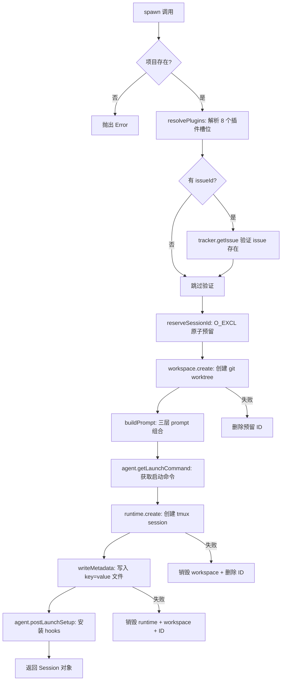
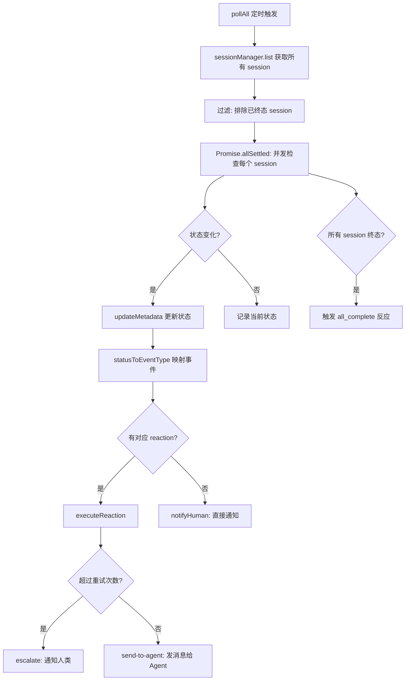

# PD-02.09 Agent Orchestrator — SessionManager + LifecycleManager 多 Agent 并行编排

> 文档编号：PD-02.09
> 来源：Agent Orchestrator `packages/core/src/session-manager.ts`, `packages/core/src/lifecycle-manager.ts`
> GitHub：https://github.com/ComposioHQ/agent-orchestrator.git
> 问题域：PD-02 多 Agent 编排 Multi-Agent Orchestration
> 状态：可复用方案

---

## 第 1 章 问题与动机

### 1.1 核心问题

当需要同时处理数十甚至上百个 issue 时，单个 AI 编码 Agent 的串行工作模式成为瓶颈。核心挑战包括：

1. **并行隔离**：多个 Agent 同时修改同一仓库，如何避免代码冲突和环境污染？
2. **生命周期管理**：Agent 可能崩溃、卡住、等待输入，如何自动检测并恢复？
3. **工具无关性**：团队可能使用 Claude Code、Codex、Aider 等不同 AI 工具，编排层如何统一驱动？
4. **状态追踪**：数十个并行 session 的 PR 状态、CI 结果、Review 决策如何实时汇聚？
5. **反应式自愈**：CI 失败、Review 要求修改等事件如何自动转发给 Agent 处理，而非人工干预？

这不是一个"多 Agent 对话协作"的问题（如 CrewAI/MetaGPT 的角色扮演），而是一个**进程级多 Agent 并行执行**的工程问题——每个 Agent 是独立进程，拥有独立工作区，通过 tmux session 隔离。

### 1.2 Agent Orchestrator 的解法概述

Agent Orchestrator（AO）采用 **Orchestrator-Worker 两层架构**，核心设计：

1. **SessionManager** (`session-manager.ts:165`) 作为 CRUD 核心，管理 session 的 spawn/list/kill/restore/send 全生命周期
2. **LifecycleManager** (`lifecycle-manager.ts:172`) 作为状态机 + 轮询引擎 + 反应引擎，自动检测状态转换并触发反应
3. **8 插件槽位** (`types.ts:1-16`) 实现完全解耦：Runtime/Agent/Workspace/Tracker/SCM/Notifier/Terminal/Lifecycle
4. **batch-spawn** (`spawn.ts:84-179`) 支持批量创建 session，内置去重检测
5. **Orchestrator Agent** (`orchestrator-prompt.ts:21-211`) 作为上层协调者，本身也是一个 Agent session，通过 `ao` CLI 命令管理 worker 群

### 1.3 设计思想

| 设计原则 | 具体实现 | 理由 | 替代方案 |
|----------|----------|------|----------|
| 进程级隔离 | 每个 Agent 独立 tmux session + git worktree | 避免代码冲突，崩溃不影响其他 Agent | Docker 容器（更重）、共享进程（不安全） |
| 插件化工具适配 | Agent 接口抽象 `getLaunchCommand/getEnvironment/detectActivity` | 同一编排逻辑驱动 claude/codex/aider | 硬编码工具调用（不可扩展） |
| 元数据驱动 | 扁平 key=value 文件存储 session 状态 | Bash 脚本可直接读写，外部工具可更新 | SQLite（需要驱动）、JSON（不 bash 友好） |
| 反应式自愈 | LifecycleManager 轮询 + 事件 → 反应映射 | CI 失败/Review 变更自动转发给 Agent | 人工监控（不可扩展） |
| 原子性 ID 预留 | `O_EXCL` 文件创建防止并发冲突 | batch-spawn 时多个 spawn 可能同时执行 | 数据库自增 ID（引入外部依赖） |

---

## 第 2 章 源码实现分析

### 2.1 架构概览

Agent Orchestrator 的整体架构是一个 **Orchestrator Agent → SessionManager → Plugin Registry → N × Worker Agent** 的分层结构：

```
┌─────────────────────────────────────────────────────────────┐
│                    Orchestrator Agent                        │
│  (本身也是一个 tmux session，通过 ao CLI 管理 worker 群)      │
└──────────────────────────┬──────────────────────────────────┘
                           │ ao spawn / ao batch-spawn / ao send
                           ▼
┌─────────────────────────────────────────────────────────────┐
│                     SessionManager                           │
│  spawn() → list() → get() → kill() → restore() → send()    │
│  ┌─────────────┐  ┌──────────────┐  ┌─────────────────┐    │
│  │ resolvePlugins│  │ reserveSessionId│  │ enrichSession  │    │
│  └─────────────┘  └──────────────┘  └─────────────────┘    │
└──────────────────────────┬──────────────────────────────────┘
                           │
          ┌────────────────┼────────────────┐
          ▼                ▼                ▼
   ┌──────────┐    ┌──────────┐    ┌──────────────┐
   │ Runtime   │    │ Agent    │    │ Workspace    │
   │ (tmux)    │    │ (claude) │    │ (worktree)   │
   └──────────┘    └──────────┘    └──────────────┘
          │                │                │
          ▼                ▼                ▼
   ┌──────────┐    ┌──────────┐    ┌──────────────┐
   │ tmux-1   │    │ claude   │    │ ~/.ao/wt/s-1 │
   │ tmux-2   │    │ codex    │    │ ~/.ao/wt/s-2 │
   │ tmux-3   │    │ aider    │    │ ~/.ao/wt/s-3 │
   └──────────┘    └──────────┘    └──────────────┘

┌─────────────────────────────────────────────────────────────┐
│                   LifecycleManager                           │
│  pollAll() → checkSession() → determineStatus()             │
│  → statusToEventType() → executeReaction() → notifyHuman()  │
└─────────────────────────────────────────────────────────────┘
```

### 2.2 核心实现

#### 2.2.1 Session Spawn 流程



对应源码 `packages/core/src/session-manager.ts:315-559`：

```typescript
async function spawn(spawnConfig: SessionSpawnConfig): Promise<Session> {
    const project = config.projects[spawnConfig.projectId];
    if (!project) {
      throw new Error(`Unknown project: ${spawnConfig.projectId}`);
    }

    const plugins = resolvePlugins(project);

    // 验证 issue 存在 BEFORE 创建任何资源
    let resolvedIssue: Issue | undefined;
    if (spawnConfig.issueId && plugins.tracker) {
      try {
        resolvedIssue = await plugins.tracker.getIssue(spawnConfig.issueId, project);
      } catch (err) {
        if (isIssueNotFoundError(err)) {
          // Ad-hoc issue — 继续但无 tracker 上下文
        } else {
          throw new Error(`Failed to fetch issue ${spawnConfig.issueId}: ${err}`, { cause: err });
        }
      }
    }

    // 原子预留 session ID，防止并发冲突
    let num = getNextSessionNumber(existingSessions, project.sessionPrefix);
    let sessionId: string;
    for (let attempts = 0; attempts < 10; attempts++) {
      sessionId = `${project.sessionPrefix}-${num}`;
      if (reserveSessionId(sessionsDir, sessionId)) break;
      num++;
      if (attempts === 9) {
        throw new Error(`Failed to reserve session ID after 10 attempts`);
      }
    }

    // 创建 workspace（git worktree）
    let workspacePath = project.path;
    if (plugins.workspace) {
      const wsInfo = await plugins.workspace.create({
        projectId: spawnConfig.projectId, project, sessionId, branch,
      });
      workspacePath = wsInfo.path;
    }

    // 三层 prompt 组合
    const composedPrompt = buildPrompt({
      project, projectId: spawnConfig.projectId,
      issueId: spawnConfig.issueId, issueContext, userPrompt: spawnConfig.prompt,
    });

    // 创建 runtime（tmux session）
    handle = await plugins.runtime.create({
      sessionId: tmuxName ?? sessionId,
      workspacePath,
      launchCommand: plugins.agent.getLaunchCommand(agentLaunchConfig),
      environment: {
        ...plugins.agent.getEnvironment(agentLaunchConfig),
        AO_SESSION: sessionId,
        AO_DATA_DIR: sessionsDir,
      },
    });

    // 写入元数据
    writeMetadata(sessionsDir, sessionId, {
      worktree: workspacePath, branch, status: "spawning",
      tmuxName, issue: spawnConfig.issueId, project: spawnConfig.projectId,
      agent: plugins.agent.name, createdAt: new Date().toISOString(),
      runtimeHandle: JSON.stringify(handle),
    });

    return session;
}
```

#### 2.2.2 LifecycleManager 状态机与反应引擎



对应源码 `packages/core/src/lifecycle-manager.ts:172-607`：

```typescript
export function createLifecycleManager(deps: LifecycleManagerDeps): LifecycleManager {
  const states = new Map<SessionId, SessionStatus>();
  const reactionTrackers = new Map<string, ReactionTracker>(); // "sessionId:reactionKey"
  let polling = false; // 重入保护

  async function determineStatus(session: Session): Promise<SessionStatus> {
    const project = config.projects[session.projectId];
    // 1. 检查 runtime 是否存活
    if (session.runtimeHandle) {
      const alive = await runtime.isAlive(session.runtimeHandle).catch(() => true);
      if (!alive) return "killed";
    }
    // 2. 检查 agent 活动状态
    if (agent && session.runtimeHandle) {
      const terminalOutput = runtime ? await runtime.getOutput(session.runtimeHandle, 10) : "";
      if (terminalOutput) {
        const activity = agent.detectActivity(terminalOutput);
        if (activity === "waiting_input") return "needs_input";
        const processAlive = await agent.isProcessRunning(session.runtimeHandle);
        if (!processAlive) return "killed";
      }
    }
    // 3. 自动检测 PR（对无 hook 的 Agent 如 Codex/Aider 至关重要）
    if (!session.pr && scm && session.branch) {
      const detectedPR = await scm.detectPR(session, project);
      if (detectedPR) { session.pr = detectedPR; }
    }
    // 4. 检查 PR 状态链: merged → closed → ci_failed → changes_requested → approved → mergeable
    if (session.pr && scm) {
      const prState = await scm.getPRState(session.pr);
      if (prState === PR_STATE.MERGED) return "merged";
      const ciStatus = await scm.getCISummary(session.pr);
      if (ciStatus === CI_STATUS.FAILING) return "ci_failed";
      const reviewDecision = await scm.getReviewDecision(session.pr);
      if (reviewDecision === "changes_requested") return "changes_requested";
      if (reviewDecision === "approved") {
        const mergeReady = await scm.getMergeability(session.pr);
        if (mergeReady.mergeable) return "mergeable";
        return "approved";
      }
    }
    return session.status;
  }

  async function executeReaction(sessionId, projectId, reactionKey, reactionConfig) {
    tracker.attempts++;
    // 超过重试次数 → 升级到人类
    if (tracker.attempts > maxRetries) {
      await notifyHuman(event, "urgent");
      return { action: "escalated", escalated: true };
    }
    // 执行反应动作
    switch (reactionConfig.action) {
      case "send-to-agent":
        await sessionManager.send(sessionId, reactionConfig.message);
        return { action: "send-to-agent", success: true };
      case "notify":
        await notifyHuman(event, reactionConfig.priority ?? "info");
        return { action: "notify", success: true };
    }
  }

  return {
    start(intervalMs = 30_000): void {
      pollTimer = setInterval(() => void pollAll(), intervalMs);
      void pollAll(); // 立即执行一次
    },
    stop(): void { clearInterval(pollTimer); },
    getStates(): Map<SessionId, SessionStatus> { return new Map(states); },
  };
}
```

### 2.3 实现细节

#### 原子性 Session ID 预留

`metadata.ts:264-274` 使用 `O_EXCL` 标志创建文件，确保并发 spawn 不会分配相同 ID：

```typescript
export function reserveSessionId(dataDir: string, sessionId: SessionId): boolean {
  const path = metadataPath(dataDir, sessionId);
  mkdirSync(dirname(path), { recursive: true });
  try {
    const fd = openSync(path, constants.O_WRONLY | constants.O_CREAT | constants.O_EXCL);
    closeSync(fd);
    return true;
  } catch {
    return false; // 文件已存在，ID 被占用
  }
}
```

#### batch-spawn 去重检测

`spawn.ts:112-138` 实现双层去重：同批次去重 + 已有 session 去重（排除已死亡 session）：

```typescript
const deadStatuses = new Set(["killed", "done", "exited"]);
const existingSessions = await sm.list(projectId);
const existingIssueMap = new Map(
  existingSessions
    .filter((s) => s.issueId && !deadStatuses.has(s.status))
    .map((s) => [s.issueId!.toLowerCase(), s.id]),
);

for (const issue of issues) {
  if (spawnedIssues.has(issue.toLowerCase())) {
    skipped.push({ issue, existing: "(this batch)" });
    continue;
  }
  const existingSessionId = existingIssueMap.get(issue.toLowerCase());
  if (existingSessionId) {
    skipped.push({ issue, existing: existingSessionId });
    continue;
  }
  // ... spawn
  await new Promise((r) => setTimeout(r, 500)); // 500ms 间隔防止资源争抢
}
```

#### 三层 Prompt 组合

`prompt-builder.ts:148-178` 实现 Base → Config → User 三层 prompt 叠加：

- Layer 1: `BASE_AGENT_PROMPT`（常量，session 生命周期 + git 工作流 + PR 最佳实践）
- Layer 2: `buildConfigLayer`（项目名、仓库、tracker、issue 详情、reaction 规则）
- Layer 3: `readUserRules`（内联 agentRules + agentRulesFile 文件内容）

#### Session 恢复机制

`session-manager.ts:920-1107` 实现 10 步恢复流程：查找元数据（活跃 → 归档）→ 重建 Session → 验证可恢复性 → 检查 workspace → 销毁旧 runtime → 获取恢复命令 → 创建新 runtime → 更新元数据。

#### 16 态状态机

`types.ts:26-42` 定义了完整的 session 生命周期状态：

```
spawning → working → pr_open → ci_failed → review_pending
→ changes_requested → approved → mergeable → merged
→ cleanup → needs_input → stuck → errored → killed → done → terminated
```

终态集合：`killed, terminated, done, cleanup, errored, merged`

---

## 第 3 章 迁移指南

### 3.1 迁移清单

**阶段 1：核心 Session 管理（最小可用）**

- [ ] 定义 `Session` 接口（id, status, workspacePath, runtimeHandle）
- [ ] 实现 `SessionManager`（spawn, list, kill, send）
- [ ] 实现元数据存储（key=value 扁平文件或 SQLite）
- [ ] 实现原子性 ID 预留（`O_EXCL` 或数据库 UNIQUE 约束）
- [ ] 实现 workspace 隔离（git worktree 或 docker volume）

**阶段 2：Runtime 抽象**

- [ ] 定义 `Runtime` 接口（create, destroy, sendMessage, getOutput, isAlive）
- [ ] 实现 tmux runtime 插件
- [ ] 实现 `Agent` 接口（getLaunchCommand, getEnvironment, detectActivity）
- [ ] 实现至少一个 Agent 适配器（如 claude-code）

**阶段 3：生命周期管理**

- [ ] 实现 `LifecycleManager` 轮询引擎
- [ ] 实现状态转换检测（determineStatus）
- [ ] 实现反应引擎（executeReaction + 重试 + 升级）
- [ ] 实现通知路由（notifyHuman + 优先级分发）

**阶段 4：批量操作**

- [ ] 实现 batch-spawn（去重 + 500ms 间隔）
- [ ] 实现 session restore（从归档恢复崩溃 session）
- [ ] 实现 cleanup（自动清理已合并/关闭的 session）

### 3.2 适配代码模板

以下是一个最小化的 SessionManager + LifecycleManager 实现模板（TypeScript）：

```typescript
// === types.ts ===
type SessionStatus = "spawning" | "working" | "pr_open" | "ci_failed"
  | "review_pending" | "changes_requested" | "approved" | "mergeable"
  | "merged" | "killed" | "needs_input" | "stuck" | "errored";

interface Session {
  id: string;
  projectId: string;
  status: SessionStatus;
  branch: string | null;
  issueId: string | null;
  workspacePath: string | null;
  runtimeHandle: { id: string; runtimeName: string } | null;
  createdAt: Date;
}

interface Runtime {
  create(config: { sessionId: string; workspacePath: string; launchCommand: string; environment: Record<string, string> }): Promise<{ id: string; runtimeName: string }>;
  destroy(handle: { id: string }): Promise<void>;
  sendMessage(handle: { id: string }, message: string): Promise<void>;
  isAlive(handle: { id: string }): Promise<boolean>;
  getOutput(handle: { id: string }, lines?: number): Promise<string>;
}

interface Agent {
  name: string;
  getLaunchCommand(config: { sessionId: string; issueId?: string }): string;
  getEnvironment(config: { sessionId: string }): Record<string, string>;
  detectActivity(output: string): "active" | "idle" | "waiting_input" | "exited";
}

// === session-manager.ts ===
import { openSync, closeSync, constants, mkdirSync } from "node:fs";
import { join, dirname } from "node:path";

function reserveSessionId(dir: string, id: string): boolean {
  mkdirSync(dir, { recursive: true });
  try {
    const fd = openSync(join(dir, id), constants.O_WRONLY | constants.O_CREAT | constants.O_EXCL);
    closeSync(fd);
    return true;
  } catch { return false; }
}

async function spawn(runtime: Runtime, agent: Agent, opts: {
  projectId: string; sessionsDir: string; prefix: string;
  workspacePath: string; issueId?: string;
}): Promise<Session> {
  // 1. 原子预留 ID
  let num = 1, sessionId: string;
  for (let i = 0; i < 10; i++) {
    sessionId = `${opts.prefix}-${num}`;
    if (reserveSessionId(opts.sessionsDir, sessionId!)) break;
    num++;
  }
  sessionId = `${opts.prefix}-${num}`;

  // 2. 创建 runtime
  const handle = await runtime.create({
    sessionId,
    workspacePath: opts.workspacePath,
    launchCommand: agent.getLaunchCommand({ sessionId, issueId: opts.issueId }),
    environment: { ...agent.getEnvironment({ sessionId }), AO_SESSION: sessionId },
  });

  return {
    id: sessionId, projectId: opts.projectId, status: "spawning",
    branch: opts.issueId ? `feat/${opts.issueId}` : `session/${sessionId}`,
    issueId: opts.issueId ?? null, workspacePath: opts.workspacePath,
    runtimeHandle: handle, createdAt: new Date(),
  };
}

// === lifecycle-manager.ts ===
interface ReactionConfig {
  action: "send-to-agent" | "notify";
  message?: string;
  retries?: number;
  escalateAfter?: number;
}

function createLifecycleManager(
  sessionManager: { list(): Promise<Session[]>; send(id: string, msg: string): Promise<void> },
  runtime: Runtime,
  reactions: Record<string, ReactionConfig>,
) {
  const states = new Map<string, SessionStatus>();
  const attempts = new Map<string, number>();

  async function poll() {
    const sessions = await sessionManager.list();
    for (const session of sessions) {
      if (session.status === "merged" || session.status === "killed") continue;
      const oldStatus = states.get(session.id) ?? session.status;
      const newStatus = await determineStatus(session, runtime);
      if (newStatus !== oldStatus) {
        states.set(session.id, newStatus);
        const reactionKey = mapStatusToReaction(newStatus);
        if (reactionKey && reactions[reactionKey]) {
          const key = `${session.id}:${reactionKey}`;
          const count = (attempts.get(key) ?? 0) + 1;
          attempts.set(key, count);
          const cfg = reactions[reactionKey];
          if (count > (cfg.retries ?? Infinity)) {
            console.log(`ESCALATE: ${session.id} ${reactionKey}`);
          } else if (cfg.action === "send-to-agent" && cfg.message) {
            await sessionManager.send(session.id, cfg.message);
          }
        }
      }
    }
  }

  return {
    start: (ms = 30000) => setInterval(poll, ms),
    stop: (timer: ReturnType<typeof setInterval>) => clearInterval(timer),
  };
}
```

### 3.3 适用场景

| 场景 | 适用度 | 说明 |
|------|--------|------|
| 批量 issue 并行处理 | ⭐⭐⭐ | AO 的核心场景，batch-spawn + lifecycle 完美匹配 |
| 多 AI 工具混合编排 | ⭐⭐⭐ | Agent 插件抽象使得 claude/codex/aider 可互换 |
| CI/CD 自动修复循环 | ⭐⭐⭐ | LifecycleManager 的 reaction 引擎天然支持 |
| 单任务深度研究 | ⭐ | 过度设计，单 Agent + 多工具更合适 |
| 多 Agent 对话协作 | ⭐ | AO 是进程级隔离，不适合 Agent 间实时对话 |
| 需要共享内存的协作 | ⭐ | 每个 Agent 独立 worktree，无共享状态机制 |

---

## 第 4 章 测试用例

```python
import pytest
import os
import tempfile
from unittest.mock import AsyncMock, MagicMock, patch
from dataclasses import dataclass, field
from typing import Optional
from enum import Enum


class SessionStatus(str, Enum):
    SPAWNING = "spawning"
    WORKING = "working"
    PR_OPEN = "pr_open"
    CI_FAILED = "ci_failed"
    KILLED = "killed"
    MERGED = "merged"
    NEEDS_INPUT = "needs_input"


@dataclass
class Session:
    id: str
    project_id: str
    status: SessionStatus
    issue_id: Optional[str] = None
    workspace_path: Optional[str] = None
    runtime_handle: Optional[dict] = None


@dataclass
class ReactionTracker:
    attempts: int = 0
    escalated: bool = False


class TestAtomicSessionIdReservation:
    """测试原子性 ID 预留（对应 metadata.ts:264-274）"""

    def test_reserve_unique_id(self, tmp_path):
        """正常路径：首次预留成功"""
        session_file = tmp_path / "app-1"
        fd = os.open(str(session_file), os.O_WRONLY | os.O_CREAT | os.O_EXCL)
        os.close(fd)
        assert session_file.exists()

    def test_reserve_duplicate_id_fails(self, tmp_path):
        """边界情况：重复预留失败"""
        session_file = tmp_path / "app-1"
        session_file.touch()
        with pytest.raises(FileExistsError):
            os.open(str(session_file), os.O_WRONLY | os.O_CREAT | os.O_EXCL)

    def test_reserve_with_retry(self, tmp_path):
        """降级行为：ID 冲突时自动递增重试"""
        (tmp_path / "app-1").touch()
        (tmp_path / "app-2").touch()
        reserved = None
        for num in range(1, 11):
            path = tmp_path / f"app-{num}"
            try:
                fd = os.open(str(path), os.O_WRONLY | os.O_CREAT | os.O_EXCL)
                os.close(fd)
                reserved = f"app-{num}"
                break
            except FileExistsError:
                continue
        assert reserved == "app-3"


class TestBatchSpawnDeduplication:
    """测试 batch-spawn 去重逻辑（对应 spawn.ts:112-138）"""

    def test_skip_same_batch_duplicate(self):
        """同批次去重"""
        issues = ["INT-1", "INT-2", "INT-1", "INT-3"]
        spawned = set()
        skipped = []
        created = []
        for issue in issues:
            if issue.lower() in spawned:
                skipped.append(issue)
                continue
            spawned.add(issue.lower())
            created.append(issue)
        assert created == ["INT-1", "INT-2", "INT-3"]
        assert skipped == ["INT-1"]

    def test_skip_existing_session(self):
        """已有活跃 session 去重"""
        existing = {"int-1": "app-1", "int-2": "app-2"}
        dead_sessions = {"app-2"}  # app-2 已死亡
        issues = ["INT-1", "INT-2", "INT-3"]
        skipped, created = [], []
        for issue in issues:
            existing_id = existing.get(issue.lower())
            if existing_id and existing_id not in dead_sessions:
                skipped.append((issue, existing_id))
                continue
            created.append(issue)
        assert created == ["INT-2", "INT-3"]  # INT-2 的 session 已死，可重新 spawn
        assert skipped == [("INT-1", "app-1")]

    def test_case_insensitive_dedup(self):
        """大小写不敏感去重"""
        issues = ["int-1", "INT-1", "Int-1"]
        spawned = set()
        created = []
        for issue in issues:
            if issue.lower() in spawned:
                continue
            spawned.add(issue.lower())
            created.append(issue)
        assert len(created) == 1


class TestLifecycleReactionEngine:
    """测试反应引擎的重试与升级（对应 lifecycle-manager.ts:292-416）"""

    def test_reaction_retry_then_escalate(self):
        """重试 N 次后升级到人类"""
        max_retries = 3
        tracker = ReactionTracker()
        escalated = False
        for _ in range(5):
            tracker.attempts += 1
            if tracker.attempts > max_retries:
                escalated = True
                break
        assert tracker.attempts == 4
        assert escalated is True

    def test_reaction_reset_on_state_change(self):
        """状态变化时重置重试计数"""
        trackers: dict[str, ReactionTracker] = {}
        key = "session-1:ci-failed"
        trackers[key] = ReactionTracker(attempts=2)
        # 状态从 ci_failed → working（Agent 修复了 CI）
        del trackers[key]
        assert key not in trackers

    def test_status_transition_detection(self):
        """状态转换检测"""
        states = {"s-1": SessionStatus.WORKING}
        new_status = SessionStatus.PR_OPEN
        old_status = states.get("s-1")
        assert old_status != new_status
        states["s-1"] = new_status
        assert states["s-1"] == SessionStatus.PR_OPEN


class TestSessionRestore:
    """测试 session 恢复（对应 session-manager.ts:920-1107）"""

    def test_non_restorable_status_rejected(self):
        """已合并的 session 不可恢复"""
        non_restorable = {"merged"}
        session = Session(id="s-1", project_id="app", status=SessionStatus.MERGED)
        assert session.status.value in non_restorable

    def test_killed_session_is_restorable(self):
        """被杀死的 session 可恢复"""
        terminal = {"killed", "errored", "done", "terminated"}
        non_restorable = {"merged"}
        session = Session(id="s-1", project_id="app", status=SessionStatus.KILLED)
        is_terminal = session.status.value in terminal
        is_restorable = is_terminal and session.status.value not in non_restorable
        assert is_restorable is True
```

---

## 第 5 章 跨域关联

| 关联域 | 关系类型 | 说明 |
|--------|----------|------|
| PD-01 上下文管理 | 协同 | Orchestrator Agent 的 prompt 通过三层组合注入上下文（`prompt-builder.ts:148`），Worker Agent 的上下文由 issue 详情 + agentRules 构成 |
| PD-03 容错与重试 | 依赖 | LifecycleManager 的 reaction 引擎（`lifecycle-manager.ts:292`）实现了 CI 失败/Review 变更的自动重试 + 升级机制 |
| PD-04 工具系统 | 协同 | 8 插件槽位（`types.ts:1-16`）本质是一个工具注册表，Agent 插件通过 `getLaunchCommand` 适配不同 AI 工具 |
| PD-06 记忆持久化 | 协同 | 元数据系统（`metadata.ts`）以 key=value 扁平文件持久化 session 状态，支持 session 恢复时重建上下文 |
| PD-07 质量检查 | 协同 | LifecycleManager 通过 SCM 插件检查 CI 状态和 Review 决策，自动触发修复反应 |
| PD-09 Human-in-the-Loop | 依赖 | reaction 引擎的 escalation 机制（`lifecycle-manager.ts:329-344`）在自动处理失败后升级到人类通知 |
| PD-11 可观测性 | 协同 | `ao status` 命令和 Dashboard 提供实时 session 状态、PR/CI/Review 汇聚视图 |

---

## 第 6 章 来源文件索引

| 文件 | 行范围 | 关键实现 |
|------|--------|----------|
| `packages/core/src/types.ts` | L1-L316 | Session/Runtime/Agent/Workspace 接口定义，16 态 SessionStatus，8 插件槽位 |
| `packages/core/src/session-manager.ts` | L165-L1110 | SessionManager 工厂函数：spawn/list/get/kill/restore/send/cleanup |
| `packages/core/src/session-manager.ts` | L315-L559 | spawn 核心流程：验证 → 预留 ID → 创建 workspace → 组合 prompt → 创建 runtime → 写元数据 |
| `packages/core/src/session-manager.ts` | L920-L1107 | restore 10 步恢复流程：查找元数据 → 验证可恢复性 → 检查 workspace → 创建新 runtime |
| `packages/core/src/lifecycle-manager.ts` | L172-L607 | LifecycleManager：状态机 + 轮询引擎 + 反应引擎 + 升级机制 |
| `packages/core/src/lifecycle-manager.ts` | L182-L289 | determineStatus：5 层状态判定（runtime → agent → PR 检测 → PR 状态 → 默认） |
| `packages/core/src/lifecycle-manager.ts` | L292-L416 | executeReaction：重试计数 + 时间/次数升级 + send-to-agent/notify/auto-merge |
| `packages/core/src/metadata.ts` | L264-L274 | reserveSessionId：O_EXCL 原子性 ID 预留 |
| `packages/core/src/metadata.ts` | L160-L185 | updateMetadata：读取-合并-写回 |
| `packages/core/src/prompt-builder.ts` | L22-L40 | BASE_AGENT_PROMPT：session 生命周期 + git 工作流常量指令 |
| `packages/core/src/prompt-builder.ts` | L148-L178 | buildPrompt：三层 prompt 组合（Base → Config → User） |
| `packages/core/src/orchestrator-prompt.ts` | L21-L211 | generateOrchestratorPrompt：Orchestrator Agent 的系统 prompt 生成 |
| `packages/cli/src/commands/spawn.ts` | L84-L179 | batch-spawn：批量创建 + 双层去重 + 500ms 间隔 + 结果汇总 |
| `packages/core/src/plugin-registry.ts` | L26-L50 | 内置插件列表：tmux/process + claude-code/codex/aider + worktree/clone + github/linear |

---

## 第 7 章 横向对比维度

```json comparison_data
{
  "project": "AgentOrchestrator",
  "dimensions": {
    "编排模式": "Orchestrator-Worker 两层架构，Orchestrator 本身也是 Agent session",
    "并行能力": "batch-spawn 批量创建，每个 Agent 独立 tmux+worktree 进程级并行",
    "状态管理": "16 态状态机 + LifecycleManager 30s 轮询 + 扁平 key=value 元数据文件",
    "并发限制": "500ms spawn 间隔 + O_EXCL 原子 ID 预留，无全局并发上限",
    "工具隔离": "8 插件槽位完全解耦，Agent 接口抽象驱动 claude/codex/aider",
    "反应式自愈": "reaction 引擎：事件→动作映射 + 重试计数 + 时间/次数升级到人类",
    "递归防护": "Orchestrator 通过 CLI 命令管理 Worker，Worker 无 spawn 权限",
    "结果回传": "Worker 通过 git push + PR 回传结果，Orchestrator 通过 SCM 插件检测",
    "结构验证": "spawn 前验证 issue 存在 + 项目配置有效 + 插件可用",
    "模块自治": "每个 Worker Agent 独立 worktree + tmux，崩溃不影响其他 Agent"
  }
}
```

### 域元数据补充

```json domain_metadata
{
  "solution_summary": "Agent Orchestrator 通过 SessionManager+LifecycleManager 实现进程级多 Agent 并行编排，8 插件槽位解耦 Runtime/Agent/Workspace，batch-spawn 批量创建 + 16 态状态机 + reaction 引擎自动处理 CI/Review 事件",
  "description": "进程级 Agent 并行编排：每个 Agent 独立进程+工作区，通过元数据和事件驱动协调",
  "sub_problems": [
    "Orchestrator 自身 Agent 化：如何将编排者本身建模为一个可管理的 Agent session",
    "多 AI 工具统一适配：同一编排逻辑如何通过插件接口驱动 claude/codex/aider 等不同工具",
    "元数据格式选择：session 状态存储选择 key=value 扁平文件 vs JSON vs SQLite 的权衡",
    "PR 自动检测：对无 hook 机制的 Agent 如何通过 SCM 插件按分支名自动发现 PR",
    "反应升级策略：自动处理失败后如何基于重试次数和时间窗口升级到人类干预"
  ],
  "best_practices": [
    "验证前置：spawn 前先验证 issue 存在和插件可用，避免创建孤儿资源",
    "原子性 ID 预留：用 O_EXCL 文件创建防止并发 spawn 的 ID 冲突",
    "元数据 Bash 兼容：key=value 格式让外部脚本和 hook 可直接读写 session 状态",
    "enrichment 超时保护：session 列表查询时每个 session 的 runtime 探测限时 2s",
    "反应引擎与通知解耦：reaction 处理事件时抑制重复通知，避免绕过升级策略"
  ]
}
```
