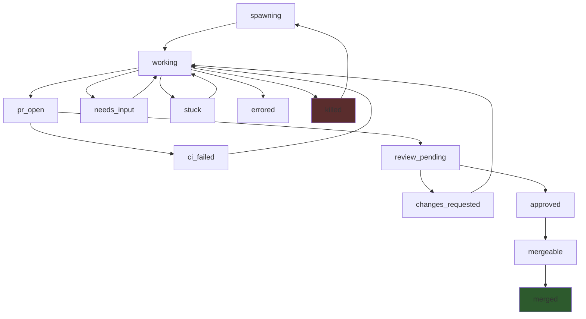
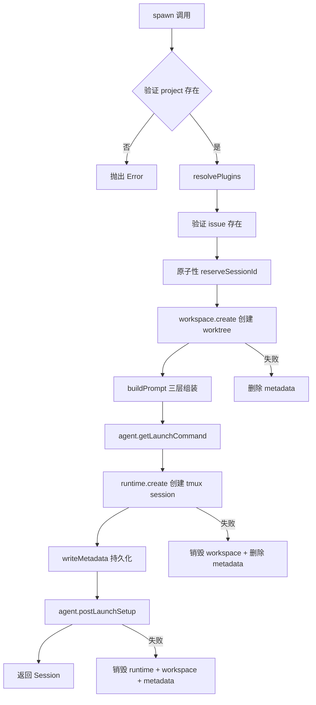
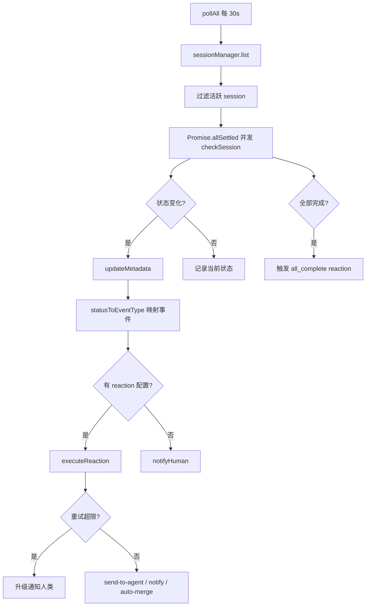

# PD-02.07 AgentOrchestrator — Session 状态机与批量派发编排

> 文档编号：PD-02.07
> 来源：AgentOrchestrator `packages/core/src/session-manager.ts`, `packages/core/src/lifecycle-manager.ts`
> GitHub：https://github.com/ComposioHQ/agent-orchestrator.git
> 问题域：PD-02 多 Agent 编排 Multi-Agent Orchestration
> 状态：可复用方案

---

## 第 1 章 问题与动机

### 1.1 核心问题

当需要同时让多个 AI Agent 并行处理不同 issue 时，面临三个核心挑战：

1. **进程隔离**：每个 Agent 需要独立的代码工作区（避免 git 冲突）和独立的运行时环境（避免进程干扰）
2. **生命周期管理**：Agent 从 spawn 到 PR merged 的完整生命周期涉及 14 种状态，需要自动检测状态转换并触发相应反应（CI 失败自动修复、Review 评论自动转发等）
3. **批量派发与去重**：一次性派发 N 个 issue 给 N 个 Agent 时，需要检测重复、处理失败、控制并发节奏

与 LangGraph DAG 编排（DeerFlow）或 Master-Worker 委托（GPT-Researcher）不同，agent-orchestrator 采用的是**进程级隔离 + 轮询状态机**模式：每个 Agent 是一个独立的 tmux 会话进程，编排器通过定时轮询检测状态变化，而非通过消息传递或函数调用来协调。

### 1.2 AgentOrchestrator 的解法概述

1. **SessionManager** (`session-manager.ts:165`) 提供 CRUD 操作：spawn 创建 workspace + runtime + agent 三件套，kill 按逆序销毁，list 并发枚举所有 session 并用 2s 超时防止慢探测阻塞
2. **LifecycleManager** (`lifecycle-manager.ts:172`) 实现 14 态状态机 + 30s 轮询循环，每个 poll 周期并发检查所有 session，检测状态转换后触发 reaction（send-to-agent / notify / auto-merge）
3. **batch-spawn** (`spawn.ts:84`) 顺序派发 + 双重去重（已有 session 去重 + 同批次去重），每次 spawn 间隔 500ms 防止资源竞争
4. **8 插件槽位** (`types.ts:1-16`) 将 Runtime/Agent/Workspace/Tracker/SCM/Notifier/Terminal 全部抽象为可替换插件，同一编排逻辑可驱动 claude-code/codex/aider 等不同 Agent
5. **三层 Prompt 组装** (`prompt-builder.ts:148`) 将 base 指令、项目上下文、用户规则分层组合，确保每个 Agent 获得一致的行为指引

### 1.3 设计思想

| 设计原则 | 具体实现 | 理由 | 替代方案 |
|----------|----------|------|----------|
| 进程级隔离 | 每个 Agent 独立 tmux session + git worktree | 避免 Agent 间 git 冲突和进程干扰，崩溃不影响其他 Agent | Docker 容器（更重）、线程池（隔离不够） |
| 轮询式状态检测 | LifecycleManager 30s 间隔 pollAll | 无需 Agent 主动上报，兼容任意 Agent 工具（codex/aider/claude） | WebSocket 推送（需 Agent 配合）、文件 watch（不可靠） |
| 插件化架构 | 8 个 PluginSlot + PluginRegistry | 同一编排逻辑适配不同 Runtime/Agent/Workspace/SCM | 硬编码（不可扩展）、微服务（过重） |
| 反应式自愈 | Reaction 配置 + 重试 + 升级通知 | CI 失败/Review 变更自动转发给 Agent，减少人工干预 | 纯通知（需人工操作）、全自动（风险高） |
| 原子性 Session ID | O_EXCL 文件创建 + 10 次重试 | 防止并发 spawn 时 ID 冲突 | 数据库自增（引入外部依赖）、UUID（不可读） |

---

## 第 2 章 源码实现分析

### 2.1 架构概览

agent-orchestrator 的编排架构分为三层：CLI 命令层、Core 服务层、Plugin 执行层。

```
┌─────────────────────────────────────────────────────────────┐
│                     CLI Commands                             │
│  spawn / batch-spawn / start / stop / send / status          │
└──────────────┬──────────────────────────────┬───────────────┘
               │                              │
┌──────────────▼──────────────┐  ┌────────────▼──────────────┐
│      SessionManager         │  │    LifecycleManager        │
│  spawn / kill / list / send │  │  pollAll / checkSession    │
│  restore / cleanup          │  │  executeReaction           │
└──────────────┬──────────────┘  └────────────┬──────────────┘
               │                              │
┌──────────────▼──────────────────────────────▼──────────────┐
│                    PluginRegistry                            │
│  ┌─────────┐ ┌───────┐ ┌──────────┐ ┌─────┐ ┌──────────┐  │
│  │ Runtime  │ │ Agent │ │Workspace │ │ SCM │ │ Notifier │  │
│  │ (tmux)  │ │(claude)│ │(worktree)│ │(gh) │ │(desktop) │  │
│  └─────────┘ └───────┘ └──────────┘ └─────┘ └──────────┘  │
└─────────────────────────────────────────────────────────────┘
```

### 2.2 核心实现

#### 2.2.1 Session 14 态状态机



状态转换由 `determineStatus()` 驱动 (`lifecycle-manager.ts:182-289`)，按优先级依次检查：

对应源码 `packages/core/src/lifecycle-manager.ts:182-289`：
```typescript
async function determineStatus(session: Session): Promise<SessionStatus> {
    const project = config.projects[session.projectId];
    if (!project) return session.status;

    const agentName = session.metadata["agent"] ?? project.agent ?? config.defaults.agent;
    const agent = registry.get<Agent>("agent", agentName);
    const scm = project.scm ? registry.get<SCM>("scm", project.scm.plugin) : null;

    // 1. Check if runtime is alive
    if (session.runtimeHandle) {
      const runtime = registry.get<Runtime>("runtime", project.runtime ?? config.defaults.runtime);
      if (runtime) {
        const alive = await runtime.isAlive(session.runtimeHandle).catch(() => true);
        if (!alive) return "killed";
      }
    }

    // 2. Check agent activity via terminal output + process liveness
    if (agent && session.runtimeHandle) {
      try {
        const runtime = registry.get<Runtime>("runtime", project.runtime ?? config.defaults.runtime);
        const terminalOutput = runtime ? await runtime.getOutput(session.runtimeHandle, 10) : "";
        if (terminalOutput) {
          const activity = agent.detectActivity(terminalOutput);
          if (activity === "waiting_input") return "needs_input";
          const processAlive = await agent.isProcessRunning(session.runtimeHandle);
          if (!processAlive) return "killed";
        }
      } catch {
        if (session.status === SESSION_STATUS.STUCK || session.status === SESSION_STATUS.NEEDS_INPUT) {
          return session.status;
        }
      }
    }

    // 3. Auto-detect PR by branch (for agents without hook systems)
    // 4. Check PR state → merged/closed/ci_failed/review/approved/mergeable
    // 5. Default: if agent is active, it's working
    return session.status;
}
```

#### 2.2.2 Spawn 流程：三件套创建



对应源码 `packages/core/src/session-manager.ts:315-559`：
```typescript
async function spawn(spawnConfig: SessionSpawnConfig): Promise<Session> {
    const project = config.projects[spawnConfig.projectId];
    if (!project) throw new Error(`Unknown project: ${spawnConfig.projectId}`);

    const plugins = resolvePlugins(project);

    // 原子性 Session ID 预留 — O_EXCL 防并发冲突
    let num = getNextSessionNumber(existingSessions, project.sessionPrefix);
    let sessionId: string;
    for (let attempts = 0; attempts < 10; attempts++) {
      sessionId = `${project.sessionPrefix}-${num}`;
      if (reserveSessionId(sessionsDir, sessionId)) break;
      num++;
    }

    // 创建 workspace（git worktree）
    let workspacePath = project.path;
    if (plugins.workspace) {
      const wsInfo = await plugins.workspace.create({
        projectId: spawnConfig.projectId, project, sessionId, branch,
      });
      workspacePath = wsInfo.path;
    }

    // 三层 Prompt 组装
    const composedPrompt = buildPrompt({ project, projectId, issueId, issueContext, userPrompt });

    // 创建 runtime（tmux session）
    handle = await plugins.runtime.create({
      sessionId: tmuxName ?? sessionId,
      workspacePath,
      launchCommand: plugins.agent.getLaunchCommand(agentLaunchConfig),
      environment: { ...plugins.agent.getEnvironment(agentLaunchConfig), AO_SESSION: sessionId },
    });

    // 持久化 metadata（flat key=value 文件）
    writeMetadata(sessionsDir, sessionId, {
      worktree: workspacePath, branch, status: "spawning",
      agent: plugins.agent.name, runtimeHandle: JSON.stringify(handle),
    });
    return session;
}
```

#### 2.2.3 LifecycleManager 轮询与反应引擎



对应源码 `packages/core/src/lifecycle-manager.ts:524-580`：
```typescript
async function pollAll(): Promise<void> {
    if (polling) return; // 重入保护
    polling = true;
    try {
      const sessions = await sessionManager.list();
      const sessionsToCheck = sessions.filter((s) => {
        if (s.status !== "merged" && s.status !== "killed") return true;
        const tracked = states.get(s.id);
        return tracked !== undefined && tracked !== s.status;
      });

      // 并发检查所有 session
      await Promise.allSettled(sessionsToCheck.map((s) => checkSession(s)));

      // 清理已不存在的 session 的跟踪状态
      const currentSessionIds = new Set(sessions.map((s) => s.id));
      for (const trackedId of states.keys()) {
        if (!currentSessionIds.has(trackedId)) states.delete(trackedId);
      }

      // 全部完成检测（只触发一次）
      const activeSessions = sessions.filter((s) => s.status !== "merged" && s.status !== "killed");
      if (sessions.length > 0 && activeSessions.length === 0 && !allCompleteEmitted) {
        allCompleteEmitted = true;
        // 触发 all-complete reaction
      }
    } finally {
      polling = false;
    }
}
```

### 2.3 实现细节

#### 批量派发与双重去重

`batch-spawn` (`spawn.ts:84-179`) 实现了两层去重机制：

1. **已有 session 去重**：spawn 前一次性加载所有 session，构建 `issueId → sessionId` 映射，排除已有活跃 session 的 issue（排除 killed/done/exited 状态）
2. **同批次去重**：用 `spawnedIssues` Set 记录本批次已派发的 issue，防止同一 issue 在参数中重复出现

```typescript
// spawn.ts:116-122 — 预加载 + 排除死亡 session
const deadStatuses = new Set(["killed", "done", "exited"]);
const existingSessions = await sm.list(projectId);
const existingIssueMap = new Map(
  existingSessions
    .filter((s) => s.issueId && !deadStatuses.has(s.status))
    .map((s) => [s.issueId!.toLowerCase(), s.id]),
);
```

每次 spawn 间隔 500ms (`spawn.ts:151`)，防止 tmux session 创建和 git worktree 操作的资源竞争。

#### Tmux Runtime 长命令注入

tmux `send-keys` 对超过 200 字符的命令会截断。runtime-tmux 插件 (`runtime-tmux/src/index.ts:62-77`) 用 `load-buffer` + `paste-buffer` 绕过：

```typescript
// runtime-tmux/src/index.ts:62-77
if (config.launchCommand.length > 200) {
  const bufferName = `ao-launch-${randomUUID().slice(0, 8)}`;
  const tmpPath = join(tmpdir(), `ao-launch-${randomUUID()}.txt`);
  writeFileSync(tmpPath, config.launchCommand, { encoding: "utf-8", mode: 0o600 });
  await tmux("load-buffer", "-b", bufferName, tmpPath);
  await tmux("paste-buffer", "-b", bufferName, "-t", sessionName, "-d");
  await sleep(300);
  await tmux("send-keys", "-t", sessionName, "Enter");
}
```

#### Flat-file Metadata 与原子预留

Session 元数据用 `key=value` 纯文本文件存储 (`metadata.ts`)，兼容 bash 脚本读写。Session ID 预留使用 `O_EXCL` 标志原子创建文件 (`metadata.ts:264-274`)，防止并发 spawn 冲突：

```typescript
// metadata.ts:264-274
export function reserveSessionId(dataDir: string, sessionId: SessionId): boolean {
  const path = metadataPath(dataDir, sessionId);
  mkdirSync(dirname(path), { recursive: true });
  try {
    const fd = openSync(path, constants.O_WRONLY | constants.O_CREAT | constants.O_EXCL);
    closeSync(fd);
    return true;
  } catch { return false; }
}
```

---

## 第 3 章 迁移指南

### 3.1 迁移清单

**阶段 1：核心状态机（1 周）**
- [ ] 定义 SessionStatus 枚举（至少 spawning/working/pr_open/ci_failed/merged/killed）
- [ ] 实现 flat-file metadata 读写（key=value 格式，兼容 shell 脚本）
- [ ] 实现 `reserveSessionId` 原子预留（O_EXCL）
- [ ] 实现 `determineStatus` 状态检测逻辑（runtime alive → agent activity → PR state）

**阶段 2：插件化 Runtime/Workspace（1 周）**
- [ ] 定义 Runtime 接口（create/destroy/sendMessage/getOutput/isAlive）
- [ ] 实现 tmux Runtime 插件（含 load-buffer 长命令注入）
- [ ] 定义 Workspace 接口（create/destroy/list/postCreate）
- [ ] 实现 git worktree Workspace 插件

**阶段 3：SessionManager CRUD（1 周）**
- [ ] 实现 spawn 流程（workspace → runtime → agent → metadata）
- [ ] 实现 kill 流程（逆序销毁 + metadata 归档）
- [ ] 实现 list 流程（并发枚举 + 2s 超时保护）
- [ ] 实现 send 流程（通过 runtime.sendMessage 转发）

**阶段 4：LifecycleManager + Reactions（1 周）**
- [ ] 实现 pollAll 轮询循环（30s 间隔 + 重入保护）
- [ ] 实现状态转换检测 + 事件发射
- [ ] 实现 Reaction 引擎（send-to-agent / notify / auto-merge）
- [ ] 实现重试计数 + 升级通知

**阶段 5：batch-spawn + CLI（3 天）**
- [ ] 实现双重去重（已有 session + 同批次）
- [ ] 实现 500ms 间隔顺序派发
- [ ] 实现 CLI 命令注册

### 3.2 适配代码模板

以下是一个最小可运行的 SessionManager + LifecycleManager 骨架（TypeScript）：

```typescript
// === 类型定义 ===
type SessionStatus = "spawning" | "working" | "pr_open" | "ci_failed" | "merged" | "killed";

interface Session {
  id: string;
  projectId: string;
  status: SessionStatus;
  branch: string | null;
  workspacePath: string | null;
  runtimeHandle: { id: string; runtimeName: string } | null;
  createdAt: Date;
}

// === Runtime 插件接口 ===
interface Runtime {
  create(config: { sessionId: string; workspacePath: string; launchCommand: string }): Promise<{ id: string; runtimeName: string }>;
  destroy(handle: { id: string }): Promise<void>;
  sendMessage(handle: { id: string }, message: string): Promise<void>;
  isAlive(handle: { id: string }): Promise<boolean>;
  getOutput(handle: { id: string }, lines?: number): Promise<string>;
}

// === Workspace 插件接口 ===
interface Workspace {
  create(config: { sessionId: string; branch: string; projectPath: string }): Promise<{ path: string }>;
  destroy(workspacePath: string): Promise<void>;
}

// === Flat-file Metadata ===
import { openSync, closeSync, constants, readFileSync, writeFileSync, existsSync, mkdirSync } from "fs";
import { join, dirname } from "path";

function reserveSessionId(dataDir: string, sessionId: string): boolean {
  const path = join(dataDir, sessionId);
  mkdirSync(dirname(path), { recursive: true });
  try {
    const fd = openSync(path, constants.O_WRONLY | constants.O_CREAT | constants.O_EXCL);
    closeSync(fd);
    return true;
  } catch { return false; }
}

function writeMetadata(dataDir: string, sessionId: string, data: Record<string, string>): void {
  const content = Object.entries(data).filter(([, v]) => v).map(([k, v]) => `${k}=${v}`).join("\n") + "\n";
  writeFileSync(join(dataDir, sessionId), content, "utf-8");
}

function readMetadata(dataDir: string, sessionId: string): Record<string, string> | null {
  const path = join(dataDir, sessionId);
  if (!existsSync(path)) return null;
  const result: Record<string, string> = {};
  for (const line of readFileSync(path, "utf-8").split("\n")) {
    const eq = line.indexOf("=");
    if (eq > 0) result[line.slice(0, eq).trim()] = line.slice(eq + 1).trim();
  }
  return result;
}

// === SessionManager 核心 ===
function createSessionManager(runtime: Runtime, workspace: Workspace, dataDir: string) {
  async function spawn(projectId: string, issueId?: string): Promise<Session> {
    // 1. 原子预留 Session ID
    let sessionId = "";
    for (let i = 1; i <= 100; i++) {
      sessionId = `${projectId}-${i}`;
      if (reserveSessionId(dataDir, sessionId)) break;
    }

    // 2. 创建 workspace
    const branch = issueId ? `feat/${issueId}` : `session/${sessionId}`;
    const ws = await workspace.create({ sessionId, branch, projectPath: `/path/to/${projectId}` });

    // 3. 创建 runtime
    const handle = await runtime.create({
      sessionId,
      workspacePath: ws.path,
      launchCommand: `claude --prompt "Work on ${issueId ?? 'task'}"`,
    });

    // 4. 持久化 metadata
    writeMetadata(dataDir, sessionId, {
      status: "spawning", branch, worktree: ws.path,
      runtimeHandle: JSON.stringify(handle),
    });

    return { id: sessionId, projectId, status: "spawning", branch, workspacePath: ws.path, runtimeHandle: handle, createdAt: new Date() };
  }

  return { spawn };
}

// === LifecycleManager 核心 ===
function createLifecycleManager(
  sessionManager: ReturnType<typeof createSessionManager>,
  runtime: Runtime,
  dataDir: string,
) {
  const states = new Map<string, SessionStatus>();
  let polling = false;

  async function checkSession(session: Session): Promise<void> {
    const oldStatus = states.get(session.id) ?? session.status;
    let newStatus: SessionStatus = session.status;

    // 检测 runtime 存活
    if (session.runtimeHandle) {
      const alive = await runtime.isAlive(session.runtimeHandle).catch(() => true);
      if (!alive) newStatus = "killed";
    }

    if (newStatus !== oldStatus) {
      states.set(session.id, newStatus);
      writeMetadata(dataDir, session.id, { status: newStatus });
      console.log(`[lifecycle] ${session.id}: ${oldStatus} → ${newStatus}`);
      // 这里触发 reaction（send-to-agent / notify 等）
    }
  }

  function start(intervalMs = 30_000): NodeJS.Timeout {
    return setInterval(async () => {
      if (polling) return;
      polling = true;
      try {
        // const sessions = await sessionManager.list();
        // await Promise.allSettled(sessions.map(checkSession));
      } finally {
        polling = false;
      }
    }, intervalMs);
  }

  return { start, checkSession };
}
```

### 3.3 适用场景

| 场景 | 适用度 | 说明 |
|------|--------|------|
| 多 issue 并行开发 | ⭐⭐⭐ | 核心场景：N 个 Agent 同时处理 N 个 issue |
| CI/CD 自动修复 | ⭐⭐⭐ | Reaction 引擎自动将 CI 失败转发给 Agent |
| 多 Agent 工具混用 | ⭐⭐⭐ | 插件化支持 claude-code/codex/aider 混合使用 |
| 实时协作编排 | ⭐ | 轮询模式延迟 30s，不适合需要实时协调的场景 |
| 单任务深度推理 | ⭐ | 过重，单任务用 single Agent + 多工具更合适 |
| DAG 依赖编排 | ⭐⭐ | 无原生 DAG 支持，需自行在 orchestrator agent 中实现 |

---

## 第 4 章 测试用例

```python
import pytest
import os
import tempfile
import json
from pathlib import Path
from unittest.mock import AsyncMock, MagicMock, patch


class TestSessionMetadata:
    """测试 flat-file metadata 读写"""

    def setup_method(self):
        self.tmpdir = tempfile.mkdtemp()

    def test_reserve_session_id_atomic(self):
        """O_EXCL 原子预留：首次成功，重复失败"""
        path = os.path.join(self.tmpdir, "app-1")
        # 首次创建成功
        fd = os.open(path, os.O_WRONLY | os.O_CREAT | os.O_EXCL)
        os.close(fd)
        assert os.path.exists(path)
        # 重复创建失败
        with pytest.raises(FileExistsError):
            os.open(path, os.O_WRONLY | os.O_CREAT | os.O_EXCL)

    def test_metadata_roundtrip(self):
        """key=value 格式读写往返"""
        path = os.path.join(self.tmpdir, "app-2")
        data = {"status": "working", "branch": "feat/INT-1", "worktree": "/tmp/wt"}
        content = "\n".join(f"{k}={v}" for k, v in data.items()) + "\n"
        with open(path, "w") as f:
            f.write(content)

        # 读回
        result = {}
        with open(path) as f:
            for line in f:
                line = line.strip()
                if not line or line.startswith("#"):
                    continue
                eq = line.index("=")
                result[line[:eq].strip()] = line[eq + 1:].strip()

        assert result == data

    def test_metadata_update_merge(self):
        """增量更新不丢失已有字段"""
        path = os.path.join(self.tmpdir, "app-3")
        # 初始写入
        with open(path, "w") as f:
            f.write("status=spawning\nbranch=feat/X\n")
        # 增量更新
        existing = {}
        with open(path) as f:
            for line in f:
                eq = line.strip().find("=")
                if eq > 0:
                    existing[line[:eq].strip()] = line[eq + 1:].strip()
        existing["status"] = "working"
        existing["pr"] = "https://github.com/org/repo/pull/42"
        with open(path, "w") as f:
            f.write("\n".join(f"{k}={v}" for k, v in existing.items()) + "\n")

        # 验证
        final = {}
        with open(path) as f:
            for line in f:
                eq = line.strip().find("=")
                if eq > 0:
                    final[line[:eq].strip()] = line[eq + 1:].strip()
        assert final["status"] == "working"
        assert final["branch"] == "feat/X"  # 未丢失
        assert final["pr"] == "https://github.com/org/repo/pull/42"


class TestBatchSpawnDedup:
    """测试批量派发去重逻辑"""

    def test_same_batch_dedup(self):
        """同批次重复 issue 应被跳过"""
        issues = ["INT-1", "INT-2", "INT-1", "INT-3", "int-1"]
        spawned = set()
        created = []
        skipped = []

        for issue in issues:
            if issue.lower() in spawned:
                skipped.append(issue)
                continue
            created.append(issue)
            spawned.add(issue.lower())

        assert created == ["INT-1", "INT-2", "INT-3"]
        assert skipped == ["INT-1", "int-1"]

    def test_existing_session_dedup(self):
        """已有活跃 session 的 issue 应被跳过"""
        existing_sessions = [
            {"issueId": "INT-1", "status": "working", "id": "app-1"},
            {"issueId": "INT-2", "status": "killed", "id": "app-2"},  # dead → 不阻塞
        ]
        dead_statuses = {"killed", "done", "exited"}
        existing_map = {
            s["issueId"].lower(): s["id"]
            for s in existing_sessions
            if s["issueId"] and s["status"] not in dead_statuses
        }

        assert "int-1" in existing_map  # 活跃 → 阻塞
        assert "int-2" not in existing_map  # 已死 → 不阻塞


class TestLifecycleStateMachine:
    """测试状态机转换逻辑"""

    def test_status_to_event_type(self):
        """状态 → 事件类型映射"""
        mapping = {
            "working": "session.working",
            "pr_open": "pr.created",
            "ci_failed": "ci.failing",
            "review_pending": "review.pending",
            "changes_requested": "review.changes_requested",
            "approved": "review.approved",
            "mergeable": "merge.ready",
            "merged": "merge.completed",
            "needs_input": "session.needs_input",
            "stuck": "session.stuck",
            "killed": "session.killed",
        }
        for status, expected_event in mapping.items():
            assert expected_event is not None, f"Status {status} should map to an event"

    def test_reaction_escalation(self):
        """重试超限后应升级通知"""
        max_retries = 3
        tracker = {"attempts": 0, "first_triggered": None}

        for i in range(5):
            tracker["attempts"] += 1
            should_escalate = tracker["attempts"] > max_retries

            if i < 3:
                assert not should_escalate
            else:
                assert should_escalate

    def test_reentry_guard(self):
        """轮询重入保护"""
        polling = False
        call_count = 0

        def poll_all():
            nonlocal polling, call_count
            if polling:
                return  # 跳过
            polling = True
            call_count += 1
            # 模拟嵌套调用
            poll_all()  # 应被跳过
            polling = False

        poll_all()
        assert call_count == 1  # 只执行一次


class TestInferPriority:
    """测试事件优先级推断"""

    def test_urgent_events(self):
        """stuck/needs_input/errored → urgent"""
        urgent_types = ["session.stuck", "session.needs_input", "session.errored"]
        for t in urgent_types:
            if "stuck" in t or "needs_input" in t or "errored" in t:
                assert True  # priority = "urgent"

    def test_action_events(self):
        """approved/ready/merged → action"""
        action_types = ["review.approved", "merge.ready", "merge.completed"]
        for t in action_types:
            if "approved" in t or "ready" in t or "merged" in t or "completed" in t:
                assert True  # priority = "action"
```

---

## 第 5 章 跨域关联

| 关联域 | 关系类型 | 说明 |
|--------|----------|------|
| PD-01 上下文管理 | 协同 | 三层 Prompt 组装（`prompt-builder.ts`）控制注入 Agent 的上下文量；orchestrator prompt（`orchestrator-prompt.ts`）为编排 Agent 提供完整命令参考 |
| PD-04 工具系统 | 依赖 | 8 插件槽位（Runtime/Agent/Workspace/Tracker/SCM/Notifier/Terminal）本质是工具系统设计，PluginRegistry 提供注册/发现/加载机制 |
| PD-05 沙箱隔离 | 依赖 | 每个 Agent 的 git worktree + tmux session 构成进程级沙箱，Workspace 插件负责创建/销毁隔离环境 |
| PD-06 记忆持久化 | 协同 | flat-file metadata（key=value）是 session 状态的持久化载体，支持 session restore 从归档恢复 |
| PD-09 Human-in-the-Loop | 协同 | Reaction 引擎的 escalation 机制（重试超限 → 通知人类）是 HITL 的具体实现；Notifier 插件（desktop/slack/webhook）是通知通道 |
| PD-11 可观测性 | 协同 | LifecycleManager 的事件系统（OrchestratorEvent）提供全链路可观测性；AgentSessionInfo 包含 cost 估算（inputTokens/outputTokens/estimatedCostUsd） |

---

## 第 6 章 来源文件索引

| 文件 | 行范围 | 关键实现 |
|------|--------|----------|
| `packages/core/src/types.ts` | L1-L1087 | 全部类型定义：8 插件接口、14 态 SessionStatus、OrchestratorConfig、OrchestratorEvent |
| `packages/core/src/session-manager.ts` | L165-L1110 | SessionManager 工厂函数：spawn/kill/list/get/send/restore/cleanup/spawnOrchestrator |
| `packages/core/src/lifecycle-manager.ts` | L172-L607 | LifecycleManager 工厂函数：determineStatus/checkSession/pollAll/executeReaction |
| `packages/core/src/metadata.ts` | L1-L275 | flat-file metadata CRUD：readMetadata/writeMetadata/updateMetadata/deleteMetadata/reserveSessionId |
| `packages/core/src/prompt-builder.ts` | L1-L179 | 三层 Prompt 组装：BASE_AGENT_PROMPT + buildConfigLayer + readUserRules |
| `packages/core/src/orchestrator-prompt.ts` | L1-L212 | Orchestrator Agent 专用 prompt 生成：命令参考、工作流、reaction 规则 |
| `packages/core/src/paths.ts` | L1-L195 | 路径工具：hash-based 目录结构、tmux 名称生成、origin 碰撞检测 |
| `packages/core/src/config.ts` | L1-L420+ | 配置加载：Zod schema 验证、路径展开、默认值填充、项目唯一性校验 |
| `packages/plugins/runtime-tmux/src/index.ts` | L1-L185 | tmux Runtime 插件：create/destroy/sendMessage/getOutput/isAlive，含 load-buffer 长命令注入 |
| `packages/plugins/workspace-worktree/src/index.ts` | L1-L280+ | git worktree Workspace 插件：create/destroy/list/exists/restore/postCreate |
| `packages/cli/src/commands/spawn.ts` | L1-L180 | spawn + batch-spawn CLI 命令：双重去重、500ms 间隔、结果汇总 |
| `packages/cli/src/commands/start.ts` | L1-L290 | ao start/stop 命令：dashboard 启动 + orchestrator session 创建 |

---

## 第 7 章 横向对比维度

```json comparison_data
{
  "project": "AgentOrchestrator",
  "dimensions": {
    "编排模式": "进程级隔离 + 轮询状态机，每个 Agent 独立 tmux session",
    "并行能力": "batch-spawn 顺序派发 N 个 Agent，500ms 间隔防竞争",
    "状态管理": "14 态状态机 + flat-file metadata（key=value 纯文本）",
    "并发限制": "无硬性上限，受 tmux session 数和系统资源限制",
    "工具隔离": "8 插件槽位（Runtime/Agent/Workspace/SCM/Tracker/Notifier/Terminal）",
    "模块自治": "每个 Agent 完全自治，编排器仅通过 sendMessage 干预",
    "懒初始化": "PluginRegistry 按需 get，未使用的插件不实例化",
    "结果回传": "Agent 自行创建 PR，编排器通过 SCM 插件轮询 PR 状态",
    "反应式自愈": "Reaction 引擎：CI 失败/Review 变更自动转发 Agent + 重试升级",
    "原子性保障": "O_EXCL 文件创建防并发 Session ID 冲突"
  }
}
```

### 域元数据补充

```json domain_metadata
{
  "solution_summary": "AgentOrchestrator 用 tmux session + git worktree 进程级隔离 + 14 态轮询状态机 + Reaction 自愈引擎实现多 Agent 批量派发编排",
  "description": "进程级隔离编排：每个 Agent 独立操作系统进程，通过轮询而非消息传递协调",
  "sub_problems": [
    "进程级隔离：如何为每个 Agent 提供独立的运行时环境和代码工作区",
    "批量去重：批量派发时如何检测已有 session 和同批次重复 issue",
    "Agent 工具适配：同一编排逻辑如何驱动不同 AI 编码工具（claude/codex/aider）",
    "Session 恢复：崩溃的 Agent session 如何从归档 metadata 恢复并重新启动"
  ],
  "best_practices": [
    "原子性 ID 预留：用 O_EXCL 文件创建防止并发 spawn 时 Session ID 冲突",
    "轮询重入保护：polling flag 防止上一轮未完成时下一轮重入",
    "2s 超时保护：list 枚举时每个 session 的 runtime 探测设 2s 上限，防止慢探测阻塞全局",
    "逆序销毁：kill 时按 runtime → workspace → metadata 逆序清理，每步 best-effort 不阻塞"
  ]
}
```
