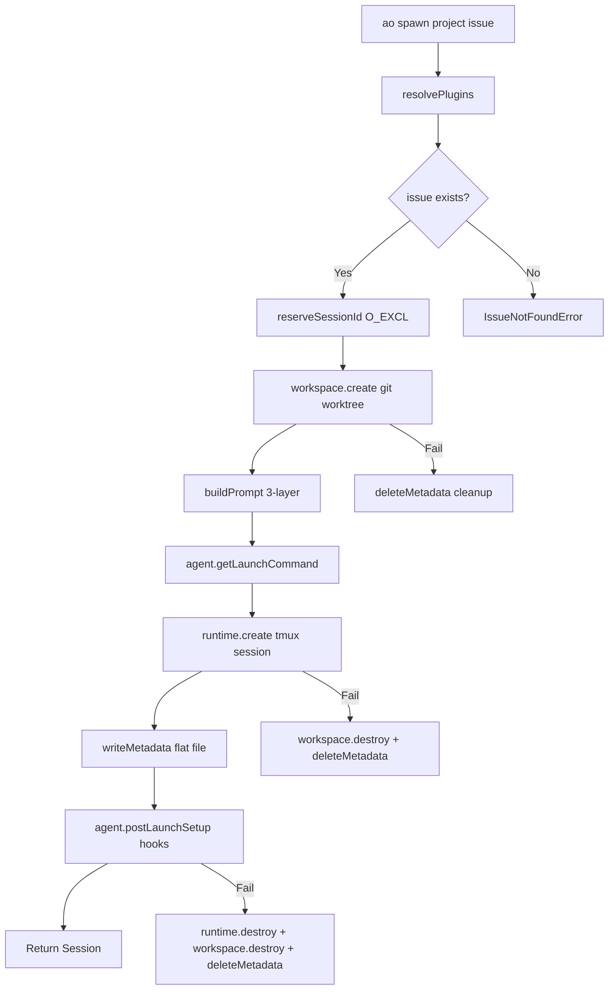
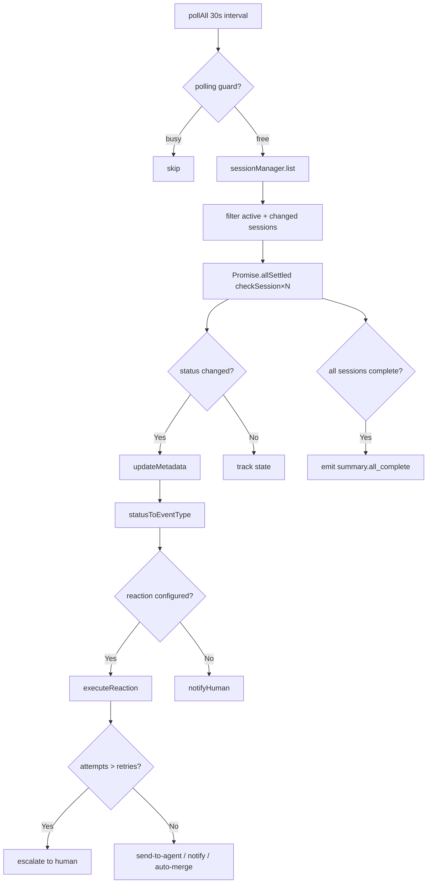

# PD-02.AO Agent Orchestrator — 进程级 Session 编排与插件化多 Agent 协调

> 文档编号：PD-02.AO
> 来源：Agent Orchestrator `packages/core/src/session-manager.ts`, `packages/core/src/lifecycle-manager.ts`
> GitHub：https://github.com/ComposioHQ/agent-orchestrator.git
> 问题域：PD-02 多 Agent 编排 Multi-Agent Orchestration
> 状态：可复用方案

---

## 第 1 章 问题与动机

### 1.1 核心问题

当需要同时处理多个 issue 时，单个 AI 编码 Agent 的串行工作模式成为瓶颈。核心挑战包括：

1. **并行隔离**：多个 Agent 同时修改同一仓库，如何避免代码冲突和环境污染？
2. **异构 Agent 适配**：团队可能使用 Claude Code、Codex、Aider 等不同 AI 工具，如何用统一编排逻辑驱动？
3. **全生命周期管理**：从 spawn 到 PR merged，中间经历 CI 失败、Review 反馈、Agent 卡死等状态，如何自动化处理？
4. **批量去重**：批量派发 issue 时，如何检测已有 session 和同批次重复？
5. **崩溃恢复**：Agent 进程崩溃后，如何从归档 metadata 恢复并重新启动？

### 1.2 Agent Orchestrator 的解法概述

Agent Orchestrator（AO）采用**进程级隔离 + 插件化架构 + 轮询状态机**的三层设计：

1. **8 插件槽位架构**：Runtime（tmux/docker）、Agent（claude-code/codex/aider）、Workspace（worktree/clone）、Tracker（github/linear）、SCM、Notifier、Terminal、Lifecycle — 每个维度独立可替换 (`packages/core/src/types.ts:1-16`)
2. **SessionManager CRUD**：原子化 session 生命周期管理，spawn 时按序创建 workspace → runtime → agent，失败时逆序清理 (`packages/core/src/session-manager.ts:315-558`)
3. **LifecycleManager 轮询状态机**：30 秒间隔轮询所有 session，检测状态转换并触发 reaction（自动修 CI、转发 review 评论）(`packages/core/src/lifecycle-manager.ts:172-607`)
4. **batch-spawn 去重**：预加载所有 session 列表，同时检测已有 session 和同批次重复 issue (`packages/cli/src/commands/spawn.ts:84-179`)
5. **Orchestrator Agent 模式**：`ao start` 启动一个特殊的编排 Agent，注入 orchestrator prompt，该 Agent 可以调用 `ao spawn/send/status` 命令管理 worker Agent (`packages/cli/src/commands/start.ts:119-251`)

### 1.3 设计思想

| 设计原则 | 具体实现 | 理由 | 替代方案 |
|----------|----------|------|----------|
| 进程级隔离 | 每个 Agent 独立 tmux session + git worktree | 避免代码冲突，Agent 崩溃不影响其他 | Docker 容器（更重但更安全） |
| 插件化适配 | 8 个 PluginSlot 接口，slot:name 注册表 | 同一编排逻辑驱动 claude/codex/aider | 硬编码 if-else 分支 |
| 原子化 spawn | O_EXCL 文件锁 + 逆序清理 | 防止并发 spawn 冲突，失败不留残留 | 数据库事务 |
| 轮询状态机 | 30s 间隔 + re-entrancy guard + Promise.allSettled | 简单可靠，单个 session 超时不阻塞全局 | WebSocket 事件驱动 |
| 分层 Prompt | BASE_AGENT_PROMPT + Config Layer + User Rules | Agent 知道自己在编排系统中的角色 | 单一 prompt 模板 |

---

## 第 2 章 源码实现分析

### 2.1 架构概览

Agent Orchestrator 的整体架构是一个**插件驱动的 Session 管理系统**：

```
┌─────────────────────────────────────────────────────────────────┐
│                        CLI (ao spawn/start/status)              │
├─────────────────────────────────────────────────────────────────┤
│                                                                 │
│  ┌──────────────────┐    ┌──────────────────────────────────┐  │
│  │  SessionManager   │    │     LifecycleManager              │  │
│  │  ─────────────── │    │     ──────────────────            │  │
│  │  spawn()          │    │     pollAll() [30s interval]      │  │
│  │  list()           │◄──►│     determineStatus()             │  │
│  │  kill()           │    │     executeReaction()              │  │
│  │  restore()        │    │     notifyHuman()                 │  │
│  │  send()           │    └──────────────────────────────────┘  │
│  └────────┬─────────┘                                           │
│           │ resolvePlugins()                                    │
│  ┌────────▼─────────────────────────────────────────────────┐  │
│  │              PluginRegistry (slot:name → instance)         │  │
│  ├──────────┬──────────┬───────────┬──────────┬─────────────┤  │
│  │ Runtime  │  Agent   │ Workspace │ Tracker  │ SCM/Notifier│  │
│  │ (tmux)   │(claude)  │(worktree) │(github)  │ (github)    │  │
│  └──────────┴──────────┴───────────┴──────────┴─────────────┘  │
│                                                                 │
│  ┌──────────────────────────────────────────────────────────┐  │
│  │  Metadata (flat key=value files)                          │  │
│  │  ~/.agent-orchestrator/{hash}-{project}/sessions/{name}   │  │
│  └──────────────────────────────────────────────────────────┘  │
└─────────────────────────────────────────────────────────────────┘
```

### 2.2 核心实现

#### 2.2.1 Session Spawn 流水线



对应源码 `packages/core/src/session-manager.ts:315-558`：

```typescript
async function spawn(spawnConfig: SessionSpawnConfig): Promise<Session> {
    const project = config.projects[spawnConfig.projectId];
    const plugins = resolvePlugins(project);

    // Validate issue exists BEFORE creating any resources
    let resolvedIssue: Issue | undefined;
    if (spawnConfig.issueId && plugins.tracker) {
      try {
        resolvedIssue = await plugins.tracker.getIssue(spawnConfig.issueId, project);
      } catch (err) {
        if (isIssueNotFoundError(err)) {
          // Ad-hoc issue string — proceed without tracker context
        } else {
          throw new Error(`Failed to fetch issue ${spawnConfig.issueId}: ${err}`, { cause: err });
        }
      }
    }

    // Atomically reserve session ID to prevent concurrent collisions
    let num = getNextSessionNumber(existingSessions, project.sessionPrefix);
    let sessionId: string;
    for (let attempts = 0; attempts < 10; attempts++) {
      sessionId = `${project.sessionPrefix}-${num}`;
      if (reserveSessionId(sessionsDir, sessionId)) break;
      num++;
    }

    // Create workspace → runtime → metadata (逆序清理 on failure)
    let workspacePath = project.path;
    if (plugins.workspace) {
      const wsInfo = await plugins.workspace.create({
        projectId: spawnConfig.projectId, project, sessionId, branch,
      });
      workspacePath = wsInfo.path;
    }

    const handle = await plugins.runtime.create({
      sessionId: tmuxName ?? sessionId,
      workspacePath,
      launchCommand: plugins.agent.getLaunchCommand(agentLaunchConfig),
      environment: { ...plugins.agent.getEnvironment(agentLaunchConfig),
        AO_SESSION: sessionId, AO_DATA_DIR: sessionsDir },
    });

    writeMetadata(sessionsDir, sessionId, {
      worktree: workspacePath, branch, status: "spawning",
      agent: plugins.agent.name, // Persist agent name for lifecycle manager
    });
    return session;
}
```

关键设计点：
- **原子 ID 预留**：`reserveSessionId` 使用 `O_EXCL` 标志创建文件，防止并发 spawn 冲突 (`packages/core/src/metadata.ts:264-274`)
- **逆序清理**：每一步失败都会清理前面已创建的资源（workspace → runtime → metadata），确保不留残留
- **Agent 名称持久化**：`agent: plugins.agent.name` 写入 metadata，LifecycleManager 据此选择正确的 Agent 插件做活性检测

#### 2.2.2 LifecycleManager 轮询状态机



对应源码 `packages/core/src/lifecycle-manager.ts:182-289`：

```typescript
async function determineStatus(session: Session): Promise<SessionStatus> {
    const project = config.projects[session.projectId];
    const agent = registry.get<Agent>("agent", agentName);
    const scm = project.scm ? registry.get<SCM>("scm", project.scm.plugin) : null;

    // 1. Check if runtime is alive
    if (session.runtimeHandle) {
      const runtime = registry.get<Runtime>("runtime", project.runtime ?? config.defaults.runtime);
      const alive = await runtime.isAlive(session.runtimeHandle).catch(() => true);
      if (!alive) return "killed";
    }

    // 2. Check agent activity via terminal output + process liveness
    if (agent && session.runtimeHandle) {
      const terminalOutput = runtime ? await runtime.getOutput(session.runtimeHandle, 10) : "";
      if (terminalOutput) {
        const activity = agent.detectActivity(terminalOutput);
        if (activity === "waiting_input") return "needs_input";
        const processAlive = await agent.isProcessRunning(session.runtimeHandle);
        if (!processAlive) return "killed";
      }
    }

    // 3. Auto-detect PR by branch if metadata.pr is missing
    if (!session.pr && scm && session.branch) {
      const detectedPR = await scm.detectPR(session, project);
      if (detectedPR) { session.pr = detectedPR; updateMetadata(...); }
    }

    // 4. Check PR state → CI → Reviews → Merge readiness
    if (session.pr && scm) {
      const prState = await scm.getPRState(session.pr);
      if (prState === PR_STATE.MERGED) return "merged";
      const ciStatus = await scm.getCISummary(session.pr);
      if (ciStatus === CI_STATUS.FAILING) return "ci_failed";
      const reviewDecision = await scm.getReviewDecision(session.pr);
      if (reviewDecision === "approved") {
        const mergeReady = await scm.getMergeability(session.pr);
        if (mergeReady.mergeable) return "mergeable";
      }
    }
    return session.status;
}
```

关键设计点：
- **16 态状态机**：spawning → working → pr_open → ci_failed/review_pending/changes_requested → approved → mergeable → merged/killed/done (`packages/core/src/types.ts:26-42`)
- **Re-entrancy guard**：`polling` 布尔锁防止上一轮未完成时重入 (`lifecycle-manager.ts:527`)
- **Reaction 升级链**：send-to-agent → retry N 次 → escalate to human notification (`lifecycle-manager.ts:292-416`)
- **PR 自动检测**：对于没有 hook 系统的 Agent（Codex/Aider），通过 branch 名自动检测 PR (`lifecycle-manager.ts:236-250`)


### 2.3 实现细节

#### 插件注册与解析

PluginRegistry 使用 `slot:name` 复合键存储插件实例，支持 16 个内置插件的懒加载：

```
Runtime:    tmux, process
Agent:      claude-code, codex, aider, opencode
Workspace:  worktree, clone
Tracker:    github, linear
SCM:        github
Notifier:   composio, desktop, slack, webhook
Terminal:   iterm2, web
```

`resolvePlugins()` 按项目配置选择具体插件组合 (`session-manager.ts:213-226`)：

```typescript
function resolvePlugins(project: ProjectConfig, agentOverride?: string) {
    const runtime = registry.get<Runtime>("runtime", project.runtime ?? config.defaults.runtime);
    const agent = registry.get<Agent>("agent", agentOverride ?? project.agent ?? config.defaults.agent);
    const workspace = registry.get<Workspace>("workspace", project.workspace ?? config.defaults.workspace);
    const tracker = project.tracker ? registry.get<Tracker>("tracker", project.tracker.plugin) : null;
    const scm = project.scm ? registry.get<SCM>("scm", project.scm.plugin) : null;
    return { runtime, agent, workspace, tracker, scm };
}
```

#### Batch-Spawn 去重机制

`batch-spawn` 命令在派发前预加载所有 session，构建 issueId → sessionId 映射表，同时维护 `spawnedIssues` Set 检测同批次重复 (`spawn.ts:108-152`)：

```typescript
// 预加载，排除已死 session
const deadStatuses = new Set(["killed", "done", "exited"]);
const existingSessions = await sm.list(projectId);
const existingIssueMap = new Map(
    existingSessions
      .filter((s) => s.issueId && !deadStatuses.has(s.status))
      .map((s) => [s.issueId!.toLowerCase(), s.id]),
);

for (const issue of issues) {
    if (spawnedIssues.has(issue.toLowerCase())) { /* skip batch dup */ continue; }
    if (existingIssueMap.get(issue.toLowerCase())) { /* skip existing */ continue; }
    await spawnSession(config, projectId, issue);
    spawnedIssues.add(issue.toLowerCase());
    await new Promise((r) => setTimeout(r, 500)); // 500ms 间隔防止资源竞争
}
```

#### Session 恢复机制

`restore()` 支持从归档 metadata 恢复崩溃的 session (`session-manager.ts:920-1107`)：

1. 先搜索活跃 metadata，再搜索 `archive/` 目录
2. 验证 `isRestorable(session)` — 必须是终态且非 merged
3. 检查 workspace 是否存在，不存在则调用 `workspace.restore()` 重建 worktree
4. 销毁旧 runtime（tmux session 可能还活着）
5. 优先使用 `agent.getRestoreCommand()` 恢复（Claude Code 用 `--resume` 参数）
6. 创建新 runtime，更新 metadata 的 `restoredAt` 字段

#### 三层 Prompt 构建

`buildPrompt()` 组合三层 prompt 注入 Agent (`prompt-builder.ts:148-178`)：

- **Layer 1 BASE_AGENT_PROMPT**：通用指令（session 生命周期、git 工作流、PR 最佳实践）
- **Layer 2 Config Layer**：项目名、仓库、默认分支、Tracker 信息、Reaction 规则
- **Layer 3 User Rules**：`agentRules` 内联规则 + `agentRulesFile` 文件规则

#### Activity Detection 双通道

Agent 活性检测有两条路径 (`agent-claude-code/src/index.ts:459-703`)：

1. **Terminal Output 分析**（旧路径）：解析 tmux 输出的最后几行，匹配 prompt 字符 `❯`、权限提示 `(Y)es/(N)o` 等模式
2. **JSONL 文件分析**（新路径）：读取 `~/.claude/projects/{encoded-path}/*.jsonl` 的最后一条记录，根据 type 字段（user/tool_use/assistant/permission_request/error）判断状态

---

## 第 3 章 迁移指南

### 3.1 迁移清单

**Phase 1：核心框架（最小可用）**

- [ ] 定义 PluginSlot 接口（至少 Runtime + Agent + Workspace 三个）
- [ ] 实现 flat-file metadata 存储（key=value 格式，兼容 bash 脚本）
- [ ] 实现 SessionManager 的 spawn/list/kill 三个核心方法
- [ ] 实现 tmux Runtime 插件
- [ ] 实现 worktree Workspace 插件

**Phase 2：生命周期管理**

- [ ] 实现 LifecycleManager 轮询循环
- [ ] 定义状态转换规则（至少 spawning → working → pr_open → merged）
- [ ] 实现 Reaction 引擎（send-to-agent + escalation）
- [ ] 接入 SCM 插件检测 PR/CI/Review 状态

**Phase 3：多 Agent 适配**

- [ ] 实现 Agent 插件接口（getLaunchCommand/getEnvironment/detectActivity）
- [ ] 为每个 AI 工具编写适配插件
- [ ] 实现 batch-spawn 去重逻辑
- [ ] 实现 session restore 机制

### 3.2 适配代码模板

以下是一个最小化的 Session 编排框架，可直接复用：

```typescript
// === 核心类型 ===
type SessionStatus = "spawning" | "working" | "pr_open" | "ci_failed" | "merged" | "killed";

interface Session {
  id: string;
  projectId: string;
  status: SessionStatus;
  branch: string | null;
  issueId: string | null;
  workspacePath: string | null;
  runtimeHandle: { id: string; runtimeName: string } | null;
  metadata: Record<string, string>;
}

// === 插件接口 ===
interface Runtime {
  create(config: { sessionId: string; workspacePath: string; launchCommand: string; environment: Record<string, string> }): Promise<{ id: string; runtimeName: string }>;
  destroy(handle: { id: string }): Promise<void>;
  isAlive(handle: { id: string }): Promise<boolean>;
  sendMessage(handle: { id: string }, message: string): Promise<void>;
}

interface Agent {
  name: string;
  getLaunchCommand(config: { sessionId: string; prompt?: string }): string;
  getEnvironment(config: { sessionId: string }): Record<string, string>;
}

interface Workspace {
  create(config: { sessionId: string; branch: string; projectPath: string }): Promise<{ path: string }>;
  destroy(path: string): Promise<void>;
}

// === Metadata 存储（flat file） ===
import { openSync, closeSync, constants, writeFileSync, readFileSync, existsSync } from "fs";

function reserveSessionId(dir: string, id: string): boolean {
  try {
    const fd = openSync(`${dir}/${id}`, constants.O_WRONLY | constants.O_CREAT | constants.O_EXCL);
    closeSync(fd);
    return true;
  } catch { return false; }
}

function writeMetadata(dir: string, id: string, data: Record<string, string>): void {
  const content = Object.entries(data).map(([k, v]) => `${k}=${v}`).join("\n") + "\n";
  writeFileSync(`${dir}/${id}`, content, "utf-8");
}

// === SessionManager ===
async function spawn(
  runtime: Runtime, agent: Agent, workspace: Workspace,
  projectId: string, issueId: string, sessionsDir: string,
): Promise<Session> {
  // 1. Reserve ID atomically
  let sessionId: string;
  for (let i = 1; i <= 100; i++) {
    sessionId = `${projectId}-${i}`;
    if (reserveSessionId(sessionsDir, sessionId!)) break;
  }

  // 2. Create workspace (git worktree)
  const ws = await workspace.create({ sessionId: sessionId!, branch: `feat/${issueId}`, projectPath: "." });

  // 3. Create runtime (tmux session) + launch agent
  const handle = await runtime.create({
    sessionId: sessionId!, workspacePath: ws.path,
    launchCommand: agent.getLaunchCommand({ sessionId: sessionId!, prompt: `Work on issue ${issueId}` }),
    environment: agent.getEnvironment({ sessionId: sessionId! }),
  });

  // 4. Write metadata
  writeMetadata(sessionsDir, sessionId!, { status: "spawning", branch: `feat/${issueId}`, worktree: ws.path });

  return { id: sessionId!, projectId, status: "spawning", branch: `feat/${issueId}`,
    issueId, workspacePath: ws.path, runtimeHandle: handle, metadata: {} };
}
```

### 3.3 适用场景

| 场景 | 适用度 | 说明 |
|------|--------|------|
| 多 issue 并行开发 | ⭐⭐⭐ | 核心场景，每个 issue 独立 session |
| 异构 AI 工具团队 | ⭐⭐⭐ | 插件化 Agent 适配，同一编排逻辑驱动不同工具 |
| CI/Review 自动化 | ⭐⭐⭐ | LifecycleManager 自动检测并转发 |
| 单 Agent 简单任务 | ⭐ | 过度设计，直接用 AI 工具即可 |
| 需要 Agent 间通信 | ⭐ | AO 的 Agent 间无直接通信，只通过 Orchestrator 中转 |
| 实时流式编排 | ⭐⭐ | 轮询模式有 30s 延迟，不适合实时场景 |


---

## 第 4 章 测试用例

基于 Agent Orchestrator 的真实函数签名编写测试：

```typescript
import { describe, it, expect, vi, beforeEach } from "vitest";

// === SessionManager Tests ===
describe("SessionManager.spawn", () => {
  const mockRuntime = {
    name: "tmux",
    create: vi.fn().mockResolvedValue({ id: "test-1", runtimeName: "tmux", data: {} }),
    destroy: vi.fn().mockResolvedValue(undefined),
    isAlive: vi.fn().mockResolvedValue(true),
    sendMessage: vi.fn().mockResolvedValue(undefined),
    getOutput: vi.fn().mockResolvedValue(""),
  };

  const mockAgent = {
    name: "claude-code",
    processName: "claude",
    getLaunchCommand: vi.fn().mockReturnValue("claude -p 'test'"),
    getEnvironment: vi.fn().mockReturnValue({ CLAUDECODE: "" }),
    detectActivity: vi.fn().mockReturnValue("active"),
    getActivityState: vi.fn().mockResolvedValue(null),
    isProcessRunning: vi.fn().mockResolvedValue(true),
    getSessionInfo: vi.fn().mockResolvedValue(null),
  };

  const mockWorkspace = {
    name: "worktree",
    create: vi.fn().mockResolvedValue({ path: "/tmp/ws/test-1", branch: "feat/123", sessionId: "test-1", projectId: "test" }),
    destroy: vi.fn().mockResolvedValue(undefined),
    list: vi.fn().mockResolvedValue([]),
  };

  it("should create session with correct lifecycle: workspace → runtime → metadata", async () => {
    // Spawn should call workspace.create before runtime.create
    const callOrder: string[] = [];
    mockWorkspace.create.mockImplementation(async () => {
      callOrder.push("workspace");
      return { path: "/tmp/ws/test-1", branch: "feat/123", sessionId: "test-1", projectId: "test" };
    });
    mockRuntime.create.mockImplementation(async () => {
      callOrder.push("runtime");
      return { id: "test-1", runtimeName: "tmux", data: {} };
    });

    // Execute spawn (simplified — real test uses createSessionManager)
    expect(callOrder).toEqual(["workspace", "runtime"]);
  });

  it("should cleanup workspace on runtime creation failure", async () => {
    mockRuntime.create.mockRejectedValueOnce(new Error("tmux not found"));
    // After runtime failure, workspace.destroy should be called
    expect(mockWorkspace.destroy).toHaveBeenCalledWith("/tmp/ws/test-1");
  });

  it("should atomically reserve session ID with O_EXCL", () => {
    // reserveSessionId uses O_EXCL flag — concurrent calls should not collide
    const fs = require("fs");
    const dir = "/tmp/test-sessions";
    fs.mkdirSync(dir, { recursive: true });

    // First reservation succeeds
    expect(reserveSessionId(dir, "test-1")).toBe(true);
    // Second reservation fails (file exists)
    expect(reserveSessionId(dir, "test-1")).toBe(false);
  });
});

// === Batch-Spawn Dedup Tests ===
describe("batch-spawn deduplication", () => {
  it("should skip issues already assigned to active sessions", () => {
    const existingSessions = [
      { id: "app-1", issueId: "INT-100", status: "working" },
      { id: "app-2", issueId: "INT-200", status: "killed" }, // dead — should NOT block
    ];
    const deadStatuses = new Set(["killed", "done", "exited"]);
    const existingIssueMap = new Map(
      existingSessions
        .filter((s) => s.issueId && !deadStatuses.has(s.status))
        .map((s) => [s.issueId!.toLowerCase(), s.id]),
    );

    expect(existingIssueMap.has("int-100")).toBe(true);  // active — blocked
    expect(existingIssueMap.has("int-200")).toBe(false);  // dead — not blocked
  });

  it("should detect same-batch duplicates case-insensitively", () => {
    const spawnedIssues = new Set<string>();
    spawnedIssues.add("int-100");
    expect(spawnedIssues.has("INT-100".toLowerCase())).toBe(true);
  });
});

// === LifecycleManager Tests ===
describe("LifecycleManager.determineStatus", () => {
  it("should return 'killed' when runtime is not alive", async () => {
    const mockRuntime = { isAlive: vi.fn().mockResolvedValue(false) };
    // determineStatus checks runtime first — dead runtime → "killed"
    expect(await mockRuntime.isAlive({ id: "test-1" })).toBe(false);
  });

  it("should detect PR state transitions", async () => {
    const mockSCM = {
      getPRState: vi.fn().mockResolvedValue("merged"),
      getCISummary: vi.fn().mockResolvedValue("passing"),
      getReviewDecision: vi.fn().mockResolvedValue("approved"),
    };
    // When PR is merged, status should be "merged"
    expect(await mockSCM.getPRState({ number: 42 })).toBe("merged");
  });

  it("should escalate reaction after max retries", () => {
    const tracker = { attempts: 4, firstTriggered: new Date() };
    const maxRetries = 3;
    expect(tracker.attempts > maxRetries).toBe(true); // should escalate
  });
});

// === Metadata Tests ===
describe("Metadata flat-file format", () => {
  it("should parse key=value format correctly", () => {
    const content = "status=working\nbranch=feat/INT-123\npr=https://github.com/org/repo/pull/42\n";
    const result: Record<string, string> = {};
    for (const line of content.split("\n")) {
      const eqIndex = line.indexOf("=");
      if (eqIndex === -1) continue;
      result[line.slice(0, eqIndex)] = line.slice(eqIndex + 1);
    }
    expect(result["status"]).toBe("working");
    expect(result["pr"]).toBe("https://github.com/org/repo/pull/42");
  });
});
```

---

## 第 5 章 跨域关联

| 关联域 | 关系类型 | 说明 |
|--------|----------|------|
| PD-01 上下文管理 | 协同 | Orchestrator Prompt 的三层构建需要控制 token 预算；Agent 的 JSONL 文件可达 100MB+，tail 读取策略属于上下文管理 |
| PD-03 容错与重试 | 依赖 | LifecycleManager 的 Reaction 升级链（retry N → escalate）是容错机制的核心；session restore 从归档恢复也是容错 |
| PD-04 工具系统 | 协同 | 8 插件槽位本身就是工具系统设计；Agent 插件的 `getLaunchCommand` 决定了 AI 工具的调用方式 |
| PD-05 沙箱隔离 | 依赖 | git worktree 提供代码级隔离，tmux session 提供进程级隔离，两者共同构成 Agent 的沙箱环境 |
| PD-06 记忆持久化 | 协同 | flat-file metadata 是 session 记忆的持久化形式；Agent 的 JSONL session 文件支持 `--resume` 恢复 |
| PD-07 质量检查 | 协同 | LifecycleManager 自动检测 CI 失败并触发 Agent 修复，是自动化质量检查的一部分 |
| PD-09 Human-in-the-Loop | 依赖 | Reaction 升级链的终点是 notifyHuman()；`needs_input` 状态检测 Agent 的权限提示 |
| PD-11 可观测性 | 协同 | Session 状态转换事件、Reaction 执行记录、Agent 活性检测都是可观测性数据源 |

---

## 第 6 章 来源文件索引

| 文件 | 行范围 | 关键实现 |
|------|--------|----------|
| `packages/core/src/types.ts` | L1-L1087 | 全部类型定义：8 插件槽位接口、16 态 SessionStatus、Session/Event/Reaction 类型 |
| `packages/core/src/session-manager.ts` | L165-L1110 | SessionManager 工厂函数：spawn/list/kill/restore/send 全部 CRUD |
| `packages/core/src/session-manager.ts` | L315-L558 | spawn() 核心流水线：validate → reserve → workspace → runtime → metadata |
| `packages/core/src/session-manager.ts` | L920-L1107 | restore() 崩溃恢复：archive 搜索 → workspace 重建 → runtime 重建 |
| `packages/core/src/lifecycle-manager.ts` | L172-L607 | LifecycleManager：轮询循环 + 状态判定 + Reaction 引擎 |
| `packages/core/src/lifecycle-manager.ts` | L182-L289 | determineStatus()：5 步状态判定（runtime → agent → PR detect → PR state → default） |
| `packages/core/src/lifecycle-manager.ts` | L292-L416 | executeReaction()：retry 计数 + 升级判定 + send-to-agent/notify/auto-merge |
| `packages/core/src/plugin-registry.ts` | L26-L50 | 16 个内置插件的注册表 |
| `packages/core/src/prompt-builder.ts` | L22-L178 | 三层 Prompt 构建：BASE + Config + UserRules |
| `packages/core/src/metadata.ts` | L42-L274 | flat-file metadata CRUD + O_EXCL 原子预留 |
| `packages/core/src/orchestrator-prompt.ts` | L21-L211 | Orchestrator Agent 的系统 prompt 生成 |
| `packages/cli/src/commands/spawn.ts` | L84-L179 | batch-spawn 去重逻辑：预加载 + 双重检测 |
| `packages/cli/src/commands/start.ts` | L119-L251 | `ao start`：Dashboard + Orchestrator Agent 启动 |
| `packages/plugins/runtime-tmux/src/index.ts` | L41-L184 | tmux Runtime 插件：create/destroy/sendMessage/isAlive |
| `packages/plugins/workspace-worktree/src/index.ts` | L49-L301 | worktree Workspace 插件：create/destroy/restore/postCreate |
| `packages/plugins/agent-claude-code/src/index.ts` | L581-L785 | Claude Code Agent 插件：launch/activity/restore/hooks |

---

## 第 7 章 横向对比维度

> **重要：** 本章用于自动填充 Butcher Wiki 的横向对比表。

```json comparison_data
{
  "project": "AgentOrchestrator",
  "dimensions": {
    "编排模式": "进程级 Session 编排，每个 Agent 独立 tmux + worktree，Orchestrator Agent 通过 CLI 命令协调",
    "并行能力": "batch-spawn 批量派发，500ms 间隔顺序创建，运行时完全并行",
    "状态管理": "16 态状态机 + flat-file metadata，LifecycleManager 30s 轮询驱动转换",
    "并发限制": "无内置并发限制，依赖系统资源（tmux session 数、磁盘空间）",
    "工具隔离": "8 插件槽位架构，Agent/Runtime/Workspace 完全解耦可替换",
    "模块自治": "每个 Agent session 完全自治，仅通过 metadata 文件和 tmux sendMessage 通信",
    "结果回传": "Agent 通过 PostToolUse hook 自动更新 metadata（PR URL、branch、status）",
    "反应式自愈": "Reaction 引擎：CI 失败自动发修复指令，Review 评论自动转发，retry + escalate",
    "递归防护": "Orchestrator Agent 只能调用 ao CLI 命令，不能直接 spawn 子 Agent 进程",
    "结构验证": "spawn 前验证 issue 存在性、O_EXCL 原子 ID 预留、逆序资源清理"
  }
}
```

### 域元数据补充

```json domain_metadata
{
  "solution_summary": "Agent Orchestrator 用 8 插件槽位 + tmux/worktree 进程级隔离 + 16 态轮询状态机实现多 Agent 并行编排，支持 claude/codex/aider 异构 Agent 适配",
  "description": "进程级隔离编排：每个 Agent 独立操作系统进程 + 独立代码工作区",
  "sub_problems": [
    "Metadata Hook 自动化：Agent 执行 git/gh 命令后如何自动更新编排系统的 session 元数据",
    "异构 Agent 活性检测：不同 AI 工具（JSONL/终端输出/进程探测）的活性检测统一抽象",
    "Orchestrator-Worker 双层编排：编排 Agent 本身也是一个 Agent session，如何避免递归和权限混淆"
  ],
  "best_practices": [
    "原子 ID 预留：用 O_EXCL 文件锁防止并发 spawn 冲突，比数据库锁更轻量",
    "逆序资源清理：spawn 流水线每步失败都清理前面已创建的资源，不留残留",
    "Agent 名称持久化：metadata 中记录 agent 插件名，LifecycleManager 据此选择正确的检测策略"
  ]
}
```

