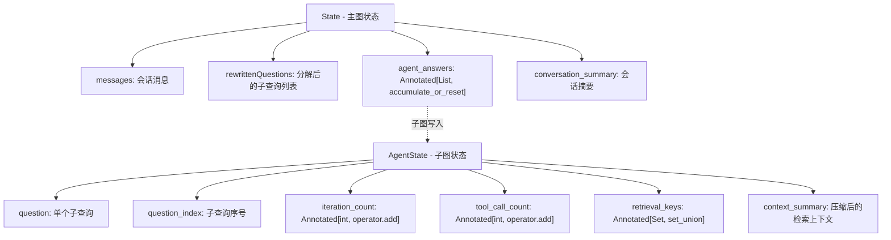
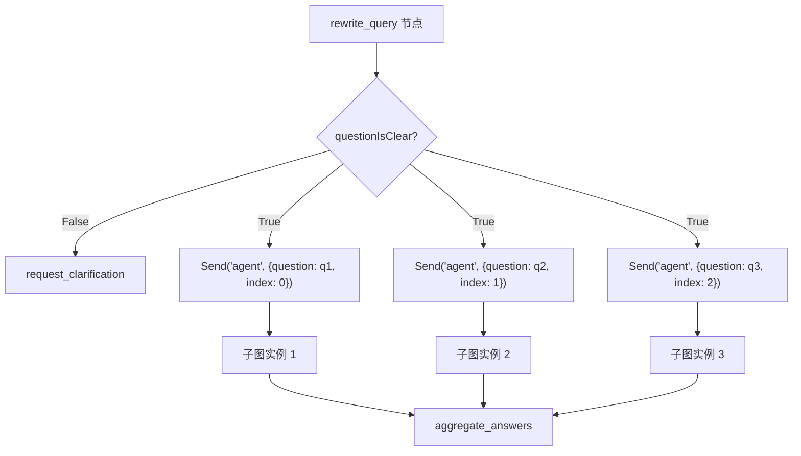
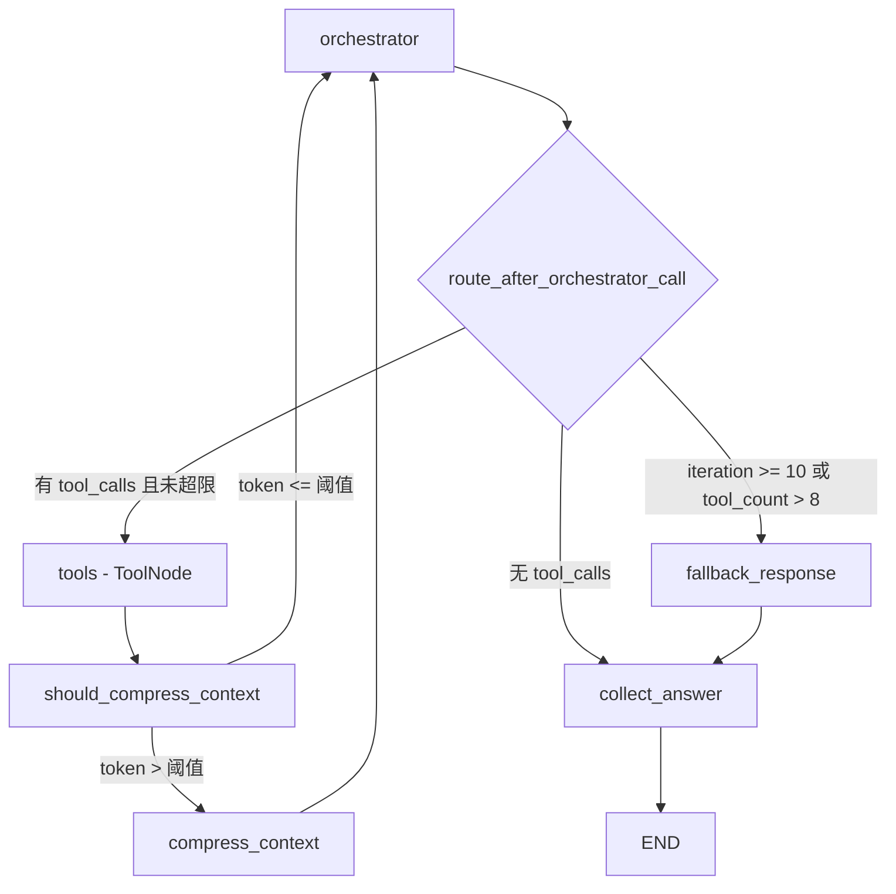

# PD-02.08 agentic-rag-for-dummies — 双层 StateGraph + Send API Map-Reduce 编排

> 文档编号：PD-02.08
> 来源：agentic-rag-for-dummies `project/rag_agent/graph.py`, `project/rag_agent/nodes.py`, `project/rag_agent/edges.py`
> GitHub：https://github.com/GiovanniPasq/agentic-rag-for-dummies.git
> 问题域：PD-02 多 Agent 编排 Multi-Agent Orchestration
> 状态：可复用方案

---

## 第 1 章 问题与动机

### 1.1 核心问题

RAG 系统面对复合查询时，单一检索-生成循环往往无法覆盖所有信息需求。用户一句话可能包含 2-3 个独立子问题（如"对比 A 产品的价格和 B 产品的性能"），单次检索只能聚焦一个语义方向，导致回答片面或遗漏。

核心挑战：
- **查询分解**：如何将复合查询拆分为独立子查询，每个子查询有明确的检索目标
- **并行执行**：多个子查询如何独立执行检索-推理循环，互不干扰
- **结果聚合**：多个子 Agent 的答案如何合并为一个连贯的最终回复
- **上下文膨胀**：每个子 Agent 的检索循环会累积大量 ToolMessage，如何防止 token 爆炸

### 1.2 agentic-rag-for-dummies 的解法概述

该项目用 LangGraph 构建了一个教科书级的双层图架构：

1. **主图（State）**：负责会话摘要 → 查询改写/分解 → 并行扇出 → 答案聚合，是整个流程的骨架（`graph.py:34-48`）
2. **子图（AgentState）**：每个子查询独立运行一个 orchestrator → tools → compress → collect 循环，是实际的检索-推理引擎（`graph.py:17-32`）
3. **Send API 扇出**：通过 `langgraph.types.Send` 实现 Map-Reduce 模式，每个子查询创建独立的 AgentState 实例（`edges.py:10-12`）
4. **上下文压缩**：子图内置 `should_compress_context` → `compress_context` 节点，基于 token 估算动态触发压缩（`nodes.py:96-164`）
5. **accumulate_or_reset 归约器**：子图结果通过自定义 reducer 汇入主图的 `agent_answers` 列表（`graph_state.py:5-8`）

### 1.3 设计思想

| 设计原则 | 具体实现 | 理由 | 替代方案 |
|----------|----------|------|----------|
| 关注点分离 | 主图管流程，子图管检索 | 主图不关心检索细节，子图不关心多查询协调 | 单图内用条件分支处理（复杂度高） |
| 状态隔离 | State 和 AgentState 两套独立 TypedDict | 子图的 iteration_count/tool_call_count 不污染主图 | 共享单一 State（字段冲突风险） |
| 弹性并行 | Send API 动态创建 N 个子图实例 | 子查询数量由 LLM 决定（1-3 个），无需预设 | 固定 N 路并行（浪费或不足） |
| 渐进式压缩 | token 超阈值时压缩而非截断 | 保留关键事实，丢弃冗余格式 | 硬截断（丢失关键信息） |
| 优雅降级 | MAX_ITERATIONS/MAX_TOOL_CALLS 触发 fallback | 防止无限循环，仍尽力用已有上下文回答 | 直接报错（用户体验差） |

---

## 第 2 章 源码实现分析

### 2.1 架构概览

整体架构是一个嵌套的 LangGraph StateGraph，主图编排宏观流程，子图作为主图的一个节点执行微观检索循环：

```
┌─────────────────────────── 主图 (State) ───────────────────────────┐
│                                                                     │
│  START → summarize_history → rewrite_query ─┬→ request_clarification│
│                                              │   (interrupt_before)  │
│                                              │        ↓              │
│                                              │   rewrite_query ←─┘  │
│                                              │                       │
│                                              └→ Send("agent", q1) ──┐│
│                                                 Send("agent", q2) ──┤│
│                                                 Send("agent", q3) ──┤│
│                                                                     ││
│  ┌──────────── 子图 (AgentState) ×N ──────────┐                    ││
│  │ orchestrator → tools → should_compress ─┐   │                    ││
│  │      ↑                    ↓             │   │                    ││
│  │      └── compress_context ←─┘           │   │                    ││
│  │                                         │   │                    ││
│  │      orchestrator → collect_answer ─→ END   │                    ││
│  │      orchestrator → fallback → collect → END│                    ││
│  └─────────────────────────────────────────┘   │                    │
│                                                 ↓                    │
│                                          aggregate_answers → END     │
└─────────────────────────────────────────────────────────────────────┘
```

### 2.2 核心实现

#### 2.2.1 双层状态定义



对应源码 `graph_state.py:1-30`：

```python
def accumulate_or_reset(existing: List[dict], new: List[dict]) -> List[dict]:
    if new and any(item.get('__reset__') for item in new):
        return []
    return existing + new

class State(MessagesState):
    questionIsClear: bool = False
    conversation_summary: str = ""
    originalQuery: str = ""
    rewrittenQuestions: List[str] = []
    agent_answers: Annotated[List[dict], accumulate_or_reset] = []

class AgentState(MessagesState):
    question: str = ""
    question_index: int = 0
    context_summary: str = ""
    retrieval_keys: Annotated[Set[str], set_union] = set()
    final_answer: str = ""
    agent_answers: List[dict] = []
    tool_call_count: Annotated[int, operator.add] = 0
    iteration_count: Annotated[int, operator.add] = 0
```

关键设计：`accumulate_or_reset` 归约器支持两种操作——正常追加和 `__reset__` 清空。`summarize_history` 在新一轮对话开始时通过 `{"__reset__": True}` 清空上一轮的 agent_answers（`nodes.py:28`），防止历史答案污染新查询。

#### 2.2.2 Send API Map-Reduce 扇出



对应源码 `edges.py:6-13`：

```python
def route_after_rewrite(state: State) -> Literal["request_clarification", "agent"]:
    if not state.get("questionIsClear", False):
        return "request_clarification"
    else:
        return [
            Send("agent", {"question": query, "question_index": idx, "messages": []})
            for idx, query in enumerate(state["rewrittenQuestions"])
        ]
```

这是 LangGraph Send API 的经典用法：返回 `Send` 对象列表而非字符串，框架自动为每个 Send 创建独立的子图实例。每个实例收到的初始状态只包含 `question`、`question_index` 和空 `messages`，实现了完全的状态隔离。

主图通过 `graph_builder.add_edge(["agent"], "aggregate_answers")`（`graph.py:45`）声明：所有 agent 子图实例完成后，才进入 aggregate_answers 节点——这就是 Map-Reduce 的 Reduce 阶段。

#### 2.2.3 子图内循环与熔断



对应源码 `edges.py:15-28`：

```python
def route_after_orchestrator_call(state: AgentState) -> Literal["tool", "fallback_response", "collect_answer"]:
    iteration = state.get("iteration_count", 0)
    tool_count = state.get("tool_call_count", 0)

    if iteration >= MAX_ITERATIONS or tool_count > MAX_TOOL_CALLS:
        return "fallback_response"

    last_message = state["messages"][-1]
    tool_calls = getattr(last_message, "tool_calls", None) or []

    if not tool_calls:
        return "collect_answer"
    return "tools"
```

三路条件路由：正常工具调用 → tools、LLM 认为信息充足 → collect_answer、超限降级 → fallback_response。`iteration_count` 和 `tool_call_count` 使用 `operator.add` 归约器，每次 orchestrator 调用自动累加（`nodes.py:61,65`）。

### 2.3 实现细节

**上下文压缩的触发逻辑**（`nodes.py:96-125`）：

`should_compress_context` 是一个返回 `Command` 的节点，它同时更新状态（追踪已检索的 key）和决定路由：

```python
def should_compress_context(state: AgentState) -> Command[Literal["compress_context", "orchestrator"]]:
    # 1. 提取本轮新增的检索 key（parent_id 或 search query）
    new_ids: Set[str] = set()
    for msg in reversed(messages):
        if isinstance(msg, AIMessage) and getattr(msg, "tool_calls", None):
            for tc in msg.tool_calls:
                if tc["name"] == "retrieve_parent_chunks":
                    new_ids.add(f"parent::{raw}")
                elif tc["name"] == "search_child_chunks":
                    new_ids.add(f"search::{query}")
            break  # 只看最近一轮的 tool_calls

    # 2. 估算当前 token 数
    current_tokens = estimate_context_tokens(messages) + estimate_context_tokens([summary])
    max_allowed = BASE_TOKEN_THRESHOLD + int(summary_tokens * TOKEN_GROWTH_FACTOR)

    # 3. 路由决策
    goto = "compress_context" if current_tokens > max_allowed else "orchestrator"
    return Command(update={"retrieval_keys": updated_ids}, goto=goto)
```

`TOKEN_GROWTH_FACTOR = 0.9` 意味着随着压缩摘要增长，允许的总 token 上限也线性增长——这是一个自适应阈值，避免频繁压缩。

**retrieval_keys 去重机制**：`compress_context` 将已检索的 parent_id 和 search query 追加到压缩摘要末尾（`nodes.py:157-162`），orchestrator 的 prompt 明确指示"不要重复已列出的查询和 ID"（`prompts.py:69-72`）。这是一种 prompt + 状态双重约束的去重策略。

**结果收集与聚合**：`collect_answer`（`nodes.py:166-173`）将子图的最终答案写入 `agent_answers`，包含 `index`（用于排序）、`question`（原始子查询）和 `answer`（生成的答案）。`aggregate_answers`（`nodes.py:176-188`）按 index 排序后，用 LLM 将多个答案合成为一个连贯回复。


---

## 第 3 章 迁移指南

### 3.1 迁移清单

**阶段 1：定义双层状态**
- [ ] 定义主图 State（含 `rewrittenQuestions: List[str]` 和 `agent_answers: Annotated[List[dict], accumulate_or_reset]`）
- [ ] 定义子图 AgentState（含 `question`, `question_index`, `iteration_count`, `tool_call_count`）
- [ ] 实现 `accumulate_or_reset` 归约器（支持 `__reset__` 信号清空历史）

**阶段 2：构建子图**
- [ ] 实现 orchestrator 节点（LLM + tools 绑定）
- [ ] 实现条件路由 `route_after_orchestrator_call`（三路：tools / collect / fallback）
- [ ] 实现 `should_compress_context` 节点（token 估算 + Command 路由）
- [ ] 实现 `compress_context` 节点（LLM 摘要 + retrieval_keys 去重标记）
- [ ] 实现 `fallback_response` 节点（超限降级）
- [ ] 实现 `collect_answer` 节点（结果格式化）
- [ ] 用 `StateGraph(AgentState)` 编译子图

**阶段 3：构建主图**
- [ ] 实现 `summarize_history` 节点（会话摘要 + agent_answers 重置）
- [ ] 实现 `rewrite_query` 节点（LLM 结构化输出 QueryAnalysis）
- [ ] 实现 `route_after_rewrite`（Send API 扇出）
- [ ] 将编译后的子图作为主图的 `"agent"` 节点
- [ ] 实现 `aggregate_answers` 节点（多答案合成）
- [ ] 配置 `interrupt_before=["request_clarification"]` 实现 Human-in-the-Loop

**阶段 4：配置与调优**
- [ ] 设置 `MAX_ITERATIONS`（默认 10）和 `MAX_TOOL_CALLS`（默认 8）
- [ ] 设置 `BASE_TOKEN_THRESHOLD`（默认 2000）和 `TOKEN_GROWTH_FACTOR`（默认 0.9）
- [ ] 配置 `recursion_limit`（默认 50）防止无限递归
- [ ] 选择 checkpointer（InMemorySaver 用于开发，PostgresSaver 用于生产）

### 3.2 适配代码模板

以下模板可直接复用，将 RAG 工具替换为你自己的工具即可：

```python
from typing import List, Annotated, Set, Literal
from langgraph.graph import START, END, StateGraph, MessagesState
from langgraph.types import Send, Command
from langgraph.prebuilt import ToolNode
from langgraph.checkpoint.memory import InMemorySaver
from langchain_core.messages import SystemMessage, HumanMessage, AIMessage, RemoveMessage
import operator

# ── 1. 双层状态定义 ──

def accumulate_or_reset(existing: List[dict], new: List[dict]) -> List[dict]:
    """支持 __reset__ 信号的列表归约器"""
    if new and any(item.get('__reset__') for item in new):
        return []
    return existing + new

class MainState(MessagesState):
    original_query: str = ""
    sub_queries: List[str] = []
    agent_answers: Annotated[List[dict], accumulate_or_reset] = []

class SubAgentState(MessagesState):
    question: str = ""
    question_index: int = 0
    iteration_count: Annotated[int, operator.add] = 0
    tool_call_count: Annotated[int, operator.add] = 0
    final_answer: str = ""
    agent_answers: List[dict] = []

# ── 2. Send API 扇出路由 ──

def fan_out_queries(state: MainState):
    return [
        Send("sub_agent", {"question": q, "question_index": i, "messages": []})
        for i, q in enumerate(state["sub_queries"])
    ]

# ── 3. 子图熔断路由 ──

MAX_ITERATIONS, MAX_TOOL_CALLS = 10, 8

def route_sub_agent(state: SubAgentState) -> Literal["tools", "fallback", "collect"]:
    if state.get("iteration_count", 0) >= MAX_ITERATIONS or \
       state.get("tool_call_count", 0) > MAX_TOOL_CALLS:
        return "fallback"
    last = state["messages"][-1]
    if not getattr(last, "tool_calls", None):
        return "collect"
    return "tools"

# ── 4. 组装双层图 ──

def build_dual_layer_graph(llm, tools):
    llm_with_tools = llm.bind_tools(tools)
    tool_node = ToolNode(tools)

    # 子图
    sub = StateGraph(SubAgentState)
    sub.add_node("orchestrator", lambda s: orchestrator_node(s, llm_with_tools))
    sub.add_node("tools", tool_node)
    sub.add_node("fallback", lambda s: fallback_node(s, llm))
    sub.add_node("collect", collect_node)
    sub.add_edge(START, "orchestrator")
    sub.add_conditional_edges("orchestrator", route_sub_agent,
        {"tools": "tools", "fallback": "fallback", "collect": "collect"})
    sub.add_edge("tools", "orchestrator")
    sub.add_edge("fallback", "collect")
    sub.add_edge("collect", END)
    sub_graph = sub.compile()

    # 主图
    main = StateGraph(MainState)
    main.add_node("decompose", decompose_query_node)
    main.add_node("sub_agent", sub_graph)
    main.add_node("aggregate", aggregate_node)
    main.add_edge(START, "decompose")
    main.add_conditional_edges("decompose", fan_out_queries)
    main.add_edge(["sub_agent"], "aggregate")
    main.add_edge("aggregate", END)

    return main.compile(checkpointer=InMemorySaver())
```

### 3.3 适用场景

| 场景 | 适用度 | 说明 |
|------|--------|------|
| 复合查询 RAG | ⭐⭐⭐ | 核心场景：用户问题可分解为 2-3 个独立子问题 |
| 多文档对比分析 | ⭐⭐⭐ | 每个子 Agent 检索不同文档集，聚合时对比 |
| 单一简单查询 | ⭐⭐ | 仍可用（退化为 1 个子图），但增加了不必要的编排开销 |
| 实时对话（低延迟） | ⭐ | 双层图 + LLM 压缩增加延迟，不适合毫秒级响应 |
| 超大规模并行（>10 子查询） | ⭐ | Send API 无并发限制配置，需自行添加信号量 |

---

## 第 4 章 测试用例

```python
import pytest
from typing import List, Set
from unittest.mock import MagicMock, patch
import operator
from typing import Annotated

# ── 测试 accumulate_or_reset 归约器 ──

def accumulate_or_reset(existing: List[dict], new: List[dict]) -> List[dict]:
    if new and any(item.get('__reset__') for item in new):
        return []
    return existing + new

class TestAccumulateOrReset:
    def test_normal_accumulation(self):
        result = accumulate_or_reset(
            [{"index": 0, "answer": "A"}],
            [{"index": 1, "answer": "B"}]
        )
        assert len(result) == 2
        assert result[1]["answer"] == "B"

    def test_reset_signal(self):
        result = accumulate_or_reset(
            [{"index": 0, "answer": "old"}],
            [{"__reset__": True}]
        )
        assert result == []

    def test_empty_new_list(self):
        result = accumulate_or_reset([{"index": 0}], [])
        assert len(result) == 1

# ── 测试 Send API 扇出 ──

class TestFanOut:
    def test_single_query_produces_one_send(self):
        from langgraph.types import Send
        state = {"sub_queries": ["What is X?"], "questionIsClear": True}
        sends = [
            Send("agent", {"question": q, "question_index": i, "messages": []})
            for i, q in enumerate(state["sub_queries"])
        ]
        assert len(sends) == 1
        assert sends[0].node == "agent"

    def test_multiple_queries_produce_parallel_sends(self):
        from langgraph.types import Send
        queries = ["What is X?", "How does Y work?", "Compare X and Y"]
        sends = [
            Send("agent", {"question": q, "question_index": i, "messages": []})
            for i, q in enumerate(queries)
        ]
        assert len(sends) == 3
        for i, s in enumerate(sends):
            assert s.args["question_index"] == i

# ── 测试熔断路由 ──

class TestCircuitBreaker:
    def test_normal_tool_call_routes_to_tools(self):
        mock_msg = MagicMock()
        mock_msg.tool_calls = [{"name": "search", "args": {}}]
        state = {"messages": [mock_msg], "iteration_count": 1, "tool_call_count": 1}
        assert route_sub_agent(state) == "tools"

    def test_max_iterations_triggers_fallback(self):
        mock_msg = MagicMock()
        mock_msg.tool_calls = [{"name": "search", "args": {}}]
        state = {"messages": [mock_msg], "iteration_count": 10, "tool_call_count": 1}
        assert route_sub_agent(state) == "fallback"

    def test_max_tool_calls_triggers_fallback(self):
        mock_msg = MagicMock()
        mock_msg.tool_calls = [{"name": "search", "args": {}}]
        state = {"messages": [mock_msg], "iteration_count": 1, "tool_call_count": 9}
        assert route_sub_agent(state) == "fallback"

    def test_no_tool_calls_routes_to_collect(self):
        mock_msg = MagicMock()
        mock_msg.tool_calls = []
        state = {"messages": [mock_msg], "iteration_count": 1, "tool_call_count": 1}
        assert route_sub_agent(state) == "collect"

# ── 测试 set_union 归约器 ──

def set_union(a: Set[str], b: Set[str]) -> Set[str]:
    return a | b

class TestSetUnion:
    def test_union_deduplicates(self):
        result = set_union({"parent::abc", "search::q1"}, {"parent::abc", "search::q2"})
        assert result == {"parent::abc", "search::q1", "search::q2"}

    def test_empty_sets(self):
        assert set_union(set(), set()) == set()

# ── 测试结果收集 ──

class TestCollectAnswer:
    def test_valid_ai_message_collected(self):
        from langchain_core.messages import AIMessage
        msg = AIMessage(content="The answer is 42.")
        state = {"messages": [msg], "question_index": 0, "question": "What is the answer?"}
        is_valid = isinstance(msg, AIMessage) and msg.content and not msg.tool_calls
        assert is_valid
        answer = msg.content
        result = {"index": state["question_index"], "question": state["question"], "answer": answer}
        assert result["index"] == 0
        assert result["answer"] == "The answer is 42."

def route_sub_agent(state) -> str:
    MAX_ITERATIONS, MAX_TOOL_CALLS = 10, 8
    if state.get("iteration_count", 0) >= MAX_ITERATIONS or \
       state.get("tool_call_count", 0) > MAX_TOOL_CALLS:
        return "fallback"
    last = state["messages"][-1]
    if not getattr(last, "tool_calls", None):
        return "collect"
    return "tools"
```


---

## 第 5 章 跨域关联

| 关联域 | 关系类型 | 说明 |
|--------|----------|------|
| PD-01 上下文管理 | 强依赖 | 子图的 `compress_context` 节点是 PD-01 的核心实现：基于 token 估算动态触发 LLM 摘要压缩，`retrieval_keys` 追踪已检索内容防止重复。`TOKEN_GROWTH_FACTOR` 自适应阈值是该项目的独特设计 |
| PD-03 容错与重试 | 协同 | `MAX_ITERATIONS` / `MAX_TOOL_CALLS` 熔断 + `fallback_response` 降级构成子图级容错。超限时不报错，而是用已有上下文尽力回答 |
| PD-04 工具系统 | 依赖 | `ToolFactory` 封装 `search_child_chunks` 和 `retrieve_parent_chunks` 两个工具，通过 `llm.bind_tools()` 注入子图 orchestrator。工具设计为两级检索（child → parent） |
| PD-08 搜索与检索 | 强协同 | 子图的核心循环就是检索-推理循环。`search_child_chunks` 用 Qdrant 混合搜索（dense + sparse），`retrieve_parent_chunks` 从 JSON store 加载完整父块 |
| PD-09 Human-in-the-Loop | 协同 | 主图通过 `interrupt_before=["request_clarification"]` 实现查询澄清中断。当 LLM 判断查询不清晰时，暂停图执行等待用户补充信息 |
| PD-12 推理增强 | 协同 | `rewrite_query` 使用 `with_structured_output(QueryAnalysis)` 强制 LLM 输出结构化的查询分析结果，包含 `is_clear`、`questions`、`clarification_needed` 三个字段，是一种约束式推理 |

---

## 第 6 章 来源文件索引

| 文件 | 行范围 | 关键实现 |
|------|--------|----------|
| `project/rag_agent/graph.py` | L1-51 | 双层图构建：子图编译 + 主图编排 + checkpointer 配置 |
| `project/rag_agent/graph_state.py` | L1-30 | State / AgentState 双层状态定义 + accumulate_or_reset / set_union 归约器 |
| `project/rag_agent/nodes.py` | L10-28 | summarize_history：会话摘要 + agent_answers 重置 |
| `project/rag_agent/nodes.py` | L30-44 | rewrite_query：LLM 结构化输出查询分解 |
| `project/rag_agent/nodes.py` | L50-65 | orchestrator：子图核心节点，LLM + tools 推理循环 |
| `project/rag_agent/nodes.py` | L67-94 | fallback_response：超限降级，合并压缩上下文和当前检索数据 |
| `project/rag_agent/nodes.py` | L96-125 | should_compress_context：token 估算 + Command 路由 + retrieval_keys 追踪 |
| `project/rag_agent/nodes.py` | L127-164 | compress_context：LLM 摘要压缩 + 已检索 key 追加 |
| `project/rag_agent/nodes.py` | L166-173 | collect_answer：子图结果格式化（index + question + answer） |
| `project/rag_agent/nodes.py` | L176-188 | aggregate_answers：多答案排序合成 |
| `project/rag_agent/edges.py` | L6-13 | route_after_rewrite：Send API Map-Reduce 扇出 |
| `project/rag_agent/edges.py` | L15-28 | route_after_orchestrator_call：三路熔断路由 |
| `project/rag_agent/schemas.py` | L1-13 | QueryAnalysis Pydantic 模型（is_clear / questions / clarification_needed） |
| `project/rag_agent/tools.py` | L5-80 | ToolFactory：search_child_chunks + retrieve_parent_chunks 工具封装 |
| `project/rag_agent/prompts.py` | L58-81 | orchestrator prompt：检索策略 + 压缩记忆指令 |
| `project/config.py` | L21-24 | Agent 配置常量：MAX_TOOL_CALLS=8, MAX_ITERATIONS=10, BASE_TOKEN_THRESHOLD=2000 |
| `project/core/rag_system.py` | L10-37 | RAGSystem：图初始化 + thread 管理 + recursion_limit=50 |
| `project/utils.py` | L27-37 | estimate_context_tokens：tiktoken 估算消息 token 数 |

---

## 第 7 章 横向对比维度

```json comparison_data
{
  "project": "agentic-rag-for-dummies",
  "dimensions": {
    "编排模式": "双层 StateGraph：主图线性流水线 + 子图 ReAct 循环",
    "并行能力": "Send API Map-Reduce，子查询数由 LLM 动态决定（1-3）",
    "状态管理": "State/AgentState 双层隔离，accumulate_or_reset 归约器",
    "并发限制": "无显式并发限制，依赖 LangGraph 框架默认行为",
    "工具隔离": "ToolFactory 封装，所有子图共享同一 tools 实例",
    "迭代收敛": "MAX_ITERATIONS=10 + MAX_TOOL_CALLS=8 双重熔断",
    "结果回传": "agent_answers 列表按 index 排序后 LLM 聚合",
    "条件路由": "三路路由：tools/collect_answer/fallback_response",
    "递归防护": "recursion_limit=50 全局递归上限",
    "记忆压缩": "token 超阈值触发 LLM 摘要 + retrieval_keys 去重标记",
    "自适应参数": "TOKEN_GROWTH_FACTOR=0.9 随摘要增长动态调整压缩阈值",
    "查询分解策略": "LLM 结构化输出 QueryAnalysis，最多拆分 3 个子查询"
  }
}
```

### 域元数据补充

```json domain_metadata
{
  "solution_summary": "agentic-rag-for-dummies 用 LangGraph 双层 StateGraph + Send API 实现 Map-Reduce 并行 RAG：主图分解查询并扇出，子图独立执行检索-压缩-推理循环，accumulate_or_reset 归约器汇聚结果",
  "description": "查询分解驱动的并行编排：LLM 决定子查询数量，Send API 动态创建子图实例",
  "sub_problems": [
    "查询分解粒度控制：LLM 如何决定拆分为几个子查询以及拆分边界",
    "归约器设计：子图结果如何通过自定义 reducer 安全汇入主图状态",
    "压缩阈值自适应：如何根据已压缩摘要大小动态调整触发压缩的 token 阈值"
  ],
  "best_practices": [
    "Send API 初始状态最小化：只传 question 和 index，不传主图的 messages，确保子图状态干净",
    "双重去重：状态层 retrieval_keys 追踪 + prompt 层指令约束，防止重复检索"
  ]
}
```

