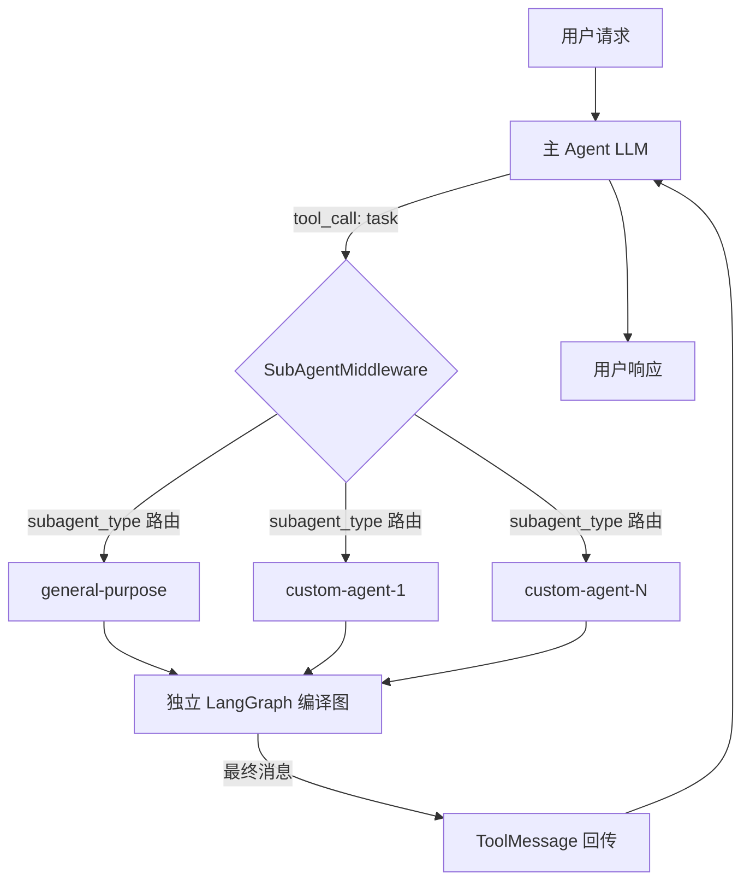
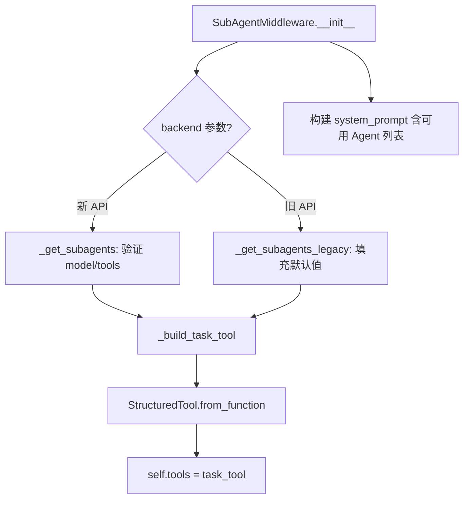
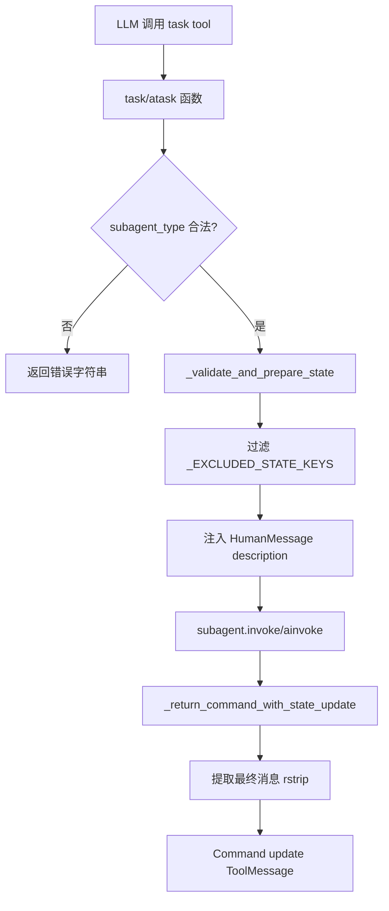

# PD-02.26 DeepAgents — SubAgentMiddleware 中间件驱动子 Agent 编排

> 文档编号：PD-02.26
> 来源：DeepAgents `libs/deepagents/deepagents/middleware/subagents.py`
> GitHub：https://github.com/langchain-ai/deepagents.git
> 问题域：PD-02 多 Agent 编排 Multi-Agent Orchestration
> 状态：可复用方案

---

## 第 1 章 问题与动机

### 1.1 核心问题

多 Agent 编排的核心挑战在于：如何让一个主 Agent 在运行时动态派发子任务给专用子 Agent，同时保证上下文隔离、工具权限可控、结果可回传？

传统做法要么硬编码 DAG 拓扑（如 LangGraph StateGraph），要么用进程级隔离（如 AgentOrchestrator 的 subprocess），前者灵活性不足，后者通信成本高。DeepAgents 选择了一条中间路线：**中间件注入 + LLM 自主决策**——通过 `SubAgentMiddleware` 在主 Agent 的中间件栈中注入一个 `task` 工具，让 LLM 自己决定何时、向谁委托任务，子 Agent 以独立 LangGraph 编译图运行，结果通过 `ToolMessage` 回传。

这种设计的关键优势：
- 主 Agent 不需要预定义任务拓扑，LLM 根据用户请求动态决策
- 子 Agent 拥有独立上下文窗口，不会污染主线程
- 通过中间件栈组合，子 Agent 可以继承或定制工具集、记忆、技能

### 1.2 DeepAgents 的解法概述

1. **中间件注入 task 工具**：`SubAgentMiddleware` 在初始化时构建 `task` StructuredTool，注入主 Agent 工具列表（`subagents.py:610-619`）
2. **声明式子 Agent 规格**：通过 `SubAgent` TypedDict 定义子 Agent 的 name/description/system_prompt/model/tools/middleware，支持 `CompiledSubAgent` 预编译图（`subagents.py:22-111`）
3. **general-purpose 默认注入**：始终自动注入一个 general-purpose 子 Agent，继承主 Agent 的全部工具和中间件栈（`graph.py:198-223`）
4. **文件系统声明式加载**：CLI 层通过 `list_subagents()` 从 `~/.deepagents/agents/` 和项目级 `.deepagents/agents/` 扫描 YAML frontmatter 的 AGENTS.md 文件，动态发现自定义子 Agent（`subagents.py:146-173` in CLI）
5. **状态隔离与结果回传**：子 Agent 接收过滤后的父状态（排除 messages/todos/structured_response 等），执行完毕后仅回传最后一条消息作为 ToolMessage（`subagents.py:116-127, 402-420`）

### 1.3 设计思想

| 设计原则 | 具体实现 | 理由 | 替代方案 |
|----------|----------|------|----------|
| LLM 自主编排 | task 工具由 LLM 决定何时调用 | 避免硬编码 DAG，适应开放式任务 | 预定义 StateGraph 条件边 |
| 中间件透明注入 | SubAgentMiddleware 注入 task 工具 + system prompt | 不修改 Agent 核心代码 | 直接在 create_agent 中硬编码 |
| 声明式子 Agent | SubAgent TypedDict + YAML frontmatter | 用户可通过文件系统扩展子 Agent | 代码级注册 |
| 上下文隔离 | _EXCLUDED_STATE_KEYS 过滤 + 独立 messages | 防止子 Agent 上下文膨胀 | 共享全部状态 |
| 工具继承可选 | 子 Agent 可指定 tools 或继承主 Agent | 灵活控制子 Agent 能力边界 | 全部继承或全部隔离 |
| 同步/异步双模 | task() + atask() 双实现 | 支持同步和异步运行时 | 仅异步 |

---

## 第 2 章 源码实现分析

### 2.1 架构概览

DeepAgents 的子 Agent 编排架构分为三层：

```
┌─────────────────────────────────────────────────────────────┐
│                    CLI Layer (agent.py)                       │
│  create_cli_agent() → 加载自定义子 Agent → 构建中间件栈        │
├─────────────────────────────────────────────────────────────┤
│                  Graph Layer (graph.py)                       │
│  create_deep_agent() → 组装 SubAgentMiddleware               │
│  → 自动注入 general-purpose + 处理用户自定义子 Agent           │
├─────────────────────────────────────────────────────────────┤
│              Middleware Layer (subagents.py)                  │
│  SubAgentMiddleware → _build_task_tool() → task/atask        │
│  → SubAgent TypedDict / CompiledSubAgent                     │
│  → _EXCLUDED_STATE_KEYS 状态过滤                              │
│  → Command(update={...}) 结果回传                             │
└─────────────────────────────────────────────────────────────┘
```



### 2.2 核心实现

#### 2.2.1 SubAgentMiddleware 初始化与 task 工具构建



对应源码 `libs/deepagents/deepagents/middleware/subagents.py:545-619`：

```python
class SubAgentMiddleware(AgentMiddleware[Any, ContextT, ResponseT]):
    def __init__(
        self,
        *,
        backend: BackendProtocol | BackendFactory | None = None,
        subagents: list[SubAgent | CompiledSubAgent] | None = None,
        system_prompt: str | None = TASK_SYSTEM_PROMPT,
        task_description: str | None = None,
        **deprecated_kwargs: Unpack[_DeprecatedKwargs],
    ) -> None:
        super().__init__()
        # ... 新旧 API 检测 ...
        if using_new_api:
            if not subagents:
                raise ValueError("At least one subagent must be specified")
            self._backend = backend
            self._subagents = subagents
            subagent_specs = self._get_subagents()
        # ...
        task_tool = _build_task_tool(subagent_specs, task_description)
        # 构建含可用 Agent 列表的 system prompt
        if system_prompt and subagent_specs:
            agents_desc = "\n".join(
                f"- {s['name']}: {s['description']}" for s in subagent_specs
            )
            self.system_prompt = system_prompt + "\n\nAvailable subagent types:\n" + agents_desc
        self.tools = [task_tool]
```

#### 2.2.2 task 工具的执行与状态隔离



对应源码 `libs/deepagents/deepagents/middleware/subagents.py:422-464`：

```python
# 状态隔离：排除的 key
_EXCLUDED_STATE_KEYS = {
    "messages", "todos", "structured_response",
    "skills_metadata", "memory_contents"
}

def _validate_and_prepare_state(subagent_type, description, runtime):
    subagent = subagent_graphs[subagent_type]
    # 过滤父状态，防止泄漏
    subagent_state = {
        k: v for k, v in runtime.state.items()
        if k not in _EXCLUDED_STATE_KEYS
    }
    # 子 Agent 只收到一条 HumanMessage 作为任务描述
    subagent_state["messages"] = [HumanMessage(content=description)]
    return subagent, subagent_state

def _return_command_with_state_update(result, tool_call_id):
    state_update = {
        k: v for k, v in result.items()
        if k not in _EXCLUDED_STATE_KEYS
    }
    message_text = result["messages"][-1].text.rstrip()
    return Command(
        update={
            **state_update,
            "messages": [ToolMessage(message_text, tool_call_id=tool_call_id)],
        }
    )
```

### 2.3 实现细节

#### general-purpose 子 Agent 自动注入

`create_deep_agent()` 在 `graph.py:198-267` 中始终构建一个 general-purpose 子 Agent，它继承主 Agent 的 model、tools 和完整中间件栈（TodoList + Filesystem + Summarization + PromptCaching + PatchToolCalls）：

```python
# graph.py:218-223
general_purpose_spec: SubAgent = {
    **GENERAL_PURPOSE_SUBAGENT,  # name="general-purpose", description=...
    "model": model,
    "tools": tools or [],
    "middleware": gp_middleware,  # 完整中间件栈
}
# graph.py:267
all_subagents = [general_purpose_spec, *processed_subagents]
```

#### 文件系统声明式子 Agent 加载

CLI 层通过 `list_subagents()` 扫描两级目录（`deepagents_cli/subagents.py:146-173`）：

```
~/.deepagents/{agent_id}/agents/{name}/AGENTS.md  (用户级，低优先)
.deepagents/agents/{name}/AGENTS.md                (项目级，高优先，覆盖同名)
```

AGENTS.md 使用 YAML frontmatter 声明 name/description/model，正文作为 system_prompt。项目级覆盖用户级同名子 Agent。

#### 递归防护

DeepAgents 通过 `recursion_limit: 1000`（`graph.py:324`）设置 LangGraph 的递归上限。子 Agent 本身不会自动获得 `task` 工具（除非显式配置），因此默认不会产生无限 spawn。general-purpose 子 Agent 虽然继承主 Agent 工具，但其中间件栈不包含 SubAgentMiddleware，从而天然阻断递归。

#### system prompt 注入机制

`SubAgentMiddleware.wrap_model_call()` 通过 `append_to_system_message()` 将 task 工具使用说明追加到主 Agent 的 system message 中（`subagents.py:672-681`），使用 `ContentBlock` 列表拼接，不覆盖原有 prompt。

---

## 第 3 章 迁移指南

### 3.1 迁移清单

**阶段 1：核心中间件（必须）**

- [ ] 实现 `SubAgent` TypedDict 规格定义（name/description/system_prompt/model/tools）
- [ ] 实现 `_build_task_tool()` 构建 `task` StructuredTool
- [ ] 实现状态过滤逻辑（`_EXCLUDED_STATE_KEYS`）
- [ ] 实现 `_return_command_with_state_update()` 结果回传
- [ ] 实现 `SubAgentMiddleware` 中间件类，注入 task 工具 + system prompt

**阶段 2：声明式加载（推荐）**

- [ ] 实现 YAML frontmatter 解析器（`_parse_subagent_file`）
- [ ] 实现两级目录扫描（用户级 + 项目级，项目级覆盖同名）
- [ ] 实现 general-purpose 默认子 Agent 自动注入

**阶段 3：增强特性（可选）**

- [ ] 子 Agent 模型降级（通过 SubAgent.model 指定更便宜的模型）
- [ ] CompiledSubAgent 支持（预编译 LangGraph 图作为子 Agent）
- [ ] HITL 中断配置（子 Agent 级别的 interrupt_on）

### 3.2 适配代码模板

以下是一个最小可运行的 SubAgentMiddleware 迁移实现：

```python
"""Minimal SubAgentMiddleware migration template."""
from typing import Any, TypedDict, NotRequired, Sequence, Annotated
from dataclasses import dataclass, field


class SubAgentSpec(TypedDict):
    """子 Agent 规格声明。"""
    name: str
    description: str
    system_prompt: str
    model: NotRequired[str]
    tools: NotRequired[list[str]]


# 状态隔离：子 Agent 不应看到的父状态 key
EXCLUDED_STATE_KEYS = frozenset({
    "messages", "todos", "structured_response",
    "skills_metadata", "memory_contents",
})


def filter_parent_state(state: dict[str, Any]) -> dict[str, Any]:
    """过滤父状态，防止泄漏到子 Agent。"""
    return {k: v for k, v in state.items() if k not in EXCLUDED_STATE_KEYS}


def build_task_tool(subagents: list[SubAgentSpec]):
    """构建 task 工具，路由到对应子 Agent。

    Usage:
        task_tool = build_task_tool(subagents)
        # 注入到主 Agent 工具列表
    """
    agent_registry = {spec["name"]: spec for spec in subagents}
    descriptions = "\n".join(
        f"- {s['name']}: {s['description']}" for s in subagents
    )

    def task(
        description: Annotated[str, "任务描述"],
        subagent_type: Annotated[str, "子 Agent 类型"],
        runtime: Any,  # 替换为你的 ToolRuntime 类型
    ) -> str:
        if subagent_type not in agent_registry:
            allowed = ", ".join(agent_registry.keys())
            return f"Unknown subagent_type '{subagent_type}', allowed: {allowed}"

        spec = agent_registry[subagent_type]
        # 1. 过滤父状态
        child_state = filter_parent_state(runtime.state)
        # 2. 注入任务描述作为唯一消息
        child_state["messages"] = [{"role": "user", "content": description}]
        # 3. 调用子 Agent（替换为你的 Agent 调用逻辑）
        result = invoke_agent(spec, child_state)
        # 4. 提取最终消息回传
        return result["messages"][-1]["content"]

    return task


def load_subagents_from_dir(agents_dir: str) -> list[SubAgentSpec]:
    """从目录扫描 YAML frontmatter 的 AGENTS.md 文件。

    目录结构：agents_dir/{name}/AGENTS.md
    """
    import re, yaml
    from pathlib import Path

    specs = []
    base = Path(agents_dir)
    if not base.exists():
        return specs

    for folder in base.iterdir():
        if not folder.is_dir():
            continue
        md_file = folder / "AGENTS.md"
        if not md_file.exists():
            continue
        content = md_file.read_text()
        match = re.match(r"^---\s*\n(.*?)\n---\s*\n?(.*)$", content, re.DOTALL)
        if not match:
            continue
        frontmatter = yaml.safe_load(match.group(1))
        if not isinstance(frontmatter, dict):
            continue
        name = frontmatter.get("name", "")
        desc = frontmatter.get("description", "")
        if name and desc:
            specs.append(SubAgentSpec(
                name=name,
                description=desc,
                system_prompt=match.group(2).strip(),
                model=frontmatter.get("model"),
            ))
    return specs
```

### 3.3 适用场景

| 场景 | 适用度 | 说明 |
|------|--------|------|
| 开放式任务委托（LLM 自主决策何时派发） | ⭐⭐⭐ | 核心设计目标，task 工具由 LLM 自主调用 |
| 多专家域子 Agent（研究/编码/审查） | ⭐⭐⭐ | 声明式 SubAgent 规格 + 文件系统加载 |
| 固定 DAG 工作流 | ⭐⭐ | 不如 LangGraph StateGraph 直接，但可通过 prompt 引导 |
| 高并发批量任务 | ⭐⭐ | 支持并行 tool_call 但无显式并发限制机制 |
| 需要子 Agent 间通信 | ⭐ | 子 Agent 是无状态的，不支持 Agent 间直接通信 |

---

## 第 4 章 测试用例

```python
"""Tests for SubAgentMiddleware orchestration pattern."""
import pytest
from typing import Any
from unittest.mock import MagicMock, patch


# --- 状态过滤测试 ---

class TestStateFiltering:
    """测试 _EXCLUDED_STATE_KEYS 状态过滤逻辑。"""

    EXCLUDED_KEYS = {
        "messages", "todos", "structured_response",
        "skills_metadata", "memory_contents",
    }

    def test_excluded_keys_filtered(self):
        """父状态中的排除 key 不应传递给子 Agent。"""
        parent_state = {
            "messages": [{"role": "user", "content": "hello"}],
            "todos": [{"task": "do something"}],
            "structured_response": {"key": "value"},
            "skills_metadata": {"skill": "data"},
            "memory_contents": "memory",
            "custom_key": "should_pass",
        }
        filtered = {
            k: v for k, v in parent_state.items()
            if k not in self.EXCLUDED_KEYS
        }
        assert "custom_key" in filtered
        assert filtered["custom_key"] == "should_pass"
        for key in self.EXCLUDED_KEYS:
            assert key not in filtered

    def test_empty_state_returns_empty(self):
        """空状态过滤后仍为空。"""
        filtered = {
            k: v for k, v in {}.items()
            if k not in self.EXCLUDED_KEYS
        }
        assert filtered == {}

    def test_non_excluded_keys_preserved(self):
        """非排除 key 应完整保留。"""
        parent_state = {"context": {"data": [1, 2, 3]}, "config": True}
        filtered = {
            k: v for k, v in parent_state.items()
            if k not in self.EXCLUDED_KEYS
        }
        assert filtered == parent_state


# --- 子 Agent 路由测试 ---

class TestSubagentRouting:
    """测试 task 工具的子 Agent 类型路由。"""

    def test_unknown_subagent_type_returns_error(self):
        """未知的 subagent_type 应返回错误字符串。"""
        registry = {"general-purpose": {}, "researcher": {}}
        subagent_type = "nonexistent"
        if subagent_type not in registry:
            allowed = ", ".join(f"`{k}`" for k in registry)
            result = f"Cannot invoke {subagent_type}, allowed: {allowed}"
        assert "nonexistent" in result
        assert "general-purpose" in result

    def test_valid_subagent_type_routes_correctly(self):
        """合法的 subagent_type 应路由到对应子 Agent。"""
        registry = {
            "general-purpose": {"name": "general-purpose"},
            "researcher": {"name": "researcher"},
        }
        assert "researcher" in registry
        assert registry["researcher"]["name"] == "researcher"


# --- 结果回传测试 ---

class TestResultReturn:
    """测试子 Agent 结果回传逻辑。"""

    def test_last_message_extracted(self):
        """应提取子 Agent 最终消息作为 ToolMessage。"""
        result = {
            "messages": [
                MagicMock(text="intermediate"),
                MagicMock(text="final answer  "),  # 尾部空格
            ],
            "custom_state": "value",
        }
        excluded = {"messages", "todos", "structured_response"}
        state_update = {
            k: v for k, v in result.items() if k not in excluded
        }
        message_text = result["messages"][-1].text.rstrip()
        assert message_text == "final answer"
        assert "custom_state" in state_update
        assert "messages" not in state_update

    def test_missing_messages_key_raises(self):
        """缺少 messages key 应抛出 ValueError。"""
        result = {"custom_state": "value"}
        with pytest.raises(KeyError):
            _ = result["messages"]


# --- YAML frontmatter 解析测试 ---

class TestSubagentFileParser:
    """测试 AGENTS.md 文件解析。"""

    def test_valid_frontmatter_parsed(self, tmp_path):
        """合法的 YAML frontmatter 应正确解析。"""
        md = tmp_path / "researcher" / "AGENTS.md"
        md.parent.mkdir()
        md.write_text(
            "---\nname: researcher\n"
            "description: Research topics\n"
            "model: anthropic:claude-haiku-4-5-20251001\n"
            "---\nYou are a research assistant."
        )
        import re, yaml
        content = md.read_text()
        match = re.match(r"^---\s*\n(.*?)\n---\s*\n?(.*)$", content, re.DOTALL)
        assert match is not None
        fm = yaml.safe_load(match.group(1))
        assert fm["name"] == "researcher"
        assert fm["description"] == "Research topics"
        assert match.group(2).strip() == "You are a research assistant."

    def test_missing_frontmatter_returns_none(self, tmp_path):
        """缺少 frontmatter 的文件应返回 None。"""
        md = tmp_path / "bad" / "AGENTS.md"
        md.parent.mkdir()
        md.write_text("Just plain text without frontmatter")
        import re
        match = re.match(
            r"^---\s*\n(.*?)\n---\s*\n?(.*)$",
            md.read_text(), re.DOTALL,
        )
        assert match is None
```

---

## 第 5 章 跨域关联

| 关联域 | 关系类型 | 说明 |
|--------|----------|------|
| PD-01 上下文管理 | 依赖 | SummarizationMiddleware 为每个子 Agent 独立配置上下文压缩策略（`graph.py:238-249`），子 Agent 的 trigger/keep 参数根据模型 profile 自动计算 |
| PD-04 工具系统 | 协同 | SubAgentMiddleware 本身就是工具系统的消费者——task 工具通过 StructuredTool.from_function 注册；子 Agent 的工具集通过 SubAgent.tools 声明式配置 |
| PD-06 记忆持久化 | 协同 | MemoryMiddleware 可独立配置在主 Agent 和子 Agent 的中间件栈中；子 Agent 默认不继承主 Agent 的 memory_contents（通过 _EXCLUDED_STATE_KEYS 过滤） |
| PD-09 Human-in-the-Loop | 协同 | 子 Agent 支持独立的 interrupt_on 配置（`subagents.py:74`），可以为特定子 Agent 的特定工具设置人工审批 |
| PD-10 中间件管道 | 依赖 | SubAgentMiddleware 本身就是中间件管道的一环；子 Agent 拥有独立的中间件栈（TodoList + Filesystem + Summarization + PromptCaching + PatchToolCalls） |
| PD-11 可观测性 | 协同 | 通过 LangGraph 的 recursion_limit 和 LangSmith tracing 实现子 Agent 调用链追踪 |

---

## 第 6 章 来源文件索引

| 文件 | 行范围 | 关键实现 |
|------|--------|----------|
| `libs/deepagents/deepagents/middleware/subagents.py` | L1-L693 | SubAgentMiddleware 核心：SubAgent/CompiledSubAgent TypedDict、_build_task_tool、task/atask 函数、状态过滤、system prompt 注入 |
| `libs/deepagents/deepagents/graph.py` | L85-L324 | create_deep_agent：general-purpose 子 Agent 构建、用户自定义子 Agent 处理、中间件栈组装 |
| `libs/cli/deepagents_cli/agent.py` | L388-L597 | create_cli_agent：CLI 层子 Agent 加载、CompositeBackend 路由、HITL 中断配置 |
| `libs/cli/deepagents_cli/subagents.py` | L1-L174 | 文件系统声明式子 Agent 加载：YAML frontmatter 解析、两级目录扫描、项目级覆盖 |
| `libs/deepagents/deepagents/middleware/_utils.py` | L1-L24 | append_to_system_message：ContentBlock 列表拼接 system prompt |
| `libs/deepagents/deepagents/middleware/filesystem.py` | L364+ | FilesystemMiddleware：子 Agent 继承的文件操作工具集 |
| `libs/deepagents/deepagents/middleware/summarization.py` | L172+ | SummarizationMiddleware：子 Agent 独立的上下文压缩配置 |

---

## 第 7 章 横向对比维度

```json comparison_data
{
  "project": "DeepAgents",
  "dimensions": {
    "编排模式": "中间件注入 task 工具，LLM 自主决策何时委托子 Agent",
    "并行能力": "支持单消息多 tool_call 并行派发，无显式并发限制",
    "状态管理": "_EXCLUDED_STATE_KEYS 过滤父状态，子 Agent 独立 messages",
    "工具隔离": "子 Agent 可声明独立 tools 或继承主 Agent 工具集",
    "递归防护": "子 Agent 中间件栈不含 SubAgentMiddleware，天然阻断递归",
    "结果回传": "提取子 Agent 最终消息为 ToolMessage，通过 Command update 回传",
    "生命周期钩子": "子 Agent 支持独立 interrupt_on 配置实现 HITL 审批",
    "子代理模型降级": "SubAgent.model 字段支持指定更便宜的模型",
    "市场化分发": "AGENTS.md + YAML frontmatter 声明式定义，文件系统即注册表",
    "懒初始化": "SubAgentMiddleware.__init__ 时预编译所有子 Agent 图，非懒加载",
    "模块自治": "子 Agent 拥有独立中间件栈（5 层），不依赖主 Agent 运行时",
    "条件路由": "LLM 根据 subagent_type 参数自主路由，无预定义条件边"
  }
}
```

### 域元数据补充

```json domain_metadata
{
  "solution_summary": "DeepAgents 通过 SubAgentMiddleware 中间件注入 task 工具，LLM 自主决策子 Agent 派发，支持 SubAgent TypedDict 声明式规格 + AGENTS.md 文件系统加载 + general-purpose 默认注入",
  "description": "中间件驱动的 LLM 自主编排：工具注入而非 DAG 硬编码",
  "sub_problems": [
    "中间件栈继承策略：子 Agent 如何选择性继承父级的中间件组件而非全量复制",
    "声明式子 Agent 热加载：运行时扫描文件系统新增子 Agent 而无需重启主 Agent",
    "子 Agent 结果格式约束：如何确保子 Agent 返回的最终消息符合主 Agent 期望的格式"
  ],
  "best_practices": [
    "默认注入 general-purpose 子 Agent：确保主 Agent 始终有兜底的任务委托能力",
    "状态过滤白名单优于黑名单：明确排除 key 比传递全部状态更安全",
    "子 Agent 中间件栈不含编排中间件：天然阻断递归 spawn 无需额外计数器"
  ]
}
```
