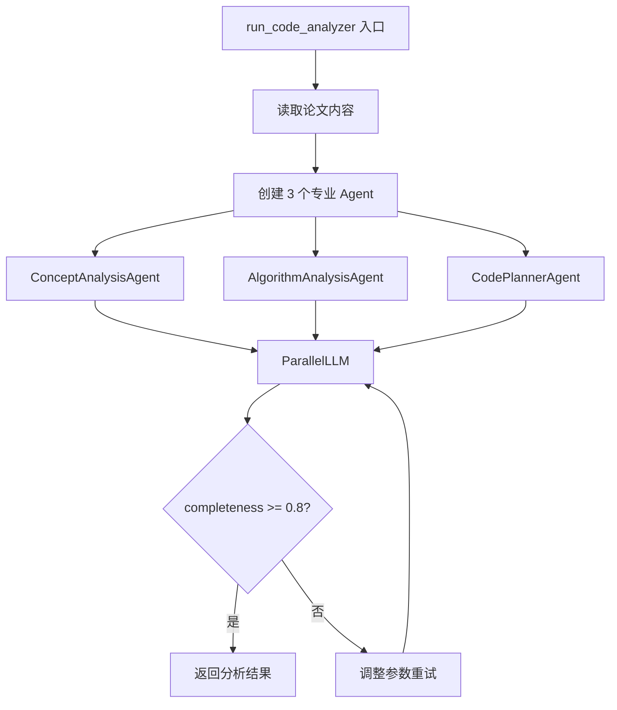
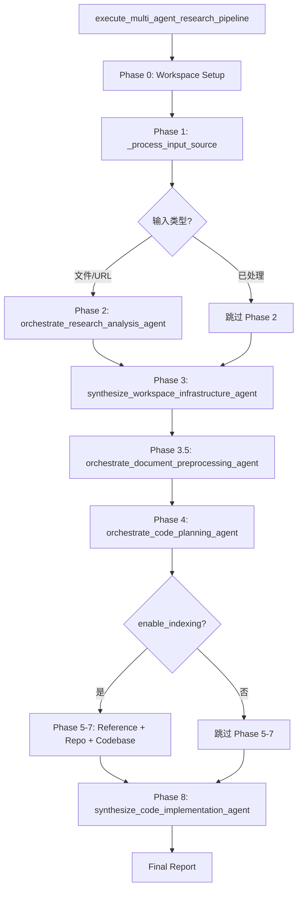
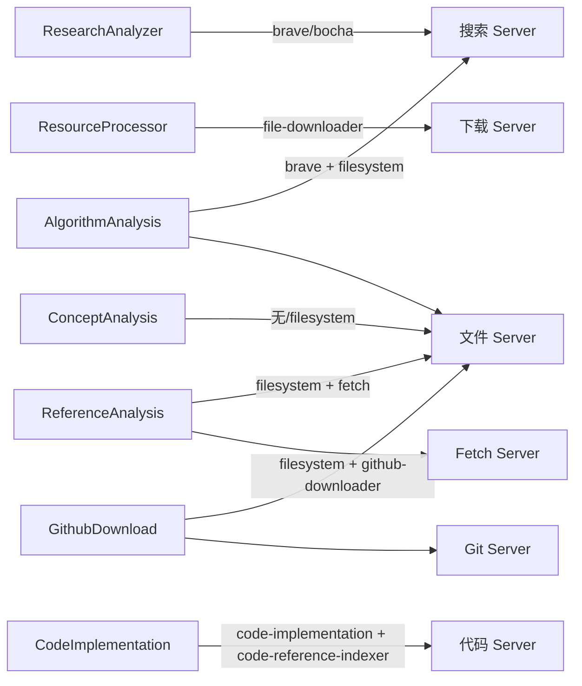

# PD-02.06 DeepCode — mcp_agent ParallelLLM 7-Agent 编排引擎

> 文档编号：PD-02.06
> 来源：DeepCode `workflows/agent_orchestration_engine.py`
> GitHub：https://github.com/HKUDS/DeepCode.git
> 问题域：PD-02 多 Agent 编排 Multi-Agent Orchestration
> 状态：可复用方案

---

## 第 1 章 问题与动机

### 1.1 核心问题

将一篇学术论文自动转化为可运行的代码实现，涉及论文解析、架构设计、参考代码获取、代码生成等多个阶段。每个阶段需要不同的专业能力（搜索、文件操作、代码分析、代码生成），单一 Agent 无法高效完成。核心挑战在于：

1. **阶段间依赖**：论文分析 → 架构规划 → 参考获取 → 代码实现，存在严格的先后顺序
2. **阶段内并行**：概念分析和算法分析可以同时进行，需要并行执行能力
3. **工具隔离**：不同 Agent 需要访问不同的 MCP Server（搜索、文件系统、代码执行等）
4. **上下文管理**：长流水线中如何在 Agent 间传递状态而不丢失关键信息

### 1.2 DeepCode 的解法概述

DeepCode 基于 `mcp_agent` 框架构建了一个 8 阶段流水线编排引擎，核心特征：

1. **7 个专业 Agent 角色分离**：Research/Workspace/CodeArchitecture/Reference/Repository/Codebase/Implementation，每个 Agent 有独立的 MCP Server 配置（`agent_orchestration_engine.py:1-27`）
2. **ParallelLLM Fan-In/Fan-Out 并行**：ConceptAnalysis 和 AlgorithmAnalysis 并行执行，CodePlanner 汇聚结果（`agent_orchestration_engine.py:724-728`）
3. **双流水线模式**：Paper-to-Code（8 阶段完整流水线）和 Chat-to-Code（4 阶段精简流水线），同一引擎支持两种编排模式（`agent_orchestration_engine.py:1645-2029`）
4. **自适应降级**：文档分割失败自动回退到传统模式，GitHub 下载失败不阻塞代码生成（`agent_orchestration_engine.py:1150-1186`）
5. **ConciseMemoryAgent 上下文压缩**：每次 write_file 后清空历史，只保留 system_prompt + plan + 当前轮工具结果（`memory_agent_concise.py:1-17`）

### 1.3 设计思想

| 设计原则 | 具体实现 | 理由 | 替代方案 |
|----------|----------|------|----------|
| 角色专业化 | 7 个 Agent 各自绑定不同 MCP Server | 工具隔离降低干扰，每个 Agent 只看到自己需要的工具 | 单 Agent + 全部工具（工具过多导致选择困难） |
| Fan-In/Fan-Out 并行 | ParallelLLM 将概念分析和算法分析并行化 | 两个分析任务独立无依赖，并行可节省 ~50% 时间 | 串行执行（简单但慢） |
| 双流水线复用 | Paper-to-Code 和 Chat-to-Code 共享 Implementation 阶段 | 避免代码重复，统一代码生成质量 | 完全独立的两套流水线 |
| 写后清空记忆 | ConciseMemoryAgent 在 write_file 后清空对话历史 | 长流水线中上下文会爆炸，清空后只保留必要信息 | 滑动窗口（可能丢失关键上下文） |
| 可选阶段跳过 | enable_indexing 参数控制是否执行 Reference/Repository/Codebase 阶段 | 快速模式跳过耗时的 GitHub 下载和索引 | 固定流水线（无法灵活裁剪） |

---

## 第 2 章 源码实现分析

### 2.1 架构概览

DeepCode 的编排引擎是一个 8 阶段顺序流水线，其中阶段 4（Code Planning）内部使用 ParallelLLM 实现并行分析：

```
┌─────────────────────────────────────────────────────────────────────┐
│                  AgentOrchestrationEngine                          │
│                                                                     │
│  Phase 0: Workspace Setup                                          │
│      ↓                                                              │
│  Phase 1: Input Processing (file/URL validation)                   │
│      ↓                                                              │
│  Phase 2: Research Analysis (ResearchAnalyzerAgent)                │
│      ↓                                                              │
│  Phase 3: Workspace Infrastructure (FileProcessor)                 │
│      ↓                                                              │
│  Phase 3.5: Document Preprocessing (DocumentSegmentationAgent)     │
│      ↓                                                              │
│  Phase 4: Code Planning ─── ParallelLLM ──┐                       │
│      │                    ┌────────────────┤                       │
│      │  ConceptAnalysis ──┤                │                       │
│      │  AlgorithmAnalysis ┤  → CodePlanner │                       │
│      │                    └────────────────┘                       │
│      ↓                                                              │
│  Phase 5: Reference Intelligence (ReferenceAnalysisAgent)          │
│      ↓                                                              │
│  Phase 6: Repository Acquisition (GithubDownloadAgent)             │
│      ↓                                                              │
│  Phase 7: Codebase Intelligence (CodebaseIndexWorkflow)            │
│      ↓                                                              │
│  Phase 8: Code Implementation (CodeImplementationWorkflow)         │
│      └── CodeImplementationAgent + ConciseMemoryAgent              │
└─────────────────────────────────────────────────────────────────────┘
```

### 2.2 核心实现

#### 2.2.1 ParallelLLM Fan-In/Fan-Out 并行分析



对应源码 `workflows/agent_orchestration_engine.py:708-728`：

```python
concept_analysis_agent = Agent(
    name="ConceptAnalysisAgent",
    instruction=prompts["concept_analysis"],
    server_names=agent_config["concept_analysis"],
)
algorithm_analysis_agent = Agent(
    name="AlgorithmAnalysisAgent",
    instruction=prompts["algorithm_analysis"],
    server_names=agent_config["algorithm_analysis"],
)
code_planner_agent = Agent(
    name="CodePlannerAgent",
    instruction=prompts["code_planning"],
    server_names=agent_config["code_planner"],
)

code_aggregator_agent = ParallelLLM(
    fan_in_agent=code_planner_agent,
    fan_out_agents=[concept_analysis_agent, algorithm_analysis_agent],
    llm_factory=get_preferred_llm_class(),
)
```

ParallelLLM 的工作机制：`fan_out_agents` 列表中的 Agent 并行执行同一个 message，各自产出分析结果；`fan_in_agent`（CodePlanner）接收所有 fan_out 结果并汇聚为最终的实现计划。这是 mcp_agent 框架提供的原语，DeepCode 直接复用。

#### 2.2.2 8 阶段主流水线编排



对应源码 `workflows/agent_orchestration_engine.py:1645-1837`：

```python
async def execute_multi_agent_research_pipeline(
    input_source: str,
    logger,
    progress_callback: Optional[Callable] = None,
    enable_indexing: bool = True,
) -> str:
    # Phase 0: Workspace Setup
    workspace_dir = os.path.join(os.getcwd(), "deepcode_lab")
    os.makedirs(workspace_dir, exist_ok=True)

    # Phase 1: Input Processing
    input_source = await _process_input_source(input_source, logger)

    # Phase 2: Research Analysis (conditional)
    if isinstance(input_source, str) and (
        input_source.endswith((".pdf", ".docx", ".txt", ".html", ".md"))
        or input_source.startswith(("http", "file://"))
    ):
        analysis_result, download_result = await orchestrate_research_analysis_agent(
            input_source, logger, progress_callback
        )
    else:
        download_result = input_source

    # Phase 3: Workspace Infrastructure
    dir_info = await synthesize_workspace_infrastructure_agent(
        download_result, logger, workspace_dir
    )

    # Phase 3.5: Document Preprocessing
    segmentation_result = await orchestrate_document_preprocessing_agent(dir_info, logger)

    # Phase 4: Code Planning (contains ParallelLLM)
    await orchestrate_code_planning_agent(dir_info, logger, progress_callback)

    # Phase 5-7: Optional intelligence phases
    if enable_indexing:
        reference_result = await orchestrate_reference_intelligence_agent(...)
        await automate_repository_acquisition_agent(...)
        index_result = await orchestrate_codebase_intelligence_agent(...)

    # Phase 8: Code Implementation
    implementation_result = await synthesize_code_implementation_agent(
        dir_info, logger, progress_callback, enable_indexing
    )
```

#### 2.2.3 动态 Server 配置与工具隔离

每个 Agent 绑定不同的 MCP Server，实现工具隔离。Server 配置在 `mcp_agent.config.yaml` 中定义：



对应源码 `mcp_agent.config.yaml:18-104`，Agent 实例化时通过 `server_names` 参数绑定：

```python
# ResearchAnalyzerAgent - 只需搜索能力
analyzer_agent = Agent(
    name="ResearchAnalyzerAgent",
    instruction=PAPER_INPUT_ANALYZER_PROMPT,
    server_names=get_search_server_names(),  # ["brave"] 或 ["bocha-mcp"]
)

# ReferenceAnalysisAgent - 需要文件系统 + 网络获取
reference_analysis_agent = Agent(
    name="ReferenceAnalysisAgent",
    instruction=PAPER_REFERENCE_ANALYZER_PROMPT,
    server_names=["filesystem", "fetch"],
)
```

### 2.3 实现细节

**完整性评估与自适应重试**：`run_code_analyzer` 在 ParallelLLM 执行后，通过 `_assess_output_completeness` 检查输出的 YAML 计划是否完整（5 个必需 section、YAML 结构、最后一行完整性、最小长度），不达标则降低 `maxTokens` 和 `temperature` 重试最多 3 次（`agent_orchestration_engine.py:68-147`）。

**ConciseMemoryAgent 写后清空**：在代码实现循环中，每次检测到 `write_file` 工具调用后，`ConciseMemoryAgent.apply_memory_optimization` 清空对话历史，只保留 system_prompt + initial_plan + 当前轮工具结果。这解决了长实现过程中上下文窗口爆炸的问题（`code_implementation_workflow.py:405-416`）。

**双流水线模式选型**：`execute_multi_agent_research_pipeline`（Paper-to-Code，8 阶段）和 `execute_chat_based_planning_pipeline`（Chat-to-Code，4 阶段）共享 Phase 8 的 `synthesize_code_implementation_agent`，Chat 模式跳过论文分析和参考获取，直接从用户需求生成实现计划（`agent_orchestration_engine.py:1863-2028`）。

**分析循环检测**：`CodeImplementationAgent` 跟踪最近 5 次工具调用，如果全部是 `read_file`/`search_reference_code` 而没有 `write_file`，判定为分析循环并注入纠正指令（`code_implementation_agent.py:843-910`）。

---

## 第 3 章 迁移指南

### 3.1 迁移清单

**阶段 1：基础框架搭建**
- [ ] 安装 `mcp_agent` 框架（`pip install mcp-agent`）
- [ ] 定义 `mcp_agent.config.yaml`，配置所需的 MCP Server
- [ ] 创建 Agent 角色定义（instruction prompt + server_names）

**阶段 2：编排引擎实现**
- [ ] 实现顺序流水线函数（async 函数链）
- [ ] 在需要并行的阶段引入 ParallelLLM
- [ ] 实现 progress_callback 进度回调机制

**阶段 3：上下文管理**
- [ ] 实现 ConciseMemoryAgent 或类似的上下文压缩机制
- [ ] 配置 RequestParams（maxTokens、temperature、tool_filter）
- [ ] 实现完整性评估和自适应重试

**阶段 4：容错与降级**
- [ ] 为每个阶段添加 try/except 和降级路径
- [ ] 实现可选阶段跳过（enable_indexing 模式）
- [ ] 添加分析循环检测和纠正机制

### 3.2 适配代码模板

以下是一个可直接复用的 ParallelLLM 编排模板：

```python
"""
基于 mcp_agent 的 ParallelLLM 多 Agent 编排模板
可直接复用到任何需要 fan-in/fan-out 并行的场景
"""
import asyncio
from typing import Any, Callable, Dict, List, Optional

from mcp_agent.agents.agent import Agent
from mcp_agent.workflows.llm.augmented_llm import RequestParams
from mcp_agent.workflows.parallel.parallel_llm import ParallelLLM


async def create_parallel_analysis(
    fan_out_configs: List[Dict[str, Any]],
    fan_in_config: Dict[str, Any],
    llm_factory: Callable,
    message: str,
    max_retries: int = 3,
    completeness_threshold: float = 0.8,
) -> str:
    """
    通用 ParallelLLM 编排函数

    Args:
        fan_out_configs: 并行 Agent 配置列表，每个包含 name/instruction/server_names
        fan_in_config: 汇聚 Agent 配置
        llm_factory: LLM 工厂函数
        message: 输入消息
        max_retries: 最大重试次数
        completeness_threshold: 完整性阈值

    Returns:
        汇聚后的分析结果
    """
    # 创建 fan-out agents
    fan_out_agents = [
        Agent(
            name=config["name"],
            instruction=config["instruction"],
            server_names=config.get("server_names", []),
        )
        for config in fan_out_configs
    ]

    # 创建 fan-in agent
    fan_in_agent = Agent(
        name=fan_in_config["name"],
        instruction=fan_in_config["instruction"],
        server_names=fan_in_config.get("server_names", []),
    )

    # 组装 ParallelLLM
    parallel_llm = ParallelLLM(
        fan_in_agent=fan_in_agent,
        fan_out_agents=fan_out_agents,
        llm_factory=llm_factory,
    )

    # 配置请求参数
    params = RequestParams(
        maxTokens=40000,
        temperature=0.2,
        max_iterations=5,
    )

    # 带重试的执行
    for retry in range(max_retries):
        try:
            result = await parallel_llm.generate_str(
                message=message, request_params=params
            )
            # 可插入完整性检查逻辑
            if len(result) > 500:  # 简化的完整性检查
                return result
            # 降低 token 限制重试
            params = RequestParams(
                maxTokens=int(params.maxTokens * 0.8),
                temperature=max(params.temperature - 0.1, 0.05),
            )
        except Exception as e:
            if retry == max_retries - 1:
                raise
            await asyncio.sleep(2 ** retry)

    return result


async def run_sequential_pipeline(
    stages: List[Dict[str, Any]],
    initial_input: Any,
    progress_callback: Optional[Callable] = None,
) -> Dict[str, Any]:
    """
    通用顺序流水线编排函数

    Args:
        stages: 阶段配置列表，每个包含 name/func/optional/depends_on
        initial_input: 初始输入
        progress_callback: 进度回调

    Returns:
        各阶段结果字典
    """
    results = {}
    current_input = initial_input

    for i, stage in enumerate(stages):
        stage_name = stage["name"]
        stage_func = stage["func"]
        is_optional = stage.get("optional", False)

        if progress_callback:
            progress = int((i / len(stages)) * 100)
            progress_callback(progress, f"执行阶段: {stage_name}")

        try:
            result = await stage_func(current_input, results)
            results[stage_name] = result
            current_input = result
        except Exception as e:
            if is_optional:
                results[stage_name] = {"status": "skipped", "error": str(e)}
            else:
                raise

    return results
```

### 3.3 适用场景

| 场景 | 适用度 | 说明 |
|------|--------|------|
| 论文复现 / Paper-to-Code | ⭐⭐⭐ | DeepCode 的核心场景，完整 8 阶段流水线 |
| 多步骤代码生成 | ⭐⭐⭐ | 需求分析 → 架构设计 → 代码实现的流水线 |
| 研究报告生成 | ⭐⭐ | 多源信息收集 → 并行分析 → 汇总报告 |
| 单轮对话 Agent | ⭐ | 过度设计，单 Agent + 多工具更合适 |
| 实时交互系统 | ⭐ | 流水线延迟较高，不适合实时场景 |

---

## 第 4 章 测试用例

```python
"""
DeepCode 多 Agent 编排引擎测试用例
基于 agent_orchestration_engine.py 的真实函数签名
"""
import pytest
import json
from unittest.mock import AsyncMock, MagicMock, patch


class TestOutputCompletenessAssessment:
    """测试 _assess_output_completeness 完整性评估"""

    def test_empty_input_returns_zero(self):
        from workflows.agent_orchestration_engine import _assess_output_completeness
        assert _assess_output_completeness("") == 0.0
        assert _assess_output_completeness("short") == 0.0

    def test_complete_yaml_plan_scores_high(self):
        from workflows.agent_orchestration_engine import _assess_output_completeness
        complete_plan = """```yaml
complete_reproduction_plan:
  file_structure:
    - src/main.py
    - src/model.py
  implementation_components:
    - name: DataLoader
      description: Load and preprocess data
  validation_approach:
    - unit_tests: true
  environment_setup:
    python_version: "3.10"
    dependencies:
      - torch>=2.0
  implementation_strategy:
    order: bottom-up
    phases:
      - foundation
      - core
      - integration
```""" + "x" * 8000  # 确保长度足够
        score = _assess_output_completeness(complete_plan)
        assert score >= 0.8, f"Complete plan should score >= 0.8, got {score}"

    def test_partial_plan_scores_medium(self):
        from workflows.agent_orchestration_engine import _assess_output_completeness
        partial_plan = """```yaml
file_structure:
  - src/main.py
implementation_components:
  - name: Model
```""" + "x" * 3000
        score = _assess_output_completeness(partial_plan)
        assert 0.2 <= score <= 0.7, f"Partial plan should score 0.2-0.7, got {score}"


class TestRetryParameterAdjustment:
    """测试 _adjust_params_for_retry Token 减少策略"""

    def test_first_retry_reduces_tokens(self):
        from workflows.agent_orchestration_engine import _adjust_params_for_retry
        from mcp_agent.workflows.llm.augmented_llm import RequestParams
        params = RequestParams(maxTokens=40000, temperature=0.3)
        new_tokens, new_temp = _adjust_params_for_retry(params, retry_count=0)
        assert new_tokens < 40000, "First retry should reduce tokens"
        assert new_temp < 0.3, "First retry should reduce temperature"

    def test_subsequent_retries_reduce_further(self):
        from workflows.agent_orchestration_engine import _adjust_params_for_retry
        from mcp_agent.workflows.llm.augmented_llm import RequestParams
        params = RequestParams(maxTokens=40000, temperature=0.3)
        tokens_0, _ = _adjust_params_for_retry(params, retry_count=0)
        tokens_1, _ = _adjust_params_for_retry(params, retry_count=1)
        tokens_2, _ = _adjust_params_for_retry(params, retry_count=2)
        assert tokens_0 > tokens_1 > tokens_2, "Tokens should decrease with retries"


class TestSearchServerConfiguration:
    """测试动态搜索服务器配置"""

    def test_default_search_server_fallback(self):
        from workflows.agent_orchestration_engine import get_default_search_server
        # 不存在的配置文件应返回默认值
        server = get_default_search_server("nonexistent.yaml")
        assert server == "brave"

    def test_get_search_server_names_dedup(self):
        from workflows.agent_orchestration_engine import get_search_server_names
        names = get_search_server_names(additional_servers=["brave", "filesystem"])
        # 不应有重复
        assert len(names) == len(set(names))


class TestCleanJsonExtraction:
    """测试 LLM 输出 JSON 清洗"""

    def test_extract_from_markdown_block(self):
        from workflows.agent_orchestration_engine import extract_clean_json
        raw = '```json\n{"key": "value"}\n```'
        result = extract_clean_json(raw)
        parsed = json.loads(result)
        assert parsed["key"] == "value"

    def test_extract_from_mixed_text(self):
        from workflows.agent_orchestration_engine import extract_clean_json
        raw = 'Here is the result:\n{"status": "success", "data": [1,2,3]}\nDone.'
        result = extract_clean_json(raw)
        parsed = json.loads(result)
        assert parsed["status"] == "success"


class TestCodeImplementationAgent:
    """测试 CodeImplementationAgent 进度跟踪"""

    def test_unique_file_counting(self):
        from workflows.agents.code_implementation_agent import CodeImplementationAgent
        agent = CodeImplementationAgent(mcp_agent=None)
        # 模拟两次写入同一文件
        mock_call = {"input": {"file_path": "src/main.py"}}
        mock_result = {"status": "success", "file_path": "src/main.py"}
        agent._track_file_implementation(mock_call, json.dumps(mock_result))
        agent._track_file_implementation(mock_call, json.dumps(mock_result))
        assert agent.get_files_implemented_count() == 1, "Same file should count once"

    def test_analysis_loop_detection(self):
        from workflows.agents.code_implementation_agent import CodeImplementationAgent
        agent = CodeImplementationAgent(mcp_agent=None)
        # 模拟连续 5 次 read_file
        for _ in range(5):
            agent._track_tool_call_for_loop_detection("read_file")
        assert agent.is_in_analysis_loop(), "Should detect analysis loop"

    def test_no_loop_with_mixed_calls(self):
        from workflows.agents.code_implementation_agent import CodeImplementationAgent
        agent = CodeImplementationAgent(mcp_agent=None)
        agent._track_tool_call_for_loop_detection("read_file")
        agent._track_tool_call_for_loop_detection("write_file")
        agent._track_tool_call_for_loop_detection("read_file")
        assert not agent.is_in_analysis_loop(), "Mixed calls should not trigger loop"
```

---

## 第 5 章 跨域关联

| 关联域 | 关系类型 | 说明 |
|--------|----------|------|
| PD-01 上下文管理 | 依赖 | ConciseMemoryAgent 的写后清空机制是上下文管理的具体实现，解决长流水线中 token 爆炸问题 |
| PD-03 容错与重试 | 协同 | `_adjust_params_for_retry` 的 Token 递减策略和 `_assess_output_completeness` 完整性检查属于容错设计 |
| PD-04 工具系统 | 依赖 | 每个 Agent 通过 `server_names` 绑定 MCP Server，工具隔离是编排的基础设施 |
| PD-08 搜索与检索 | 协同 | ResearchAnalyzerAgent 和 ReferenceAnalysisAgent 依赖搜索能力（brave/bocha/fetch） |
| PD-09 Human-in-the-Loop | 协同 | RequirementAnalysisAgent 通过引导式问答收集用户需求，是 Chat-to-Code 流水线的入口 |
| PD-11 可观测性 | 协同 | progress_callback 机制提供阶段级进度追踪，每个 Agent 有独立的 logger |

---

## 第 6 章 来源文件索引

| 文件 | 行范围 | 关键实现 |
|------|--------|----------|
| `workflows/agent_orchestration_engine.py` | L1-L27 | 模块文档：7 个 Agent 角色定义 |
| `workflows/agent_orchestration_engine.py` | L37-L39 | mcp_agent 核心导入：Agent, RequestParams, ParallelLLM |
| `workflows/agent_orchestration_engine.py` | L68-L147 | `_assess_output_completeness` 完整性评估 + `_adjust_params_for_retry` 重试策略 |
| `workflows/agent_orchestration_engine.py` | L374-L482 | `run_research_analyzer` ResearchAnalyzerAgent 实现 |
| `workflows/agent_orchestration_engine.py` | L635-L856 | `run_code_analyzer` ParallelLLM 并行分析核心 |
| `workflows/agent_orchestration_engine.py` | L708-L728 | 3 个 Agent 创建 + ParallelLLM 组装 |
| `workflows/agent_orchestration_engine.py` | L894-L933 | `paper_reference_analyzer` ReferenceAnalysisAgent |
| `workflows/agent_orchestration_engine.py` | L1536-L1642 | `run_chat_planning_agent` Chat 模式规划 |
| `workflows/agent_orchestration_engine.py` | L1645-L1837 | `execute_multi_agent_research_pipeline` 8 阶段主流水线 |
| `workflows/agent_orchestration_engine.py` | L1863-L2029 | `execute_chat_based_planning_pipeline` Chat-to-Code 流水线 |
| `workflows/code_implementation_workflow.py` | L39-L48 | CodeImplementationWorkflow 类定义 |
| `workflows/code_implementation_workflow.py` | L296-L464 | `_pure_code_implementation_loop` 实现循环 + 记忆优化 |
| `workflows/agents/code_implementation_agent.py` | L33-L122 | CodeImplementationAgent 初始化 + 工具跟踪配置 |
| `workflows/agents/code_implementation_agent.py` | L154-L276 | `execute_tool_calls` MCP 工具执行 + read_file 拦截优化 |
| `workflows/agents/code_implementation_agent.py` | L843-L910 | 分析循环检测 + 纠正指令生成 |
| `workflows/agents/memory_agent_concise.py` | L1-L17 | ConciseMemoryAgent 设计哲学文档 |
| `workflows/agents/memory_agent_concise.py` | L27-L79 | ConciseMemoryAgent 初始化 + 写后清空状态机 |
| `workflows/agents/requirement_analysis_agent.py` | L17-L31 | RequirementAnalysisAgent 角色定义 |
| `workflows/agents/requirement_analysis_agent.py` | L58-L94 | MCP Agent 初始化（无 Server，纯 LLM） |
| `workflows/agents/document_segmentation_agent.py` | L16-L33 | DocumentSegmentationAgent 语义分割能力 |
| `workflows/agents/document_segmentation_agent.py` | L57-L77 | MCP Agent 初始化 + document-segmentation Server 绑定 |
| `workflows/codebase_index_workflow.py` | L30-L56 | CodebaseIndexWorkflow 代码索引工作流 |
| `mcp_agent.config.yaml` | L18-L104 | 8 个 MCP Server 配置定义 |
| `mcp_agent.config.yaml` | L105-L134 | 多 LLM 提供商配置（OpenAI/Google/Anthropic） |

---

## 第 7 章 横向对比维度

```json comparison_data
{
  "project": "DeepCode",
  "dimensions": {
    "编排模式": "8阶段顺序流水线 + ParallelLLM fan-in/fan-out 并行",
    "并行能力": "mcp_agent ParallelLLM 原语，fan-out 并行 + fan-in 汇聚",
    "状态管理": "函数参数传递 dir_info Dict + ConciseMemoryAgent 写后清空",
    "并发限制": "ParallelLLM 内部管理，无显式并发限制配置",
    "工具隔离": "每个 Agent 通过 server_names 绑定独立 MCP Server",
    "模块自治": "7 个专业 Agent 各自独立，通过 async 函数链串联",
    "懒初始化": "Agent 使用 async with 上下文管理器按需初始化和释放",
    "结果回传": "fan-in Agent 自动接收所有 fan-out 结果，流水线通过返回值传递",
    "双流水线": "Paper-to-Code(8阶段) 和 Chat-to-Code(4阶段) 共享实现层",
    "记忆压缩": "ConciseMemoryAgent 每次 write_file 后清空历史只保留 plan"
  }
}
```

### 域元数据补充

```json domain_metadata
{
  "solution_summary": "DeepCode 用 mcp_agent 框架的 ParallelLLM 实现 fan-in/fan-out 并行，7 个专业 Agent 通过 MCP Server 工具隔离，支持 Paper-to-Code 和 Chat-to-Code 双流水线模式",
  "description": "基于 MCP 协议的 Agent 编排，通过 Server 绑定实现工具级隔离",
  "sub_problems": [
    "双流水线复用：同一系统如何支持多条不同长度的编排流水线并共享公共阶段",
    "写后清空记忆：长实现循环中如何在保留必要上下文的同时防止 token 爆炸",
    "完整性评估：如何自动判断 LLM 输出是否被截断并触发自适应重试"
  ],
  "best_practices": [
    "MCP Server 绑定实现工具隔离：每个 Agent 只看到自己需要的工具，减少工具选择干扰",
    "fan-in/fan-out 用于独立分析任务：概念分析和算法分析无依赖时并行可节省约 50% 时间",
    "分析循环检测：跟踪最近 N 次工具调用，全部为读操作时注入写操作纠正指令"
  ]
}
```
