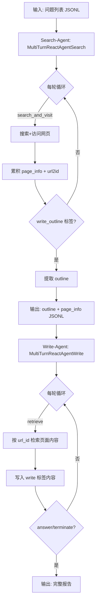
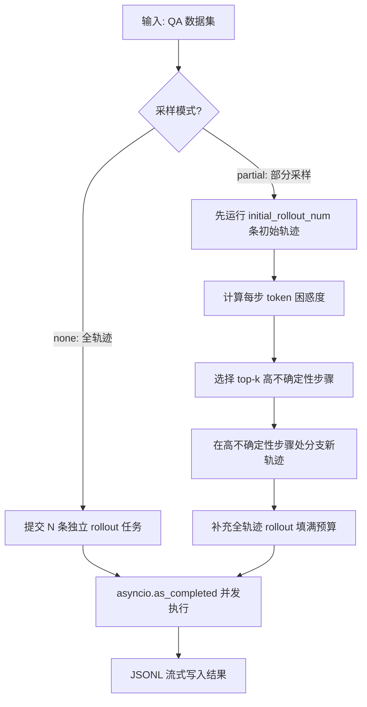
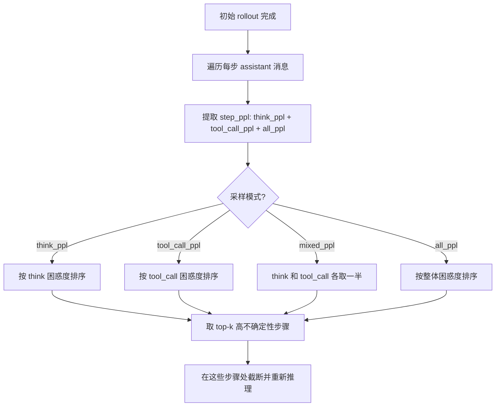
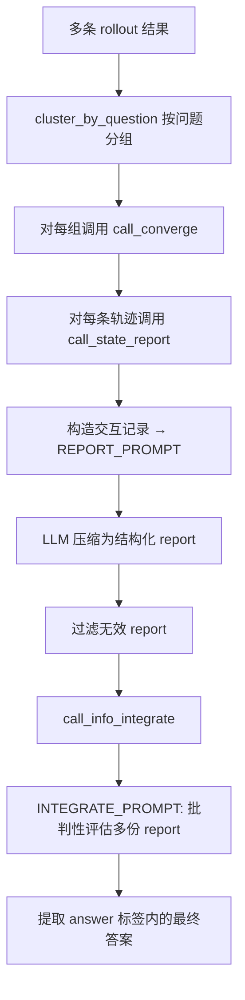

# PD-02.14 DeepResearch — 双系统多路径并行推理编排

> 文档编号：PD-02.14
> 来源：DeepResearch `WebAgent/WebWeaver/`, `WebAgent/ParallelMuse/`
> GitHub：https://github.com/Alibaba-NLP/DeepResearch
> 问题域：PD-02 多 Agent 编排 Multi-Agent Orchestration
> 状态：可复用方案

---

## 第 1 章 问题与动机

### 1.1 核心问题

深度研究任务（Deep Research）面临一个根本性矛盾：**单条推理路径的不确定性与最终答案的确定性要求之间的冲突**。一个 LLM Agent 在执行多轮搜索-推理循环时，每一步的工具调用选择和思维链推理都存在随机性——同一个问题，不同的搜索路径可能导向不同的结论。

这个问题在复杂研究任务中尤为突出：
- 单次推理可能因为搜索关键词选择不当而遗漏关键信息
- LLM 在长推理链中可能在某个高不确定性步骤做出错误决策
- 不同信息源可能提供矛盾的证据，单条路径难以交叉验证

DeepResearch 的解法是**不依赖单条路径，而是通过多路径并行推理 + 结果聚合来提升答案可靠性**。这是一种"用计算换准确率"的策略。

### 1.2 DeepResearch 的解法概述

DeepResearch 提供了两套互补的编排系统：

1. **WebWeaver（两阶段流水线编排）**：Search-Agent 先搜索收集证据并生成大纲，Write-Agent 再基于大纲和证据生成报告。两个 Agent 通过 JSONL 文件串联，各自可并行处理多个问题（`run_search_outline.py:152`, `run_write_outline.py:152`）

2. **ParallelMuse（多路径并行推理编排）**：同一问题启动多条独立推理轨迹（rollout），每条轨迹独立执行搜索-推理循环，最终通过 report 压缩 + integrate 聚合产生最终答案（`functionality_specified_partial_rollout.py:320`, `compressed_reasoning_aggregation.py:236`）

3. **熵驱动的部分采样（Partial Sampling）**：ParallelMuse 的核心创新——不是简单地多次从头运行，而是通过 token 级别的困惑度（perplexity）识别高不确定性步骤，在这些步骤处分支出新的推理路径（`functionality_specified_partial_rollout.py:285-317`）

4. **Report-Integrate 两阶段聚合**：多条轨迹的结果不是简单投票，而是先压缩为结构化报告（保留推理过程），再由 Integrator 批判性地评估多份报告得出最终答案（`compressed_reasoning_aggregation.py:159-233`）

5. **异步信号量并发控制**：LLM 调用、搜索、访问三类资源分别用独立信号量控制并发度（`functionality_specified_partial_rollout.py:321-325`）

### 1.3 设计思想

| 设计原则 | 具体实现 | 理由 | 替代方案 |
|----------|----------|------|----------|
| 多路径冗余 | 同一问题启动 N 条独立 rollout | 单条路径不确定性高，多路径交叉验证提升可靠性 | 单路径 + 自我反思（成本低但可靠性差） |
| 熵驱动分支 | 用 token logprobs 计算困惑度，在高不确定性步骤分支 | 比随机分支更高效，集中计算资源在真正不确定的决策点 | 均匀随机分支（浪费计算资源） |
| 两阶段聚合 | 先 compress 为 report 再 integrate | 直接合并原始轨迹 token 太多，压缩后保留关键推理链 | 直接投票（丢失推理过程） |
| 流水线解耦 | Search 和 Write 通过 JSONL 文件解耦 | 两阶段可独立扩展、独立重试、独立调参 | 单 Agent 端到端（灵活性差） |
| 资源分类限流 | LLM/Search/Visit 三类信号量独立 | 不同资源瓶颈不同，统一限流会浪费吞吐 | 全局单一信号量（资源利用率低） |

---

## 第 2 章 源码实现分析

### 2.1 架构概览

DeepResearch 的编排架构分为两个独立系统，可单独使用也可组合：

```
┌─────────────────────────────────────────────────────────────────┐
│                    WebWeaver（两阶段流水线）                       │
│                                                                 │
│  ┌──────────────────┐   JSONL    ┌──────────────────┐           │
│  │  Search-Agent    │──────────→│  Write-Agent     │           │
│  │  (搜索+大纲生成)  │  outline   │  (检索+报告撰写)  │           │
│  │  ThreadPool×N    │  page_info │  ThreadPool×N    │           │
│  └──────────────────┘           └──────────────────┘           │
│                                                                 │
├─────────────────────────────────────────────────────────────────┤
│                  ParallelMuse（多路径并行推理）                    │
│                                                                 │
│  ┌─────────┐  ┌─────────┐  ┌─────────┐                        │
│  │Rollout 1│  │Rollout 2│  │Rollout 3│  ... ×sampling_budget   │
│  │(独立轨迹)│  │(独立轨迹)│  │(独立轨迹)│                        │
│  └────┬────┘  └────┬────┘  └────┬────┘                        │
│       │            │            │                               │
│       ▼            ▼            ▼                               │
│  ┌─────────────────────────────────────┐                       │
│  │  Entropy-based Partial Sampling     │                       │
│  │  (高不确定性步骤处分支新轨迹)          │                       │
│  └──────────────────┬──────────────────┘                       │
│                     ▼                                           │
│  ┌──────────┐  ┌──────────┐                                    │
│  │ Report×N │→│ Integrate │→ Final Answer                      │
│  │ (压缩轨迹) │  │ (批判聚合) │                                    │
│  └──────────┘  └──────────┘                                    │
└─────────────────────────────────────────────────────────────────┘
```

### 2.2 核心实现

#### 2.2.1 WebWeaver 两阶段流水线



对应源码 `WebAgent/WebWeaver/react_agent_search_id.py:138-282`：

```python
class MultiTurnReactAgentSearch(FnCallAgent):
    def _run(self, data: str, model: str, **kwargs) -> List[List[Message]]:
        self.model = model
        page_info = []
        url2id = {}
        search_num = 0
        # ...
        messages = [{"role": "system", "content": self.system_message},
                    {"role": "user", "content": self.user_prompt}]
        num_llm_calls_available = MAX_LLM_CALL_PER_RUN  # 默认 40 轮

        while num_llm_calls_available > 0:
            round += 1
            num_llm_calls_available -= 1
            content = call_dashscope(model=model, messages=messages, ...)

            # 解析 tool_call → 执行搜索 → 累积 page_info
            if '<tool_call>' in content and '</tool_call>' in content:
                tool_call = json.loads(content.split('<tool_call>')[1].split('</tool_call>')[0])
                tool_args["page_info"] = page_info
                result = self._call_tool(tool_name, tool_args)
                page_info = self.save_page_info(page_info, result)
                url2id = self.save_url2id(url2id, result)

            # 检测 outline 生成完成
            if '<write_outline>' in content and '</write_outline>' in content:
                outline = ''.join(re.findall(r'<write_outline>(.*?)</write_outline>', content, flags=re.S))

            # token 超限保护
            if token_count > 84000:
                termination = 'token limit reached'
                return result
```

关键设计点：
- Search-Agent 的输出包含 `outline`（大纲）和 `page_info`（所有访问过的页面摘要+证据），通过 JSONL 传递给 Write-Agent（`react_agent_search_id.py:267-282`）
- `url2id` 映射表在搜索过程中动态构建，每发现新 URL 自动分配递增 ID（`react_agent_search_id.py:128-136`）
- 每轮循环后检查 token 数，超过 84000 则强制终止（`react_agent_search_id.py:235-259`）

#### 2.2.2 ParallelMuse 多路径并行推理



对应源码 `WebAgent/ParallelMuse/functionality_specified_partial_rollout.py:320-494`：

```python
async def main(args):
    llm_sem = asyncio.Semaphore(args.max_llm_workers)      # LLM 并发: 默认 32
    tool_sem = {
        'search': asyncio.Semaphore(args.max_search_workers),  # 搜索并发: 默认 32
        'visit': asyncio.Semaphore(args.max_visit_workers)     # 访问并发: 默认 32
    }

    tasks = []
    if args.partial_sampling_mode == 'none':  # 全轨迹模式
        for data in dataset:
            need_to_submit = args.sampling_budget - visited_counter[question]
            for _ in range(need_to_submit):
                tasks.append(rollout_single_traj(llm_sem, tool_sem, data, messages, args))

    else:  # 部分采样模式
        for data in dataset:
            initial_rollouts = get_initial_rollouts(question, existing_rollouts, initial_rollout_num)
            for r in initial_rollouts:
                # 识别高不确定性步骤
                branch_step = branch_high_uncertainty_steps(
                    r['rollout'], partial_sampling_topk, partial_sampling_mode)
                # 在高不确定性步骤处分支
                tasks.extend([
                    rollout_single_traj(llm_sem, tool_sem, data,
                        r['rollout'][:int(b['step_id'])],  # 截断到分支点
                        args, max_turn-(int(b['step_id'])-2)/2, 'partial_rollout')
                    for b in branch_step
                    for _ in range(partial_sampling_times_per_pos)
                ])

    # 异步并发执行所有任务
    for future in asyncio.as_completed(tasks):
        result = await future
        f.write(json.dumps(result, ensure_ascii=False) + "\n")
```

#### 2.2.3 熵驱动的分支点选择



对应源码 `WebAgent/ParallelMuse/functionality_specified_partial_rollout.py:285-317`：

```python
def branch_high_uncertainty_steps(rollout, partial_sampling_topk, partial_sampling_mode):
    branch_step = []

    if partial_sampling_mode != "mixed_ppl":
        for i, msg in enumerate(rollout):
            if msg.get("step_ppl", None):
                branch_step.append({'step_id': i, 'step_ppl': msg['step_ppl'][partial_sampling_mode]})
        # 按困惑度降序排列，取 top-k
        branch_step = sorted(branch_step, key=lambda x: x['step_ppl'], reverse=True)[:partial_sampling_topk]

    else:  # mixed_ppl: think 和 tool_call 各取一半
        tool_call_sampling_topk = math.ceil(partial_sampling_topk / 2)
        think_sampling_topk = math.floor(partial_sampling_topk / 2)

        tool_call_branch_step = []
        think_branch_step = []
        for i, msg in enumerate(rollout):
            if msg.get("step_ppl", None):
                tool_call_branch_step.append({'step_id': i, 'step_ppl': msg['step_ppl']['tool_call_ppl']})
                think_branch_step.append({'step_id': i, 'step_ppl': msg['step_ppl']['think_ppl']})

        branch_step.extend(sorted(tool_call_branch_step, key=lambda x: x['step_ppl'], reverse=True)[:tool_call_sampling_topk])
        branch_step.extend(sorted(think_branch_step, key=lambda x: x['step_ppl'], reverse=True)[:think_sampling_topk])

    return branch_step
```

困惑度的计算发生在 LLM 调用时，通过 `logprobs=True` 获取 token 级别的 log 概率（`functionality_specified_partial_rollout.py:91-157`）：

```python
response = await client.chat.completions.create(
    model="", messages=messages,
    logprobs=True, top_logprobs=16,  # 获取 top-16 token 的 logprobs
    max_tokens=max_tokens
)
# 计算每个 token 的熵
for tok, toplogprobs in zip(result_tokens, result_toplogprobs):
    logprob_values = np.array([tlp.logprob for tlp in toplogprobs])
    probs = np.exp(logprob_values)
    probs = probs / probs.sum()
    entropy = -np.sum(probs * logprob_values)
    all_token_entropies.append((tok, entropy))

# 分别计算 think 区域和 tool_call 区域的困惑度
think_ppl = np.exp(np.mean(entropies[think_start+1: think_end]))
tool_call_ppl = np.exp(np.mean(entropies[tool_call_start+1: tool_call_end]))
```

#### 2.2.4 Report-Integrate 两阶段聚合



对应源码 `WebAgent/ParallelMuse/compressed_reasoning_aggregation.py:236-249`：

```python
async def call_converge(sem, traj_group):
    question = traj_group[0]['question']
    answer = traj_group[0]['answer']
    report_group = []
    for traj in traj_group:
        # 阶段 1: 每条轨迹压缩为 report
        report = await call_state_report(sem['report'], traj)
        report_group.append(report)

    # 阶段 2: 多份 report 聚合为最终答案
    merge_num, prediction = await call_info_integrate(sem['merge'], question, report_group)

    return {'question': question, 'answer': answer, 'prediction': prediction,
            'merge_num': merge_num, 'report_group': report_group}
```

### 2.3 实现细节

**WebWeaver 的记忆压缩机制**：Write-Agent 在每次成功写入一个段落后，会将上一步检索到的页面原文替换为占位文本，防止上下文爆炸（`react_agent_outline_write.py:233-239`）：

```python
if '<write>' in content and '</write>' in content:
    # 将上一步的 tool_response 中的原文替换为占位符
    tool_response_content = messages[-2]['content']
    if "<tool_response>" in tool_response_content:
        mask_content = tool_response_content.split("<tool_response>")[1].split("</tool_response>")[0]
        tool_response_content = tool_response_content.replace(
            mask_content, "The page content for the previous section has been masked for saving the space.")
    messages[-2]['content'] = tool_response_content
```

**ParallelMuse 的采样预算管理**：系统严格控制总采样预算，确保 `initial_rollout_num + partial_sampling_topk × rounds × times_per_pos` 不超过 `sampling_budget`（`functionality_specified_partial_rollout.py:403`）：

```python
assert sampling_budget >= initial_rollout_num + initial_rollout_num * partial_sampling_topk * partial_sampling_rounds * partial_sampling_times_per_pos
```

**断点续传**：两个系统都支持从已有输出文件恢复，通过检查已处理的 question 集合跳过重复任务（`run_search_outline.py:88-102`, `functionality_specified_partial_rollout.py:335-374`）。

**INTEGRATE_PROMPT 的批判性设计**（`compressed_reasoning_aggregation.py:48-68`）：
- 明确要求"批判性评估哪份报告可信"
- 多份报告得出相同结论增加可信度但不保证正确
- 禁止合并不同答案或给出模糊答案
- 禁止调用外部工具，只能基于已有信息推理

---

## 第 3 章 迁移指南

### 3.1 迁移清单

**阶段 1：基础两阶段流水线（WebWeaver 模式）**
- [ ] 定义 Search-Agent：继承 ReAct 循环，工具集限定为 search + visit
- [ ] 定义 Write-Agent：工具集限定为 retrieve（按 ID 检索已缓存页面）
- [ ] 实现 JSONL 中间格式：包含 question、outline、page_info、url2id 字段
- [ ] 实现 ThreadPoolExecutor 并行调度 + threading.Lock 文件写入保护
- [ ] 实现断点续传：启动时扫描输出文件跳过已完成任务

**阶段 2：多路径并行推理（ParallelMuse 模式）**
- [ ] 实现 rollout_single_traj：单条推理轨迹的异步执行函数
- [ ] 实现 asyncio.Semaphore 三类资源分别限流
- [ ] 实现 logprobs 采集和 token 级熵计算
- [ ] 实现 branch_high_uncertainty_steps：困惑度排序 + top-k 选择
- [ ] 实现采样预算管理：initial + partial + supplementary 三部分预算分配

**阶段 3：结果聚合（Report-Integrate 模式）**
- [ ] 实现 cluster_by_question：按问题分组多条轨迹
- [ ] 实现 call_state_report：轨迹压缩为结构化报告
- [ ] 实现 call_info_integrate：多报告批判性聚合
- [ ] 设计 INTEGRATE_PROMPT：强调批判性评估而非简单合并

### 3.2 适配代码模板

**最小可用的两阶段流水线编排器：**

```python
import asyncio
import json
from dataclasses import dataclass, field
from typing import List, Dict, Any, Optional

@dataclass
class AgentResult:
    question: str
    answer: str = ""
    outline: str = ""
    page_info: List[Dict] = field(default_factory=list)
    url2id: Dict[str, int] = field(default_factory=dict)
    termination: str = "pending"

class TwoStageOrchestrator:
    """WebWeaver 风格的两阶段流水线编排器"""

    def __init__(self, search_agent, write_agent, max_workers: int = 4):
        self.search_agent = search_agent
        self.write_agent = write_agent
        self.max_workers = max_workers

    async def run_search_stage(self, questions: List[str], output_path: str) -> List[AgentResult]:
        """阶段 1：并行搜索 + 大纲生成"""
        sem = asyncio.Semaphore(self.max_workers)
        tasks = [self._search_one(sem, q) for q in questions]
        results = []
        for coro in asyncio.as_completed(tasks):
            result = await coro
            results.append(result)
            # 流式写入，支持断点续传
            with open(output_path, "a") as f:
                f.write(json.dumps(result.__dict__, ensure_ascii=False) + "\n")
        return results

    async def run_write_stage(self, search_results: List[AgentResult], output_path: str) -> List[str]:
        """阶段 2：基于搜索结果并行撰写报告"""
        sem = asyncio.Semaphore(self.max_workers)
        tasks = [self._write_one(sem, r) for r in search_results if r.outline]
        reports = []
        for coro in asyncio.as_completed(tasks):
            report = await coro
            reports.append(report)
            with open(output_path, "a") as f:
                f.write(json.dumps({"question": report["question"], "report": report["content"]}, ensure_ascii=False) + "\n")
        return reports

    async def _search_one(self, sem: asyncio.Semaphore, question: str) -> AgentResult:
        async with sem:
            return await self.search_agent.run(question)

    async def _write_one(self, sem: asyncio.Semaphore, search_result: AgentResult) -> Dict:
        async with sem:
            return await self.write_agent.run(search_result)
```

**熵驱动分支选择器（可独立复用）：**

```python
import numpy as np
import math
from typing import List, Dict, Tuple

def compute_step_perplexity(logprobs_per_step: List[List[float]]) -> Dict[str, float]:
    """从 logprobs 计算单步困惑度"""
    probs = np.exp(np.array(logprobs_per_step))
    probs = probs / probs.sum(axis=-1, keepdims=True)
    entropy = -np.sum(probs * np.log(probs + 1e-10), axis=-1)
    return float(np.exp(np.mean(entropy)))

def select_branch_points(
    rollout_steps: List[Dict],
    top_k: int = 2,
    mode: str = "tool_call_ppl"  # "think_ppl" | "tool_call_ppl" | "mixed_ppl" | "all_ppl"
) -> List[Dict]:
    """选择高不确定性步骤作为分支点"""
    if mode == "mixed_ppl":
        tool_k = math.ceil(top_k / 2)
        think_k = math.floor(top_k / 2)
        tool_steps = sorted(
            [{"step_id": i, "ppl": s["step_ppl"]["tool_call_ppl"]}
             for i, s in enumerate(rollout_steps) if s.get("step_ppl")],
            key=lambda x: x["ppl"], reverse=True
        )[:tool_k]
        think_steps = sorted(
            [{"step_id": i, "ppl": s["step_ppl"]["think_ppl"]}
             for i, s in enumerate(rollout_steps) if s.get("step_ppl")],
            key=lambda x: x["ppl"], reverse=True
        )[:think_k]
        return tool_steps + think_steps
    else:
        steps = sorted(
            [{"step_id": i, "ppl": s["step_ppl"][mode]}
             for i, s in enumerate(rollout_steps) if s.get("step_ppl")],
            key=lambda x: x["ppl"], reverse=True
        )
        return steps[:top_k]
```

### 3.3 适用场景

| 场景 | 适用度 | 说明 |
|------|--------|------|
| 深度研究/报告生成 | ⭐⭐⭐ | 核心设计目标，搜索+撰写天然两阶段 |
| 复杂问答（需多源验证） | ⭐⭐⭐ | 多路径并行 + 聚合显著提升准确率 |
| 批量数据处理 | ⭐⭐⭐ | ThreadPool/asyncio 并行 + 断点续传 |
| 实时交互场景 | ⭐ | 多路径推理延迟高，不适合实时响应 |
| 单步简单任务 | ⭐ | 过度设计，单 Agent 即可 |
| 成本敏感场景 | ⭐⭐ | 多路径推理成本是单路径的 N 倍，需权衡 |

---

## 第 4 章 测试用例

```python
import pytest
import asyncio
import json
import math
import numpy as np
from unittest.mock import AsyncMock, MagicMock, patch
from dataclasses import dataclass, field
from typing import List, Dict

# ============================================================
# 测试 1: 熵驱动分支点选择
# ============================================================
class TestBranchHighUncertaintySteps:
    """测试 branch_high_uncertainty_steps 的分支点选择逻辑"""

    def _make_rollout(self, ppls: List[Dict]) -> List[Dict]:
        """构造带 step_ppl 的 rollout"""
        rollout = []
        for ppl in ppls:
            rollout.append({"role": "assistant", "content": "...", "step_ppl": ppl})
            rollout.append({"role": "user", "content": "tool response"})
        return rollout

    def test_tool_call_ppl_mode(self):
        """tool_call_ppl 模式应选择 tool_call 困惑度最高的步骤"""
        rollout = self._make_rollout([
            {"think_ppl": 1.2, "tool_call_ppl": 5.0, "all_ppl": 3.0},
            {"think_ppl": 8.0, "tool_call_ppl": 2.0, "all_ppl": 4.0},
            {"think_ppl": 1.5, "tool_call_ppl": 9.0, "all_ppl": 5.0},
        ])
        # 只看 assistant 消息（偶数索引）
        steps = []
        for i, msg in enumerate(rollout):
            if msg.get("step_ppl"):
                steps.append({"step_id": i, "step_ppl": msg["step_ppl"]["tool_call_ppl"]})
        steps = sorted(steps, key=lambda x: x["step_ppl"], reverse=True)[:2]
        assert steps[0]["step_ppl"] == 9.0  # 第 3 步 tool_call_ppl 最高
        assert steps[1]["step_ppl"] == 5.0  # 第 1 步次之

    def test_mixed_ppl_mode(self):
        """mixed_ppl 模式应 think 和 tool_call 各取一半"""
        top_k = 4
        tool_k = math.ceil(top_k / 2)  # 2
        think_k = math.floor(top_k / 2)  # 2
        assert tool_k == 2
        assert think_k == 2

    def test_empty_rollout(self):
        """空 rollout 应返回空列表"""
        rollout = [{"role": "user", "content": "hello"}]
        steps = [s for s in rollout if s.get("step_ppl")]
        assert len(steps) == 0


# ============================================================
# 测试 2: 采样预算管理
# ============================================================
class TestSamplingBudget:
    """测试采样预算的正确分配"""

    def test_budget_assertion(self):
        """预算必须 >= initial + partial 总量"""
        sampling_budget = 8
        initial_rollout_num = 1
        partial_sampling_topk = 2
        partial_sampling_rounds = 1
        partial_sampling_times_per_pos = 3

        required = initial_rollout_num + initial_rollout_num * partial_sampling_topk * partial_sampling_rounds * partial_sampling_times_per_pos
        assert sampling_budget >= required  # 8 >= 1 + 1*2*1*3 = 7 ✓

    def test_budget_insufficient(self):
        """预算不足时应触发断言"""
        sampling_budget = 3
        initial_rollout_num = 1
        partial_sampling_topk = 2
        partial_sampling_rounds = 1
        partial_sampling_times_per_pos = 3

        required = initial_rollout_num + initial_rollout_num * partial_sampling_topk * partial_sampling_rounds * partial_sampling_times_per_pos
        assert sampling_budget < required  # 3 < 7，预算不足


# ============================================================
# 测试 3: Report-Integrate 聚合
# ============================================================
class TestReportIntegrate:
    """测试两阶段聚合逻辑"""

    def test_cluster_by_question(self):
        """按问题分组应正确聚类"""
        dataset = [
            {"question": "Q1", "prediction": "A1"},
            {"question": "Q1", "prediction": "A2"},
            {"question": "Q2", "prediction": "A3"},
        ]
        from collections import defaultdict
        cluster = defaultdict(list)
        for item in dataset:
            cluster[item["question"]].append(item)
        clusters = list(cluster.values())
        assert len(clusters) == 2
        assert len(clusters[0]) == 2  # Q1 有 2 条
        assert len(clusters[1]) == 1  # Q2 有 1 条

    def test_filter_invalid_reports(self):
        """无效 report 应被过滤"""
        report_group = ["valid report 1", "[Error getting state report]", "valid report 2"]
        filtered = [r for r in report_group if r != "[Error getting state report]"]
        assert len(filtered) == 2

    def test_no_valid_reports(self):
        """全部无效时应返回 No Valid Answer"""
        report_group = ["[Error getting state report]", "[Error getting state report]"]
        filtered = [r for r in report_group if r != "[Error getting state report]"]
        assert len(filtered) == 0
        prediction = "[No Valid Answer]" if len(filtered) == 0 else "some answer"
        assert prediction == "[No Valid Answer]"


# ============================================================
# 测试 4: 断点续传
# ============================================================
class TestCheckpointResume:
    """测试断点续传逻辑"""

    def test_skip_processed_questions(self, tmp_path):
        """已处理的问题应被跳过"""
        output_file = tmp_path / "output.jsonl"
        output_file.write_text(
            json.dumps({"question": "Q1", "outline": "x" * 200}) + "\n"
        )
        processed = set()
        with open(output_file) as f:
            for line in f:
                data = json.loads(line)
                if "question" in data and "error" not in data and "outline" in data:
                    if len(data["outline"]) > 100:
                        processed.add(data["question"].strip())
        assert "Q1" in processed

    def test_skip_error_results(self, tmp_path):
        """带 error 的结果不应计入已处理"""
        output_file = tmp_path / "output.jsonl"
        output_file.write_text(
            json.dumps({"question": "Q1", "error": "Timeout", "outline": ""}) + "\n"
        )
        processed = set()
        with open(output_file) as f:
            for line in f:
                data = json.loads(line)
                if "question" in data and "error" not in data and "outline" in data:
                    if len(data["outline"]) > 100:
                        processed.add(data["question"].strip())
        assert "Q1" not in processed
```

---

## 第 5 章 跨域关联

| 关联域 | 关系类型 | 说明 |
|--------|----------|------|
| PD-01 上下文管理 | 依赖 | Write-Agent 的记忆压缩机制（写后清空 tool_response）直接服务于上下文窗口管理；ParallelMuse 的 token 计数 + max_context_length 截断也是上下文管理的一部分 |
| PD-03 容错与重试 | 协同 | 两个系统都实现了多层容错：LLM 调用 10 次重试、1800s 超时保护、断点续传、错误结果写入 JSONL 而非丢弃 |
| PD-04 工具系统 | 依赖 | Search-Agent 使用 search_and_visit 工具，Write-Agent 使用 retrieve 工具；ParallelMuse 使用 search + visit 工具。工具通过 qwen_agent 的 register_tool 注册 |
| PD-08 搜索与检索 | 协同 | Search-Agent 的核心能力就是搜索与检索，url2id 映射表和 page_info 累积是搜索系统的关键数据结构 |
| PD-11 可观测性 | 协同 | ParallelMuse 记录每步的 step_ppl（困惑度）、llm_response_time、search_time、visit_time，提供细粒度的推理过程可观测性 |
| PD-12 推理增强 | 协同 | 熵驱动的部分采样本质上是一种推理增强策略——通过在高不确定性步骤处重新采样来提升推理质量 |

---

## 第 6 章 来源文件索引

| 文件 | 行范围 | 关键实现 |
|------|--------|----------|
| `WebAgent/WebWeaver/run_search_outline.py` | L1-219 | Search 阶段入口：ThreadPoolExecutor 并行调度 + 断点续传 |
| `WebAgent/WebWeaver/run_write_outline.py` | L1-215 | Write 阶段入口：ThreadPoolExecutor 并行调度 + rollout 循环 |
| `WebAgent/WebWeaver/react_agent_search_id.py` | L29-283 | MultiTurnReactAgentSearch：搜索 Agent 核心循环 + page_info 累积 |
| `WebAgent/WebWeaver/react_agent_outline_write.py` | L27-322 | MultiTurnReactAgentWrite：写作 Agent 核心循环 + 记忆压缩 |
| `WebAgent/WebWeaver/dashscope_api.py` | L9-75 | DashScope API 调用封装 + 重试逻辑 |
| `WebAgent/WebWeaver/tool/tool_retrieve.py` | L66-243 | Retrieve 工具：按 url_id 检索缓存页面 + 并行读取 |
| `WebAgent/WebWeaver/prompt/search_sys_prompt_2.py` | L4-19 | Search-Agent 系统 prompt：信息搜索与大纲构建 |
| `WebAgent/WebWeaver/prompt/write_prompt_multi_hop_2.py` | L5-216 | Write-Agent 系统 prompt：分析性写作 + 引用规范 |
| `WebAgent/WebWeaver/prompt/user_prompt.py` | L3-62 | Write-Agent 用户 prompt 模板：工具定义 + 交互示例 |
| `WebAgent/ParallelMuse/functionality_specified_partial_rollout.py` | L1-526 | ParallelMuse 核心：多路径 rollout + 熵驱动分支 + 异步并发 |
| `WebAgent/ParallelMuse/compressed_reasoning_aggregation.py` | L1-295 | Report-Integrate 聚合：轨迹压缩 + 批判性聚合 |

---

## 第 7 章 横向对比维度

> **重要：** 本章用于自动填充 Butcher Wiki 的横向对比表。
> 必须严格按以下 JSON 格式输出，放在 `comparison_data` 代码块中。

```json comparison_data
{
  "project": "DeepResearch",
  "dimensions": {
    "编排模式": "双系统：WebWeaver 两阶段流水线 + ParallelMuse 多路径并行推理",
    "并行能力": "ThreadPool 线程并行 + asyncio 协程并行，三类资源独立信号量",
    "状态管理": "JSONL 文件传递中间状态，page_info/url2id 动态累积",
    "并发限制": "三类信号量独立控制：LLM/Search/Visit 各默认 32",
    "迭代收敛": "MAX_LLM_CALL_PER_RUN=40 轮次上限 + token 超限强制终止",
    "结果回传": "Report-Integrate 两阶段聚合：先压缩轨迹再批判性合并",
    "记忆压缩": "Write-Agent 写后清空上一步 tool_response 原文",
    "自适应参数": "熵驱动部分采样：按 token 困惑度动态选择分支点",
    "双流水线": "Search→Write 和 多Rollout→Report→Integrate 两条独立流水线",
    "对抗性推理": "INTEGRATE_PROMPT 要求批判性评估多份报告的一致性与可信度",
    "多路径采样": "sampling_budget 控制总路径数，支持全轨迹和部分采样两种模式",
    "困惑度分支": "基于 logprobs 计算 think/tool_call/mixed 三种困惑度模式选择分支点"
  }
}
```

### 域元数据补充

```json domain_metadata
{
  "solution_summary": "DeepResearch 用 WebWeaver 两阶段流水线（Search→Write）+ ParallelMuse 熵驱动多路径并行推理 + Report-Integrate 批判性聚合实现深度研究编排",
  "description": "多路径并行推理通过冗余计算和结果聚合提升 Agent 输出可靠性",
  "sub_problems": [
    "多路径采样预算分配：如何在初始轨迹、部分采样和补充轨迹间分配有限的计算预算",
    "困惑度驱动分支：如何利用 token 级 logprobs 识别推理链中的高不确定性决策点",
    "轨迹压缩聚合：多条完整推理轨迹如何压缩为结构化报告再批判性合并",
    "写后记忆清空：长文写作中如何在保留写作结果的同时清空已消费的检索内容"
  ],
  "best_practices": [
    "用计算换准确率：对高价值任务启动多条独立推理路径交叉验证",
    "分类限流：不同类型资源（LLM/搜索/访问）用独立信号量避免互相阻塞",
    "批判性聚合优于投票：让 LLM 评估多份报告的可信度比简单多数投票更可靠",
    "JSONL 流式写入：每完成一条结果立即追加写入，天然支持断点续传"
  ]
}
```
