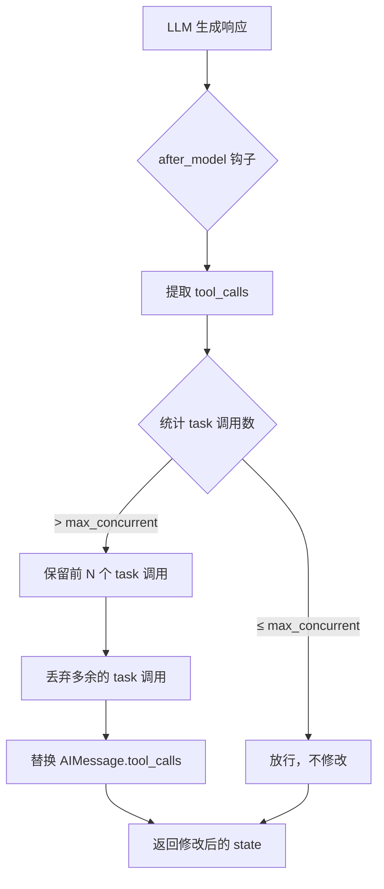
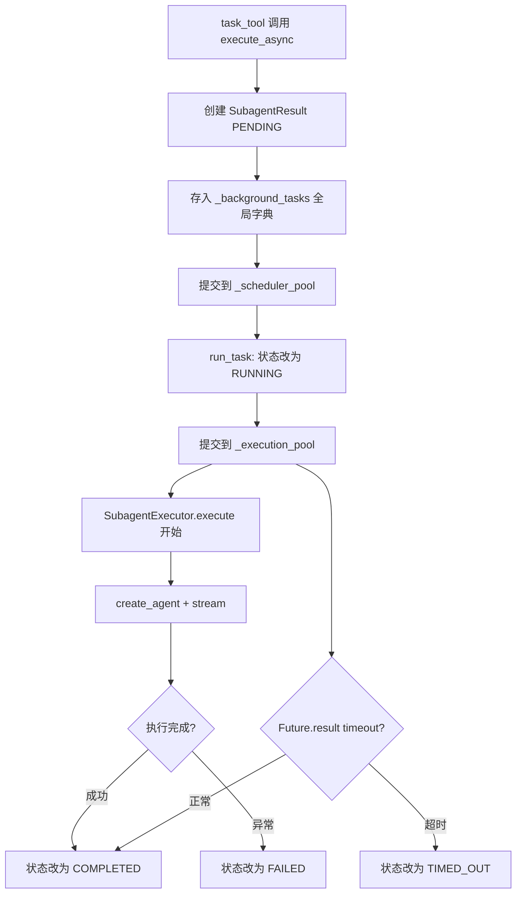

# PD-02.02 DeerFlow — Lead Agent + SubagentExecutor 双线程池编排

> 文档编号：PD-02.02
> 来源：DeerFlow 2.0 `backend/src/subagents/executor.py`
> GitHub：https://github.com/bytedance/deer-flow
> 问题域：PD-02 多 Agent 编排 Multi-Agent Orchestration
> 状态：可复用方案

---

## 第 1 章 问题与动机

### 1.1 核心问题

当一个 LLM Agent 需要同时处理多个独立子任务（如并行搜索 3 个不同主题）时，面临三个工程难题：

1. **并发控制**：LLM 可能在单次响应中生成任意数量的工具调用，若不限制会耗尽线程池或 API 配额
2. **超时保护**：子 Agent 可能陷入无限循环或等待外部 API，需要硬性时间截断
3. **递归防护**：子 Agent 如果能再次调用 `task` 工具，会导致无限嵌套

DeerFlow 1.0 使用 LangGraph StateGraph DAG 编排（coordinator → researcher×N → reporter），但 2.0 版本引入了更灵活的 Lead Agent + SubagentExecutor 架构，将编排决策权交给 LLM 自身，同时用中间件和双线程池做硬性约束。

### 1.2 DeerFlow 的解法概述

1. **Lead Agent 作为编排器**：Lead Agent 通过 `task` 工具调用委派子任务，LLM 自主决定分解策略（`backend/src/agents/lead_agent/prompt.py:6-146`）
2. **双线程池异步执行**：scheduler 池（3 workers）负责调度，execution 池（3 workers）负责实际运行，超时由 `Future.result(timeout=)` 实现（`backend/src/subagents/executor.py:69-74`）
3. **SubagentLimitMiddleware 硬截断**：中间件在 `after_model` 钩子中截断超限的 `task` 工具调用，比 prompt 约束更可靠（`backend/src/agents/middlewares/subagent_limit_middleware.py:40-67`）
4. **工具黑名单递归防护**：子 Agent 的 `disallowed_tools` 包含 `["task", "ask_clarification", "present_files"]`，从工具层面阻止嵌套（`backend/src/subagents/builtins/general_purpose.py:44`）
5. **5 态状态机**：PENDING → RUNNING → COMPLETED/FAILED/TIMED_OUT，通过线程锁保证状态一致性（`backend/src/subagents/executor.py:25-32`）

### 1.3 设计思想

| 设计原则 | 具体实现 | 理由 | 替代方案 |
|----------|----------|------|----------|
| LLM 自主编排 | Lead Agent prompt 中注入 decompose-delegate-synthesize 模式 | 比静态 DAG 更灵活，能适应任意任务结构 | LangGraph 静态 DAG（DeerFlow 1.0） |
| 双层防护 | Prompt 软约束 + Middleware 硬截断 | LLM 不总是遵守 prompt 指令，中间件是最后防线 | 仅靠 prompt 约束（不可靠） |
| 双线程池分离 | scheduler 池管调度，execution 池管执行 | 调度逻辑不阻塞执行，超时可独立控制 | 单线程池（超时难实现） |
| 工具级递归防护 | disallowed_tools 移除 task 工具 | 比 prompt 禁止更可靠，子 Agent 根本看不到 task 工具 | 递归深度计数器 |
| 上下文继承 | 子 Agent 继承 sandbox_state、thread_data、trace_id | 共享文件系统和追踪链路，无需重新初始化 | 完全隔离（需要文件拷贝） |

---

## 第 2 章 源码实现分析

### 2.1 架构概览

DeerFlow 2.0 的子 Agent 编排采用 Lead Agent → task tool → SubagentExecutor → 双线程池 的四层架构：

```
┌─────────────────────────────────────────────────────────┐
│                    Lead Agent                            │
│  (LLM + system prompt + SubagentLimitMiddleware)        │
│                                                          │
│  ┌──────────┐  ┌──────────┐  ┌──────────┐              │
│  │ task()   │  │ task()   │  │ task()   │  ≤3 per turn  │
│  └────┬─────┘  └────┬─────┘  └────┬─────┘              │
└───────┼──────────────┼──────────────┼────────────────────┘
        │              │              │
        ▼              ▼              ▼
┌─────────────────────────────────────────────────────────┐
│              task_tool (backend polling)                  │
│  execute_async() → poll every 5s → return result         │
└───────┬──────────────┬──────────────┬────────────────────┘
        │              │              │
        ▼              ▼              ▼
┌─────────────────────────────────────────────────────────┐
│           _scheduler_pool (3 workers)                    │
│  run_task() → submit to execution pool → wait timeout    │
└───────┬──────────────┬──────────────┬────────────────────┘
        │              │              │
        ▼              ▼              ▼
┌─────────────────────────────────────────────────────────┐
│           _execution_pool (3 workers)                    │
│  SubagentExecutor.execute() → create_agent → stream      │
│  ┌──────────┐  ┌──────────┐  ┌──────────┐              │
│  │ general  │  │  bash    │  │ general  │              │
│  │ purpose  │  │  agent   │  │ purpose  │              │
│  └──────────┘  └──────────┘  └──────────┘              │
└─────────────────────────────────────────────────────────┘
```

### 2.2 核心实现

#### 2.2.1 SubagentLimitMiddleware — 硬性并发截断



对应源码 `backend/src/agents/middlewares/subagent_limit_middleware.py:24-75`：

```python
class SubagentLimitMiddleware(AgentMiddleware[AgentState]):
    """Truncates excess 'task' tool calls from a single model response.

    When an LLM generates more than max_concurrent parallel task tool calls
    in one response, this middleware keeps only the first max_concurrent and
    discards the rest.
    """

    def __init__(self, max_concurrent: int = MAX_CONCURRENT_SUBAGENTS):
        super().__init__()
        self.max_concurrent = _clamp_subagent_limit(max_concurrent)

    def _truncate_task_calls(self, state: AgentState) -> dict | None:
        messages = state.get("messages", [])
        if not messages:
            return None
        last_msg = messages[-1]
        if getattr(last_msg, "type", None) != "ai":
            return None
        tool_calls = getattr(last_msg, "tool_calls", None)
        if not tool_calls:
            return None
        # Count task tool calls
        task_indices = [i for i, tc in enumerate(tool_calls) if tc.get("name") == "task"]
        if len(task_indices) <= self.max_concurrent:
            return None
        # Build set of indices to drop (excess task calls beyond the limit)
        indices_to_drop = set(task_indices[self.max_concurrent:])
        truncated_tool_calls = [tc for i, tc in enumerate(tool_calls) if i not in indices_to_drop]
        updated_msg = last_msg.model_copy(update={"tool_calls": truncated_tool_calls})
        return {"messages": [updated_msg]}

    @override
    def after_model(self, state: AgentState, runtime: Runtime) -> dict | None:
        return self._truncate_task_calls(state)
```

关键设计点：
- `_clamp_subagent_limit` 将并发限制钳位到 `[2, 4]` 范围（`subagent_limit_middleware.py:19-21`）
- 只截断 `name == "task"` 的工具调用，其他工具不受影响
- 使用 `model_copy(update=...)` 替换消息，保持消息 ID 不变

#### 2.2.2 双线程池异步执行引擎



对应源码 `backend/src/subagents/executor.py:65-74, 325-387`：

```python
# 全局双线程池定义
_background_tasks: dict[str, SubagentResult] = {}
_background_tasks_lock = threading.Lock()

# 调度池：负责提交任务和超时管理
_scheduler_pool = ThreadPoolExecutor(max_workers=3, thread_name_prefix="subagent-scheduler-")
# 执行池：负责实际 Agent 运行
_execution_pool = ThreadPoolExecutor(max_workers=3, thread_name_prefix="subagent-exec-")

def execute_async(self, task: str, task_id: str | None = None) -> str:
    task_id = task_id or str(uuid.uuid4())[:8]
    result = SubagentResult(
        task_id=task_id, trace_id=self.trace_id, status=SubagentStatus.PENDING,
    )
    with _background_tasks_lock:
        _background_tasks[task_id] = result

    def run_task():
        with _background_tasks_lock:
            _background_tasks[task_id].status = SubagentStatus.RUNNING
            _background_tasks[task_id].started_at = datetime.now()
            result_holder = _background_tasks[task_id]
        try:
            execution_future: Future = _execution_pool.submit(self.execute, task, result_holder)
            try:
                exec_result = execution_future.result(timeout=self.config.timeout_seconds)
                # ... 更新结果 ...
            except FuturesTimeoutError:
                _background_tasks[task_id].status = SubagentStatus.TIMED_OUT
                execution_future.cancel()
        except Exception as e:
            _background_tasks[task_id].status = SubagentStatus.FAILED

    _scheduler_pool.submit(run_task)
    return task_id
```

关键设计点：
- **双池分离**：scheduler 池的 `run_task` 函数负责提交到 execution 池并等待超时，两层解耦
- **超时实现**：通过 `Future.result(timeout=config.timeout_seconds)` 实现，默认 900 秒（15 分钟）
- **线程安全**：所有对 `_background_tasks` 的读写都通过 `_background_tasks_lock` 保护
- **task_id 复用**：`task_tool` 将 `tool_call_id` 作为 `task_id` 传入，实现端到端追踪

#### 2.2.3 task_tool — 后端轮询桥接

`task_tool`（`backend/src/tools/builtins/task_tool.py:21-185`）是 Lead Agent 和 SubagentExecutor 之间的桥梁：

```python
@tool("task", parse_docstring=True)
def task_tool(
    runtime: ToolRuntime[ContextT, ThreadState],
    description: str,
    prompt: str,
    subagent_type: Literal["general-purpose", "bash"],
    tool_call_id: Annotated[str, InjectedToolCallId],
    max_turns: int | None = None,
) -> str:
    # 1. 获取子 Agent 配置
    config = get_subagent_config(subagent_type)
    # 2. 获取工具列表（排除 task 工具防止递归）
    tools = get_available_tools(model_name=parent_model, subagent_enabled=False)
    # 3. 创建 executor 并异步启动
    executor = SubagentExecutor(config=config, tools=tools, ...)
    task_id = executor.execute_async(prompt, task_id=tool_call_id)
    # 4. 后端轮询等待完成
    writer = get_stream_writer()
    writer({"type": "task_started", "task_id": task_id, "description": description})
    while True:
        result = get_background_task_result(task_id)
        if result.status in (COMPLETED, FAILED, TIMED_OUT):
            return f"Task {result.status.value}. Result: {result.result}"
        time.sleep(5)  # 每 5 秒轮询
```

关键设计点：
- **后端轮询而非 LLM 轮询**：工具内部 `while True` 循环等待结果，LLM 不需要多次调用检查状态
- **实时流式推送**：通过 `get_stream_writer()` 向前端推送 `task_started`、`task_running`、`task_completed` 事件
- **安全超时**：轮询上限 192 次 × 5 秒 = 16 分钟，作为线程池超时的兜底

### 2.3 实现细节

#### 工具过滤与隔离

子 Agent 的工具集通过双重过滤实现隔离（`executor.py:77-104`）：

1. **allowlist**（`config.tools`）：bash Agent 只允许 `["bash", "ls", "read_file", "write_file", "str_replace"]`
2. **denylist**（`config.disallowed_tools`）：所有子 Agent 默认禁止 `["task"]`，general-purpose 额外禁止 `["ask_clarification", "present_files"]`

```python
def _filter_tools(all_tools, allowed, disallowed) -> list[BaseTool]:
    filtered = all_tools
    if allowed is not None:
        allowed_set = set(allowed)
        filtered = [t for t in filtered if t.name in allowed_set]
    if disallowed is not None:
        disallowed_set = set(disallowed)
        filtered = [t for t in filtered if t.name not in disallowed_set]
    return filtered
```

#### 上下文继承链

子 Agent 继承父 Agent 的三类上下文：
- `sandbox_state`：沙箱文件系统状态，子 Agent 复用父 Agent 的沙箱（不重新获取）
- `thread_data`：线程数据（上传文件路径等）
- `trace_id`：分布式追踪 ID，串联父子 Agent 日志

子 Agent 创建时注入两个轻量中间件（`executor.py:170-176`）：
```python
middlewares = [
    ThreadDataMiddleware(lazy_init=True),   # 计算线程路径
    SandboxMiddleware(lazy_init=True),      # 复用父 Agent 沙箱（不重新获取）
]
```

`lazy_init=True` 表示不重新初始化资源，仅复用父 Agent 传入的状态。

---

## 第 3 章 迁移指南

### 3.1 迁移清单

**阶段 1：核心执行引擎**
- [ ] 实现 `SubagentConfig` 数据类（name, system_prompt, tools, disallowed_tools, max_turns, timeout_seconds）
- [ ] 实现 `SubagentStatus` 枚举（PENDING, RUNNING, COMPLETED, FAILED, TIMED_OUT）
- [ ] 实现 `SubagentResult` 数据类（task_id, trace_id, status, result, error, timestamps）
- [ ] 实现 `SubagentExecutor`（同步 execute + 异步 execute_async）
- [ ] 实现双线程池（scheduler + execution）

**阶段 2：并发控制中间件**
- [ ] 实现 `SubagentLimitMiddleware`（after_model 钩子截断超限 task 调用）
- [ ] 配置并发限制钳位范围（建议 [2, 4]）

**阶段 3：task 工具与注册表**
- [ ] 实现 `task` 工具（后端轮询 + 流式推送）
- [ ] 实现子 Agent 注册表（BUILTIN_SUBAGENTS 字典）
- [ ] 定义 general-purpose 和 bash 两类子 Agent 配置

**阶段 4：Lead Agent 集成**
- [ ] 在 Lead Agent system prompt 中注入 subagent_section（decompose-delegate-synthesize）
- [ ] 在 Lead Agent 中间件链中添加 SubagentLimitMiddleware
- [ ] 配置运行时参数（subagent_enabled, max_concurrent_subagents）

### 3.2 适配代码模板

以下是一个可独立运行的最小化实现，不依赖 DeerFlow 的 LangChain 框架：

```python
"""Minimal SubagentExecutor — 可直接复用的双线程池子 Agent 编排引擎"""

import threading
import uuid
import time
from concurrent.futures import ThreadPoolExecutor, Future, TimeoutError as FuturesTimeoutError
from dataclasses import dataclass, field
from datetime import datetime
from enum import Enum
from typing import Any, Callable


class SubagentStatus(Enum):
    PENDING = "pending"
    RUNNING = "running"
    COMPLETED = "completed"
    FAILED = "failed"
    TIMED_OUT = "timed_out"


@dataclass
class SubagentConfig:
    name: str
    description: str
    system_prompt: str
    tools: list[str] | None = None
    disallowed_tools: list[str] | None = field(default_factory=lambda: ["task"])
    max_turns: int = 50
    timeout_seconds: int = 900


@dataclass
class SubagentResult:
    task_id: str
    trace_id: str
    status: SubagentStatus
    result: str | None = None
    error: str | None = None
    started_at: datetime | None = None
    completed_at: datetime | None = None


# 全局状态
_tasks: dict[str, SubagentResult] = {}
_lock = threading.Lock()
_scheduler_pool = ThreadPoolExecutor(max_workers=3, thread_name_prefix="scheduler-")
_execution_pool = ThreadPoolExecutor(max_workers=3, thread_name_prefix="exec-")
MAX_CONCURRENT = 3


class SubagentExecutor:
    def __init__(
        self,
        config: SubagentConfig,
        agent_factory: Callable[[SubagentConfig], Callable[[str], str]],
        trace_id: str | None = None,
    ):
        self.config = config
        self.agent_factory = agent_factory
        self.trace_id = trace_id or str(uuid.uuid4())[:8]

    def execute(self, task: str) -> SubagentResult:
        """同步执行子 Agent 任务"""
        task_id = str(uuid.uuid4())[:8]
        result = SubagentResult(
            task_id=task_id, trace_id=self.trace_id,
            status=SubagentStatus.RUNNING, started_at=datetime.now(),
        )
        try:
            agent = self.agent_factory(self.config)
            output = agent(task)
            result.result = output
            result.status = SubagentStatus.COMPLETED
        except Exception as e:
            result.error = str(e)
            result.status = SubagentStatus.FAILED
        result.completed_at = datetime.now()
        return result

    def execute_async(self, task: str, task_id: str | None = None) -> str:
        """异步执行，返回 task_id 用于后续查询"""
        task_id = task_id or str(uuid.uuid4())[:8]
        result = SubagentResult(
            task_id=task_id, trace_id=self.trace_id, status=SubagentStatus.PENDING,
        )
        with _lock:
            _tasks[task_id] = result

        def run_task():
            with _lock:
                _tasks[task_id].status = SubagentStatus.RUNNING
                _tasks[task_id].started_at = datetime.now()
            try:
                future: Future = _execution_pool.submit(self.execute, task)
                exec_result = future.result(timeout=self.config.timeout_seconds)
                with _lock:
                    _tasks[task_id].status = exec_result.status
                    _tasks[task_id].result = exec_result.result
                    _tasks[task_id].error = exec_result.error
                    _tasks[task_id].completed_at = datetime.now()
            except FuturesTimeoutError:
                with _lock:
                    _tasks[task_id].status = SubagentStatus.TIMED_OUT
                    _tasks[task_id].error = f"Timed out after {self.config.timeout_seconds}s"
                    _tasks[task_id].completed_at = datetime.now()
            except Exception as e:
                with _lock:
                    _tasks[task_id].status = SubagentStatus.FAILED
                    _tasks[task_id].error = str(e)
                    _tasks[task_id].completed_at = datetime.now()

        _scheduler_pool.submit(run_task)
        return task_id


def get_task_result(task_id: str) -> SubagentResult | None:
    with _lock:
        return _tasks.get(task_id)


def truncate_task_calls(tool_calls: list[dict], max_concurrent: int = MAX_CONCURRENT) -> list[dict]:
    """中间件逻辑：截断超限的 task 工具调用"""
    task_indices = [i for i, tc in enumerate(tool_calls) if tc.get("name") == "task"]
    if len(task_indices) <= max_concurrent:
        return tool_calls
    indices_to_drop = set(task_indices[max_concurrent:])
    return [tc for i, tc in enumerate(tool_calls) if i not in indices_to_drop]
```

### 3.3 适用场景

| 场景 | 适用度 | 说明 |
|------|--------|------|
| 多主题并行搜索 | ⭐⭐⭐ | 最典型场景，3 个子 Agent 分别搜索不同主题 |
| 代码库多文件并行分析 | ⭐⭐⭐ | 每个子 Agent 分析不同模块 |
| 多步骤顺序任务 | ⭐⭐ | 可用但不如直接执行，子 Agent 开销较大 |
| 单一简单任务 | ⭐ | 不适合，直接用工具更高效 |
| 需要用户交互的任务 | ⭐ | 子 Agent 无法调用 ask_clarification |
| 超过 4 个并行任务 | ⭐⭐ | 需要多批次执行，增加延迟 |

---

## 第 4 章 测试用例

```python
"""基于 DeerFlow SubagentExecutor 真实接口的测试用例"""

import time
import threading
import pytest
from unittest.mock import MagicMock
from concurrent.futures import ThreadPoolExecutor


class SubagentStatus:
    PENDING = "pending"
    RUNNING = "running"
    COMPLETED = "completed"
    FAILED = "failed"
    TIMED_OUT = "timed_out"


class TestSubagentExecutor:
    """测试双线程池执行引擎"""

    def test_sync_execute_success(self):
        """正常路径：同步执行返回 COMPLETED"""
        from your_project.subagents.executor import SubagentExecutor, SubagentConfig
        config = SubagentConfig(name="test", description="test", system_prompt="test")
        executor = SubagentExecutor(config=config, agent_factory=lambda c: lambda t: f"done: {t}")
        result = executor.execute("hello")
        assert result.status.value == "completed"
        assert "done: hello" in result.result

    def test_async_execute_with_timeout(self):
        """超时路径：子 Agent 执行超时返回 TIMED_OUT"""
        from your_project.subagents.executor import SubagentExecutor, SubagentConfig, get_task_result
        config = SubagentConfig(name="slow", description="slow", system_prompt="", timeout_seconds=1)

        def slow_agent(config):
            def run(task):
                time.sleep(10)
                return "never"
            return run

        executor = SubagentExecutor(config=config, agent_factory=slow_agent)
        task_id = executor.execute_async("slow task")
        time.sleep(3)
        result = get_task_result(task_id)
        assert result is not None
        assert result.status.value == "timed_out"

    def test_async_execute_failure(self):
        """异常路径：子 Agent 抛出异常返回 FAILED"""
        from your_project.subagents.executor import SubagentExecutor, SubagentConfig, get_task_result
        config = SubagentConfig(name="fail", description="fail", system_prompt="")

        def failing_agent(config):
            def run(task):
                raise RuntimeError("boom")
            return run

        executor = SubagentExecutor(config=config, agent_factory=failing_agent)
        task_id = executor.execute_async("fail task")
        time.sleep(2)
        result = get_task_result(task_id)
        assert result is not None
        assert result.status.value == "failed"
        assert "boom" in result.error


class TestSubagentLimitMiddleware:
    """测试并发截断中间件"""

    def test_within_limit_no_truncation(self):
        """不超限时不截断"""
        from your_project.subagents.executor import truncate_task_calls
        calls = [
            {"name": "task", "args": {"prompt": "a"}},
            {"name": "task", "args": {"prompt": "b"}},
            {"name": "web_search", "args": {"q": "c"}},
        ]
        result = truncate_task_calls(calls, max_concurrent=3)
        assert len(result) == 3

    def test_exceeds_limit_truncates_excess(self):
        """超限时截断多余的 task 调用，保留非 task 调用"""
        from your_project.subagents.executor import truncate_task_calls
        calls = [
            {"name": "task", "args": {"prompt": "a"}},
            {"name": "web_search", "args": {"q": "x"}},
            {"name": "task", "args": {"prompt": "b"}},
            {"name": "task", "args": {"prompt": "c"}},
            {"name": "task", "args": {"prompt": "d"}},
        ]
        result = truncate_task_calls(calls, max_concurrent=2)
        task_calls = [c for c in result if c["name"] == "task"]
        assert len(task_calls) == 2
        assert task_calls[0]["args"]["prompt"] == "a"
        assert task_calls[1]["args"]["prompt"] == "b"
        # web_search 不受影响
        assert any(c["name"] == "web_search" for c in result)

    def test_clamp_range(self):
        """并发限制钳位到 [2, 4]"""
        assert max(2, min(4, 1)) == 2
        assert max(2, min(4, 10)) == 4
        assert max(2, min(4, 3)) == 3


class TestToolFiltering:
    """测试工具过滤逻辑"""

    def test_allowlist_filtering(self):
        """allowlist 模式只保留指定工具"""
        tools = [MagicMock(name=n) for n in ["bash", "read_file", "task", "web_search"]]
        for t, n in zip(tools, ["bash", "read_file", "task", "web_search"]):
            t.name = n
        allowed = ["bash", "read_file"]
        filtered = [t for t in tools if t.name in set(allowed)]
        assert len(filtered) == 2
        assert all(t.name in allowed for t in filtered)

    def test_denylist_filtering(self):
        """denylist 模式移除指定工具"""
        tools = [MagicMock(name=n) for n in ["bash", "read_file", "task", "web_search"]]
        for t, n in zip(tools, ["bash", "read_file", "task", "web_search"]):
            t.name = n
        disallowed = ["task", "ask_clarification"]
        filtered = [t for t in tools if t.name not in set(disallowed)]
        assert len(filtered) == 3
        assert not any(t.name == "task" for t in filtered)
```
