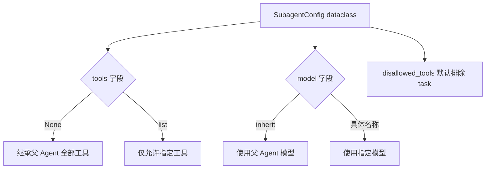
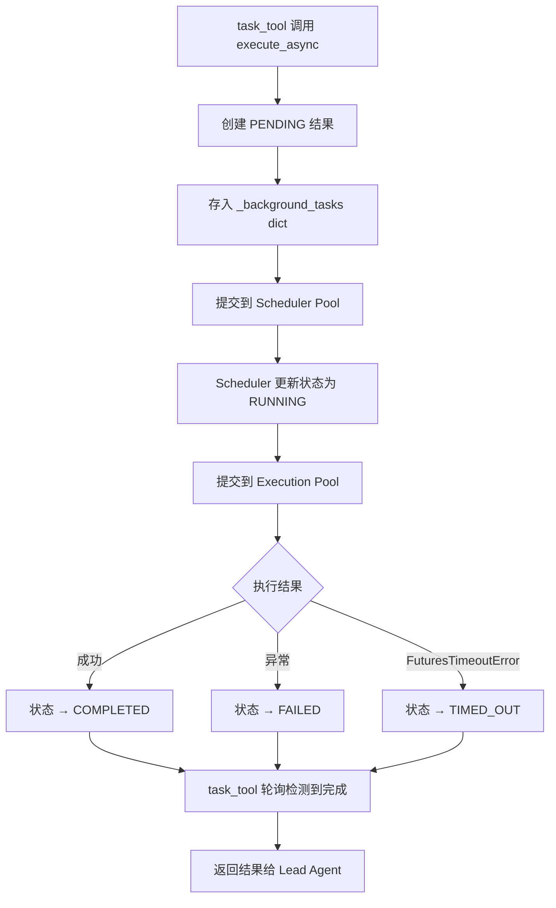
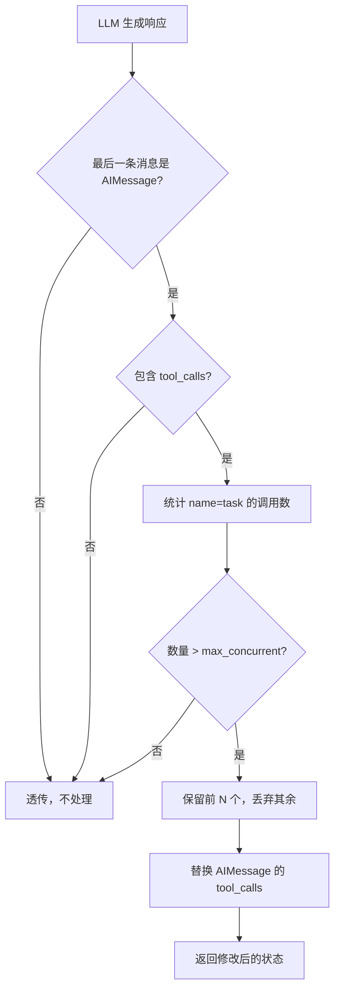
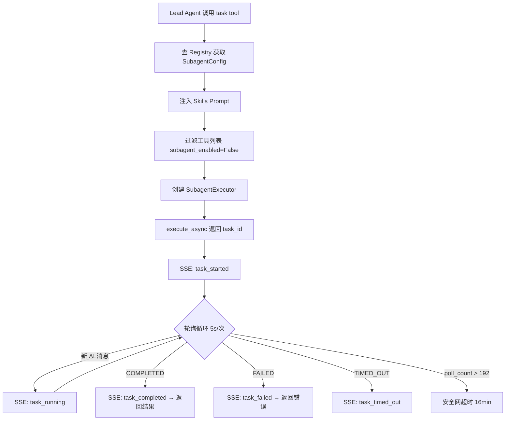

# PD-02.20 DeerFlow 2.0 — Lead Agent + SubAgent 双线程池并行编排

> 文档编号：PD-02.20
> 来源：DeerFlow 2.0 `backend/src/subagents/executor.py`, `backend/src/tools/builtins/task_tool.py`
> GitHub：https://github.com/bytedance/deer-flow.git
> 问题域：PD-02 多 Agent 编排 Multi-Agent Orchestration
> 状态：可复用方案

---

## 第 1 章 问题与动机

### 1.1 核心问题

当 LLM Agent 面对复杂任务时，单 Agent 串行执行存在两个根本瓶颈：

1. **上下文污染**：多步骤任务的中间结果（如 verbose 命令输出）会迅速填满上下文窗口，导致后续推理质量下降
2. **延迟累积**：串行执行 N 个独立子任务的总延迟 = ΣT_i，而并行执行可降至 max(T_i)

DeerFlow 2.0 的核心洞察是：**编排不应该由 LLM 轮询驱动，而应由后端基础设施管理**。LLM 只负责"分解任务 + 发起调用"，后端负责"并行执行 + 超时保护 + 结果回传"。

### 1.2 DeerFlow 2.0 的解法概述

DeerFlow 2.0 采用 Lead Agent + SubAgent 架构，核心设计有 5 个要点：

1. **单一入口 `task` 工具**：Lead Agent 通过调用 `task` 工具委托子任务，工具内部封装了异步执行、轮询、超时的全部复杂性（`backend/src/tools/builtins/task_tool.py:21`）
2. **双线程池分离调度与执行**：Scheduler Pool（3 workers）管理任务生命周期，Execution Pool（3 workers）运行实际 Agent，两层解耦避免死锁（`backend/src/subagents/executor.py:70-74`）
3. **SubagentLimitMiddleware 硬截断**：在 LLM 输出后、工具执行前，中间件检查 `task` 调用数量，超过上限的直接丢弃，比 prompt 约束更可靠（`backend/src/agents/middlewares/subagent_limit_middleware.py:54-59`）
4. **递归防护**：SubAgent 的工具列表中默认排除 `task` 工具（`backend/src/subagents/config.py:25`），从根本上阻止子 Agent 再 spawn 子 Agent
5. **上下文继承而非复制**：SubAgent 通过 `lazy_init=True` 的中间件复用父 Agent 的 sandbox 和 thread_data，避免重复初始化（`backend/src/subagents/executor.py:174-175`）

### 1.3 设计思想

| 设计原则 | 具体实现 | 理由 | 替代方案 |
|----------|----------|------|----------|
| 后端轮询替代 LLM 轮询 | task_tool 内部 `time.sleep(5)` 循环检查结果 | LLM 轮询浪费 token 且不可靠 | WebSocket 推送（更复杂） |
| 中间件硬截断 > Prompt 软约束 | SubagentLimitMiddleware 截断多余 tool_calls | LLM 不一定遵守 prompt 中的数量限制 | 仅靠 prompt 约束（不可靠） |
| 工具黑名单递归防护 | `disallowed_tools=["task"]` 默认值 | 比运行时深度检测更简单可靠 | 递归深度计数器 |
| 声明式配置 > 命令式代码 | SubagentConfig dataclass 定义行为 | 新增 SubAgent 类型只需加一个配置文件 | 继承 + 重写（耦合高） |
| 双池隔离 | scheduler_pool + execution_pool 分离 | 调度逻辑不占用执行资源，避免死锁 | 单线程池（可能死锁） |

---

## 第 2 章 源码实现分析

### 2.1 架构概览

DeerFlow 2.0 的编排架构分为三层：Lead Agent（编排层）、Task Tool（桥接层）、SubAgent Executor（执行层）。

```
┌─────────────────────────────────────────────────────────────┐
│                    Lead Agent (编排层)                        │
│  ┌──────────┐  ┌──────────────────┐  ┌───────────────────┐  │
│  │ System   │  │ 11-Stage         │  │ Tool Registry     │  │
│  │ Prompt   │  │ Middleware Chain  │  │ (incl. task tool) │  │
│  └──────────┘  └──────────────────┘  └───────────────────┘  │
│        │              │                       │              │
│        └──────────────┼───────────────────────┘              │
│                       ▼                                      │
│            SubagentLimitMiddleware                            │
│            (截断超限 task 调用)                                │
└───────────────────────┬─────────────────────────────────────┘
                        │ task() tool call
                        ▼
┌─────────────────────────────────────────────────────────────┐
│                   Task Tool (桥接层)                          │
│  1. 查 Registry → SubagentConfig                             │
│  2. 过滤工具（排除 task）                                     │
│  3. 创建 SubagentExecutor                                    │
│  4. execute_async() → 返回 task_id                           │
│  5. 后端轮询 5s/次 → SSE 推送进度                             │
│  6. 返回最终结果                                              │
└───────────────────────┬─────────────────────────────────────┘
                        │
                        ▼
┌─────────────────────────────────────────────────────────────┐
│              SubAgent Executor (执行层)                       │
│  ┌─────────────────┐    ┌─────────────────┐                 │
│  │ Scheduler Pool  │───→│ Execution Pool  │                 │
│  │ (3 workers)     │    │ (3 workers)     │                 │
│  │ 管理生命周期     │    │ 运行实际 Agent   │                 │
│  └─────────────────┘    └─────────────────┘                 │
│           │                      │                           │
│           ▼                      ▼                           │
│  ┌─────────────┐    ┌──────────────────────┐                │
│  │ 超时保护    │    │ SubagentResult       │                │
│  │ 15min+16min │    │ (5态状态机)           │                │
│  └─────────────┘    └──────────────────────┘                │
└─────────────────────────────────────────────────────────────┘
```

### 2.2 核心实现

#### 2.2.1 SubagentConfig — 声明式子代理配置



对应源码 `backend/src/subagents/config.py:6-28`：

```python
@dataclass
class SubagentConfig:
    name: str
    description: str
    system_prompt: str
    tools: list[str] | None = None
    disallowed_tools: list[str] | None = field(default_factory=lambda: ["task"])
    model: str = "inherit"
    max_turns: int = 50
    timeout_seconds: int = 900  # 15 minutes
```

关键设计：`disallowed_tools` 默认包含 `"task"`，这意味着所有子代理默认无法再调用 task 工具，从配置层面阻断递归。

#### 2.2.2 双线程池执行引擎



对应源码 `backend/src/subagents/executor.py:65-74`：

```python
# Global storage for background task results
_background_tasks: dict[str, SubagentResult] = {}
_background_tasks_lock = threading.Lock()

# Thread pool for background task scheduling and orchestration
_scheduler_pool = ThreadPoolExecutor(max_workers=3, thread_name_prefix="subagent-scheduler-")

# Thread pool for actual subagent execution (with timeout support)
_execution_pool = ThreadPoolExecutor(max_workers=3, thread_name_prefix="subagent-exec-")
```

为什么需要两个线程池？Scheduler Pool 负责提交任务到 Execution Pool 并等待超时，如果只有一个池，等待超时的线程会占用 worker 导致新任务无法调度。

#### 2.2.3 SubagentLimitMiddleware — 硬性并发截断



对应源码 `backend/src/agents/middlewares/subagent_limit_middleware.py:40-67`：

```python
def _truncate_task_calls(self, state: AgentState) -> dict | None:
    messages = state.get("messages", [])
    if not messages:
        return None
    last_msg = messages[-1]
    if getattr(last_msg, "type", None) != "ai":
        return None
    tool_calls = getattr(last_msg, "tool_calls", None)
    if not tool_calls:
        return None
    # Count task tool calls
    task_indices = [i for i, tc in enumerate(tool_calls) if tc.get("name") == "task"]
    if len(task_indices) <= self.max_concurrent:
        return None
    # Build set of indices to drop (excess task calls beyond the limit)
    indices_to_drop = set(task_indices[self.max_concurrent:])
    truncated_tool_calls = [tc for i, tc in enumerate(tool_calls) if i not in indices_to_drop]
    dropped_count = len(indices_to_drop)
    logger.warning(f"Truncated {dropped_count} excess task tool call(s)")
    updated_msg = last_msg.model_copy(update={"tool_calls": truncated_tool_calls})
    return {"messages": [updated_msg]}
```

注意：中间件只截断 `name == "task"` 的调用，其他工具调用不受影响。并发上限通过 `_clamp_subagent_limit` 硬性限制在 [2, 4] 范围内。

#### 2.2.4 Task Tool — 后端轮询桥接



对应源码 `backend/src/tools/builtins/task_tool.py:97-184`：

```python
# Subagents should not have subagent tools enabled (prevent recursive nesting)
tools = get_available_tools(model_name=parent_model, subagent_enabled=False)

# Start background execution (always async to prevent blocking)
task_id = executor.execute_async(prompt, task_id=tool_call_id)

writer = get_stream_writer()
writer({"type": "task_started", "task_id": task_id, "description": description})

while True:
    result = get_background_task_result(task_id)
    # Check for new AI messages and send task_running events
    current_message_count = len(result.ai_messages)
    if current_message_count > last_message_count:
        for i in range(last_message_count, current_message_count):
            writer({"type": "task_running", "task_id": task_id, "message": result.ai_messages[i]})
        last_message_count = current_message_count
    # Check terminal states
    if result.status == SubagentStatus.COMPLETED:
        writer({"type": "task_completed", "task_id": task_id, "result": result.result})
        return f"Task Succeeded. Result: {result.result}"
    time.sleep(5)  # Poll every 5 seconds
    poll_count += 1
    if poll_count > 192:  # 192 * 5s = 16 minutes safety net
        return f"Task polling timed out after 16 minutes."
```

关键设计：`tool_call_id` 直接作为 `task_id`，实现了 LLM 工具调用 ID 与后台任务 ID 的统一，简化了追踪链路。

### 2.3 实现细节

#### 5 态状态机

SubagentResult 的状态流转：

```
PENDING → RUNNING → COMPLETED
                  → FAILED
                  → TIMED_OUT
```

- `PENDING`：已创建，等待 Scheduler Pool 调度
- `RUNNING`：已提交到 Execution Pool，Agent 正在执行
- `COMPLETED`：Agent 正常完成，result 字段有值
- `FAILED`：Agent 执行异常，error 字段有值
- `TIMED_OUT`：超过 `timeout_seconds`（默认 900s），由 `FuturesTimeoutError` 触发

#### 双层超时保护

1. **Execution Pool 超时**（`executor.py:364`）：`execution_future.result(timeout=config.timeout_seconds)` — 默认 15 分钟
2. **Polling 安全网**（`task_tool.py:181`）：`poll_count > 192`（16 分钟）— 兜底防止线程池超时失效

#### 工具过滤机制

`_filter_tools` 函数（`executor.py:77-104`）实现了双重过滤：
- **Allowlist**（`tools` 字段）：如果指定，只保留列表中的工具（如 bash agent 只有 5 个工具）
- **Denylist**（`disallowed_tools` 字段）：始终排除的工具（如 `task`、`ask_clarification`）

#### 上下文继承

SubAgent 通过 `lazy_init=True` 的中间件复用父 Agent 的状态（`executor.py:173-176`）：

```python
middlewares = [
    ThreadDataMiddleware(lazy_init=True),   # 复用父 Agent 的路径计算
    SandboxMiddleware(lazy_init=True),      # 复用父 Agent 的沙箱（不重新获取）
]
```

这意味着 SubAgent 可以读写父 Agent 的文件系统，但不会触发沙箱的重新初始化。

---

## 第 3 章 迁移指南

### 3.1 迁移清单

**阶段 1：基础设施（必须）**

- [ ] 定义 `SubagentConfig` dataclass（配置驱动）
- [ ] 实现 `SubagentExecutor`（双线程池 + 5 态状态机）
- [ ] 实现 `task` 工具（后端轮询 + SSE 推送）
- [ ] 实现 `SubagentLimitMiddleware`（硬截断）

**阶段 2：子代理类型（按需）**

- [ ] 定义 general-purpose 子代理配置
- [ ] 定义 bash 子代理配置
- [ ] 扩展 Registry 支持自定义子代理

**阶段 3：增强（可选）**

- [ ] 添加 trace_id 分布式追踪
- [ ] 添加 SSE 实时进度推送
- [ ] 添加多批次编排 prompt 指导

### 3.2 适配代码模板

以下是一个最小可运行的双线程池子代理执行器：

```python
import threading
import uuid
from concurrent.futures import ThreadPoolExecutor, Future, TimeoutError as FuturesTimeoutError
from dataclasses import dataclass, field
from enum import Enum
from typing import Any, Callable

class TaskStatus(Enum):
    PENDING = "pending"
    RUNNING = "running"
    COMPLETED = "completed"
    FAILED = "failed"
    TIMED_OUT = "timed_out"

@dataclass
class TaskResult:
    task_id: str
    status: TaskStatus
    result: Any = None
    error: str | None = None

@dataclass
class SubagentConfig:
    name: str
    system_prompt: str
    allowed_tools: list[str] | None = None
    disallowed_tools: list[str] = field(default_factory=lambda: ["delegate_task"])
    timeout_seconds: int = 900
    max_concurrent: int = 3

class SubagentOrchestrator:
    """最小化双线程池子代理编排器。"""

    def __init__(self, max_schedulers: int = 3, max_executors: int = 3):
        self._scheduler_pool = ThreadPoolExecutor(max_workers=max_schedulers)
        self._execution_pool = ThreadPoolExecutor(max_workers=max_executors)
        self._tasks: dict[str, TaskResult] = {}
        self._lock = threading.Lock()

    def submit(self, task_fn: Callable, timeout: int = 900) -> str:
        """提交任务，返回 task_id。"""
        task_id = str(uuid.uuid4())[:8]
        result = TaskResult(task_id=task_id, status=TaskStatus.PENDING)
        with self._lock:
            self._tasks[task_id] = result

        def _schedule():
            with self._lock:
                self._tasks[task_id].status = TaskStatus.RUNNING
            try:
                future: Future = self._execution_pool.submit(task_fn)
                value = future.result(timeout=timeout)
                with self._lock:
                    self._tasks[task_id].status = TaskStatus.COMPLETED
                    self._tasks[task_id].result = value
            except FuturesTimeoutError:
                with self._lock:
                    self._tasks[task_id].status = TaskStatus.TIMED_OUT
                    self._tasks[task_id].error = f"Timed out after {timeout}s"
            except Exception as e:
                with self._lock:
                    self._tasks[task_id].status = TaskStatus.FAILED
                    self._tasks[task_id].error = str(e)

        self._scheduler_pool.submit(_schedule)
        return task_id

    def get_result(self, task_id: str) -> TaskResult | None:
        with self._lock:
            return self._tasks.get(task_id)
```

### 3.3 适用场景

| 场景 | 适用度 | 说明 |
|------|--------|------|
| 多源信息并行采集 | ⭐⭐⭐ | 典型场景：同时搜索多个数据源 |
| 代码库多文件并行分析 | ⭐⭐⭐ | 每个子代理分析不同模块 |
| 串行依赖链任务 | ⭐ | 不适合，应直接由 Lead Agent 顺序执行 |
| 需要用户交互的任务 | ⭐ | SubAgent 无法调用 ask_clarification |
| 简单单步操作 | ⭐ | 过度设计，直接用工具即可 |
| 多批次大规模并行 | ⭐⭐⭐ | Prompt 引导 Lead Agent 分批发起 |

---

## 第 4 章 测试用例

```python
import threading
import time
import pytest
from unittest.mock import MagicMock, patch
from concurrent.futures import ThreadPoolExecutor

# --- SubagentConfig 测试 ---

class TestSubagentConfig:
    def test_default_disallowed_tools(self):
        """默认 disallowed_tools 包含 task，防止递归。"""
        from src.subagents.config import SubagentConfig
        config = SubagentConfig(name="test", description="", system_prompt="")
        assert "task" in config.disallowed_tools

    def test_model_inherit(self):
        """model='inherit' 时使用父 Agent 模型。"""
        from src.subagents.executor import _get_model_name
        from src.subagents.config import SubagentConfig
        config = SubagentConfig(name="test", description="", system_prompt="", model="inherit")
        assert _get_model_name(config, "gpt-4") == "gpt-4"

    def test_model_override(self):
        """指定 model 时覆盖父 Agent 模型。"""
        from src.subagents.executor import _get_model_name
        from src.subagents.config import SubagentConfig
        config = SubagentConfig(name="test", description="", system_prompt="", model="gpt-3.5-turbo")
        assert _get_model_name(config, "gpt-4") == "gpt-3.5-turbo"


# --- SubagentLimitMiddleware 测试 ---

class TestSubagentLimitMiddleware:
    def test_no_truncation_within_limit(self):
        """task 调用数 <= max_concurrent 时不截断。"""
        from src.agents.middlewares.subagent_limit_middleware import SubagentLimitMiddleware
        middleware = SubagentLimitMiddleware(max_concurrent=3)
        msg = MagicMock()
        msg.type = "ai"
        msg.tool_calls = [
            {"name": "task", "args": {}},
            {"name": "task", "args": {}},
            {"name": "read_file", "args": {}},
        ]
        state = {"messages": [msg]}
        result = middleware._truncate_task_calls(state)
        assert result is None  # 不修改

    def test_truncation_over_limit(self):
        """task 调用数 > max_concurrent 时截断多余的。"""
        from src.agents.middlewares.subagent_limit_middleware import SubagentLimitMiddleware
        middleware = SubagentLimitMiddleware(max_concurrent=2)
        msg = MagicMock()
        msg.type = "ai"
        msg.tool_calls = [
            {"name": "task", "args": {"id": 1}},
            {"name": "read_file", "args": {}},
            {"name": "task", "args": {"id": 2}},
            {"name": "task", "args": {"id": 3}},  # 应被截断
        ]
        msg.model_copy = MagicMock(return_value=msg)
        state = {"messages": [msg]}
        result = middleware._truncate_task_calls(state)
        assert result is not None
        # 验证 model_copy 被调用，且截断后只有 3 个 tool_calls（2 task + 1 read_file）
        call_args = msg.model_copy.call_args
        truncated = call_args[1]["update"]["tool_calls"]
        task_count = sum(1 for tc in truncated if tc["name"] == "task")
        assert task_count == 2

    def test_clamp_limits(self):
        """并发上限被钳制在 [2, 4] 范围。"""
        from src.agents.middlewares.subagent_limit_middleware import _clamp_subagent_limit
        assert _clamp_subagent_limit(1) == 2
        assert _clamp_subagent_limit(5) == 4
        assert _clamp_subagent_limit(3) == 3


# --- 工具过滤测试 ---

class TestToolFiltering:
    def test_allowlist_filtering(self):
        """allowlist 模式只保留指定工具。"""
        from src.subagents.executor import _filter_tools
        tools = [MagicMock(name=n) for n in ["bash", "read_file", "task"]]
        for t, n in zip(tools, ["bash", "read_file", "task"]):
            t.name = n
        result = _filter_tools(tools, allowed=["bash", "read_file"], disallowed=None)
        assert len(result) == 2
        assert all(t.name != "task" for t in result)

    def test_denylist_filtering(self):
        """denylist 模式排除指定工具。"""
        from src.subagents.executor import _filter_tools
        tools = [MagicMock(name=n) for n in ["bash", "read_file", "task"]]
        for t, n in zip(tools, ["bash", "read_file", "task"]):
            t.name = n
        result = _filter_tools(tools, allowed=None, disallowed=["task"])
        assert len(result) == 2
        assert all(t.name != "task" for t in result)
```

---

## 第 5 章 跨域关联

| 关联域 | 关系类型 | 说明 |
|--------|----------|------|
| PD-01 上下文管理 | 协同 | SubAgent 隔离上下文是解决上下文窗口膨胀的手段之一；SummarizationMiddleware 在中间件链中位于 SubagentLimitMiddleware 之前 |
| PD-03 容错与重试 | 依赖 | 双层超时保护（Execution Pool 15min + Polling 16min）是容错设计的一部分；SubagentResult 的 FAILED/TIMED_OUT 状态需要上层处理 |
| PD-04 工具系统 | 依赖 | task 工具本身是工具系统的一部分；工具过滤（allowlist/denylist）决定了子代理的能力边界 |
| PD-05 沙箱隔离 | 协同 | SubAgent 通过 `lazy_init=True` 的 SandboxMiddleware 复用父 Agent 沙箱，共享文件系统但隔离执行上下文 |
| PD-10 中间件管道 | 依赖 | SubagentLimitMiddleware 是 11 级中间件链的一环；子代理自身也有精简的 2 级中间件链 |
| PD-11 可观测性 | 协同 | trace_id 从 Lead Agent 传播到 SubAgent，支持分布式追踪；SSE 事件流（task_started/running/completed）提供实时可观测性 |

---

## 第 6 章 来源文件索引

| 文件 | 行范围 | 关键实现 |
|------|--------|----------|
| `backend/src/subagents/config.py` | L6-L28 | SubagentConfig dataclass 定义 |
| `backend/src/subagents/executor.py` | L25-L33 | SubagentStatus 5 态枚举 |
| `backend/src/subagents/executor.py` | L36-L63 | SubagentResult dataclass |
| `backend/src/subagents/executor.py` | L65-L74 | 双线程池定义（scheduler + execution） |
| `backend/src/subagents/executor.py` | L77-L104 | _filter_tools 工具过滤 |
| `backend/src/subagents/executor.py` | L122-L323 | SubagentExecutor 类（execute + execute_async） |
| `backend/src/subagents/executor.py` | L390 | MAX_CONCURRENT_SUBAGENTS = 3 |
| `backend/src/subagents/registry.py` | L1-L35 | 子代理注册表（dict 查找） |
| `backend/src/subagents/builtins/general_purpose.py` | L5-L47 | general-purpose 子代理配置 |
| `backend/src/subagents/builtins/bash_agent.py` | L5-L46 | bash 子代理配置 |
| `backend/src/tools/builtins/task_tool.py` | L21-L185 | task 工具（后端轮询 + SSE 推送） |
| `backend/src/agents/middlewares/subagent_limit_middleware.py` | L24-L75 | SubagentLimitMiddleware 硬截断 |
| `backend/src/agents/lead_agent/agent.py` | L186-L265 | Lead Agent 构建 + 中间件链组装 |
| `backend/src/agents/lead_agent/prompt.py` | L6-L146 | 动态子代理 Prompt 注入 |
| `backend/src/agents/thread_state.py` | L48-L55 | ThreadState 共享状态 schema |

---

## 第 7 章 横向对比维度

> **重要：** 本章用于自动填充 Butcher Wiki 的横向对比表。

```json comparison_data
{
  "project": "DeerFlow 2.0",
  "dimensions": {
    "编排模式": "Lead Agent + SubAgent 委托，task 工具单一入口",
    "并行能力": "双线程池（scheduler 3 + execution 3），多批次顺序执行",
    "状态管理": "ThreadState 共享 schema，SubAgent lazy_init 复用父状态",
    "并发限制": "SubagentLimitMiddleware 硬截断 [2,4]，prompt 软约束配合",
    "工具隔离": "allowlist/denylist 双重过滤，SubAgent 默认排除 task 工具",
    "递归防护": "配置层 disallowed_tools 默认排除 task + 工具注册 subagent_enabled=False",
    "结果回传": "SubagentResult 5 态状态机 + 后端 5s 轮询 + SSE 实时推送",
    "异步解耦": "execute_async 立即返回 task_id，后端轮询替代 LLM 轮询",
    "模块自治": "声明式 SubagentConfig dataclass，新增类型只需加配置文件",
    "多模型兼容": "model='inherit' 继承父模型，或指定独立模型名",
    "懒初始化": "SubAgent 中间件 lazy_init=True 复用父 Agent 沙箱和路径",
    "结构验证": "Registry dict 查找 + _clamp_subagent_limit 范围校验 [2,4]"
  }
}
```

### 域元数据补充

```json domain_metadata
{
  "solution_summary": "DeerFlow 2.0 用 Scheduler+Execution 双线程池实现 SubAgent 并行执行，SubagentLimitMiddleware 硬截断超限调用，后端 5s 轮询替代 LLM 轮询",
  "description": "编排系统的轮询职责应由后端基础设施承担而非 LLM token 消耗",
  "sub_problems": [
    "后端轮询 vs LLM 轮询：谁负责检查子任务完成状态的架构选择",
    "双线程池死锁预防：调度线程等待超时时如何不阻塞新任务提交",
    "tool_call_id 复用：如何将 LLM 工具调用 ID 与后台任务 ID 统一简化追踪"
  ],
  "best_practices": [
    "中间件硬截断比 prompt 软约束更可靠：LLM 不一定遵守数量限制",
    "双线程池分离调度与执行：避免超时等待占用执行资源导致死锁",
    "子代理配置用 dataclass 声明式定义：新增类型只需加文件不改代码"
  ]
}
```
