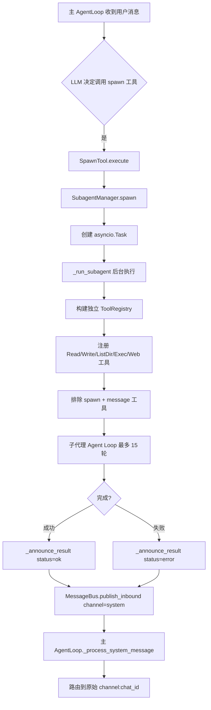
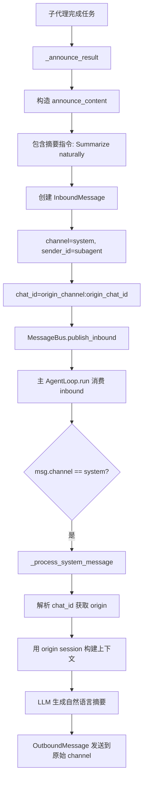

# PD-02.06 FastCode — 子代理派生 + 迭代检索双编排

> 文档编号：PD-02.06
> 来源：FastCode / Nanobot `nanobot/nanobot/agent/subagent.py`, `fastcode/iterative_agent.py`
> GitHub：https://github.com/HKUDS/FastCode.git
> 问题域：PD-02 多 Agent 编排 Multi-Agent Orchestration
> 状态：可复用方案

---

## 第 1 章 问题与动机

### 1.1 核心问题

多 Agent 系统面临两个层次的编排需求：

1. **运行时子代理派生**：主 Agent 在对话过程中需要将耗时任务委托给后台子代理，子代理完成后异步通知主代理，主代理再将结果自然化回复用户。这要求子代理拥有独立工具集、独立上下文、独立迭代上限，且不能反向 spawn 新子代理（递归防护）。

2. **检索专用迭代编排**：代码问答场景中，单轮检索往往无法获得足够上下文。需要一个迭代 Agent 协调多轮搜索，每轮评估置信度、动态调整参数、控制行预算，在"信息充分"和"成本可控"之间找到平衡点。

FastCode 项目包含两个独立但互补的编排系统：Nanobot 的 SubagentManager 和 FastCode 的 IterativeAgent，分别解决上述两个问题。

### 1.2 FastCode 的解法概述

1. **Spawn 模式的子代理派生**：主 AgentLoop 通过 `SpawnTool` 调用 `SubagentManager.spawn()`，创建 `asyncio.Task` 在后台运行子代理。子代理拥有独立 `ToolRegistry`（无 message/spawn 工具），独立 system prompt，独立 15 轮迭代上限（`subagent.py:121`）。

2. **MessageBus 异步结果回传**：子代理完成后通过 `_announce_result()` 将结果注入 MessageBus 的 inbound 队列，channel 设为 `"system"`，主 AgentLoop 的 `_process_system_message()` 接收并路由到原始会话（`loop.py:446-543`）。

3. **置信度驱动的迭代收敛**：IterativeAgent 采用多轮 LLM 评估循环，每轮输出 confidence 分数，结合自适应参数（max_iterations、confidence_threshold、line_budget）和 ROI 分析决定是否继续（`iterative_agent.py:2268-2347`）。

4. **四维停止信号**：confidence 达标、迭代上限、行预算耗尽、连续低 ROI 停滞——四个独立停止条件互为兜底（`iterative_agent.py:420-432`）。

5. **工具隔离与递归防护**：子代理的 ToolRegistry 不包含 `SpawnTool` 和 `MessageTool`，从架构上杜绝子代理 spawn 子代理或直接发消息给用户（`subagent.py:99-111`）。

### 1.3 设计思想

| 设计原则 | 具体实现 | 理由 | 替代方案 |
|----------|----------|------|----------|
| 工具集隔离 | 子代理 ToolRegistry 排除 spawn/message | 防止递归派生和越权通信 | 全局工具 + 权限检查（更复杂） |
| 异步解耦 | MessageBus inbound 队列 + system channel | 子代理不阻塞主循环，结果异步回传 | 直接 await（阻塞主循环） |
| 置信度驱动 | LLM 每轮输出 0-100 confidence 分数 | 让 LLM 自评信息充分度，避免盲目迭代 | 固定轮数（浪费或不足） |
| 自适应参数 | 根据 query_complexity 动态调整阈值 | 简单查询少迭代，复杂查询多预算 | 固定参数（一刀切） |
| 结果自然化 | announce 内容含指令让主 Agent 摘要 | 用户看到自然语言而非技术细节 | 直接转发原始结果（体验差） |

---

## 第 2 章 源码实现分析

### 2.1 架构概览

FastCode 的编排分为两个独立子系统：

```
┌─────────────────────────────────────────────────────────┐
│                    Nanobot 子代理编排                      │
│                                                         │
│  ┌──────────┐  spawn()  ┌────────────────┐              │
│  │AgentLoop │──────────→│SubagentManager │              │
│  │(主循环)   │           │  ._running_tasks│              │
│  └────┬─────┘           └───────┬────────┘              │
│       │                         │ asyncio.Task           │
│       │  ┌──────────────────────▼──────────────────┐    │
│       │  │ _run_subagent()                          │    │
│       │  │  独立 ToolRegistry (无 spawn/message)     │    │
│       │  │  独立 system prompt                       │    │
│       │  │  15 轮迭代上限                            │    │
│       │  └──────────────────────┬──────────────────┘    │
│       │                         │ _announce_result()     │
│       │  ┌──────────────────────▼──────────────────┐    │
│       │  │ MessageBus.publish_inbound()             │    │
│       │  │  channel="system"                        │    │
│       │  │  chat_id="origin_channel:origin_chat_id" │    │
│       │  └──────────────────────┬──────────────────┘    │
│       │                         │                        │
│       ◀─────────────────────────┘                        │
│  _process_system_message() → 路由到原始会话               │
└─────────────────────────────────────────────────────────┘

┌─────────────────────────────────────────────────────────┐
│                FastCode 迭代检索编排                       │
│                                                         │
│  ┌──────────────┐                                       │
│  │IterativeAgent│                                       │
│  └──────┬───────┘                                       │
│         │ retrieve_with_iteration()                      │
│         ▼                                               │
│  Round 1: _round_one() → 评估 + 初始检索                 │
│         │                                               │
│         ▼                                               │
│  Round 2..N: _round_n() → 置信度评估 + 工具调用           │
│         │    ├─ confidence >= threshold → 停止            │
│         │    ├─ no tool_calls → 停止                     │
│         │    ├─ budget exceeded → 停止                   │
│         │    └─ _should_continue_iteration() → ROI 分析  │
│         ▼                                               │
│  输出: final_elements + iteration_metadata               │
└─────────────────────────────────────────────────────────┘
```

### 2.2 核心实现

#### 2.2.1 子代理派生与工具隔离



对应源码 `nanobot/nanobot/agent/subagent.py:88-177`：

```python
async def _run_subagent(
    self,
    task_id: str,
    task: str,
    label: str,
    origin: dict[str, str],
) -> None:
    """Execute the subagent task and announce the result."""
    logger.info(f"Subagent [{task_id}] starting task: {label}")
    
    try:
        # Build subagent tools (no message tool, no spawn tool)
        tools = ToolRegistry()
        allowed_dir = self.workspace if self.restrict_to_workspace else None
        tools.register(ReadFileTool(allowed_dir=allowed_dir))
        tools.register(WriteFileTool(allowed_dir=allowed_dir))
        tools.register(ListDirTool(allowed_dir=allowed_dir))
        tools.register(ExecTool(
            working_dir=str(self.workspace),
            timeout=self.exec_config.timeout,
            restrict_to_workspace=self.restrict_to_workspace,
        ))
        tools.register(WebSearchTool(api_key=self.brave_api_key))
        tools.register(WebFetchTool())
        
        # Build messages with subagent-specific prompt
        system_prompt = self._build_subagent_prompt(task)
        messages: list[dict[str, Any]] = [
            {"role": "system", "content": system_prompt},
            {"role": "user", "content": task},
        ]
        
        # Run agent loop (limited iterations)
        max_iterations = 15
        iteration = 0
        final_result: str | None = None
        
        while iteration < max_iterations:
            iteration += 1
            response = await self.provider.chat(
                messages=messages,
                tools=tools.get_definitions(),
                model=self.model,
            )
            
            if response.has_tool_calls:
                # ... execute tools and append results
                for tool_call in response.tool_calls:
                    result = await tools.execute(tool_call.name, tool_call.arguments)
                    messages.append({
                        "role": "tool",
                        "tool_call_id": tool_call.id,
                        "name": tool_call.name,
                        "content": result,
                    })
            else:
                final_result = response.content
                break
        
        await self._announce_result(task_id, label, task, final_result, origin, "ok")
        
    except Exception as e:
        error_msg = f"Error: {str(e)}"
        await self._announce_result(task_id, label, task, error_msg, origin, "error")
```

#### 2.2.2 MessageBus 异步结果回传



对应源码 `nanobot/nanobot/agent/subagent.py:179-209`：

```python
async def _announce_result(
    self,
    task_id: str,
    label: str,
    task: str,
    result: str,
    origin: dict[str, str],
    status: str,
) -> None:
    """Announce the subagent result to the main agent via the message bus."""
    status_text = "completed successfully" if status == "ok" else "failed"
    
    announce_content = f"""[Subagent '{label}' {status_text}]

Task: {task}

Result:
{result}

Summarize this naturally for the user. Keep it brief (1-2 sentences). 
Do not mention technical details like "subagent" or task IDs."""
    
    # Inject as system message to trigger main agent
    msg = InboundMessage(
        channel="system",
        sender_id="subagent",
        chat_id=f"{origin['channel']}:{origin['chat_id']}",
        content=announce_content,
    )
    
    await self.bus.publish_inbound(msg)
```

### 2.3 实现细节

#### 迭代收敛的四维停止信号

IterativeAgent 的 `_should_continue_iteration()` 实现了四个独立的停止条件，形成多层兜底：

1. **置信度达标**：`confidence >= self.confidence_threshold`（自适应阈值 90-95）
2. **迭代上限**：`current_round >= self.max_iterations`（自适应 2-6 轮）
3. **行预算耗尽**：`total_lines >= self.adaptive_line_budget`（自适应 6000-12000 行）
4. **ROI 停滞检测**：连续两轮 `abs(confidence_gain) < 1.0` 或连续低 ROI

自适应参数根据 `query_complexity`（0-100）动态调整（`iterative_agent.py:109-152`）：
- 简单查询（≤30）：2-3 轮，95% 阈值，60% 行预算
- 中等查询（31-60）：3-4 轮，92% 阈值，80% 行预算
- 复杂查询（61-100）：4-6 轮，90% 阈值，100% 行预算

#### 子代理的 system prompt 设计

`_build_subagent_prompt()` 生成聚焦型 prompt（`subagent.py:211-240`），明确声明：
- 只完成指定任务，不做额外事情
- 不能发消息给用户（无 message 工具）
- 不能 spawn 其他子代理（无 spawn 工具）
- 最终响应会被报告回主代理

这种"能力声明 + 工具裁剪"双重约束确保子代理行为可控。

#### asyncio.Task 生命周期管理

`SubagentManager` 用 `_running_tasks: dict[str, asyncio.Task]` 跟踪所有活跃子代理（`subagent.py:47`），通过 `add_done_callback` 自动清理完成的任务（`subagent.py:83`）。`get_running_count()` 提供运行时监控接口。


---

## 第 3 章 迁移指南

### 3.1 迁移清单

**阶段 1：MessageBus + 子代理基础设施**

- [ ] 实现 `MessageBus`：双向 asyncio.Queue（inbound/outbound）+ channel 订阅分发
- [ ] 定义 `InboundMessage` / `OutboundMessage` 数据类，含 channel、chat_id、content 字段
- [ ] 实现 `ToolRegistry`：动态注册/注销工具，统一 execute 接口
- [ ] 定义 `Tool` 抽象基类：name/description/parameters/execute + JSON Schema 验证

**阶段 2：SubagentManager**

- [ ] 实现 `SubagentManager`：spawn() 创建 asyncio.Task，_run_subagent() 执行子代理循环
- [ ] 子代理 ToolRegistry 排除 spawn 和 message 工具（递归防护）
- [ ] 实现 `_announce_result()`：通过 MessageBus 注入 system channel 消息
- [ ] 实现 `_build_subagent_prompt()`：聚焦型 system prompt，声明能力边界

**阶段 3：主 AgentLoop 集成**

- [ ] 主循环消费 inbound 消息，区分 system channel 和用户 channel
- [ ] `_process_system_message()` 解析 origin channel:chat_id，路由到原始会话
- [ ] SpawnTool 注册到主 Agent 的 ToolRegistry，set_context 传递 origin 信息

**阶段 4（可选）：迭代检索 Agent**

- [ ] 实现 IterativeAgent：多轮 LLM 评估 + 置信度驱动收敛
- [ ] 自适应参数：根据 query_complexity 动态调整 max_iterations / threshold / budget
- [ ] 四维停止信号：confidence / max_iterations / line_budget / ROI 停滞

### 3.2 适配代码模板

#### 最小可用的 SubagentManager

```python
import asyncio
import uuid
from dataclasses import dataclass, field
from typing import Any, Callable, Awaitable


@dataclass
class AgentMessage:
    channel: str
    chat_id: str
    content: str
    sender_id: str = "user"
    metadata: dict[str, Any] = field(default_factory=dict)


class SimpleMessageBus:
    def __init__(self):
        self.inbound: asyncio.Queue[AgentMessage] = asyncio.Queue()
        self.outbound: asyncio.Queue[AgentMessage] = asyncio.Queue()

    async def publish_inbound(self, msg: AgentMessage) -> None:
        await self.inbound.put(msg)

    async def consume_inbound(self) -> AgentMessage:
        return await self.inbound.get()

    async def publish_outbound(self, msg: AgentMessage) -> None:
        await self.outbound.put(msg)


class SubagentManager:
    """Minimal subagent manager with spawn + announce pattern."""

    def __init__(
        self,
        bus: SimpleMessageBus,
        llm_call: Callable[[list[dict], list[dict]], Awaitable[dict]],
        tools_factory: Callable[[], list[dict]],  # returns tool definitions
        tool_executor: Callable[[str, dict], Awaitable[str]],  # executes a tool
        max_iterations: int = 15,
    ):
        self.bus = bus
        self.llm_call = llm_call
        self.tools_factory = tools_factory
        self.tool_executor = tool_executor
        self.max_iterations = max_iterations
        self._tasks: dict[str, asyncio.Task] = {}

    async def spawn(
        self, task: str, label: str, origin_channel: str, origin_chat_id: str
    ) -> str:
        task_id = uuid.uuid4().hex[:8]
        origin = {"channel": origin_channel, "chat_id": origin_chat_id}
        bg = asyncio.create_task(self._run(task_id, task, label, origin))
        self._tasks[task_id] = bg
        bg.add_done_callback(lambda _: self._tasks.pop(task_id, None))
        return f"Subagent [{label}] started (id: {task_id})"

    async def _run(
        self, task_id: str, task: str, label: str, origin: dict[str, str]
    ) -> None:
        messages = [
            {"role": "system", "content": self._build_prompt(task)},
            {"role": "user", "content": task},
        ]
        tool_defs = self.tools_factory()
        final = None

        try:
            for _ in range(self.max_iterations):
                resp = await self.llm_call(messages, tool_defs)
                if resp.get("tool_calls"):
                    messages.append({"role": "assistant", "content": resp.get("content", ""), "tool_calls": resp["tool_calls"]})
                    for tc in resp["tool_calls"]:
                        result = await self.tool_executor(tc["name"], tc["arguments"])
                        messages.append({"role": "tool", "tool_call_id": tc["id"], "content": result})
                else:
                    final = resp.get("content", "Task completed.")
                    break

            await self._announce(task_id, label, task, final or "No response.", origin, "ok")
        except Exception as e:
            await self._announce(task_id, label, task, str(e), origin, "error")

    async def _announce(
        self, task_id: str, label: str, task: str, result: str,
        origin: dict[str, str], status: str
    ) -> None:
        status_text = "completed" if status == "ok" else "failed"
        content = (
            f"[Subagent '{label}' {status_text}]\n"
            f"Task: {task}\nResult:\n{result}\n"
            f"Summarize this naturally for the user."
        )
        await self.bus.publish_inbound(AgentMessage(
            channel="system",
            sender_id="subagent",
            chat_id=f"{origin['channel']}:{origin['chat_id']}",
            content=content,
        ))

    def _build_prompt(self, task: str) -> str:
        return (
            f"You are a subagent. Complete this task:\n{task}\n\n"
            "Rules: Stay focused. No side tasks. Be concise."
        )
```

### 3.3 适用场景

| 场景 | 适用度 | 说明 |
|------|--------|------|
| 聊天机器人后台任务 | ⭐⭐⭐ | Spawn 模式天然适合 Telegram/Slack/飞书等多通道场景 |
| 代码问答多轮检索 | ⭐⭐⭐ | IterativeAgent 的置信度驱动迭代专为此设计 |
| 批量文件处理 | ⭐⭐ | 可 spawn 多个子代理并行处理，但无并发限制需自行添加 |
| DAG 工作流编排 | ⭐ | Spawn 模式是扁平的，不支持 DAG 依赖关系 |
| 需要子代理间通信 | ⭐ | 子代理间无直接通信通道，需通过主代理中转 |

---

## 第 4 章 测试用例

```python
import asyncio
import pytest
from unittest.mock import AsyncMock, MagicMock, patch


class TestSubagentManager:
    """Tests for Nanobot SubagentManager spawn + announce pattern."""

    @pytest.fixture
    def bus(self):
        from collections import deque
        bus = MagicMock()
        bus.inbound = asyncio.Queue()
        bus.publish_inbound = AsyncMock(side_effect=lambda msg: bus.inbound.put_nowait(msg))
        return bus

    @pytest.fixture
    def manager(self, bus):
        provider = AsyncMock()
        provider.get_default_model.return_value = "gpt-4"
        # Simulate LLM returning final text (no tool calls)
        provider.chat.return_value = MagicMock(
            has_tool_calls=False,
            content="Task completed: found 3 relevant files.",
            tool_calls=[],
        )
        from pathlib import Path
        from nanobot.agent.subagent import SubagentManager
        return SubagentManager(
            provider=provider,
            workspace=Path("/tmp/test"),
            bus=bus,
            model="gpt-4",
        )

    @pytest.mark.asyncio
    async def test_spawn_creates_task(self, manager):
        result = await manager.spawn(
            task="Search for auth files",
            label="auth-search",
            origin_channel="telegram",
            origin_chat_id="12345",
        )
        assert "auth-search" in result
        assert manager.get_running_count() >= 0  # Task may complete instantly

    @pytest.mark.asyncio
    async def test_announce_routes_to_origin(self, manager, bus):
        await manager.spawn(
            task="List workspace files",
            label="list-files",
            origin_channel="slack",
            origin_chat_id="C001",
        )
        # Wait for subagent to complete
        await asyncio.sleep(0.5)
        
        # Check that announce was published to inbound
        assert bus.publish_inbound.called
        msg = bus.publish_inbound.call_args[0][0]
        assert msg.channel == "system"
        assert msg.chat_id == "slack:C001"
        assert "completed" in msg.content.lower()

    @pytest.mark.asyncio
    async def test_subagent_no_spawn_tool(self, manager):
        """Verify subagent ToolRegistry excludes spawn and message tools."""
        # Access the tool building logic indirectly
        tools_built = []
        original_run = manager._run_subagent

        async def capture_tools(*args, **kwargs):
            # The tools are built inside _run_subagent
            # We verify by checking the tool names don't include spawn/message
            await original_run(*args, **kwargs)

        # The key assertion: subagent prompt explicitly states no spawn/message
        prompt = manager._build_subagent_prompt("test task")
        assert "Cannot" in prompt or "cannot" in prompt.lower()
        assert "spawn" in prompt.lower()

    @pytest.mark.asyncio
    async def test_subagent_error_handling(self, manager, bus):
        """Verify failed subagent announces error status."""
        manager.provider.chat.side_effect = RuntimeError("LLM unavailable")
        
        await manager.spawn(
            task="Failing task",
            label="fail-test",
            origin_channel="cli",
            origin_chat_id="direct",
        )
        await asyncio.sleep(0.5)
        
        msg = bus.publish_inbound.call_args[0][0]
        assert "failed" in msg.content.lower()


class TestIterativeConvergence:
    """Tests for IterativeAgent convergence logic."""

    def test_stopping_reason_confidence(self):
        """Confidence threshold reached stops iteration."""
        agent = MagicMock()
        agent.confidence_threshold = 95
        agent.max_iterations = 5
        agent.adaptive_line_budget = 10000
        agent.min_confidence_gain = 5
        agent.iteration_history = [
            {"confidence": 60, "total_lines": 2000, "confidence_gain": 0},
            {"confidence": 96, "total_lines": 4000, "confidence_gain": 36},
        ]
        from fastcode.iterative_agent import IterativeAgent
        reason = IterativeAgent._determine_stopping_reason(agent, 96)
        assert reason == "confidence_threshold_reached"

    def test_stopping_reason_diminishing_returns(self):
        """Consecutive low gains trigger diminishing returns stop."""
        agent = MagicMock()
        agent.confidence_threshold = 95
        agent.max_iterations = 6
        agent.adaptive_line_budget = 10000
        agent.min_confidence_gain = 5
        agent.iteration_history = [
            {"confidence": 60, "total_lines": 2000, "confidence_gain": 0},
            {"confidence": 70, "total_lines": 4000, "confidence_gain": 10},
            {"confidence": 72, "total_lines": 6000, "confidence_gain": 2},
            {"confidence": 73, "total_lines": 8000, "confidence_gain": 1},
        ]
        from fastcode.iterative_agent import IterativeAgent
        reason = IterativeAgent._determine_stopping_reason(agent, 73)
        assert reason == "diminishing_returns"

    def test_adaptive_parameters_simple_query(self):
        """Simple queries get fewer iterations and smaller budget."""
        agent = MagicMock()
        agent.base_max_iterations = 4
        agent.base_confidence_threshold = 95
        agent.max_total_lines = 12000
        agent.min_confidence_gain = 5
        agent.repo_stats = {"total_files": 100}
        agent.logger = MagicMock()
        agent._calculate_repo_factor = MagicMock(return_value=0.5)
        
        from fastcode.iterative_agent import IterativeAgent
        IterativeAgent._initialize_adaptive_parameters(agent, query_complexity=20)
        
        assert agent.max_iterations <= 4
        assert agent.confidence_threshold == 95
        assert agent.adaptive_line_budget <= 12000 * 0.7
```


---

## 第 5 章 跨域关联

| 关联域 | 关系类型 | 说明 |
|--------|----------|------|
| PD-01 上下文管理 | 依赖 | 子代理拥有独立上下文（独立 messages 列表），不共享主代理历史；IterativeAgent 的行预算本质是上下文窗口管理 |
| PD-03 容错与重试 | 协同 | 子代理 try/except 捕获异常后 announce error 状态；IterativeAgent 的 _round_n 失败时返回 fallback 结果（confidence=85）而非崩溃 |
| PD-04 工具系统 | 依赖 | ToolRegistry 动态注册/裁剪是子代理工具隔离的基础；Tool 抽象基类提供统一的 JSON Schema 验证 |
| PD-08 搜索与检索 | 协同 | IterativeAgent 直接调用 HybridRetriever 的内部方法（_semantic_search, _keyword_search）绕过迭代模式递归 |
| PD-09 Human-in-the-Loop | 互补 | 当前子代理完全自主，无人工审批节点；可在 _announce_result 前插入人工确认步骤 |
| PD-11 可观测性 | 协同 | IterativeAgent 的 iteration_metadata 提供完整的效率分析（ROI、budget_usage、stopping_reason），可直接接入监控 |

---

## 第 6 章 来源文件索引

| 文件 | 行范围 | 关键实现 |
|------|--------|----------|
| `nanobot/nanobot/agent/subagent.py` | L1-L245 | SubagentManager 完整实现：spawn、_run_subagent、_announce_result、_build_subagent_prompt |
| `nanobot/nanobot/agent/loop.py` | L26-L573 | AgentLoop 主循环：消息处理、工具执行、system message 路由 |
| `nanobot/nanobot/agent/loop.py` | L66-L74 | SubagentManager 初始化，注入 provider/workspace/bus |
| `nanobot/nanobot/agent/loop.py` | L103-L105 | SpawnTool 注册到主 Agent ToolRegistry |
| `nanobot/nanobot/agent/loop.py` | L446-L543 | _process_system_message：解析 origin、路由到原始会话 |
| `nanobot/nanobot/agent/tools/spawn.py` | L1-L66 | SpawnTool：LLM 可调用的 spawn 工具定义 |
| `nanobot/nanobot/bus/queue.py` | L1-L82 | MessageBus：双向 asyncio.Queue + channel 订阅分发 |
| `nanobot/nanobot/bus/events.py` | L1-L38 | InboundMessage / OutboundMessage 数据类定义 |
| `nanobot/nanobot/agent/tools/registry.py` | L1-L74 | ToolRegistry：动态注册、JSON Schema 验证、统一 execute |
| `nanobot/nanobot/agent/tools/base.py` | L1-L103 | Tool 抽象基类：name/description/parameters/execute/validate |
| `nanobot/nanobot/agent/context.py` | L1-L236 | ContextBuilder：system prompt 组装、bootstrap 文件加载 |
| `fastcode/iterative_agent.py` | L20-L84 | IterativeAgent 初始化：自适应参数、LLM 客户端 |
| `fastcode/iterative_agent.py` | L109-L152 | _initialize_adaptive_parameters：根据 query_complexity 动态调整 |
| `fastcode/iterative_agent.py` | L154-L343 | retrieve_with_iteration：主迭代循环，多轮检索 + 收敛判断 |
| `fastcode/iterative_agent.py` | L420-L432 | _determine_stopping_reason：四维停止原因分析 |
| `fastcode/iterative_agent.py` | L2268-L2347 | _should_continue_iteration：ROI 分析 + 停滞检测 |

---

## 第 7 章 横向对比维度

> **重要：** 本章用于自动填充 Butcher Wiki 的横向对比表。

```json comparison_data
{
  "project": "FastCode",
  "dimensions": {
    "编排模式": "Spawn 异步派生 + 迭代检索双编排，子代理 asyncio.Task 后台执行",
    "并行能力": "子代理间天然并行（独立 asyncio.Task），无显式并发限制",
    "状态管理": "子代理独立 messages 列表，不共享主代理会话历史",
    "并发限制": "无硬性限制，_running_tasks dict 跟踪但不限制数量",
    "工具隔离": "子代理 ToolRegistry 排除 spawn/message，架构级递归防护",
    "模块自治": "子代理拥有独立 system prompt + 独立工具集 + 独立迭代上限",
    "结果回传": "MessageBus system channel 异步注入，主代理 LLM 自然化摘要",
    "迭代收敛": "置信度驱动四维停止信号：confidence/iterations/budget/ROI",
    "记忆压缩": "IterativeAgent 行预算控制 + smart_prune 裁剪低相关元素",
    "反应式自愈": "子代理异常 catch 后 announce error，主代理继续运行",
    "自适应参数": "根据 query_complexity 动态调整迭代轮数/阈值/行预算"
  }
}
```

### 域元数据补充

```json domain_metadata
{
  "solution_summary": "FastCode/Nanobot 用 asyncio.Task spawn 隔离子代理 + MessageBus system channel 异步回传，IterativeAgent 用置信度驱动四维停止信号控制多轮检索收敛",
  "description": "子代理派生与迭代检索是两种互补的编排模式，前者解决运行时任务委托，后者解决信息充分度判断",
  "sub_problems": [
    "子代理能力声明：如何通过 prompt + 工具裁剪双重约束限定子代理行为边界",
    "自适应迭代参数：如何根据查询复杂度动态调整迭代轮数、置信度阈值和资源预算",
    "ROI 停滞检测：如何通过连续轮次的置信度增益和行数 ROI 判断迭代是否值得继续"
  ],
  "best_practices": [
    "工具裁剪优于权限检查：通过不注册工具而非运行时拦截来实现子代理能力限制，更简单更安全",
    "结果自然化指令嵌入：在 announce 内容中直接包含摘要指令，让主代理 LLM 自动生成面向用户的自然语言",
    "四维停止信号互为兜底：confidence/iterations/budget/ROI 四个独立条件确保迭代一定会终止"
  ]
}
```

